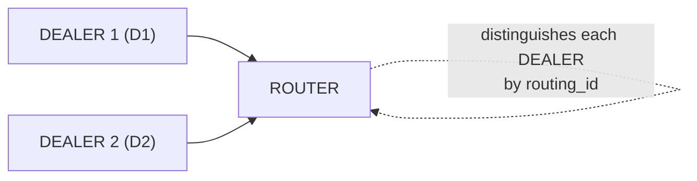

[English](03-4-router.md) | [한국어](03-4-router.ko.md)

<!-- zlink-nav:start -->
[← DEALER](03-3-dealer.ko.md) | [STREAM →](03-5-stream.ko.md)
<!-- zlink-nav:end -->

# ROUTER 소켓

## 1. 개요

ROUTER 소켓은 **routing_id 기반 라우팅** 소켓이다.
수신 메시지에 routing_id 프레임을 자동으로 붙이고,
송신할 때는 첫 번째 프레임의 routing_id로 대상 피어를 지정한다.

**핵심 특성:**
- 수신 시 routing_id 프레임 자동 추가 (메시지 출처 식별)
- 송신 시 첫 프레임으로 대상 피어 지정 (특정 클라이언트에게 응답)
- 다중 피어 관리 가능 (서버/브로커 역할)

**유효한 소켓 조합:** ROUTER ↔ DEALER, ROUTER ↔ ROUTER



> A->RC, B->RA, C->RB ... routing_id로 대상 지정

```c
void *router = zlink_socket(ctx, ZLINK_SOCKET_ROUTER);

/* TCP */
zlink_bind(router, "tcp://127.0.0.1:5558");

/* IPC (Linux/macOS) */
zlink_bind(router, "ipc:///tmp/router.ipc");

/* inproc (same process) */
zlink_bind(router, "inproc://router");

/* DEALERs connect via each transport -- ROUTER manages them uniformly by routing_id */
```

```c
/* Explicit routing_id -- remains the same across reconnections */
zlink_set_routing_id(dealer, "stable-id", 9);
```

## 2. 기본 사용법

### 생성 및 바인드

```c
void *router = zlink_socket(ctx, ZLINK_SOCKET_ROUTER);
zlink_bind(router, "tcp://*:5558");
```

### 메시지 수신

ROUTER 의 수신 진입점은 하나다. 모든 inbound routed 트래픽은
`zlink_router_recv()` 로 가져온다. 이 함수는 일반 ROUTER 트래픽(DEALER
또는 다른 ROUTER) 과 SPOT 에서 시작된 routed 트래픽을 같은 형태로
전달한다. 일반 ROUTER 트래픽에서는 `source_spot_rid` 가 빈 라우팅 ID,
`request_seq == 0` 이다. 서버 루프는 poller 의 `ZLINK_POLLIN` 을
관찰한 뒤 `zlink_router_recv()` 로 메시지를 꺼낸다.

```c
const zlink_routing_id_t *source_node_rid;
const zlink_routing_id_t *source_spot_rid;
uint64_t request_seq;
zlink_msg_t *parts = NULL;
size_t part_count = 0;
zlink_recv_result_t rc = zlink_router_recv(
    router,
    &source_node_rid, &source_spot_rid,
    &request_seq,
    &parts, &part_count,
    0 /* flags */);
if (rc == ZLINK_RECV_OK) {
    /* 일반 ROUTER: source_spot_rid->size == 0, request_seq == 0 */
    printf("From [%.*s]: %.*s\n",
           (int)source_node_rid->size, source_node_rid->data,
           (int)zlink_msg_size(&parts[0]),
           (char *)zlink_msg_data(&parts[0]));
    zlink_multipart_close(parts, part_count);
}
```

> ROUTER 핸들에 `zlink_recv()` 를 호출하면 `ZLINK_RECV_NOT_SUPPORTED` 로
> 실패한다. ROUTER 는 `zlink_router_recv()` 로 수신한다. request-reply의
> reply는 여기서 받지 않고 `zlink_router_request()` 의 응답 완료 콜백으로
> 별도 전달된다.

### 메시지 송신

일반 ROUTER 메시지에 응답할 때는 `zlink_send_rid` 에 콜백의
`source_node_rid` 를 전달한다. request-reply 응답은 `source_node_rid` 와
`request_seq` 를 전달해 `zlink_router_reply()` 로 보낸다.

```c
/* Reply using source_node_rid from the callback */
zlink_msg_t reply;
zlink_msg_init_size(&reply, 5);
memcpy(zlink_msg_data(&reply), "World", 5);
zlink_send_rid(router, source_node_rid, &reply, 1, 0);
```

> 피어별 송신 큐가 가득 차면(HWM, 고수위 표시: 큐에 넣을 수 있는 최대 메시지 수)
> `ROUTER_MANDATORY=1`(기본값)이면 `ZLINK_SUBMIT_BACKPRESSURED` 를 반환한다.
> 미지/도달 불가 routing_id 로 보내면 `ZLINK_SUBMIT_NOT_CONNECTED` 를 반환한다.
> 호출자가 명시적으로 `ROUTER_MANDATORY` 를 `0` 으로 끄면 미도달 메시지를 조용히 드롭한다.
> 고급 배압(backpressure, 수신 측이 처리를 못 따라갈 때 송신 측을 늦추는 흐름 제어) 패턴은
> [성능 가이드](10-performance.ko.md)를 참고.

## 3. 사용 예제

ROUTER 는 `zlink_send_rid()` 로 특정 피어에 전송하고,
`zlink_router_recv()` 가 반환하는 `source_node_rid` 로 송신자를 식별한다.

### recv 루프에서 수신/응답

```c
/* poller 루프 내부에서 zlink_router_recv() 로 드레인 후 응답한다 */
const zlink_routing_id_t *source_node_rid;
const zlink_routing_id_t *source_spot_rid;
uint64_t request_seq;
zlink_msg_t *parts = NULL;
size_t part_count = 0;

if (zlink_router_recv(router,
                      &source_node_rid, &source_spot_rid,
                      &request_seq,
                      &parts, &part_count, 0) == ZLINK_RECV_OK) {
    zlink_msg_t reply;
    zlink_msg_init_size(&reply, 5);
    memcpy(zlink_msg_data(&reply), "reply", 5);
    zlink_send_rid(router, source_node_rid, &reply, 1, 0);

    zlink_multipart_close(parts, part_count);
}
```

## 4. 소켓 옵션

| 옵션 | 타입 | 기본값 | 설명 |
|------|------|--------|------|
| `ZLINK_ROUTER_OPT_MANDATORY` | int | 1 | 미도달 시 `ZLINK_SUBMIT_NOT_CONNECTED` 반환. 기본값이 `1` 이므로 `zlink_send_rid()` 로 미연결 피어를 지정하면 실패가 호출자에게 반환된다. 조용한 드롭이 필요하면 `0` 으로 설정한다. |
| `ZLINK_OPT_RID_DUPLICATE_POLICY` | int | `ZLINK_RID_DUPLICATE_REJECT` | routing_id 충돌 시 기존 pipe(두 소켓을 연결하는 내부 메시지 채널)를 유지할지 새 pipe가 인수할지 정한다. |
| `ZLINK_ROUTER_OPT_REQUEST_TIMEOUT_MS` | int | 5000 | `zlink_router_request()` 기본 timeout(ms). 설정/호출 인자로 `0`을 주면 구현 기본값 `5000ms`로 해석 |
| `zlink_set_routing_id()` | binary | 자동(UUID) | ROUTER 자신의 routing_id (전용 함수) |
| `ZLINK_OPT_SNDHWM` | int | 자동 | ROUTER의 routed 역할에 맞춰 산정된 자동 HWM. 수동 설정 시 우선 |
| `ZLINK_OPT_RCVHWM` | int | 자동 | ROUTER의 routed 역할에 맞춰 산정된 자동 HWM. 수동 설정 시 우선 |
| `ZLINK_OPT_LINGER` | int | -1 | close 시 대기 시간 (ms) |

### ROUTER_MANDATORY

`ZLINK_ROUTER_OPT_MANDATORY` 의 기본값은 `1` 이다. 도달할 수 없는 피어로
`zlink_send_rid()` 를 보내면 조용히 드롭하지 않고
`ZLINK_SUBMIT_NOT_CONNECTED` 를 반환한다. 호출자가 `NOT_CONNECTED` 를
처리하거나 재시도나 에러 로그로 남길 기회가 생긴다.

```c
/* 기본 상태 (MANDATORY=1) */
zlink_routing_id_t target_rid = { .data = "UNKNOWN", .size = 7 };
zlink_msg_t msg;
zlink_msg_init_size(&msg, 4);
memcpy(zlink_msg_data(&msg), "data", 4);
zlink_submit_result_t rc = zlink_send_rid(
    router, &target_rid, &msg, 1, 0);
/* rc == ZLINK_SUBMIT_NOT_CONNECTED */

/* 조용한 drop 동작이 필요하면 명시적으로 0 으로 설정 */
int mandatory = 0;
zlink_set_router_option(router, ZLINK_ROUTER_OPT_MANDATORY,
                        &mandatory, sizeof(mandatory));
```

> **관찰 가능한 동작:** `MANDATORY=1` 기본값에서는 writable / `ZLINK_POLLOUT`
> 관찰값이 실제로 쓸 수 있는 피어가 있을 때만 send-recovery 준비 상태로
> 드러난다. 같은 routing_id를 가진 피어가 들어오면 기본값에서는 기존 pipe를
> 유지하고 새 중복 pipe는 등록하지 않는다. 피어가
> 들고 날 때 `send_rid` 가 `NOT_CONNECTED` 를 반환하는 일이 흔하다.

> 참고: `core/tests/integration/test_router_mandatory.cpp` — `test_basic()`

### 4.1 request-reply 서버와 클라이언트 역할

`ROUTER` 는 request-reply 에서 두 역할을 모두 맡을 수 있다.

- 서버 역할: `zlink_router_recv()` 로 request 를 받고
  `zlink_router_reply()` 로 응답
- 능동 클라이언트 역할: `zlink_router_request()` 로 특정 피어에 요청. reply 는
  `zlink_reply_handler_fn` 완료 콜백으로 별도 전달

가장 중요한 값은 `source_node_rid + request_seq` 조합이다. `request_seq`
만 맞고 source 가 다르면 같은 요청의 reply 로 보면 안 된다. 일반 ROUTER
request-reply 에서는 `source_spot_rid` 가 빈 routing id(`size == 0`)를 가리키며,
SPOT 에서 시작된 요청일 때만 spot rid 가 채워진다.

> ZMP request-reply envelope wire 형식은
> [ZMP 프로토콜](../internals/protocol-zmp.ko.md)을 참고.
> ROUTER dispatch 내부 구조는
> [서비스 내부 설계](../internals/services-internals.ko.md)를 참고.

```c
/* 서버 루프: poller 로 READABLE 을 관찰한 뒤 router_recv 로 드레인 */
const zlink_routing_id_t *source_node_rid;
const zlink_routing_id_t *source_spot_rid;
uint64_t request_seq;
zlink_msg_t *parts = NULL;
size_t part_count = 0;

if (zlink_router_recv(router,
                      &source_node_rid, &source_spot_rid,
                      &request_seq,
                      &parts, &part_count, 0) == ZLINK_RECV_OK) {
    /* 일반 ROUTER request: source_spot_rid->size == 0, request_seq > 0.
       SPOT 에서 시작된 request 라면 spot rid 가 채워지며, 이때는
       zlink_router_reply_spot() 로 응답한다. */
    zlink_multipart_close(parts, part_count);

    zlink_msg_t reply;
    zlink_msg_init_size(&reply, 4);
    memcpy(zlink_msg_data(&reply), "pong", 4);
    zlink_router_reply(router, source_node_rid, request_seq, &reply, 1);
}
```

`ROUTER` 가 먼저 request 를 시작할 때는 응답 콜백을 받는다.

```c
static void on_router_reply(zlink_request_result_t result,
                            zlink_msg_t *parts,
                            size_t part_count,
                            void *userdata)
{
    if (result == ZLINK_REQUEST_OK)
        zlink_multipart_close(parts, part_count);
    /* 그 밖의 result 값: ZLINK_REQUEST_TIMED_OUT, NOT_FOUND,
       TERMINATED, PROTOCOL_ERROR */
}

/* 시그니처: zlink_router_request(router, peer_rid, parts, count,
   handler, userdata, flags, timeout_ms) */
zlink_submit_result_t rc = zlink_router_request(
    router, target_rid, &req, 1,
    on_router_reply, NULL, 0 /* flags */, 2500 /* timeout_ms */);
if (rc != ZLINK_SUBMIT_OK) { /* submit 실패 처리 */ }
```

**주의:** ROUTER 의 inbound routed delivery 는 `zlink_router_recv()` 로만
받는다. `zlink_router_request()` 의 reply 는 별도 완료 콜백으로 전달되며
data-plane receive 와 섞이지 않는다. `zlink_router_recv()`
는 SPOT 에서 시작된 routed 트래픽도 같은 표면으로 전달한다.
`source_spot_rid` 가 채워져 있으면 `zlink_router_reply_spot()` 으로
응답한다. [SPOT 가이드](07-3-spot.ko.md) 참고.

## 5. 사용 패턴

### 패턴 1: ROUTER ↔ ROUTER mesh/클러스터

ROUTER의 핵심 패턴이다. N개 노드가 각각 상대의 routing_id를 지정해 특정 노드에 전송한다.
1:1이면 DEALER로 충분하므로, ROUTER ↔ ROUTER는 N개 이상 노드 간 통신에서 의미가 있다.

```c
/* DEALER connects and sends initial message */
void *dealer = zlink_socket(ctx, ZLINK_SOCKET_DEALER);
zlink_set_routing_id(dealer, "X", 1);
zlink_connect(dealer, endpoint);
zlink_msg_t hello;
zlink_msg_init_size(&hello, 5);
memcpy(zlink_msg_data(&hello), "Hello", 5);
zlink_send(dealer, &hello, 1, 0);

/* Router: poller 루프에서 router_recv 로 첫 메시지를 받고 "Welcome" 을 회신.
   source_node_rid->data == "X" 이므로 이후부터 "X" 로 안전하게 전송 가능 */
```

```c
/* Server: ROUTER recv loop */
void *router = zlink_socket(ctx, ZLINK_SOCKET_ROUTER);
zlink_bind(router, "tcp://127.0.0.1:*");

/* poller 등록 후 루프에서:
   while (running) {
       if (readable(router)) {
           zlink_router_recv(router, &src_node, &src_spot, &seq,
                             &parts, &n, 0);
           zlink_msg_t reply;
           zlink_msg_init_size(&reply, 5);
           memcpy(zlink_msg_data(&reply), "reply", 5);
           zlink_send_rid(router, src_node, &reply, 1, 0);
           zlink_multipart_close(parts, n);
       }
   } */

char endpoint[256];
size_t len = sizeof(endpoint);
zlink_get_option(router, ZLINK_OPT_LAST_ENDPOINT, endpoint, &len);

/* Client 1 */
void *d1 = zlink_socket(ctx, ZLINK_SOCKET_DEALER);
/* Receive replies with zlink_recv() */
zlink_set_routing_id(d1, "D1", 2);
zlink_connect(d1, endpoint);

/* Client 2 */
void *d2 = zlink_socket(ctx, ZLINK_SOCKET_DEALER);
/* Receive replies with zlink_recv() */
zlink_set_routing_id(d2, "D2", 2);
zlink_connect(d2, endpoint);

/* Each client sends a message -- router_recv returns source_node_rid */
zlink_msg_t m1;
zlink_msg_init_size(&m1, 7);
memcpy(zlink_msg_data(&m1), "from_d1", 7);
zlink_send(d1, &m1, 1, 0);

zlink_msg_t m2;
zlink_msg_init_size(&m2, 7);
memcpy(zlink_msg_data(&m2), "from_d2", 7);
zlink_send(d2, &m2, 1, 0);

/* Each DEALER drains replies with zlink_recv() in its own poller loop */
```

> ROUTER ↔ ROUTER는 브로커, 클러스터 노드 간 mesh 통신에 적합하다.
> 모든 노드가 능동적으로 대상을 routing_id로 지정할 수 있다.

### 패턴 2: DEALER → ROUTER 로드밸런싱 요청-응답

DEALER ↔ ROUTER 조합의 핵심 장점:
- **DEALER 측**: 라운드 로빈(순환 분배)으로 여러 ROUTER 중 하나를 자동 선택 → 부하 분산
- **ROUTER 측**: routing_id로 요청을 보낸 DEALER를 정확히 식별 → 응답 라우팅

```
                                    +----------+
                        +-- send -->| ROUTER A |
                        |           +----------+
  +----------+          |           +----------+
  | DEALER 1 |----------+-- send -->| ROUTER B |    라운드 로빈
  |   (D1)   |          |           +----------+    (순환 분배)
  +----------+          |           +----------+
                        +-- send -->| ROUTER C |
                                    +----------+

  +----------+
  | DEALER 2 |-------- (동일하게 A, B, C에 라운드 로빈)
  |   (D2)   |
  +----------+

  ROUTER가 요청한 DEALER에 응답:

  +----------+    ① send         +----------+
  | DEALER 1 |------------------>| ROUTER B |
  |   (D1)   |<------------------+          |
  +----------+    ② send_rid     +----------+
                   source_rid="D1"
```

```c
void *router = zlink_socket(ctx, ZLINK_SOCKET_ROUTER);
zlink_bind(router, "tcp://*:5558");

/* 기본 동작(MANDATORY=1): 도달 불가 peer 전송 시 실패가 반환된다 */
zlink_routing_id_t bad_rid = { .data = "UNKNOWN", .size = 7 };
zlink_msg_t msg;
zlink_msg_init_size(&msg, 4);
memcpy(zlink_msg_data(&msg), "DATA", 4);
zlink_submit_result_t rc = zlink_send_rid(router, &bad_rid, &msg, 1, 0);
if (rc == ZLINK_SUBMIT_NOT_CONNECTED) {
    /* Target "UNKNOWN" not found -- 호출자가 재시도/로그 등을 결정 */
}

/* 조용한 drop 이 필요하면 MANDATORY 를 끈다 */
int disable_mandatory = 0;
zlink_set_router_option(router, ZLINK_ROUTER_OPT_MANDATORY,
                        &disable_mandatory, sizeof(disable_mandatory));
```

### 패턴 3: ROUTER ↔ ROUTER 가중치 라우팅

DEALER → ROUTER는 기본적으로 균등 라운드 로빈이다(`ZLINK_DEALER_OPT_WEIGHT`로
피어별 분배 비율은 조정 가능하지만 메시지 단위로 경로를 고를 수는 없다).
메시지별 경로 선택, 우선순위, 조건부 라우팅이 필요하면 ROUTER ↔ ROUTER로
구성하고 애플리케이션이 routing_id를 직접 선택한다.

```
  DEALER → ROUTER (균등 라운드 로빈, 가중치로 비율 조정 가능):

  +----------+     1/3      +----------+
  |          |-------------->| ROUTER A |
  |  DEALER  |     1/3      +----------+
  |          |-------------->| ROUTER B |    메시지별 선택 불가
  |          |     1/3      +----------+
  |          |-------------->| ROUTER C |
  +----------+              +----------+

  ROUTER ↔ ROUTER (애플리케이션이 대상 직접 선택):

  +----------+     50%      +----------+
  |          |-------------->| ROUTER A |
  |  ROUTER  |     30%      +----------+
  | (client) |-------------->| ROUTER B |    자유롭게 제어
  |          |     20%      +----------+
  |          |-------------->| ROUTER C |
  +----------+              +----------+
```

```c
/* 서버 3대 */
void *sa = zlink_socket(ctx, ZLINK_SOCKET_ROUTER);
zlink_set_routing_id(sa, "SA", 2);
zlink_bind(sa, "tcp://127.0.0.1:5560");
void *sb = zlink_socket(ctx, ZLINK_SOCKET_ROUTER);
zlink_set_routing_id(sb, "SB", 2);
zlink_bind(sb, "tcp://127.0.0.1:5561");
void *sc = zlink_socket(ctx, ZLINK_SOCKET_ROUTER);
zlink_set_routing_id(sc, "SC", 2);
zlink_bind(sc, "tcp://127.0.0.1:5562");

/* 클라이언트 ROUTER: 3개 서버에 connect */
void *client = zlink_socket(ctx, ZLINK_SOCKET_ROUTER);
zlink_set_routing_id(client, "C1", 2);
zlink_connect(client, "tcp://127.0.0.1:5560");
zlink_connect(client, "tcp://127.0.0.1:5561");
zlink_connect(client, "tcp://127.0.0.1:5562");

/* 가중치 테이블: SA=50%, SB=30%, SC=20% */
typedef struct { const char *rid; size_t len; int weight; } route_t;
route_t routes[] = {
    { "SA", 2, 50 }, { "SB", 2, 30 }, { "SC", 2, 20 }
};

/* 가중치 기반 대상 선택 */
int roll = rand() % 100;
route_t *target = (roll < 50)  ? &routes[0]
               : (roll < 80) ? &routes[1]
               :                &routes[2];

zlink_routing_id_t rid = { .data = target->rid, .size = target->len };
zlink_msg_t msg;
zlink_msg_init_size(&msg, 7);
memcpy(zlink_msg_data(&msg), "request", 7);
zlink_send_rid(client, &rid, &msg, 1, 0);

/* 서버 응답: source_rid = "C1"로 클라이언트 식별 가능 */
```

> DEALER → ROUTER의 라운드 로빈이 충분하면 DEALER를 사용하고,
> 분배 로직을 제어해야 하면 ROUTER ↔ ROUTER로 전환한다.

### 패턴 4: 다중 DEALER 서버

여러 DEALER가 하나의 ROUTER에 연결하고, ROUTER는 각 DEALER를 routing_id로 구분한다.

```
  +----------+
  | DEALER 1 |-- send --+
  |   (D1)   |          |
  +----------+          |     +----------+
                        +---->|  ROUTER  |
  +----------+          |     +----------+
  | DEALER 2 |-- send --+         |
  |   (D2)   |              source_rid로
  +----------+              D1, D2 구분
```

```c
void *router = zlink_socket(ctx, ZLINK_SOCKET_ROUTER);
zlink_bind(router, "tcp://127.0.0.1:*");

char endpoint[256];
size_t len = sizeof(endpoint);
zlink_get_option(router, ZLINK_OPT_LAST_ENDPOINT, endpoint, &len);

/* 클라이언트 1 */
void *d1 = zlink_socket(ctx, ZLINK_SOCKET_DEALER);
zlink_set_routing_id(d1, "D1", 2);
zlink_connect(d1, endpoint);

/* 클라이언트 2 */
void *d2 = zlink_socket(ctx, ZLINK_SOCKET_DEALER);
zlink_set_routing_id(d2, "D2", 2);
zlink_connect(d2, endpoint);

/* 각 클라이언트가 메시지 전송 — ROUTER가 source_rid로 구분 */
zlink_msg_t m1;
zlink_msg_init_size(&m1, 7);
memcpy(zlink_msg_data(&m1), "from_d1", 7);
zlink_send(d1, &m1, 1, 0);

zlink_msg_t m2;
zlink_msg_init_size(&m2, 7);
memcpy(zlink_msg_data(&m2), "from_d2", 7);
zlink_send(d2, &m2, 1, 0);
```

> 참고: `core/tests/integration/test_router_multiple_dealers.cpp` — TCP/IPC/inproc 3가지 transport

### 패턴 5: 프록시 패턴 (ROUTER-DEALER)

ROUTER(프론트엔드)와 DEALER(백엔드)를 조합해 멀티스레드 서버를 구축한다.

```
  +----------+                                       +----------+
  | CLIENT 1 |--+                               +--->| WORKER 1 |
  | (DEALER) |  |    +----------+  +----------+ |    | (DEALER) |
  +----------+  +--->|  ROUTER  +-->  DEALER  +-+    +----------+
  +----------+  |    |(frontend)|  |(backend) | |    +----------+
  | CLIENT 2 |--+    +----------+  +----------+ +--->| WORKER 2 |
  | (DEALER) |          proxy()                      | (DEALER) |
  +----------+                                       +----------+
```

```c
void *router = zlink_socket(ctx, ZLINK_SOCKET_ROUTER);
zlink_bind(router, "tcp://*:5558");
```

```c
/* 워커 스레드 */
void worker_thread(void *arg) {
    void on_work(const zlink_routing_id_t *source_rid,
                 zlink_msg_t *parts, size_t part_count,
                 void *userdata)
    {
        /* DEALER backend는 받은 envelope frame을 그대로 보존해 응답한다.
           routed send(zlink_send_rid)는 ROUTER/STREAM 전용이라 DEALER에선 쓸 수 없다. */
        zlink_send(worker, parts, part_count, 0);
    }

    void *worker = zlink_socket(ctx, ZLINK_SOCKET_DEALER);
    /* zlink_recv()로 작업 수신 */
    zlink_connect(worker, "inproc://backend");

    /* 소켓이 닫힐 때까지 워커 유지 */
}
```

> 참고: `core/tests/integration/test_proxy.cpp` — ROUTER(frontend) + DEALER(backend) + 워커 풀

### 패턴 6: ROUTER_MANDATORY로 전송 실패 감지

```
  MANDATORY = 1 (기본):

  +----------+   send_rid      + - - - - - +
  |  ROUTER  +-------X---------  "UNKNOWN"       rc = -1
  +----------+   target=       + - - - - - +    ZLINK_SUBMIT_NOT_CONNECTED
                 "UNKNOWN"

  MANDATORY = 0:

  +----------+   send_rid      + - - - - - +
  |  ROUTER  +---------------->  "UNKNOWN"       조용히 드롭
  +----------+   target=       + - - - - - +    (에러 없음)
                 "UNKNOWN"
```

```c
void *router = zlink_socket(ctx, ZLINK_SOCKET_ROUTER);
zlink_bind(router, "tcp://*:5558");

/* 기본 동작(MANDATORY=1): 미도달 송신이 실패로 드러남 */
zlink_routing_id_t bad_rid = { .data = "UNKNOWN", .size = 7 };
zlink_msg_t msg;
zlink_msg_init_size(&msg, 4);
memcpy(zlink_msg_data(&msg), "DATA", 4);
zlink_submit_result_t rc = zlink_send_rid(router, &bad_rid, &msg, 1, 0);
if (rc == ZLINK_SUBMIT_NOT_CONNECTED) {
    /* 대상 "UNKNOWN"을 찾을 수 없음 — 재시도/로그/폴백 선택 */
}

/* 조용한 드롭이 필요하면 MANDATORY를 명시적으로 끈다 */
int disable_mandatory = 0;
zlink_set_router_option(router, ZLINK_ROUTER_OPT_MANDATORY,
                        &disable_mandatory, sizeof(disable_mandatory));
```

> 참고: `core/tests/integration/test_router_mandatory.cpp` — 기본 드롭 vs MANDATORY 에러

### 패턴 7: 연결 확인 후 전송

DEALER가 먼저 메시지를 전송해 ROUTER에 연결을 알린 뒤, ROUTER가 응답한다.

```
  +----------+    ① "Hello"       +----------+
  |  DEALER  |------------------->|  ROUTER  |
  |   (X)    |<-------------------+          |
  +----------+    ② "Welcome"     +----------+
                   source_rid="X"
```

```c
/* DEALER 연결 및 초기 메시지 전송 */
void *dealer = zlink_socket(ctx, ZLINK_SOCKET_DEALER);
zlink_set_routing_id(dealer, "X", 1);
zlink_connect(dealer, endpoint);
zlink_msg_t hello;
zlink_msg_init_size(&hello, 5);
memcpy(zlink_msg_data(&hello), "Hello", 5);
zlink_send(dealer, &hello, 1, 0);

/* ROUTER: poller 루프 안에서 zlink_router_recv()가
   source_node_rid = "X", parts[0] = "Hello"를 반환하면,
   서버는 zlink_send_rid로 "Welcome"을 응답한다. */
```

> 참고: `core/tests/integration/test_router_mandatory.cpp` — DEALER 연결 → 메시지 → ROUTER 응답

### 패턴 8: 다중 Transport

같은 ROUTER에 여러 transport로 연결할 수 있으며, routing_id로 통합 관리한다.

```
  +----------+                       +----------+
  | DEALER 1 |-- tcp://  ----------->|          |
  +----------+                       |          |
  +----------+                       |  ROUTER  |
  | DEALER 2 |-- ipc://  ----------->|          |
  +----------+                       |          |
  +----------+                       |          |
  | DEALER 3 |-- inproc://  -------->|          |
  +----------+                       +----------+

  transport가 달라도 routing_id로 동일하게 식별
```

```c
void *router = zlink_socket(ctx, ZLINK_SOCKET_ROUTER);

/* TCP */
zlink_bind(router, "tcp://127.0.0.1:5558");

/* IPC (Linux/macOS) */
zlink_bind(router, "ipc:///tmp/router.ipc");

/* inproc (동일 프로세스) */
zlink_bind(router, "inproc://router");

/* 각 transport의 DEALER가 연결 — ROUTER는 routing_id로 통합 관리 */
```

> 참고: `core/tests/integration/test_router_multiple_dealers.cpp` — TCP/IPC/inproc 테스트

## 6. 주의사항

### MANDATORY를 끄면 드롭

`ROUTER_MANDATORY`는 기본적으로 `1`이라 존재하지 않는 routing_id로 전송하면 실패를 반환한다. `0`으로 끄면 그런 메시지가 **조용히 드롭**된다. 프로덕션에서는 기본값(MANDATORY 활성화) 유지를 권장한다.

### 재연결 시 routing_id 변경

DEALER가 재연결하면 자동 생성된 routing_id가 바뀔 수 있다. 안정적인 통신을 위해 명시적 routing_id 설정을 권장한다.

```c
/* 명시적 routing_id — 재연결 시에도 동일 */
zlink_set_routing_id(dealer, "stable-id", 9);
```

### routing_id 충돌

같은 routing_id를 가진 두 DEALER가 동시에 연결되면 기본적으로 두 번째 연결이
거부된다. `ZLINK_OPT_RID_DUPLICATE_POLICY`를
`ZLINK_RID_DUPLICATE_HANDOVER`로 설정하면 같은 방향의 재연결은 새 pipe가 기존
pipe를 대체한다. 양쪽에서 서로 연결해 반대 방향 pipe가 충돌하면 두 피어의
routing_id를 비교해 양쪽이 같은 방향 하나를 선택한다.

> routing_id의 상세 개념은 [08-routing-id.ko.md](08-routing-id.ko.md)를 참고.

### 점진적 유지보수를 위한 가중치

롤링 재시작이나 설정 리로드 직전, 로컬 ROUTER의 가중치를 `0`으로
바꿔 원격 피어들이 이 ROUTER를 새 아웃바운드 대상으로 선택하지 않게
만들 수 있다.

```c
/* 유지보수 진입: 가중치 0으로 전환 */
int drain_weight = 0;
zlink_set_router_option(
  router, ZLINK_ROUTER_OPT_WEIGHT, &drain_weight, sizeof(drain_weight));

/* ... in-flight 작업/응답이 소진될 때까지 대기 ... */

/* 재시작 또는 재설정 후 서비스 복귀 */
int serve_weight = 100;
zlink_set_router_option(
  router, ZLINK_ROUTER_OPT_WEIGHT, &serve_weight, sizeof(serve_weight));

/* 현재 가중치 조회 */
int cur = 0;
size_t cur_size = sizeof(cur);
zlink_get_router_option(
  router, ZLINK_ROUTER_OPT_WEIGHT, &cur, &cur_size);
```

가중치 `0`은 로컬 동작을 멈추는 것이 아니라 원격 피어에 전달되는 권고 신호다. 로컬 핸들은
평상시처럼 수신(inbound)을 처리한다. 즉 `zlink_router_recv()`,
`zlink_send_rid()`, `zlink_router_reply()` 모두 정상 동작하므로 진행
중인 요청은 마저 완료한다. 달라지는 부분은 원격 피어가 이
ROUTER 를 새 작업 대상으로 선택하지 않는다는 점이다.

- 원격 DEALER는 이 ROUTER를 라운드 로빈 후보에서 제외한다.
- 원격 ROUTER가 이 RID로 `zlink_send_rid()` 또는
  `zlink_router_request()`를 호출하면 `ZLINK_SUBMIT_NOT_ADMITTED`로
  즉시 실패한다.
- `zlink_router_reply()`는 admission 검사 대상이 아니다. 이미 받은
  request에는 가중치 `0` 상태에서도 응답할 수 있다.

송신 쪽 규칙은 반대 방향에서도 동일하다. 로컬 ROUTER가
`zlink_send_rid()` 또는 `zlink_router_request()`로 원격 RID에 보낼
때, 해당 RID의 광고된 가중치가 `0`이면 `ZLINK_SUBMIT_NOT_ADMITTED`로
실패한다. 가중치 전파는 최선 노력(best-effort) 방식이라 경합 상황에서는 같은 거절이 먼저
`ZLINK_SUBMIT_NOT_CONNECTED`로 관찰될 수도 있다.

일반적인 유지보수 순서:

1. `ZLINK_ROUTER_OPT_WEIGHT`를 `0`으로 설정.
2. In-flight request/reply가 소진될 때까지 대기.
3. 인스턴스 재시작 또는 재설정.
4. `ZLINK_ROUTER_OPT_WEIGHT`를 다시 양수 값으로 설정. 보통 `100`.

연결된 피어의 가중치 변화는 소켓 모니터의
`ZLINK_EVENT_PEER_WEIGHT_CHANGED`로 전달된다. 이벤트 형태는
[모니터링 가이드](06-monitoring.ko.md)의 "피어 가중치 변화 감지"
섹션을 참고.

## 8. ROUTER와 서비스 계층의 경계

raw ROUTER는 범용 소켓 계약만 가진다.

- MeshNode는 자기 소유 ROUTER 하나로 mesh peer와만 통신하며, raw ROUTER
  socket을 서비스 평면의 ingress로 등록하는 공개 API는 없다.
- 외부 프로세스가 mesh 서비스에 닿는 경로는 framework client API 또는 STREAM
  session([07-4 Actor 가이드](07-4-actor.ko.md) §4)이다.

> 상세 규약은 ROUTER spec
> [07-router.ko.md](../spec/core/socket/07-router.ko.md)를 참고.

---
[← DEALER](03-3-dealer.ko.md) | [STREAM →](03-5-stream.ko.md)

## 언어별 완전한 예제

ROUTER가 DEALER 요청을 수신하고 source 라우팅 ID로 응답하는 자립형 예제다(모든 바인딩, 빌드·실행 검증됨).

=== "C++"

    ```cpp
    --8<-- "bindings/cpp/samples/dealer_router_recv_sample.cpp:doc"
    ```

=== "C#/.NET"

    ```csharp
    --8<-- "bindings/dotnet/samples/DealerRouterRecv/Program.cs:doc"
    ```

=== "Java"

    ```java
    --8<-- "bindings/java/samples/Zlink.Samples/src/main/java/systems/zlink/samples/DealerRouterRecvSample.java:doc"
    ```

=== "Kotlin"

    ```kotlin
    --8<-- "bindings/kotlin/samples/src/main/kotlin/systems/zlink/samples/DealerRouterRecvSample.kt:doc"
    ```

=== "Python"

    ```python
    --8<-- "bindings/python/samples/dealer_router_recv_sample.py:doc"
    ```

=== "Node/TypeScript"

    ```typescript
    --8<-- "bindings/node/samples/dealer_router_recv_sample.ts:doc"
    ```

=== "JavaScript"

    ```javascript
    --8<-- "bindings/javascript/samples/dealer_router_recv_sample.js:doc"
    ```

=== "Go"

    ```go
    --8<-- "bindings/go/samples/dealer_router_recv_sample/main.go:doc"
    ```

=== "Rust"

    ```rust
    --8<-- "bindings/rust/samples/dealer_router_recv_sample.rs:doc"
    ```

---
<!-- zlink-nav:bottom:start -->
[← DEALER](03-3-dealer.ko.md) | [STREAM →](03-5-stream.ko.md)
<!-- zlink-nav:bottom:end -->
