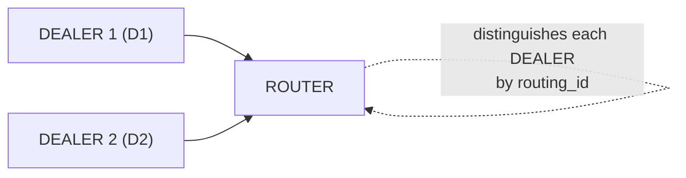

[English](03-4-router.md) | [한국어](03-4-router.ko.md)

<!-- zlink-nav:start -->
[← DEALER](03-3-dealer.md) | [STREAM →](03-5-stream.md)
<!-- zlink-nav:end -->

# ROUTER Socket

## 1. Overview

The ROUTER socket is a **routing_id-based routing** socket. It automatically prepends a routing_id frame to received messages, and when sending, it uses the first frame's routing_id to specify the target peer.

**Key characteristics:**
- Automatically adds a routing_id frame on receive (identifies message origin)
- Specifies the target peer via the first frame on send (replies to a specific client)
- Can manage multiple peers (server/broker role)

**Valid socket combinations:** ROUTER ↔ DEALER, ROUTER ↔ ROUTER



## 2. Basic Usage

### Creation and Bind

```c
void *router = zlink_socket(ctx, ZLINK_SOCKET_ROUTER);
zlink_bind(router, "tcp://*:5558");
```

### Receiving Messages

ROUTER has a single direct receive surface. All inbound routed traffic
is drained through `zlink_router_recv()`. It delivers both plain ROUTER
traffic (from a DEALER or another ROUTER) and SPOT-originated routed
traffic with the same output shape. Plain ROUTER traffic sets
`source_spot_rid` to an empty routing id and `request_seq == 0`. The
intended pattern is to observe `ZLINK_POLLIN` from a poller and drain
with `zlink_router_recv()`.

```c
const zlink_routing_id_t *source_node_rid;
const zlink_routing_id_t *source_spot_rid;
uint64_t request_seq;
zlink_msg_t *parts = NULL;
size_t part_count = 0;
zlink_recv_result_t rc = zlink_router_recv(
    router,
    &source_node_rid, &source_spot_rid,
    &request_seq,
    &parts, &part_count,
    0 /* flags */);
if (rc == ZLINK_RECV_OK) {
    /* Plain ROUTER: source_spot_rid->size == 0, request_seq == 0 */
    printf("From [%.*s]: %.*s\n",
           (int)source_node_rid->size, source_node_rid->data,
           (int)zlink_msg_size(&parts[0]),
           (char *)zlink_msg_data(&parts[0]));
    zlink_multipart_close(parts, part_count);
}
```

> `zlink_recv()` on a ROUTER handle fails with `ZLINK_RECV_NOT_SUPPORTED`.
> ROUTER uses `zlink_router_recv()`. Replies to `zlink_router_request()`
> are not delivered here; they are delivered through a separate reply
> completion callback.

### Sending Messages

When replying to a plain ROUTER message, use `zlink_send_rid` with the
`source_node_rid` to specify the target. For request-reply, use
`zlink_router_reply()` with `source_node_rid` and `request_seq`.

```c
/* Reply using source_node_rid from the router_recv output */
zlink_msg_t reply;
zlink_msg_init_size(&reply, 5);
memcpy(zlink_msg_data(&reply), "World", 5);
zlink_send_rid(router, source_node_rid, &reply, 1, 0);
```

> When the per-peer send queue is full (HWM), with the default
> `ROUTER_MANDATORY=1` ROUTER returns `ZLINK_SUBMIT_BACKPRESSURED`; sending
> to an unknown/unreachable routing_id returns `ZLINK_SUBMIT_NOT_CONNECTED`.
> If the caller explicitly sets `ROUTER_MANDATORY=0`, undeliverable messages
> are silently dropped. For advanced backpressure patterns, see
> [Performance Guide](10-performance.md).

## 3. Usage Examples

ROUTER uses `zlink_send_rid()` to send to a specific peer, and
identifies the sender via the `source_node_rid` returned by
`zlink_router_recv()`.

### Receive/Reply Using recv Loop

```c
/* Inside a poller loop: drain router_recv, reply with zlink_send_rid */
const zlink_routing_id_t *source_node_rid;
const zlink_routing_id_t *source_spot_rid;
uint64_t request_seq;
zlink_msg_t *parts = NULL;
size_t part_count = 0;

if (zlink_router_recv(router,
                      &source_node_rid, &source_spot_rid,
                      &request_seq,
                      &parts, &part_count, 0) == ZLINK_RECV_OK) {
    /* Plain ROUTER traffic: source_spot_rid->size == 0, request_seq == 0.
       Reply with zlink_send_rid to the source peer. */
    zlink_msg_t reply;
    zlink_msg_init_size(&reply, 5);
    memcpy(zlink_msg_data(&reply), "reply", 5);
    zlink_send_rid(router, source_node_rid, &reply, 1, 0);

    zlink_multipart_close(parts, part_count);
}
```

## 4. Socket Options

| Option | Type | Default | Description |
|------|------|--------|------|
| `ZLINK_ROUTER_OPT_MANDATORY` | int | 1 | Return `ZLINK_SUBMIT_NOT_CONNECTED` for undeliverable messages. With the default of `1`, `zlink_send_rid()` to an unconnected peer surfaces the failure. Set to `0` explicitly to silently drop instead. |
| `ZLINK_OPT_RID_DUPLICATE_POLICY` | int | `ZLINK_RID_DUPLICATE_REJECT` | Controls whether duplicate routing_id arrivals keep the existing pipe or let the new pipe take over. |
| `ZLINK_ROUTER_OPT_REQUEST_TIMEOUT_MS` | int | 0 | Default timeout for `zlink_router_request()`. `0` uses the implementation default of `5000ms` |
| `zlink_set_routing_id()` | binary | Auto (UUID) | The ROUTER's own routing_id (dedicated function) |
| `ZLINK_OPT_SNDHWM` | int | automatic | Auto-HWM sized for ROUTER's routed role. Manual settings take precedence |
| `ZLINK_OPT_RCVHWM` | int | automatic | Auto-HWM sized for ROUTER's routed role. Manual settings take precedence |
| `ZLINK_OPT_LINGER` | int | -1 | Wait time on close (ms) |

### ROUTER_MANDATORY

`ZLINK_ROUTER_OPT_MANDATORY` defaults to `1`. A `zlink_send_rid()` to an
unreachable peer returns `ZLINK_SUBMIT_NOT_CONNECTED` instead of silently
dropping, giving the caller a chance to log, retry, or fall back.

```c
/* Default behavior (MANDATORY=1) */
zlink_routing_id_t target_rid = { .data = "UNKNOWN", .size = 7 };
zlink_msg_t msg;
zlink_msg_init_size(&msg, 4);
memcpy(zlink_msg_data(&msg), "data", 4);
zlink_submit_result_t rc = zlink_send_rid(
    router, &target_rid, &msg, 1, 0);
/* rc == ZLINK_SUBMIT_NOT_CONNECTED */

/* Opt in to silent-drop behavior by setting MANDATORY=0 */
int mandatory = 0;
zlink_set_router_option(router, ZLINK_ROUTER_OPT_MANDATORY,
                        &mandatory, sizeof(mandatory));
```

> **Observable behavior:** with `MANDATORY=1`, ROUTER's writable /
> `ZLINK_POLLOUT` observation surfaces send-recovery readiness only while
> a reachable peer exists. With the default duplicate policy, a duplicate
> peer identity keeps the existing pipe and the duplicate pipe is not registered. `NOT_CONNECTED`
> from `send_rid` is therefore a common return path when peers come and
> go.

> Reference: `core/tests/integration/test_router_mandatory.cpp` -- `test_basic()`

### 4.1 Request-Reply Server and Client Roles

ROUTER can play both roles in request-reply:

- **Server role**: drain requests with `zlink_router_recv()` and reply
  with `zlink_router_reply()`
- **Active client role**: initiate requests with `zlink_router_request()`
  to a specific peer; the reply is delivered through a
  `zlink_reply_handler_fn` completion callback

The key identifier is the `source_node_rid + request_seq` combination.
A reply must match both values -- the same `request_seq` from a different
source is not the same request. For plain ROUTER request-reply,
`source_spot_rid` points to an empty routing id (`size == 0`); the spot
routing id is only populated for SPOT-originated traffic.

> For the ZMP request-reply envelope wire format, see
> [ZMP Protocol](../internals/protocol-zmp.md).
> For ROUTER dispatch internals, see
> [Services Internals](../internals/services-internals.md).

#### Server: Receive Requests and Reply

```c
/* Server loop: watch the poller for readable, then drain with router_recv */
const zlink_routing_id_t *source_node_rid;
const zlink_routing_id_t *source_spot_rid;
uint64_t request_seq;
zlink_msg_t *parts = NULL;
size_t part_count = 0;

if (zlink_router_recv(router,
                      &source_node_rid, &source_spot_rid,
                      &request_seq,
                      &parts, &part_count, 0) == ZLINK_RECV_OK) {
    /* Plain ROUTER request: source_spot_rid->size == 0, request_seq > 0.
       For SPOT-originated requests the spot rid is also populated;
       reply via zlink_router_reply_spot() in that case. */
    zlink_multipart_close(parts, part_count);

    zlink_msg_t reply;
    zlink_msg_init_size(&reply, 4);
    memcpy(zlink_msg_data(&reply), "pong", 4);
    zlink_router_reply(router, source_node_rid, request_seq, &reply, 1);
}
```

#### Client: Initiate Request

When ROUTER initiates a request, the reply is delivered via callback.

```c
static void on_router_reply(zlink_request_result_t result,
                            zlink_msg_t *parts,
                            size_t part_count,
                            void *userdata)
{
    if (result == ZLINK_REQUEST_OK)
        zlink_multipart_close(parts, part_count);
    /* other result values: ZLINK_REQUEST_TIMED_OUT, NOT_FOUND,
       TERMINATED, PROTOCOL_ERROR */
}

/* signature: zlink_router_request(router, peer_rid, parts, count,
   handler, userdata, flags, timeout_ms) */
zlink_submit_result_t rc = zlink_router_request(
    router, target_rid, &req, 1,
    on_router_reply, NULL, 0 /* flags */, 2500 /* timeout_ms */);
if (rc != ZLINK_SUBMIT_OK) { /* handle submit failure */ }
```

**Note:** ROUTER's inbound routed delivery is received only through
`zlink_router_recv()`. Replies to `zlink_router_request()` are delivered
on a separate completion-callback axis and are not mixed with data-plane
receive. `zlink_router_recv()` also carries SPOT-originated routed
traffic; when `source_spot_rid` is populated, reply with
`zlink_router_reply_spot()`. See [SPOT Guide](07-3-spot.md).

## 5. Usage Patterns

### Pattern 1: Multi-DEALER Server

The most basic ROUTER pattern. Distinguishes multiple DEALER clients by routing_id.

```c
/* Server: ROUTER uses a recv loop */
void *router = zlink_socket(ctx, ZLINK_SOCKET_ROUTER);
zlink_bind(router, "tcp://127.0.0.1:*");

char endpoint[256];
size_t len = sizeof(endpoint);
zlink_get_option(router, ZLINK_OPT_LAST_ENDPOINT, endpoint, &len);

/* Inside a poller loop:
   while (running) {
       if (readable(router)) {
           zlink_router_recv(router, &src_node, &src_spot, &seq,
                             &parts, &n, 0);
           zlink_msg_t reply;
           zlink_msg_init_size(&reply, 5);
           memcpy(zlink_msg_data(&reply), "reply", 5);
           zlink_send_rid(router, src_node, &reply, 1, 0);
           zlink_multipart_close(parts, n);
       }
   } */

/* Client 1 */
void *d1 = zlink_socket(ctx, ZLINK_SOCKET_DEALER);
/* DEALER receives replies via zlink_recv() */
zlink_set_routing_id(d1, "D1", 2);
zlink_connect(d1, endpoint);

/* Client 2 */
void *d2 = zlink_socket(ctx, ZLINK_SOCKET_DEALER);
zlink_set_routing_id(d2, "D2", 2);
zlink_connect(d2, endpoint);

/* Each client sends a message -- router_recv returns source_node_rid */
zlink_msg_t m1;
zlink_msg_init_size(&m1, 7);
memcpy(zlink_msg_data(&m1), "from_d1", 7);
zlink_send(d1, &m1, 1, 0);

zlink_msg_t m2;
zlink_msg_init_size(&m2, 7);
memcpy(zlink_msg_data(&m2), "from_d2", 7);
zlink_send(d2, &m2, 1, 0);

/* Each DEALER drains replies with zlink_recv() in its own poller loop */
```

> Reference: `core/tests/integration/test_router_multiple_dealers.cpp` -- TCP/IPC/inproc across 3 transports

### Pattern 2: Detecting Send Failures with ROUTER_MANDATORY

```c
void *router = zlink_socket(ctx, ZLINK_SOCKET_ROUTER);
zlink_bind(router, "tcp://*:5558");

/* Default behavior (MANDATORY=1): undeliverable sends surface as failures */
zlink_routing_id_t bad_rid = { .data = "UNKNOWN", .size = 7 };
zlink_msg_t msg;
zlink_msg_init_size(&msg, 4);
memcpy(zlink_msg_data(&msg), "DATA", 4);
zlink_submit_result_t rc = zlink_send_rid(router, &bad_rid, &msg, 1, 0);
if (rc == ZLINK_SUBMIT_NOT_CONNECTED) {
    /* Target "UNKNOWN" not found -- caller chooses retry/log/fallback */
}

/* If silent-drop behavior is desired, explicitly disable MANDATORY */
int disable_mandatory = 0;
zlink_set_router_option(router, ZLINK_ROUTER_OPT_MANDATORY,
                        &disable_mandatory, sizeof(disable_mandatory));
```

> Reference: `core/tests/integration/test_router_mandatory.cpp` -- default drop vs MANDATORY error

### Pattern 3: Send After Confirming Connection

DEALER sends a message first to notify ROUTER of its connection, then ROUTER replies.

```c
/* DEALER connects and sends initial message */
void *dealer = zlink_socket(ctx, ZLINK_SOCKET_DEALER);
zlink_set_routing_id(dealer, "X", 1);
zlink_connect(dealer, endpoint);
zlink_msg_t hello;
zlink_msg_init_size(&hello, 5);
memcpy(zlink_msg_data(&hello), "Hello", 5);
zlink_send(dealer, &hello, 1, 0);

/* ROUTER: inside a poller loop, router_recv returns
   source_node_rid = "X" and parts[0] = "Hello";
   the server then replies with "Welcome" via zlink_send_rid. */
```

> Reference: `core/tests/integration/test_router_mandatory.cpp` -- DEALER connect → message → ROUTER reply

### Pattern 4: Multiple Transports

Multiple transports can be used to connect DEALERs to the same ROUTER.

```c
void *router = zlink_socket(ctx, ZLINK_SOCKET_ROUTER);

/* TCP */
zlink_bind(router, "tcp://127.0.0.1:5558");

/* IPC (Linux/macOS) */
zlink_bind(router, "ipc:///tmp/router.ipc");

/* inproc (same process) */
zlink_bind(router, "inproc://router");

/* DEALERs connect via each transport -- ROUTER manages them uniformly by routing_id */
```

> Reference: `core/tests/integration/test_router_multiple_dealers.cpp` -- TCP/IPC/inproc tests

## 6. Caveats

### Default Drop Behavior

Without `ROUTER_MANDATORY`, sending to a non-existent routing_id **silently drops** the message. Enabling `ROUTER_MANDATORY` is recommended in production.

### routing_id Changes on Reconnect

When a DEALER reconnects, its auto-generated routing_id may change. Setting an explicit routing_id is recommended for stable communication.

```c
/* Explicit routing_id -- remains the same across reconnections */
zlink_set_routing_id(dealer, "stable-id", 9);
```

### routing_id Conflicts

If two DEALERs with the same routing_id connect simultaneously, the second connection is rejected by default. Set `ZLINK_OPT_RID_DUPLICATE_POLICY` to `ZLINK_RID_DUPLICATE_HANDOVER` to replace the existing connection instead.

> For a detailed explanation of routing_id concepts, see [08-routing-id.md](08-routing-id.md).

### Weight for graceful maintenance

Before a ROUTER is taken down for a rolling restart or config reload,
set its local weight to `0` so remote peers stop selecting it for new
outbound:

```c
int drain_weight = 0;
zlink_set_router_option(
  router, ZLINK_ROUTER_OPT_WEIGHT, &drain_weight, sizeof(drain_weight));

/* ... let in-flight work finish / reply ... */

int serve_weight = 100;
zlink_set_router_option(
  router, ZLINK_ROUTER_OPT_WEIGHT, &serve_weight, sizeof(serve_weight));

int cur = 0;
size_t cur_size = sizeof(cur);
zlink_get_router_option(
  router, ZLINK_ROUTER_OPT_WEIGHT, &cur, &cur_size);
```

Weight `0` is a peer-side advisory, not a local halt. The local handle
keeps draining inbound work normally -- `zlink_router_recv()`,
`zlink_send_rid()`, and `zlink_router_reply()` all keep functioning, so
in-flight requests can still be completed. Connected peers simply stop
picking this ROUTER as a target for new work:

- Remote DEALERs drop this ROUTER from their round-robin candidate set.
- Remote ROUTERs that call `zlink_send_rid()` or `zlink_router_request()`
  toward this RID get `ZLINK_SUBMIT_NOT_ADMITTED` right away.
- `zlink_router_reply()` is not blocked by this check; already-received
  requests can still be answered while the local weight is `0`.

The same send-side rule applies in the opposite direction: a local
ROUTER that calls `zlink_send_rid()` or `zlink_router_request()`
targeting a remote RID whose advertised weight is `0`
fails with `ZLINK_SUBMIT_NOT_ADMITTED`. Admission cache propagation is
best-effort, so races may surface the same refusal first as
`ZLINK_SUBMIT_NOT_CONNECTED`.

Typical maintenance pattern:

1. Set `ZLINK_ROUTER_OPT_WEIGHT` to `0`.
2. Wait for in-flight requests/replies to drain.
3. Restart or reconfigure the instance.
4. Set `ZLINK_ROUTER_OPT_WEIGHT` back to a positive value, usually `100`.

Weight transitions on connected peers surface on the socket monitor
as `ZLINK_EVENT_PEER_WEIGHT_CHANGED`; see
[monitoring guide](06-monitoring.md#peer-weight-changes) for the
event shape.

## 8. The boundary between ROUTER and the service layer

In 10.0.0 the raw ROUTER carries only the generic socket contract. The 9.x
route bridge (registering an external router channel as ingress into the SPOT
routed plane) was removed.

- A MeshNode talks to its mesh peers exclusively over its own ROUTER, and
  there is no public API that registers a raw ROUTER socket as a service-plane
  ingress.
- External processes reach mesh services through the framework client APIs or
  through STREAM sessions ([Actor guide](07-4-actor.md) §4).

> For the full contract, see the ROUTER spec
> [07-router.md](../spec/core/socket/07-router.md).

---
[← DEALER](03-3-dealer.md) | [STREAM →](03-5-stream.md)


## Full language examples

=== "C++"

    ```cpp
    --8<-- "bindings/cpp/samples/dealer_router_recv_sample.cpp:doc"
    ```

=== "C#/.NET"

    ```csharp
    --8<-- "bindings/dotnet/samples/DealerRouterRecv/Program.cs:doc"
    ```

=== "Java"

    ```java
    --8<-- "bindings/java/samples/Zlink.Samples/src/main/java/systems/zlink/samples/DealerRouterRecvSample.java:doc"
    ```

=== "Kotlin"

    ```kotlin
    --8<-- "bindings/kotlin/samples/src/main/kotlin/systems/zlink/samples/DealerRouterRecvSample.kt:doc"
    ```

=== "Python"

    ```python
    --8<-- "bindings/python/samples/dealer_router_recv_sample.py:doc"
    ```

=== "Node/TypeScript"

    ```typescript
    --8<-- "bindings/node/samples/dealer_router_recv_sample.ts:doc"
    ```

=== "JavaScript"

    ```javascript
    --8<-- "bindings/javascript/samples/dealer_router_recv_sample.js:doc"
    ```

=== "Go"

    ```go
    --8<-- "bindings/go/samples/dealer_router_recv_sample/main.go:doc"
    ```

=== "Rust"

    ```rust
    --8<-- "bindings/rust/samples/dealer_router_recv_sample.rs:doc"
    ```

---
<!-- zlink-nav:bottom:start -->
[← DEALER](03-3-dealer.md) | [STREAM →](03-5-stream.md)
<!-- zlink-nav:bottom:end -->
