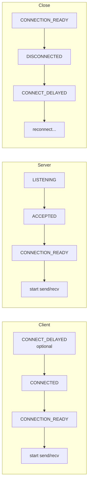
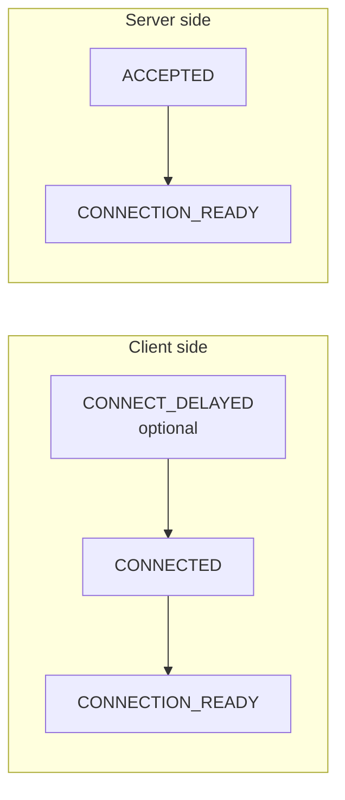
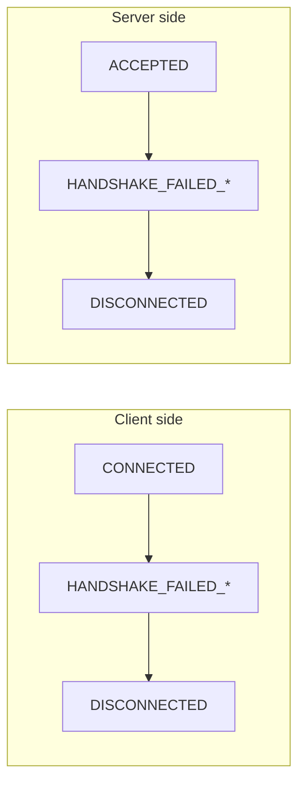
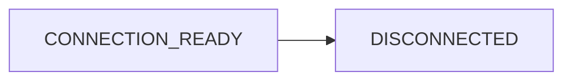
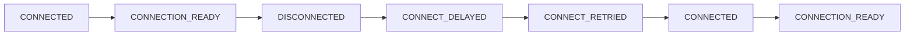

[English](06-monitoring.md) | [한국어](06-monitoring.ko.md)

<!-- zlink-nav:start -->
[← TLS/보안](05-tls-security.ko.md) | [서비스 개요 →](07-0-services.ko.md)
<!-- zlink-nav:end -->

# 모니터링 API 사용법

## 1. 개요

모니터링은 소켓의 연결/해제/핸드셰이크 등 이벤트를 실시간으로 관찰하는 기능이다.
연결 문제 진단, 피어 장애 감지, 애플리케이션 수준 복구 트리거에 활용한다.
직접 수신(recv) 모드와 콜백 모드를 지원한다.

## 2. 모니터 활성화

### 2.1 콜백 모드

이벤트 발생 시 service-control 런타임 스레드(부모 소켓의 I/O 스레드가 아님)에서
핸들러가 호출된다. 콜백 모드는 실시간 처리에 편리하지만, 모니터 전달은 lossy라
부하 시 이벤트가 드롭될 수 있으므로 모든 이벤트 수신을 가정하면 안 된다.

```c
/* Define event handler */
void on_monitor_event(const zlink_monitor_event_t *ev, void *userdata)
{
    printf("Event: 0x%llx\n", (unsigned long long)ev->event);
    printf("Local: %s\n", ev->local_addr);
    printf("Remote: %s\n", ev->remote_addr);

    if (ev->routing_id.size > 0) {
        printf("routing_id: ");
        for (uint8_t i = 0; i < ev->routing_id.size; ++i)
            printf("%02x", ev->routing_id.data[i]);
        printf("\n");
    }
}

void *server = zlink_socket(ctx, ZLINK_SOCKET_ROUTER);
zlink_bind(server, "tcp://*:5555");

/* Create monitor with options */
zlink_socket_monitor_open_options_t opts = { .events = ZLINK_EVENT_ALL };
void *mon = zlink_socket_monitor_open(server, &opts);
zlink_socket_monitor_handler(mon, on_monitor_event, NULL);
```

이벤트 발생 시 `on_monitor_event` 콜백이 자동으로 호출된다.

### 이벤트 구조체

```c
typedef struct {
    uint64_t event;               /* Event type */
    uint64_t value;               /* Auxiliary value (fd, errno, reason, etc.) */
    zlink_routing_id_t routing_id; /* Peer routing_id */
    char local_addr[256];         /* Local address */
    char remote_addr[256];        /* Remote address */
} zlink_monitor_event_t;
```

## 4. 소켓 모니터 이벤트

`zlink_socket_monitor_open()`으로 관찰하는 이벤트다.
기반 소켓(raw socket)의 transport·세션 상태를 알려준다.

### 이벤트 전체 표

| 이벤트 이름 | 값 | 설명 | `value` | 발생 측 |
|---|---|---|---|---|
| `CONNECTION_READY` | `0x1000` | 핸드셰이크 이후 ready edge | reserved | 양쪽 |
| `CONNECTED` | `0x0001` | TCP 연결 성립 (핸드셰이크 전) | fd | 클라이언트 |
| `ACCEPTED` | `0x0020` | 수신 연결 accept | fd | 서버 |
| `DISCONNECTED` | `0x0200` | 세션 종료 | reason 코드 | 양쪽 |
| `LISTENING` | `0x0008` | bind 성공, 수신 대기 중 | fd | 서버 |
| `CLOSED` | `0x0080` | 의도적 close 완료 | fd | 양쪽 |
| `CONNECT_DELAYED` | `0x0002` | 비동기 연결 재시도 예약 | errno | 클라이언트 |
| `CONNECT_RETRIED` | `0x0004` | 비동기 재연결 진행 중 | 재시도 interval (ms) | 클라이언트 |
| `BIND_FAILED` | `0x0010` | bind 실패 | errno | 서버 |
| `ACCEPT_FAILED` | `0x0040` | accept 실패 | errno | 서버 |
| `CLOSE_FAILED` | `0x0100` | close 실패 | errno | 양쪽 |
| `HANDSHAKE_FAILED_NO_DETAIL` | `0x0800` | 핸드셰이크 실패 (일반) | errno | 양쪽 |
| `HANDSHAKE_FAILED_PROTOCOL` | `0x2000` | 프로토콜 오류로 실패 | 에러 코드 | 양쪽 |
| `HANDSHAKE_FAILED_AUTH` | `0x4000` | 인증 실패 | — | 양쪽 |
| `MONITOR_STOPPED` | `0x0400` | 모니터 종료 | — | 양쪽 |
| `PEER_WEIGHT_CHANGED` | `0x8000` | 연결된 피어의 가중치 변화 | 새 `0..100` 가중치 | 양쪽 |

- `CONNECTION_READY`: 모든 소켓에서 `routing_id`에 피어 식별자 포함

### 연결 흐름



### CONNECTION_READY 상세

핸드셰이크 완료 후 발생한다. 이 이벤트를 받으면 즉시 메시지를 보내고 받을 수 있다.
`CONNECTION_READY` 이벤트의 `value` 필드는 예약(reserved)이며, 집계 준비 카운트 계약이 아니다.
준비 상태 판정은 이벤트 에지(edge)와 주체별 이벤트 카운팅으로 한다.

- `ev->routing_id`에는 연결이 전달하는 피어 신원(peer identity)이 담긴다(소켓 타입별 특수 처리 없음).

### DISCONNECTED reason 코드

| 코드 | 이름 | 의미 |
|------|------|------|
| 0 | `UNKNOWN` | 원인 불명 |
| 3 | `HANDSHAKE_FAILED` | 핸드셰이크 실패 |
| 4 | `TRANSPORT_ERROR` | transport 계층 오류 |
| 5 | `CTX_TERM` | 컨텍스트 종료 |

### 프로토콜 에러 코드

`HANDSHAKE_FAILED_PROTOCOL` 발생 시 `value` 필드에 다음 코드 중 하나가 포함된다:

| 상수 | 값 | 설명 |
|------|-----|------|
| `ZLINK_PROTOCOL_ERROR_ZMP_MALFORMED_COMMAND_HELLO` | `0x10000013` | 잘못된 형식의 ZMP HELLO 커맨드. |

### 피어 가중치 변화 감지

ROUTER 또는 DEALER에 연결된 피어가 자기 가중치를 바꾸면
`ZLINK_EVENT_PEER_WEIGHT_CHANGED` 이벤트가 소켓 모니터로
들어온다. 이벤트의 `routing_id`가 바뀐 피어를 식별하고,
`value`에 새 `0..100` 가중치가 들어간다.

```c
void on_weight(const zlink_monitor_event_t *ev, void *userdata)
{
    if (!(ev->event & ZLINK_EVENT_PEER_WEIGHT_CHANGED))
        return;

    printf("orders-exec peer weight -> %" PRIu64 "\n", ev->value);
}

void *dealer = zlink_socket(ctx, ZLINK_SOCKET_DEALER);
zlink_connect(dealer, "tcp://orders-exec-1:7100");

zlink_socket_monitor_open_options_t opts = {
    .events = ZLINK_EVENT_CONNECTION_READY
            | ZLINK_EVENT_DISCONNECTED
            | ZLINK_EVENT_PEER_WEIGHT_CHANGED,
};
void *mon = zlink_socket_monitor_open(dealer, &opts);
zlink_socket_monitor_handler(mon, on_weight, NULL);
```

DEALER는 가중치가 `0`인 ROUTER를 후보에서 자동으로 제외하므로,
응용은 이 이벤트로 진단이나 대시보드 표시를 갱신하면 된다. 알고 있는
ROUTER가 모두 `0`이면 새 submit이 `ZLINK_SUBMIT_NOT_ADMITTED`로
실패하기 시작한다.

서비스 계층 진단에는 현재 SPOT node 스냅샷을 사용한다. core C API는
Discovery 서비스 view를 제공하지 않는다.

## 5. 이벤트 흐름 다이어그램

### 연결 성공



### 핸드셰이크 실패



### 정상 해제



### 재연결



## 6. DISCONNECTED reason 코드

`DISCONNECTED` 이벤트의 `value` 필드에 해제 사유가 담긴다.

| 코드 | 이름 | 의미 | 대응 방법 |
|------|------|------|-----------|
| 0 | UNKNOWN | 원인 불명 | 로그 기록 후 관찰 |
| 3 | HANDSHAKE_FAILED | 핸드셰이크 실패 | TLS/프로토콜 설정 확인 |
| 4 | TRANSPORT_ERROR | transport 계층 오류 | 네트워크 상태 확인 |
| 5 | CTX_TERM | 컨텍스트 종료 | 종료 처리 |

### reason 코드 처리 예제

```c
void on_monitor(const zlink_monitor_event_t *ev, void *userdata)
{
    if (ev->event == ZLINK_EVENT_DISCONNECTED) {
        switch (ev->value) {
            case ZLINK_DISCONNECT_REASON_UNKNOWN:
                printf("Unknown disconnection\n");
                break;
            case ZLINK_DISCONNECT_REASON_HANDSHAKE_FAILED:
                printf("Handshake failed -- check TLS configuration\n");
                break;
            case ZLINK_DISCONNECT_REASON_TRANSPORT_ERROR:
                printf("Transport error -- check network\n");
                break;
            case ZLINK_DISCONNECT_REASON_CTX_TERM:
                printf("Context terminated\n");
                break;
            default:
                printf("Unknown reason=%llu\n", (unsigned long long)ev->value);
                break;
        }
    }
}
```

## 7. 이벤트 필터링 및 구독 프리셋

### 특정 이벤트만 구독

```c
/* Connection/disconnection events only */
zlink_socket_monitor_open_options_t opts = {
    .events = ZLINK_EVENT_CONNECTION_READY | ZLINK_EVENT_DISCONNECTED,
};
void *mon = zlink_socket_monitor_open(server, &opts);
zlink_socket_monitor_handler(mon, on_monitor_event, NULL);
```

### 권장 구독 프리셋

| 프리셋 | 이벤트 마스크 | 용도 |
|--------|-------------|------|
| 기본 | `CONNECTION_READY \| DISCONNECTED` | 연결 상태 추적 |
| 디버깅 | 기본 + `CONNECTED \| ACCEPTED \| CONNECT_DELAYED \| CONNECT_RETRIED` | 연결 과정 상세 |
| 보안 | 기본 + `HANDSHAKE_FAILED_*` | 인증 실패 감지 |
| 전체 | `ZLINK_EVENT_ALL` | 모든 이벤트 |

### 프리셋 구현 예제

```c
/* Basic preset */
#define MONITOR_PRESET_BASIC \
    (ZLINK_EVENT_CONNECTION_READY | ZLINK_EVENT_DISCONNECTED)

/* Debug preset */
#define MONITOR_PRESET_DEBUG \
    (MONITOR_PRESET_BASIC | ZLINK_EVENT_CONNECTED | \
     ZLINK_EVENT_ACCEPTED | ZLINK_EVENT_CONNECT_DELAYED | \
     ZLINK_EVENT_CONNECT_RETRIED)

/* Security preset */
#define MONITOR_PRESET_SECURITY \
    (MONITOR_PRESET_BASIC | ZLINK_EVENT_HANDSHAKE_FAILED_NO_DETAIL | \
     ZLINK_EVENT_HANDSHAKE_FAILED_PROTOCOL | \
     ZLINK_EVENT_HANDSHAKE_FAILED_AUTH)

zlink_socket_monitor_open_options_t sec_opts = { .events = MONITOR_PRESET_SECURITY };
void *mon = zlink_socket_monitor_open(server, &sec_opts);
zlink_socket_monitor_handler(mon, on_monitor_event, NULL);
```

## 8. 소켓 모니터 스냅샷

모니터 핸들에서 현재 집계(aggregate) 상태를 바로 조회할 수 있다.

| 필드 | 설명 |
|------|------|
| `snd_pending_msgs` | 송신 큐에 대기 중인 메시지 수 (SNDHWM에 의해 상한 제한) |
| `rcv_pending_msgs` | 수신 큐에 대기 중인 메시지 수 (RCVHWM에 의해 상한 제한, 근사값) |
| `auto_hwm_profile` / `auto_hwm_policy_class` | 활성 자동 HWM(고수위 표시, 큐 최대 메시지 수) 프로파일과 플래너 정책 등급 |
| `auto_hwm_applied_sndhwm` / `auto_hwm_applied_rcvhwm` | 현재 적용된 자동 HWM 값 |
| `auto_hwm_unit_budget_bytes` / `auto_hwm_size_cap` | 플래너가 사용한 프로파일 단위 예산과 메시지 수 상한 |
| `auto_hwm_effective_message_bytes` | 프로파일 봉투(envelope)를 HWM 슬롯으로 바꿀 때 쓴 메시지 단위 |
| `auto_hwm_socket_message_slots` | 프로파일 단위 예산과 메시지 단위로 선택된 메시지 슬롯 수 |
| `auto_hwm_last_recalc_reason` / `auto_hwm_send_blocked_ratio_ppm` | 최근 재계산 사유와 송신 차단 비율 |
| `auto_hwm_deferred_sndhwm` / `auto_hwm_deferred_rcvhwm` | 지연 중인 HWM 축소값. 없으면 `-1` |

`snd_pending_msgs`와 `rcv_pending_msgs`는 HWM 설정과 직접 관련된다.
이 값이 HWM에 근접하면 배압(backpressure)이 발생한다는 뜻이다.
자동 HWM을 쓰는 경우에는 같은 스냅샷에서 "왜 이 HWM이 나왔는지"를
프로파일, 단위 예산, 메시지 단위, 적용 HWM 필드로 함께 확인할 수 있다.

**주의 — pending 값이 HWM 설정보다 클 수 있는 경우:**

1. **inproc transport**: inproc은 중간에 세션/엔진이 없으므로 양쪽 HWM을 합산한다.
   예를 들어 양쪽 모두 SNDHWM=1000, RCVHWM=1000이면 실제 파이프 HWM은
   `1000 + 1000 = 2000`이 된다. pending 값이 설정값의 2배로 보일 수 있다.

2. **HWM을 약간 초과하는 경우**: 쓰기 측이 보는 읽기 카운트(`_peers_msgs_read`)는
   실시간 값이 아니라 읽기 측이 저수위(LWM) 도달 시에만 비동기로 알려주는 스냅샷이다.
   매 메시지마다 동기화하면 잠금 없는(lock-free) 파이프의 성능 이점이 사라지므로
   일괄 알림 방식을 쓴다. 그 결과 HWM은 정확한 강제 한도가 아닌
   **근사 한도**이며 알림 사이에 소폭 초과할 수 있다.

| transport | 실제 파이프 HWM | 이유 |
|-----------|----------------|------|
| tcp/ipc/tls/ws/wss | `SNDHWM` (설정값 그대로) | 세션이 양쪽을 독립 관리 |
| inproc | `SNDHWM + peer.RCVHWM` | 세션 없이 직접 연결, 양쪽 버퍼를 합산 |

```c
zlink_socket_monitor_open_options_t opts = { .events = ZLINK_EVENT_ALL };
void *monitor = zlink_socket_monitor_open(socket, &opts);
zlink_monitor_status_t snapshot;
zlink_monitor_status(monitor, &snapshot);
printf("sndq=%llu, rcvq=%llu\n",
       (unsigned long long) snapshot.snd_pending_msgs,
       (unsigned long long) snapshot.rcv_pending_msgs);
```

이벤트 콜백 안에서 스냅샷을 조합해 쓸 수도 있다.

```c
void on_monitor(const zlink_monitor_event_t *ev, void *userdata)
{
    if (ev->event == ZLINK_EVENT_CONNECTION_READY) {
        zlink_monitor_status_t snapshot;
        zlink_monitor_status(g_monitor, &snapshot);
        printf("Monitor snapshot updated\n");
    }
}
```

## 8.1 서비스 계층 상태 확인

현재 공개 C API에는 별도 서비스 이벤트 핸들이 없다. 서비스 계층
상태는 스냅샷 또는 조회 결과를 읽고 시간에 따라 비교해서 확인한다.

- MeshNode 상태: `zlink_mesh_node_status()`,
  `zlink_mesh_node_peers()`,
  `zlink_mesh_node_peer_channels()`
- MeshNode 이벤트 스트림: `zlink_mesh_node_monitor_open()` 계열
  ([monitoring spec §2~5](../spec/core/07-monitoring.ko.md) 참고)

## 9. 다중 소켓 모니터링

여러 소켓의 이벤트를 각각 별도 콜백 핸들러로 처리한다.

```c
void on_event_a(const zlink_monitor_event_t *ev, void *userdata)
{
    printf("Socket A event: 0x%llx\n", (unsigned long long)ev->event);
}

void on_event_b(const zlink_monitor_event_t *ev, void *userdata)
{
    printf("Socket B event: 0x%llx\n", (unsigned long long)ev->event);
}

zlink_socket_monitor_open_options_t opts = { .events = ZLINK_EVENT_ALL };
void *mon_a = zlink_socket_monitor_open(sock_a, &opts);
zlink_socket_monitor_handler(mon_a, on_event_a, NULL);
void *mon_b = zlink_socket_monitor_open(sock_b, &opts);
zlink_socket_monitor_handler(mon_b, on_event_b, NULL);

/* ... application logic ... */

/* Cleanup */
zlink_monitor_close(&mon_a);
zlink_monitor_close(&mon_b);
```

## 10. 주의사항

### 모니터 스레드 안전성

`zlink_socket_monitor_open()`과 모니터 핸들 종료는 기반 소켓/서비스 핸들의
저빈도 제어 경로(설정/관리 경로) 계약에 속한다.
즉 애플리케이션 스레드에서 호출할 수 있고,
같은 핸들과 섞여도 정확성(동시 사용 시 데이터 무결성)이 유지된다.
다만 모니터 콜백은 service-control 런타임 스레드(소켓의 I/O 스레드가 아님)에서 실행되므로 콜백 내부의 느린 작업은 사용자 큐로 넘기는 편이 좋다.

```c
/* Open a monitor from an application thread */
void *socket = zlink_socket(ctx, ZLINK_SOCKET_ROUTER);
zlink_socket_monitor_open_options_t opts = { .events = ZLINK_EVENT_ALL };
void *mon = zlink_socket_monitor_open(socket, &opts);
zlink_socket_monitor_handler(mon, on_monitor_event, NULL);

/* Snapshot reads may happen later from another worker thread */
zlink_monitor_status_t snapshot;
zlink_monitor_status(mon, &snapshot);
```

### 동시 모니터 제한

동일 소켓에 동시에 여러 모니터를 설정할 수 없다.

### 콜백 처리 속도

콜백 핸들러의 블로킹 작업은 소켓 I/O 경로를 막지는 않지만(콜백은 service-control
스레드에서 실행), 이후 모니터 이벤트를 지연시킨다. 느린 처리가 필요하면 콜백
안에서 사용자 큐로 넘기고 별도 스레드에서 처리한다.

### 원격 모니터링

모니터 API는 **프로세스 내(inproc) 전용**이다. `zlink_socket_monitor_open()`은
내부적으로 `inproc://monitor-*` 엔드포인트를 만들며 tcp/wss 등 원격 transport는
받지 않는다. 다른 프로세스로 이벤트를 노출하려면, 모니터 콜백(또는 recv)으로
이벤트를 받은 뒤 애플리케이션이 직접 별도 PUB 소켓에 직렬화해 발행하는 중계
계층을 둔다(zlink가 제공하는 기능이 아니라 애플리케이션 책임).

### 모니터 종료 절차

```c
/* Close the monitor handle */
zlink_monitor_close(&mon);
```

모니터 콜백 안에서 `zlink_monitor_close()`를 호출해도 된다. close는 콜백이
반환될 때까지 지연되며(실패가 아니라 OK 반환), 콜백 depth가 0이 되면 최종
정리가 수행된다.

## 11. 메시징 시작 전 준비 확인 (Ready Gate)

소켓 또는 서비스가 실제로 메시지를 보내고 받을 수 있는 시점을 알아야 할 때,
어떤 이벤트를 기다리면 되는지 정리한다. 예를 들어 서버가 bind 후 클라이언트에
데이터를 보내기 전에, 또는 PUB이 SUB에 구독이 전파된 것을 확인한 뒤에
메시징을 시작하는 경우다.

**준비 판정 규칙:**

- 아래 명시된 모니터 이벤트를 기다린다.
- `sleep`/고정 지연으로 준비 상태를 추정하지 않는다.
- `CONNECTED`, `ACCEPTED`, `LISTENING`은 진행 상황/디버그 이벤트일 뿐,
  메시징 시작 기준으로 쓰지 않는다.
- 성능 측정 코드(perf)는 문서에 명시된 결정론적 게이트(deterministic gate)만 사용한다.

### 11.1 기반 소켓 — PAIR, DEALER, ROUTER

`CONNECTION_READY` 이벤트를 받으면 즉시 send/recv가 가능하다.

```c
/* DEALER/ROUTER example */
zlink_socket_monitor_open_options_t opts = {
    .events = ZLINK_EVENT_CONNECTION_READY
};
void *mon = zlink_socket_monitor_open(router, &opts);

void on_ready(const zlink_monitor_event_t *ev, void *userdata) {
    if (ev->event & ZLINK_EVENT_CONNECTION_READY) {
        /* ROUTER: ev->routing_id contains the peer identity */
        /* routed send is possible now */
    }
}
zlink_socket_monitor_handler(mon, on_ready, NULL);
```

| 패밀리 | 기다릴 이벤트 | 이후 가능한 동작 |
|---|---|---|
| PAIR | 양쪽 `CONNECTION_READY` | 양방향 send/recv |
| DEALER | `CONNECTION_READY` | send/recv |
| ROUTER | `CONNECTION_READY` | `ev->routing_id`로 routed send/recv |

### 11.2 기반 소켓 — STREAM

STREAM은 ROUTER와 동일하게 동작한다 — routing_id는 TCP 연결이 수립되는
시점에 할당되며, 첫 payload(메시지의 실제 데이터 내용) 도착과 무관하다. `CONNECTION_READY`
이벤트가 routing_id와 함께 payload보다 먼저 발생한다. 순서:

1. 클라이언트가 raw TCP로 연결한다
2. 서버에서 `CONNECTION_READY` 이벤트를 받으며 `ev->routing_id` 확보
3. 해당 routing_id로 즉시 send 가능
4. 클라이언트의 payload(있는 경우)는 ready 이벤트 이후에 도착

```c
/* STREAM server: CONNECTION_READY → routing_id available → send/recv */
void on_ready(const zlink_monitor_event_t *ev, void *userdata) {
    if (ev->event & ZLINK_EVENT_CONNECTION_READY) {
        /* ev->routing_id contains the peer's routing_id */
        /* send to this peer immediately, or wait for inbound payload */
    }
}

zlink_socket_monitor_open_options_t opts = {
    .events = ZLINK_EVENT_CONNECTION_READY
};
void *mon = zlink_socket_monitor_open(stream_server, &opts);
zlink_socket_monitor_handler(mon, on_ready, NULL);
```

| 패밀리 | 기다릴 이벤트 | 이후 가능한 동작 |
|---|---|---|
| STREAM | `CONNECTION_READY` | `ev->routing_id`로 send/recv |

STREAM도 다른 기반 소켓과 동일하게
`CONNECTION_READY` 이벤트만으로 준비 여부를 판정한다.

### 11.3 기반 소켓 — PUB/SUB

기반 PUB/SUB 성능 측정 코드는 `CONNECTION_READY`를 예상 클라이언트 수만큼 받은 뒤
메시징을 시작한다. 전달 준비 정확도를 게이트로 쓰지는 않는다.

```c
zlink_socket_monitor_open_options_t opts = { .events = ZLINK_EVENT_ALL };
void *monitor = zlink_socket_monitor_open(socket, &opts);
zlink_monitor_status_t snapshot;
zlink_monitor_status(monitor, &snapshot);
printf("sndq=%llu, rcvq=%llu\n",
       (unsigned long long) snapshot.snd_pending_msgs,
       (unsigned long long) snapshot.rcv_pending_msgs);
```

| 패밀리 | 기다릴 이벤트 | 이후 가능한 동작 |
|---|---|---|
| PUB | `CONNECTION_READY` + 예상 클라이언트 수 확인 | `zlink_publish()` 전달 |
| SUB | `CONNECTION_READY` + 예상 클라이언트 수 확인 | `zlink_subscribe()` 수신 |

### 11.4 서비스 — SPOT

SPOT은 별도 공개 모니터 핸들을 제공하지 않는다.
SPOT 성능 측정 코드는 모니터 이벤트 대신 명시적 벤치마크 제어 장벽(barrier)을 사용한다.

```c
/* SPOT perf gate: explicit READY/START barrier */
send_control_ready(client_id);
wait_ready_count(expected_clients);
broadcast_control_start();
```

| 서비스 | 기다릴 조건 | 이후 가능한 동작 |
|---|---|---|
| SPOT sub | 명시적 `READY/START` 장벽 | `zlink_subscribe()` 수신 시작 |
| SPOT pub | 명시적 `READY/START` 장벽 | `zlink_publish()` 전달 시작 |

스냅샷/상태 조회는 운영 관찰/디버깅용이며, 집계된 준비 카운트는
제공하지 않는다. 성능 측정 코드의 메시징 시작 판정에는 위 명시적 장벽을 사용한다.

### 11.5 스냅샷

`zlink_monitor_status()`과 `zlink_*_status()`은
현재 상태를 조회하는 용도다. 운영 대시보드, 상태 확인(health check), 디버깅에 활용한다.

core 수준 dashboard에는 현재 socket과 SPOT monitor snapshot을 사용한다.

## 12. Poller API

Poller API(`zlink_poller_*`)는 zlink 소켓, 파일 디스크립터(fd), 타이머를
단일 `wait` 호출로 다중화(멀티플렉싱)하는 이벤트 루프를 제공한다. 여러 소스를 관리하는
이벤트 기반 애플리케이션에서 권장하는 방식이다.

### 12.1 기본 사용법

```c
void *poller = zlink_poller_new();
zlink_poller_event_t events[16];

/* 소켓 추가 (POLLIN) */
zlink_poller_add(poller, router, my_router_ctx, ZLINK_POLLIN);

/* 원시 fd 추가 */
zlink_poller_add_fd(poller, event_fd, my_fd_ctx, ZLINK_POLLIN);

/* 타이머 추가 */
void *timer = zlink_timer_new();
zlink_timer_start(timer, 1000000000, 0);  /* 1초 간격 */
zlink_poller_add_timer(poller, timer, my_timer_ctx);

for (;;) {
    int n = zlink_poller_wait(poller, events, 16, -1, NULL);
    if (n < 0)
        break;

    for (int i = 0; i < n; i++) {
        zlink_poller_event_t *event = &events[i];
        switch (event->source_kind) {
        case ZLINK_POLLER_SOURCE_SOCKET:
            handle_socket(event->socket, event->user_data, event->events);
            break;
        case ZLINK_POLLER_SOURCE_FD:
            handle_fd(event->fd, event->user_data, event->events);
            break;
        case ZLINK_POLLER_SOURCE_TIMER:
            handle_timer(event->timer, event->user_data);
            break;
        }
    }
}

zlink_poller_destroy(&poller);
```

`zlink_poller_wait()`는 기록한 이벤트 수를 반환하고, timeout이면 `0`,
오류 시 `-1`을 반환한다. `timeout`은 밀리초 단위이며, `-1`은 무기한 대기,
`0`은 non-blocking이다. 이벤트 버퍼는 한 번 만들고 루프에서 재사용한다.
각 wait 뒤에는 `events[0:n]` 범위만 유효하다.

### 12.2 일괄 대기

폴 루프에 재진입하지 않고 준비된 이벤트를 한 번에 모두 꺼내려면:

```c
zlink_poller_event_t events[16];
int n = zlink_poller_wait(poller, events, 16, 0, NULL);
for (int i = 0; i < n; i++) {
    /* events[i] 처리 */
}
```

### 12.3 수정 및 제거

```c
/* 기존 소켓의 감시 이벤트 변경 */
zlink_poller_modify(poller, router, ZLINK_POLLIN | ZLINK_POLLOUT);

/* 소켓 제거 */
zlink_poller_remove(poller, router);

/* fd 제거 */
zlink_poller_remove_fd(poller, event_fd);

/* 타이머 제거 */
zlink_poller_remove_timer(poller, timer);
```

### 12.4 `zlink_poller_event_t` 필드

| 필드 | 설명 |
|------|------|
| `source_kind` | `ZLINK_POLLER_SOURCE_SOCKET`, `_FD`, `_TIMER` 중 하나 |
| `socket` | 소켓 핸들 (`source_kind == SOCKET`일 때 유효) |
| `fd` | 파일 디스크립터 (`source_kind == FD`일 때 유효) |
| `timer` | 타이머 핸들 (`source_kind == TIMER`일 때 유효) |
| `user_data` | `add`/`add_fd`/`add_timer`로 등록한 포인터 |
| `events` | 준비된 이벤트 플래그 (`ZLINK_POLLIN` / `ZLINK_POLLOUT`) |

### 12.5 저수준 `zlink_poll`

Poller 객체 없이 일회성 폴링이 필요하면 `zlink_poll()`을 사용한다:

```c
zlink_pollitem_t items[2];
items[0].socket = router;
items[0].fd     = 0;
items[0].events = ZLINK_POLLIN;
items[1].socket = NULL;
items[1].fd     = pipe_fd;
items[1].events = ZLINK_POLLIN;

int n = zlink_poll(items, 2, 1000, NULL);
if (items[0].revents & ZLINK_POLLIN)
    /* router에 데이터 있음 */;
```

`zlink_poll()`은 저수준 API이며 타이머를 지원하지 않는다. 운영 환경 이벤트
루프에는 Poller API를 사용한다.

---
[← TLS 보안](05-tls-security.ko.md) | [서비스 개요 →](07-0-services.ko.md)


## 언어별 완전한 예제

=== "C++"

    ```cpp
    --8<-- "bindings/cpp/samples/monitor_recv_sample.cpp:doc"
    ```

=== "C#/.NET"

    ```csharp
    --8<-- "bindings/dotnet/samples/MonitorRecv/Program.cs:doc"
    ```

=== "Java"

    ```java
    --8<-- "bindings/java/samples/Zlink.Samples/src/main/java/systems/zlink/samples/MonitorRecvSample.java:doc"
    ```

=== "Kotlin"

    ```kotlin
    --8<-- "bindings/kotlin/samples/src/main/kotlin/systems/zlink/samples/MonitorRecvSample.kt:doc"
    ```

=== "Python"

    ```python
    --8<-- "bindings/python/samples/monitor_recv_sample.py:doc"
    ```

=== "Node/TypeScript"

    ```typescript
    --8<-- "bindings/node/samples/monitor_recv_sample.ts:doc"
    ```

=== "JavaScript"

    ```javascript
    --8<-- "bindings/javascript/samples/monitor_recv_sample.js:doc"
    ```

=== "Go"

    ```go
    --8<-- "bindings/go/samples/monitor_recv_sample/main.go:doc"
    ```

=== "Rust"

    ```rust
    --8<-- "bindings/rust/samples/monitor_recv_sample.rs:doc"
    ```

---
<!-- zlink-nav:bottom:start -->
[← TLS/보안](05-tls-security.ko.md) | [서비스 개요 →](07-0-services.ko.md)
<!-- zlink-nav:bottom:end -->
