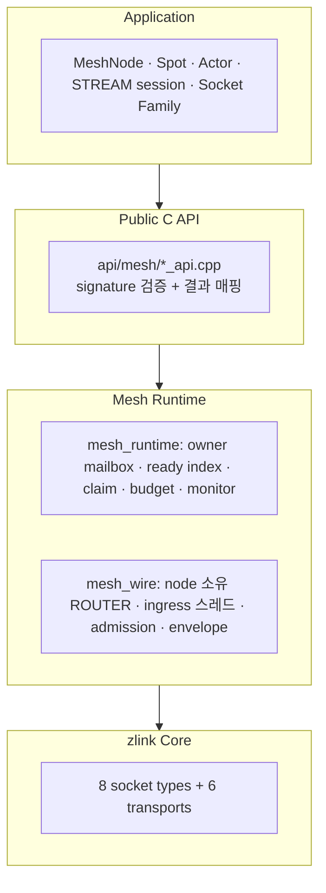
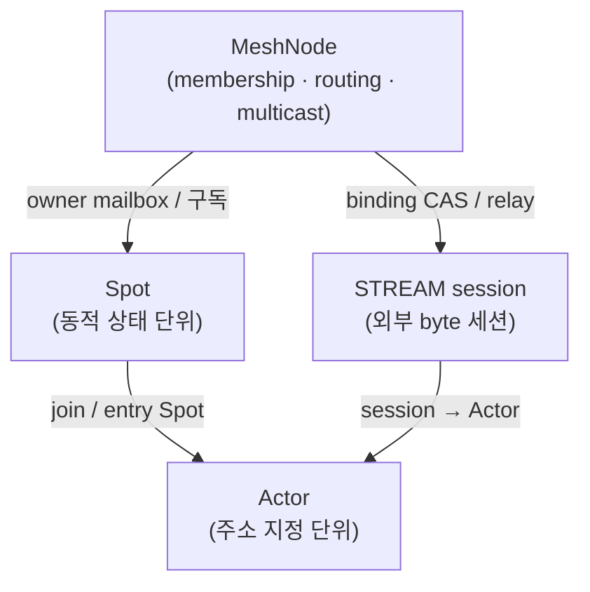

[English](07-0-services.md) | [한국어](07-0-services.ko.md)

<!-- zlink-nav:start -->
[← 모니터링](06-monitoring.ko.md) | [SPOT →](07-3-spot.ko.md)
<!-- zlink-nav:end -->

# 서비스 계층 개요

## 1. 서비스 계층이란

서비스 계층이 없으면 애플리케이션이 소켓 연결을 직접 관리하고 상태 소유자에게
메시지를 라우팅하며 서비스 수명주기까지 처리해야 한다. 서비스 계층은 현재 공개
C API가 제공하는 범위에서 이런 작업을 흡수한다.

10.1.0의 공개 core service 계약은 **MeshNode**와 그 위의 **Spot**, **Actor**,
**STREAM session**이다. Discovery(위치 저장소)와 Registry는 core 공개 C API나
내부 런타임에 속하지 않는다 — 그 책임은 framework 계층이 가진다.

### 1.1 왜 한 라이브러리에 메시징과 서비스 계층이 함께 있나

zlink는 두 가지 흔히 따로 풀던 문제를 **하나의 스택**으로 합친다.

- **서버 간 메시징** — 소켓 패턴(요청/응답, fan-out, 라우팅). 보통 RPC 프레임워크 +
  서비스 메시 + 외부 디스커버리로 푼다.
- **실시간 상태 서버** — 게임 룸·채팅방·존(zone)·심볼 오더북처럼 동적으로 생겼다
  사라지는 상태 단위. 보통 직접 만든 룸 서버 + 세션 위치 저장소 + 이벤트 fan-out
  브로커를 조합해 푼다.

서비스 계층은 두 번째 세계를 라이브러리로 흡수한다. 그래서 raw 소켓(메시징)과
MeshNode·Spot·Actor(실시간 상태)가 같은 라이브러리 안에 있다.

### 1.2 멘탈 모델 — 어느 층을 언제 쓰나

| 층 | 무엇을 하나 | 해결하는 질문 | 전형적 용도 |
|----|-------------|---------------|-------------|
| **raw 소켓** (PAIR/PUB·SUB/DEALER·ROUTER/STREAM) | 주소를 아는 지점 간 메시징 | "어디로 보낼까" | 마이크로서비스 RPC, 이벤트 버스, 외부 client |
| **MeshNode** | mesh membership + node/channel 라우팅 + Logical Multicast | "누구에게 어떻게 닿나" | 서버 풀, 채널 단위 round-robin, mesh 전파 |
| **Spot** | 동적 상태 단위 + **claim 기반 직렬 처리** | "상태를 어떻게 안전하게 다루나" | 게임 룸·존, 채팅방, 심볼 오더북 |
| **Actor** | 세션↔처리 단위 binding + **위치 투명·이동성** | "이 메시지가 누구 것이고, 끊겨도 이어지나" | 플레이어, 세션, 대화(conversation) |

핵심 구분:

- **상태는 여전히 응용이 소유한다.** zlink는 데이터 저장소가 아니다. Spot이 주는
  것은 상태 저장이 아니라 **그 상태에 닿는 메시지를 owner mailbox 하나로 모아
  claim 단위로 직렬 처리**하는 실행 모델이다. 덕분에 룸 상태를 lock으로 보호하는
  대신 동시성 문제 자체가 사라진다.
- **Actor는 raw 소켓의 대안이 아니라 Spot 위의 한 단계 더 높은 모델이다.** Actor
  메시지는 MeshNode의 라우팅 평면 위로 흐른다([07-4](07-4-actor.ko.md)). Actor는
  "그 Spot에 도착한 메시지를 어느 세션/엔티티에게 줄지" 구분하고, 세션이 어느
  서버에 붙어 있든 같은 엔티티로 이어 주는 역할을 한다.
- **classic PUB/SUB과 Logical Multicast의 차이**: raw PUB/SUB는 토픽이 정적이고
  발행자 주소를 알아야 한다. Logical Multicast는 mesh membership이 대상 집합을
  정하고, 방(room)이 런타임에 생기는 작은 주제별 fan-out(예: 채팅방)에 맞는다.

> 모노리스나 단일 프로세스로 충분하면 서비스 계층을 먼저 넣지 않는다. 여러
> 프로세스/서버로 나뉘어야 하는 이유가 생겼을 때, 그 사이의 연결·라우팅·상태
> 직렬 처리 복잡도를 줄이는 도구다.

## 2. 아키텍처



- **Public C API**는 진입점으로, 핸들·versioned 구조체 유효성을 검사한 뒤 mesh
  runtime으로 위임한다.
- **Mesh Runtime**은 프로세스-로컬 상태 기계(`mesh_runtime`)와 원격
  wire(`mesh_wire`)로 나뉜다. 11.0 목표 service 계약은
  [Framework 공개 계약](../../../framework/doc/framework/spec/README.ko.md)을 본다.
- raw socket 계층은 mesh를 모른다. MeshNode는 자기 소유 ROUTER 하나로 모든
  peer와 통신한다.

## 3. 서비스 구성 요소

| 구성 요소 | 명칭 의미 | 한줄 설명 |
|--------|-----------|-----------|
| **MeshNode** | mesh 참여 노드 | MeshName 하나·ROUTER bind 하나·프로세스당 유일. peer admission, node/channel send·request, Logical Multicast publish, dispatch(ready/claim/batch)와 monitor를 소유 |
| **Spot** | 동적 상태 단위 | MeshNode 안의 논리 단위. channel 구독(exact/prefix), direct send/request, publish, timer. owner mailbox로 lock 없는 직렬 처리 |
| **Actor** | 세션↔처리 단위 binding | Spot에 join하는 주소 지정 단위(`zlink_actor_ref_t`). 위치 투명 메시징과 Core fence 기반 transfer 지원 |
| **STREAM session** | 외부 byte 세션 | raw STREAM socket과 1:1로 붙는 service가 session↔Actor binding과 relay를 소유 |

- MeshNode lifecycle과 메시징: `zlink_mesh_node_*`
  ([정식 spec](../../../framework/doc/framework/spec/server/21-mesh-node.ko.md))
- dispatch(ready handler·drain·claim·receive batch·reply):
  `zlink_mesh_*` dispatch 계열
  ([정식 spec](../../../framework/doc/framework/spec/server/11-channel-messaging.ko.md))
- Spot: `zlink_spot_*`, `zlink_mesh_node_spot_*`
  ([정식 spec](../../../framework/doc/framework/spec/server/20-spot-messaging.ko.md), [가이드](07-3-spot.ko.md))
- Actor: `zlink_mesh_node_actor_*`, `zlink_actor_*`
  ([정식 spec](../../../framework/doc/framework/spec/server/23-spot-actor.ko.md), [가이드](07-4-actor.ko.md))
- STREAM session: `zlink_stream_session_*`
  ([정식 spec](../../../framework/doc/framework/spec/server/31-session-actor-dispatch.ko.md))
- **Thread-safe** — 하나의 MeshNode/Spot 핸들에서 여러 스레드가 operational
  API를 동시에 호출할 수 있다. 재진입 금지 지점은
  [정식 spec의 thread safety 절](../../../framework/doc/framework/spec/server/21-mesh-node.ko.md)이 정한다.

## 4. 점검을 위한 graceful maintenance (가중치)

운영 환경에서 노드를 잠시 내려야 할 때는 연결을 즉시 끊는 대신 graceful
drain을 권장한다.

- **MeshNode**: channel weight를 `0`으로 바꾸면 그 channel의 새 round-robin과
  multicast remote 대상에서 빠진다. 이미 admission된 메시지와 RID direct는
  영향을 받지 않는다. weight 변경은 descriptor revision을 올려 admitted peer
  에게 자동 전파된다. 이어서 `zlink_mesh_node_shutdown(node, deadline)`이 새
  application admission을 멈추고 active claim과 infrastructure 작업을
  deadline까지 기다린다.
- **raw ROUTER/worker 피어**: 소켓 가중치 옵션을 `0`으로 바꾸면 피어가 새
  outbound 후보에서 자동으로 제외한다(기존 raw 계약 유지).

권장 절차:

```c
/* 1) Leave the selection pool: weight 0 on every served channel. */
zlink_mesh_node_set_channel_weight(node, "orders-exec", 0);

/* 2) Wait for in-flight requests to complete (e.g. SLA + margin)
      while peers re-route new work to other orders-exec nodes. */
sleep_seconds(60);

/* 3) Stop admissions and drain claims, then restart or replace. */
zlink_mesh_node_shutdown(node, 30000);
zlink_mesh_node_destroy(&node);

/* 4) Rejoin: a fresh node advertises positive weight again. */
```

가중치가 `0`인 상태에서도 로컬 노드는 평소처럼 recv/claim/reply를 처리한다.
가중치는 "피어가 나를 새 작업 대상으로 선택하지 않게" 하는 신호이지, 로컬
동작을 강제로 멈추는 신호가 아니다.

## 5. 서비스 간 관계



- **MeshNode**가 유일한 수명·transport 소유자다. Spot·Actor·publisher·monitor·
  STREAM session service는 모두 node의 자식 참조로, 닫히기 전에는 node를
  destroy할 수 없다.
- **Spot**은 node 안의 논리 단위이고, **Actor**는 Spot에 join하는 주소 지정
  단위다. Actor는 소켓이나 프로세스 내부 엔드포인트를 소유하지 않는다.

---
<!-- zlink-nav:bottom:start -->
[← 모니터링](06-monitoring.ko.md) | [SPOT →](07-3-spot.ko.md)
<!-- zlink-nav:bottom:end -->
