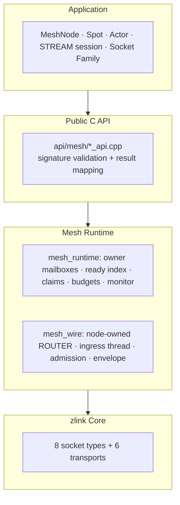
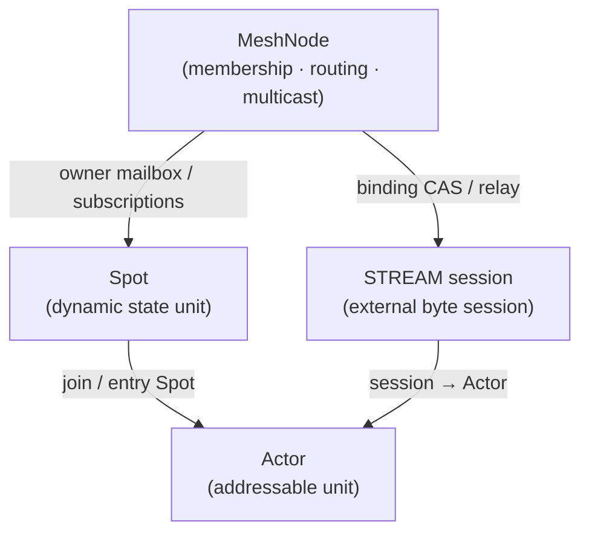

[English](07-0-services.md) | [한국어](07-0-services.ko.md)

<!-- zlink-nav:start -->
[← Monitoring](06-monitoring.md) | [SPOT →](07-3-spot.md)
<!-- zlink-nav:end -->

# Service Layer Overview

## 1. What is the Service Layer

Without the service layer, applications would need to manually manage socket
connections, route messages to state owners, and handle service lifecycle. The
service layer absorbs those tasks where the current public C API exposes them.

The 10.1.0 public core service contract is the **MeshNode** and, on top of it,
**Spot**, **Actor** and the **STREAM session**. Discovery (the location store)
and Registry are not part of the core public C API or the internal runtime —
that responsibility belongs to the framework layer.

### 1.1 Why messaging and a service layer live in one library

zlink merges two problems that are usually solved separately into **one
stack**:

- **Server-to-server messaging** — socket patterns (request/reply, fan-out,
  routing). Usually solved with an RPC framework + service mesh + external
  discovery.
- **Real-time state servers** — dynamically created and destroyed state units
  such as game rooms, chat rooms, zones or per-symbol order books. Usually
  solved with a hand-built room server + session location store + fan-out
  broker.

The service layer absorbs the second world as a library. That is why raw
sockets (messaging) and MeshNode/Spot/Actor (real-time state) live in the same
library.

### 1.2 Mental model — which layer to use when

| Layer | What it does | Question it answers | Typical use |
|----|-------------|---------------|-------------|
| **Raw sockets** (PAIR/PUB·SUB/DEALER·ROUTER/STREAM) | Point-to-point messaging with known addresses | "Where do I send this" | Microservice RPC, event bus, external clients |
| **MeshNode** | Mesh membership + node/channel routing + Logical Multicast | "Who do I reach and how" | Server pools, per-channel round-robin, mesh propagation |
| **Spot** | Dynamic state units + **claim-based serial processing** | "How do I touch state safely" | Game rooms/zones, chat rooms, order books |
| **Actor** | Session-to-processing-unit binding + **location transparency and mobility** | "Whose message is this, and does it survive reconnects" | Players, sessions, conversations |

Key distinctions:

- **The application still owns its state.** zlink is not a data store. What a
  Spot provides is not storage but an execution model that funnels every
  message touching that state into **one owner mailbox processed serially per
  claim** — instead of protecting room state with locks, the concurrency
  problem disappears.
- **Actors are not an alternative to raw sockets; they are one level above
  Spots.** Actor messages flow over the MeshNode routing plane
  ([07-4](07-4-actor.md)). An Actor decides "which session/entity a message
  arriving at that Spot belongs to" and keeps it the same entity no matter
  which server the session is attached to.
- **Classic PUB/SUB vs Logical Multicast**: raw PUB/SUB has static topics and
  requires knowing the publisher's address. Logical Multicast lets mesh
  membership define the target set and fits small per-subject fan-out where
  rooms appear at runtime (e.g. chat rooms).

> If a monolith or a single process is enough, do not introduce the service
> layer first. It is a tool that reduces the connection/routing/serial-state
> complexity that appears once you must split into multiple processes or
> servers.

## 2. Architecture



- The **public C API** is the entry point: it validates handles and versioned
  structs, then delegates into the mesh runtime.
- The **mesh runtime** splits into the process-local state machine
  (`mesh_runtime`) and the remote wire (`mesh_wire`). See
  [Service Layer Internal Design](../internals/services-internals.md) for the
  internals.
- The raw socket layer knows nothing about mesh. A MeshNode talks to all of
  its peers over its single owned ROUTER.

## 3. Service components

| Component | Meaning | One-liner |
|--------|-----------|-----------|
| **MeshNode** | Mesh participant node | One MeshName, one ROUTER bind, unique per process. Owns peer admission, node/channel send·request, Logical Multicast publish, dispatch (ready/claim/batch) and the monitor |
| **Spot** | Dynamic state unit | A logical unit inside the MeshNode: channel subscriptions (exact/prefix), direct send/request, publish, timers. Lock-free serial processing through its owner mailbox |
| **Actor** | Session-to-processing binding | An addressable unit joined to a Spot (`zlink_actor_ref_t`), with location-transparent messaging and Core-fenced transfer |
| **STREAM session** | External byte session | A service attached 1:1 to a raw STREAM socket owns session↔Actor bindings and the relay |

- MeshNode lifecycle and messaging: `zlink_mesh_node_*`
  ([formal spec](../spec/core/service/01-mesh-node.md))
- Dispatch (ready handler, drain, claim, receive batch, reply):
  the `zlink_mesh_*` dispatch family
  ([formal spec](../spec/core/service/02-dispatch.md))
- Spot: `zlink_spot_*`, `zlink_mesh_node_spot_*`
  ([formal spec](../spec/core/service/03-spot.md), [guide](07-3-spot.md))
- Actor: `zlink_mesh_node_actor_*`, `zlink_actor_*`
  ([formal spec](../spec/core/service/04-actor.md), [guide](07-4-actor.md))
- STREAM session: `zlink_stream_session_*`
  ([formal spec](../spec/core/service/05-stream-session.md))
- **Thread-safe** — multiple threads may call operational APIs on one
  MeshNode/Spot handle concurrently. The re-entrancy restrictions are defined
  by the [thread safety section of the formal spec](../spec/core/service/01-mesh-node.md).

## 4. Graceful maintenance (weights)

When a node must come down temporarily in production, prefer a graceful drain
over cutting connections.

- **MeshNode**: setting a channel weight to `0` removes the node from that
  channel's new round-robin and multicast remote targets. Already-admitted
  messages and RID-direct sends are unaffected. The weight change bumps the
  descriptor revision, which propagates automatically to admitted peers. Then
  `zlink_mesh_node_shutdown(node, deadline)` stops new application admissions
  and waits for active claims and infrastructure work until the deadline.
- **Raw ROUTER/worker peers**: setting the socket weight option to `0` makes
  peers exclude the node from new outbound candidates (the retained raw
  contract).

Recommended procedure:

```c
/* 1) Leave the selection pool: weight 0 on every served channel. */
zlink_mesh_node_set_channel_weight(node, "orders-exec", 0);

/* 2) Wait for in-flight requests to complete (e.g. SLA + margin)
      while peers re-route new work to other orders-exec nodes. */
sleep_seconds(60);

/* 3) Stop admissions and drain claims, then restart or replace. */
zlink_mesh_node_shutdown(node, 30000);
zlink_mesh_node_destroy(&node);

/* 4) Rejoin: a fresh node advertises positive weight again. */
```

With weight `0` the local node keeps processing recv/claim/reply as usual.
Weight is a signal that peers should stop selecting the node for new work; it
does not force local activity to stop.

## 5. Relationships between services



- The **MeshNode** is the single lifecycle and transport owner. Spot facades,
  Actors, publishers, the monitor and STREAM session services are all child
  references of the node: the node cannot be destroyed until they are closed.
- A **Spot** is a logical unit inside the node, and an **Actor** is an
  addressable unit joined to a Spot. Actors own no sockets and no in-process
  endpoints.

---
<!-- zlink-nav:bottom:start -->
[← Monitoring](06-monitoring.md) | [SPOT →](07-3-spot.md)
<!-- zlink-nav:bottom:end -->
