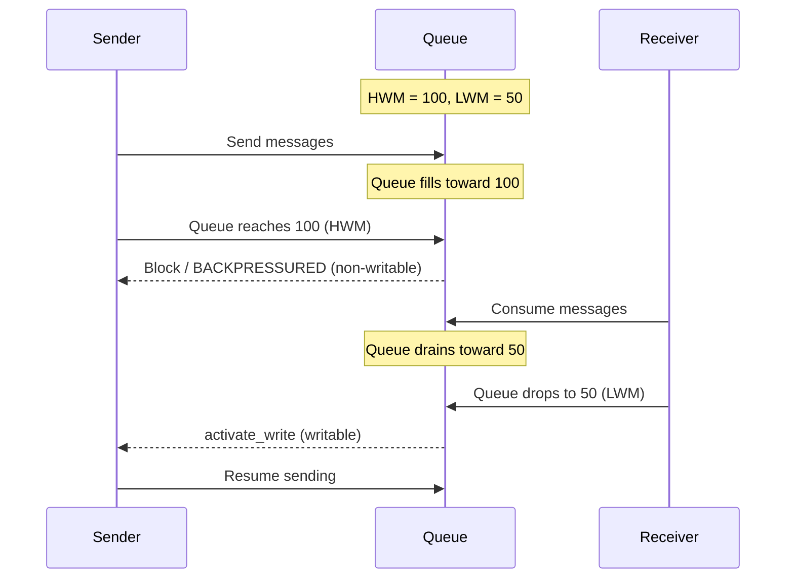

[English](10-performance.md) | [한국어](10-performance.ko.md)

<!-- zlink-nav:start -->
[← Message API](09-message-api.ko.md) | [스레드 안전성 →](11-thread-safety.ko.md)
<!-- zlink-nav:end -->

# 성능 특성 및 튜닝 가이드

## 1. Transport별 성능 특성

| Transport | 상대 성능 | 지연시간 | 오버헤드 | 추천 용도 |
|-----------|-----------|---------|----------|-----------|
| inproc | ★★★★★ | 최저 | 없음 | 스레드 간 통신 |
| ipc | ★★★★☆ | 낮음 | 시스템콜 | 로컬 프로세스 간 |
| tcp | ★★★★☆ | 네트워크 | TCP 스택 | 서버 간 통신 |
| ws | ★★★☆☆ | 네트워크 | WebSocket 프레이밍 | 웹 클라이언트 |
| tls/wss | ★★★☆☆ | 네트워크 | 암호화 + 프레이밍 | 보안 필요 시 |

### Transport별 오버헤드 분석

```
inproc:  Lock-free pipe direct connection. No system calls.
ipc:     Unix domain socket. Bypasses TCP stack.
tcp:     TCP/IP stack. Nagle disabled to minimize latency.
ws:      tcp + WebSocket framing (2~14B header). Binary mode.
wss/tls: ws/tcp + TLS encryption. Handshake + record overhead.
```

## 2. I/O 스레드 수 설정 가이드

```c
void *ctx = zlink_ctx_new();
zlink_ctx_set(ctx, ZLINK_IO_THREADS, 4);
```

| I/O 스레드 | 추천 사용 사례 | 기준 |
|------------|---------------|------|
| 1 | 소규모 연결 (<100), 단순 패턴 | CPU 코어 1개 사용 |
| 2 | 소~중규모 배포 | 낮은 코어 수 |
| 4 (기본) | 일반적 사용, 대규모 연결 | 대부분의 시나리오에 적합, CPU 코어 4개 이상 |
| 코어 수 | 최대 처리량 | 전용 서버 |

### I/O 스레드 증가 시점

- 소켓 수 × 평균 메시지 레이트가 단일 스레드 처리량을 초과할 때
- 다수의 네트워크 연결(>100)을 동시에 처리할 때
- WS/WSS 등 프레이밍 오버헤드가 큰 transport를 다량 사용할 때

### 주의사항

- I/O 스레드는 컨텍스트 생성 후, 소켓 생성 **전에** 설정한다.
- inproc transport는 I/O 스레드를 사용하지 않는다 (직접 파이프 연결).
- I/O 스레드를 과도하게 늘리면 컨텍스트 스위칭 오버헤드가 발생한다.

## 3. HWM (High Water Mark) 설정 가이드

HWM은 **연결별(per-connection) 큐 크기** 제한이다.
zlink에서 각 연결(pipe)은 독립적인 송수신 큐를 가지며
HWM은 각 큐가 보관할 수 있는 최대 메시지 수를 설정한다.

```c
int hwm = 100;
zlink_set_option(socket, ZLINK_OPT_SNDHWM, &hwm, sizeof(hwm));
zlink_set_option(socket, ZLINK_OPT_RCVHWM, &hwm, sizeof(hwm));
```

| 설정 | 기본값 | 설명 |
|------|--------|------|
| `ZLINK_OPT_SNDHWM` | 자동 | 기본 balanced auto-HWM profile에서 정한다. 수동 설정이 우선 |
| `ZLINK_OPT_RCVHWM` | 자동 | 기본 balanced auto-HWM profile에서 정한다. 수동 설정이 우선 |
| `ZLINK_OPT_SNDBUF` | `-1` | OS 기본 송신 버퍼와 TCP 자동 조정에 맡긴다. auto-HWM profile은 이 값을 바꾸지 않는다 |
| `ZLINK_OPT_RCVBUF` | `-1` | OS 기본 수신 버퍼와 TCP 자동 조정에 맡긴다. auto-HWM profile은 이 값을 바꾸지 않는다 |

### Backpressure 동작

HWM에 도달하면 소켓 타입과 송신 플래그에 따라 동작이 달라진다:

- **블로킹 송신** (`flags=0`): `zlink_send()`가 전송 큐에 공간이 생길 때까지 블로킹한다. `ZLINK_OPT_SNDTIMEO`로 대기 시간을 제한할 수 있다.
- **논블로킹 송신** (`ZLINK_DONTWAIT`): 즉시 `ZLINK_SUBMIT_BACKPRESSURED` 를 반환한다. 애플리케이션이 재시도, 드롭, 외부 버퍼링을 결정한다.

> 상세한 흐름 제어 패턴(DONTWAIT + send-ready handler)은
> 아래 [Send/Recv 흐름 제어](#4-sendrecv-흐름-제어) 섹션을 참고.

### 복구 메커니즘 (LWM)

전송 큐가 HWM에 도달하면 해당 연결의 pipe가 non-writable이 된다.
수신 측이 메시지를 소비하여 큐가 **Low Water Mark (LWM)** 이하로 drain되면
`activate_write` 시그널이 발생하여 다시 writable로 전환된다.

LWM 공식: **`(HWM + 1) / 2`**

이 시점에:
- 블로킹 `zlink_send()` 호출이 재개된다.
- send-ready 핸들러가 호출된다 (설치된 경우).

이 히스테리시스(hysteresis, 상한과 하한을 다르게 두어 상태 전환에
간격을 만드는 기법)는 쓰기 가능/불가 상태 간의 빠른 진동을 방지한다.



### 실전 HWM 권장값

기본 context 설정은 balanced profile의 auto-HWM을 사용한다. 애플리케이션이
auto-HWM을 끄거나 수동 HWM을 설정하지 않으면 profile 기반 queue depth가 적용된다.

기본 정책을 바꾸고 싶을 때는 `ZLINK_CTX_OPT_AUTO_HWM_PROFILE`을 설정한다.

| Profile | 용도 |
|---|---|
| `ZLINK_AUTO_HWM_PROFILE_COMPACT` | 저사양 환경이나 메모리 절약이 우선인 경우 |
| `ZLINK_AUTO_HWM_PROFILE_LOW_LATENCY` | 큐를 짧게 두고 backpressure를 빨리 건다 |
| `ZLINK_AUTO_HWM_PROFILE_BALANCED` | 기본 운영 튜닝 |
| `ZLINK_AUTO_HWM_PROFILE_THROUGHPUT` | 처리량 중심 테스트나 명시적 튜닝 |

`balanced` 기준 전체 queue 메모리 시작점은 아래처럼 잡을 수 있다.

```text
non_stream_connections * 256 * 4096
+ stream_connections * 64 * 1024
+ control_connections * 16 * 4096
```

이 값은 일반 socket의 용량 산정 입력이다. 일반 socket auto-HWM은 context memory
budget을 connection 수로 나누지 않는다. SPOT mesh 내부의 `mesh-pub`, `mesh-xsub`,
`routed-router`는 예외적으로 connection bucket을 적용해 peer 수가 많은 경우
profile HWM을 줄인다. 이 bucket은 20-25% 정도의 hysteresis 구간을 둔다. 예를 들어
`1-64` bucket에서 다음 bucket으로 이동하는 기준은 `65`가 아니라 `80`이고,
`65-128` bucket에서 이전 bucket으로 돌아가는 기준은 `64`가 아니라 `48`이다.
profile이나 메시지 단위가 바뀌면 이 여유 구간보다 새 설정을 우선해 다시 계산한다.
benchmark나 운영 튜닝에서 고정값이 필요하면 소켓별 `SNDHWM` / `RCVHWM`을 수동으로
주면 된다.

### HWM 동작 패턴

| 소켓 | HWM 초과 시 동작 |
|------|-----------------|
| PUB | 메시지 **드롭** (Slow Subscriber 보호) |
| DEALER | **블록** (기본) 또는 `ZLINK_SUBMIT_BACKPRESSURED` (`ZLINK_DONTWAIT`) |
| ROUTER | **블록**(기본) 또는 `ZLINK_SUBMIT_BACKPRESSURED`(`ZLINK_DONTWAIT`). `ROUTER_MANDATORY=0`이면 드롭 (미지/도달 불가 rid는 별도로 `ZLINK_SUBMIT_NOT_CONNECTED`) |
| PAIR | **블록** (기본) 또는 `ZLINK_SUBMIT_BACKPRESSURED` |

### 메모리 계산

HWM은 연결별(per-connection)이므로, 총 queue 메모리는 HWM × 메시지 크기 ×
연결 수로 추정할 수 있다. 일반 socket의 자동 HWM은 profile, 소켓 역할,
message unit으로 HWM을 고르며 context memory budget에서 역산하지 않는다.
SPOT mesh 내부 socket은 peer 수 bucket을 먼저 적용한 뒤 `4 KiB` 기준 byte
예산을 message unit으로 환산한다.

```
Estimated memory = SNDHWM × average_message_size × connection_count

Example 1: Regular service — HWM=100, message=1KB, connections=1000
           = 100 × 1KB × 1000 = ~100MB

Example 2: STREAM at scale — HWM=10, message=1KB, connections=10000
           = 10 × 1KB × 10000 = ~100MB

Example 3: SPOT mesh, balanced, 100 nodes, 4KB message
           = 99 peers × 2 directions × 128 × 4KB = ~99MB

Example 4: SPOT mesh, balanced, 1000 nodes, 4KB message
           = 999 peers × 2 directions × 32 × 4KB = ~250MB
```

단방향 `PUB/SUB`와 SPOT fanout에서는 큰 메시지가 큐에 오래 머물면 측정 레이턴시가
대부분 큐 체류 시간이 된다. 그래서 `balanced` 프로필은 큰 메시지 fanout 큐에
작은 메시지 큐보다 더 엄격한 상한을 적용한다.

## 4. Send/Recv 흐름 제어

### 4.1 Send Backpressure

sender가 receiver보다 빠르면 메시지가 전송 큐에 누적된다. High Water
Mark(HWM)이 큐 깊이를 제한하며 HWM 도달 시 동작은 소켓 타입과 송신
플래그에 따라 다르다 (위 [HWM 동작 패턴](#hwm-동작-패턴) 참고).

#### 블로킹 송신 (기본)

`flags=0`이면 `zlink_send()`는 전송 큐에 공간이 생길 때까지 블로킹한다.
`ZLINK_OPT_SNDTIMEO`로 블로킹 시간을 제한할 수 있다.

| SNDTIMEO 값 | 동작 |
|-------------|------|
| -1 (명시 설정) | 무한 블로킹 |
| 0 | 즉시 `ZLINK_SUBMIT_BACKPRESSURED` 반환 (`ZLINK_DONTWAIT`와 동일) |
| N (ms) | 최대 N밀리초 블로킹 후 `ZLINK_SUBMIT_BACKPRESSURED` |

```c
/* Block for at most 1 second */
int timeout = 1000;
zlink_set_option(socket, ZLINK_OPT_SNDTIMEO, &timeout, sizeof(timeout));

zlink_msg_t part;
zlink_msg_init_size(&part, size);
memcpy(zlink_msg_data(&part), data, size);
zlink_submit_result_t rc = zlink_send(socket, &part, 1, 0);
if (rc == ZLINK_SUBMIT_BACKPRESSURED) {
    /* Timed out — queue is still full */
    zlink_msg_close(&part);
}
```

#### 논블로킹 송신 (DONTWAIT)

`ZLINK_DONTWAIT`를 전달하면 HWM 도달 시 즉시 `ZLINK_SUBMIT_BACKPRESSURED` 를 반환한다.
애플리케이션이 재시도, 드롭, 외부 버퍼링을 결정한다.

```c
zlink_msg_t part;
zlink_msg_init_size(&part, size);
memcpy(zlink_msg_data(&part), data, size);
zlink_submit_result_t rc = zlink_send(socket, &part, 1, ZLINK_DONTWAIT);
if (rc == ZLINK_SUBMIT_BACKPRESSURED) {
    /* HWM reached — handle backpressure */
    zlink_msg_close(&part);
}
```

#### 전송 준비 핸들러 (이벤트 기반 역압 처리)

`zlink_send_ready_handler()`는 소켓이 쓰기 불가에서
쓰기 가능으로 전환될 때 호출되는 콜백을 설치한다. `ZLINK_DONTWAIT`와
조합하면 반응형 흐름 제어가 가능하다:

1. `ZLINK_DONTWAIT`로 전송을 시도한다.
2. `ZLINK_SUBMIT_BACKPRESSURED`가 반환되면 전송을 중단한다.
3. 전송 준비 콜백이 호출되면 전송을 재개한다.

이 API는 전송 가능한 모든 핸들(raw 소켓, SPOT)에서 동일하게 동작한다.
송신 backpressure는 poller `ZLINK_POLLOUT`으로 감지하거나
`zlink_send_ready_handler()` 콜백으로 받는다. 둘은 같은 send-recovery readiness 축을
관찰하며 같은 subject에 함께 등록할 수 있다. readiness 신호는 재시도할 가치가 있다는
힌트일 뿐 재시도 성공을 보장하지 않는다.

**동작 규칙:**
- 여러 번 호출하여 콜백을 교체할 수 있다 (이전 핸들러를 원자적으로 덮어씀).
- `NULL` 전달은 `EINVAL` — 한번 등록하면 해제는 불가하고 다른 함수로 교체만 가능하다.
- 자기 콜백 내에서 교체 불가 (`EDEADLK`). 콜백 밖에서는 자유롭게 교체 가능.
- send-ready handler와 `ZLINK_POLLOUT`은 같은 subject에 병행 등록할 수 있다.

```c
typedef struct {
    void *socket;
    const char *pending_data;
    size_t pending_size;
} app_state_t;

void on_send_ready(void *subject, void *userdata)
{
    app_state_t *state = (app_state_t *)userdata;
    if (state->pending_data) {
        zlink_msg_t part;
        zlink_msg_init_size(&part, state->pending_size);
        memcpy(zlink_msg_data(&part), state->pending_data, state->pending_size);
        zlink_submit_result_t rc = zlink_send(state->socket, &part, 1, ZLINK_DONTWAIT);
        if (rc >= 0)
            state->pending_data = NULL;
        else
            zlink_msg_close(&part);
        /* If still BACKPRESSURED, callback will fire again on next transition */
    }
}

/* Install the handler */
app_state_t state = { .socket = socket };
zlink_send_ready_handler(socket, on_send_ready, &state);

/* Send loop */
zlink_msg_t part;
zlink_msg_init_size(&part, size);
memcpy(zlink_msg_data(&part), data, size);
zlink_submit_result_t rc = zlink_send(socket, &part, 1, ZLINK_DONTWAIT);
if (rc == ZLINK_SUBMIT_BACKPRESSURED) {
    zlink_msg_close(&part);
    /* Buffer for retry when send-ready fires */
    state.pending_data = data;
    state.pending_size = size;
}
```

### 4.2 Low Water Mark과 Wake-Up

전송 큐가 HWM에 도달하면 소켓이 non-writable이 된다. 큐가 **low water
mark** `(HWM + 1) / 2`까지 drain되면 다시 writable로 전환된다. 이 시점에:

- 블로킹 `zlink_send()` 호출이 재개된다.
- send-ready 핸들러가 호출된다 (설치되고 armed 상태인 경우).

이 히스테리시스는 writable/non-writable 상태 간의 빠른 진동을 방지한다.

### 4.3 수신 측 흐름 제어

수신 큐는 최대 `ZLINK_OPT_RCVHWM` 메시지를 보관한다. 수신 큐가 가득 차면
sender에 pipe 레벨 backpressure가 적용된다.

```c
int hwm = 500;
zlink_set_option(socket, ZLINK_OPT_RCVHWM, &hwm, sizeof(hwm));
```

콜백 모드에서 느린 콜백은 I/O 스레드를 블로킹하여 수신 큐를
누적시킨다. 무거운 작업은 별도 스레드로 오프로드해야 한다:

```c
void on_message(const zlink_routing_id_t *rid,
                zlink_msg_t *parts, size_t part_count,
                void *userdata)
{
    /* BAD: slow processing blocks I/O thread */
    // heavy_computation(parts);

    /* GOOD: enqueue and return quickly */
    work_queue_push(userdata, parts, part_count);
}
```

> 스레드 안전 작업 큐 패턴은
> [스레드 안전성 가이드](11-thread-safety.ko.md) 섹션 6을 참고.

### 4.4 콜백 vs 풀 수신 모드

raw `STREAM`은 두 가지 수신 모드를 지원한다(콜백 수신 핸들러는 STREAM 전용이며,
다른 소켓 타입은 `ENOTSUP`/`ZLINK_HANDLER_NOT_SUPPORTED`). 선택에 따라 스레딩과
흐름 제어 동작이 달라진다.

| 항목 | 콜백 모드 | 풀(pull) 모드 |
|------|---|---|
| 트리거 | 메시지 도착 시 자동 | `zlink_recv()` 호출 |
| 실행 스레드 | I/O 스레드 | 애플리케이션 스레드 |
| 전환 | 단방향 (영구) | 기본; 핸들러 등록 후 불가 |
| DONTWAIT | 해당 없음 (항상 비동기) | 메시지 없으면 `ZLINK_RECV_NO_DATA` |
| 멀티파트 | `parts[]` 배열로 한번에 | `parts_out` + `part_count_out`으로 전체 반환 |

### 4.5 완전한 Backpressure 예제

`ZLINK_DONTWAIT`, send-ready 핸들러, 애플리케이션 레벨 버퍼를 조합한
전체 예제:

```c
#include <zlink.h>
#include <string.h>
#include <stdio.h>

#define MAX_PENDING 1024

typedef struct {
    void *socket;
    char *queue[MAX_PENDING];
    size_t sizes[MAX_PENDING];
    int head, tail, count;
} sender_t;

static void flush_queue(sender_t *s)
{
    while (s->count > 0) {
        zlink_msg_t part;
        zlink_msg_init_size(&part, s->sizes[s->head]);
        memcpy(zlink_msg_data(&part), s->queue[s->head], s->sizes[s->head]);
        zlink_submit_result_t rc = zlink_send(s->socket, &part, 1, ZLINK_DONTWAIT);
        if (rc != ZLINK_SUBMIT_OK) {
            zlink_msg_close(&part);
            break; /* Still full — wait for next send-ready */
        }
        free(s->queue[s->head]);
        s->head = (s->head + 1) % MAX_PENDING;
        s->count--;
    }
}

static void on_send_ready(void *subject, void *userdata)
{
    flush_queue((sender_t *)userdata);
}

int main(void)
{
    void *ctx = zlink_ctx_new();
    void *socket = zlink_socket(ctx, ZLINK_SOCKET_DEALER);
    zlink_connect(socket, "tcp://127.0.0.1:5555");

    sender_t sender = { .socket = socket };
    zlink_send_ready_handler(socket, on_send_ready, &sender);

    for (int i = 0; i < 100000; i++) {
        char msg[64];
        int len = snprintf(msg, sizeof(msg), "msg-%d", i);

        zlink_msg_t part;
        zlink_msg_init_size(&part, len);
        memcpy(zlink_msg_data(&part), msg, len);
        zlink_submit_result_t rc = zlink_send(socket, &part, 1, ZLINK_DONTWAIT);
        if (rc == ZLINK_SUBMIT_BACKPRESSURED) {
            zlink_msg_close(&part);
            /* Enqueue for later delivery */
            if (sender.count < MAX_PENDING) {
                int idx = (sender.head + sender.count) % MAX_PENDING;
                sender.queue[idx] = strdup(msg);
                sender.sizes[idx] = len;
                sender.count++;
            } else {
                printf("Application buffer full — dropping message\n");
            }
        }
    }

    zlink_close(socket);
    zlink_ctx_term(ctx);
    return 0;
}
```

## 5. 소켓 옵션 튜닝 체크리스트

| 옵션 | 기본값 | 튜닝 포인트 |
|------|--------|-------------|
| `ZLINK_OPT_LINGER` | -1 (무한) | 테스트: 0, 프로덕션: 1000~5000ms |
| `ZLINK_OPT_SNDTIMEO` | 1000ms | 응답 시간 요구사항에 맞춰 조정. 무한 대기는 `-1`을 명시적으로 설정 |
| `ZLINK_OPT_RCVTIMEO` | 1000ms | 폴링 루프에서 더 짧게 조정하거나, 무한 대기는 `-1`을 명시적으로 설정 |
| `ZLINK_OPT_SNDHWM` | 자동 | 기본은 auto HWM, 고정 큐 깊이가 필요할 때만 수동 설정 |
| `ZLINK_OPT_RCVHWM` | 자동 | 기본은 auto HWM, 고정 큐 깊이가 필요할 때만 수동 설정 |
| `ZLINK_OPT_MAXMSGSIZE` | -1 (무제한) | 신뢰할 수 없는 listener에서는 `bind` 전에 양수 제한 설정 |

### LINGER 설정

```c
/* Test environment: terminate immediately */
int linger = 0;
zlink_set_option(socket, ZLINK_OPT_LINGER, &linger, sizeof(linger));

/* Production: wait for unsent messages */
int linger = 3000;  /* 3 seconds */
zlink_set_option(socket, ZLINK_OPT_LINGER, &linger, sizeof(linger));
```

### 타임아웃 설정

```c
/* Send timeout: BACKPRESSURED after 1 second */
int timeout = 1000;
zlink_set_option(socket, ZLINK_OPT_SNDTIMEO, &timeout, sizeof(timeout));

/* Receive timeout: NO_DATA after 500ms */
int timeout = 500;
zlink_set_option(socket, ZLINK_OPT_RCVTIMEO, &timeout, sizeof(timeout));
```

## 6. 성능 측정 방법

### 기본 처리량 측정

```c
#include <time.h>

int count = 100000;
struct timespec start, end;
clock_gettime(CLOCK_MONOTONIC, &start);

for (int i = 0; i < count; i++) {
    zlink_msg_t part;
    zlink_msg_init_size(&part, size);
    memcpy(zlink_msg_data(&part), data, size);
    zlink_send(socket, &part, 1, 0);
}

clock_gettime(CLOCK_MONOTONIC, &end);
double elapsed = (end.tv_sec - start.tv_sec) +
                 (end.tv_nsec - start.tv_nsec) / 1e9;

printf("Throughput: %.2f msg/s\n", count / elapsed);
printf("Throughput: %.2f MB/s\n", (count * size) / elapsed / 1e6);
```

### 지연시간 측정 (Ping-Pong)

```c
/* Client: send ping, measure until pong arrives in callback */
clock_gettime(CLOCK_MONOTONIC, &start);
zlink_msg_t ping;
zlink_msg_init_size(&ping, 4);
memcpy(zlink_msg_data(&ping), "ping", 4);
zlink_send(socket, &ping, 1, 0);

/* Handler callback receives "pong" reply and records end time */
void on_pong(const zlink_routing_id_t *source_rid,
             zlink_msg_t *parts, size_t part_count, void *userdata)
{
    clock_gettime(CLOCK_MONOTONIC, &end);
    double rtt_us = ((end.tv_sec - start.tv_sec) * 1e6 +
                     (end.tv_nsec - start.tv_nsec) / 1e3);
    printf("RTT: %.1f us\n", rtt_us);
    for (size_t i = 0; i < part_count; i++)
        zlink_msg_close(&parts[i]);
}
```

## 7. 성능 체크리스트

### 기본 설정

- [ ] I/O 스레드 수를 워크로드에 맞게 설정
- [ ] HWM을 예상 처리량에 맞게 조정
- [ ] LINGER를 적절히 설정 (테스트: 0, 프로덕션: 타임아웃)

### 메시지 최적화

- [ ] 소형 메시지(≤41B)는 VSM 활용 (인라인 저장)
- [ ] 대용량 메시지는 제로카피 (`zlink_msg_init_data`) 활용
- [ ] 상수/static payload는 `zlink_msg_init_data(..., NULL, NULL)` 신중히 사용
- [ ] 불필요한 `zlink_msg_copy()` 회피

### Transport 최적화

- [ ] 로컬 통신은 inproc/ipc 사용
- [ ] 암호화가 불필요한 내부 통신은 tcp 사용
- [ ] WS/WSS 사용 시 메시지 크기별 성능 특성 고려

### 모니터링

- [ ] 성능 병목 시 모니터링 API로 연결 상태 확인
- [ ] Slow Subscriber 감지 (PUB/SUB 환경)
- [ ] HWM 도달 빈도 관찰

> Speculative I/O, Gather Write 등 내부 최적화 메커니즘의 상세는 [architecture.md](../internals/architecture.ko.md)를 참고.

## 8. 대량 연결 메모리 계획

연결을 수천~수만 개 유지하는 서버는 연결당 고정 메모리가 프로세스
메모리의 대부분을 차지한다. 용량을 계획할 때는 연결 하나에 대해 세 가지
값을 구분해서 본다.

- **기본 점유(idle)** — 연결이 성립된 직후부터 항상 나가는 고정 비용
- **트래픽 후 잔류** — 트래픽을 한 번이라도 겪은 연결이 그 뒤로 유지하는
  값. 라이브러리가 연결의 내부 버퍼를 연결 수명 동안 유지하기 때문에
  트래픽이 끝나도 이 값으로 되돌아오지 않는다(실측으로 확인).
  **오래 운영되는 서버의 용량 계획 기준선은 이 값이다**
- **순간 최대** — 버스트 중 큐잉 피크. HWM이 상한을 정하며 워크로드
  (메시지 크기 × HWM) 의존. **컨테이너 메모리 리밋/OOM 기준은 이 값이다**

### 패턴별 연결당 메모리 (실측)

10,000연결 실측값이다 (세션 pipe 청크·핸드셰이크 버퍼 축소가 적용된
8.6.3 이후 개발 트리, Linux x86-64, 기본 옵션·balanced auto-HWM, 연결마다
메시지 1개가 지나간 상태의 하한값. 절대값은 환경에 따라 다를 수 있으나
비율과 구성은 코드 구조에서 나온다).

| 서버 패턴 | 기본 점유 | 트래픽 후 잔류 | 순간 최대 (1 KB 버스트 실측) |
|-----------|----------|----------------|------------------------------|
| ROUTER (요청 수신) | ~28 KB | ~33 KB | ~66 KB |
| STREAM (raw TCP) | ~26 KB | ~27 KB | ~27 KB |
| PUB (구독자 fanout) | ~31 KB | ~36 KB | ~36 KB+ |

예: ROUTER 서버가 10,000연결을 오래 유지하면 프로세스 RSS를 약 330 MB
(잔류 기준)로 잡고, 버스트 피크까지 고려하면 ~660 MB를 확보한다.
50,000연결이면 각각 ~1.7 GB / ~3.3 GB다.

### MeshNode mesh는 peer당 연결 1개로 계산한다

MeshNode는 peer 하나당 자기 소유 ROUTER의 TCP 연결 1개(fd 1개)만 사용한다.
제어(admission·descriptor)와 데이터(direct·channel·multicast)가 같은 연결을
공유하므로, mesh의 fd·메모리 예산은 peer 수에 선형이다.

### 대량 연결 체크리스트

- [ ] 잔류 기준으로 프로세스 메모리를, 순간 최대 기준으로 컨테이너
      리밋을 산정
- [ ] fd 예산: `RLIMIT_NOFILE`은 연결 수(MeshNode는 peer당 1) +
      여유분으로 설정. `ZLINK_MAX_SOCKETS`는 연결 수가 아니라 **소켓 핸들
      수** 제한(기본 4095)이므로, 소켓을 많이 만드는 쪽(예: 연결당 소켓
      1개를 만드는 클라이언트)에서만
      올린다
- [ ] 연결이 아주 많고 연결당 대역이 낮으면 `ZLINK_OPT_RCVBUF/SNDBUF`로
      소켓당 커널 버퍼 상한(예: 32 KB)을 걸어 autotuning 과대 성장
      방지 (상한은 커널 `tcp_rmem/tcp_wmem` max까지 — 배포판에 따라
      다르며 측정 환경 기준 16 MB)
- [ ] 지속 부하 배치는 `net.ipv4.tcp_mem`, `tcp_rmem/tcp_wmem` 상한 점검
      (idle 연결의 커널 버퍼 비용은 거의 0이다)
- [ ] HWM profile이 순간 최대를 정한다 — 메모리가 빠듯하면 COMPACT,
      처리량이 우선이면 THROUGHPUT (§3 참고)

> 연결 하나가 내부적으로 무엇을 언제 할당하는지는
> [연결당 메모리 구조](../internals/connection-memory.ko.md)를 참고.

---
<!-- zlink-nav:bottom:start -->
[← Message API](09-message-api.ko.md) | [스레드 안전성 →](11-thread-safety.ko.md)
<!-- zlink-nav:bottom:end -->
