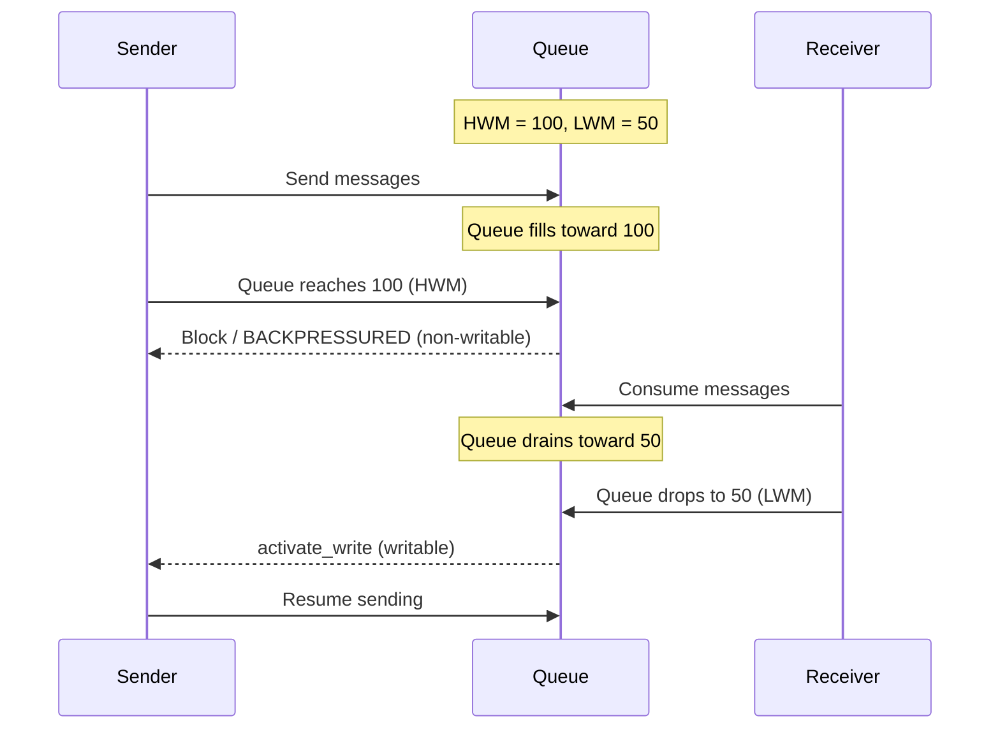

[English](10-performance.md) | [한국어](10-performance.ko.md)

<!-- zlink-nav:start -->
[← Message API](09-message-api.md) | [Thread Safety →](11-thread-safety.md)
<!-- zlink-nav:end -->

# Performance Characteristics and Tuning Guide

## 1. Performance Characteristics by Transport

| Transport | Relative Performance | Latency | Overhead | Recommended Use |
|-----------|-----------|---------|----------|-----------|
| inproc | ★★★★★ | Lowest | None | Inter-thread communication |
| ipc | ★★★★☆ | Low | System calls | Local inter-process |
| tcp | ★★★★☆ | Network | TCP stack | Server-to-server communication |
| ws | ★★★☆☆ | Network | WebSocket framing | Web clients |
| tls/wss | ★★★☆☆ | Network | Encryption + framing | When security is required |

### Overhead Analysis by Transport

```
inproc:  Lock-free pipe direct connection. No system calls.
ipc:     Unix domain socket. Bypasses TCP stack.
tcp:     TCP/IP stack. Nagle disabled to minimize latency.
ws:      tcp + WebSocket framing (2~14B header). Binary mode.
wss/tls: ws/tcp + TLS encryption. Handshake + record overhead.
```

## 2. I/O Thread Count Configuration Guide

```c
void *ctx = zlink_ctx_new();
zlink_ctx_set(ctx, ZLINK_IO_THREADS, 4);
```

| I/O Threads | Recommended Use Case | Guideline |
|------------|---------------|------|
| 1 | Small-scale connections (<100), simple patterns | Uses 1 CPU core |
| 2 | Small-to-medium deployments | Lower core counts |
| 4 (default) | General use, large-scale connections | Suitable for most scenarios; 4+ CPU cores |
| Core count | Maximum throughput | Dedicated server |

### When to Increase I/O Threads

- When sockets x average message rate exceeds single-thread throughput
- When handling many concurrent network connections (>100)
- When heavily using transports with high framing overhead such as WS/WSS

### Notes

- I/O threads must be configured after context creation but **before** socket creation
- inproc transport does not use I/O threads (direct pipe connection)
- Excessively increasing I/O threads causes context switching overhead

## 3. HWM (High Water Mark) Configuration Guide

HWM limits the **per-connection queue size**. In zlink, each connection (pipe) has its own independent send and receive queue; HWM sets the maximum number of messages each queue can hold.

```c
int hwm = 100;
zlink_set_option(socket, ZLINK_OPT_SNDHWM, &hwm, sizeof(hwm));
zlink_set_option(socket, ZLINK_OPT_RCVHWM, &hwm, sizeof(hwm));
```

| Setting | Default | Description |
|------|--------|------|
| `ZLINK_OPT_SNDHWM` | automatic | Chosen from the default balanced auto-HWM profile. Manual settings override it |
| `ZLINK_OPT_RCVHWM` | automatic | Chosen from the default balanced auto-HWM profile. Manual settings override it |
| `ZLINK_OPT_SNDBUF` | `-1` | Leaves the send buffer to the OS default and TCP autotuning. Auto-HWM profiles do not change this value |
| `ZLINK_OPT_RCVBUF` | `-1` | Leaves the receive buffer to the OS default and TCP autotuning. Auto-HWM profiles do not change this value |

### Backpressure Behavior

When HWM is reached, behavior depends on the socket type and send flags:

- **Blocking send** (`flags=0`): `zlink_send()` blocks until space becomes available in the send queue. Use `ZLINK_OPT_SNDTIMEO` to limit the wait.
- **Non-blocking send** (`ZLINK_DONTWAIT`): Returns `ZLINK_SUBMIT_BACKPRESSURED` immediately. The application decides whether to retry, drop, or buffer externally.

> For detailed flow control patterns (DONTWAIT + send-ready handler), see
> [Send and Receive Flow Control](#4-send-and-receive-flow-control) below.

### Recovery Mechanism (LWM)

When the send queue reaches HWM, the connection's pipe becomes non-writable. Once the receiver consumes enough messages to drain the queue to or below the **Low Water Mark (LWM)**, an `activate_write` signal fires and the pipe becomes writable again.

LWM formula: **`(HWM + 1) / 2`**

At this point:
- Blocking `zlink_send()` calls resume.
- The send-ready handler fires (if installed).

This hysteresis (using different upper and lower thresholds to create a gap between state transitions) prevents rapid oscillation between writable and non-writable states.



### Practical HWM Recommendations

The default context settings enable auto-HWM with the balanced profile, so
sockets use profile-based queue depths unless the application disables
auto-HWM or sets manual HWM values.

Use `ZLINK_CTX_OPT_AUTO_HWM_PROFILE` when you want a different default policy:

| Profile | Use case |
|---|---|
| `ZLINK_AUTO_HWM_PROFILE_COMPACT` | Resource-constrained deployments or lower memory use |
| `ZLINK_AUTO_HWM_PROFILE_LOW_LATENCY` | Short queues and faster backpressure |
| `ZLINK_AUTO_HWM_PROFILE_BALANCED` | Default production tuning |
| `ZLINK_AUTO_HWM_PROFILE_THROUGHPUT` | Larger queues for throughput-oriented tests or explicit tuning |

For balanced planning, a useful starting point for total queue memory is:

```text
non_stream_connections * 256 * 4096
+ stream_connections * 64 * 1024
+ control_connections * 16 * 4096
```

This estimate is the capacity-planning input for ordinary sockets. Ordinary
socket auto-HWM does not divide a context memory budget across connections.
SPOT mesh internal sockets `mesh-pub`, `mesh-xsub`, and `external-router` are
the exception: they apply connection buckets to reduce the profile HWM when
many peers are connected. These buckets have a 20-25% hysteresis gap. For
example, a socket in the `1-64` bucket moves to the next bucket at `80` peers,
not `65`; a socket in the `65-128` bucket moves back at `48` peers, not `64`.
Profile and message-unit changes force recalculation before hysteresis is
applied. If benchmarking or production tuning needs fixed queue depths, set
`SNDHWM` / `RCVHWM` manually on the socket.

### HWM Behavior by Socket Type

| Socket | Behavior When HWM Exceeded |
|------|-----------------|
| PUB | Messages **dropped** (slow subscriber protection) |
| DEALER | **Blocks** (default) or `ZLINK_SUBMIT_BACKPRESSURED` (`ZLINK_DONTWAIT`) |
| ROUTER | **Blocks** (default) or `ZLINK_SUBMIT_BACKPRESSURED` (`ZLINK_DONTWAIT`); drops if `ROUTER_MANDATORY=0` (an unknown/unreachable rid is a separate `ZLINK_SUBMIT_NOT_CONNECTED`) |
| PAIR | **Blocks** (default) or `ZLINK_SUBMIT_BACKPRESSURED` |

### Memory Calculation

Since HWM is per-connection, estimate total queue memory as HWM × message size
× connection count. Ordinary socket auto-HWM selects the HWM from profile,
socket role, and message unit; it does not work backward from a context memory
budget. SPOT mesh internal sockets first apply a peer-count bucket and then
convert that 4 KiB-normalized byte budget to the active message unit.

```
Estimated memory = SNDHWM × average_message_size × connection_count

Example 1: Regular service — HWM=100, message=1KB, connections=1000
           = 100 × 1KB × 1000 = ~100MB

Example 2: STREAM at scale — HWM=10, message=1KB, connections=10000
           = 10 × 1KB × 10000 = ~100MB

Example 3: SPOT mesh, balanced, 100 nodes, 4KB message
           = 99 peers × 2 directions × 128 × 4KB = ~99MB

Example 4: SPOT mesh, balanced, 1000 nodes, 4KB message
           = 999 peers × 2 directions × 32 × 4KB = ~250MB
```

For one-way `PUB/SUB` and SPOT fanout, large messages can make queue residency
dominate measured latency. The balanced profile therefore caps large-message
fanout queues more aggressively than small-message queues.

## 4. Send and Receive Flow Control

### 4.1 Send Backpressure

When a sender produces messages faster than the receiver can consume them,
messages accumulate in the send queue. The High Water Mark (HWM) limits
queue depth. What happens when HWM is reached depends on the socket type
and send flags (see [HWM Behavior by Socket Type](#hwm-behavior-by-socket-type) above).

#### Blocking Send (Default)

With `flags=0`, `zlink_send()` blocks until space becomes available in the
send queue. Use `ZLINK_OPT_SNDTIMEO` to limit how long the call blocks.

| SNDTIMEO | Behavior |
|---|---|
| -1 (default) | Block indefinitely |
| 0 | Return `ZLINK_SUBMIT_BACKPRESSURED` immediately (same as `ZLINK_DONTWAIT`) |
| N (ms) | Block up to N milliseconds, then return `ZLINK_SUBMIT_BACKPRESSURED` |

```c
/* Block for at most 1 second */
int timeout = 1000;
zlink_set_option(socket, ZLINK_OPT_SNDTIMEO, &timeout, sizeof(timeout));

zlink_msg_t part;
zlink_msg_init_size(&part, size);
memcpy(zlink_msg_data(&part), data, size);
zlink_submit_result_t rc = zlink_send(socket, &part, 1, 0);
if (rc == ZLINK_SUBMIT_BACKPRESSURED) {
    /* Timed out — queue is still full */
    zlink_msg_close(&part);
}
```

#### Non-Blocking Send (DONTWAIT)

Pass `ZLINK_DONTWAIT` to return immediately with `ZLINK_SUBMIT_BACKPRESSURED` when the HWM is
reached. The application decides whether to retry, drop, or buffer
externally.

```c
zlink_msg_t part;
zlink_msg_init_size(&part, size);
memcpy(zlink_msg_data(&part), data, size);
zlink_submit_result_t rc = zlink_send(socket, &part, 1, ZLINK_DONTWAIT);
if (rc == ZLINK_SUBMIT_BACKPRESSURED) {
    /* HWM reached — handle backpressure */
    zlink_msg_close(&part);
}
```

#### Send-Ready Handler (Event-Driven Backpressure)

`zlink_send_ready_handler()` installs a callback that fires
when the socket transitions from non-writable to writable. Combined with
`ZLINK_DONTWAIT`, this enables reactive flow control:

1. Send with `ZLINK_DONTWAIT`.
2. On `ZLINK_SUBMIT_BACKPRESSURED`, pause sending.
3. When the send-ready callback fires, resume sending.

This API works identically on all send-capable handles (raw sockets and
SPOT). By default, send backpressure is detected via
poller `ZLINK_POLLOUT`. Once `zlink_send_ready_handler()` is registered,
readiness transitions are delivered through the callback instead, and
data-plane `ZLINK_POLLOUT` returns `ZLINK_HANDLER_BUSY`.

**Behavior rules:**
- Can be called multiple times to replace the callback (previous handler is atomically overwritten).
- Passing `NULL` returns `EINVAL` — once registered, the handler cannot be removed, only replaced with another function.
- Cannot be replaced from within its own callback (`EDEADLK`). Outside the callback, replacement is free.
- After registration, data-plane poller `ZLINK_POLLOUT` returns `ZLINK_HANDLER_BUSY`.

```c
typedef struct {
    void *socket;
    const char *pending_data;
    size_t pending_size;
} app_state_t;

void on_send_ready(void *subject, void *userdata)
{
    app_state_t *state = (app_state_t *)userdata;
    if (state->pending_data) {
        zlink_msg_t part;
        zlink_msg_init_size(&part, state->pending_size);
        memcpy(zlink_msg_data(&part), state->pending_data, state->pending_size);
        zlink_submit_result_t rc = zlink_send(state->socket, &part, 1, ZLINK_DONTWAIT);
        if (rc >= 0)
            state->pending_data = NULL;
        else
            zlink_msg_close(&part);
        /* If still BACKPRESSURED, callback will fire again on next transition */
    }
}

/* Install the handler */
app_state_t state = { .socket = socket };
zlink_send_ready_handler(socket, on_send_ready, &state);

/* Send loop */
zlink_msg_t part;
zlink_msg_init_size(&part, size);
memcpy(zlink_msg_data(&part), data, size);
zlink_submit_result_t rc = zlink_send(socket, &part, 1, ZLINK_DONTWAIT);
if (rc == ZLINK_SUBMIT_BACKPRESSURED) {
    zlink_msg_close(&part);
    /* Buffer for retry when send-ready fires */
    state.pending_data = data;
    state.pending_size = size;
}
```

### 4.2 Low Water Mark and Wake-Up

When the send queue reaches HWM, the socket becomes non-writable. It
transitions back to writable when the queue drains to the **low water
mark**, which is `(HWM + 1) / 2`. At this point:

- Blocking `zlink_send()` calls resume.
- The send-ready handler fires (if installed and armed).

This hysteresis prevents rapid oscillation between writable and
non-writable states.

### 4.3 Receive-Side Flow Control

The receive queue holds at most `ZLINK_OPT_RCVHWM` messages. When the
receiver's queue is full, pipe-level backpressure is applied to the
sender.

```c
int hwm = 500;
zlink_set_option(socket, ZLINK_OPT_RCVHWM, &hwm, sizeof(hwm));
```

In callback mode, a slow callback blocks the I/O thread, which causes the
receive queue to fill up. To avoid this, offload heavy work to a separate
thread:

```c
void on_message(const zlink_routing_id_t *rid,
                zlink_msg_t *parts, size_t part_count,
                void *userdata)
{
    /* BAD: slow processing blocks I/O thread */
    // heavy_computation(parts);

    /* GOOD: enqueue and return quickly */
    work_queue_push(userdata, parts, part_count);
}
```

> For thread-safe work queue patterns, see
> [Thread-Safety Guide](11-thread-safety.md) section 6.

### 4.4 Callback vs Pull Mode

zlink sockets support two receive modes. The choice affects threading
and flow control behavior.

| | Callback Mode | Pull Mode |
|---|---|---|
| Trigger | Automatic on message arrival | Explicit `zlink_recv()` call |
| Execution thread | I/O thread | Application thread |
| Transition | One-way (permanent) | Default; unavailable after handler attach |
| DONTWAIT | N/A (always async) | Returns `ZLINK_RECV_NO_DATA` if no message |
| Multipart | All parts delivered as `parts[]` array | All parts returned via `parts_out` + `part_count_out` |

### 4.5 Complete Backpressure Example

A full example combining `ZLINK_DONTWAIT`, a send-ready handler, and an
application-level buffer:

```c
#include <zlink.h>
#include <string.h>
#include <stdio.h>

#define MAX_PENDING 1024

typedef struct {
    void *socket;
    char *queue[MAX_PENDING];
    size_t sizes[MAX_PENDING];
    int head, tail, count;
} sender_t;

static void flush_queue(sender_t *s)
{
    while (s->count > 0) {
        zlink_msg_t part;
        zlink_msg_init_size(&part, s->sizes[s->head]);
        memcpy(zlink_msg_data(&part), s->queue[s->head], s->sizes[s->head]);
        zlink_submit_result_t rc = zlink_send(s->socket, &part, 1, ZLINK_DONTWAIT);
        if (rc != ZLINK_SUBMIT_OK) {
            zlink_msg_close(&part);
            break; /* Still full — wait for next send-ready */
        }
        free(s->queue[s->head]);
        s->head = (s->head + 1) % MAX_PENDING;
        s->count--;
    }
}

static void on_send_ready(void *subject, void *userdata)
{
    flush_queue((sender_t *)userdata);
}

int main(void)
{
    void *ctx = zlink_ctx_new();
    void *socket = zlink_socket(ctx, ZLINK_SOCKET_DEALER);
    zlink_connect(socket, "tcp://127.0.0.1:5555");

    sender_t sender = { .socket = socket };
    zlink_send_ready_handler(socket, on_send_ready, &sender);

    for (int i = 0; i < 100000; i++) {
        char msg[64];
        int len = snprintf(msg, sizeof(msg), "msg-%d", i);

        zlink_msg_t part;
        zlink_msg_init_size(&part, len);
        memcpy(zlink_msg_data(&part), msg, len);
        zlink_submit_result_t rc = zlink_send(socket, &part, 1, ZLINK_DONTWAIT);
        if (rc == ZLINK_SUBMIT_BACKPRESSURED) {
            zlink_msg_close(&part);
            /* Enqueue for later delivery */
            if (sender.count < MAX_PENDING) {
                int idx = (sender.head + sender.count) % MAX_PENDING;
                sender.queue[idx] = strdup(msg);
                sender.sizes[idx] = len;
                sender.count++;
            } else {
                printf("Application buffer full — dropping message\n");
            }
        }
    }

    zlink_close(socket);
    zlink_ctx_term(ctx);
    return 0;
}
```

## 5. Socket Option Tuning Checklist

| Option | Default | Tuning Point |
|------|--------|-------------|
| `ZLINK_OPT_LINGER` | -1 (infinite) | Testing: 0, Production: 1000~5000ms |
| `ZLINK_OPT_SNDTIMEO` | 1000ms | Tune according to response time requirements. Set `-1` explicitly for infinite wait |
| `ZLINK_OPT_RCVTIMEO` | 1000ms | Tune lower for polling loops, or set `-1` explicitly for infinite wait |
| `ZLINK_OPT_SNDHWM` | automatic | Leave auto HWM on unless the workload needs a fixed queue depth |
| `ZLINK_OPT_RCVHWM` | automatic | Leave auto HWM on unless the workload needs a fixed queue depth |
| `ZLINK_OPT_MAXMSGSIZE` | -1 (unlimited) | Set a positive limit before `bind` on untrusted listeners |

### LINGER Setting

```c
/* Test environment: terminate immediately */
int linger = 0;
zlink_set_option(socket, ZLINK_OPT_LINGER, &linger, sizeof(linger));

/* Production: wait for unsent messages */
int linger = 3000;  /* 3 seconds */
zlink_set_option(socket, ZLINK_OPT_LINGER, &linger, sizeof(linger));
```

### Timeout Settings

```c
/* Send timeout: BACKPRESSURED after 1 second */
int timeout = 1000;
zlink_set_option(socket, ZLINK_OPT_SNDTIMEO, &timeout, sizeof(timeout));

/* Receive timeout: NO_DATA after 500ms */
int timeout = 500;
zlink_set_option(socket, ZLINK_OPT_RCVTIMEO, &timeout, sizeof(timeout));
```

## 6. How to Measure Performance

### Basic Throughput Measurement

```c
#include <time.h>

int count = 100000;
struct timespec start, end;
clock_gettime(CLOCK_MONOTONIC, &start);

for (int i = 0; i < count; i++) {
    zlink_msg_t part;
    zlink_msg_init_size(&part, size);
    memcpy(zlink_msg_data(&part), data, size);
    zlink_send(socket, &part, 1, 0);
}

clock_gettime(CLOCK_MONOTONIC, &end);
double elapsed = (end.tv_sec - start.tv_sec) +
                 (end.tv_nsec - start.tv_nsec) / 1e9;

printf("Throughput: %.2f msg/s\n", count / elapsed);
printf("Throughput: %.2f MB/s\n", (count * size) / elapsed / 1e6);
```

### Latency Measurement (Ping-Pong)

```c
/* Client: send ping, measure until pong arrives in callback */
clock_gettime(CLOCK_MONOTONIC, &start);
zlink_msg_t ping;
zlink_msg_init_size(&ping, 4);
memcpy(zlink_msg_data(&ping), "ping", 4);
zlink_send(socket, &ping, 1, 0);

/* Handler callback receives "pong" reply and records end time */
void on_pong(const zlink_routing_id_t *source_rid,
             zlink_msg_t *parts, size_t part_count, void *userdata)
{
    clock_gettime(CLOCK_MONOTONIC, &end);
    double rtt_us = ((end.tv_sec - start.tv_sec) * 1e6 +
                     (end.tv_nsec - start.tv_nsec) / 1e3);
    printf("RTT: %.1f us\n", rtt_us);
    for (size_t i = 0; i < part_count; i++)
        zlink_msg_close(&parts[i]);
}
```

## 7. Performance Checklist

### Basic Configuration

- [ ] Set I/O thread count to match workload
- [ ] Adjust HWM to match expected throughput
- [ ] Set LINGER appropriately (testing: 0, production: timeout)

### Message Optimization

- [ ] Leverage VSM for small messages (≤41B) (inline storage)
- [ ] Use zero-copy (`zlink_msg_init_data`) for large messages
- [ ] For constant/static payloads, use `zlink_msg_init_data(..., NULL, NULL)` carefully
- [ ] Avoid unnecessary `zlink_msg_copy()` calls

### Transport Optimization

- [ ] Use inproc/ipc for local communication
- [ ] Use tcp for internal communication that does not require encryption
- [ ] Consider performance characteristics by message size when using WS/WSS

### Monitoring

- [ ] Use the monitoring API to check connection status during performance bottlenecks
- [ ] Detect slow subscribers (in PUB/SUB environments)
- [ ] Observe HWM saturation frequency

> For details on internal optimization mechanisms such as speculative I/O and gather write, see [architecture.md](../internals/architecture.md).

## 8. Memory Planning for Large Connection Counts

When a server holds thousands to tens of thousands of connections, the fixed
per-connection memory dominates the process footprint. Plan capacity by
distinguishing three values for each connection:

- **Idle baseline** — the fixed cost paid from the moment the connection is
  established
- **Post-traffic residual** — what a connection keeps holding once it has
  seen any traffic. The library keeps a connection's internal buffers for
  the connection's lifetime, so memory does not fall back to the idle value
  after traffic stops (confirmed by measurement). **This is the
  capacity-planning baseline for long-running servers**
- **Peak** — the queueing spike during bursts. HWM sets the ceiling and the
  value depends on the workload (message size × HWM). **Use this for
  container memory limits / OOM thresholds**

### Per-connection memory by pattern (measured)

Measured at 10,000 connections (post-8.6.3 development tree with the session
pipe chunk and handshake buffer reductions applied, Linux x86-64, default
options, balanced auto-HWM; lower-bound values with one message passed per
connection). Absolute values vary by environment, but the ratios and
composition come from the code structure.

| Server pattern | Idle baseline | Post-traffic residual | Peak (1 KB burst, measured) |
|----------------|--------------|------------------------|------------------------------|
| ROUTER (request intake) | ~28 KB | ~33 KB | ~66 KB |
| STREAM (raw TCP) | ~26 KB | ~27 KB | ~27 KB |
| PUB (subscriber fanout) | ~31 KB | ~36 KB | ~36 KB+ |

Example: a ROUTER server holding 10,000 long-lived connections should budget
about 330 MB of process RSS (residual basis) and reserve ~660 MB when burst
peaks are considered. At 50,000 connections that becomes ~1.7 GB / ~3.3 GB.

### Count MeshNode mesh peers at one connection each

A MeshNode uses exactly one TCP connection (one fd) per peer on its owned
ROUTER. Control (admission, descriptors) and data (direct, channel,
multicast) share that connection, so the mesh fd/memory budget is linear in
the peer count.

### Large-connection checklist

- [ ] Size process memory on the residual value and container limits on the
      peak value
- [ ] fd budget: set `RLIMIT_NOFILE` from the connection count (one per
      peer for a MeshNode) plus headroom. `ZLINK_MAX_SOCKETS` limits
      **socket handles** (default 4095), not connections — raise it only on
      the side that creates many sockets (e.g. a client with one socket per
      connection)
- [ ] With very many low-bandwidth connections, cap per-socket kernel
      buffers via `ZLINK_OPT_RCVBUF/SNDBUF` (e.g. 32 KB) to prevent
      autotuning growth (the ceiling is the kernel `tcp_rmem/tcp_wmem`
      max — distribution dependent; 16 MB on the measurement host)
- [ ] Under sustained load, review `net.ipv4.tcp_mem` and
      `tcp_rmem/tcp_wmem` ceilings (idle connections cost almost no kernel
      buffer memory)
- [ ] The HWM profile sets the peak — choose COMPACT when memory is tight,
      THROUGHPUT when throughput matters most (see §3)

> For what a single connection allocates internally and when, see
> [Per-Connection Memory](../internals/connection-memory.md).

---
<!-- zlink-nav:bottom:start -->
[← Message API](09-message-api.md) | [Thread Safety →](11-thread-safety.md)
<!-- zlink-nav:bottom:end -->
