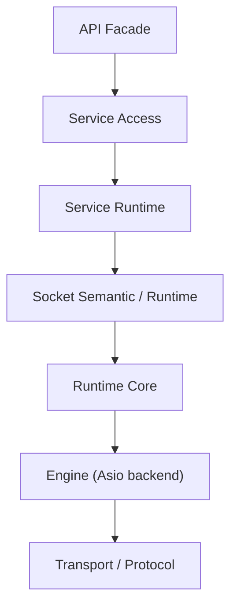

[English](posd-module-structure.md) | [한국어](posd-module-structure.ko.md)

# zlink POSD 모듈 구조

> 이 문서는 `core/` 내부 구조를 설명한다.
> 공개 C API (`core/include/zlink.h`)와 bindings 계약은 그대로 유지된다.
> 이 문서가 설명하는 것은 그 뒤의 내부 모듈 경계와 소유권이다.

## 1. 설계 원칙

내부 구조는 POSD(Philosophy of Software Design — 소프트웨어 설계 철학) 원칙을 따른다.

- **Deep Module(깊은 모듈)**: 각 모듈은 넓은 기능을 좁은 인터페이스 뒤에 숨긴다
- **정보 은닉**: 계층 간 지식 누수를 최소화한다
- **변경 증폭 억제**: 하나의 변경이 넓게 번지지 않는 구조를 유지한다
- **공개 표면 유지**: `core/include/zlink.h`의 C API/ABI 계약은 깨지지 않는다

## 2. 계층 구조

```mermaid
flowchart TB
    subgraph Callers ["Bindings / C Callers"]
        zlink_h["core/include/zlink.h"]
    end

    subgraph API ["API Facade (core/src/api/)"]
        context_api["context_api"]
        socket_api["socket_api · socket_message_api"]
        message_api["message_api"]
        service_api["service_api · service_*_api"]
        monitor_api["monitor_api · monitor_*_api"]
        poller_api["poller_api"]
        zlink_option["zlink_option · zlink_option_*_api"]
    end

    subgraph SAL ["Service Access Layer"]
        mesh_c_internal["api/mesh seam (mesh_c_internal · mesh_api_internal)"]
    end

    subgraph SvcRT ["Service Runtime"]
        direction LR
        mesh_rt["Mesh: mesh_runtime · mesh_wire"]
        common_rt["Common: runtime_base · api_guard · monitor · bridge"]
    end

    subgraph SocketRT ["Socket Semantic / Runtime (core/src/runtime/sockets/)"]
        families["Families: pair · pub · sub · xpub · xsub · dealer · router · stream"]
        base["Base: socket_base · api · dispatch · endpoint · lifecycle · monitor · msg · routing"]
        runtime["Runtime: socket_runtime · socket_close_ops"]
    end

    subgraph Core ["Runtime Core (core/src/runtime/core/)"]
        core_mods["ctx · own · reaper · mailbox · pipe"]
        multipart["multipart_send_txn"]
        options["options · options_dispatch · core_socket · transport_network · protocol_metadata"]
        send_recv["send_internal · recv_internal"]
        session["session_base · socket_poller"]
    end

    subgraph Engine ["Engine (core/src/runtime/engine/)"]
        asio["asio/ — Boost.Asio poller, io_context, mailbox execution"]
    end

    subgraph TP ["Transport / Protocol"]
        protocol["Protocol: raw · zmp · metadata"]
        transport["Transport: tcp · ipc · tls · ws · pgm"]
    end

    Callers --> API
    API --> SAL
    SAL --> SvcRT
    SvcRT --> SocketRT
    SocketRT --> Core
    Core --> Engine
    Engine --> TP
```



## 3. 계층별 역할

### 3.1 API Facade (`core/src/api/`)

| 파일 그룹 | 역할 |
|-----------|------|
| `context_api.cpp` | context lifecycle (new/term/shutdown/set/get) |
| `socket_api.cpp`, `socket_message_api.cpp` | socket 생성, bind/connect, send/recv |
| `message_api.cpp` | message lifecycle |
| `service_api.cpp`, `service_*_api.cpp` | service lifecycle, mode transition, handler registration |
| `monitor_api.cpp`, `monitor_*_api.cpp` | socket monitor open, recv, handler |
| `poller_api.cpp` | poller operations |
| `zlink_option.cpp`, `zlink_option_*_api.cpp` | option set/get dispatch |

API facade 의 규칙:

**API facade 에 남아도 되는 것:**
- 핸들 유효성 검사
- 핸들별 입장 허용(admission)/수명 가드
- 핸들별 API 진입·닫힘 조정

**하위 계층으로 내려야 하는 것:**
- monitor 이벤트 wire decode
- 프로토콜 파싱
- 구체적인 service/socket 분기
- service 전체 registry/table

`service_api_internal.hpp`가 API 계층과 service access layer 사이의 내부 계약을 정의한다.

### 3.2 Service Access Layer

각 서비스가 제공하는 service-local seam 이다. API 계층이 구체적인 서비스 구현을 직접 알지 않게 한다.

| Access Seam | 위치 | 역할 |
|-------------|------|------|
| `api/mesh/mesh_c_internal.hpp` | `api/mesh/` | 공개 handle 검증·versioned 구조체 검사와 mesh runtime 진입 |
| `api/mesh/mesh_api_internal.hpp` | `api/mesh/` | option·poller·timer 등 세로 관심사가 mesh로 들어오는 seam |

`service_public_api_guard_t` 는 모든 서비스에 공통되는 입장 허용/close 가드다.
public API 진입과 close/busy 상태를 추적하고, destroy 시 `EBUSY`/`ESHUTDOWN`
lifecycle 게이트를 제공한다. 콜백 모드 추적은 별도의 `service_mode_state_t`에 있다.

### 3.3 Service Runtime

각 서비스의 concrete 구현. 공통 기반은 `services/common/`에 있다.

**Mesh** (`services/mesh/`, `api/mesh/`):

| 모듈 | 역할 |
|------|------|
| `mesh_runtime.cpp/hpp` | 객체 모델: mesh_node_t, owner mailbox, ready index, claim, budget, monitor queue, handle registry |
| `mesh_wire.cpp/hpp` | node 소유 ROUTER wire: ingress 스레드, envelope codec, admission, transfer data plane |
| `api/mesh/mesh_node_api.cpp` | lifecycle·membership·peer·option·status C API |
| `api/mesh/mesh_messaging_api.cpp` | node/channel/Spot direct 메시징과 Logical Multicast |
| `api/mesh/mesh_dispatch_api.cpp` | ready handler·drain·batch·claim·reply token |
| `api/mesh/mesh_actor_api.cpp` | Actor 생성·조회·join·메시징 |
| `api/mesh/mesh_transfer_api.cpp` | transfer prepare/commit/activate/abort와 fence |
| `api/mesh/mesh_monitor_api.cpp` | MeshNode monitor |
| `api/mesh/mesh_stream_session_api.cpp` | STREAM session service |

깊은 모듈 경계: 공개 API 계층은 signature 검증과 결과 매핑만 소유하고, 상태
전이는 전부 `mesh_runtime`/`mesh_wire` 함수로 내려간다. raw socket 계층은
mesh를 모른다(유일한 확장은 NODROP 원자 reserve용 `routed_target_writable()`).


### 3.4 Socket Semantic/Runtime (`core/src/runtime/sockets/`)

`socket_base_t`는 socket family semantic의 entrypoint로 남고,
공통 기계 작업은 별도 runtime component로 분리되어 있다.

| 파일 | 역할 |
|------|------|
| `socket_base.cpp/hpp` | semantic entrypoint, family virtual dispatch |
| `socket_base_api.cpp` | 공개 API 위임 처리 |
| `socket_base_dispatch.cpp` | callback/handler dispatch |
| `socket_base_endpoint.cpp` | endpoint bookkeeping |
| `socket_base_lifecycle.cpp` | lifecycle/close 관리 |
| `socket_base_monitor.cpp` | monitor event emission |
| `socket_base_msg.cpp` | message send/recv 기계 작업 |
| `socket_base_routing.cpp` | routing_id 처리 |
| `socket_base_request_reply_bridge.cpp` | req/reply, part helper typed bridge |
| `socket_runtime.cpp/hpp` | runtime component aggregation |
| `socket_close_ops.cpp/hpp` | close/wait helper contract |

Family 구현 (pair, pub, sub, xpub, xsub, dealer, router, stream)은
routing/subscription/load-balancing 의미에 집중하고,
runtime internal field를 직접 참조하지 않는다.

`socket_base_t`는 semantic entrypoint이고, req/reply 상태와 part helper
상태는 typed bridge accessor를 거쳐 접근한다. API 계층은 raw cast를 반복하지
않고 이 bridge를 쓴다.

### 3.5 Runtime Core (`core/src/runtime/core/`)

#### Options Dispatch

Option은 세 카테고리로 나뉘어 각 도메인 소유자가 validation/apply를 맡는다.

| 카테고리 | 파일 | 대표 옵션 |
|----------|------|-----------|
| Core Socket | `options_core_socket.cpp` | SNDHWM, RCVHWM, LINGER, ROUTING_ID, SNDTIMEO, RCVTIMEO |
| Transport/Network | `options_transport_network.cpp` | RATE, RECOVERY_IVL, SNDBUF, RCVBUF, TOS, PRIORITY |
| Protocol/Metadata | `options_protocol_metadata.cpp` | ZMP 프로토콜 메타데이터 |

`options_dispatch.cpp`가 공개 `setsockopt/getsockopt` 호출을 카테고리별 handler로 라우팅한다.
`options_dispatch_internal.hpp`가 template 유틸리티와 dispatch 함수 선언을 제공한다.

공개 option 번호를 internal option 번호로 바꾸는 경로도 descriptor table로
정리해, `zlink_option.cpp`가 거대한 switch 허브로 다시 비대해지지 않게
한다.

#### Logical Multipart Send

`multipart_send_txn.cpp/hpp`는 `zlink_send`와 `spot publish`가 공통으로
쓰는 logical multipart send 모듈이다.

- nonblocking: 1회 시도 후 실패 시 부분 로컬 상태 롤백
- blocking: `sndtimeo` 데드라인까지 메시지 전체 단위로 재시도
- 재시도 대상: `EAGAIN`, `EINTR`만. 그 외 오류는 즉시 실패 반환
- `libzmq`의 `pipe/router/xpub/dist` 하위 계층 rollback/HWM(High Water Mark, 큐 상한) 의미를 재사용

#### Request/Reply Runtime Core

`request_reply_runtime_core.hpp`는 socket req/reply와 SPOT req/reply가 같이
쓰는 작은 공통 코어다.

- request sequence allocation
- scheduler-backed timeout task 생성 helper
- socket req/reply의 wire I/O와 router recv queue framing은
  `socket_request_reply_runtime_io.cpp`가 맡는다.

프로토콜별 framing/routing 차이는 각 모듈에 남기고, 두 경로가 반드시 같아야
하는 기계 작업만 공통 모듈로 올린다.

`socket_request_reply_dispatch.cpp`는 dispatch callback 설치, pending
completion 정리, close/drain 같은 lifecycle 중심 코드를 담는다. 실제
framing/send/recv 코드는 runtime I/O 모듈에 분리해 두어 dispatch 파일이
거대한 helper 집합이 되지 않게 한다.

#### Stream / ASIO Policy Seams

STREAM과 ASIO fast path에서 환경 변수와 기본 정책 계산은 hot path 구현 파일
머리에 직접 섞지 않고 별도 policy 모듈로 뺀다.

| 모듈 | 역할 |
|------|------|
| `sockets/stream_batch_policy.hpp` | STREAM batch/headroom 기본값 계산 |
| `engine/asio/asio_stream_fastpath_policy.hpp` | ASIO STREAM gather/speculative/drain 정책과 target size 계산 |

## 4. 의존 방향



금지 방향:
- API 가 서비스 구체 타입 세부를 직접 많이 아는 것
- service 가 socket close/wait 메커니즘을 재구현하는 것
- transport/protocol 세부 사항이 API 계층까지 새는 것

## 5. 소스 트리 요약

```
core/src/
  api/                120 files — C ABI facade (split by concern)
  runtime/
    core/              76 files — runtime core, options dispatch, multipart send
    engine/            15 files — Boost.Asio execution backbone
    protocol/          20 files — raw/zmp/metadata
    sockets/           55 files — socket families + base runtime components
    services/
      common/           8 files — service_runtime_base, service_public_api_guard
      control/          2 files — service control runtime
      spot/            86 files — node/pub/sub/data_plane/dispatch/runtime
      actor/           15 files — actor relay multipart/packet/result/validation
    transports/        46 files — tcp/ipc/tls/ws/pgm
    utils/             44 files — domain-agnostic utilities
```
