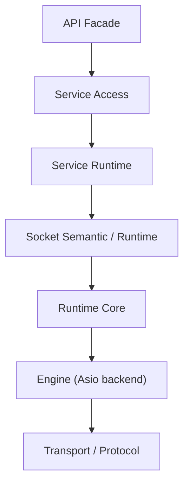

[English](posd-module-structure.md) | [한국어](posd-module-structure.ko.md)

# zlink POSD Module Structure

> This document describes the internal structure of `core/`.
> The public C API (`core/include/zlink.h`) and bindings contract are
> preserved; what this document describes is the internal module
> boundaries and ownership behind them.

## 1. Design Principles

The internal structure follows POSD (Philosophy of Software Design)
principles:

- **Deep Module**: Each module hides broad functionality behind a narrow interface
- **Information hiding**: Minimize knowledge leakage between layers
- **Change amplification suppression**: Maintain a structure where a single change does not spread widely
- **Public surface preservation**: The C API/ABI contract in `core/include/zlink.h` is never broken

## 2. Layer Structure

```mermaid
flowchart TB
    subgraph Callers ["Bindings / C Callers"]
        zlink_h["core/include/zlink.h"]
    end

    subgraph API ["API Facade (core/src/api/)"]
        context_api["context_api"]
        socket_api["socket_api · socket_message_api"]
        message_api["message_api"]
        service_api["service_api · service_*_api"]
        monitor_api["monitor_api · monitor_*_api"]
        poller_api["poller_api"]
        zlink_option["zlink_option · zlink_option_*_api"]
    end

    subgraph SAL ["Service Access Layer"]
        mesh_c_internal["api/mesh seam (mesh_c_internal · mesh_api_internal)"]
    end

    subgraph SvcRT ["Service Runtime"]
        direction LR
        mesh_rt["Mesh: mesh_runtime · mesh_wire (4 modules)"]
        common_rt["Common: runtime_base · api_guard · monitor · bridge"]
    end

    subgraph SocketRT ["Socket Semantic / Runtime (core/src/runtime/sockets/)"]
        families["Families: pair · pub · sub · xpub · xsub · dealer · router · stream"]
        base["Base: socket_base · api · dispatch · endpoint · lifecycle · monitor · msg · routing"]
        runtime["Runtime: socket_runtime · socket_close_ops"]
    end

    subgraph Core ["Runtime Core (core/src/runtime/core/)"]
        core_mods["ctx · own · reaper · mailbox · pipe"]
        multipart["multipart_send_txn"]
        options["options · options_dispatch · core_socket · transport_network · protocol_metadata"]
        send_recv["send_internal · recv_internal"]
        session["session_base · socket_poller"]
    end

    subgraph Engine ["Engine (core/src/runtime/engine/)"]
        asio["asio/ — Boost.Asio poller, io_context, mailbox execution"]
    end

    subgraph TP ["Transport / Protocol"]
        protocol["Protocol: raw · zmp · metadata"]
        transport["Transport: tcp · ipc · tls · ws · pgm"]
    end

    Callers --> API
    API --> SAL
    SAL --> SvcRT
    SvcRT --> SocketRT
    SocketRT --> Core
    Core --> Engine
    Engine --> TP
```



## 3. Layer Roles

### 3.1 API Facade (`core/src/api/`)

| File Group | Role |
|------------|------|
| `context_api.cpp` | Context lifecycle (new/term/shutdown/set/get) |
| `socket_api.cpp` · `socket_message_api.cpp` | Socket creation, bind/connect, send/recv |
| `message_api.cpp` | Message lifecycle |
| `service_api.cpp` · `service_*_api.cpp` | Service lifecycle, mode transition, handler registration |
| `monitor_api.cpp` · `monitor_*_api.cpp` | Socket monitor open, recv, handler |
| `poller_api.cpp` | Poller operations |
| `zlink_option.cpp` · `zlink_option_*_api.cpp` | Option set/get dispatch |

API facade rules:
- **Allowed to remain**: handle validation, per-handle admission/lifetime guard, per-handle API entry/close coordination
- **Must move down**: monitor event wire decode, protocol parsing, concrete service/socket branching, service-wide registry/table

`service_api_internal.hpp` defines the internal contract between the API layer and the service access layer.

### 3.2 Service Access Layer

Service-local seam provided by each service. Prevents the API layer from knowing concrete service implementations.

| Access Seam | Location | Role |
|-------------|----------|------|
| `api/mesh/mesh_c_internal.hpp` | `api/mesh/` | Public handle validation, versioned struct checks, entry into the mesh runtime |
| `api/mesh/mesh_api_internal.hpp` | `api/mesh/` | Seam through which cross-cutting concerns (options, poller, timers) enter mesh |

`service_public_api_guard_t` is the common admission/close guard for all services. It tracks public-API entry and the close/busy state, and provides destroy lifecycle gates (`EBUSY`/`ESHUTDOWN`). Callback-mode tracking lives separately in `service_mode_state_t`.

### 3.3 Service Runtime

Concrete implementation of each service. Common infrastructure is in `services/common/`.

**Mesh** (`services/mesh/`, `api/mesh/`):

| Module | Role |
|--------|------|
| `mesh_runtime.cpp/hpp` | Object model: mesh_node_t, owner mailboxes, ready index, claims, budgets, monitor queue, handle registry |
| `mesh_wire.cpp/hpp` | Node-owned ROUTER wire lifecycle and outbound submits (wire_submit_*, NODROP reserve/commit) |
| `mesh_wire_codec.cpp` | Wire envelope/record encode and decode (`mesh_wire_internal.hpp` contract) |
| `mesh_wire_admission.cpp` | Peer admission handshake, generation replacement, descriptor exchange |
| `mesh_wire_ingress.cpp` | Ingress thread: inbound dispatch, peer down, actor and transfer data plane |
| `api/mesh/mesh_node_api.cpp` | Lifecycle, membership, peer, option and status C API |
| `api/mesh/mesh_messaging_api.cpp` | Node/channel/Spot direct messaging and Logical Multicast |
| `api/mesh/mesh_dispatch_api.cpp` | Ready handler, drain, batches, claims, reply tokens |
| `api/mesh/mesh_actor_api.cpp` | Actor creation, lookup, join, messaging |
| `api/mesh/mesh_transfer_api.cpp` | Transfer prepare/commit/activate/abort and the fence |
| `api/mesh/mesh_monitor_api.cpp` | MeshNode monitor |
| `api/mesh/mesh_stream_session_api.cpp` | STREAM session service |

Deep-module boundary: the public API layer owns only signature validation and
result mapping; every state transition delegates into `mesh_runtime` and the
four `mesh_wire*` modules (their shared contract is `mesh_wire_internal.hpp`). The raw socket layer knows nothing about mesh (its only extension is
`routed_target_writable()` for the NODROP atomic reserve).


### 3.4 Socket Semantic/Runtime (`core/src/runtime/sockets/`)

`socket_base_t` remains as the semantic entrypoint for socket families,
while common mechanism work is separated into runtime components.

| File | Role |
|------|------|
| `socket_base.cpp/hpp` | Semantic entrypoint, family virtual dispatch |
| `socket_base_api.cpp` | Public API delegation |
| `socket_base_dispatch.cpp` | Callback/handler dispatch |
| `socket_base_endpoint.cpp` | Endpoint bookkeeping |
| `socket_base_lifecycle.cpp` | Lifecycle/close management |
| `socket_base_monitor.cpp` | Monitor event emission |
| `socket_base_msg.cpp` | Message send/recv mechanism |
| `socket_base_routing.cpp` | routing_id handling |
| `socket_base_request_reply_bridge.cpp` | Typed req/reply and part-helper bridge accessors |
| `socket_runtime.cpp/hpp` | Runtime component aggregation |
| `socket_close_ops.cpp/hpp` | Close/wait helper contract |

Family implementations (pair, pub, sub, xpub, xsub, dealer, router, stream)
focus on routing/subscription/load-balancing semantics and do not
directly reference runtime internal fields.

`socket_base_t` still acts as the semantic entrypoint, but req/reply state and
part-helper state now sit behind typed bridge accessors rather than
`shared_ptr<void>` storage and repeated casts in API code.

### 3.5 Runtime Core (`core/src/runtime/core/`)

#### Options Dispatch

Options are classified into three categories, each with its own domain
owner responsible for validation/apply:

| Category | File | Representative Options |
|----------|------|----------------------|
| Core Socket | `options_core_socket.cpp` | SNDHWM, RCVHWM, LINGER, ROUTING_ID, SNDTIMEO, RCVTIMEO |
| Transport/Network | `options_transport_network.cpp` | RATE, RECOVERY_IVL, SNDBUF, RCVBUF, TOS, PRIORITY |
| Protocol/Metadata | `options_protocol_metadata.cpp` | ZMP protocol metadata |

`options_dispatch.cpp` routes public `setsockopt/getsockopt` calls to
per-category handlers. `options_dispatch_internal.hpp` provides template
utilities and dispatch function declarations.

The public-to-internal option mapping in `zlink_option.cpp` is also expressed as
descriptor tables now, so the API layer does not drift back toward a large
central switch hub.

#### Logical Multipart Send

`multipart_send_txn.cpp/hpp` is the shared logical multipart send module
used by `zlink_send` and `spot publish`.

- nonblocking: one-shot attempt + partial local state rollback
- blocking: whole-message retry until `sndtimeo` deadline
- retry targets: `EAGAIN` and `EINTR` only; other errors fail immediately
- Reuses `libzmq`'s `pipe/router/xpub/dist` lower layer rollback/HWM semantics

#### Request/Reply Runtime Core

`request_reply_runtime_core.hpp` is the small shared runtime core used by both
socket req/reply and SPOT req/reply.

- request sequence allocation
- scheduler-backed timeout task creation helpers
- socket req/reply wire I/O and router recv queue framing live in
  `socket_request_reply_runtime_io.cpp`.

Protocol-specific framing and routing stay in the socket/spot-specific modules,
while identical state-machine mechanics live in one place.

`socket_request_reply_dispatch.cpp` now keeps dispatch callback installation,
pending completion cleanup, and close/drain lifecycle code. Actual
framing/send/recv code is kept in the runtime I/O module so the dispatch file
does not grow back into a broad helper collection.

#### Stream / ASIO Policy Seams

STREAM and ASIO fast-path policy defaults are kept out of the main hot-path
implementation files.

| Module | Role |
|--------|------|
| `sockets/stream_batch_policy.hpp` | STREAM batch/headroom defaults |
| `engine/asio/asio_stream_fastpath_policy.hpp` | ASIO STREAM gather/speculative/drain policy and target-size calculation |

## 4. Dependency Direction



Prohibited directions:
- API knowing service concrete type details directly
- Service reimplementing socket close/wait mechanics
- Transport/protocol details leaking up to the API layer

## 5. Source Tree Summary

```
core/src/
  api/                120 files — C ABI facade (split by concern)
  runtime/
    core/              76 files — runtime core, options dispatch, multipart send
    engine/            15 files — Boost.Asio execution backbone
    protocol/          20 files — raw/zmp/metadata
    sockets/           55 files — socket families + base runtime components
    services/
      common/           8 files — service_runtime_base, service_public_api_guard
      control/          2 files — service control runtime
      spot/            86 files — node/pub/sub/data_plane/dispatch/runtime
      actor/           15 files — actor relay multipart/packet/result/validation
    transports/        46 files — tcp/ipc/tls/ws/pgm
    utils/             44 files — domain-agnostic utilities
```
