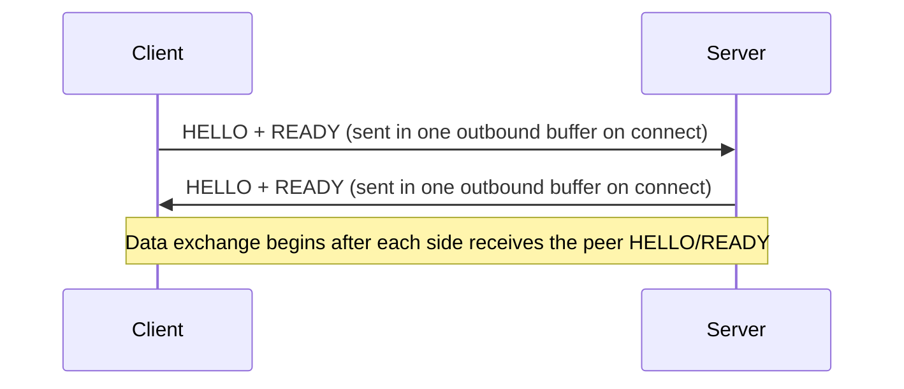
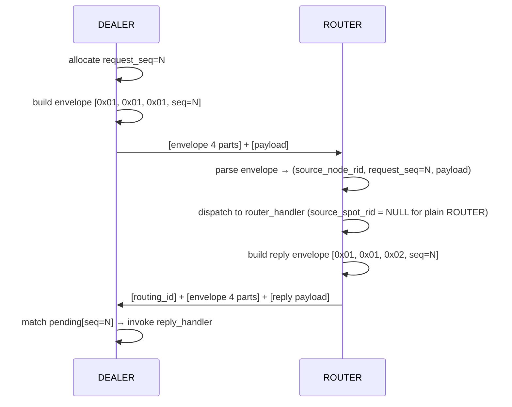
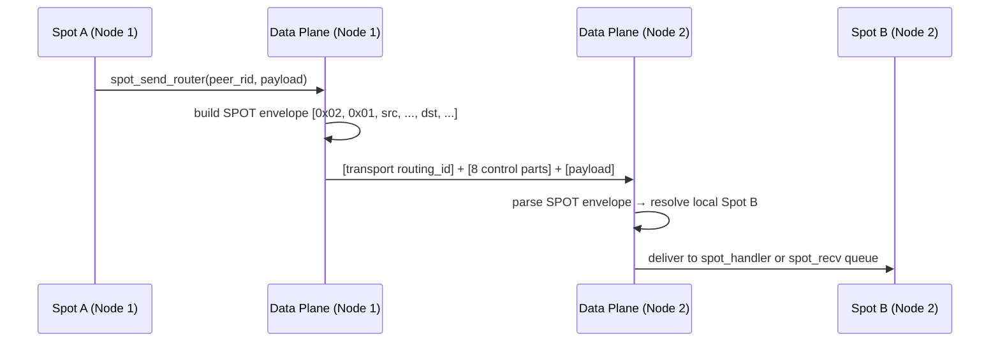
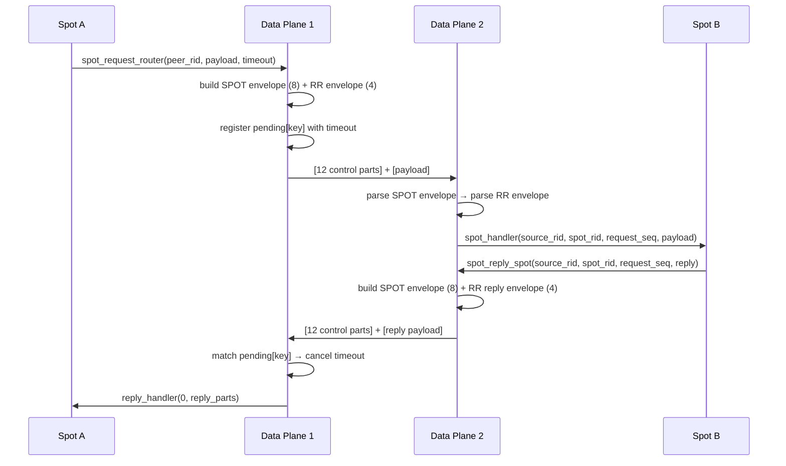
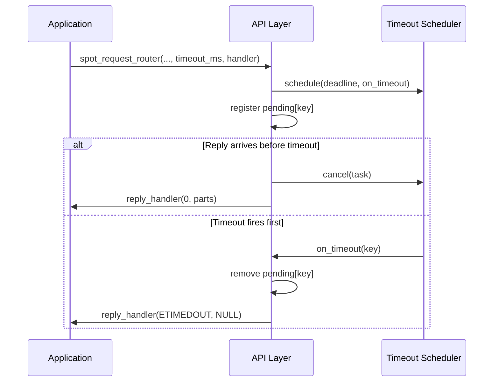

[English](protocol-zmp.md) | [한국어](protocol-zmp.ko.md)

# ZMP v1.0 Protocol Details

### Terminology

| Term | Description |
|------|-------------|
| ZMP | zlink Message Protocol. Purpose-built wire protocol for zlink |
| frame | One data unit on the wire |
| control part | Internal part preceding application payload |
| request-reply envelope | Control part group carrying request type and `request_seq` |
| SPOT routed envelope | Control part group carrying source/destination spot addresses |
| routing_id | Transport-level value identifying a peer connection |

## 1. Design Direction

Request-reply and SPOT direct delivery are expressed as ZMP multipart
control parts, **not** as fields inside `zlink_msg_t`.

The following patterns are **not** used:

- message-level request marking
- per-message metadata envelope
- restoring internal fields after recv

Ordinary `zlink_send()` / `zlink_recv()` still handle only payload parts.
Request-reply and SPOT routed APIs prepend control parts on send and
decode them on the dedicated receive path.

## 2. Common Frame Header

### 2.1 Header Layout (8 Bytes Fixed)

```text
 Byte:   0         1         2         3         4    5    6    7
      +---------+---------+---------+---------+---------------------+
      |  MAGIC  | VERSION |  FLAGS  |RESERVED |   PAYLOAD SIZE      |
      |  (0x5A) |  (0x01) |         | (0x00)  |   (32-bit BE)       |
      +---------+---------+---------+---------+---------------------+
```

| Field | Offset | Size | Description |
|-------|--------|------|-------------|
| MAGIC | 0 | 1 | `0x5A` ('Z') |
| VERSION | 1 | 1 | `0x01` |
| FLAGS | 2 | 1 | Frame flags |
| RESERVED | 3 | 1 | `0x00` |
| PAYLOAD SIZE | 4-7 | 4 | Big Endian |

### 2.2 FLAGS Bit Definitions

| Bit | Name | Value | Description |
|-----|------|-------|-------------|
| 0 | MORE | `0x01` | Multipart continuation |
| 1 | CONTROL | `0x02` | Control frame |
| 2 | IDENTITY | `0x04` | Contains routing ID |
| 3 | SUBSCRIBE | `0x08` | Subscription request |
| 4 | CANCEL | `0x10` | Subscription cancel |

Request-reply and SPOT routed envelope parts are not ZMP `CONTROL` frames; they
are ordinary multipart data frames (with the `MORE` flag). The ZMP `CONTROL` bit
is used only for protocol control frames such as HELLO/READY/heartbeat, and the
decoder rejects a frame that sets both `CONTROL` and `MORE`.

## 3. Handshake



**HELLO frame**: control_type (1B) + socket_type (1B) + routing_id_len (1B) + routing_id (0-255B)

**READY frame**: the READY control byte is always sent; the `Socket-Type` and `Routing-Id` metadata properties are attached only when `ZLINK_OPT_ZMP_METADATA` is enabled (default off)

## 4. Request-Reply Envelope

Request-reply prepends **4 control parts** before the payload.

```text
[protocol_id]       ← 1 byte: 0x01
[version]           ← 1 byte: 0x01
[message_type]      ← 1 byte
[request_seq]       ← 8 bytes Big Endian uint64
[payload part 0]
[payload part 1]
...
```

| Field | Size | Values |
|-------|------|--------|
| protocol_id | 1B | `0x01` |
| version | 1B | `0x01` |
| message_type | 1B | `0x01`=request, `0x02`=reply, `0x03`=error_reply |
| request_seq | 8B | Big Endian `uint64`, must be > 0 |

Key rules:

- `request_seq = 0` is invalid
- Reply must echo the same `request_seq` from the request
- `error_reply` puts a 4-byte Big Endian errno in the first payload part
- Ordinary payload follows the control parts

### Request-Reply Sequence (DEALER → ROUTER)



## 5. SPOT Routed Envelope

SPOT direct delivery prepends **8 control parts** before the payload.

```text
[spot_protocol_id]        ← 1 byte: 0x02
[spot_version]            ← 1 byte: 0x01
[source_class]            ← 1 byte
[source_node_rid]         ← variable (0 bytes if empty)
[source_endpoint_rid]     ← variable
[destination_class]       ← 1 byte
[destination_node_rid]    ← variable (0 bytes if empty)
[destination_endpoint_rid]← variable
[payload part 0]
...
```

| Field | Size | Values |
|-------|------|--------|
| protocol_id | 1B | `0x02` |
| version | 1B | `0x01` |
| class | 1B | `0x01`=spot, `0x02`=router |

### Address Interpretation

| Direction | source_class | source_node_rid | source_endpoint_rid | dest_class | dest_node_rid | dest_endpoint_rid |
|-----------|-------------|----------------|---------------------|-----------|--------------|-------------------|
| spot → spot | spot | sender SpotNode | sender Spot | spot | target SpotNode | target Spot |
| spot → router | spot | sender SpotNode | sender Spot | router | empty | target ROUTER peer |
| router → spot | router | empty | sender ROUTER peer | spot | target SpotNode | target Spot |

Empty values are sent as zero-length parts (not omitted).

### SPOT Routed Message Flow



## 6. SPOT Routed + Request-Reply Combined

SPOT request-reply stacks two envelopes in order:

```text
[transport routing_id if ROUTER]
[SPOT routed envelope: 8 parts]
[request-reply envelope: 4 parts]
[payload]
```

The outer 8 parts determine source and destination addresses.
The next 4 parts determine request/reply type and `request_seq`.
Payload starts after the 12th control part.

### SPOT Request-Reply Sequence



### Timeout Sequence



## 7. Pending and Completion Rules

Pending ownership resides in the upper API layer:

| API | Pending Key |
|-----|------------|
| DEALER | `request_seq` |
| ROUTER | `source_node_rid + request_seq` (plain ROUTER or SPOT-originated routed) |
| spot → spot | `source_class + source_address + request_seq` |
| router → spot | `request_seq` |

Completion rules:

- First reply completes the high-level request
- If timeout fires first, pending entry is removed and callback receives `ETIMEDOUT`
- Additional replies to a completed key are silently dropped
- `error_reply` delivers `errno != 0` completion instead of payload

## 8. Transport routing_id Relationship

Transport `routing_id` and request-reply / SPOT addresses are **not** the same value.

| Layer | Value | Purpose |
|-------|-------|---------|
| Transport | `routing_id` | Currently connected peer address |
| Request-Reply | `request_seq` | Correlates request with reply |
| SPOT | `node_rid` / `spot_rid` | Application-level destination |

In ROUTER + SPOT combinations, mixing these layers results in
incorrect reply address computation. Documentation and implementation
must treat them as separate layers.

## 9. Validation

The decode path checks at minimum:

- Sufficient number of control parts
- Correct protocol_id and version
- `request_seq != 0`
- Known message_type value
- Valid SPOT destination class and rid combination

Messages failing validation are not treated as request-reply or
SPOT routed messages. They do not trigger pending completion.

## 10. WebSocket Framing

- RFC 6455 Binary frame (Opcode=0x02)
- Payload = ZMP Frame
- Based on the Beast library
