[English](services-internals.md) | [한국어](services-internals.ko.md)

# 서비스 계층 내부 설계

## 1. 개요

zlink 서비스 계층은 현재 SPOT과 SPOT 위의 Actor 내부 구현을 다룬다. Discovery와 Registry는 core 런타임에 속하지 않는다.

SPOT에서 transport 보안 소유권은 의도적으로 좁게 유지한다.
`SpotNode`가 mesh/control 소켓의 TLS/WSS 연결 설정을 책임지고, unified `Spot`은
빌려 쓰는 data plane facade로만 남는다. 이 facade는 node
수명주기를 소유하지 않으며, 그 자체가 TLS 설정 진입점도 아니다.

## 2. SPOT 내부 구현

### 5.1 구조
- `spot_node_t` -- 네트워크 제어
  - PUB/SUB 소켓 소유, mesh 관리, worker 스레드
- `spot_pub_t` -- 발행 핸들
  - spot_node_t의 publish 위임, tag 기반 유효성 검증
- `spot_sub_t` -- 구독/수신 핸들
  - 내부 큐, 패턴 매칭, 조건변수 기반 blocking recv

### 5.2 동시성 모델
- 발행: 호출자 스레드에서 직접 수행, `_publish_sync` 뮤텍스(mutex)로 직렬화 (스레드 안전)
- 수신: worker 스레드가 SUB 소켓에서 수신, spot_sub_t 내부 큐로 분배
- 잠금 순서: `_sync` → `_publish_sync` (데드락 방지)
- 비동기 큐 없이 직접 발행 (publish 경로에 메시지 버퍼링 없음)

### 5.3 구독 집계
- refcount 기반 SUB 필터 관리
- 동일 토픽의 중복 구독 시 refcount 증가
- spot_sub_t별 구독 셋 관리 (정확한 토픽 + 패턴 별도)

### 5.4 전달 정책
- 로컬 publish (spot_pub):
  로컬 spot_sub 분배 + PUB으로 내보내기 (원격 전파)
- 원격 수신 (SUB):
  로컬 spot_sub 분배만 (재발행 없음, 루프 방지)

### 5.4.1 SpotNode HWM 경계
- unified `Spot` handle HWM과 SpotNode admission HWM은 서로 다른 계층이다.
- 등록된 `Spot` handle은 공통 `SNDHWM`/`RCVHWM` 옵션을 받아 pub/sub pending option으로 저장한다.
- `SpotNode` HWM은 relay나 delivery queue 예산이 아니라 admission(입력 허가) 예산이다.
  HWM(High Water Mark)은 큐가 이 값을 넘으면 새 메시지 수락을 제한하는 상한이다.
  - pubsub admission은 local publish 입력을 제어한다.
  - router admission은 local routed 입력을 제어한다.
- SpotNode admission 기본 profile은 balanced다. 두 admission 채널은 양수 숫자
  override가 없으면 `16`에서 시작한다.
- admission 숫자 옵션에 `0`을 설정하면 override를 지우고 선택된 profile 값으로
  돌아간다.
- relay와 delivery 소켓은 HWM `0`을 사용한다 — delivery target을 큐 한계로 끊지 않는다.
- `peer_ctrl`는 control-plane 소켓이므로 SpotNode admission HWM 묶음에
  포함하지 않는다.

### 5.5 Raw 소켓 정책
- `spot_pub_t`: raw PUB socket 노출하지 않음
  (thread-safety 우회 방지)
- `spot_sub_t`: raw SUB socket 노출하지 않음;
  callback/recv API로만 소비

## 6. SPOT 내부 아키텍처

SPOT/SpotNode 내부 아키텍처의 상세 내용 — 컴포넌트 다이어그램, 11개 내부
소켓 (타입/endpoint/HWM), 토픽 및 routed 메시지 흐름 시퀀스, control plane,
data plane polling — 은 별도 문서를 참고: **[SPOT 내부 구조](spot-internals.ko.md)**.

### 6.1 컴포넌트 다이어그램

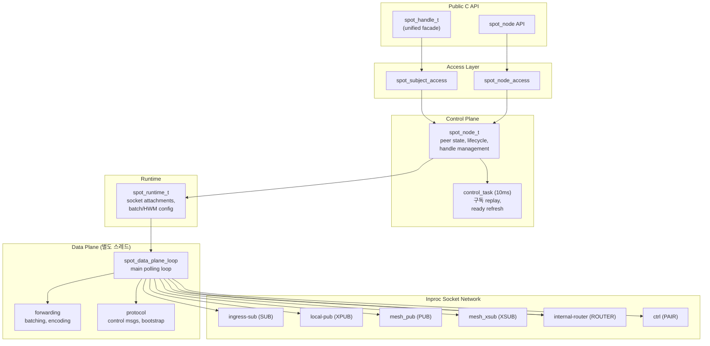

### 6.2 Inproc 소켓 토폴로지

모든 inproc 경로: `inproc://zlink.spot.{node_id}.{purpose}`

| Endpoint | 소켓 타입 | 방향 | 용도 |
|----------|----------|------|------|
| `.pub-in` | SUB | local pub → data plane | 토픽 publish 수신 |
| `.sub-out` | XPUB | data plane → local sub | 토픽 subscribe 배포 |
| `.internal-router` | ROUTER | local sender → data plane | Routed 메시지 수신 |
| `.internal-router` | ROUTER | data plane → local receiver | Routed 메시지 전달 |
| `.ctrl` | PAIR | control plane ↔ data plane | 내부 명령 |

### 6.3 토픽 메시지 내부 흐름

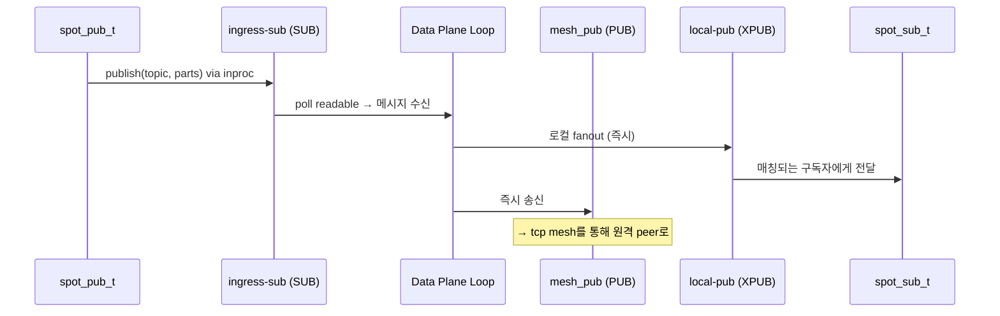

### 6.4 Routed 메시지 내부 흐름

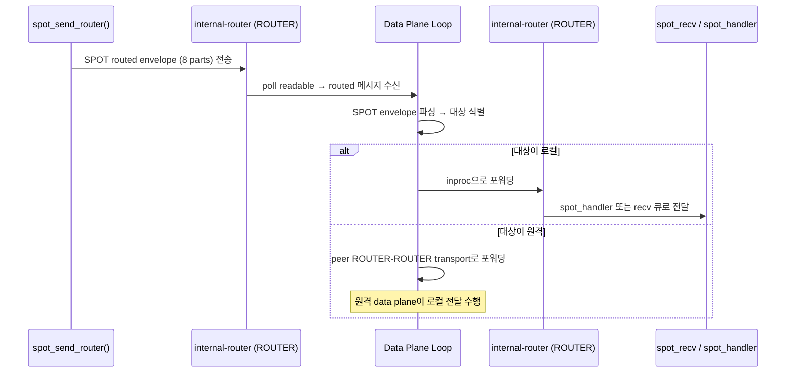

### 6.5 SPOT Request-Reply Dispatch

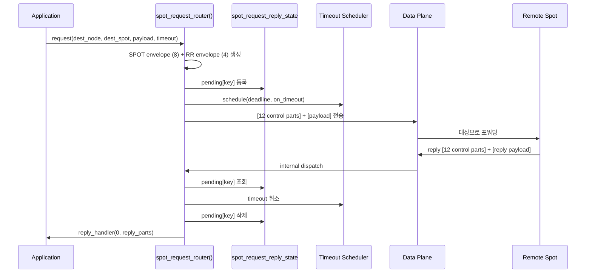

### 6.6 SPOT routed request-reply 조합

SPOT request-reply는 topic fanout 경로와 별도 상태를 가진다. 구현은 local
runtime에서 다음 세 단계를 거친다.

1. SPOT routed envelope 8개 part decode
2. 남은 payload 앞의 request-reply envelope 4개 part decode
3. request면 local handler dispatch, reply면 pending map completion

의미를 나눠 보면 다음과 같다.

- SPOT routed envelope: source/destination node, spot, router 주소
- request-reply envelope: `message_type`, `request_seq`
- payload: application body

### 6.7 pending 구조

socket request-reply와 SPOT request-reply는 각자 다른 pending key를 쓴다.

```cpp
struct pending_key_t {
    std::string peer_rid;
    uint64_t request_seq;
};

struct pending_spot_key_t {
    uint8_t source_class;
    std::string source_rid;
    std::string source_spot_rid;
    uint64_t request_seq;
};
```

정리:

- `DEALER`는 `request_seq`만으로 reply를 찾는다.
- `ROUTER`는 `source_node_rid + request_seq` 조합으로 reply를 찾는다.
  SPOT에서 시작된 routed 트래픽에서는 `source_spot_rid`가 함께 실려서
  통합된 router handler가 일반 호출자와 SPOT 발원 호출자를 구분한다.
- `spot -> spot`은 source class와 source 주소까지 함께 본다.
- `router -> spot`은 local router state에서 `request_seq`로 관리한다.

이렇게 나누는 이유는 같은 `request_seq`가 다른 상대 주소에서 동시에 보일 수
있기 때문이다.

### 6.8 timeout 과 완료

각 request를 시작할 때 pending entry를 넣고 timeout thread를 함께 건다.

- per-call timeout이 있으면 그 값을 사용
- 없으면 socket 기본 timeout 사용
- 둘 다 없으면 `5000ms`

timeout이 먼저 오면 pending entry를 지우고 `ETIMEDOUT`로 callback한다.
reply가 먼저 오면 pending entry를 지우고, timeout thread는 나중에 깨어나도
아무 일도 하지 않는다.

추가 reply 처리 규칙:

- 첫 reply로 이미 완료된 key는 pending map에서 제거된다.
- 이후 같은 key로 reply가 와도 조용히 drop한다.
- `error reply`는 payload 첫 part의 4바이트 errno를 읽어 실패 completion으로
  바꾼다.

## 7. Request-Reply Dispatch 아키텍처

### 7.1 소켓 수준 Dispatch 컴포넌트

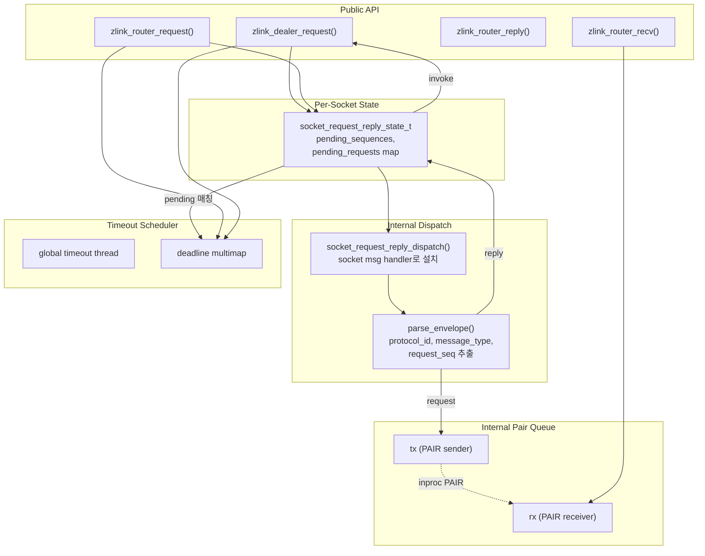

### 7.2 Dispatch 시퀀스 (Reply 완료)

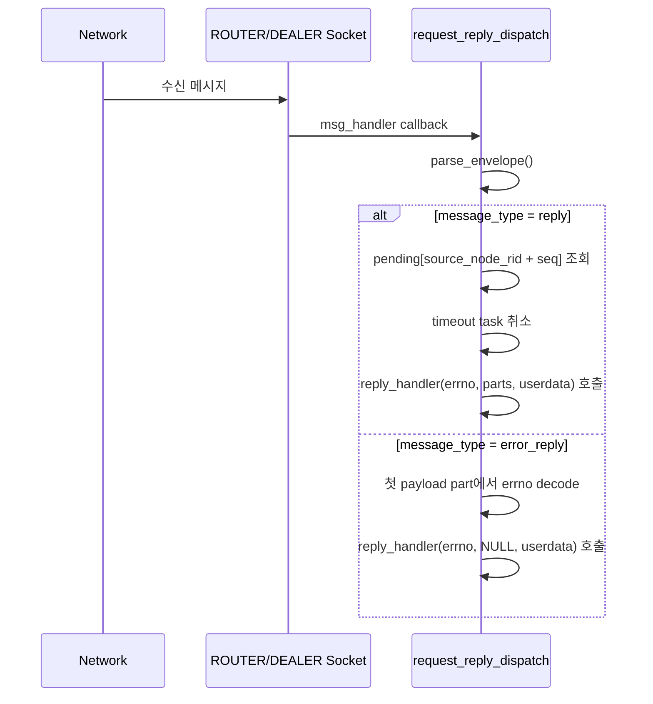

### 7.3 Dispatch 시퀀스 (Router Recv 경로)

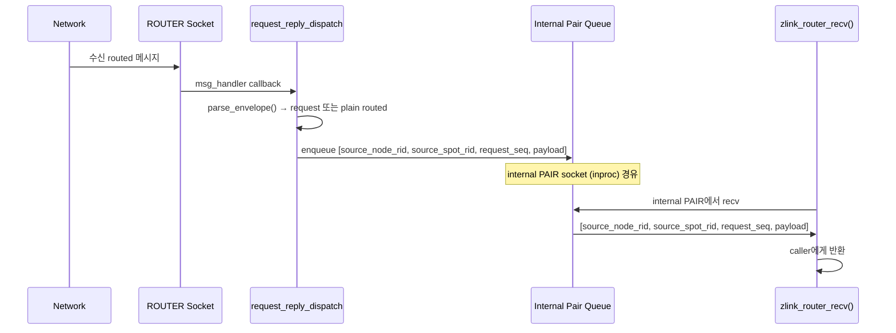

## 8. Timer 및 Scheduler 아키텍처

### 8.1 컴포넌트 다이어그램

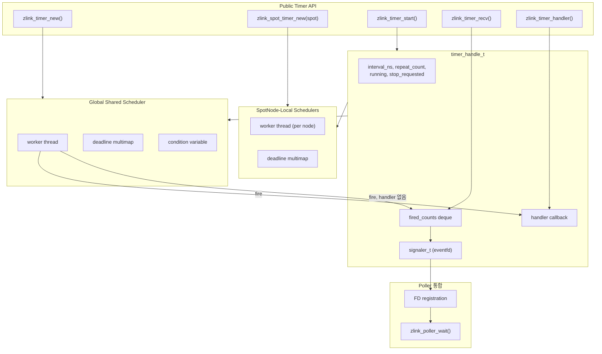

### 8.2 Timer Fire 시퀀스

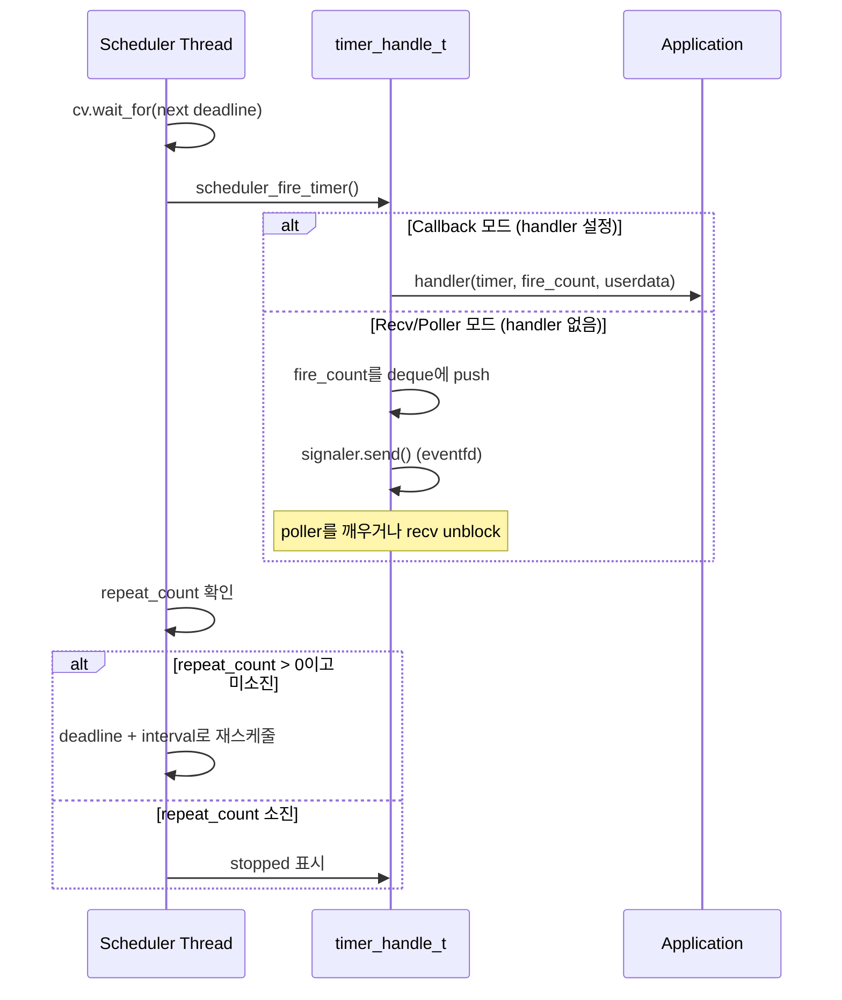

### 8.3 Request Timeout Scheduler

Request timeout scheduler는 timer scheduler와 **별도**이다.
Request-reply timeout 전용 스케줄러이다.

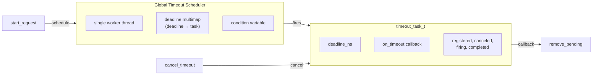

- 모든 request timeout을 위한 단일 global thread
- 다수의 단기 timeout에 효율적
- 취소 지원 및 fire/cancel 경합 해소

## 9. Internal Pair Queue 메커니즘

Internal pair queue는 I/O 스레드의 internal dispatch와 application 스레드의
user recv 호출 사이를 중계한다.

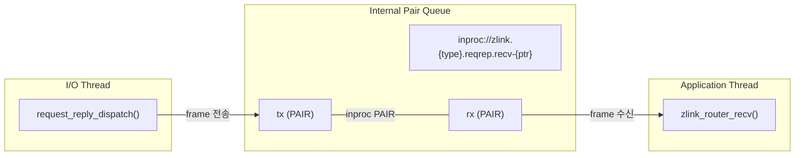

구조:

```cpp
struct internal_pair_queue_t {
    socket_base_t *rx;     // 수신 (application thread)
    socket_base_t *tx;     // 송신 (dispatch thread)
    std::string endpoint;  // 고유 inproc endpoint
};
```

Queue 생성 (`ensure()`):
1. 고유 inproc endpoint 생성
2. PAIR 소켓 2개 생성: rx (bind), tx (connect)
3. 양방향 handshake (0x11 → 0x22 → back)
4. linger = 0 설정 (clean shutdown)

ROUTER recv queue frame 인코딩 (routed 표면 통합 — 이 큐는 일반 ROUTER
트래픽과 SPOT에서 시작된 routed 트래픽을 같은 framing으로 전달한다):
- Frame 1: `source_node_rid` 바이트
- Frame 2: `source_spot_rid` 바이트 (일반 ROUTER 트래픽이면 길이 0)
- Frame 3: `request_seq` (8바이트 Big Endian; fire-and-forget이면 `0`)
- Frame 4+: Payload parts

## 10. 가중치 전파

raw ROUTER와 DEALER 소켓은 typed option API로 자기 피어 가중치를 바꿀 수
있다. SpotNode와 Spot에는 별도 로컬 weight 설정 옵션이 없다. 내부 구현은 raw
소켓의 변경을 연결된 피어에게 **최선 노력(best-effort) 런타임 신호**로 알리고,
피어는 자신의 가중치 캐시를 갱신해서 outbound 후보 선택에 반영한다.

기본 동작 약속:

- 가중치 변경은 즉시 로컬 캐시에 반영된다. 같은 노드에서 동작하는 다른
  outbound 경로(예: 로컬 spot 또는 router send)는 그 즉시 새 값을
  본다.
- peer 쪽 전파는 SpotNode peer control 경로(`peer_ctrl_pub`/
  `peer_ctrl_sub`)와 raw socket 쪽 전용 weight 신호 경로로
  이루어진다. 이 신호는 누락 가능성을 가정한 best-effort runtime
  control 신호이며, 강한 동기 모델을 보장하지는 않는다.
- 재연결할 때는 가중치가 다시 동기화된다. 새 세션이 ready
  되면 현재 가중치를 한 번 더 advertise해서 stale cache로 인한
  잘못된 후보 선택을 줄인다.
- peer 쪽 가중치 cache가 `0`을 보면 outbound 후보에서 그 peer를
  제외하고, 후보가 모두 `0`이면 submit을
  `ZLINK_SUBMIT_NOT_ADMITTED`로 정규화해 반환한다. 상태 캐시 전파보다
  연결 변화가 먼저 관찰되는 경합 상황에서는 같은 거절이
  `ZLINK_SUBMIT_NOT_CONNECTED` 또는 `ZLINK_SUBMIT_NOT_FOUND`로 먼저 보일
  수 있다.
- raw socket 쪽 변경은 socket monitor의
  `ZLINK_EVENT_PEER_WEIGHT_CHANGED`로 외부에 노출된다. 내부 구현은 peer
  식별자(`routing_id`)와 새 가중치를 같은 이벤트 payload에 함께 싣는다.
