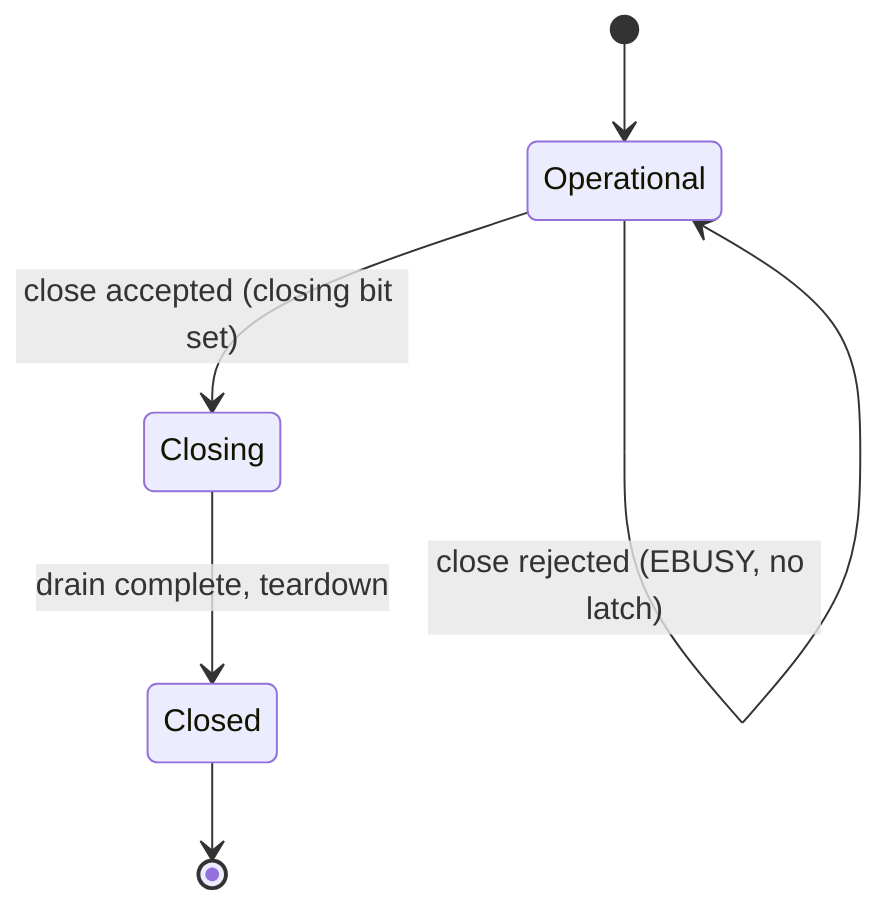

[English](thread-safety.md) | [한국어](thread-safety.ko.md)

# Thread-Safety Internals

This document covers the implementation details behind zlink's public
thread-safety contract. For the user-facing guide (what you can and
cannot do), see [Thread-Safety Guide](../guide/11-thread-safety.md).

## 1. Overview

zlink's public handles (sockets, SPOT, monitors) are thread-safe by default,
but not all APIs carry the same
cost. Internally the library classifies every public API into one of
three tiers, each with its own ordering semantics, performance
constraints, and error rules.

The three-tier contract is an internal design tool — users see "send
freely, configure anytime, close with clear error codes." This document
explains how each tier is implemented.

## 2. Three-Tier Contract (Formal Definition)

### 2.1 Hot Path Guaranteed

**Target APIs:**

- `zlink_send()`
- `zlink_publish()`
- Same-handle `send` / `publish` from inside an admitted callback

**Ordering semantics:**

- Single-thread sequential: calls from one thread preserve call order.
- Multi-thread concurrent: each message is delivered intact. The
  interleaving order follows the internal serialization order, not the
  caller scheduling order. There is no guaranteed ordering between
  threads.
- Callback-thread sends and worker-thread sends on the same handle
  follow the same concurrent contract.

**Performance constraints:**

- No broad lock on the send path.
- No per-call allocation in steady state.
- Minimal atomic operations (acquire/release on admission gate, CAS
  where needed).
- Short critical sections only — no retry loops, no backoff waits.
- Existing send queue publication paths are reused; no extra wakeups
  introduced.

**After accepted close:** new send entry fails with `ESHUTDOWN`. Already
enqueued messages drain before teardown completes (drain-then-close).

### 2.2 Control Path Serialized

**Target APIs:**

- `zlink_bind()` / `zlink_connect()` / `zlink_disconnect()`
- `zlink_set_option()` / `zlink_get_option()`
- `zlink_set_subscription()` / `zlink_unset_subscription()`
- `zlink_*_monitor_open()`
- `zlink_send_ready_handler()`
- Snapshot/query functions that remain in the public contract

**Correctness-first serialization:**

- Same-handle concurrent control-path calls are safe. Execution order
  is determined by internal serialization, not caller scheduling.
- A successfully returned control-path call is visible to all
  subsequently admitted calls.

**Lightweight runtime reads vs heavy queries:**

Lightweight reads (`ZLINK_OPT_EVENTS`,
`ZLINK_OPT_LAST_ENDPOINT`, routing-id queries) belong to the control path
but do not carry the full serialization cost of heavy query/snapshot
calls. They are classified as a lightweight subset — always thread-safe,
but not forced through the heaviest serialization lane.

**After accepted close:** new control-path entry fails with
`ESHUTDOWN`. In-progress mutations complete normally or converge to
`ESHUTDOWN`.

### 2.3 Lifecycle Strict

**Target APIs:**

- `zlink_close()` (sockets)
- `zlink_spot_destroy()` / `zlink_mesh_node_destroy()`
- Monitor handle `close` / `destroy`

**Admission gate mechanism:**

The lifecycle gate is a single atomic word that tracks two pieces of
state: a closing bit and an in-flight count. This enables fail-fast
decisions without broad locks.



| Condition | errno | Meaning |
|---|---|---|
| In-flight admitted API on the same handle | `EBUSY` | Another thread is executing; close rejected |
| Close already accepted, new API entry | `ESHUTDOWN` | Handle shutting down; no new work |
| Double close / destroy | `EALREADY` | Already shutting down |

**Key rules:**

- **`EBUSY` is fail-fast, no-latch.** A failed close does not
  permanently transition the handle to a closing state. After `EBUSY`,
  the handle returns to its previous operational state completely.
- **Drain-then-close.** After close is accepted, all enqueued messages
  are drained before teardown completes. Drain is not best-effort — it
  exhausts all messages enqueued at the moment close was accepted.
- **Self-close from callback.** If a send-ready or monitor callback
  calls `close` on its own handle, the actual teardown is deferred
  until the callback epilogue. This prevents use-after-free inside
  the callback.
- **STREAM raw callback restriction.** Calling `close` from inside a
  STREAM raw callback fails with `EBUSY` — raw dispatch is in-flight.

## 3. Per-Subject Implementation Notes

### 3.1 Raw Socket

The raw socket is the primary hot-path subject. Its `send()`
implementation publishes to the internal send queue — the same path
used for single-threaded sends, extended with an admission gate for
concurrent entry.

- **Admission gate:** a single `atomic<uint32_t>` word per socket
  tracks the in-flight count and closing bit
  (`socket_base.hpp` / `socket_base.cpp`).
- **Send queue publication:** concurrent producers enqueue through the
  existing pipe/YPipe infrastructure. The I/O thread consumer side is
  unchanged.
- **Control-path lock:** `bind`, `connect`, `set_option`, etc. go
  through a separate serialization path that does not share state or
  cache lines with the hot-path admission gate.

### 3.2 Spot / MeshNode

- **Public contract:** `zlink_spot_publish` follows the hot-path tier. The
  `MeshNode` owns membership and configuration; subscription changes and peer
  mutations follow the control path.
- **Internal delivery:** Spot direct and Logical Multicast delivery is
  performed by the MeshNode dispatch runtime (owner mailboxes, the ready
  index and claims), not by dedicated child sockets. These internal units
  are not direct subjects of the public thread-safety contract — the Spot
  facade and claim contracts cover them; mailbox admission and claim
  linearization are internal implementation concerns.

### 3.3 Monitor

Monitor is a control-plane-centric subject.

- `monitor_open` / `monitor_close` are control-path serialized.
- Monitor delivery observes the parent handle's state without
  introducing a broad lock on the parent's hot path.
- Parent hot-path send must never block on monitor delivery.

## 4. Service Public API Guard

`service_public_api.hpp` provides the `service_public_api_guard_t`
class used by SPOT and SPOT Node to
implement the lifecycle and control-path tiers.

**Implementation:**

The guard uses a single `atomic<uint32_t>` with two fields packed into
one word:

- **Bit 31 (closing bit):** set when close/destroy is accepted.
- **Bits 0-30 (in-flight count):** tracks the number of currently
  admitted public API calls.

**How each tier maps to the guard:**

| Tier | Guard role |
|---|---|
| Lifecycle strict | `begin_close_or_fail_busy()` checks in-flight count and closing bit atomically. Returns `EBUSY` if in-flight > 0, `ESHUTDOWN` if closing bit already set. On success, sets the closing bit. |
| Control path serialized | `enter_public_api()` increments the in-flight count after checking the closing bit. If closing bit is set, returns `ESHUTDOWN`. All control-path calls go through this gate, providing serialization. |
| Hot path | Send paths bypass the guard's broad lock. They use separate minimal-cost admission (the socket-level admission gate) to avoid contention with control-path serialization. |

**Cancel close:** `cancel_close()` clears the closing bit, supporting
the no-latch property — a failed `begin_close_or_fail_busy()` at a
higher level can restore the handle to operational state.

## 5. Callback Dispatch Internals

Different callbacks run on different threads:

- **Socket message handler** (`zlink_recv_handler`) runs on an I/O thread
  via async mailbox processing.
- **Monitor handler** runs on the service-control runtime thread — a
  dedicated task (`monitor_handler_task`) that drains monitor events in a
  recv loop, not the parent's I/O thread.
- **Send-ready handler** can run synchronously on the *caller's* send
  thread: an armed notification fires inline from
  `notify_send_ready_if_armed()` during the send path.
- **MeshNode ready handler** (`zlink_mesh_node_set_ready_handler`)
  runs on the SPOT dispatch worker pool.

The dispatch mechanism uses atomic loads to read handler pointers, ensuring
visibility of handler replacements without broad locks on the hot path.

**Handler loading:**

```cpp
// fields live in socket_dispatch_bridge_t
handler = socket_msg_handler.load(std::memory_order_acquire);
```

All handler function pointers and associated subject/userdata pointers
use `memory_order_acquire` loads. Setter functions use corresponding
`memory_order_release` stores. This guarantees that when a callback
dispatch reads a handler pointer, it also sees all data the setter
thread wrote before installing the handler.

**Callback entry/exit:**

```cpp
enter_callback_api();   // marks callback as in-flight
handler(subject, userdata);
leave_callback_api();   // clears in-flight flag
```

The `enter_callback_api` / `leave_callback_api` pair makes `close` see the
callback as an in-flight operation. Depending on the callback kind, a `close`
during the callback is either rejected with `EBUSY` (STREAM raw) or accepted and
deferred to the epilogue (send-ready/monitor); see below.

**STREAM raw callback constraint:**

STREAM raw callbacks have a stricter restriction — `close` from inside
a raw callback always fails with `EBUSY`. Unlike send-ready/monitor
callbacks where `close` is deferred to the epilogue, STREAM raw dispatch
does not support deferred close.

**Send-ready handler `EDEADLK` constraint:**

Replacing the send-ready handler from inside its own callback would
create a reentrant dispatch situation. This is detected and rejected
with `EDEADLK`.

## 6. Design Principles

### Hot path / control-plane separation

- Hot-path state and control-plane state use separate data structures.
- Hot-path cache lines and control-plane cache lines are kept separate
  to avoid false sharing.
- Hot-path admission and lifecycle admission share only the minimum
  necessary state (the closing bit check).

### Hot path: minimal cost

- Minimal atomic operations per send (acquire/release for admission,
  CAS only where structurally required).
- Short critical sections — no sleep, no retry, no allocation.
- Reuse existing send queue publication paths.

### Control path: serialization allowed, hot path degradation forbidden

- Control-path operations may use internal serialization lanes and
  short critical sections.
- Control-plane locks must not share cache lines or lock instances with
  hot-path admission.
- A control-path call must never block a concurrent hot-path send.

### Lifecycle: single-word admission gate

- The admission gate is a single atomic word — no multi-step locking
  protocol.
- Fail-fast with no-latch: a rejected close leaves no residual state.
- Drain-then-close: teardown waits for enqueued messages to be
  consumed, then proceeds with resource cleanup.
