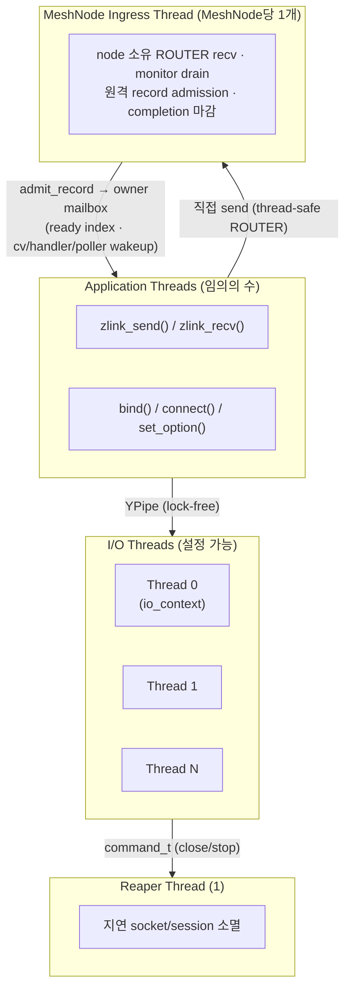
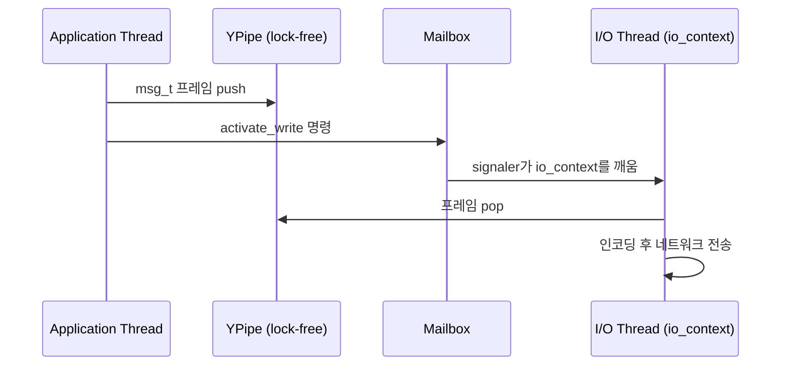

[English](threading-model.md) | [한국어](threading-model.ko.md)

# 스레딩 및 동시성 모델

이 문서는 zlink의 내부 스레딩 구조를 설명한다. 어떤 스레드가 존재하고
각각 무슨 일을 하는지, 서로 어떻게 통신하고 작업이 어떻게 스케줄링되는지를
다룬다. 공개 API 안전 계약은 [Thread-Safety 내부 구조](thread-safety.ko.md)를 본다.

## 1. 스레드 구조

### 1.1 스레드 종류

| 스레드 | 역할 | 수량 |
|--------|------|------|
| Application thread | `zlink_send()`, `zlink_recv()`, `bind()`, `connect()` 등 호출 | 사용자 정의 |
| I/O thread | Boost.Asio `io_context` 실행. 비동기 네트워크 I/O, 프레임 인코딩/디코딩, socket 이벤트 dispatch | 설정 가능 (기본: 4) |
| Reaper thread | 종료된 socket과 session의 지연 소멸 | 1 (전역) |
| MeshNode ingress thread | node 소유 ROUTER recv, socket monitor drain, 원격 record admission, completion 마감 | MeshNode당 1개 |
| Timeout scheduler thread | request/operation deadline 도래 시 timeout completion 생성 | 1 (전역, immortal) |

I/O thread 수는 context 생성 시 설정한다:

```c
void *ctx = zlink_ctx_new();
zlink_ctx_set(ctx, ZLINK_IO_THREADS, 4);  /* 기본값은 ZLINK_IO_THREADS_DFLT = 4 */
```

`zlink_ctx_new()`은 context만 할당한다. I/O thread 풀은 런타임을 처음 쓸 때
(첫 소켓 생성 또는 service-runtime 시작) 지연 시작되고 `zlink_ctx_term()`
호출 시 종료된다. 풀이 시작된 뒤에는 스레드 수를 바꿀 수 없다.

### 1.2 스레드 다이어그램



---

## 2. 설계 의도

Application thread와 I/O thread를 분리하는 목적은 두 가지다.

1. **지연 시간 격리**: application thread는 네트워크 I/O 완료를 기다리며 블록되지 않는다.
   `zlink_send()`는 메시지를 pipe에 넣고 바로 반환한다. YPipe 자체는 SPSC 구조지만, public
   send 경로는 admission/`_out_sync` fast lock을 거치고 HWM에 막히면(blocking send) 잠시
   대기할 수 있다. 실제 네트워크 전송은 I/O thread가 비동기로 처리한다.
2. **연결별 I/O thread 격리**: 각 연결은 하나의 I/O 스레드 이벤트 루프에서 처리되므로,
   transport/session 이벤트 경로에서는 연결 내부에 잠금이 거의 필요 없다. public API
   진입의 동기화는 애플리케이션 스레드 진입점의 입장 허용 게이트(admission gate)로 처리한다.

Reaper thread는 use-after-free와 double-free 버그를 막는다. I/O thread가 이벤트 루프를
실행하는 도중에는 안전하게 해제할 수 없는 자원을 Reaper에 넘기면, Reaper가 이벤트 루프 밖에서
처리한다.

---

## 3. I/O Thread 할당

### 3.1 Connection-to-thread 고정

소켓을 만들 때는 socket 객체와 mailbox만 생기고, 아직 I/O thread를 고르지 않는다.
I/O thread 선택은 `bind`/`connect`로 transport endpoint를 만들거나 async dispatch를
시작할 때, 연결(connection/session) 단위로 이뤄진다. 한 소켓이 여러 연결을 가지면
연결마다 다른 I/O thread에 걸칠 수 있고, 한 번 정해진 연결의 I/O thread는 그 연결이
살아 있는 동안 바뀌지 않는다.

public `send`/`recv`는 호출자(application) thread에서 socket으로 바로 진입해
lock-free pipe에 쓰거나 읽는다. 실제 transport 송수신, timer, session 이벤트는
그 연결의 I/O thread에서 처리된다.

### 3.2 부하 분산 (least-load)

연결 할당에는 **least-load(최소 부하 선택)** 정책을 쓴다. 현재 등록된 핸들(연결)
수가 가장 적은 I/O thread가 다음 연결을 받는다(STREAM은 기본 round-robin, §io-thread).

```
new_connection → argmin(handle_count[t] for t in io_threads)
```

스캔은 최소값을 고르기 전에 회전 시작 인덱스(`_next_io_thread`)를 쓰므로,
부하가 같은 스레드는 항상 thread 0을 선호하지 않고 라운드로빈으로 채워진다.
STREAM session은 `ZLINK_ASIO_STREAM_SESSION_SCHED=minload`가 설정되지 않는 한
기본적으로 단순 라운드로빈으로 할당된다. 카운트는 소켓 생성 및 소멸 시 원자적으로
갱신한다. 할당한 뒤에는 재분배가 없다.

### 3.3 어피니티 마스크

소켓별 `ZLINK_OPT_AFFINITY` 옵션으로 그 소켓을 할당할 수 있는 I/O 스레드를 제한한다.
비트 N이 `1`이면 I/O 스레드 N이 후보가 되고, `0`(기본값)이면 모든 스레드를 허용한다.
이 마스크는 소켓 생성 시 할당하는 시점에만 참조하며, 이미 할당된 소켓을 재배치하지는 않는다.

```c
/* 이 소켓을 I/O 스레드 0과 2로 제한 */
uint64_t mask = (1ULL << 0) | (1ULL << 2);
zlink_set_option(socket, ZLINK_OPT_AFFINITY, &mask, sizeof(mask));
```

---

## 4. 스레드 간 통신

### 4.1 YPipe — 락-프리 데이터 경로

메시지 데이터는 **YPipe**(단방향 비잠금 SPSC 큐)를 거쳐 application thread에서 I/O thread로 전달한다.
YPipe는 단일 생산자 단일 소비자(SPSC) 락-프리 FIFO로, 방향(send/recv)마다
소켓당 하나씩 둔다. CAS(Compare-And-Swap, 원자적 비교-교환 연산) 기반의 two-pointer 방식과 "flush batch" 최적화를 쓴다:

```
application thread          I/O thread
-----------------           ----------
push(msg)를 YPipe에 넣기  →  YPipe에서 msg를 꺼내기
flush() 신호 보내기       →  io_context 깨우기
```

YPipe가 SPSC이므로 flush(큐에 쌓인 항목을 소비자 측으로 한 번에 넘기는 동작) 때 포인터 교환 연산 하나면 된다. mutex나
메시지별 atomic 연산이 없다.

### 4.2 Mailbox — 제어 명령

bind, connect, set_option, 소켓 close 같은 저빈도 제어 연산은 **Mailbox**(스레드 간 명령 전달 큐)로
직렬화한다. Mailbox는 `signaler_t`(eventfd 또는 pipe 기반 파일 디스크립터로 I/O thread를 깨우는 신호 장치)가 받쳐 주는
thread-safe 명령 큐다:

```cpp
class mailbox_t {
    cpipe_t _cpipe;              /* 명령 파이프 (ypipe_t<command_t>) */
    signaler_t _signaler;        /* 명령 enqueue 시 io_context를 깨움 */
    mutex_t _sync;               /* 동시 송신자 보호 */
    boost::asio::io_context *_io_context;
};
```

`send()`는 `_sync` 아래에서 명령을 쓰고, signal한 뒤 `boost::asio::post()`로
drain 핸들러를 post한다. I/O 스레드는 그 post된 핸들러에서 명령 파이프를
drain한다(루프 시작에서 폴링하는 방식이 아니다). 명령 타입에는 `stop`, `plug`,
`attach`, `bind`, `activate_read`, `activate_write`, `hiccup`, `reap`, `reaped`
등이 있다.

### 4.3 데이터 흐름 요약



---

## 5. Reaper Thread

소켓이 닫힐 때 I/O thread가 자원을 곧바로 해제하지 못하는 경우가 있다. session 객체를
참조하는 진행 중인 async 연산이 있기 때문이다. close handoff는 Reaper에 `reap`
명령을 보내고, Reaper는 소켓을 자신의 poller에 등록한다. 소켓이 shutdown을 마치면
`reaped` 명령을 되돌려 보낸다. Reaper는 이벤트 루프 잠금 없는 전용 스레드에서 자원을
해제한다.

Reaper는 자체 Mailbox를 쓰며, 명령이 `process_reap()` / `process_reaped()`를 구동한다:

```
process_reap(socket)   → start_reaping(socket); ++sockets
process_reaped()       → --sockets; terminating && sockets == 0 이면 종료
```

---

## 6. MeshNode ingress thread

`mesh_node_t`마다 하나의 OS 스레드가 wire ingress 루프를 실행한다. node 소유
raw ROUTER는 thread-safe이므로 **송신은 앱 스레드에서 직접** 일어나고, 이
스레드는 다음만 담당한다.

- ROUTER recv: envelope 파싱, admission 검증, record를 owner mailbox에 admit
- socket monitor drain: `CONNECTION_READY`로 outbound intent를 매칭해 HELLO
  발송, peer 단절 처리
- 원격 request의 completion 마감(`complete_operation`)

application dispatch 콜백을 이 스레드가 직접 실행하지 않는다 — ready handler는
wakeup 전용이고, record 소비는 소비자 스레드가 claim으로 수행한다.
timeout completion은 전역 timeout scheduler 스레드(immortal singleton)가
deadline에 만든다. 자세한 객체 구조는
[서비스 계층 내부 설계](services-internals.ko.md)를 본다.


## 7. NUMA 및 CPU 핀닝

zlink는 기본적으로 자신의 백그라운드 스레드를 특정 CPU 코어에 고정하지 않는다.
다만 context는 `ZLINK_THREAD_AFFINITY_CPU_ADD` / `ZLINK_THREAD_AFFINITY_CPU_REMOVE`
context 옵션으로 자신이 시작하는 스레드의 CPU 어피니티를 요청할 수 있으며, 이는 각
백그라운드 스레드 시작 전에 적용된다(`pthread_setaffinity_np`). NUMA 지역성이
중요하다면 애플리케이션에서 다음을 수행한다:

1. `ZLINK_IO_THREADS`를 NUMA 토폴로지에 맞게 설정한다.
2. 어피니티 마스크로 소켓 그룹별로 특정 I/O 스레드에 할당한다.
3. `ZLINK_THREAD_AFFINITY_CPU_ADD`로 zlink 백그라운드 스레드를 고정하고, 해당
   소켓에서 `zlink_send()`를 호출하는 애플리케이션 스레드에 OS 수준 CPU 어피니티를
   적용한다.

소켓은 생성 시 I/O 스레드에 영구히 고정되므로, 애플리케이션 스레드와 그
I/O 스레드를 같은 NUMA 노드에 두면 cross-node YPipe 접근이 없어진다.

---

## 8. 동시 접근 패턴

이 스레딩 모델에서 다음 패턴은 안전하고 동작이 명확하게 정의된다
(전체 계약은 [Thread-Safety 내부 구조](thread-safety.ko.md) 참고).
공개 socket handle은 여러 스레드에서 동시 사용 가능하지만, 모든 API가 같은 비용과
같은 실패 규칙을 갖는 것은 아니다.
`send`/`publish`/`send_rid` 같은 hot path는 여러 스레드에서 동시에 쓸 수 있으며,
control path는 정확성을 위해 내부에서 직렬화한다.

### 8.1 여러 스레드에서 `zlink_send()` 동시 호출

각 `zlink_send()` 호출은 입장 허용 게이트를 지난 뒤 경량 spinlock으로 YPipe에 쓰고
Mailbox에 신호를 보낸다. I/O 스레드는 YPipe를 독립적으로 drain(소비)한다:

```c
/* Thread A */                      /* Thread B */
zlink_send(s, &a, 1, 0);            zlink_send(s, &b, 1, 0);
/* 모두 안전 — hot-path admission guard가 파이프 쓰기를 직렬화 */
```

### 8.2 한 스레드가 close하는 동안 다른 스레드가 send

`zlink_close()`는 fail-fast(빠른 실패) lifecycle 게이트를 쓴다. 다른 스레드가 그 핸들의
hot-path API 안에 있으면 곧바로 `ZLINK_CLOSE_BUSY`를 반환한다. close 호출자는 성공할 때까지
재시도해야 한다. close가 수락되면 이후 해당 핸들에 대한 API 호출은 `ZLINK_CLOSE_SHUTDOWN`을
반환한다.

### 8.3 콜백 전달과 동시 send

콜백마다 실행 스레드가 다르므로 단일 "콜백 스레드"는 없다. socket message 핸들러는
I/O 스레드, monitor 핸들러는 service-control 런타임 스레드, send-ready 핸들러는
호출자의 send 스레드에서 동기적으로, SPOT dispatch 이벤트 핸들러는 SPOT dispatch
worker pool에서 실행된다. 애플리케이션 스레드에서는 동시에 `zlink_send()`를 호출할 수
있다 — 입장 허용 게이트가 콜백 경로와 send 경로를 분리한다. 콜백 안에서 해당 핸들에
`zlink_close()`를 호출해도 데드락은 없다. send-ready·monitor self-close는 콜백
epilogue로 지연되고, socket message·STREAM dispatch self-close는 `ZLINK_CLOSE_BUSY`를
반환한다.

---

## 9. Context 스레드 안전성

Context 객체(`zlink_ctx_new()`)는 완전히 thread-safe하다. 여러 thread에서 동시에
소켓을 생성하고 종료할 수 있다:

```c
/* 안전: 같은 context에서 여러 thread가 소켓 생성 */
void *s1 = zlink_socket(ctx, ZLINK_SOCKET_DEALER);  /* thread A */
void *s2 = zlink_socket(ctx, ZLINK_SOCKET_DEALER);  /* thread B */
```

`zlink_ctx_term()`은 모든 소켓이 닫힐 때까지 블록한다. 소켓 수명을 관리하는
thread와 같은 thread에서 호출하거나, 호출 전에 모든 소켓을 닫아야 한다.

---

## 10. 요약

| 속성 | 값 |
|------|----|
| 연결 고정 | bind/connect/dispatch 시 연결 단위로 I/O 스레드 결정, 이후 변경 없음 |
| 할당 정책 | Least-load (핸들 수 최소 스레드, STREAM은 기본 round-robin) |
| Application→I/O 데이터 경로 | 락-프리 YPipe (SPSC) |
| Application→I/O 제어 경로 | Mailbox (스레드 안전, signaler 기반) |
| 지연 소멸 | Reaper 스레드 (전역 1개) |
| 동시 send | 입장 허용 게이트로 안전 |
| 동시 close + send | 안전. close는 hot-path 호출자가 빠져나올 때까지 `BUSY` 반환 |
| 콜백 실행 스레드 | 콜백별: socket message → I/O 스레드; monitor → service-control 스레드; send-ready → 호출자의 send 스레드; MeshNode ready handler → wakeup 전용(notify 경로) |
| MeshNode ingress thread | MeshNode당 1개; ROUTER recv·monitor drain·원격 admission 전담 |
| MeshNode 송신 경로 | 앱 스레드 직접 send (thread-safe ROUTER) |
| Timeout scheduler | 전역 1개 (immortal); operation deadline completion |
| 서비스 record 소비 스레드 | 소비자 스레드가 drain/claim/receive batch로 수행 (콜백은 wakeup 전용) |

---
[← 아키텍처](architecture.ko.md) | [Thread-Safety →](thread-safety.ko.md)
