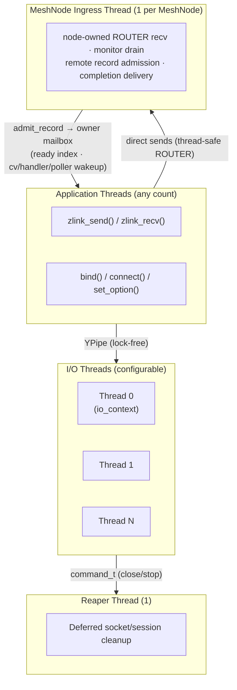
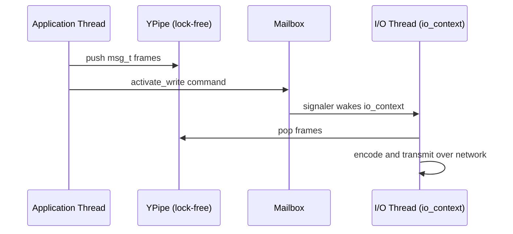

[English](threading-model.md) | [한국어](threading-model.ko.md)

# Threading and Concurrency Model

This document explains the internal threading architecture of zlink: which
threads exist, what each one does, how they communicate, and how work is
scheduled. The public API safety contract lives in
[Thread-Safety Internals](thread-safety.md).

## 1. Thread Structure

### 1.1 Thread Types

| Thread | Role | Count |
|--------|------|-------|
| Application thread | Calls `zlink_send()`, `zlink_recv()`, `bind()`, `connect()`, etc. | User-defined |
| I/O thread | Runs a Boost.Asio `io_context`; performs async network I/O, frame encoding/decoding, and socket event dispatch | Configurable (default: 4) |
| Reaper thread | Deferred destruction of terminated sockets and sessions | 1 (global) |
| MeshNode ingress thread | Receives on the node-owned ROUTER, drains the socket monitor, admits remote records and delivers completions | 1 per MeshNode |
| Timeout scheduler thread | Produces timeout completions at request/operation deadlines | 1 (global, immortal) |

Set the I/O thread count at context creation time:

```c
void *ctx = zlink_ctx_new();
zlink_ctx_set(ctx, ZLINK_IO_THREADS, 4);  /* default is ZLINK_IO_THREADS_DFLT = 4 */
```

`zlink_ctx_new()` only allocates the context; the I/O thread pool starts
lazily on first runtime use (first socket creation or service-runtime
startup) and stops when `zlink_ctx_term()` is called. The thread count cannot
be changed after the pool has started.

### 1.2 Thread Diagram



---

## 2. Design Rationale

The separation of application threads from I/O threads serves two goals:

1. **Latency isolation**: application threads are never blocked waiting for
   network I/O completion. `zlink_send()` enqueues the message and returns. The
   YPipe itself is SPSC, but the public send path goes through the
   admission/`_out_sync` fast lock and may wait briefly when blocked by HWM
   (blocking send). The actual network transmission is handled asynchronously by
   the I/O thread.
2. **Per-connection I/O thread isolation**: because each connection is handled on
   one I/O thread's event loop, the transport/session event path rarely needs
   locks inside a connection. Public API entry-point synchronization is handled
   by the admission gate on the application thread.

The Reaper thread avoids a class of use-after-free and double-free bugs:
resources that the I/O thread cannot safely release while its event loop is
running are handed off to the Reaper, which runs outside any event loop.

---

## 3. I/O Thread Assignment

### 3.1 Connection-to-thread pinning

Creating a socket allocates the socket object and a mailbox but does not yet
pick an I/O thread. The I/O thread is chosen per connection (connection/session)
when `bind`/`connect` creates a transport endpoint or async dispatch starts. A
socket with multiple connections may span multiple I/O threads, and once a
connection's I/O thread is chosen it never changes for that connection's
lifetime.

Public `send`/`recv` enter the socket on the caller (application) thread and
write to / read from the lock-free pipe. The actual transport send/receive,
timers, and session events run on the connection's I/O thread.

### 3.2 Load balancing (least-load)

Connection assignment uses a **least-load** policy: the I/O thread with the
fewest registered handles (connections) receives the next connection (STREAM
defaults to round-robin, see io-thread).

```
new_connection → argmin(handle_count[t] for t in io_threads)
```

The scan uses a rotating start index (`_next_io_thread`) before picking the
minimum, so equal-load threads are filled round-robin rather than always
favoring thread 0. STREAM sessions default to plain round-robin assignment
unless `ZLINK_ASIO_STREAM_SESSION_SCHED=minload` is set. The count is updated
atomically at socket creation and again at socket close; there is no
rebalancing after assignment.

### 3.3 Affinity mask

The per-socket `ZLINK_OPT_AFFINITY` option restricts which I/O threads are
eligible for that socket's assignment. Bit N set to `1` makes I/O thread N
eligible; `0` (the default) allows all threads. The mask is consulted only when
the socket is assigned at creation time; it does not rebalance a socket that is
already assigned.

```c
/* Restrict this socket to I/O threads 0 and 2 */
uint64_t mask = (1ULL << 0) | (1ULL << 2);
zlink_set_option(socket, ZLINK_OPT_AFFINITY, &mask, sizeof(mask));
```

---

## 4. Inter-Thread Communication

### 4.1 YPipe — lock-free data path

Message data travels from application threads to I/O threads through
**YPipe**, a single-producer single-consumer lock-free FIFO. Each socket has
one YPipe per direction (send / recv). The algorithm uses a CAS-based
two-pointer scheme with a "flush batch" optimization:

```
application thread        I/O thread
-----------------         ----------
push(msg) to YPipe  →  pop(msg) from YPipe
flush() signal      →  wake up io_context
```

Because YPipe is SPSC, the only atomic operation needed is the pointer swap
during flush. No mutex, no per-message atomic.

### 4.2 Mailbox — control commands

Low-frequency control operations (bind, connect, set_option, socket close) are
serialized through a **Mailbox** — a thread-safe command queue backed by a
`signaler_t` (an eventfd or pipe-based file descriptor):

```cpp
class mailbox_t {
    cpipe_t _cpipe;              /* command pipe (ypipe_t<command_t>) */
    signaler_t _signaler;        /* wakes the io_context when commands are enqueued */
    mutex_t _sync;               /* guards concurrent senders */
    boost::asio::io_context *_io_context;
};
```

`send()` writes the command under `_sync`, signals, and posts a drain handler
via `boost::asio::post()`; the I/O thread drains the command pipe from that
posted handler (not by polling at the top of a loop). Command types include:
`stop`, `plug`, `attach`, `bind`, `activate_read`, `activate_write`, `hiccup`,
`reap`, and `reaped`.

### 4.3 Data flow summary



---

## 5. Reaper Thread

When a socket is closed the I/O thread cannot always free its resources
immediately — in-flight async operations hold references to session objects.
The close handoff sends a `reap` command to the Reaper, which registers the
socket on the Reaper's own poller; once the socket finishes shutting down it
sends a `reaped` command back. The Reaper then deallocates the resources from
a dedicated thread that holds no event-loop locks.

The Reaper uses its own Mailbox; commands drive `process_reap()` /
`process_reaped()`:

```
process_reap(socket)   → start_reaping(socket); ++sockets
process_reaped()       → --sockets; finish when terminating && sockets == 0
```

---

## 6. MeshNode Ingress Thread

Each `mesh_node_t` runs one OS thread executing the wire ingress loop. The
node-owned raw ROUTER is thread-safe, so **sends happen directly on
application threads**; the ingress thread is responsible only for:

- ROUTER recv: envelope parsing, admission validation, admitting records into
  owner mailboxes
- socket monitor drain: matching outbound intents on `CONNECTION_READY` and
  sending the HELLO, handling peer loss
- admitting completions for remote requests (`complete_pending_operation`)

This thread never executes application dispatch callbacks — the ready handler
is wakeup-only, and record consumption happens on consumer threads through
claims. Timeout completions are produced by the global timeout scheduler
thread (an immortal singleton) at each deadline. See
[Service Layer Internal Design](services-internals.md) for the object model.


## 7. NUMA and CPU Pinning

By default zlink does not pin its background threads to specific CPU cores.
A context can, however, request CPU affinity for the threads it starts via the
`ZLINK_THREAD_AFFINITY_CPU_ADD` / `ZLINK_THREAD_AFFINITY_CPU_REMOVE` context
options, which are applied (`pthread_setaffinity_np`) before each background
thread starts. If NUMA locality matters, the application should:

1. Set `ZLINK_IO_THREADS` to match the NUMA topology.
2. Use the affinity mask to assign groups of sockets to specific I/O threads.
3. Pin zlink's background threads with `ZLINK_THREAD_AFFINITY_CPU_ADD`, and use
   OS-level CPU affinity on the application threads that call `zlink_send()` on
   those sockets.

Because a socket is pinned to one I/O thread for life, keeping the application
thread and its I/O thread on the same NUMA node eliminates cross-node YPipe
accesses.

---

## 8. Concurrent Access Patterns

The threading model makes the following concurrent patterns safe and
well-defined (see [Thread-Safety Internals](thread-safety.md) for the full
contract). Hot paths such as `send`/`publish`/`send_rid` are admitted through
the lightweight data-plane gate; control paths serialize for correctness.

### 8.1 Multiple threads calling `zlink_send()` concurrently

Each `zlink_send()` call acquires the admission gate, writes to the shared
YPipe under a lightweight spinlock, and signals the Mailbox. The I/O thread
drains the YPipe independently. This means:

```c
/* Thread A */          /* Thread B */
zlink_send(s, &a, 1, 0);   zlink_send(s, &b, 1, 0);
/* both safe — hot-path admission guard serializes pipe writes */
```

### 8.2 One thread closing while another is sending

`zlink_close()` uses a fail-fast lifecycle gate: it returns `ZLINK_CLOSE_BUSY`
immediately if any thread is inside a hot-path API on that handle. The closing
thread must retry until it succeeds. Once accepted, new API calls on the
handle return `ZLINK_CLOSE_SHUTDOWN`.

### 8.3 Callback delivery vs. concurrent send

Different callbacks run on different threads, so there is no single "callback
thread": the socket message handler runs on an I/O thread, the monitor handler
on the service-control runtime thread, the send-ready handler synchronously on
the caller's send thread, and SPOT dispatch event handlers on the SPOT
dispatch worker pool. Application threads can still call `zlink_send()`
concurrently — the admission gate separates the callback path from the send
path. Calling `zlink_close()` on a handle from inside its own callback does
not deadlock: send-ready and monitor self-close are deferred to the callback
epilogue, while socket message / STREAM dispatch self-close returns
`ZLINK_CLOSE_BUSY`.

---

## 9. Context Thread Safety

The context object (`zlink_ctx_new()`) is fully thread-safe. Sockets may be
created and destroyed from different threads simultaneously:

```c
/* safe: multiple threads creating sockets from the same context */
void *s1 = zlink_socket(ctx, ZLINK_SOCKET_DEALER);  /* thread A */
void *s2 = zlink_socket(ctx, ZLINK_SOCKET_DEALER);  /* thread B */
```

`zlink_ctx_term()` blocks until all sockets are closed. Call it from the same
thread that manages socket lifetime, or ensure all sockets are closed before
calling it.

---

## 10. Summary

| Property | Value |
|----------|-------|
| Connection pinning | I/O thread chosen per connection at bind/connect/dispatch, fixed thereafter |
| Assignment policy | Least-load (fewest handles); STREAM defaults to round-robin |
| Application→I/O data path | Lock-free YPipe (SPSC) |
| Application→I/O control path | Mailbox (thread-safe, signaler-based) |
| Deferred cleanup | Reaper thread (one global) |
| Concurrent sends | Safe via admission gate |
| Concurrent close + send | Safe; close returns `BUSY` until hot-path callers exit |
| Callback thread | Per callback: socket message → I/O thread; monitor → service-control thread; send-ready → caller's send thread; MeshNode ready handler → wakeup-only (notify path) |
| MeshNode ingress thread | 1 per MeshNode; ROUTER recv, monitor drain, remote admission |
| MeshNode send path | Direct sends from application threads (thread-safe ROUTER) |
| Timeout scheduler | 1 global (immortal); operation deadline completions |
| Service record consumption | Consumer threads via drain/claim/receive batches (callbacks are wakeup-only) |

---
[← Architecture](architecture.md) | [Thread-Safety →](thread-safety.md)
