# SPOT Entry Spot과 Transport Queue 정리

이 문서는 Entry Spot, Actor join/leave, remote join handoff, Spot transport queue
정리를 위한 **참조 spec의 단일 기준**이다. 정식 공개 계약은
`doc/spec/core/service/spot.ko.md`와 `core/include/zlink.h`를 기준으로 한다.

이 문서는 이전 `doc/spec/draft/spot-actor-dispatch.ko.md`의 Actor 모델을 이어받되,
그 뒤에 결정된 Entry Spot, Actor 이동, remote join, Spot socket 제거 규칙을 한곳에
모아 독립적으로 정의한다. 구현, 테스트, contract matrix, plan traceability는 이
문서를 기준으로 맞춘다.

이 문서는 아래 의미를 구현 기준으로 정한다.

- Actor 생성 직후 상태
- Actor `join` / `leave` 의미
- Actor destroy 허용 조건
- `Spot` facade와 내부 socket의 관계
- SPOT pub/sub, routed, channel reply, Actor event의 queue 소유 위치

### 구현 완료 범위

아래 항목은 현재 코드(`core/src/api/service_spot_actor_api.cpp`,
`core/src/services/spot/`)에 반영된 구현 완료 상태다.

- Entry Spot lifecycle: `SpotNode` 생성 시 자동 생성, destroy 시 자동 정리
- `zlink_spot_node_entry_spot()` API
- Actor 생성 직후 Entry Spot 귀속
- local join/leave/accept/reject/timeout 원자성
- `Spot` facade의 물리 socket 소유 제거 (transport socket은 모두 `SpotNode` 소유)
- `spot_logical_state_t` 기반 per-Spot pubsub queue (`subscribe_queue` + `signaler`)
- `actor_handle_t` 기반 per-Actor unread part queue
- `g_join_queues` 기반 per-Spot join request queue
- `zlink_spot_node_actor_join_spot()` / `zlink_spot_actor_join_recv()` /
  `zlink_spot_actor_join_reply()` 공개 API
- `zlink_spot_node_actor_leave_spot()` 공개 API
- `zlink_spot_node_spot_lookup()` / `zlink_spot_node_spots()` 공개 API
- same-process `SpotNode` registry를 통한 remote create-or-get과 remote join 경로

### 후속 구현 범위

아래 항목은 이 문서의 방향성이지만 현재 공개 계약이나 구현 완료 조건이 아니다.

- cross-process control/relay frame (session instance와 Actor/Spot runtime instance
  분리 배치)
- session Actor list의 원격 compare-and-swap
- network backpressure retry와 `JoinOp` tombstone/retry

## 목적

현재 Actor 구현은 `SpotNode`가 Actor table과 session mapping을 관리하고, Actor가
`Spot`에 join하면 `Spot` dispatch event에서 Actor message를 처리한다. 이 방향은
맞지만, Actor가 `Spot`에 join하기 전 메시지를 어떻게 처리할지, Actor가 초기
인증이나 대상 `Spot` 선택을 어디서 수행할지에 대한 개념이 남아 있다.

또한 기존 SPOT 내부 구조는 `Spot` facade가 pub/sub side socket이나 routed receive
queue용 inproc socket을 만들며, socket의 filter와 HWM을 queue처럼 활용하려는
흔적이 있다. 하지만 `SpotNode`가 한 번 메시지를 중계하는 구조에서는 물리
transport와 logical dispatch queue가 섞여 구조가 복잡해진다. 이 초안은
backpressure 기준을 `SpotNode`가 소유한 실제 socket HWM에 두고, `Spot`과 Actor의
내부 queue는 입력을 배분하고 dispatch 순서를 보존하는 staging 상태로만 다룬다.

이 초안의 목적은 아래 한 문장으로 정리된다.

**주소는 Actor, 실행 직렬화는 Spot, 물리 transport는 SpotNode가 맡는다.**

이를 위해 `SpotNode`에 정확히 하나의 `Entry Spot`을 두고, 모든 Actor는 생성 직후
`Entry Spot`에 속하도록 한다. `Spot`은 물리 socket 소유자가 아니라 logical dispatch
context와 queue 소유자가 된다.

## 핵심 모델

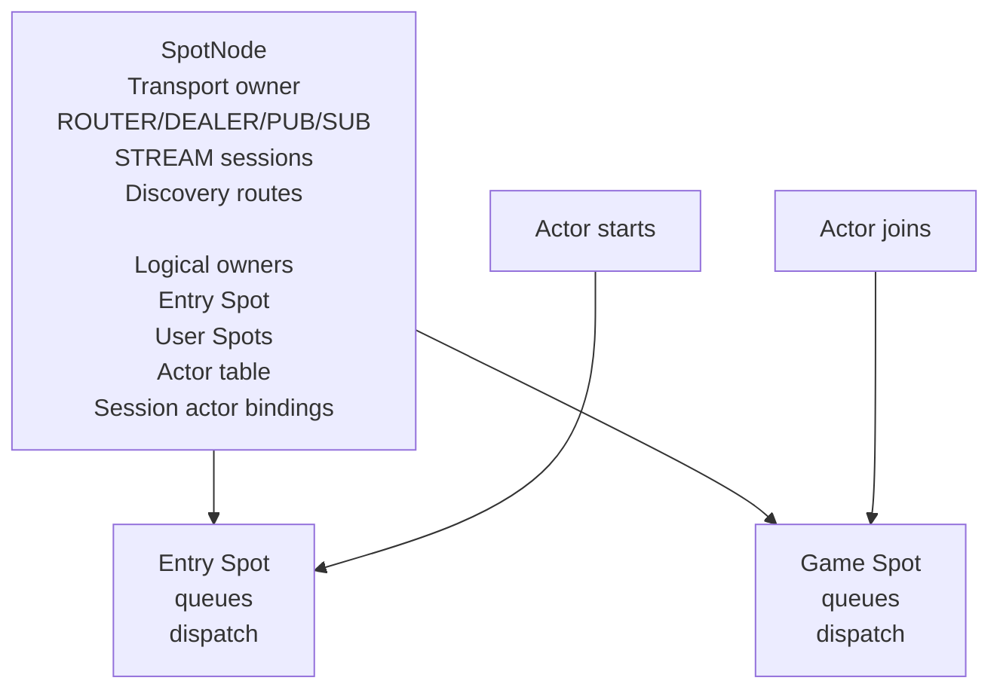

위 다이어그램에서 `SpotNode`는 물리 transport를 소유한다. `Spot`은 transport를
직접 소유하지 않고, 자신에게 귀속된 queue와 dispatch event 순서만 소유한다.

### Component diagram

아래 다이어그램은 `SpotNode` 내부 책임을 socket, state, queue, handler 흐름으로
보여 준다. `Spot` facade는 node 내부 state를 참조하고, Actor는 public handle이
아니라 `zlink_actor_ref_t`로 식별한다.

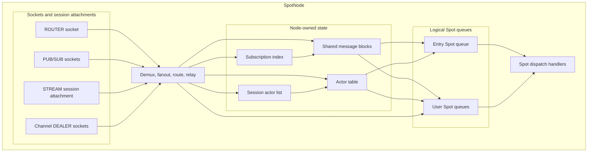

배치 관점에서는 같은 구성요소가 아래 두 모델로 쓰인다. 첫 번째 모델에서는 session,
Actor, Spot이 같은 instance 안에 있으므로 Actor 이동은 local Spot 사이에서 끝난다.
두 번째 모델에서는 session instance가 Actor/Spot runtime instance와 분리되어 있어
remote Actor ref와 remote Spot join handoff가 필요하다.

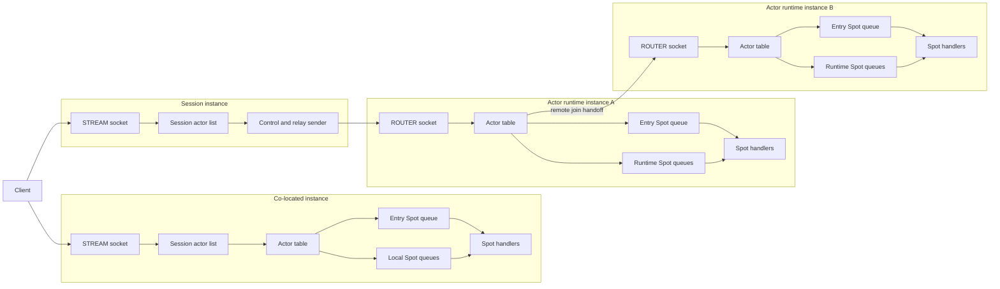

구현 경계는 아래처럼 나눈다.

- `SpotNode`는 `ROUTER`, `PUB/SUB`, channel `DEALER` socket을 소유하고, STREAM
  session attachment와 Actor relay 상태를 관리한다.
- `Spot` facade는 logical Spot queue를 참조하며 socket을 소유하지 않는다.
- Actor ref는 Actor table entry를 식별하고, Actor table은 current Spot queue로
  readable event를 보낸다.
- `Subscription index`는 physical SUB filter와 Spot별 구독 목록을 관리한다.
- pub/sub fanout payload는 `Shared message blocks`에 한 번 저장하고, 각 Spot queue는
  reference와 cursor만 가진다.
- co-located instance에서 Actor는 local Actor이고, join 대상은 같은 node의 local Spot을
  기본으로 한다.
- split 배치에서 session instance는 remote Actor ref를 session Actor list에 저장하고,
  Actor/Spot runtime instance로 control frame과 relay frame을 보낸다. 이 경로는 현재
  구현 완료 범위가 아니라 후속 cross-process transport 범위다.

### Sequence diagrams

#### Actor 생성과 Entry Spot dispatch

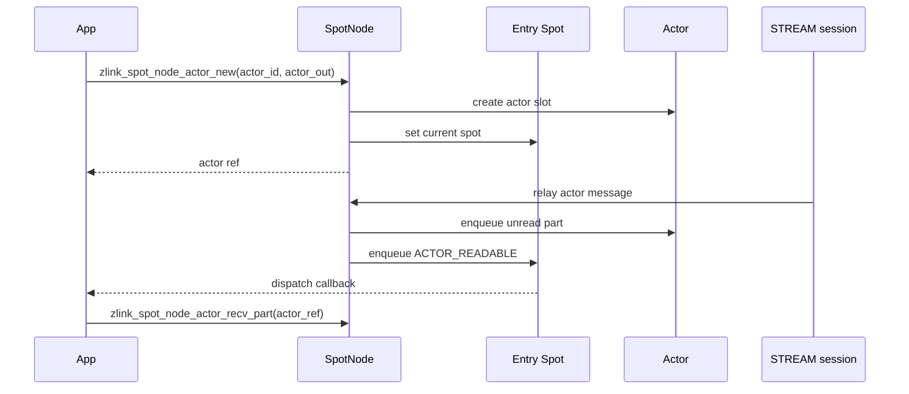

#### Local join으로 current Spot 이동

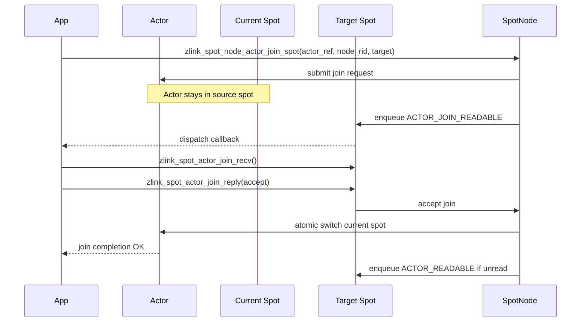

#### Remote join으로 Actor owner 이동

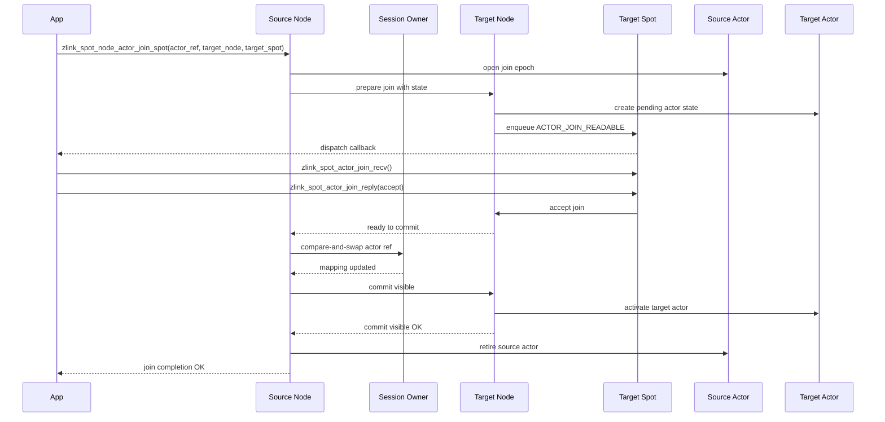

remote join에서 target Spot이 reject하거나 timeout되면 source Actor는 계속 source
Spot에 남는다. target node의 prepared Actor state는 폐기되고 active route는 바뀌지
않는다.

#### local publish와 Spot fanout

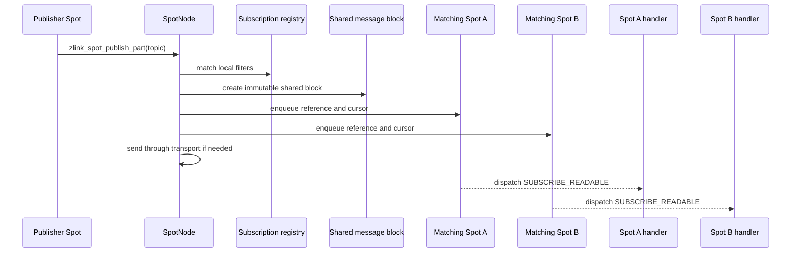

#### Remote Actor create-or-get

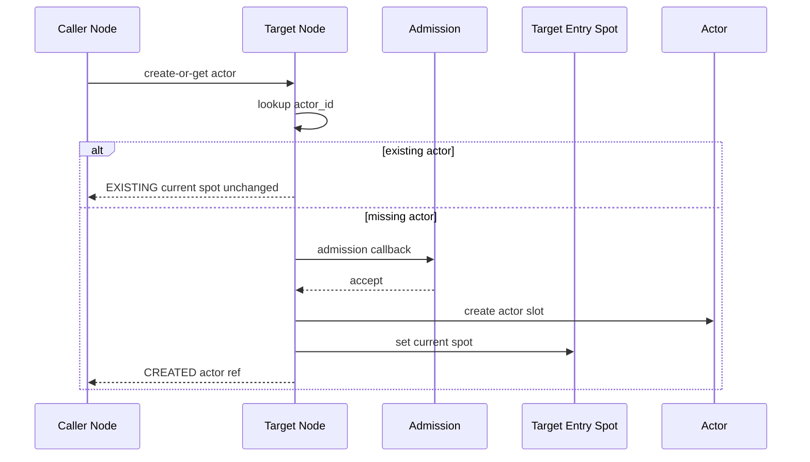

## 설계 원칙

1. `SpotNode`당 `Entry Spot`은 정확히 하나다.
2. local 생성 또는 remote create-or-get으로 새로 만들어진 Actor는 생성 직후 반드시
   owner node의 `Entry Spot`에 속한다.
3. Actor는 정상 lifecycle 동안 항상 정확히 하나의 `Spot`에 속한다.
4. `join`은 Actor를 현재 `Spot`에서 대상 `Spot`으로 이동시키는 요청이다.
5. `leave`는 Actor를 현재 `Spot`에서 `Entry Spot`으로 되돌리는 요청이다.
6. Actor message는 항상 현재 속한 `Spot`의 dispatch event에서 처리한다.
7. Actor 전용 callback dispatch context는 만들지 않는다.
8. `Spot` facade는 물리 socket을 소유하지 않는다.
9. transport socket HWM은 network transport admission과 backpressure 기준으로
   사용한다. `Spot`과 Actor 내부 queue에는 별도 HWM이나 조정 가능한 queue 한계를
   두지 않는다.
10. channel dealer, routed ingress, pub/sub ingress, STREAM session relay는 모두
    `SpotNode`에서 demux한 뒤 대상 `Spot` queue로 넣는다.

## 용어

| 용어 | 의미 |
|------|------|
| Entry Spot | `SpotNode`가 항상 가지고 있는 기본 `Spot` |
| current Spot | Actor가 현재 속한 정확히 하나의 `Spot` |
| user Spot | application이 명시적으로 만든 일반 `Spot` |
| logical Spot | dispatch context와 queue를 가진 `Spot` 상태 |
| Spot facade | application이 public API에 넘기는 `Spot` handle |
| transport socket | `SpotNode`가 소유하는 실제 ROUTER, DEALER, PUB, SUB, STREAM socket |
| Spot queue | routed, subscribe, channel reply, Actor event를 저장하는 per-Spot queue |
| transport HWM | 실제 socket send/recv HWM |
| dispatch staging queue | `SpotNode` 내부에서 입력을 배분하고 순서를 보존하는 queue |

## 기존 구현과의 차이

현재 구현은 Actor가 생성된 뒤 명시적 join 전까지 unjoined 상태일 수 있다. 이 초안은
그 상태를 일반 lifecycle에서 제거한다. Actor는 생성 직후 `Entry Spot`에 배치된다.

현재 구현은 `leave`를 "joined Spot에서 빠져나와 unjoined 상태가 되는 동작"으로
해석한다. 이 초안은 `leave`를 "현재 Spot에서 Entry Spot으로 돌아가는 동작"으로
재정의한다.

현재 구현은 `Spot` 생성 시 pub/sub side socket이나 routed receive state를 lazily
만들 수 있다. 이 초안은 `Spot`이 물리 socket을 직접 만들지 않고, 모든 physical
transport와 network-facing socket은 `SpotNode` runtime이 소유하도록 바꾼다.

## Entry Spot

### 생성과 lifecycle

`SpotNode`가 생성되면 내부적으로 `Entry Spot` logical state도 함께 생성된다.
`Entry Spot`은 node destroy 전까지 살아 있으며, application이 제거할 수 없다.

`Entry Spot`은 별도의 logical `Spot` 객체다. 일반 `Spot`과 같은 dispatch event
handler를 가질 수 있고, application은 이 handler에서 새 Actor의 초기 메시지,
인증, 대상 `Spot` 선택, single-player 초기 상태 구성 같은 작업을 수행한다.

`Entry Spot`은 특별한 transport를 갖지 않는다. 다른 `Spot`과 똑같이 `SpotNode`
transport와 per-Spot queue를 사용한다.

### Entry Spot handle

application은 `Entry Spot`에 dispatch handler를 등록해야 하므로 public 표면이
필요하다. 새 API는 아래와 같다.

```c
ZLINK_EXPORT zlink_config_result_t zlink_spot_node_entry_spot(
  void *node_,
  void **spot_out_);
```

계약:

- `node_ == NULL`이면 `ZLINK_CONFIG_INVALID_HANDLE`로 실패하고 `errno`는 `EFAULT`다.
- `spot_out_ == NULL`이면 `ZLINK_CONFIG_INVALID_ARGUMENT`로 실패하고 `errno`는
  `EINVAL`이다.
- 실패하면 `spot_out_`이 `NULL`이 아닐 때 `*spot_out_ = NULL`로 둔다.
- 성공하면 `*spot_out_`에 새 `Entry Spot` facade handle을 반환한다.
- 반환된 facade는 `zlink_spot_dispatch_event_handler()` 등 기존 `Spot` API에
  사용할 수 있다.
- 반환된 facade는 기존 `Spot`과 같은 방식으로 `zlink_set_routing_id()`와
  `zlink_get_routing_id()`를 지원한다.
- `Entry Spot` logical state는 `SpotNode`가 소유한다.
- 반환된 facade handle은 application이 소유하며 `zlink_spot_destroy()`로 닫아야 한다.
- `zlink_spot_destroy()`는 Entry Spot facade만 닫고 logical Entry Spot은 제거하지
  않는다.
- 같은 node에서 이 API를 여러 번 호출하면 서로 다른 facade handle이 같은 logical
  Entry Spot을 가리킨다.
- `SpotNode` destroy 시 live Entry Spot facade가 남아 있으면 기존 live Spot facade와
  같은 lifecycle 규칙을 따른다.

### Entry Spot routing id

`Entry Spot`도 일반 `Spot`처럼 routing id를 가진다. routing id는 아래 용도로
필요하다.

- Actor snapshot의 current Spot 표시
- Actor active route의 joined Spot 표시
- 운영 도구에서 Entry Spot과 user Spot 구분
- application이 Entry Spot을 고정된 논리 주소로 노출해야 하는 경우

기본값은 `SpotNode` 생성 시 생성되는 random routing id다. application이 고정 rid를
원하면 `zlink_spot_node_entry_spot()`으로 facade를 얻은 뒤 기존
`zlink_set_routing_id(entry_spot, data, size)`를 호출한다.

계약:

- Entry Spot rid 설정은 configuration phase에서만 허용한다.
- configuration phase는 `SpotNode` 생성 뒤, Actor 생성 전, Discovery attach 또는
  bind/connect로 외부에 노출되기 전 단계다.
- configuration phase는 별도 전환 API를 갖지 않는다. 첫 Actor 생성, Discovery attach,
  SpotNode bind/connect, Spot owner route publish, Actor active route publish 중 하나가
  먼저 발생하면 Entry Spot rid는 자동으로 잠긴다.
- Actor가 하나라도 생성된 뒤 Entry Spot rid를 바꾸려고 하면
  `ZLINK_CONFIG_INVALID_STATE`로 실패하고 `errno`는 `EBUSY`다.
- Entry Spot rid가 Actor active route나 Spot owner route로 publish된 뒤에는
  바꿀 수 없다.
- `zlink_get_routing_id(entry_spot, out)`은 현재 Entry Spot rid를 반환한다.
- Entry Spot rid는 같은 `SpotNode` 안 다른 user Spot rid와 중복될 수 없다.

이 제한은 Actor가 항상 정확히 하나의 Spot에 속한다는 모델을 유지하기 위해 필요하다.
Entry Spot rid가 runtime 중 바뀌면 Actor snapshot, Discovery active route,
pending dispatch event가 서로 다른 Spot을 가리키는 것처럼 보일 수 있다.

node 생성과 동시에 rid를 지정하는 새 field는 첫 범위에 넣지 않는다. Entry Spot rid는
Entry Spot facade를 조회한 뒤 기존 `zlink_set_routing_id()`로 설정한다.

### Spot 조회

```c
ZLINK_EXPORT zlink_config_result_t zlink_spot_node_spot_lookup(
  void *node_,
  const zlink_routing_id_t *spot_rid_,
  void **spot_out_);

ZLINK_EXPORT zlink_config_result_t zlink_spot_node_spots(
  void *node_,
  zlink_spot_node_spot_entry_t *entries_,
  size_t *count_);
```

계약:

- `zlink_spot_node_spots()`은 `SpotNode` 안의 live local Spot 목록을
  반환한다. Entry Spot도 이 목록에 포함된다.
- `zlink_spot_node_spot_lookup()`은 `SpotNode` 안의 live local Spot을 `spot_rid_`로
  조회하고, 성공하면 `*spot_out_`에 새 owned Spot facade handle을 저장한다.
- 반환된 Spot facade handle은 application이 `zlink_spot_destroy()`로 닫아야 한다.
- 일반 Spot logical state는 facade reference count로 관리한다. lookup으로 얻은
  facade가 살아 있으면 처음 생성한 facade가 닫혀도 logical Spot은 제거되지 않는다.
- 일반 Spot logical state는 마지막 facade가 닫힐 때 제거된다.
- 일반 Spot에 joined Actor나 pending join request가 남아 있으면 마지막 facade close는
  `ZLINK_CLOSE_BUSY`로 실패하고 `errno`는 `EBUSY`다. 이 경우 facade handle은 계속
  live 상태로 남는다.
- application은 Spot을 제거하기 전에 해당 Spot의 Actor를 다른 Spot으로 join하거나
  Entry Spot으로 leave해야 한다. Spot destroy는 Actor를 자동으로 Entry Spot으로
  옮기지 않는다.
- 일반 Spot logical state가 제거될 때 해당 Spot의 subscription은 registry에서 제거하고
  filter ref-count를 줄인다. routed, subscribe, channel reply queue에 남아 있는 unread
  message와 readiness event는 폐기하고 message reference를 해제한다.
- 아직 완료되지 않은 channel request completion이 해당 Spot logical state를 참조하면
  terminated 계열 completion으로 닫는다.
- Entry Spot lookup은 Entry Spot facade를 반환한다. Entry Spot logical state는
  `SpotNode`가 소유하므로 마지막 facade가 닫혀도 제거되지 않는다.
- `zlink_spot_node_spot_lookup()`은 현재 routing id index를 기준으로 조회한다.
  `zlink_set_routing_id()`가 성공하면 같은 logical Spot을 가리키는 모든 facade의
  routing id가 함께 바뀌고, lookup index도 old rid에서 new rid로 원자적으로 이동한다.
- routing id 변경 뒤 old rid lookup은 not found가 되고, new rid lookup은 같은 logical
  Spot에 대한 새 facade를 반환한다.
- 같은 logical Spot을 가리키는 여러 facade에서 동시에 routing id 변경을 요청하면
  `SpotNode` event loop에서 직렬화된 순서로 처리한다. 첫 번째 성공 뒤 두 번째 요청은 새
  current rid를 기준으로 다시 검증한다. 중복 rid나 lifecycle lock에 걸리면 실패하고,
  성공하면 모든 facade와 lookup index가 마지막으로 성공한 rid를 함께 본다.
- `node_ == NULL`이면 `ZLINK_CONFIG_INVALID_HANDLE`로 실패하고 `errno`는 `EFAULT`다.
- `spot_rid_ == NULL` 또는 `spot_out_ == NULL`이면
  `ZLINK_CONFIG_INVALID_ARGUMENT`로 실패하고 `errno`는 `EINVAL`이다.
- 같은 rid의 live local Spot이 없으면 `ZLINK_CONFIG_NOT_FOUND`로 실패하고 `errno`는
  `ENOENT`이며 `spot_out_`은
  변경하지 않는다.
- remote Spot owner 조회는 Discovery Spot owner resolve가 담당한다. 이 lookup은 local
  `SpotNode` 안의 Spot facade 조회만 담당한다.

## Actor lifecycle 의미 변경

### Actor ref

이 draft의 Actor public API는 `void *actor` handle을 노출하지 않고
`zlink_actor_ref_t`로 통일한다. local Actor와 remote Actor를 같은 방식으로 다루기
위해서다. application은 Actor ref나 `actor_id`를 key로 자기 Actor 객체를 관리한다.
core Actor slot은 `SpotNode` 내부 상태이며, pending remote join state도 public handle로
노출하지 않는다.

```c
#define ZLINK_ACTOR_ID_MAX 256

typedef struct zlink_actor_ref_t
{
    zlink_routing_id_t node_rid;
    char actor_id[ZLINK_ACTOR_ID_MAX];
    uint64_t generation;
} zlink_actor_ref_t;
```

`node_rid`는 현재 Actor owner `SpotNode` routing id다. local join에서는 이 값이
`dest_node_rid_`와 같고, remote join이 성공하면 target node routing id를 가진 새
Actor ref로 session Actor list와 active route가 갱신된다.

`actor_id`는 NUL-terminated UTF-8 byte string으로 취급한다. `actor_id`의 유효 문자
최대 길이는 `ZLINK_ACTOR_ID_MAX - 1`, 즉 255 bytes다. `actor_id` 배열은 NUL 종료
문자를 포함해 총 256 bytes다. 빈 문자열, NUL 종료되지 않은 값, 255 bytes를 넘는 값은
invalid argument다. 같은 `SpotNode` 안 live Actor id는 유일해야 하지만, 서로 다른
node에는 같은 actor id가 동시에 존재할 수 있다.

`generation == 0`은 unchecked ref다. unchecked ref는 invalid가 아니며, target node의
현재 같은 `actor_id` Actor를 대상으로 처리한다. `generation != 0`은 checked ref이고,
target Actor generation과 다르면 stale 또는 conflict 계열 실패로 끝난다.

checked `generation`은 Actor owner `SpotNode`의 node-local monotonic counter에서 발급한
non-zero 값이다. 새 local Actor 생성, remote create-or-get으로 새 Actor가 만들어지는
경우, remote join prepare가 target node에 pending Actor state를 만드는 경우 모두 해당
node가 새 generation을 발급한다. destroy 뒤 같은 `actor_id`로 다시 생성해도 이전
generation을 재사용하지 않는다. local join과 leave는 Actor owner가 바뀌지 않으므로
generation을 바꾸지 않는다. remote join 성공 뒤 session Actor list와 active route에
저장되는 target Actor ref는 source generation을 복사하지 않고 target node에서 새로
발급한 generation을 사용한다. `zlink_spot_node_actor_lookup()`과 Actor 생성 API는
checked ref를 반환하고, `zlink_remote_actor_get_ref()`는 generation `0` unchecked ref를
만든다.

### Actor 생성

```c
ZLINK_EXPORT zlink_config_result_t zlink_spot_node_actor_new(
  void *node_,
  const char *actor_id_,
  zlink_actor_ref_t *actor_out_);
```

계약:

- 성공한 Actor는 즉시 `Entry Spot`에 속하고, `actor_out_`에는 checked Actor ref가
  저장된다.
- Actor 생성은 Entry Spot dispatch handler나 join request handler를 거치지 않는다.
- Actor 생성 직후 session relay message가 도착하면 Entry Spot dispatch event로
  `ACTOR_READABLE`이 올라간다.
- Entry Spot dispatch handler가 없으면 event는 pending 상태로 남는다.
- Actor 생성 실패 조건에는 Entry Spot queue/state 초기화 실패가 포함된다.
- 같은 `SpotNode` 안 live Actor id 중복은 계속 `EBUSY`다.
- `node_ == NULL`이면 `ZLINK_CONFIG_INVALID_HANDLE`로 실패하고 `errno`는 `EFAULT`다.
- `actor_id_ == NULL` 또는 `actor_out_ == NULL`이면
  `ZLINK_CONFIG_INVALID_ARGUMENT`로 실패하고 `errno`는 `EINVAL`이다.
- 실패하면 `actor_out_`이 가리키는 값은 변경하지 않는다.

이렇게 하면 Actor가 unjoined 상태에서 callback이나 별도 dispatch context를 요구하는
경우가 사라진다.

### Actor 조회

```c
ZLINK_EXPORT zlink_config_result_t zlink_spot_node_actor_lookup(
  void *node_,
  const char *actor_id_,
  zlink_actor_ref_t *out_);
```

계약:

- `zlink_spot_node_actor_lookup()`은 `SpotNode` 안의 live local Actor를 `actor_id_`로
  조회하고 checked Actor ref를 `out_`에 저장한다.
- 이 함수는 Actor public handle을 반환하지 않는다. 조회 결과는
  `zlink_actor_ref_t`이며, 이후 Actor recv, join, leave, destroy, bound session send,
  bound session close API의 입력으로 사용한다.
- 조회 대상은 호출한 `SpotNode`가 소유한 live local Actor다. remote Actor 위치 조회는
  Discovery active route resolve가 담당하고, unchecked ref 생성은
  `zlink_remote_actor_get_ref()`가 담당한다.
- `node_ == NULL`이면 `ZLINK_CONFIG_INVALID_HANDLE`로 실패하고 `errno`는 `EFAULT`다.
- `actor_id_ == NULL` 또는 `out_ == NULL`이면 `ZLINK_CONFIG_INVALID_ARGUMENT`로
  실패하고 `errno`는 `EINVAL`이다.
- 같은 `actor_id_`의 live local Actor가 없으면 not found 계열 실패로 끝나고 `out_`은
  변경하지 않는다.

### Remote Actor create-or-get

remote create-or-get도 Actor slot을 소유하는 target `SpotNode` 관점에서는 local Actor
생성과 같은 lifecycle을 따른다. 차이는 Actor 생성 요청이 local API 호출이 아니라
control request로 들어오고, Actor가 없을 때 admission handler를 거친다는 점뿐이다.
현재 구현은 같은 process 안 등록 node를 직접 찾는 경로를 사용한다. 실제 network
control request 인코딩과 전송은 후속 범위다.

```c
typedef enum zlink_actor_admission_result_t
{
    ZLINK_ACTOR_ADMISSION_ACCEPT = 1,
    ZLINK_ACTOR_ADMISSION_REJECT = 2
} zlink_actor_admission_result_t;

typedef zlink_actor_admission_result_t (*zlink_actor_admission_handler_fn)(
  void *node_,
  const char *actor_id_,
  const zlink_msg_t *message_,
  void *userdata_);

typedef enum zlink_actor_create_status_t
{
    ZLINK_ACTOR_CREATE_CREATED = 1,
    ZLINK_ACTOR_CREATE_EXISTING = 2
} zlink_actor_create_status_t;

typedef struct zlink_actor_create_result_t
{
    zlink_actor_create_status_t status;
    zlink_actor_ref_t actor;
} zlink_actor_create_result_t;

ZLINK_EXPORT zlink_handler_result_t zlink_spot_node_actor_admission_handler(
  void *node_,
  zlink_actor_admission_handler_fn handler_,
  void *userdata_);

ZLINK_EXPORT zlink_request_result_t zlink_spot_node_create_remote_actor(
  void *node_,
  const zlink_routing_id_t *target_node_rid_,
  const char *actor_id_,
  zlink_msg_t *message_,
  zlink_actor_create_result_t *out_,
  uint32_t timeout_ms_);
```

계약:

- `zlink_spot_node_create_remote_actor()`가 target node에 새 Actor slot을 만들면 그
  Actor의 current Spot은 target node의 Entry Spot이다.
- 새 remote Actor는 Entry Spot dispatch handler나 join request handler를 거치지
  않는다. 기존 remote create admission handler만 Actor 생성 여부를 결정한다.
- 같은 `actor_id`의 Actor가 이미 있으면 새 Actor를 만들지 않고 `EXISTING`을 반환한다.
  이때 Actor의 current Spot은 바꾸지 않는다.
- 이미 user Spot에 있는 Actor에 대해 create-or-get이 들어와도 `EXISTING`을 반환하고
  Entry Spot으로 되돌리지 않는다.
- remote create-or-get으로 새 Actor가 만들어진 직후 session relay message가 도착하면
  Entry Spot dispatch event로 `ACTOR_READABLE`이 올라간다.
- remote create-or-get 성공만으로 Actor active route를 publish하지 않는다. active
  route publish 시점은 기존 Actor dispatch 계약처럼 STREAM bind 성공 시점이다.
- request submit이 성공하면 `message_` 소유권은 라이브러리로 이전된다. local validation
  또는 submit 전 실패가 발생하면 `message_` 소유권은 caller에게 남는다.
- `node_ == NULL`이면 `ZLINK_REQUEST_INVALID_ARGUMENT`로 실패하고 `errno`는 `EFAULT`다.
- `target_node_rid_ == NULL`, `actor_id_ == NULL`, `out_ == NULL`이면
  `ZLINK_REQUEST_INVALID_ARGUMENT`로 실패하고 `errno`는 `EINVAL`이다.
- 실패하면 `out_`이 가리키는 값은 변경하지 않는다.
- `timeout_ms_ == 0`은 nonblocking request다. 즉시 완료할 수 없으면
  `ZLINK_REQUEST_TIMED_OUT` 또는 busy 계열 결과로 실패하고 `errno`는 `EAGAIN`,
  `EWOULDBLOCK`, `EBUSY` 중 하나다.
- remote Actor destroy 조건도 local destroy와 같다. `zlink_spot_node_actor_destroy()`가
  remote Actor owner node로 전달되었을 때 target Actor가 user Spot에 있으면
  `ZLINK_REQUEST_INVALID_STATE`로 실패하고, Entry Spot에 있으면 Actor slot과 unread
  상태를 폐기한다.

### Actor join

`join`은 "Actor를 어떤 Spot에 붙인다"가 아니라 "현재 Spot에서 대상 Spot으로
이동한다"는 뜻이다. 별도 `move` API는 만들지 않는다. Actor는 항상 current Spot을
가지므로 모든 join은 현재 Spot에서 target Spot으로 가는 move이고, `leave`는 Entry
Spot으로 join하는 축약 동작이다.

```c
ZLINK_EXPORT zlink_submit_result_t zlink_spot_node_actor_join_spot(
  void *node_,
  const zlink_actor_ref_t *actor_,
  const zlink_routing_id_t *dest_node_rid_,
  const zlink_routing_id_t *dest_spot_rid_,
  zlink_msg_t *message_,
  zlink_reply_handler_fn handler_,
  void *userdata_,
  zlink_send_flags_t flags_,
  uint32_t timeout_ms_);
```

`zlink_actor_join_info_t`는 target Spot이 join request를 판단할 때 필요한 source와
target 정보를 모두 담는다.

```c
#define ZLINK_ACTOR_JOIN_INFO_REMOTE 1u

typedef struct zlink_actor_join_info_t
{
    zlink_actor_ref_t source_actor;
    zlink_actor_ref_t target_actor;
    zlink_routing_id_t source_node_rid;
    zlink_routing_id_t source_spot_rid;
    zlink_routing_id_t target_node_rid;
    zlink_routing_id_t target_spot_rid;
    uint64_t join_epoch;
    void *request;
    uint32_t flags;
} zlink_actor_join_info_t;
```

`flags & ZLINK_ACTOR_JOIN_INFO_REMOTE`가 `0`이면 같은 node 안 local join이다. `0`이
아니면 remote join handoff이며, target Spot은 `message_` payload를 보고 target node에
Actor state를 복원할지 결정한다.
`source_actor`는 이동 전 Actor ref이고, `target_actor`는 target node 관점에서 accept 뒤
활성화될 Actor ref다. local join에서는 두 ref가 같은 Actor를 가리킨다.
remote join에서는 `target_actor`가 target node의 pending Actor state를 식별하지만,
commit 전까지 public live handle로 노출되지 않는다.
`request`는 core가 join reply를 원래 request에 연결하기 위해 넣는 내부 reply context
pointer다. application은 이 값을 역참조하거나 저장하거나 비교하지 않는다. target Spot은
`zlink_spot_actor_join_reply()`를 호출할 때 `zlink_spot_actor_join_recv()`에서 받은
`zlink_actor_join_info_t` 구조체 전체를 그대로 넘겨야 한다. `flags`는 join request의
metadata이며, 현재 공개 bit는 `ZLINK_ACTOR_JOIN_INFO_REMOTE`뿐이다. 알 수 없는 bit는
무시하지 말고 invalid protocol로 처리한다. 따라서 이 구조체의 `flags`에는 버전 협상 없이
새 public bit를 추가하지 않는다. 새 bit가 필요하면 새 recv/reply contract나 versioned
info 구조체를 정의해야 한다. 이 정책은 join commit 여부를 old runtime이 잘못 해석하는
상황을 막기 위해 forward-compatible unknown-bit ignore를 의도적으로 사용하지 않는다는
뜻이다.

timeout 규칙:

- `zlink_spot_node_actor_join_spot()`의 `timeout_ms_`는 submit 성공 뒤 join reply와
  remote handoff가 완료되기까지의 operation timeout이다.
- `zlink_spot_node_actor_join_spot()`에서 `timeout_ms_ == 0`이면 라이브러리는 join
  operation timeout을 설치하지 않는다. 이 값은 submit nonblocking 지시가 아니다. submit
  단계의 즉시 실패 여부는 `flags_`의 `ZLINK_DONTWAIT`가 결정한다.
- `zlink_spot_node_create_remote_actor()`, `zlink_spot_node_actor_leave_spot()`,
  `zlink_spot_node_actor_destroy()`, `zlink_spot_node_actor_close_bound_session()`에서
  `timeout_ms_ == 0`은 nonblocking request다. 즉시 완료할 수 없으면
  `ZLINK_REQUEST_TIMED_OUT` 또는 busy 계열 결과로 실패하고 `errno`는 `EAGAIN`,
  `EWOULDBLOCK`, `EBUSY` 중 하나다.
- `timeout_ms_ > 0`이면 해당 millisecond 안에 operation이 완료되어야 하며, 만료 시
  timeout 계열 실패로 끝난다.

#### Local join process

local join은 같은 `SpotNode` 안에서 current Spot만 바꾼다. accept 전까지 source
Spot이 Actor의 current Spot이고, accept 순간에만 target Spot으로 바뀐다.

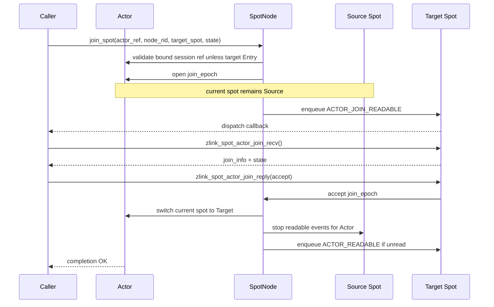

reject 또는 timeout이면 `switch current spot` 단계는 실행되지 않는다. Actor는 source
Spot에 남고, target Spot에 전달된 join state payload는 reply 또는 timeout 처리 뒤
폐기된다.

#### Remote join process

remote join은 source node의 Actor를 target node의 target Spot으로 넘기는 handoff다.
현재 구현은 같은 process 안에 등록된 source/target `SpotNode` 사이에서 이 의미를
수행한다. process 경계를 지나는 control frame, relay frame, retry 가능한 원격
`JoinOp`은 후속 범위다.

target Spot의 승인 판단은 local join과 같은 join recv/reply 흐름을 사용한다. 별도
join handler 등록 API는 만들지 않고, target Spot에 등록된 기존
`zlink_spot_dispatch_event_handler()`가 `ACTOR_JOIN_READABLE` event를 받아
`zlink_spot_actor_join_recv()`와 `zlink_spot_actor_join_reply()`를 호출한다.

```c
ZLINK_EXPORT zlink_recv_result_t zlink_spot_actor_join_recv(
  void *spot_,
  zlink_actor_join_info_t *info_out_,
  zlink_msg_t *message_out_,
  zlink_recv_flags_t flags_);

ZLINK_EXPORT zlink_submit_result_t zlink_spot_actor_join_reply(
  void *spot_,
  const zlink_actor_join_info_t *info_,
  int32_t join_result_code_,
  zlink_msg_t *message_);
```

join reply 계약:

- `join_result_code_ == 0`이면 accept, 0이 아니면 application-defined reject다.
  0이 아닌 값은 caller에게 join result code로 전달한다.
- `spot_ == NULL`이면 `ZLINK_SUBMIT_INVALID_HANDLE`로 실패하고 `errno`는 `EFAULT`다.
- `info_ == NULL`이면 `ZLINK_SUBMIT_INVALID_ARGUMENT`로 실패하고 `errno`는 `EINVAL`이다.
- `message_ == NULL`이면 reply payload가 없는 completion이다.
- submit 성공 시 `message_`가 가리키는 reply payload 소유권은 라이브러리로 이전된다.
  submit 전 validation 실패나 duplicate reply 실패가 발생하면 소유권은 caller에게 남는다.
- 같은 `info_.request`에 두 번 reply하면 두 번째 호출은 `ZLINK_SUBMIT_INVALID_STATE`로
  실패하고 `errno`는 `EALREADY` 또는 `EINVAL`이다.
- join timeout, target Spot destroy, `SpotNode` shutdown 뒤 늦게 도착한 reply는
  `ZLINK_SUBMIT_INVALID_STATE`로 실패한다. 이 경우 Actor current Spot은 이미 timeout 또는
  shutdown 규칙을 따른다.
- `info_.request`의 lifetime은 `zlink_spot_actor_join_recv()` 성공 뒤 해당 join request가
  reply, timeout, reject cleanup, Spot destroy, 또는 node shutdown으로 끝날 때까지다.
  application은 이 pointer를 직접 저장하지 말고 `info_` 구조체를 reply 호출에만 사용한다.

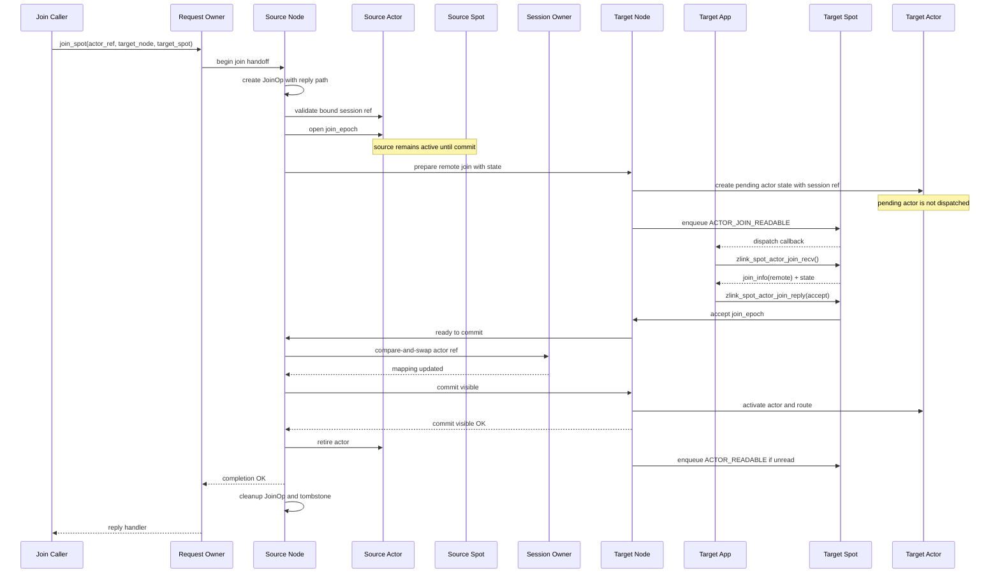

reject, timeout, prepare 실패, target shutdown은 handoff를 중단한다. Source Actor는
source Spot에서 active 상태를 유지하고, target pending Actor state는 폐기되며,
active route는 이동하지 않는다.

계약:

- `zlink_spot_node_actor_join_spot()`은 Actor ref, target node rid, target Spot rid를
  받는다.
- `node_`는 join request를 제출하고 completion handler를 소유하는 request owner
  `SpotNode` handle이다. 현재 구현에서는 request owner, source Actor owner, target
  node가 같은 process 안의 등록된 `SpotNode`여야 한다.
- request owner가 session owner와 같을 필요가 없는 cross-process 모델은 후속 범위다.
  그 모델에서는 session owner를 Actor의 bound session ref에서 읽고, remote join commit
  때 relay mapping만 갱신한다.
- `dest_node_rid_`가 Actor owner node와 같으면 local join으로 처리하고, 다르면 remote
  join handoff로 처리한다.
- `dest_node_rid_`와 `dest_spot_rid_`가 가리키는 target Spot을 조회할 수 없으면
  `ZLINK_SUBMIT_NOT_FOUND` 또는 `ZLINK_REQUEST_NOT_FOUND` 계열 결과로 실패한다.
- `zlink_spot_node_actor_join_spot()`의 return 값은 submit 단계 결과만 뜻한다. return이
  `ZLINK_SUBMIT_OK`이면 join operation이 접수된 것이지 join이 accept되었다는 뜻은 아니다.
- submit 단계 실패는 caller handle, Actor ref 형식, target rid 형식, local queue
  admission, 즉시 확인 가능한 local not-found, `ZLINK_DONTWAIT` backpressure처럼 operation을
  시작하기 전에 판단할 수 있는 조건만 포함한다.
- submit 성공 뒤 target not-found, target shutdown, reject, timeout, remote prepare 실패,
  session mapping conflict, idempotent success는 `zlink_reply_handler_fn`의
  `zlink_request_result_t` completion으로 전달한다.
- 이미 target `Spot`에 있는 idempotent success는 request handler에서 `ZLINK_REQUEST_OK`로
  완료하고, reply payload가 필요하면 빈 completion payload를 사용한다.
- Actor는 Entry Spot에 있을 때만 bound session 없이 존재할 수 있다.
- Entry Spot이 아닌 target Spot으로 join하려면 source Actor에 bound STREAM session ref가
  있어야 한다. session이 attach되지 않은 Actor의 user Spot join은 invalid-state 계열
  실패로 끝난다.
- remote join caller는 target node에 remote Actor를 미리 만들지 않는다. target node는
  prepare 단계에서 pending Actor state를 내부 생성하고 target Spot join handler가 accept할
  때까지 live Actor로 노출하지 않는다.
- remote join prepare는 explicit remote create-or-get이 아니므로
  `zlink_spot_node_actor_admission_handler()`를 호출하지 않는다. remote join에서 target
  Actor 생성과 target Spot 입장 승인은 target Spot join handler가 함께 결정한다.
- target node에 같은 `actor_id`의 live Actor나 다른 pending Actor가 이미 있으면 prepare는
  conflict 또는 busy 계열 실패로 끝나고 target Spot join handler는 호출되지 않는다.
- join 요청 중 Actor는 기존 current Spot에 남아 있다.
- target `Spot`의 dispatch context에서 join request가 처리된다.
- target `Spot`이 accept하면 Actor의 current Spot이 target으로 바뀐다.
- target `Spot`이 reject하거나 timeout되면 Actor는 기존 current Spot에 남는다.
- 이미 target `Spot`에 있으면 dispatch callback으로 join request를 전달하지 않고 submit
  성공 뒤 비동기 idempotent success completion으로 완료한다.
- 다른 join request가 pending이면 `ZLINK_SUBMIT_INVALID_STATE`로 실패하고 `errno`는
  `EBUSY`다.
- `message_`는 join state payload다. core는 내용을 해석하지 않는다. local join에서는
  target Spot join callback으로 전달하고, remote join에서는 target node prepare request와
  target Spot join callback으로 전달한다.
- 기존 Actor 상태, snapshot, 복원에 필요한 application data는 `message_`에 담는다.
  core는 이 payload를 해석하지 않고 ownership 규칙에 따라 전달한다.
- target Spot은 `zlink_spot_actor_join_recv()`로 payload를 읽고 accept 또는 reject를
  결정한다. target Spot이 payload를 복원할 수 없으면 reject해야 한다.
- remote join에서 target node는 pending Actor state에 bound session ref를 함께 복사한다.
- 같은 process 안 remote join의 coordinator는 source Actor owner node다. cross-process
  모델에서는 request owner가 session service나 backend service여도 source node가 join
  epoch, source Actor fence, session mapping 갱신, target commit을 조율한다.
- cross-process 모델에서는 source node가 remote join 시작 시 `JoinOp` 상태를 만든다.
  `JoinOp`은 join epoch, source Actor ref, target Actor ref, target node/Spot rid,
  bound session ref, request owner completion handler, 그리고 기존 reply path를 보존한다.
- `JoinOp`의 기존 reply path는 Actor route가 아니라 이 join 요청에 대한 operation reply
  context다. source Actor가 retired 상태가 된 뒤에도 `JoinOp`은 source node에서 session 또는
  request owner로 completion을 전달할 수 있어야 한다. 이 retry 가능한 reply path는 후속
  cross-process 범위다.
- cross-process remote join의 visibility point는 session owner node의
  `session -> actor_id -> Actor ref` compare-and-swap 성공이다. 이 compare-and-swap은
  현재 값이 source Actor ref일 때만 target Actor ref로 바꾼다.
- visibility point 전에는 session relay가 계속 source Actor ref를 사용한다. source Actor는
  source Spot에서 제거되지 않는다.
- visibility point 뒤 새 session relay는 target Actor ref로 간다. target Actor가 아직
  visible commit을 처리 중이면 target node의 pending Actor state에 buffer되고 dispatch되지
  않는다.
- session Actor list compare-and-swap이 실패하거나 timeout되면 remote join commit은 실패하고
  source Actor는 source Spot에 남는다.
- bound session disconnect가 visibility point 전에 관측되면 remote join handoff는 abort된다.
  source Actor는 source Spot에서 Entry Spot으로 이동한 뒤 bound session ref를 제거하고,
  target pending Actor state와 payload reference는 폐기한다. request owner에게 전달할 수
  있는 JoinOp reply path가 남아 있으면 terminated 또는 rejected 계열 completion을 보낸다.
- bound session disconnect가 visibility point 뒤에 관측되면 target Actor가 canonical
  Actor다. commit visible 절차를 끝낸 뒤 target node의 disconnect cleanup이 target Actor를
  target node Entry Spot으로 이동하고 bound session ref를 제거한다. source Actor는 다시
  active 상태로 돌아가지 않는다.
- join completion은 target Spot이나 session owner가 아니라 request owner의
  `zlink_reply_handler_fn`으로 전달한다. request owner가 session service이면 application이
  그 completion을 client로 보낸다. request owner가 backend service이면 backend가
  completion을 받고, client 통지는 별도 application protocol이 맡는다.
- source Actor retire는 `JoinOp` 정리를 뜻하지 않는다. `JoinOp`은 request owner completion
  frame이 request owner node의 control queue에 enqueue되었거나, request owner가 이미
  종료되어 completion 전달이 불가능하다고 확정된 뒤 정리한다. enqueue 실패가 일시적인
  transport backpressure이면 operation timeout까지 retry하고, timeout이면 request owner
  completion을 timeout 처리한 뒤 정리한다.
- 성공 시 Actor queue에 남아 있던 unread message는 target Spot dispatch event에서 계속
  drain된다.
- join 전후에 도착한 Actor queue message의 순서는 Actor queue 도착 순서로 보존한다.
- join submit이 성공하면 request `message_` 소유권은 라이브러리로 이전된다.
- local validation이나 submit 전 실패가 발생하면 request `message_` 소유권은 caller에게
  남는다.

local join 원자성:

- accept 전까지 source Spot이 current Spot이다.
- accept 처리와 current Spot 교체는 같은 `SpotNode` critical section 또는 event-loop
  turn 안에서 수행한다.
- accept 뒤에는 source Spot으로 새 `ACTOR_READABLE` event를 올리지 않는다.
- reject, timeout, target Spot destroy, `SpotNode` shutdown은 source Spot을 유지한다.

remote join 원자성:

아래 항목 중 session owner CAS, commit visible, source tombstone, retry 가능한 `JoinOp`
정리는 cross-process remote join을 위한 후속 범위다. 현재 구현은 같은 process 안에서
target Spot accept/reject/timeout과 source/target Actor state 전환 의미를 검증한다.

- source Actor는 commit 전까지 source node와 source Spot에서 active 상태다.
- target node는 prepare 단계에서 pending Actor state를 만들 수 있지만, 이 Actor는
  dispatch되지 않고 active route도 publish하지 않는다.
- target Spot은 기존 `ACTOR_JOIN_READABLE` event와
  `zlink_spot_actor_join_recv()` / `zlink_spot_actor_join_reply()` 흐름으로 accept 또는
  reject를 결정한다.
- target Spot이 accept해도 source Actor는 아직 source Spot에서 제거되지 않는다.
- source Actor는 session Actor list compare-and-swap이 성공하고, target Actor activate와
  active route 갱신이 끝났다는 `commit visible OK`를 source node가 받은 뒤 source
  Spot에서 제거되고 retired 상태가 된다.
- retired source Actor는 session mapping target도 아니고 Spot dispatch 대상도 아니지만,
  `JoinOp` completion 전달이 끝날 때까지 tombstone 또는 operation reference로 유지될 수
  있다.
- source retire와 target activate는 join epoch로 fence한다. stale relay, stale join
  reply, 늦게 도착한 control message는 epoch가 맞을 때만 적용한다.
- commit은 target Actor activate, source Actor retire, session Actor list 갱신, active
  route 갱신을 하나의 handoff 결과로 다룬다.
- commit 성공 뒤 session owner node의 session Actor list와 active route는 target node
  Actor ref를 가리킨다.
- reject, timeout, prepare 실패, target shutdown은 source Actor를 source Spot에
  그대로 둔다. target pending Actor state와 payload reference는 폐기한다.
- bound session disconnect와 remote join handoff가 겹치면 session Actor list
  compare-and-swap 성공 여부가 기준이다. 성공 전 disconnect는 source를 Entry Spot으로
  되돌리는 abort이고, 성공 뒤 disconnect는 target Actor의 Entry Spot cleanup이다.
- remote join 성공 뒤 caller에게 반환되는 completion message는 target Spot의 join
  reply message다.

이 계약은 leave 후 join 사이에 Actor가 dispatch context 없이 남는 window를 만들지
않는다.

### Actor leave

`leave`는 "Spot에서 빠져 unjoined가 된다"가 아니라 "Entry Spot으로 돌아간다"는 뜻이다.

```c
ZLINK_EXPORT zlink_request_result_t zlink_spot_node_actor_leave_spot(
  void *node_,
  const zlink_actor_ref_t *actor_,
  const zlink_routing_id_t *current_spot_rid_,
  uint32_t timeout_ms_);
```

계약:

- Actor가 이미 Entry Spot에 있으면 idempotent success다.
- `node_`는 leave request를 제출하는 request owner `SpotNode` handle이다. `actor_`의
  owner node가 `node_`와 다르면 core는 Actor owner node로 leave request를 route한다.
- `node_ == NULL`이면 `ZLINK_REQUEST_INVALID_ARGUMENT`로 실패하고 `errno`는 `EFAULT`다.
- `actor_ == NULL` 또는 `current_spot_rid_ == NULL`이면
  `ZLINK_REQUEST_INVALID_ARGUMENT`로 실패하고 `errno`는 `EINVAL`이다.
- `current_spot_rid_`는 Actor의 현재 Spot이어야 한다.
- `current_spot_rid_`가 Actor의 현재 Spot이 아니면 `ZLINK_REQUEST_INVALID_STATE`로
  실패한다.
- `current_spot_rid_`는 concurrent join/leave에 대한 optimistic check다. caller가 본
  current Spot과 실제 current Spot이 다르면 stale leave를 막기 위해 실패한다.
- 이 draft는 Actor current Spot getter를 새로 만들지 않는다. application은 join/leave
  completion, dispatch context, 또는 snapshot에서 본 current Spot을 자기 Actor state에
  기록하고 그 값을 `current_spot_rid_`로 넘긴다. 값이 오래되었으면 위 stale check로
  실패한다.
- Actor에 join request가 pending이면 leave는 `ZLINK_REQUEST_BUSY`로 실패하고 `errno`는
  `EBUSY`다. leave는 pending join을 취소하지 않는다.
- leave는 Entry Spot dispatch handler나 join request handler를 거치지 않는다.
- leave 성공 뒤 Actor message는 Entry Spot dispatch event로 올라간다.
- leave는 Actor queue를 비우지 않는다.
- leave 전후 message 순서는 Actor queue 도착 순서로 보존한다.

local Actor와 remote Actor 모두 같은 ref 기반 leave API를 사용한다. Actor owner node에서
현재 Spot을 검증한 뒤 Entry Spot으로 되돌리고, 결과는 request owner로 반환한다.

### Actor destroy

Actor가 항상 하나의 Spot에 속한다면 destroy 조건도 단순하게 다시 잡아야 한다.

계약:

```c
ZLINK_EXPORT zlink_request_result_t zlink_spot_node_actor_destroy(
  void *node_,
  const zlink_actor_ref_t *actor_,
  uint32_t timeout_ms_);
```

- Actor destroy는 Actor가 Entry Spot에 있을 때만 허용한다.
- `node_`는 destroy request를 제출하는 request owner `SpotNode` handle이다. `actor_`의
  owner node가 `node_`와 다르면 core는 Actor owner node로 destroy request를 route한다.
- `node_ == NULL`이면 `ZLINK_REQUEST_INVALID_ARGUMENT`로 실패하고 `errno`는 `EFAULT`다.
- `actor_ == NULL`이면 `ZLINK_REQUEST_INVALID_ARGUMENT`로 실패하고 `errno`는 `EINVAL`이다.
- Actor가 user Spot에 있으면 `ZLINK_REQUEST_INVALID_STATE`로 실패하고 `errno`는
  `EBUSY`다.
- Actor에 join request가 pending이면 destroy는 `ZLINK_REQUEST_BUSY` 또는
  `ZLINK_REQUEST_INVALID_STATE`로 실패하고 `errno`는 `EBUSY`다. destroy는 pending join을
  취소하지 않는다.
- application은 먼저 `leave`로 Entry Spot에 돌려보낸 뒤 destroy한다.
- destroy 성공 시 Entry Spot membership에서 Actor를 제거하고 Actor queue를 폐기한다.
- bound STREAM session이 있으면 destroy는 먼저 session Actor list 항목과 Actor의 bound
  session ref를 제거한다. 이 cleanup은 client STREAM connection 자체를 닫지 않는다.
- bound session cleanup을 `timeout_ms_` 안에 확인할 수 없으면 destroy는 timeout 계열로
  실패하고 Actor slot과 Entry Spot membership은 유지한다.
- client connection까지 닫아야 하면 application은 destroy 전에
  `zlink_spot_node_actor_close_bound_session()`을 호출한다.

이 규칙은 game room 안의 Actor를 실수로 삭제하는 일을 줄이고, destroy가 game Spot
state를 직접 건드리는 경로를 막는다.

## Actor message 처리 위치

Actor는 session relay target이지만 실행 context는 아니다. Actor로 들어오는 메시지는
Actor queue에 쌓이고, current Spot dispatch event에서 읽는다.

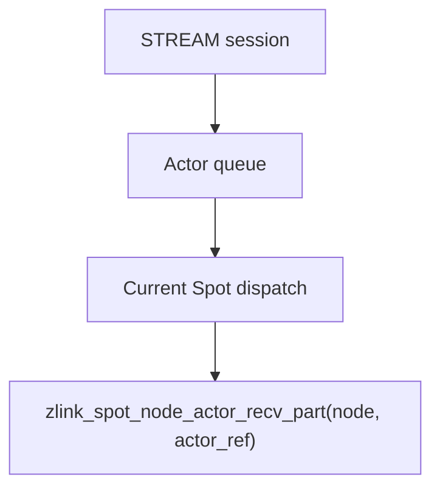

Actor 전용 callback은 두지 않는다. Actor 전용 dispatch context도 두지 않는다.
이 규칙을 깨면 join 전 처리와 join 후 처리가 서로 다른 동기화 모델을 갖게 되고,
Actor state 보호 책임이 application으로 넘어간다.

```c
typedef struct zlink_actor_recv_info_t
{
    zlink_actor_ref_t actor;
    zlink_routing_id_t source_node_rid;
    zlink_routing_id_t source_session_rid;
    uint32_t flags;
} zlink_actor_recv_info_t;

ZLINK_EXPORT zlink_recv_result_t zlink_spot_node_actor_recv_part(
  void *node_,
  const zlink_actor_ref_t *actor_,
  zlink_actor_recv_info_t *info_out_,
  zlink_msg_t *part_out_,
  zlink_part_flag_t *has_more_out_,
  zlink_recv_flags_t flags_);
```

Actor readable dispatch event는 `void *actor` handle을 subject로 넘기지 않는다. event
info의 `subject_kind`는 `ZLINK_SPOT_DISPATCH_SUBJECT_ACTOR`이고, `subject`는 readable
대상 `const zlink_actor_ref_t *`를 가리킨다. 이 포인터는 dispatch callback이 반환될
때까지만 유효하다. application이 callback 밖에서 Actor를 식별해야 하면 구조체 값을
복사해서 보관해야 한다. application은 복사한 ref를
`zlink_spot_node_actor_recv_part()`에 넘겨 drain한다. 이렇게 하면 join handler,
dispatch event, destroy/send/close API가 모두 같은 Actor key를 사용한다.
`info_out_->actor`는 drain한 message의 target Actor ref다. `source_node_rid`와
`source_session_rid`는 message를 보낸 STREAM session의 owner node와 session routing id를
나타낸다. `flags`는 현재 0이며, 알 수 없는 bit는 invalid protocol로 처리한다. 이
`flags`에도 버전 협상 없이 새 public bit를 추가하지 않는다. Actor recv flags도 message
drain 의미가 바뀔 수 있으므로 unknown bit ignore를 허용하지 않는다.
`node_`는 Actor owner `SpotNode`여야 한다. Actor recv는 network request가 아니라 현재
Spot dispatch context에서 local Actor queue를 drain하는 API이므로 remote route를 수행하지
않는다.
`node_ == NULL`이거나 `node_`가 Actor owner가 아니면 `ZLINK_RECV_INVALID_HANDLE`로
실패하고 `errno`는 `EFAULT`다. `actor_ == NULL`, `info_out_ == NULL`,
`part_out_ == NULL`, `has_more_out_ == NULL`이면 `ZLINK_RECV_INVALID_HANDLE`로 실패하고
`errno`는 `EFAULT`다. `zlink_recv_result_t`에는 invalid-argument bucket이 없으므로 Actor
recv의 NULL output pointer도 recv 계열의 invalid-handle failure로 통일한다.
`has_more_out_`은 기존 Actor recv 계약처럼 `ZLINK_PART_MORE` 또는
`ZLINK_PART_FINAL`을 반환한다.

## STREAM session과 Actor 연결

STREAM session과 Actor의 연결은 같은 public API를 쓰지만, local Actor와 remote
Actor는 소유 node가 다르기 때문에 내부 경로가 다르다. 핵심은 session owner node와
Actor owner node를 분리해서 보는 것이다.

- session owner node는 STREAM socket, session routing id, session Actor list를
  소유한다.
- Actor owner node는 Actor table, current Spot, Actor unread 상태, bound session
  ref를 소유한다.
- local Actor는 session owner node와 Actor owner node가 같은 경우다.
- remote Actor는 session owner node와 Actor owner node가 다른 경우다.

### 주요 배치 모델

실제 사용 모델은 보통 아래 두 가지로 나뉜다.

첫 번째는 session, Spot, Actor가 같은 instance 안에 함께 있는 모델이다. 이 경우
Actor는 local Actor이고, Actor가 이동하는 대상도 같은 `SpotNode` 안의 local Spot으로
제한하는 것이 기본 정책이다. 다른 node에 있는 Spot으로 보내야 하는 요구가 생기면
기존 Actor를 node 사이에서 직접 옮기는 대신, 해당 instance에 새 session을 연결하고
그 instance에서 Actor를 만든 뒤 local Spot에 join하는 흐름을 사용한다.

두 번째는 session instance와 Actor/Spot runtime instance가 분리된 모델이다. 이 경우
session owner node는 remote Actor를 만들거나 가져오고, client message를 remote
Actor로 relay한다. Actor는 Actor/Spot runtime node에서 실행되는 객체이며, current
Spot도 그 runtime 쪽에 있다. Actor가 현재 Spot owner가 아닌 다른 node의 Spot으로
join해야 하면 remote join handoff가 필요하다. 이 모델 때문에 remote Actor ref와
remote Spot join이 필요하다. 다만 실제 process 분리와 network control/relay frame은
현재 구현 완료 범위가 아니라 후속 범위다.

따라서 remote Actor는 session owner node 안에 있는 Actor 대리 실행체가 아니다. remote
Actor는 다른 `SpotNode`가 소유한 Actor를 session owner node가 ref로 가리키는 관계다.
session owner node는 client 연결과 session Actor list만 책임지고, Actor의 current
Spot 이동과 dispatch 처리는 Actor/Spot runtime node가 책임진다.

session과 함께 있는 node에서 바로 원격 Spot으로 join하는 경로는 API 구조상 표현할 수
있지만, 이 초안의 주된 요구 모델은 아니다. co-located 모델은 local Spot 이동을 기본으로
보고, remote Actor 모델은 session과 Actor/Spot runtime을 분리한 배치를 기본으로 본다.

### Session과 local Actor

local Actor bind에서는 session Actor list와 Actor의 bound session ref가 같은
`SpotNode` 안에서 함께 갱신된다. client에서 Actor로 가는 payload도 node 사이를
지나지 않고, local Actor unread 상태에 바로 들어간다.

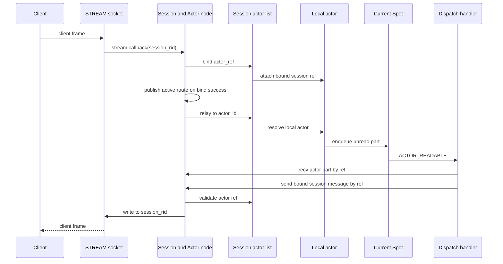

이 흐름에서는 Actor socket이나 Actor별 inproc endpoint가 생기지 않는다. session
owner가 이미 Actor owner이므로 control hop 없이 bind와 relay를 끝낸다.

### Session과 remote Actor

remote Actor bind에서는 session owner node가 Actor owner node로 bind control request를
보낸다. bind가 성공하면 session owner node에는 Actor ref가 저장되고, Actor owner
node에는 bound session ref가 저장된다. 이후 client에서 Actor로 가는 payload는
session owner node에서 Actor owner node로 relay frame으로 전달된다. 현재 구현은 이
의미를 같은 process 안 등록 node 간 직접 상태 전달로만 다루며, 실제 frame 인코딩과
network relay는 후속 범위다.

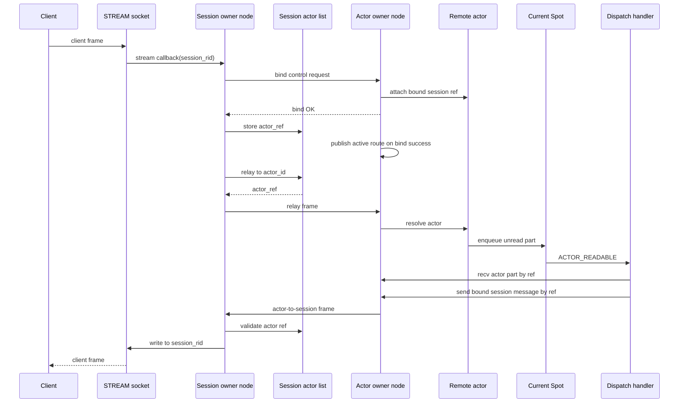

remote Actor도 Actor socket이나 Actor별 inproc endpoint를 갖지 않는다. 후속
cross-process 구현에서는 node 사이의 전송을 `SpotNode` 사이의 control frame과 relay
frame이 맡고, target node에 도착한 뒤에는 Actor owner node가 local Actor와 같은 방식으로
unread 상태와 current Spot dispatch event를 갱신한다.

두 흐름의 차이는 아래와 같다.

- local Actor는 bind, relay, Actor-to-session send가 같은 node 안에서 끝난다.
- remote Actor는 bind control request, session-to-Actor relay frame,
  Actor-to-session frame이 node 사이를 지난다.
- session owner node는 Actor의 joined Spot을 저장하지 않는다.
- Actor owner node는 STREAM session의 application state를 저장하지 않는다.
- Actor active route는 Actor 생성 시점이 아니라 bind 성공 시점에 Actor owner node가
  publish한다.
- Entry Spot이 아닌 user Spot에 있는 Actor는 bound session을 유지해야 한다. explicit
  unbind는 먼저 Entry Spot으로 leave한 뒤에만 성공할 수 있다.
- session disconnect cleanup은 반환값이 없으므로 user Spot에 있던 Actor를 Entry Spot으로
  되돌린 뒤 bound session ref를 정리한다.

Actor가 client로 message를 보내거나 bound session을 닫을 때도 `void *actor` handle을
쓰지 않는다. local Actor와 remote Actor 모두 Actor owner node handle과 Actor ref를
사용한다.

```c
ZLINK_EXPORT zlink_submit_result_t zlink_spot_node_actor_send_bound_session_msg(
  void *node_,
  const zlink_actor_ref_t *actor_,
  zlink_msg_t *message_,
  zlink_send_flags_t flags_);

ZLINK_EXPORT zlink_request_result_t zlink_spot_node_actor_close_bound_session(
  void *node_,
  const zlink_actor_ref_t *actor_,
  uint32_t timeout_ms_);
```

`node_`는 send 또는 close request를 제출하는 request owner `SpotNode` handle이다.
`actor_`의 owner node가 `node_`와 다르면 현재 구현은 같은 process 안 등록 node를
찾아 처리한다. process 경계를 지나는 control request route는 후속 범위다.
application은 Actor ref를 key로 자기 상태를 관리한다.

계약:

- `zlink_spot_node_actor_send_bound_session_msg()`는 Actor의 bound STREAM session으로
  `message_`를 보낸다.
- 이 API는 completion handler를 갖지 않는 fire-and-forget submit API다. return 값은
  request owner node에서 Actor owner node로 send command를 접수하거나 route queue에
  넣었는지만 뜻한다.
- request owner가 Actor owner와 같고 submit 전에 Actor가 live 상태가 아님, stale ref,
  bound session 없음을 확인할 수 있으면 `ZLINK_SUBMIT_NOT_FOUND` 또는
  `ZLINK_SUBMIT_INVALID_STATE` 계열로 즉시 실패한다.
- request owner가 Actor owner와 다르면 stale ref, missing Actor, missing bound session은
  submit 시점에 동기적으로 보장하지 않는다. Actor owner가 command를 처리할 때 이 조건을
  발견하면 message를 닫고 protocol drop counter를 증가시킨다. caller에게 별도 completion은
  전달하지 않는다.
- submit 성공 시 `message_` 소유권은 라이브러리로 이전된다. submit 전 validation 실패
  시 소유권은 caller에게 남는다.
- `zlink_spot_node_actor_close_bound_session()`은 Actor의 bound STREAM session을 닫고,
  session Actor list 항목과 Actor의 bound session ref를 제거한다.
- bound STREAM session이 없으면 `ZLINK_REQUEST_NOT_FOUND` 계열로 실패한다.
- close 성공 뒤 Actor는 Entry Spot으로 이동한다. 이미 Entry Spot에 있으면 current Spot은
  그대로 Entry Spot이다.
- close 성공 뒤 Actor queue에 unread message가 남아 있으면 Entry Spot dispatch handler에
  `ACTOR_READABLE` event를 올린다. close 자체는 join/leave event를 만들지 않는다.

## Spot socket 제거 모델

### 현재 문제

기존 구조는 `Spot` facade 또는 그 side handle이 socket을 만들고, inproc socket을
queue처럼 쓰는 부분이 있다. 이 방식은 처음에는 기존 socket filter, poller, HWM
기능을 재사용할 수 있다는 장점이 있었다.

하지만 `SpotNode`가 메시지를 한 번 받아서 logical `Spot`으로 중계하는 순간,
per-Spot socket HWM으로 application dispatch 상태를 표현하는 방식은 맞지 않는다.
HWM은 `SpotNode`가 소유한 transport socket admission에 남겨둔다. per-Spot queue는
별도 capacity 정책이 아니라 이미 받은 입력을 어느 dispatch context에서 처리할지
정하는 staging 상태다.

### 목표 구조

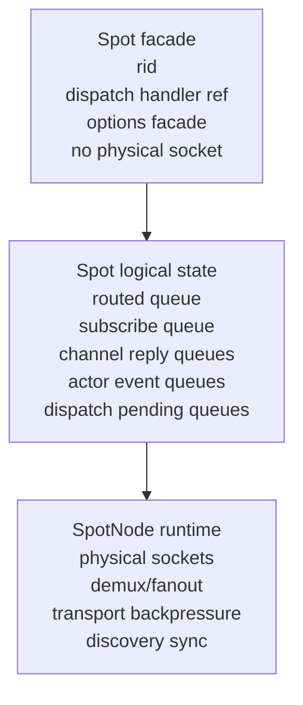

`Spot` facade는 더 이상 `spot_pub_t`, `spot_sub_t`, routed receive socket 같은 물리
socket을 직접 갖지 않는다. 필요한 것은 logical `Spot` state에 대한 reference다.

## Routed request 처리

`SpotNode`의 routed ingress는 물리 ROUTER 역할을 유지한다. ROUTER 역할은 peer
routing id를 받고 reply address를 유지해야 하므로 DEALER로 완전히 대체하지 않는다.

계약:

- physical ROUTER는 `SpotNode` runtime이 소유한다.
- incoming routed message는 `dest_spot_rid`로 logical Spot을 찾는다.
- target Spot의 routed queue에 message metadata와 payload part를 enqueue한다.
- target Spot dispatch event에는 `ROUTED_READABLE`을 올린다.
- application은 기존처럼 `zlink_spot_recv()`로 drain한다.
- `zlink_spot_recv()`는 socket recv가 아니라 logical routed queue recv가 된다.

backpressure 정책:

- routed ingress backpressure는 `SpotNode`가 소유한 ROUTER/DEALER transport HWM과
  send/recv timeout 규칙을 따른다.
- logical Spot queue에는 별도 full 상태나 조정 가능한 한계를 두지 않는다.
- dispatch가 밀릴 때 구현은 transport socket을 무제한으로 drain해서 logical queue로
  옮기지 않는다. 이렇게 해야 transport HWM이 backpressure 기준으로 남는다.
- 이미 logical queue에 들어간 message는 application이 `zlink_spot_recv()`로 drain할
  때까지 순서를 보존한다.

## Pub/sub 처리

pub/sub는 per-Spot socket 제거 시 가장 주의해야 하는 영역이다. 기존 socket filter는
node-level physical SUB에만 적용되고, Spot별 filter는 logical table로 관리해야 한다.

### Publish path

`zlink_spot_publish_part()`와 multipart wrapper는 `Spot` facade socket에 send하지
않는다. 호출은 `SpotNode`의 topic publish path로 들어간다.

계약:

- `spot_`은 live `Spot` facade여야 한다. Entry Spot facade와 user Spot facade 모두
  publish subject가 될 수 있다.
- `spot_`이 `NULL`이거나 live facade가 아니면 invalid-handle 계열 submit 실패로 끝나고
  `errno`는 `EFAULT`다.
- `spot_`이 destroy 중이거나 backing `SpotNode`가 shutdown 중이면 terminated 또는
  not-connected 계열 submit 실패로 끝나고 `errno`는 `ESHUTDOWN`, `ENOTCONN`, `EBUSY`
  중 하나다.
- `service_name_`은 기존 공개 계약처럼 topic namespace를 고르는 이름이다.
- `topic_id_`는 기존 topic 검증 규칙을 따른다.
- publish submit은 node-owned PUB/XPUB transport HWM과 send timeout 규칙을 따른다.
- local subscription registry는 `SpotNode`의 local service namespace에 속한다.
- `service_name_`이 publisher Spot의 backing `SpotNode` service name과 같으면, 같은
  node 안 matching Spot에 remote egress와 별개로 local fanout도 수행한다.
- `service_name_`이 다른 service namespace를 가리키면 local Spot subscription
  registry는 사용하지 않는다. 이 경우 publish는 해당 service namespace의 기존
  transport publish 경로를 따른다.
- local fanout은 `SpotNode` subscription registry를 사용한다. per-Spot PUB socket이나
  per-Spot SUB socket을 만들지 않는다.
- local fanout payload는 아래 `fanout ownership` 규칙의 shared message block을
  참조한다.
- publisher Spot이 자기 topic을 구독 중이면 자기 subscribe queue에도 같은 규칙으로
  전달된다.
- local matching Spot이 없어도 remote publish 대상이 있으면 submit은 정상 publish
  경로를 따른다.
- remote publish 대상이 없고 local matching Spot도 없으면 submit은 성공한다.
  topic publish는 request/reply가 아니므로 subscriber 없음은 오류가 아니다.
- `ZLINK_DONTWAIT` publish가 transport HWM에 걸리면
  `ZLINK_SUBMIT_BACKPRESSURED`를 반환한다.

### Subscription table

`SpotNode`는 구독 등록과 physical SUB 적용을 모두 소유한다. `Spot` facade는 더 이상
`spot_sub_t` side socket을 만들지 않고, 구독 API는 logical Spot state와 node-level
subscription registry를 갱신한다.

`SpotNode`는 아래 상태를 가진다.

```text
+---------------------------------+
| Subscription registry           |
|                                 |
| spot_id -> set<filter_key>      |
| filter_key -> set<spot_id>      |
| filter_key -> physical ref      |
| physical ref -> SUB socket      |
+---------------------------------+
```

`spot_id`는 logical Spot state를 가리키는 내부 key다. 외부 표시는 `Spot` routing id를
사용하지만, registry 내부에서는 runtime 중 routing id 변경과 충돌하지 않는 안정적인
key를 사용한다.

`filter_key`는 현재 공개 subscription filter 규칙을 정규화한 값이다. 이 key는
`SpotNode`의 local service namespace 안에서만 비교한다.

- exact topic filter는 topic 문자열을 그대로 key로 쓴다.
- pattern filter는 기존 규칙처럼 마지막 `*`를 제외한 prefix와 pattern kind를 key로
  쓴다.
- invalid filter, 빈 filter, 지원하지 않는 pattern 형식은 기존처럼 `EINVAL`로
  실패한다.

구독 등록 계약:

- `zlink_set_subscription(spot, filter)`는 target Spot의 logical filter set에
  `filter_key`를 추가한다.
- 이미 같은 Spot에 등록된 filter를 다시 등록하면 성공 no-op이다.
- 같은 `filter_key`를 여러 Spot이 구독하면 physical SUB에는 한 번만 반영한다.
- `filter_key`의 첫 target Spot이 생기는 순간 `SpotNode`는 node-owned physical SUB에
  `ZLINK_INTERNAL_OPT_SUBSCRIBE`를 적용한다.
- peer subscription forwarding이 켜진 runtime에서는 같은 시점에 aggregate subscribe
  update를 한 번 보낸다.
- `zlink_unset_subscription(spot, filter)`는 target Spot의 logical filter set에서
  `filter_key`를 제거한다.
- target Spot에 해당 filter가 없으면 성공 no-op이다.
- 한 Spot이 filter를 해제해도 다른 Spot이 같은 `filter_key`를 구독 중이면 physical
  SUB filter와 peer aggregate subscription은 유지한다.
- 마지막 Spot이 filter를 해제하면 physical SUB에 `ZLINK_INTERNAL_OPT_UNSUBSCRIBE`를
  적용하고, peer aggregate unsubscribe update를 한 번 보낸다.
- `zlink_spot_destroy()`는 Spot facade reference를 하나 해제한다.
- 일반 Spot의 마지막 facade reference를 닫을 때 joined Actor나 pending join request가
  남아 있으면 `ZLINK_CLOSE_BUSY`로 실패하고 filter registry는 변경하지 않는다.
- 일반 Spot은 마지막 facade reference가 닫힐 때 해당 logical Spot의 모든 filter를
  registry에서 제거하고 filter ref-count를 같은 규칙으로 줄인다.
- Entry Spot facade destroy는 facade reference만 해제하며 Entry Spot logical state를
  제거하지 않는다.
- `SpotNode` destroy는 registry와 physical SUB 적용 상태를 함께 폐기한다.

이 방식에서는 구독 등록 때문에 per-Spot SUB socket이나 inproc endpoint가 생기지
않는다.

구독 조회 계약:

- `zlink_subscription_at(spot, index, ...)`는 해당 logical Spot의 filter set만
  조회한다.
- node-level snapshot은 aggregate filter와 target Spot 수를 보여준다.
- snapshot row는 physical SUB에 몇 번 적용되었는지가 아니라 logical target 수와
  ready peer 수를 나타낸다.

동시성 규칙:

- registry 갱신과 physical SUB option 적용은 `SpotNode`의 subscription lock 아래에서
  직렬화한다.
- dispatch callback 안에서도 subscription 변경은 허용한다.
- 같은 callback tick에서 새 filter로 이미 staging된 message를 재분배하지 않는다.
- subscription 변경은 이후 physical SUB에서 들어오는 message와 이후 fanout부터
  적용된다.

### Fanout

incoming pub/sub message가 도착하면 `SpotNode`는 topic frame을 한 번 파싱하고,
subscription registry에서 matching Spot 목록을 만든다. message는 matching Spot의
subscribe queue에 각각 enqueue된다.

matching 규칙:

- exact topic filter는 message topic이 filter와 byte 단위로 같을 때 match한다.
- pattern filter는 message topic이 정규화된 prefix로 시작할 때 match한다.
- 같은 Spot이 exact filter와 pattern filter 양쪽으로 같은 message에 match하더라도
  해당 Spot queue에는 message를 한 번만 넣는다.
- 여러 Spot이 match하면 내부 `spot_id` 순서로 fanout한다. 이 순서는 공개 계약은
  아니지만 테스트에서는 deterministic해야 한다.

fanout ownership:

- incoming pub/sub message는 `SpotNode`가 한 번만 수신하고, payload frame들은 immutable
  shared message block으로 묶는다.
- matching Spot queue에는 payload copy를 넣지 않는다. 각 queue entry는 shared message
  block reference, source metadata, topic metadata, part cursor, final flag metadata만
  가진다.
- matching Spot이 하나뿐이어도 같은 shared message block 경로를 사용한다. 단일 target
  fast path에서 move 최적화를 하더라도 public 동작은 shared block 경로와 같아야 한다.
- shared message block은 ref-counted object다. fanout 대상 Spot queue에 entry를 넣을
  때 ref-count를 증가시키고, 해당 Spot이 마지막 part를 drain하거나 queue가 닫히면
  감소시킨다.
- `zlink_spot_subscribe_part()`는 shared block의 다음 part를 public `zlink_msg_t`로
  반환한다. 반환된 `zlink_msg_t`는 기존 계약대로 호출자가 닫는다.
- public으로 반환된 `zlink_msg_t`가 mutable API로 바뀌더라도 다른 Spot queue의
  unread payload가 바뀌면 안 된다. 이를 위해 반환 시에는 copy-on-write 가능한
  independent message handle을 사용한다.
- multipart message는 target Spot마다 part 순서와 final flag를 그대로 보존한다.
- source routing id, service name, topic id 같은 metadata는 shared block에 한 번만
  저장하고, target Spot queue entry는 필요한 cursor와 reference만 보관한다.

수신 API 연결:

- `SUBSCRIBE_READABLE` event는 target Spot의 subscribe queue가 readable일 때 해당
  Spot dispatch handler로 올라간다.
- `zlink_spot_subscribe_part()`는 physical SUB에서 직접 `recv`하지 않고, target
  Spot의 logical subscribe queue에서 다음 part를 꺼낸다.
- `zlink_spot_recv_subscription_event()`는 peer subscription event queue를 읽는다.
  per-Spot SUB socket을 전제로 하지 않는다.

backpressure 정책:

- pub/sub ingress는 remote publisher에게 정확한 per-Spot backpressure를 전달하기
  어렵다.
- logical subscribe queue에는 별도 full 상태나 조정 가능한 한계를 두지 않는다.
- dispatch가 밀리면 `SpotNode`는 physical SUB를 계속 greedy drain하지 않아야 한다.
  transport socket HWM이 입력 속도를 제한하도록 drain을 dispatch 진행 상태와
  연결한다.
- 이 drain 제어의 구체적인 threshold와 batch 크기는 public 계약이 아니라 구현 내부
  정책이다. 구현은 한 event-loop turn 안에서 physical SUB drain을 무한 반복하지 않고,
  pending Spot dispatch work가 남아 있으면 dispatch 진행 기회를 먼저 줘야 한다.
- reliable pub/sub는 별도 ack 기반 protocol이 필요하므로 이 초안의 범위가 아니다.

## Channel dealer 처리

channel dealer는 이미 이 초안의 목표 구조에 가깝다. `SpotNode`에 `channel_name`별
attached DEALER가 등록되고, `Spot`은 channel name으로 request를 보낸다.

유지할 계약:

- attached DEALER는 `SpotNode` transport다.
- `zlink_spot_request_channel()`은 `SpotNode`에서 channel dealer를 선택한다.
- reply completion은 요청을 시작한 logical Spot의 channel reply queue에 들어간다.
- dispatch event는 `CHANNEL_REPLY_READABLE`이며 subject는 attached dealer handle이다.
- application은 `zlink_spot_channel_reply_progress_from(spot, subject)`로 drain한다.

변경할 내부 구조:

- completion queue는 facade socket에 묶지 않고 logical Spot state에 둔다.
- attached DEALER의 socket request completion은 bridge를 통해 logical Spot queue로
  이동한다.
- channel dealer transport HWM은 기존 socket 정책을 따르고, logical Spot channel
  reply queue에는 별도 HWM을 두지 않는다.

## Actor와 Entry Spot 흐름

### Gateway/session 흐름

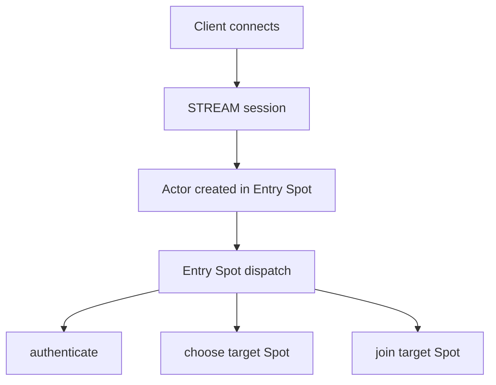

session relay message는 Actor queue에 들어가고, Actor의 current Spot에
`ACTOR_READABLE` event를 올린다. Actor가 생성 직후 Entry Spot에 있으므로 초기
메시지도 Entry Spot dispatch context에서 직렬 처리된다.

### 대량 Actor와 application policy

Entry Spot에는 많은 Actor가 동시에 속할 수 있다. 예를 들어 점검 종료 직후
수천 개 이상의 Actor가 Entry Spot에 모인 뒤 application policy에 따라 순차적으로
대상 Spot으로 이동할 수 있다. 이 상태 자체는 core 오류가 아니다.

core는 Entry Spot에서 아래 정책을 자동으로 수행하지 않는다.

- 입장 대기열 순서 결정
- rate limit
- 인증 정책
- matchmaking
- target Spot 선택
- 오래 대기한 Actor disconnect
- 점검 모드 또는 오픈 시각 판단
- heavy game logic 실행 위치 결정

이 정책은 application이 Entry Spot dispatch handler 안에서 구현한다. core는
application이 정책을 구현할 수 있도록 Actor message를 Entry Spot dispatch context로
전달하고, 기존 snapshot API로 Spot과 Actor 목록을 확인할 수 있게 하는 역할만 맡는다.

따라서 Entry Spot은 "자동 lobby server"가 아니다. core 관점에서 Entry Spot은
Actor가 처음 속하는 기본 dispatch context이고, application 관점에서 lobby, gateway,
admission queue, single-player staging area 등으로 사용할 수 있다.

### Game room 흐름

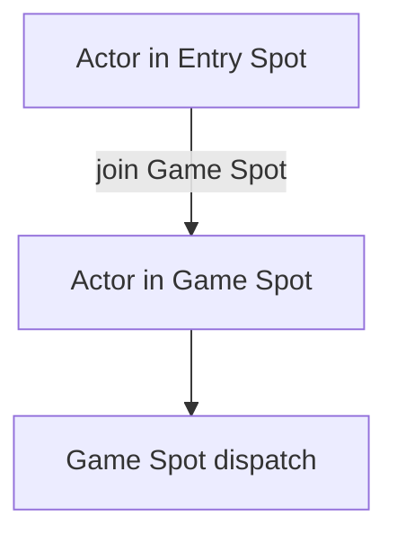

game logic은 Game Spot dispatch context에서 처리한다. Actor가 room을 나가면
`leave`로 Entry Spot에 돌아온다.

### Single-player 흐름

single-player도 같은 모델로 설명할 수 있다.

- 단순한 경우 Actor는 Entry Spot에 머물며 message queue 직렬화를 사용한다.
- 더 분리된 상태가 필요한 application은 single-player Spot을 만들고 Actor를 join한다.
- session relay와 Actor recv 방식은 multiplayer와 동일하다.

## Actor channel API 여부

Actor는 항상 하나의 Spot에 속한다. Entry Spot도 Actor가 join된 정상 Spot이므로
Actor가 아직 user Spot으로 이동하지 않았더라도 Spot 기능을 그대로 사용할 수 있다.
따라서 Actor 전용 channel request API는 만들지 않는다.

Actor가 channel request를 해야 하는 경우, Actor가 현재 속한 Spot의 dispatch handler
context에서 기존 `zlink_spot_request_channel()`을 호출한다. Entry Spot에 있는 Actor도
같은 규칙을 따른다.

아래 API는 첫 구현뿐 아니라 향후 public API로도 추가하지 않는다.

```c
zlink_spot_node_actor_request_channel_part(node, actor_ref, ...)
zlink_spot_node_actor_send_channel_part(node, actor_ref, ...)
```

이 결정의 계약 효과:

- Actor channel request는 항상 current Spot의 channel request로 표현한다.
- completion은 Actor 전용 dispatch가 아니라 current Spot dispatch context에서 처리한다.
- Actor 이동 중 channel request ordering은 current Spot dispatch queue의 ordering을
  따른다.
- caller는 Actor ref만으로 channel request를 만들 수 없고, current Spot dispatch
  context 안에서 Spot API를 사용해야 한다.

## Channel router에서 Actor로 직접 messaging

channel router가 Actor에게 직접 메시지를 보내는 protocol은 만들지 않는다. Actor로
들어오는 application message 경로는 STREAM client에서 시작해 session relay를 거쳐
Actor queue로 들어오는 경로 하나로 둔다.

backend service가 특정 Actor에 영향을 주어야 하면 Actor를 channel target으로 직접
지정하지 않는다. 대신 Actor가 속한 Spot으로 기존 Spot routed message나 channel
request를 보내고, Spot dispatch handler가 해당 Actor state를 찾아 처리한다. Entry
Spot에 있는 Actor도 같은 규칙을 따른다.

이 결정의 계약 효과:

- channel protocol 안에 actor target envelope을 추가하지 않는다.
- channel protocol 안에 `actor_id` field를 예약하지 않는다.
- target Actor 없음, Actor 위치, Actor 이동 중 처리 같은 정책은 channel transport
  계약이 아니라 target Spot application policy가 결정한다.
- Actor dispatch callback이나 Actor 전용 backend ingress는 만들지 않는다.
- Actor에게 직접 client message를 넣는 public 경로는 session relay뿐이다.

## Dispatch event 통합

`Spot` dispatch event는 logical Spot queue의 readiness를 알린다.

| event | queue | drain |
|-------|-------|-------|
| `SUBSCRIBE_READABLE` | Spot subscribe queue | `zlink_spot_subscribe_part()` recv 계열 |
| `ROUTED_READABLE` | Spot routed queue | `zlink_spot_recv()` |
| `CHANNEL_REPLY_READABLE` | Spot channel reply queue | `zlink_spot_channel_reply_progress_from()` |
| `ACTOR_JOIN_READABLE` | Spot join request queue | `zlink_spot_actor_join_recv()` |
| `ACTOR_READABLE` | Actor queue for current Spot | `zlink_spot_node_actor_recv_part()` |
| `TIMER_READABLE` | timer queue | `zlink_timer_recv()` |

dispatch event는 message 개수 이벤트가 아니라 readiness 이벤트다. callback 한 번이
message 하나를 뜻하지 않는다. application은 해당 queue에서 no-data 결과가 나올
때까지 drain하는 방식을 사용한다.

Actor readable event의 subject는 `void *actor` handle이 아니다. dispatch info의
`subject_kind`는 `ZLINK_SPOT_DISPATCH_SUBJECT_ACTOR`이고, `subject`는 callback lifetime을
가진 `const zlink_actor_ref_t *`다. join handler의 `target_actor`와 Actor readable event의
Actor ref가 같은 key를 사용해야 application이 pending join state와 live dispatch state를
직접 매핑할 수 있다.

## Queue와 backpressure

이 초안은 backpressure 기준을 `SpotNode`가 소유한 transport socket HWM에 둔다.
logical queue는 transport HWM을 대체하는 capacity 정책이 아니라, 이미 받은 입력을
대상 dispatch context로 배분하고 순서를 보존하는 staging 상태다.

| 계층 | 의미 |
|------|------|
| transport HWM | network socket send/recv admission |
| node staging queue | SpotNode 내부 demux/fanout 중간 queue. 별도 HWM 없음 |
| Spot dispatch queue | logical Spot별 application queue |
| Actor queue | Actor별 session relay/message queue |

기본 정책:

- Spot/Actor logical queue에는 public option, HWM, 조정 가능한 queue 한계를 두지
  않는다.
- `ZLINK_SUBMIT_BACKPRESSURED` 계열 결과는 기존 relay 경로의 transport HWM,
  nonblocking send admission, timeout 규칙에서 나온다.
- 구현은 dispatch backlog가 쌓였을 때 transport socket을 계속 drain해서 HWM을
  우회하지 않는다.
- 메모리 할당 실패 같은 비정상 자원 실패는 backpressure 정책이 아니라 기존 오류
  처리 규칙을 따른다.

public snapshot은 Spot과 Actor 목록을 확인하는 용도로 유지한다. logical queue의
pending count, protocol drop count, transport backpressure count 같은 진행 상태 값은
이 draft의 public 계약으로 만들지 않는다. 이런 값은 구현 내부 로그나 기존 internal
monitoring에서 필요할 때만 다룬다.

## Snapshot과 monitoring

변경:

- 기존 `zlink_spot_node_spot_entry_t`와 `zlink_spot_node_actor_entry_t`의 크기는 바꾸지
  않는다.
- 새 detail row와 새 detail snapshot API는 만들지 않는다.
- `zlink_spot_node_spots()`은 Entry Spot을 포함한 local Spot 목록을 반환한다.
- `zlink_spot_node_actors()`은 live local Actor 목록을 반환한다.
- `zlink_spot_actors()`은 특정 Spot에 속한 Actor ref 목록을 반환한다. Entry
  Spot facade를 넘기면 Entry Spot에 있는 Actor 목록을 확인할 수 있다.
- Entry Spot rid는 `zlink_spot_node_entry_spot()`으로 Entry Spot facade를 얻은 뒤 기존
  `zlink_get_routing_id()`로 조회한다.
- Actor의 current Spot을 직접 반환하는 새 public getter는 만들지 않는다. 필요하면
  application은 각 Spot의 Actor 목록 snapshot을 진단용으로 비교할 수 있다.
- queue backlog, protocol drop, transport backpressure count는 이 draft의 public
  snapshot 계약에 포함하지 않는다.

기존 row field 의미:

- `zlink_spot_node_spot_entry_t.joined_actor_count`는 해당 Spot에 현재 속한 Actor 수다.
  Entry Spot row에서는 Entry Spot에 남아 있는 Actor 수를 반환한다.
- `zlink_spot_node_spot_entry_t.pending_actor_join_count`는 해당 Spot의 join request
  queue에 아직 reply되지 않은 request 수다. remote join prepare가 만든 pending Actor
  state는 target Spot join request가 pending인 동안 이 count에 포함된다.
- `zlink_spot_node_spot_entry_t.route_synced`는 Discovery에 publish된 Spot owner route가
  현재 Spot rid와 일치하면 1이다. Entry Spot도 Spot owner route publish 대상이면 같은
  규칙을 따른다.
- `zlink_spot_node_actor_entry_t.joined`는 live local Actor row에서는 항상 1이다.
  Actor가 unjoined 상태로 노출되지 않기 때문이다.
- `zlink_spot_node_actor_entry_t.joined_spot_rid`는 Actor의 current Spot rid다. Actor가
  Entry Spot에 있으면 Entry Spot rid를 반환한다.
- `zlink_spot_node_actor_entry_t.route_synced`는 Actor active route가 현재 Actor ref와
  current Spot rid를 반영하면 1이다. STREAM bind 전 Actor는 active route publish 대상이
  아니므로 0일 수 있다.
- `zlink_spot_node_actor_entry_t.pending_message_count`는 기존 row field로 유지하지만,
  이 draft는 새 pending count field를 추가하지 않는다.

기존 조회 API:

```c
ZLINK_EXPORT zlink_config_result_t zlink_spot_node_spots(
  void *node_,
  zlink_spot_node_spot_entry_t *entries_,
  size_t *count_);

ZLINK_EXPORT zlink_config_result_t zlink_spot_node_actors(
  void *node_,
  zlink_spot_node_actor_entry_t *entries_,
  size_t *count_);

ZLINK_EXPORT zlink_config_result_t zlink_spot_actors(
  void *spot_,
  zlink_actor_ref_t *entries_,
  size_t *count_);
```

`zlink_spot_node_spots()`은 Entry Spot을 포함해 node가 소유한 live local Spot
목록을 반환한다.
`zlink_spot_node_actors()`은 node가 소유한 live local Actor 목록을 반환한다.
`zlink_spot_actors()`은 특정 Spot에 join된 Actor ref 목록을 반환한다. Entry
Spot facade를 넘기면 Entry Spot에 남아 있는 Actor 목록을 조회한다.

## Public C API 변경 요약

이 절은 구현자가 public header 변경 범위를 빠르게 확인하기 위한 요약이다. 상세한
ownership, timeout, lifecycle 계약은 이어지는 `Public API 변경` 절과 각 API 상세 절을
기준으로 한다.

### 새 상수, enum, option

| 이름 | 종류 | 값 | 의미 |
|------|------|----|------|
| `ZLINK_ACTOR_ID_MAX` | constant | `256` | `actor_id` buffer 크기다. NUL 포함 256 bytes이고 유효 문자열은 최대 255 bytes다 |
| `ZLINK_ACTOR_JOIN_INFO_REMOTE` | flag | `1u` | `zlink_actor_join_info_t.flags`에서 remote join handoff를 표시한다 |
| `ZLINK_ACTOR_ADMISSION_ACCEPT` | enum value | `1` | remote create-or-get admission accept |
| `ZLINK_ACTOR_ADMISSION_REJECT` | enum value | `2` | remote create-or-get admission reject |
| `ZLINK_ACTOR_CREATE_CREATED` | enum value | `1` | remote create-or-get이 새 Actor를 만들었다 |
| `ZLINK_ACTOR_CREATE_EXISTING` | enum value | `2` | remote create-or-get 대상 Actor가 이미 있었다 |
| `ZLINK_SPOT_DISPATCH_EVENT_ACTOR_READABLE` | enum value | 기존 dispatch enum 확장 | Actor queue가 current Spot에서 readable이다 |
| `ZLINK_SPOT_DISPATCH_EVENT_ACTOR_JOIN_READABLE` | enum value | 기존 dispatch enum 확장 | Spot join request queue가 readable이다 |
| `ZLINK_SPOT_DISPATCH_SUBJECT_ACTOR` | enum value | 기존 dispatch subject enum 확장 | dispatch subject가 `const zlink_actor_ref_t *`다 |
| `ZLINK_CONFIG_INVALID_STATE` | config result | `705` | handle과 argument는 유효하지만 현재 lifecycle state에서 허용되지 않는 설정이다 |
| `ZLINK_CONFIG_NOT_FOUND` | config result | `706` | local lookup 범위에서 요청한 logical object가 없다 |

Public option 추가는 없다. 특히 Actor HWM option이나 Spot/Actor logical queue capacity
option은 만들지 않는다. Discovery actor route sync가 필요하면 기존 Discovery active route
정책을 사용하며, 이 draft에서 새 option을 정의하지 않는다.

### 새 public type

| 이름 | 종류 | 핵심 필드 또는 역할 |
|------|------|---------------------|
| `zlink_actor_ref_t` | struct | `node_rid`, `actor_id`, `generation`으로 Actor를 식별한다. `generation == 0`은 unchecked ref다 |
| `zlink_actor_recv_info_t` | struct | Actor queue에서 drain한 message의 target Actor ref와 source session 정보를 담는다 |
| `zlink_actor_join_info_t` | struct | join 승인 handler가 source/target Actor, source/target Spot, join epoch, opaque request를 확인한다 |
| `zlink_actor_admission_result_t` | enum | remote create-or-get admission 결과 |
| `zlink_actor_admission_handler_fn` | callback typedef | target node가 새 remote Actor 생성을 승인할지 결정한다 |
| `zlink_actor_create_status_t` | enum | remote create-or-get 결과가 created인지 existing인지 표시한다 |
| `zlink_actor_create_result_t` | struct | remote create-or-get status와 Actor ref를 함께 반환한다 |

### 신규 API

| API | 반환 | 용도 |
|-----|------|------|
| `zlink_spot_node_entry_spot()` | `zlink_config_result_t` | `SpotNode`가 소유한 Entry Spot facade를 얻는다 |
| `zlink_spot_node_spot_lookup()` | `zlink_config_result_t` | node-local live Spot을 rid로 조회하고 owned facade를 반환한다 |
| `zlink_spot_node_actor_recv_part()` | `zlink_recv_result_t` | Spot dispatch context에서 Actor queue part를 Actor ref로 drain한다 |
| `zlink_spot_node_actor_destroy()` | `zlink_request_result_t` | Actor ref 기반 destroy. local/remote Actor 모두 같은 API를 사용한다 |
| `zlink_spot_node_actor_send_bound_session_msg()` | `zlink_submit_result_t` | Actor의 bound STREAM session으로 fire-and-forget message를 보낸다 |
| `zlink_spot_node_actor_close_bound_session()` | `zlink_request_result_t` | Actor의 bound STREAM session을 닫고 Actor를 Entry Spot으로 돌린다 |

### 시그니처가 바뀌는 API

| API | 기존 방향 | 새 방향 |
|-----|-----------|---------|
| `zlink_spot_node_actor_new()` | `void *actor` handle 반환 | `zlink_config_result_t` 반환, `zlink_actor_ref_t *actor_out_`에 checked ref 저장 |
| `zlink_spot_node_actor_join_spot()` | Actor handle 또는 target Spot 중심 | `node + actor_ref + dest_node_rid + dest_spot_rid`로 local/remote join을 하나의 API로 처리 |
| `zlink_spot_node_actor_leave_spot()` | target Spot 인자처럼 보이는 형태 | `current_spot_rid_`를 stale check로 받아 Entry Spot으로 이동 |

### 의미가 바뀌는 기존 API

| API | 변경 요약 |
|-----|-----------|
| `zlink_spot_destroy()` | Entry Spot logical state는 제거하지 않고, 일반 Spot도 joined Actor나 pending join이 있으면 마지막 facade close가 busy로 실패한다 |
| `zlink_spot_recv()` | physical socket recv가 아니라 target Spot logical routed queue drain이다 |
| `zlink_spot_publish_part()` | Spot facade socket send가 아니라 SpotNode publish path와 local fanout을 사용한다 |
| `zlink_spot_subscribe_part()` | physical SUB recv가 아니라 logical subscribe queue drain이다 |
| `zlink_set_subscription()` / `zlink_unset_subscription()` | per-Spot SUB socket 대신 node-level subscription registry를 갱신한다 |
| `zlink_spot_request_channel()` | request completion은 요청 Spot의 logical channel reply queue로 들어간다 |
| `zlink_spot_node_actor_lookup()` | Actor handle이 아니라 checked Actor ref를 반환한다 |
| `zlink_spot_node_create_remote_actor()` | 새 Actor는 target node Entry Spot에 속하고, 이미 있으면 current Spot을 바꾸지 않는다 |
| `zlink_spot_actor_join_recv()` / `zlink_spot_actor_join_reply()` | target Spot dispatch context에서 join approval과 accept/reject reply를 처리한다 |

### 제거 API

| 제거 API | 대체 |
|----------|------|
| `zlink_actor_destroy()` | `zlink_spot_node_actor_destroy()` |
| `zlink_actor_get_ref()` | `zlink_spot_node_actor_lookup()` 또는 생성 API의 `actor_out_` |
| `zlink_actor_join_spot()` | `zlink_spot_node_actor_join_spot()` |
| `zlink_actor_leave_spot()` | `zlink_spot_node_actor_leave_spot()` |
| `zlink_actor_recv_part()` | `zlink_spot_node_actor_recv_part()` |
| `zlink_spot_node_destroy_remote_actor()` | `zlink_spot_node_actor_destroy()` |
| 기존 `void *zlink_spot_node_actor_new(node, actor_id)` | 새 `zlink_spot_node_actor_new(node, actor_id, actor_out)` |

### 유지 API

| API | 유지되는 의미 |
|-----|---------------|
| `zlink_remote_actor_get_ref()` | network 확인 없이 generation `0` unchecked Actor ref를 만든다 |
| `zlink_spot_node_spots()` | Entry Spot을 포함한 local Spot 목록을 반환한다 |
| `zlink_spot_node_actors()` | live local Actor 목록을 반환한다 |
| `zlink_spot_actors()` | 특정 Spot에 속한 Actor ref 목록을 반환한다 |

## Public API 변경

### 추가

```c
ZLINK_EXPORT zlink_config_result_t zlink_spot_node_entry_spot(
  void *node_,
  void **spot_out_);

ZLINK_EXPORT zlink_config_result_t zlink_spot_node_spot_lookup(
  void *node_,
  const zlink_routing_id_t *spot_rid_,
  void **spot_out_);

ZLINK_EXPORT zlink_recv_result_t zlink_spot_node_actor_recv_part(
  void *node_,
  const zlink_actor_ref_t *actor_,
  zlink_actor_recv_info_t *info_out_,
  zlink_msg_t *part_out_,
  zlink_part_flag_t *has_more_out_,
  zlink_recv_flags_t flags_);

ZLINK_EXPORT zlink_request_result_t zlink_spot_node_actor_destroy(
  void *node_,
  const zlink_actor_ref_t *actor_,
  uint32_t timeout_ms_);

ZLINK_EXPORT zlink_submit_result_t zlink_spot_node_actor_send_bound_session_msg(
  void *node_,
  const zlink_actor_ref_t *actor_,
  zlink_msg_t *message_,
  zlink_send_flags_t flags_);

ZLINK_EXPORT zlink_request_result_t zlink_spot_node_actor_close_bound_session(
  void *node_,
  const zlink_actor_ref_t *actor_,
  uint32_t timeout_ms_);
```

`ZLINK_CONFIG_INVALID_STATE = 705`를 `zlink_config_result_t`에 추가한다. 이 값은
handle과 argument는 유효하지만 현재 lifecycle state에서 설정을 바꿀 수 없을 때
사용한다. `ZLINK_CONFIG_NOT_FOUND = 706`도 같은 enum에 추가한다. 이 값은 local lookup
범위에서 요청한 logical object가 없을 때 사용한다. `zlink_config_result_t`의 기존 공개
값은 `701..704`를 사용하므로, 새 값은 같은 config result bucket에서 다음 값을 사용한다.

### 시그니처 변경

```c
ZLINK_EXPORT zlink_config_result_t zlink_spot_node_actor_new(
  void *node_,
  const char *actor_id_,
  zlink_actor_ref_t *actor_out_);

ZLINK_EXPORT zlink_submit_result_t zlink_spot_node_actor_join_spot(
  void *node_,
  const zlink_actor_ref_t *actor_,
  const zlink_routing_id_t *dest_node_rid_,
  const zlink_routing_id_t *dest_spot_rid_,
  zlink_msg_t *message_,
  zlink_reply_handler_fn handler_,
  void *userdata_,
  zlink_send_flags_t flags_,
  uint32_t timeout_ms_);

ZLINK_EXPORT zlink_request_result_t zlink_spot_node_actor_leave_spot(
  void *node_,
  const zlink_actor_ref_t *actor_,
  const zlink_routing_id_t *current_spot_rid_,
  uint32_t timeout_ms_);
```

변경:

- `zlink_spot_node_actor_new()`은 더 이상 `void *actor` handle을 반환하지 않는다.
  성공 여부를 `zlink_config_result_t`로 반환하고, `actor_out_`에 checked Actor ref를
  저장한다.
- `zlink_spot_node_actor_join_spot()`은 target Spot rid뿐 아니라 target node rid도
  받는다. target node가 Actor owner node와 같으면 local join이고, 다르면 remote join
  handoff다.
- `zlink_spot_node_actor_leave_spot()`의 마지막 routing id 인자는 이동할 target이
  아니라 caller가 알고 있는 current Spot rid다. core는 이 값을 Actor의 current Spot과
  비교해 stale leave를 막는다.

### 제거

첫 구현에서 아래 handle 기반 Actor API는 호환성 유예 없이 제거한다.

```c
void *zlink_spot_node_actor_new(void *node_, const char *actor_id_);
zlink_request_result_t zlink_actor_destroy(void **actor_p_, uint32_t timeout_ms_);
zlink_config_result_t zlink_actor_get_ref(void *actor_, zlink_actor_ref_t *out_);
zlink_submit_result_t zlink_actor_join_spot(
  void *actor_,
  void *spot_,
  zlink_msg_t *message_,
  zlink_reply_handler_fn handler_,
  void *userdata_,
  zlink_send_flags_t flags_,
  uint32_t timeout_ms_);
zlink_config_result_t zlink_actor_leave_spot(void *actor_, void *spot_);
zlink_recv_result_t zlink_actor_recv_part(
  void *actor_,
  zlink_actor_recv_info_t *info_out_,
  zlink_msg_t *part_out_,
  zlink_part_flag_t *has_more_out_,
  zlink_recv_flags_t flags_);
zlink_request_result_t zlink_spot_node_destroy_remote_actor(
  void *node_,
  const zlink_actor_ref_t *actor_,
  uint32_t timeout_ms_);
```

대체:

- Actor 생성은 새 `zlink_spot_node_actor_new()`로 checked Actor ref를 받는다.
- Actor destroy는 `zlink_spot_node_actor_destroy(node, actor_ref, timeout_ms)`를
  사용한다.
- Actor join과 leave는 node + Actor ref 기반 API만 사용한다.
- Actor recv는 `zlink_spot_node_actor_recv_part()`를 사용한다.
- remote Actor destroy도 local/remote 구분 없이 `zlink_spot_node_actor_destroy()`로
  통일한다.

API별 계약:

- `zlink_spot_node_entry_spot()`은 live `SpotNode` handle만 받는다. 성공 시
  `*spot_out_`에 owned Entry Spot facade를 저장한다. 실패 시 `spot_out_ != NULL`이면
  `*spot_out_ = NULL`로 둔다.
- `node_ == NULL`이거나 live handle이 아니면
  `ZLINK_CONFIG_INVALID_HANDLE`로 실패하고 `errno`는 `EFAULT`다.
- `spot_out_ == NULL`이면 `ZLINK_CONFIG_INVALID_ARGUMENT`로 실패하고 `errno`는
  `EINVAL`이다.
- node가 shutdown 중이면 `ZLINK_CONFIG_INVALID_STATE`로 실패하고 `errno`는
  `ESHUTDOWN` 또는 `EBUSY`다.
- `zlink_spot_node_spot_lookup()`은 live local Spot rid만 조회한다. remote Spot은
  Discovery owner resolve 결과를 사용한다.
- `zlink_spot_node_spot_lookup()` 성공 시 반환되는 facade는 owned handle이며
  `zlink_spot_destroy()`로 닫아야 한다.
- lookup으로 얻은 facade reference가 살아 있으면 일반 Spot logical state는 제거되지
  않는다. 일반 Spot logical state는 마지막 facade reference가 닫힐 때 제거된다.
- 일반 Spot의 마지막 facade close 시 joined Actor나 pending join request가 남아 있으면
  `zlink_spot_destroy()`는 `ZLINK_CLOSE_BUSY`로 실패하고 facade handle은 live 상태로
  남는다.

Entry Spot rid 설정은 새 전용 API를 만들지 않고 기존 common API를 사용한다.

```c
zlink_set_routing_id(entry_spot, data, size);
zlink_get_routing_id(entry_spot, &rid);
```

구현은 Entry Spot facade인지 일반 Spot facade인지에 관계없이 같은 규칙으로 routing
id를 검증하되, Entry Spot은 runtime 중 변경 제한을 추가로 적용한다.
일반 Spot에서 `zlink_set_routing_id()`가 성공하면 `zlink_spot_node_spot_lookup()`에
사용하는 node-local rid index도 같은 operation 안에서 갱신한다. 같은 logical Spot을
가리키는 다른 facade가 있으면 해당 facade의 `zlink_get_routing_id()` 결과도 새 rid가
된다.

### 기존 유지

```c
ZLINK_EXPORT zlink_config_result_t zlink_spot_node_actor_lookup(
  void *node_,
  const char *actor_id_,
  zlink_actor_ref_t *out_);

ZLINK_EXPORT zlink_config_result_t zlink_remote_actor_get_ref(
  const zlink_routing_id_t *target_node_rid_,
  const char *actor_id_,
  zlink_actor_ref_t *out_);

ZLINK_EXPORT zlink_config_result_t zlink_spot_node_spots(
  void *node_,
  zlink_spot_node_spot_entry_t *entries_,
  size_t *count_);

ZLINK_EXPORT zlink_config_result_t zlink_spot_node_actors(
  void *node_,
  zlink_spot_node_actor_entry_t *entries_,
  size_t *count_);

ZLINK_EXPORT zlink_config_result_t zlink_spot_actors(
  void *spot_,
  zlink_actor_ref_t *entries_,
  size_t *count_);
```

이 draft는 위 조회 API를 제거하지 않는다. `zlink_spot_node_actor_lookup()`은 Actor
handle 조회가 아니라 checked Actor ref 조회로 유지한다. `zlink_remote_actor_get_ref()`는
generation `0` unchecked ref 생성 API로 유지한다. Spot 단건 handle lookup은 새
`zlink_spot_node_spot_lookup()`으로 제공한다. snapshot API는 진단용 목록 조회이며, queue
backlog나 transport backpressure 같은 진행 상태 값은 제공하지 않는다.

### 의미 변경

```c
zlink_spot_destroy()
zlink_spot_recv()
zlink_spot_publish_part()
zlink_spot_subscribe_part()
zlink_set_subscription()
zlink_unset_subscription()
zlink_spot_request_channel()
zlink_spot_node_actor_new()
zlink_spot_node_actor_lookup()
zlink_spot_node_create_remote_actor()
zlink_spot_node_actor_join_spot()
zlink_actor_join_info_t
zlink_spot_actor_join_recv()
zlink_spot_actor_join_reply()
zlink_spot_node_actor_leave_spot()
```

변경 요약:

- 일반 Spot logical state는 facade reference count로 관리하고, 마지막 facade가 닫힐
  때 제거한다.
- routed recv, publish, subscribe, subscription registration, channel request는 public
  호출 형태를 유지하지만 physical Spot socket 대신 `SpotNode`가 소유한 logical Spot
  queue와 node-owned transport를 사용한다.
- Actor public API는 `void *actor` handle을 쓰지 않고 `node + zlink_actor_ref_t`로
  통일한다.
- Actor 생성은 Entry Spot 배치를 포함하고 checked Actor ref를 반환한다.
- remote create-or-get으로 새 Actor가 만들어지면 target node Entry Spot에 배치되고,
  이미 존재하는 Actor의 current Spot은 바꾸지 않는다.
- join은 별도 move API 없이 target Spot으로 이동한다.
- `zlink_actor_join_info_t`는 `source_actor`, target node 기준 `target_actor`,
  source/target node와 Spot rid, join epoch, remote flag를 포함한다.
- join recv/reply는 새 `zlink_actor_join_info_t`를 그대로 전달받아 reply path와
  join epoch를 보존한다.
- leave는 Entry Spot으로 return한다.
- destroy는 Entry Spot에 있는 Actor에 한해 허용한다.
- 새 Actor recv, destroy, Actor-to-session send, bound session close API는 제거된 handle
  기반 API를 대체하는 ref 기반 public API다.

## 구현 순서

1. logical Spot state를 `SpotNode` 소유 table로 분리한다.
2. Entry Spot logical state를 `SpotNode` 생성 시 만든다.
3. Spot facade reference count와 `zlink_spot_node_spot_lookup()`을 추가한다.
4. `zlink_spot_node_entry_spot()` facade API를 추가한다.
5. Entry Spot facade에서 `zlink_set_routing_id()`와 `zlink_get_routing_id()`가
   동작하도록 한다.
6. Entry Spot rid 변경을 configuration phase로 제한한다.
7. Spot rid 변경 시 lookup index가 함께 갱신되도록 한다.
8. handle 기반 Actor API를 제거하고 node + Actor ref API로 전환한다.
9. Actor 생성 시 Entry Spot membership을 자동 설정한다.
10. remote create-or-get의 새 Actor 생성 경로도 Entry Spot membership을 자동 설정한다.
11. Actor join을 current Spot 유지 + target accept 후 local atomic switch 또는 remote
   atomic handoff로 바꾼다.
12. Actor leave를 Entry Spot return으로 바꾼다.
13. Actor destroy를 Entry Spot 상태에서만 허용한다.
14. routed recv queue를 socket 기반에서 logical Spot queue로 옮긴다.
15. channel reply completion queue를 logical Spot state로 고정한다.
16. pub/sub subscription index와 union filter 적용을 `SpotNode`로 옮긴다.
17. `zlink_spot_publish_part()`를 node-owned publish path와 local fanout에 연결한다.
18. pub/sub fanout을 per-Spot subscribe queue와 shared message block으로 바꾼다.
19. `Spot` facade에서 physical pub/sub socket pointer를 제거한다.
20. 기존 snapshot API가 Entry Spot과 Actor 목록을 빠뜨리지 않도록 맞춘다.
21. 기존 Actor, SPOT, STREAM, Discovery 회귀 테스트를 새 의미로 갱신한다.
22. sample에서 Entry Spot 기반 Actor 생성/이동 흐름을 보여 준다.

## 회귀 테스트

아래 표는 현재 구현에서 통과해야 하는 항목과 후속 cross-process 구현에서 추가로
검증할 항목을 함께 둔다. 설명에 `후속` 또는 cross-process 전제가 들어간 항목은 현재
코드 반영 완료 조건에서 제외한다.

### Entry Spot

| ID | 이름 | 검증 |
|----|------|------|
| ENTRY-01 | node creates entry | `SpotNode` 생성 뒤 Entry Spot을 조회할 수 있다 |
| ENTRY-02 | entry stable rid | 같은 node에서 Entry Spot rid가 안정적이다 |
| ENTRY-03 | entry dispatch | Entry Spot dispatch handler가 Actor readable event를 받는다 |
| ENTRY-04 | entry not removable | application이 Entry Spot logical state를 제거할 수 없다 |
| ENTRY-05 | entry rid set before use | Actor 생성 전 Entry Spot rid를 설정하고 조회할 수 있다 |
| ENTRY-06 | entry rid locked after actor | Actor 생성 뒤 Entry Spot rid 변경은 실패한다 |
| ENTRY-07 | entry rid no duplicate | Entry Spot rid는 같은 node의 다른 Spot rid와 중복될 수 없다 |
| ENTRY-08 | spot lookup entry | Entry Spot rid로 `zlink_spot_node_spot_lookup()`을 호출하면 Entry Spot facade를 얻는다 |
| ENTRY-09 | spot lookup refcount | lookup으로 얻은 일반 Spot facade가 살아 있는 동안 logical Spot은 제거되지 않고 마지막 facade close 뒤 제거된다 |
| ENTRY-10 | spot lookup not found | 없는 local Spot rid lookup은 not found로 실패하고 output을 변경하지 않는다 |
| ENTRY-11 | entry multiple facades | 같은 node에서 얻은 여러 Entry Spot facade가 같은 logical Entry Spot state를 가리킨다 |
| ENTRY-12 | spots snapshot includes entry | `zlink_spot_node_spots()` 결과에 Entry Spot row가 포함된다 |
| ENTRY-13 | spot destroy with actor busy | joined Actor가 남은 일반 Spot의 마지막 facade close는 `ZLINK_CLOSE_BUSY`로 실패한다 |
| ENTRY-14 | spot lookup follows rid change | 일반 Spot rid 변경 뒤 old rid lookup은 실패하고 new rid lookup은 같은 logical Spot facade를 반환한다 |
| ENTRY-15 | spot multi facade shared rid | 같은 logical Spot을 가리키는 여러 facade는 rid 변경 결과를 함께 본다 |
| ENTRY-16 | spot snapshot entry count | Entry Spot row의 `joined_actor_count`가 Entry Spot에 있는 Actor 수를 반환한다 |

### Actor lifecycle

| ID | 이름 | 검증 |
|----|------|------|
| ENTRY-ACTOR-01 | create joins entry | Actor 생성 직후 current Spot은 Entry Spot이다 |
| ENTRY-ACTOR-02 | relay before user join | user Spot join 전 session relay message가 Entry Spot에서 drain된다 |
| ENTRY-ACTOR-03 | join moves actor | join accept 뒤 current Spot이 target Spot으로 바뀐다 |
| ENTRY-ACTOR-04 | join reject stays | join reject 뒤 current Spot은 기존 Spot으로 유지된다 |
| ENTRY-ACTOR-05 | join timeout stays | join timeout 뒤 current Spot은 기존 Spot으로 유지된다 |
| ENTRY-ACTOR-06 | leave returns entry | leave 성공 뒤 current Spot은 Entry Spot이다 |
| ENTRY-ACTOR-07 | leave entry idempotent | Entry Spot에서 leave하면 성공한다 |
| ENTRY-ACTOR-08 | destroy outside entry denied | user Spot에 있는 Actor destroy는 실패한다 |
| ENTRY-ACTOR-09 | destroy in entry | Entry Spot에 있는 Actor destroy는 성공한다 |
| ENTRY-ACTOR-10 | fifo across move | join/leave 전후 Actor queue 순서가 유지된다 |
| ENTRY-ACTOR-11 | remote create joins entry | remote create-or-get으로 새로 만든 Actor의 current Spot은 target node Entry Spot이다 |
| ENTRY-ACTOR-12 | remote existing keeps spot | 이미 user Spot에 있는 Actor에 대한 remote create-or-get은 `EXISTING`을 반환하고 current Spot을 바꾸지 않는다 |
| ENTRY-ACTOR-13 | remote destroy outside entry denied | user Spot에 있는 remote Actor destroy request는 실패한다 |
| ENTRY-ACTOR-14 | remote join accept handoff | remote join accept 뒤 source Actor는 retire되고 target Actor가 active가 된다 |
| ENTRY-ACTOR-15 | remote join reject keeps source | remote join reject 뒤 source Actor의 current Spot과 active route가 유지된다 |
| ENTRY-ACTOR-16 | remote join timeout keeps source | remote join timeout 뒤 target pending Actor state가 폐기되고 source Actor가 유지된다 |
| ENTRY-ACTOR-17 | join info source target | local/remote join callback에서 source/target node와 Spot rid, join epoch, remote flag를 확인할 수 있다 |
| ENTRY-ACTOR-18 | session required user spot | session이 attach되지 않은 Actor는 Entry Spot이 아닌 target Spot으로 join할 수 없다 |
| ENTRY-ACTOR-19 | remote join updates session | 후속 cross-process: remote join commit 성공 뒤 session owner의 Actor ref가 target node Actor ref로 갱신된다 |
| ENTRY-ACTOR-20 | session update failure keeps source | 후속 cross-process: remote join 중 session Actor list 갱신 실패 시 source Actor와 source Spot이 유지된다 |
| ENTRY-ACTOR-21 | unbind user spot denied | user Spot에 있는 Actor의 explicit unbind는 실패하고 Actor는 user Spot에 남는다 |
| ENTRY-ACTOR-22 | disconnect returns entry | session disconnect cleanup 뒤 Actor current Spot은 Entry Spot이다 |
| ENTRY-ACTOR-23 | backend request owner | 후속 cross-process: backend service node가 join request owner여도 completion은 backend로 돌아간다 |
| ENTRY-ACTOR-24 | retire after commit | 후속 cross-process: target Spot accept만으로 source Actor를 제거하지 않고 commit 성공 뒤 source Actor를 retire한다 |
| ENTRY-ACTOR-25 | session mapping CAS | 후속 cross-process: remote join commit은 session Actor list를 source Actor ref에서 target Actor ref로 compare-and-swap한다 |
| ENTRY-ACTOR-26 | relay visibility point | 후속 cross-process: session Actor list compare-and-swap 전 relay는 source Actor로, 성공 뒤 새 relay는 target Actor로 간다 |
| ENTRY-ACTOR-27 | pending target buffer | 후속 cross-process: visibility point 뒤 visible commit 전 target으로 온 relay는 pending Actor state에 buffer된다 |
| ENTRY-ACTOR-28 | JoinOp reply path | 후속 cross-process: source Actor retire 뒤에도 JoinOp이 기존 reply path로 completion을 전달한다 |
| ENTRY-ACTOR-29 | JoinOp cleanup | 후속 cross-process: completion 전달 뒤 JoinOp과 source Actor tombstone 또는 operation reference가 정리된다 |
| ENTRY-ACTOR-30 | join dispatch handler | target Spot의 기존 dispatch handler가 remote join request를 recv/reply API로 처리한다 |
| ENTRY-ACTOR-31 | remote join pending create | remote join prepare가 target node에 pending Actor state를 만들지만 live lookup과 active route에 노출하지 않는다 |
| ENTRY-ACTOR-32 | remote join no create admission | remote join prepare는 remote create admission handler를 호출하지 않고 target Spot join handler로 승인한다 |
| ENTRY-ACTOR-33 | generation new on create | Actor 생성과 destroy 뒤 재생성은 같은 actor id라도 새 checked generation을 반환한다 |
| ENTRY-ACTOR-34 | remote join new generation | remote join 성공 뒤 session Actor list는 target node가 새로 발급한 generation을 가진 Actor ref를 가리킨다 |
| ENTRY-ACTOR-35 | join info request opaque | join recv에서 받은 `request` field를 application이 직접 쓰지 않고 reply API에 info 구조체 그대로 전달한다 |
| ENTRY-ACTOR-36 | join timeout zero no operation timeout | `zlink_spot_node_actor_join_spot()`의 `timeout_ms_ == 0`은 join operation timeout을 설치하지 않는다 |
| ENTRY-ACTOR-37 | request timeout zero nonblocking | create/leave/destroy/close의 `timeout_ms_ == 0`은 즉시 완료 불가능할 때 timeout 또는 busy 계열 실패를 반환한다 |
| ENTRY-ACTOR-38 | leave while join pending busy | join pending 중 leave는 `ZLINK_REQUEST_BUSY`로 실패하고 pending join을 취소하지 않는다 |
| ENTRY-ACTOR-39 | destroy while join pending busy | join pending 중 destroy는 `ZLINK_REQUEST_BUSY` 또는 invalid-state 계열로 실패하고 pending join을 취소하지 않는다 |
| ENTRY-ACTOR-40 | disconnect before visibility aborts | 후속 cross-process: remote join visibility point 전 session disconnect는 handoff를 abort하고 source Actor를 Entry Spot으로 되돌린다 |
| ENTRY-ACTOR-41 | disconnect after visibility cleans target | 후속 cross-process: visibility point 뒤 session disconnect는 target Actor를 Entry Spot으로 cleanup하고 source Actor를 되살리지 않는다 |
| ENTRY-ACTOR-42 | handle actor APIs removed | handle 기반 `zlink_actor_*` API와 `zlink_spot_node_destroy_remote_actor()`는 public header에서 제거된다 |
| ENTRY-ACTOR-43 | close bound session returns entry | bound session close 성공 뒤 Actor는 Entry Spot에 있고 session Actor list 항목이 제거된다 |
| ENTRY-ACTOR-44 | close unread dispatch entry | close 성공 뒤 unread Actor message가 있으면 Entry Spot에 `ACTOR_READABLE` event가 올라간다 |
| ENTRY-ACTOR-45 | destroy bound cleanup keeps client open | bound session이 있는 Entry Actor destroy는 session binding만 제거하고 STREAM client connection은 직접 닫지 않는다 |
| ENTRY-ACTOR-46 | recv part flag preserved | ref 기반 Actor recv가 multipart continuation을 `ZLINK_PART_MORE` 또는 `ZLINK_PART_FINAL`로 반환한다 |
| ENTRY-ACTOR-47 | join info target actor | join recv callback 시점의 `zlink_actor_join_info_t.target_actor`가 target node의 pending Actor state를 식별한다 |
| ENTRY-ACTOR-48 | actor snapshot current spot | Actor snapshot row의 `joined`는 1이고 `joined_spot_rid`는 Entry Spot 또는 current Spot rid를 반환한다 |
| ENTRY-ACTOR-49 | actor request owner routing | 현재는 같은 process 등록 node 범위에서 처리한다. process 경계 route는 후속 cross-process 범위다 |
| ENTRY-ACTOR-50 | recv non-owner denied | Actor owner가 아닌 node에서 `zlink_spot_node_actor_recv_part()`를 호출하면 `ZLINK_RECV_INVALID_HANDLE`로 실패한다 |

### Spot socket 제거

| ID | 이름 | 검증 |
|----|------|------|
| QUEUE-ROUTED-01 | routed queue recv | routed ingress가 target Spot logical queue로 들어간다 |
| QUEUE-ROUTED-02 | routed backpressure | routed ingress backpressure가 transport HWM과 drain 제어 정책을 따른다 |
| QUEUE-ROUTED-03 | spot recv logical queue | `zlink_spot_recv()`가 physical socket이 아니라 logical routed queue에서 message를 읽는다 |
| QUEUE-PUB-01 | local publish fanout | `zlink_spot_publish_part()`가 matching local Spot subscribe queue로 전달된다 |
| QUEUE-PUB-02 | publish self delivery | publisher Spot이 같은 topic을 구독 중이면 자기 subscribe queue로도 전달된다 |
| QUEUE-PUB-03 | publish no subscribers | local/remote subscriber가 없어도 topic publish는 성공한다 |
| QUEUE-PUB-04 | fanout shared block | 여러 Spot fanout이 payload copy 없이 shared message block ref-count를 사용한다 |
| QUEUE-PUB-05 | fanout cow isolation | 한 Spot이 받은 `zlink_msg_t`를 변경해도 다른 Spot unread payload는 바뀌지 않는다 |
| QUEUE-PUB-06 | fanout single target equivalent | 단일 Spot fast path를 사용해도 public 동작은 shared message block 경로와 같다 |
| QUEUE-PUB-07 | publish dead spot fails | destroy 중인 Spot이나 shutdown 중인 SpotNode publish는 terminated 또는 not-connected 계열로 실패한다 |
| QUEUE-SUB-01 | union subscribe | 여러 Spot의 같은 filter가 physical SUB에 한 번만 적용된다 |
| QUEUE-SUB-02 | fanout multi spot | 하나의 pub/sub message가 matching Spot queue마다 전달된다 |
| QUEUE-SUB-03 | unsubscribe ref count | 한 Spot이 unsubscribe해도 다른 Spot filter가 유지된다 |
| QUEUE-SUB-04 | subscribe drain control | dispatch backlog가 있을 때 physical SUB greedy drain을 하지 않는다 |
| QUEUE-SUB-05 | subscribe callback change | dispatch callback 안 subscription 변경은 이후 fanout부터 적용된다 |
| QUEUE-SUB-06 | duplicate filter no-op | 같은 Spot의 중복 subscribe/unsubscribe는 no-op 계약을 지킨다 |
| QUEUE-SUB-07 | exact pattern dedupe | exact와 pattern이 동시에 match해도 같은 Spot에는 한 번만 전달된다 |
| QUEUE-CHAN-01 | channel reply spot queue | channel reply completion이 요청한 Spot queue에 들어간다 |
| QUEUE-CHAN-02 | channel dealer shared | 여러 Spot이 같은 attached dealer를 공유해도 completion이 분리된다 |
| QUEUE-SOCKET-01 | no spot physical socket | Spot facade 생성이 pub/sub/routed physical socket을 만들지 않는다 |

## 비목표

이 초안은 아래 항목을 첫 범위에 포함하지 않는다.

- Actor 전용 dispatch context
- Actor 전용 recv callback
- Actor 전용 channel request public API. 향후에도 추가하지 않는다
- channel router에서 Actor로 직접 보내는 protocol. 향후에도 추가하지 않는다
- bound STREAM session 없이 user Spot에 머무는 backend-only Actor. Actor는 Entry Spot에만
  session 없이 존재할 수 있고, user Spot join에는 bound session이 필요하다
- reliable pub/sub protocol
- process 경계를 지나는 SpotNode control/relay frame 구현
- remote join `JoinOp`의 network retry, tombstone, session owner CAS 구현
- Actor placement 자동 정책
- Entry Spot application policy
- Entry Spot rate limit, matchmaking 자동 정책
- 인증, matchmaking, lobby 규칙
- framework typed Actor 객체 생성

## 판단 요약

이 설계는 Actor 사용성을 "항상 Spot dispatch context에서 처리한다"는 규칙으로
단순화한다. Actor가 생성되자마자 Entry Spot에 있으므로 초기 session relay message도
직렬화된 context에서 처리된다. application은 Entry Spot을 인증, 초기 routing,
대상 Spot 선택, single-player 기본 queue로 사용할 수 있다.

Spot 내부 socket 제거는 같은 방향의 구조 정리다. 물리 transport는 `SpotNode`가
숨기고, `Spot`은 logical dispatch queue만 가진다. 이렇게 하면 backpressure 기준은
node-owned transport socket HWM에 남고, Actor, routed, channel reply, pub/sub는
같은 dispatch staging 모델로 정렬된다.
