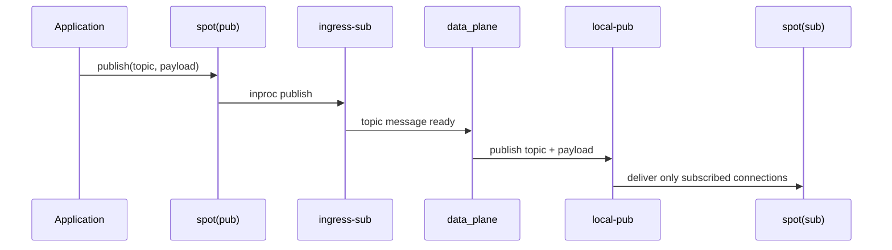
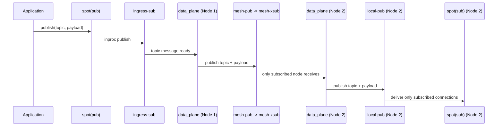
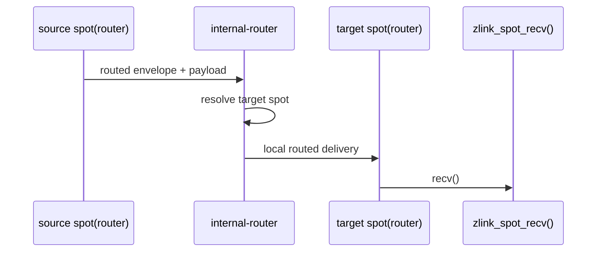
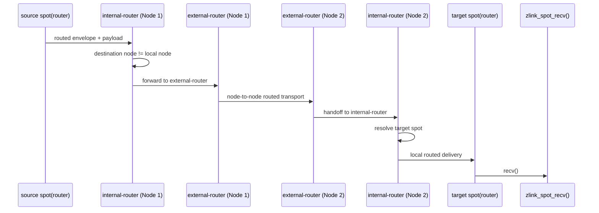

# SPOT Topic / Routed Topology Redesign Draft

이 문서는 **구현 전 초안**이다. 현재 공개 계약이 아니며, `core/include/zlink.h`
또는 정식 `doc/spec/` 문서를 대체하지 않는다.

이 초안의 목적은 두 가지다.

1. 현재 SPOT pub/sub 경로에서 socket 기본 구독 필터를 유지하면서도, node
   aggregate subscription 수명을 어떻게 관리할지 정리한다.
2. 현재 SPOT routed 경로가 `route_ingress`, `node_router`,
   `peer_route_ingress`, `peer_route_tx`로 나뉘어 있어 역할이 모호한 문제를
   정리한다.

이 초안의 구현 순서와 검증 게이트는 아래 rollout plan 문서로 분리한다.

- [SPOT Topology Redesign Rollout Plan](../plan/spot-refactor/spot-topology-redesign-rollout-plan.ko.md)

핵심 결론은 이렇다.

- pub/sub는 socket 수가 많은 점 자체는 구조적으로 이해할 수 있다.
- pub/sub의 topic filtering 본체는 local / remote 모두 socket 기본 구독 필터로
  유지한다.
- runtime은 publish-time target index가 아니라 aggregate subscription 수명만
  관리한다.
- routed는 현재 구조보다 `internal-router`와 `external-router` 두 축으로
  다시 나누는 편이 단순하고 자연스럽다.

---

## 1. 배경

현재 SPOT은 pub/sub와 routed를 모두 한 `SpotNode` 안에서 처리한다. 이 자체는
맞는 방향이다. 한 node가 다음 역할을 동시에 맡기 때문이다.

- 같은 process 안의 local topic 분배
- peer `SpotNode` 사이의 remote topic 전파
- target `Spot`을 지정하는 routed 메시징
- peer ready, bootstrap, subscription replay 같은 control 작업

문제는 "여러 역할을 모두 가진다"는 사실과 "현재 배선 방식이 가장 단순하다"는
것이 같지 않다는 점이다. 특히 아래 두 문제가 크다.

- pub/sub는 local / remote 모두 socket 구독 필터를 기본으로 쓰되, node aggregate
  subscription 수명 관리를 명확히 정해야 한다.
- routed는 local ingress, local delivery, remote delivery가 분리되어 있지만,
  그 경계가 문서와 코드에서 모두 쉽게 읽히지 않는다.

---

## 2. 현재 문제

### 2.1 pub/sub topic 전달 문제

현재 local topic 흐름은 크게 이렇게 이해할 수 있다.

- `spot(pub)`가 `local_pub_ingress`로 publish
- data plane이 메시지를 받음
- local subscriber가 있으면 local fanout 경로로 전달
- remote peer가 있으면 mesh 경로로 전달
- 최종 topic 매칭은 각 `spot(sub)` 또는 remote `mesh_xsub` / `SUBSCRIBE`
  계층이 맡음

이 흐름 자체가 바로 잘못된 것은 아니다. local과 remote 모두 `PUB/SUB`,
`XSUB/XPUB`의 기본 구독 필터를 사용하는 방향은 유지할 수 있다.

문제는 다른 곳에 있다.

- local subscriber들의 구독 상태가 remote mesh 구독으로 언제 올라가고 언제
  내려가야 하는지, 문서와 구현 규칙이 충분히 분명하지 않다.
- 같은 토픽을 여러 local subscriber가 함께 구독할 때, 마지막 subscriber가
  빠지기 전까지는 remote aggregate subscription을 유지해야 하는데, 이 기준이
  문서에 분명히 고정돼 있지 않다.
- 즉 pub/sub의 핵심 문제는 "publish 전에 runtime이 topic target을 직접
  찾아야 한다"가 아니라, "aggregate subscription 수명을 어떤 규칙으로
  관리해야 하는가"가 더 정확하다.

### 2.2 routed 메시징 구조 문제

현재 routed는 다음 socket 묶음으로 나뉜다.

- `route_ingress`
- `node_router`
- `peer_route_ingress`
- `peer_route_tx`

이 구조는 기능은 수행하지만, 설계가 자연스럽지 않다.

- local routed input과 local routed output이 서로 다른 router로 나뉜다.
- remote routed 송신은 별도 cached sender가 맡는데, 현재 구현은
  endpoint 하나만 재사용하는 단일 sender cache다.
- 문서만 읽으면 `node_router`가 external hop을 맡는지, local final delivery만
  맡는지 바로 드러나지 않는다.

특히 routed는 "node 간 라우팅"과 "node 내부 spot 라우팅"이 섞여 보이는 것이
가장 큰 문제다.

---

## 3. 설계 목표

개선 설계는 아래 목표를 가져야 한다.

1. pub/sub는 local / remote 모두 socket 기본 구독 필터를 유지해야 한다.
2. pub/sub는 node aggregate subscription의 생성, 유지, 제거 시점을 명확히 해야
   한다.
3. routed는 local용 router와 remote용 router를 명확히 분리해야 한다.
4. 문서와 코드에서 "이 socket이 무슨 평면에 속하는가"를 이름만 보고도
   추적할 수 있어야 한다.
5. data plane loop는 가능하면 "분기와 포워딩"만 맡고, socket 역할 정의는 더
   단순해야 한다.

### 3.1 이번 초안이 고정하는 구현 원칙

이 초안은 "무엇을 개선하고 싶은가" 수준에서 끝나지 않고, 구현 원칙도 같이
고정한다.

1. topic filter의 본체는 계속 socket 기본 기능으로 둔다.
   - local `spot(sub)`의 `SUBSCRIBE`
   - remote topic mesh의 `XSUB/XPUB` 구독 전파
2. runtime은 socket filter를 대체하지 않는다.
3. runtime이 하는 일은 local subscriber들의 aggregate subscription 상태를
   관리해서 remote mesh 구독을 정확히 유지하는 것이다.
4. routed는 반대로 socket 기본 기능만으로는 구조가 충분히 명확해지지 않으므로,
   socket 역할 자체를 다시 나눈다.

즉 이번 초안은 아래처럼 선을 긋는다.

- pub/sub:
  - socket filter를 유지
  - runtime은 aggregate subscription 관리와 relay만 담당
- routed:
  - socket 역할 자체를 재정의
  - local broker와 remote broker를 분리

---

## 4. 구조 요약

### 4.1 pub/sub

pub/sub는 여전히 local ingress, local fanout, remote mesh라는 세 축을 유지한다.
핵심은 local과 remote 모두 socket 기본 구독 필터를 그대로 사용한다는 점이다.

- local:
  `local-pub` (`local_fanout`)에 연결된 각 `spot(sub)`의 `SUBSCRIBE`
- remote:
  `mesh-pub` (`mesh_pub`)에 연결된 각 remote node `mesh-xsub` (`mesh_xsub`)의
  aggregate subscription

runtime은 publish-time target index를 두지 않는다. runtime이 추가로 관리하는 것은
remote mesh에 반영할 node aggregate subscription 상태뿐이다.

- `topic -> local subscriber refcount`
- `prefix -> local subscriber refcount`

즉 publish 시점에는 별도 target lookup 없이 기존 `local-pub`
(`local_fanout`)과 `mesh-pub` (`mesh_pub`)에 싣고, 실제 토픽 매칭은 socket
구독 필터가 맡는다. 이 초안은 이 동작을 문제로 보지 않고, 그대로 유지할
구조로 본다.

### 4.2 routed

routed는 두 종류의 router만 남기는 방향으로 정리한다.

- `internal-router`
  - 같은 `SpotNode` 안의 target `Spot`으로 메시지를 넘기는 local routed router
- `external-router`
  - 다른 `SpotNode`와 node 간 routed 메시지를 주고받는 remote routed router

이번 초안에서는 `route_ingress` 같은 별도 routed ingress 평면을 남기지 않는다.
문서와 구현 개념 모두 routed는 아래 두 축으로 고정한다.

- local spot delivery: `internal-router`
- remote node delivery: `external-router`

즉 routed의 핵심 축은 선택지가 아니라 `internal-router`와
`external-router` 두 개다.

### 4.3 네이밍

이번 초안은 이름도 가능한 한 한 규칙으로 맞춘다. 목적은 "이 socket이 어느
평면에 속하고, 실제 타입이 무엇인지"를 이름만 보고 따라갈 수 있게 하는 것이다.

pub/sub는 아래 이름을 기준으로 삼는다.

- `ingress-sub`
  - 현재 `local_pub_ingress`
  - local publish 입력을 받는 `SUB`
- `local-pub`
  - 현재 `local_fanout`
  - local subscriber 방향으로 내보내는 `PUB`
- `mesh-pub`
  - 현재 `mesh_pub`
  - remote node 방향으로 내보내는 `PUB`
- `mesh-xsub`
  - 현재 `mesh_xsub`
  - remote node 방향에서 받는 `XSUB`

routed는 아래 이름을 기준으로 삼는다.

- `internal-router`
- `external-router`

즉 naming 원칙은 이렇다.

- pub/sub:
  평면 이름 + 실제 socket 타입
- routed:
  역할 이름 + 실제 socket 타입

이 초안 본문에서는 기존 코드 이름을 함께 적을 때도, 위 이름을 우선 개념 이름으로
쓴다.

---

## 5. pub/sub 개선 설계

### 5.1 socket filter를 그대로 쓰는 local / remote 전달

이번 초안은 local과 remote 모두 publish-time 별도 target index를 두지 않는다.

- local delivery:
  `local-pub` (`local_fanout`)에 연결된 각 `spot(sub)`의 `SUBSCRIBE` 상태가
  토픽 매칭을 맡는다.
- remote delivery:
  `mesh-pub` (`mesh_pub`)에 연결된 각 remote node `mesh-xsub` (`mesh_xsub`)의
  aggregate subscription이 토픽 매칭을 맡는다.

즉 publish 시점의 실제 전달 경로는 단순하다.

1. `ingress-sub` (`local_pub_ingress`)에서 topic + payload를 읽는다.
2. local delivery가 필요하면 `local-pub` (`local_fanout`)으로 publish한다.
3. remote delivery가 필요하면 `mesh-pub` (`mesh_pub`)로 publish한다.
4. 각 연결에서 최종 토픽 매칭은 socket filter가 수행한다.

여기서 publish 시점에 runtime이 `refcount`를 다시 조회해서 remote 대상을
판단할 필요는 없다. `mesh-pub`가 이미 연결별 구독 상태를 알고 있으므로,
해당 topic을 구독한 `mesh-xsub` 연결이 있으면 그 연결로만 전달하고, 없으면
전달하지 않는다.

### 5.2 aggregate subscription refcount

runtime이 관리해야 하는 핵심은 publish-time target index가 아니라
aggregate subscription refcount다.

- `topic -> local subscriber refcount`
- `prefix -> local subscriber refcount`

이 값은 "이 node 안에서 지금 이 토픽을 원하는 local subscriber가 몇 개인가"를
뜻한다.

이 refcount가 필요한 이유는 remote `mesh-xsub` (`mesh_xsub`)가 node 대표
구독자로 동작하기 때문이다.

- 첫 local subscriber가 어떤 토픽을 구독할 때:
  remote mesh에도 그 토픽 구독을 반영해야 한다.
- 중간 subscriber가 같은 토픽을 추가로 구독할 때:
  remote mesh에는 추가 작업이 필요 없다.
- 마지막 subscriber가 그 토픽을 해지할 때:
  그때만 remote mesh 구독을 내려야 한다.

### 5.2.1 subscribe / unsubscribe 알고리즘

이번 초안은 구독 변경 알고리즘을 아래처럼 고정한다.

#### local subscribe(topic)

1. 해당 local `spot(sub)` 소켓에 즉시 `SUBSCRIBE(topic)`를 적용한다.
2. runtime aggregate refcount를 증가시킨다.
3. refcount가 `0 -> 1`로 바뀐 경우에만 node aggregate subscription에
   `SUBSCRIBE(topic)`를 반영한다.
4. 이 aggregate subscription은 remote `mesh-xsub` 구독 상태와 peer
   subscription replay에 반영된다.

#### local unsubscribe(topic)

1. 해당 local `spot(sub)` 소켓에 즉시 `UNSUBSCRIBE(topic)`를 적용한다.
2. runtime aggregate refcount를 감소시킨다.
3. refcount가 아직 0이 아니면 remote `mesh-xsub` 구독은 유지한다.
4. refcount가 `1 -> 0`이 된 경우에만 node aggregate subscription에
   `UNSUBSCRIBE(topic)`를 반영한다.

즉 unsubscribe의 핵심은 두 층이 다르다는 점이다.

- local subscriber 소켓의 unsubscribe:
  항상 즉시
- node aggregate subscription의 unsubscribe:
  refcount가 0이 될 때만

### 5.2.2 pub/sub 구현 데이터 구조

이번 초안은 pub/sub 보조 상태를 아래 구조로 고정한다.

- `local_exact_topic_refcount`
  - 자료구조: `unordered_map<string, uint32_t>`
  - key: exact topic string
  - value: local subscriber count
- `local_prefix_topic_refcount`
  - 자료구조: `unordered_map<string, uint32_t>`
  - key: prefix string
  - value: local subscriber count

peer replay용 보조 상태는 아래처럼 둔다.

- `aggregate_exact_subscriptions`
- `aggregate_prefix_subscriptions`

하지만 이것은 publish-time target lookup용이 아니라, remote mesh에 반영된 현재
node 대표 구독 집합을 관리하기 위한 상태다.

이번 단계에서는 trie를 도입하지 않는다. 이유는 이 상태가 publish-time prefix
매칭 엔진이 아니라, subscribe / unsubscribe 시점의 aggregate subscription
refcount 관리용이기 때문이다.

### 5.2.3 local fanout과 mesh의 역할

개선 후에도 `local-pub` (`local_fanout`)과 `mesh-pub` (`mesh_pub`)의 역할은
유지된다.

- `local-pub`
  - local `spot(sub)` 연결로 publish
  - 각 local subscriber 연결의 `SUBSCRIBE`가 최종 토픽 매칭 수행
- `mesh-pub`
  - remote node `mesh-xsub` 연결로 publish
  - 각 remote node 연결의 aggregate 구독 상태가 최종 토픽 매칭 수행

즉 topic matching은 runtime 별도 index가 아니라 socket 구독 필터가 맡고,
runtime은 aggregate subscription 수명 관리만 맡는다.

### 5.2.4 aggregate subscription 반영 타이밍

이번 초안은 aggregate subscription 반영 타이밍도 아래처럼 고정한다.

- 정상 경로:
  subscribe / unsubscribe 호출 경로에서 즉시 반영
- 복구 경로:
  control task replay가 재연결 이후 재동기화 담당

즉 동작은 아래처럼 나뉜다.

- local `spot(sub)` subscribe / unsubscribe
  - local subscriber 소켓에는 즉시 반영
  - runtime refcount도 즉시 갱신
  - `0 -> 1`, `1 -> 0` 경계에서는 node aggregate subscription도 즉시
    enqueue 또는 apply
- peer reconnect / replay 누락 / 재동기화 필요
  - control task가 현재 aggregate subscription 집합 전체를 replay

이렇게 나누면 정상 구독 경로의 지연은 줄이면서, 복구 경로는 한 곳에서 정리할 수
있다.

### 5.3 pub/sub 개선 요약

개선 후 topic 평면은 이렇게 읽는다.

- local:
  - publish
  - `local-pub` publish
  - local `SUBSCRIBE` filter로 최종 매칭
- remote:
  - publish
  - `mesh-pub` publish
  - remote `mesh-xsub` aggregate subscription으로 node 단위 매칭
  - 수신 node 안에서는 local `SUBSCRIBE` filter로 다시 최종 매칭

### 5.4 pub/sub delivery disconnect 정책

pub/sub의 backpressure 정책은 아래처럼 고정한다.

- `spot -> spotnode`
  - 소켓 HWM과 backpressure만 사용한다.
  - 별도 user-space pending queue를 두지 않는다.
- `spotnode -> spot`
  - target `spot(sub)` 방향의 delivery에서만 per-target queue를 둔다.
  - send는 항상 nonblocking으로 시도한다.
  - `EAGAIN` 또는 target recv HWM 도달 시 해당 target queue에 적재한다.
  - queued message는 신규 message보다 먼저 drain한다.
  - queue limit은 message count 기준 hard limit 하나만 둔다.
  - 기본 hard limit 값은 `100`으로 둔다.

느린 target이 계속 queue를 키우면, runtime은 해당 target을 `destroy`하지 않고
해당 delivery plane에서만 `disconnect`한다.

- pub/sub plane disconnect:
  - `local-pub -> spot(sub)` 연결만 끊는다.
  - 다른 `spot` delivery는 계속 진행한다.
  - `spot` 객체 자체를 자동 파괴하지는 않는다.

즉 pub/sub는 느린 subscriber 하나 때문에 node 전체가 멈추지 않게 하고,
느린 target만 격리하는 정책을 따른다.

---

## 6. routed 개선 설계

### 6.1 역할 재정의

현재 routed는 입구, remote hop, local final delivery가 지나치게 잘게 나뉘어 있다.
개선 후에는 역할을 아래처럼 다시 정의한다.

- `internal-router`
  - node 내부 routed broker
  - local source `Spot`에서 받은 메시지를 local target `Spot`으로 넘김
  - remote에서 들어온 routed 메시지를 local target `Spot`으로 넘김

- `external-router`
  - node 간 routed broker
  - 다른 `SpotNode`와 routed 메시지를 송수신
  - remote destination이 있는 메시지는 이 router를 통해 외부로 나감

### 6.1.1 routed 구현에서 실제로 남길 socket

이번 초안은 routed에서 최종적으로 남길 socket 역할을 아래처럼 고정한다.

- `internal-router`
  - 타입: `ROUTER`
  - 성격: inproc local broker
  - 연결 대상:
    - local source `Spot` routed attachment
    - local target `Spot` owned routed ingress
- `external-router`
  - 타입: `ROUTER`
  - 성격: inter-node routed broker
  - 연결 대상:
    - remote `SpotNode`의 `external-router`

그리고 각 `Spot`은 지금처럼 자기 own routed ingress를 계속 가진다.

- `spot-owned-router`
  - 타입: `ROUTER`
  - 성격: target `Spot`의 최종 recv owner
  - `zlink_spot_recv()`가 직접 읽는 대상

즉 routed 평면의 socket 역할은 아래 셋으로 정리된다.

- source/target `Spot` attachment
- local node broker: `internal-router`
- remote node broker: `external-router`

### 6.2 핵심 원칙

1. local delivery와 remote delivery는 router 이름만 보고 구분되어야 한다.
2. remote routed 송신은 단일 endpoint reconnect cache에 기대지 않는다.
3. "목적지가 같은 node 안에 있는가"와 "다른 node에 있는가"만 판단하고,
   그 다음은 각 router 평면이 맡는 구조가 더 단순하다.

### 6.2.1 routed 구현에서 제거할 것

이번 초안은 아래 구현을 제거 대상으로 본다.

- single endpoint 기반 `peer_route_tx` sender cache
- local routed input과 local final delivery를 과도하게 나눈 추가 broker
- remote hop을 문서상에서만 우회적으로 설명하는 route sender cache 계층

즉 remote routed 송신은 "보낼 때마다 sender cache `DEALER`를 붙여 쓴다"가 아니라,
`external-router`가 이미 가진 peer 연결을 통해 처리하는 구조로 바뀌어야 한다.

### 6.3 expected socket semantics

개선안에서 기대하는 의미는 다음과 같다.

- `internal-router`
  - local `Spot` attachment가 연결되는 inproc routed 허브
  - local destination이면 바로 target `Spot`에 전달
  - remote destination이면 `external-router`에 위임

- `external-router`
  - remote `SpotNode`와 연결된 routed 허브
  - outgoing remote routed send
  - incoming remote routed recv

### 6.3.1 routed 송수신 알고리즘

이번 초안은 routed 알고리즘도 같이 고정한다.

#### local source -> local target

1. source `Spot`이 자기 routed attachment에서 메시지를 보낸다.
2. `internal-router`가 envelope를 읽는다.
3. destination node id가 local node와 같음을 확인한다.
4. destination spot id를 local spot map에서 찾는다.
5. target `Spot` owned routed ingress로 전달한다.

#### local source -> remote target

1. source `Spot`이 자기 routed attachment에서 메시지를 보낸다.
2. `internal-router`가 envelope를 읽는다.
3. destination node id가 remote node임을 확인한다.
4. local peer map에서 destination node의 `external-router` pipe를 찾는다.
5. `external-router`가 해당 remote node 방향으로 전송한다.
6. remote node의 `external-router`가 메시지를 받는다.
7. remote `external-router`가 local `internal-router`로 넘긴다.
8. remote `internal-router`가 destination spot id를 해석한다.
9. target `Spot` owned routed ingress로 전달한다.

이 알고리즘의 핵심은 다음 두 가지다.

- node 간 hop은 항상 `external-router`
- node 내부 final delivery는 항상 `internal-router`

### 6.3.2 routed 연결 관리

routed peer 연결 관리도 같이 단순화한다.

- `external-router`는 peer `SpotNode`별 연결을 오래 유지한다.
- control plane의 peer up/down 이벤트가 오면 해당 peer router pipe 상태를 갱신한다.
- routed send 경로는 새 sender socket을 만들지 않는다.
- remote peer가 끊기면 send는 기존 disconnect/error 정책대로 실패하거나 backpressure가
  걸린다.

### 6.3.3 routed backpressure와 queue 정책

routed의 backpressure 정책은 경로를 둘로 나눠서 본다.

- `spot -> spotnode`
  - source `spot(router)`에서 `internal-router`로 들어오는 경로는 소켓 HWM과
    backpressure만 사용한다.
  - 별도 user-space pending queue를 두지 않는다.
- `spotnode -> remote spotnode`
  - `external-router -> remote external-router` hop도 소켓 HWM과 backpressure만
    사용한다.
  - 별도 per-peer queue를 두지 않는다.
- `spotnode -> spot`
  - `internal-router -> target spot(router)` delivery에서만 per-target queue를 둔다.

send 정책은 아래처럼 고정한다.

1. send는 항상 nonblocking으로 시도한다.
2. `spot -> spotnode`와 `spotnode -> remote spotnode`에서는 send 실패를 소켓
   HWM/backpressure로만 처리한다.
3. `spotnode -> spot`에서만 `EAGAIN` 또는 target recv HWM 도달 시 해당 target
   queue에 적재한다.
4. queue가 비어 있지 않으면 queued message를 신규 message보다 먼저 drain한다.
5. queue limit은 message count 기준 hard limit 하나만 둔다.
6. 기본 hard limit 값은 `100`으로 둔다.

즉 queue는 ingress 쪽에도 없고, remote node hop에도 없고, 최종 local target
delivery egress에만 생긴다.

### 6.3.4 hard limit 초과 시 disconnect 정책

느린 target 때문에 local delivery queue가 계속 커지면, runtime은 node 전체를
멈추는 대신 해당 delivery plane만 끊는다.

- local routed target hard limit 초과
  - `internal-router -> target spot(router)` 연결 disconnect
  - 해당 target queue 폐기
  - 다른 local target과 remote peer delivery는 계속 진행

여기서도 `spot` 객체나 `SpotNode`를 자동 파괴하지는 않는다.
runtime은 delivery plane만 끊고, 상위 상태는 faulted / disconnected로 남긴다.

즉 routed도 느린 local target 하나 때문에 전체 `SpotNode`가 멈추지 않게 하고,
해당 local delivery 경로만 격리하는 정책을 따른다.

### 6.3.5 hard limit 옵션

이번 단계에서는 queue 정책을 단순하게 가져간다.

- soft limit 없음
- bytes limit 없음
- message count 기준 hard limit 하나만 사용

이 hard limit는 HWM 자동 계산과 별도의 정책 옵션이다. 소켓 HWM은 transport 내부
버퍼 한계를 다루고, hard limit는 "느린 local target을 언제 delivery plane에서
끊을 것인가"를 결정한다.

초기 기본값은 아래처럼 둔다.

- pub/sub per-target queue hard limit: `100`
- routed per-target queue hard limit: `500`

### 6.3.6 HWM 계산과 수동 HWM 매핑

이번 초안은 HWM을 local plane과 remote plane으로 나눠 해석한다. 이유는 새 구조가
`internal-router`, `external-router`, `local-pub`, `mesh-pub`, `mesh-xsub`처럼
책임이 분리된 평면 위에 서 있기 때문이다.

즉 HWM은 "모든 topic send를 한 덩어리로 본다"가 아니라, 아래 경로별로 따로
읽는 편이 맞다.

- `spot -> spotnode`
- `spotnode -> local spot`
- `spotnode -> remote spotnode`

#### 자동 HWM 계산

자동 HWM은 여전히 context 예산과 socket 역할을 기준으로 `SNDHWM`, `RCVHWM`,
`SNDBUF`, `RCVBUF`를 계산한다.

- context 입력
  - `AUTO_HWM_ENABLE`
  - `AUTO_HWM_TOTAL_MEMORY_BUDGET_MB`
  - `AUTO_HWM_SPOT_BOOTSTRAP`
- socket 입력
  - role
  - socket type
  - managed connection 수
  - active connection 수
  - message unit
  - manual override 여부

현재 코드 기준 계산 순서는 아래와 같다.

1. context 총 예산을 바이트로 바꾼다.

```text
total_memory_budget_bytes = AUTO_HWM_TOTAL_MEMORY_BUDGET_MB * 1024 * 1024
```

2. runtime reserve를 먼저 뗀다.

```text
runtime_reserve_bytes = total_memory_budget_bytes / 10
```

3. socket별 auto buffer 비용을 계산한다.

```text
auto_buffer_bytes =
  (auto_sndbuf + auto_rcvbuf) * buffer_connections
```

여기서 현재 기본값은 아래와 같다.

- 기본 `SNDBUF`: `262144`
- 기본 `RCVBUF`: `262144`
- `buffer_connections`:
  `observed_count > 0 ? observed_count : 1`

4. queue 예산을 계산한다.

```text
queue_budget_bytes =
  total_memory_budget_bytes
  - runtime_reserve_bytes
  - total_auto_buffer_bytes
```

5. 각 socket의 planning count를 계산한다.

```text
observed_count = max(managed_connections, active_hwm_connections)
planning_count = max(observed_count, bootstrap_connections)
```

현재 기본 `bootstrap_connections`는 아래 규칙을 따른다.

- `planning_bootstrap > 0`이면 그 값을 사용
- 아니면 `STREAM`은 `5000`
- 그 외 socket은 `1`

SPOT 내부에서는 보통 `AUTO_HWM_SPOT_BOOTSTRAP` 값이 `planning_bootstrap`으로
들어간다.

6. context 전체 planning count 합을 구한다.

```text
context_total_planning_count = sum(socket.planning_count)
```

7. 각 socket이 받을 queue share를 계산한다.

```text
socket_queue_share_bytes =
  queue_budget_bytes * socket.planning_count / context_total_planning_count
```

8. queue share를 message slot 수로 바꾼다.

```text
socket_message_slots =
  floor(socket_queue_share_bytes / effective_message_bytes)
```

여기서 `effective_message_bytes`는 현재 코드 기준으로 아래를 따른다.

- 수동 `AUTO_HWM_MSG_UNIT_BYTES`가 있으면 그 값
- `STREAM`이면 `1024`
- 그 외는 `4096`

queue share가 0보다 크지만 slot 계산 결과가 0이면, 현재 코드는 최소 `1 slot`으로
올린다.

9. scope에 따라 slot을 다시 나눈다.

```text
if scope == shared:
    hwm_divisor = scope_count
else if scope == none:
    hwm_divisor = active_hwm_connections > 0 ? active_hwm_connections : 1
else:
    hwm_divisor = 1

target_slots = socket_message_slots / hwm_divisor
```

10. 최종 HWM을 정한다.

```text
final_hwm = max(1, target_slots)
sndhwm = final_hwm
rcvhwm = final_hwm
```

즉 현재 코드 기준 핵심 공식은 아래 한 줄로 요약할 수 있다.

```text
final_hwm ≈
  queue_budget_bytes
  * planning_count
  / context_total_planning_count
  / effective_message_bytes
  / hwm_divisor
```

여기서:

- `planning_count`가 크면 더 많은 queue share를 받는다.
- `effective_message_bytes`가 크면 HWM은 작아진다.
- `scope_count` 또는 `active_hwm_connections`가 크면 HWM은 더 작아진다.

다만 이번 초안에서는 managed / active connection을 아래처럼 local / remote로
분리해서 읽는다.

##### topic ingress: `ingress-sub`

- role:
  `auto_hwm_role_recv_ingress`
- 의미:
  local publish가 node 안으로 들어오는 입력
- managed / active 기준:
  `local_pub_count`

즉 `ingress-sub`는 local publisher attachment 부담만 본다.

##### local topic delivery: `local-pub`

- role:
  `auto_hwm_role_fanout`
- 의미:
  같은 node 안의 `spot(sub)`로 퍼뜨리는 local delivery
- managed / active 기준:
  `local_sub_count`

즉 `local-pub`는 local subscriber fanout 부담만 본다.

##### remote topic delivery: `mesh-pub`

- role:
  `auto_hwm_role_fanout`
- 의미:
  remote node `mesh-xsub`로 퍼뜨리는 inter-node topic delivery
- managed / active 기준:
  `connected_peer_count`, `active_peer_count`

즉 `mesh-pub`는 remote `SpotNode` fanout 부담만 본다.

##### remote topic ingress: `mesh-xsub`

- role:
  `auto_hwm_role_recv_ingress`
- 의미:
  remote node에서 topic을 받는 입력
- managed / active 기준:
  `connected_peer_count`, `active_peer_count`

즉 `mesh-xsub`는 remote node 수신 부담만 본다.

##### local routed broker: `internal-router`

- role:
  `auto_hwm_role_routed`
- 의미:
  local source `Spot`에서 받고, local target `Spot`으로 넘기는 routed broker
- send side managed / active 기준:
  `local_router_target_count`
- recv side managed / active 기준:
  `local_router_source_count`

여기서 `local_router_target_count`는 local routed target `Spot` 수,
`local_router_source_count`는 local routed source attachment 수를 뜻한다.

##### remote routed broker: `external-router`

- role:
  `auto_hwm_role_routed`
- 의미:
  remote `SpotNode`와 node 간 routed hop을 담당
- managed / active 기준:
  `connected_peer_count`, `active_peer_count`

즉 `external-router`는 remote node hop 부담만 본다.

##### 정리

이번 초안의 핵심은 이것이다.

- local topic fanout과 remote topic mesh는 따로 계산한다.
- local routed broker와 remote routed broker도 따로 계산한다.
- 따라서 예전처럼 `local_sub_count + connected_peer_count`를 한 번에 더하는
  식으로 설명하지 않는다.

각 socket은 자기 평면의 연결 수만 반영해서 계산한다.

#### 수동 HWM 매핑

수동 HWM도 같은 평면 분리 원칙으로 읽는다.

##### 빠른 읽기 표

아래 표는 "어느 API를 설정하면 실제로 어느 socket에 값이 적용되는가"를 먼저
보여 준다.

| 설정 API | 적용 socket | 의미 |
|---|---|---|
| `ZLINK_SPOT_PUB_OPT_SNDHWM` | source publish attachment | 개별 `spot(pub)`의 송신 HWM |
| `ZLINK_SPOT_SUB_OPT_RCVHWM` | target subscribe attachment | 개별 `spot(sub)`의 수신 HWM |
| routed `Spot` HWM | source routed attachment / target owned routed ingress | 개별 `spot(router)`의 송수신 HWM |
| `ZLINK_SPOT_NODE_OPT_PUB_HWM` | `local-pub`, `mesh-pub` | `SpotNode` publish plane 기본 HWM |
| `ZLINK_SPOT_NODE_OPT_SUB_HWM` | `ingress-sub`, `mesh-xsub` | `SpotNode` subscribe plane 기본 HWM |
| `ZLINK_SPOT_NODE_OPT_ROUTED_SEND_HWM` | `internal-router` send, `external-router` send | `SpotNode` routed send 기본 HWM |
| `ZLINK_SPOT_NODE_OPT_ROUTED_RECV_HWM` | `internal-router` recv, `external-router` recv | `SpotNode` routed recv 기본 HWM |

즉 기준은 간단하다.

- `spot` API:
  개별 `Spot` endpoint socket에 적용
- `spotnode` API:
  내부 broker socket의 기본 HWM에 적용

##### 자동 HWM 빠른 읽기 표

아래 표는 auto HWM이 실제로 어느 socket에 계산되는지 보여 준다.

| socket | 역할 | 계산 입력 |
|---|---|---|
| `ingress-sub` | local topic ingress | `local_pub_count` |
| `local-pub` | local topic delivery | `local_sub_count` |
| `mesh-pub` | remote topic delivery | `connected_peer_count`, `active_peer_count` |
| `mesh-xsub` | remote topic ingress | `connected_peer_count`, `active_peer_count` |
| `internal-router` recv | local routed ingress | `local_router_source_count` |
| `internal-router` send | local routed delivery | `local_router_target_count` |
| `external-router` recv/send | remote routed hop | `connected_peer_count`, `active_peer_count` |
| publish attachment | `spot -> spotnode` publish send | per-spot scope + publish attachment count |
| subscribe attachment | `spotnode -> spot` local recv | per-spot scope + subscribe attachment count |
| routed attachment / owned routed ingress | 개별 `spot(router)` endpoint | per-spot routed scope |

이 표에서 중요한 점은 auto HWM 결과가 "Spot 전체에 값 하나"가 아니라, 각
내부 socket 역할별로 따로 계산된다는 점이다.

##### `spot(pub)` 수동 `SNDHWM`

- 적용 대상:
  source publish attachment
- 의미:
  `spot -> spotnode` publish ingress 경로의 사용자 의도

##### `spot(sub)` 수동 `RCVHWM`

- 적용 대상:
  target subscribe attachment
- 의미:
  `spotnode -> spot` local topic delivery 최종 수신자의 사용자 의도

##### `spot(router)` 수동 routed HWM

- 적용 대상:
  source routed attachment 또는 target owned routed ingress
- 의미:
  routed plane에서 해당 `Spot` endpoint의 사용자 의도

##### `SpotNode` 수동 pub/sub / routed HWM

- `ZLINK_SPOT_NODE_OPT_PUB_HWM`:
  `local-pub`, `mesh-pub` 기본 send HWM에 각각 반영
- `ZLINK_SPOT_NODE_OPT_SUB_HWM`:
  `ingress-sub`, `mesh-xsub` 기본 recv HWM에 각각 반영
- routed send HWM:
  `internal-router`, `external-router` send 측 기본 HWM에 각각 반영
- routed recv HWM:
  `internal-router`, `external-router` recv 측 기본 HWM에 각각 반영

즉 수동 HWM도 "pub 하나", "sub 하나", "routed send 하나", "routed recv 하나"라는
사용자의 의도를 새 평면 구조에 맞춰 각각 local / remote socket으로 나눠 적용하는
방식으로 읽어야 한다.

짧은 예시는 아래처럼 읽으면 된다.

- 사용자가 `ZLINK_SPOT_NODE_OPT_PUB_HWM = 500`을 주면:
  `local-pub`와 `mesh-pub`의 기본 send HWM이 `500` 기준으로 잡힌다.
- 사용자가 `ZLINK_SPOT_NODE_OPT_SUB_HWM = 300`을 주면:
  `ingress-sub`와 `mesh-xsub`의 기본 recv HWM이 `300` 기준으로 잡힌다.
- 사용자가 `ZLINK_SPOT_SUB_OPT_RCVHWM = 1000`을 주면:
  그 값은 특정 `spot(sub)` endpoint의 recv HWM에만 적용되고, node 내부 모든
  socket으로 자동 복사되는 것은 아니다.

#### hard limit와의 관계

이 초안에서 hard limit는 HWM 계산과 별도의 정책 옵션이다.

- HWM:
  socket 내부 완충
- hard limit:
  `spotnode -> spot` local delivery pending queue의 message count 상한

즉 HWM과 hard limit를 하나의 값으로 섞지 않는다.

정리하면:

- auto HWM:
  local / remote plane 분리 계산
- manual HWM mapping:
  local / remote plane 분리 적용
- 추가 정책:
  `spotnode -> spot` local delivery queue hard limit

##### 한 줄 요약

사용자가 실제로 기억해야 할 규칙은 아래 정도면 충분하다.

1. `spot`에 준 HWM은 그 `Spot` endpoint socket에 걸린다.
2. `spotnode`에 준 HWM은 내부 `local-pub`, `mesh-pub`, `ingress-sub`,
   `mesh-xsub`, `internal-router`, `external-router` 기본값에 걸린다.
3. auto HWM은 위 socket들을 각각 따로 계산한다.
4. `hard limit`는 HWM과 별개이고, `spotnode -> spot` local delivery queue에만
   적용된다.

즉 routed는 다음 두 단계로만 이해할 수 있어야 한다.

- node 내부 broker
- node 외부 broker

### 6.4 제거 또는 축소 대상

개선 설계에서는 아래 항목을 재검토한다.

- `peer_route_tx` 같은 단일 endpoint cached sender
- local routed input과 local final delivery를 과도하게 분리한 추가 router
- 문서상으로만 존재하고 실제 역할이 불분명한 routed sender cache 설명

---

## 7. 개선된 메시지 흐름

이 절은 "구조 설명"보다 "개선 후 메시지가 어떻게 흐르는가"를 직접 보여 주기
위한 절이다.

### 7.1 pub/sub topic 전달: 로컬



이 흐름의 핵심은 local publish 시점의 별도 target lookup이 없다는 점이다.
최종 토픽 계약은 local `SUBSCRIBE` 필터가 보장한다.

### 7.2 pub/sub topic 전달: 원격



이 흐름의 핵심은 두 단계의 socket filter가 있다는 점이다.

- 송신 node 이후 remote node 선택:
  remote `mesh_xsub` aggregate subscription
- 수신 node 안의 subscriber 선택:
  local `SUBSCRIBE` filter

runtime refcount는 여기서 전달 대상을 찾는 index가 아니라, subscribe /
unsubscribe 시점에 remote mesh 구독을 언제 올리고 언제 내릴지 결정하는 관리
상태다.

### 7.3 routed 메시징: 로컬



이 흐름에서는 local routed delivery에 external hop이 전혀 개입하지 않는다.

### 7.4 routed 메시징: 원격



이 흐름의 핵심은 local과 remote 책임이 분리된다는 점이다.

- `internal-router`: local `Spot` 해석과 local delivery 담당
- `external-router`: node 간 routed hop 담당

---

## 8. 기대 효과

### 8.1 pub/sub

- local/remote 모두 socket 기본 토픽 필터를 그대로 사용
- node aggregate subscription 수명 관리가 명확해짐
- 마지막 unsubscribe 시점에만 remote mesh 구독을 내리도록 고정 가능

### 8.2 routed

- local routed와 remote routed의 역할이 더 명확해짐
- `peer_route_tx` 같은 단일 endpoint sender cache의 의미 모호성 제거
- 문서와 코드에서 routed 평면을 더 쉽게 추적 가능

---

## 9. 구현 시 주의점

### 9.1 pub/sub aggregate subscription

- exact topic과 prefix topic을 함께 다뤄야 한다.
- subscribe/unsubscribe churn이 많을 때 refcount 갱신 비용을 통제해야 한다.
- local subscriber 소켓 unsubscribe와 node aggregate unsubscribe의 순서를
  명확히 고정해야 한다.
- socket-level filter와 aggregate subscription replay가 불일치하지 않도록
  replay 순서를 정해야 한다.

### 9.2 routed router 재구성

- 기존 `Spot` own routed ingress contract는 유지해야 한다.
- request-reply envelope 처리 위치가 바뀌더라도 public API 동작은 유지해야 한다.
- queue는 ingress 쪽이 아니라 `spotnode -> spot` local delivery egress에만
  두어야 한다.
- `spotnode -> remote spotnode` hop은 기존 소켓 HWM / backpressure만 사용해야
  한다.
- HWM 설명과 수동 HWM 매핑도 `internal-router`와 `external-router`를 같은 값으로
  묶지 말고, local / remote 평면으로 나눠 읽어야 한다.
- local target hard limit 초과 시에는 전체 pause가 아니라 plane-level
  disconnect가 일어나야 한다.
- local/remote broker 분리 후에도 shutdown, reconnect, timeout 처리가 더 복잡해지지
  않아야 한다.

### 9.3 discovery 기반 자동 연결과 수동 연결

이번 초안은 peer를 "어떻게 발견하느냐" 자체를 바꾸지는 않는다. 즉 peer 집합을
만드는 주체는 계속 두 가지다.

- discovery 기반 자동 연결
- 호출자가 직접 수행하는 수동 연결

바뀌는 것은 "peer가 결정된 뒤 어떤 내부 평면을 붙이고, 어떤 상태를 replay해야
하는가"다.

#### discovery 기반 자동 연결

discovery는 계속 아래 책임을 가진다.

1. 같은 channel 또는 service 범위에서 연결해야 할 remote `SpotNode` endpoint를
   찾는다.
2. peer up/down, endpoint 변경, 재연결 같은 topology 변화를 알려 준다.
3. 재연결 뒤 subscription replay가 필요한 peer를 표시한다.

개선 후에는 discovery가 새 peer를 활성화할 때, 내부에서 아래 두 평면을 같이
준비해야 한다.

- pub/sub 평면
  - local node의 `mesh-pub`
  - remote node 방향 `mesh-xsub`
- routed 평면
  - local node의 `external-router`
  - remote node의 `external-router`

즉 discovery는 "이 peer를 붙여야 한다"는 사실을 결정하지만, topic 전달과
routed 전달은 각각 `mesh-*` 평면과 `external-router` 평면이 맡는다.

또한 discovery reconnect 뒤에는 아래 순서가 필요하다.

1. peer 연결 복구
2. `mesh-xsub` aggregate subscription replay
3. 필요하면 routed peer ready 상태 갱신
4. 그 뒤 active peer 집합에 다시 포함

핵심은 pub/sub replay와 routed peer 활성화가 같은 discovery 이벤트에서 함께
움직일 수는 있어도, 내부 책임은 서로 분리해야 한다는 점이다.

#### 수동 연결

수동 연결도 개념은 같다. 호출자가 직접 peer endpoint를 지정해 연결하더라도,
개선 후 내부 동작은 discovery 경로와 같은 평면 구조를 따라야 한다.

- topic 경로:
  `mesh-pub` / `mesh-xsub`
- routed 경로:
  `external-router`

즉 수동 연결이라고 해서 별도 routed sender cache를 두거나, pub/sub와 routed를
다른 peer 관리 규칙으로 처리하지 않는다. 차이는 오직 peer endpoint를 누가
알려 주느냐뿐이다.

#### 자동 연결과 수동 연결에서 바뀌는 점

이번 초안 기준으로 자동 연결과 수동 연결 모두 아래 변경을 같이 받는다.

1. pub/sub는 publish-time target index를 새로 두지 않는다.
   - local/remote 모두 socket 기본 구독 필터 유지
   - reconnect 뒤에는 aggregate subscription replay만 정확히 수행
2. routed는 `peer_route_tx` 같은 단일 endpoint sender cache 대신
   `external-router` peer 연결을 오래 유지하는 구조로 바뀐다.
3. 따라서 peer 상태 관리도 "topic peer 연결"과 "routed peer 연결"을 같은
   peer lifecycle 아래에서 다루되, 실제 소켓 평면은 분리해서 본다.

#### 구현 쪽에서 특히 확인할 점

- discovery attach 뒤 peer refresh가 `mesh-xsub` 연결뿐 아니라
  `external-router` peer 연결까지 함께 갱신하는지 확인해야 한다.
- 수동 `connect_peer()` / `disconnect_peer()`도 같은 peer lifecycle 경로를 타되,
  peer source만 `manual`로 남겨야 한다.
- peer disconnect 시에는:
  - `mesh-xsub` 쪽 aggregate subscription replay pending
  - `external-router` 쪽 routed peer inactive 처리
  가 함께 정리돼야 한다.
- 자동 연결과 수동 연결이 같은 peer endpoint를 가리키는 경우에도, 내부 평면은
  peer 하나당 하나의 active peer 상태로 수렴해야 한다.

#### 현재 코드 기준 구현 TODO 대응

현재 코드 기준으로는 아래 경로를 이 초안의 목표에 맞춰 다시 정리해야 한다.

1. discovery attach / refresh 경로
   - `zlink_spot_node_attach_discovery()`
   - `refresh_discovery_peers()`
   - `refresh_service_discovery_attachments()`
   - 목표:
     - peer topology 변화가 `mesh-xsub`와 `external-router`에 함께 반영되게 정리

2. 수동 peer connect / disconnect 경로
   - `zlink_spot_node_connect_peer()`
   - `zlink_spot_node_disconnect_peer()`
   - `zlink_spot_node_disconnect_peer_rid()`
   - 목표:
     - discovery 경로와 같은 peer lifecycle을 타되, peer source만 `manual`로 유지

3. 구독 replay 경로
   - `schedule_subscription_replay()`
   - `emit_pending_subscription_replays()`
   - `replay_subscriptions_if_active_peers()`
   - 목표:
     - local aggregate subscription refcount를 기준으로 `mesh-xsub` replay를 고정
     - 마지막 unsubscribe 전까지 remote aggregate subscription이 내려가지 않게 보장

4. routed peer 경로
   - 현재 `peer_route_tx` 기반 경로 제거
   - `external-router` peer 연결 유지 구조로 수렴
   - 목표:
     - routed remote hop이 sender cache가 아니라 peer router plane으로 읽히게 정리

5. peer 상태 / snapshot 경로
   - `connected_endpoints`, `manual_endpoints`, `discovery_endpoints`
   - `connected_peer_count`, `active_peer_count`
   - 목표:
     - pub/sub와 routed가 같은 peer lifecycle을 공유하되, 내부 소켓 평면은
       `mesh-*`와 `external-router`로 분리해서 보여 주기

---

## 10. 공개 API / enum 초안 계약

이 절은 구현 전 초안 기준의 공개 계약 방향을 정리한 것이다. 아래 내용은 아직
현재 공개 계약이 아니며, 실제 반영 시에는 `core/include/zlink.h`,
`core/include/zlink_enum.h`, 바인딩, 테스트와 반드시 같이 맞춰야 한다.

### 10.1 제거 없이 유지하는 공개 API

이번 초안 기준으로 discovery 쪽 공개 함수는 제거 대상이 아니다.

- `zlink_spot_node_attach_discovery()`
- `zlink_spot_node_connect_peer()`
- `zlink_spot_node_disconnect_peer()`
- `zlink_spot_node_disconnect_peer_rid()`
- `zlink_spot_node_attach_channel_dealer()`
- `zlink_spot_node_attach_channel_dealer_manual()`

즉 자동 연결과 수동 연결의 공개 진입점은 유지하고, 내부 peer wiring과 replay
방식만 바꾸는 방향이다.

### 10.2 이름을 바꾸는 enum 옵션

현재 공개 enum에는 아래 이름이 있다.

- `ZLINK_SPOT_NODE_OPT_TOPIC_SEND_HWM`
- `ZLINK_SPOT_NODE_OPT_TOPIC_RECV_HWM`

이번 초안은 이 둘을 아래 이름으로 바꾼다.

- `ZLINK_SPOT_NODE_OPT_PUB_HWM`
- `ZLINK_SPOT_NODE_OPT_SUB_HWM`

이유는 다음과 같다.

- `topic send/recv`보다 `pub/sub`가 실제 socket 평면과 더 직접 연결된다.
- `local-pub`, `mesh-pub`, `ingress-sub`, `mesh-xsub`와 문서 이름이 더 자연스럽게
  맞는다.
- 사용자가 "publish plane 기본 HWM", "subscribe plane 기본 HWM"으로 읽기 쉽다.

즉 enum 수준의 가장 큰 공개 변경은 이 rename이다.

### 10.3 추가되는 enum 옵션

이번 초안은 `spotnode -> spot` local delivery queue용 hard limit를 공개 정책
옵션으로 둔다. 추가 enum 옵션은 아래 두 개로 고정한다.

- `ZLINK_SPOT_NODE_OPT_SUB_QUEUE_HARD_LIMIT`
  - 대상:
    `local-pub -> spot(sub)` local delivery queue
  - 의미:
    pub/sub local delivery plane의 per-target queue message count 상한
- `ZLINK_SPOT_NODE_OPT_ROUTED_QUEUE_HARD_LIMIT`
  - 대상:
    `internal-router -> target spot(router)` local delivery queue
  - 의미:
    routed local delivery plane의 per-target queue message count 상한

현재 공개 계약은 `core/include/zlink.h`를 따른다. 현 구현에서는 local subscribe
delivery target 기본값이 `100`, routed delivery target 기본값이 `500`이다.

이번 단계에서는 아래는 추가하지 않는다.

- soft limit 옵션
- byte 기준 queue limit 옵션
- `spotnode -> remote spotnode`용 queue limit 옵션

즉 공개 정책은 최대한 단순하게:

- HWM은 기존 HWM 옵션
- local delivery queue hard limit는 count 옵션

으로 나누는 것이 목적이다.

### 10.4 추가 함수 없음

이번 초안은 hard limit 정책 때문에 새 공개 함수를 추가하지 않는다. 기존
`zlink_set_spot_node_option()` / `zlink_get_spot_node_option()` 경로에 enum 옵션을
추가하는 것으로 충분하다고 본다.

hard limit에 의해 끊긴 상태는 기존 status / query / snapshot 계열 surface에서
노출한다. 별도 재연결 전용 공개 함수는 이번 단계에 추가하지 않는다.

### 10.5 제거 대상 공개 API

현재 초안 기준으로는 discovery 관련 공개 API 제거 대상은 없다.

또한 routed 재구성 때문에 아래 공개 API를 제거 대상으로 보지도 않는다.

- `zlink_spot_recv()`
- `zlink_spot_request_spot()`
- `zlink_spot_request_router()`
- `zlink_spot_reply_spot()`
- `zlink_router_reply_spot()`

즉 이번 초안에서 바뀌는 것은 내부 router 평면과 queue 정책이지, 사용자 facing
spot/discovery 함수 세트를 줄이는 것이 아니다.

---

## 11. 회귀 테스트 항목

이 절은 구현 뒤 반드시 다시 확인해야 할 회귀 테스트 축을 정리한다. 이번 초안은
내부 배선과 HWM 적용 평면을 바꾸지만, 사용자 입장에서는 "기존에 되던 것이 계속
같이 동작하는가"가 더 중요하기 때문이다.

### 11.1 pub/sub 기본 동작 회귀

- 같은 `SpotNode` 안에서:
  - `spot(pub)` -> `spot(sub)` topic 전달이 계속 동작해야 한다.
- 다른 `SpotNode` 사이에서:
  - `mesh-pub` / `mesh-xsub`를 통한 topic 전달이 계속 동작해야 한다.
- local subscriber가 여러 개일 때:
  - 각 `SUBSCRIBE` 토픽 필터가 그대로 유지되어야 한다.
- remote peer가 여러 개일 때:
  - remote node 단위 aggregate subscription이 정확히 전파되어야 한다.
- 마지막 unsubscribe 전까지:
  - remote aggregate subscription이 내려가지 않아야 한다.
- 마지막 unsubscribe 뒤에는:
  - replay 없이도 불필요한 remote topic 전달이 멈춰야 한다.

### 11.2 routed 기본 동작 회귀

- 같은 `SpotNode` 안에서:
  - `spot(router)` -> `spot(router)` local routed delivery가 계속 동작해야 한다.
- 다른 `SpotNode` 사이에서:
  - `external-router`를 통한 remote routed delivery가 계속 동작해야 한다.
- request-reply 경로:
  - `zlink_spot_request_spot()`
  - `zlink_spot_request_router()`
  - `zlink_spot_reply_spot()`
  - `zlink_router_reply_spot()`
  가 기존과 같은 타임아웃/완료 규칙을 유지해야 한다.
- target `Spot` owned routed ingress contract:
  - `zlink_spot_recv()`가 계속 target owned ingress에서 직접 읽어야 한다.

### 11.3 discovery 자동 연결 회귀

- `zlink_spot_node_attach_discovery()` 뒤:
  - topic peer 연결이 자동으로 형성되어야 한다.
  - routed peer 연결도 같은 peer lifecycle 아래에서 형성되어야 한다.
- peer up/down이 발생하면:
  - `mesh-xsub` 쪽 aggregate subscription replay pending이 정확히 걸려야 한다.
  - `external-router` 쪽 active peer 상태도 같이 갱신되어야 한다.
- reconnect 뒤:
  - topic replay와 routed peer 활성화가 다시 정상화되어야 한다.
- discovery와 manual peer가 같은 endpoint를 가리킬 때:
  - peer snapshot에는 중복 없이 수렴된 peer 상태가 보여야 한다.

### 11.4 수동 연결 회귀

- `zlink_spot_node_connect_peer()` / `disconnect_peer()` / `disconnect_peer_rid()`
  경로가 discovery 없이도 계속 동작해야 한다.
- 수동 연결 peer도:
  - topic 전달
  - routed 전달
  - reconnect 뒤 replay
  가 discovery peer와 같은 의미로 동작해야 한다.
- manual source peer와 discovery source peer가 함께 있을 때:
  - source 표시는 유지하되, 내부 연결 평면은 충돌 없이 수렴해야 한다.

### 11.5 HWM / queue 정책 회귀

- auto HWM:
  - `ingress-sub`, `local-pub`, `mesh-pub`, `mesh-xsub`,
    `internal-router`, `external-router`
    에 평면별 계산이 기대대로 반영되어야 한다.
- manual HWM:
  - `spot` API 설정이 개별 endpoint에만 적용되는지 확인해야 한다.
  - `spotnode` API 설정이 내부 broker 기본값에만 적용되는지 확인해야 한다.
- hard limit:
  - `spotnode -> spot` local delivery queue에만 적용되어야 한다.
  - `spotnode -> remote spotnode` hop에는 적용되면 안 된다.
- hard limit 초과 시:
  - 해당 local delivery plane만 disconnect되어야 한다.
  - 다른 `Spot`, 다른 peer, 다른 평면은 계속 진행해야 한다.

### 11.6 snapshot / query 회귀

- `zlink_spot_node_status_snapshot()`
- `zlink_spot_node_peers_snapshot()`
- `zlink_spot_node_peers_query()`
- `zlink_spot_node_subjects_snapshot()`
- `zlink_spot_node_internal_sockets_snapshot()`

위 query/snapshot이 새 이름과 새 평면을 기준으로도 계속 일관된 상태를 보여야
한다.

특히 아래를 확인해야 한다.

- peer count가 local `Spot` 수와 remote `SpotNode` 수를 혼동하지 않는지
- `internal-router`, `external-router`, `local-pub`, `mesh-pub`, `mesh-xsub`
  상태가 snapshot에서 구분되는지
- local delivery hard limit 때문에 disconnect된 target이 status/query에 드러나는지

### 11.7 perf / smoke 회귀

- single perf:
  - pub/sub
  - routed
  - spot
- multi perf:
  - pub/sub
  - routed
  - spot

각 패턴에서 아래를 다시 봐야 한다.

- HWM detail 출력이 새 이름과 새 평면 기준으로 읽히는지
- remote peer count와 local target count가 섞이지 않는지
- hard limit 정책이 local delivery에만 영향을 주는지
- discovery 기반 auto-connect와 manual peer 경로가 perf에서도 같은 의미로
  동작하는지

### 11.8 공개 계약 회귀

공개 API / enum 변경이 실제로 반영되면 아래도 같이 확인해야 한다.

- `core/include/zlink.h`
- `core/include/zlink_enum.h`
- `doc/spec/`
- `doc/spec/bindings/`
- 각 binding public enum / option mapping

즉 이번 변경은 내부 구현만의 회귀 테스트로 끝나지 않고, 공개 계약과 바인딩까지
같이 확인해야 한다.

## 12. perf snapshot 이름 정리

perf snapshot 이름은 구현 반영 시 아래 이름으로 정리한다.

- `ingress-sub`
- `local-pub`
- `mesh-pub`
- `mesh-xsub`
- `internal-router`
- `external-router`

기존 내부 코드 이름은 구현 전환 중간 단계에서만 병기하고, 최종 출력과 정식 문서,
bindings surface에서는 위 이름으로 수렴시킨다.

---

## 13. 요약

이 초안의 핵심 제안은 간단하다.

- pub/sub는 socket 수가 많아도 괜찮다. topic matching은 socket 기본 필터가
  맡고, runtime은 aggregate subscription 수명만 관리한다.
- routed는 현재보다 단순한 두 평면 구조가 낫다.
  - `internal-router`
  - `external-router`

즉 개선 방향은 "socket 수를 무조건 줄이자"가 아니라, "각 socket이 맡는 책임을
더 단순하고 명확하게 다시 나누자"에 가깝다.
