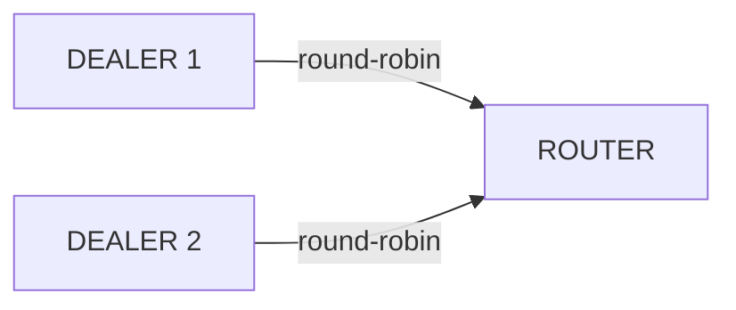

[English](03-3-dealer.md) | [한국어](03-3-dealer.ko.md)

# DEALER 소켓

## 1. 개요

DEALER 소켓은 비동기 요청 소켓이다.
여러 피어에 **Round-robin** 분배로 송신하고, **Fair-queue**로 수신한다.
send/recv 순서 강제가 없어 자유로운 비동기 메시징이 가능하다.

**핵심 특성:**
- 송신: Round-robin (`lb_t`) — 연결된 피어에 순환 분배
- 수신: Fair-queue (`fq_t`) — 모든 피어에서 공정하게 수신
- send/recv 순서 강제 없음 (비동기)

**유효한 소켓 조합:** DEALER ↔ ROUTER, DEALER ↔ DEALER



```c
/* DEALER → ROUTER send */
zlink_msg_t parts[2];
zlink_msg_init_size(&parts[0], 6);
memcpy(zlink_msg_data(&parts[0]), "header", 6);
zlink_msg_init_size(&parts[1], 4);
memcpy(zlink_msg_data(&parts[1]), "body", 4);
zlink_send(dealer, parts, 2, 0);
```

### 구체적 시나리오: 3개 DEALER가 1개 ROUTER로 전송

3개의 DEALER 클라이언트가 하나의 ROUTER 서버에 연결한다. 각 DEALER는
독립적으로 요청을 전송하며, ROUTER는 fair-queue로 수신하고
`source_rid`로 각 송신자를 구분한다.

| 송신자 | routing_id | 메시지 | ROUTER 수신 |
|--------|-----------|--------|-------------|
| DEALER 1 | `D1` | `"buy AAPL 100"` | source_rid=`D1`, data=`"buy AAPL 100"` |
| DEALER 2 | `D2` | `"sell TSLA 50"` | source_rid=`D2`, data=`"sell TSLA 50"` |
| DEALER 3 | `D3` | `"buy MSFT 200"` | source_rid=`D3`, data=`"buy MSFT 200"` |

ROUTER는 `zlink_send_rid()`에 해당 `source_rid`를 전달하여 각 DEALER에
응답한다. DEALER는 *송신* 연결에 round-robin을 사용하므로, 하나의
DEALER가 여러 ROUTER에 연결하면 메시지가 순환 분배된다
(msg1 -> ROUTER-A, msg2 -> ROUTER-B, ...).

## 2. 기본 사용법

### 생성 및 연결

```c
void *dealer = zlink_socket(ctx, ZLINK_DEALER);

/* Set routing_id (optional, used for identification by ROUTER) */
zlink_set_routing_id(dealer, "client-1", 8);

/* Connect to server */
zlink_connect(dealer, "tcp://127.0.0.1:5558");
```

### 메시지 송수신

```c
/* Send requests -- can send consecutively without ordering constraints */
zlink_msg_t msg1, msg2, msg3;
zlink_msg_init_size(&msg1, 9);
memcpy(zlink_msg_data(&msg1), "request-1", 9);
zlink_send(dealer, &msg1, 1, 0);

zlink_msg_init_size(&msg2, 9);
memcpy(zlink_msg_data(&msg2), "request-2", 9);
zlink_send(dealer, &msg2, 1, 0);

zlink_msg_init_size(&msg3, 9);
memcpy(zlink_msg_data(&msg3), "request-3", 9);
zlink_send(dealer, &msg3, 1, 0);

/* Responses are dispatched to the handler callback registered at creation */
```

### 수신 모드

DEALER는 `zlink_recv()`로 동기 수신한다.

```c
zlink_routing_id_t source_rid;
zlink_msg_t *parts = NULL;
size_t part_count = 0;
int rc = zlink_recv(dealer, &source_rid, &parts, &part_count, 0);
if (rc == 0) {
    /* process parts[0..part_count-1] */
    zlink_multipart_close(parts, part_count);
}
```

> HWM 도달 시 `zlink_send()`는 블록(기본) 또는 `ZLINK_DONTWAIT`로
> `EAGAIN`을 반환한다. 고급 backpressure 패턴은
> [성능 가이드](10-performance.ko.md)를 참고.

??? example "Full Sample Code -- Recv"

    | Language | Source |
    |----------|--------|
    | C | [dealer_router_recv_sample.c](https://github.com/kairos-code-dev/zlink/blob/main/core/samples/dealer_router_recv_sample.c) |
    | C++ | [dealer_router_recv_sample.cpp](https://github.com/kairos-code-dev/zlink/blob/main/bindings/cpp/samples/dealer_router_recv_sample.cpp) |
    | Java | [DealerRouterRecvSample.java](https://github.com/kairos-code-dev/zlink/blob/main/bindings/java/samples/Zlink.Samples/src/main/java/dev/kairoscode/zlink/samples/DealerRouterRecvSample.java) |
    | Python | [dealer_router_recv.py](https://github.com/kairos-code-dev/zlink/blob/main/bindings/python/examples/dealer_router_recv.py) |
    | Node | [dealer_router_recv_sample.ts](https://github.com/kairos-code-dev/zlink/blob/main/bindings/node/examples/dealer_router_recv_sample.ts) |
    | C# | [Program.cs](https://github.com/kairos-code-dev/zlink/blob/main/bindings/dotnet/samples/DealerRouterRecv/Program.cs) |
    | Rust | [dealer_router_recv_sample.rs](https://github.com/kairos-code-dev/zlink/blob/main/bindings/rust/samples/dealer_router_recv_sample.rs) |
    | Go | [main.go](https://github.com/kairos-code-dev/zlink/blob/main/bindings/go/samples/dealer_router_recv_sample/main.go) |

??? example "Full Sample Code -- Callback"

    | Language | Source |
    |----------|--------|
    | C | [dealer_router_callback_sample.c](https://github.com/kairos-code-dev/zlink/blob/main/core/samples/dealer_router_callback_sample.c) |
    | C++ | [dealer_router_callback_sample.cpp](https://github.com/kairos-code-dev/zlink/blob/main/bindings/cpp/samples/dealer_router_callback_sample.cpp) |
    | Java | [DealerRouterCallbackSample.java](https://github.com/kairos-code-dev/zlink/blob/main/bindings/java/samples/Zlink.Samples/src/main/java/dev/kairoscode/zlink/samples/DealerRouterCallbackSample.java) |
    | Python | [dealer_router_callback.py](https://github.com/kairos-code-dev/zlink/blob/main/bindings/python/examples/dealer_router_callback.py) |
    | Node | [dealer_router_callback_sample.ts](https://github.com/kairos-code-dev/zlink/blob/main/bindings/node/examples/dealer_router_callback_sample.ts) |
    | C# | [Program.cs](https://github.com/kairos-code-dev/zlink/blob/main/bindings/dotnet/samples/DealerRouterCallback/Program.cs) |
    | Rust | [dealer_router_callback_sample.rs](https://github.com/kairos-code-dev/zlink/blob/main/bindings/rust/samples/dealer_router_callback_sample.rs) |
    | Go | [main.go](https://github.com/kairos-code-dev/zlink/blob/main/bindings/go/samples/dealer_router_callback_sample/main.go) |

## 3. 사용 예제

```c
/* Send with no peer connected */
zlink_msg_t msg;
zlink_msg_init_size(&msg, 4);
memcpy(zlink_msg_data(&msg), "data", 4);
int rc = zlink_send(dealer, &msg, 1, ZLINK_DONTWAIT);
if (rc == -1 && errno == EAGAIN) {
    /* HWM exceeded or no peer connected */
}
```

## 4. 소켓 옵션

| 옵션 | 타입 | 기본값 | 설명 |
|------|------|--------|------|
| `zlink_set_routing_id()` | binary | 자동(UUID) | ROUTER에서 식별할 ID (전용 함수) |
| `ZLINK_DEALER_OPT_PROBE` | int | 0 | 연결 시 빈 메시지 전송 (연결 알림) |
| `ZLINK_OPT_SNDHWM` | int | 1000 | 송신 큐 최대 메시지 수 |
| `ZLINK_OPT_RCVHWM` | int | 1000 | 수신 큐 최대 메시지 수 |
| `ZLINK_OPT_LINGER` | int | -1 | close 시 대기 시간 (ms) |
| `ZLINK_OPT_SNDTIMEO` | int | -1 | 송신 타임아웃 (ms) |
| `ZLINK_OPT_RCVTIMEO` | int | -1 | 수신 타임아웃 (ms) |
| `ZLINK_ROUTER_OPT_CONNECT_ROUTING_ID` | binary | — | 다음 connect에 적용할 alias |

### routing_id 설정

ROUTER가 DEALER를 식별하려면 명시적으로 routing_id를 설정한다.

```c
/* Set before bind/connect */
zlink_set_routing_id(dealer, "D1", 2);
zlink_connect(dealer, "tcp://127.0.0.1:5558");
```

> 참고: `core/tests/test_router_multiple_dealers.cpp` — `zlink_set_routing_id(dealer1, "D1", 2)`

## 5. 사용 패턴

### 패턴 1: 1:1 양방향 비동기

PAIR와 유사하지만 HWM과 자동 재연결을 지원한다. 응답이 필요한 경우 반드시 1:1로 구성해야 한다.
(routing_id가 없으므로 1:N에서는 어떤 피어가 응답했는지 구분할 수 없다.)

```c
void *a = zlink_socket(ctx, ZLINK_DEALER);
/* Receive with zlink_recv() */
zlink_bind(a, "tcp://*:5558");

void *b = zlink_socket(ctx, ZLINK_DEALER);
/* Receive with zlink_recv() */
zlink_connect(b, "tcp://127.0.0.1:5558");

/* Bidirectional free send */
zlink_msg_t ping;
zlink_msg_init_size(&ping, 4);
memcpy(zlink_msg_data(&ping), "ping", 4);
zlink_send(a, &ping, 1, 0);

zlink_msg_t pong;
zlink_msg_init_size(&pong, 4);
memcpy(zlink_msg_data(&pong), "pong", 4);
zlink_send(b, &pong, 1, 0);

/* on_message_b receives "ping", on_message_a receives "pong" */
```

### 패턴 2: 1:N Round-robin 작업 분배

PUSH/PULL 없이 작업을 N개 워커에 순환 분배하는 패턴.
응답이 필요 없는 작업 분배 또는 파이프라인 단계 간 전달에 사용한다.

```c
void *router = zlink_socket(ctx, ZLINK_ROUTER);
/* ROUTER receives with zlink_recv() and distinguishes each DEALER by source_rid */
zlink_bind(router, "tcp://127.0.0.1:*");

char endpoint[256];
size_t len = sizeof(endpoint);
zlink_get_option(router, ZLINK_OPT_LAST_ENDPOINT, endpoint, &len);

void *dealer1 = zlink_socket(ctx, ZLINK_DEALER);
zlink_set_routing_id(dealer1, "D1", 2);
zlink_connect(dealer1, endpoint);

void *dealer2 = zlink_socket(ctx, ZLINK_DEALER);
zlink_set_routing_id(dealer2, "D2", 2);
zlink_connect(dealer2, endpoint);

/* Each DEALER sends a message */
zlink_msg_t m1;
zlink_msg_init_size(&m1, 12);
memcpy(zlink_msg_data(&m1), "from_dealer1", 12);
zlink_send(dealer1, &m1, 1, 0);

zlink_msg_t m2;
zlink_msg_init_size(&m2, 12);
memcpy(zlink_msg_data(&m2), "from_dealer2", 12);
zlink_send(dealer2, &m2, 1, 0);

/* on_message receives each DEALER's message with its routing_id */
```

> DEALER ↔ ROUTER 조합(로드밸런싱 + 응답 라우팅, 프록시 등)은
> [ROUTER 소켓](03-4-router.ko.md)을 참고.

## 6. 주의사항

### 피어 없으면 큐잉

연결된 피어가 없으면 메시지는 송신 큐에 쌓인다. HWM 초과 시 블록(기본) 또는 `EAGAIN` 반환(`ZLINK_DONTWAIT`).

```c
/* Correct order */
zlink_set_routing_id(dealer, "D1", 2);
zlink_connect(dealer, endpoint);  /* identified as D1 */
```

### Round-robin 분배

여러 피어가 연결된 경우 메시지는 순환적으로 분배된다. 특정 피어에게만 전송하려면 ROUTER를 사용한다.

### routing_id는 connect 전에 설정

`zlink_set_routing_id()`는 `zlink_connect()` 호출 전에 호출해야 한다. 연결 후 변경은 적용되지 않는다.

```c
/* Frontend: clients connect here */
void *frontend = zlink_socket(ctx, ZLINK_ROUTER);
zlink_bind(frontend, "tcp://*:5558");

/* Backend: worker threads connect here */
void *backend = zlink_socket(ctx, ZLINK_DEALER);
zlink_bind(backend, "inproc://backend");

/* Start worker threads then run proxy */
zlink_proxy(frontend, backend, NULL);
```

---
[← PUB/SUB](03-2-pubsub.ko.md) | [ROUTER →](03-4-router.ko.md)
