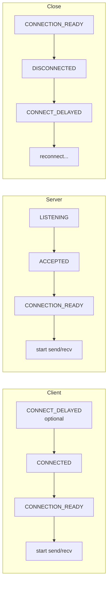
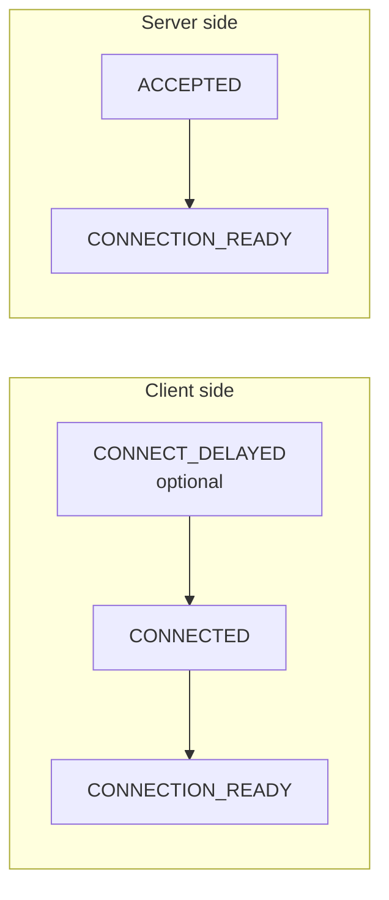
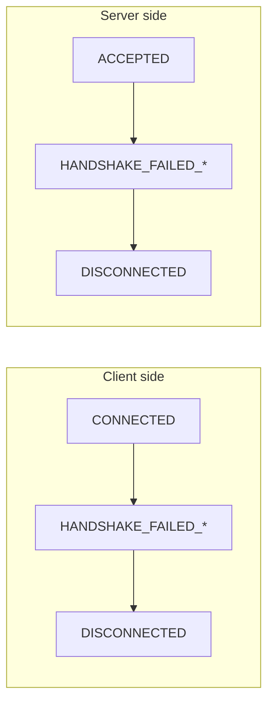
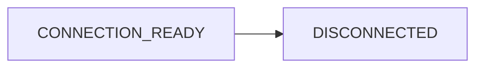
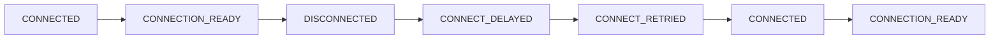

[English](06-monitoring.md) | [한국어](06-monitoring.ko.md)

# 모니터링 API 사용법

## 1. 개요

모니터링은 소켓 연결 상태를 실시간으로 관찰하는 기능으로, 연결 문제 진단, 피어 장애 감지, 애플리케이션 수준 복구 트리거에 필수적이다.

zlink 모니터링 API는 소켓의 연결/해제/핸드셰이크 등 이벤트를 실시간으로 관찰할 수 있다.
다른 소켓과 동일하게 recv 모드(pull)와 callback 모드를 지원한다.

## 2. 모니터 활성화

### 2.1 콜백 모드

I/O 스레드에서 이벤트 발생 즉시 핸들러가 호출된다.
이벤트 유실 없이 실시간으로 처리하려면 콜백 모드가 적합하다.

```c
/* Define event handler */
void on_monitor_event(const zlink_monitor_event_t *ev, void *userdata)
{
    printf("Event: 0x%llx\n", (unsigned long long)ev->event);
    printf("Local: %s\n", ev->local_addr);
    printf("Remote: %s\n", ev->remote_addr);

    if (ev->routing_id.size > 0) {
        printf("routing_id: ");
        for (uint8_t i = 0; i < ev->routing_id.size; ++i)
            printf("%02x", ev->routing_id.data[i]);
        printf("\n");
    }
}

void *server = zlink_socket(ctx, ZLINK_ROUTER);
zlink_bind(server, "tcp://*:5555");

/* Create monitor with options */
zlink_socket_monitor_open_options_t opts = { .events = ZLINK_EVENT_ALL };
void *mon = zlink_socket_monitor_open(server, &opts);
zlink_socket_monitor_handler(mon, on_monitor_event, NULL);
```

이벤트 발생 시 `on_monitor_event` 콜백이 자동으로 호출된다.

### 이벤트 구조체

```c
typedef struct {
    uint64_t event;               /* Event type */
    uint64_t value;               /* Auxiliary value (fd, errno, reason, etc.) */
    zlink_routing_id_t routing_id; /* Peer routing_id */
    char local_addr[256];         /* Local address */
    char remote_addr[256];        /* Remote address */
} zlink_monitor_event_t;
```

??? example "Full Sample Code"

    | Language | Source |
    |----------|--------|
    | C | [monitor_recv_sample.c](https://github.com/kairos-code-dev/zlink/blob/main/core/samples/monitor_recv_sample.c) |
    | C++ | [monitor_recv_sample.cpp](https://github.com/kairos-code-dev/zlink/blob/main/bindings/cpp/samples/monitor_recv_sample.cpp) |
    | Java | [MonitorRecvSample.java](https://github.com/kairos-code-dev/zlink/blob/main/bindings/java/samples/Zlink.Samples/src/main/java/dev/kairoscode/zlink/samples/MonitorRecvSample.java) |
    | Python | [monitor_recv.py](https://github.com/kairos-code-dev/zlink/blob/main/bindings/python/examples/monitor_recv.py) |
    | Node | [monitor_recv_sample.ts](https://github.com/kairos-code-dev/zlink/blob/main/bindings/node/examples/monitor_recv_sample.ts) |
    | C# | [Program.cs](https://github.com/kairos-code-dev/zlink/blob/main/bindings/dotnet/samples/MonitorRecv/Program.cs) |
    | Rust | [monitor_recv_sample.rs](https://github.com/kairos-code-dev/zlink/blob/main/bindings/rust/samples/monitor_recv_sample.rs) |
    | Go | [main.go](https://github.com/kairos-code-dev/zlink/blob/main/bindings/go/samples/monitor_recv_sample/main.go) |

## 4. Socket Monitor 이벤트

`zlink_socket_monitor_open()`으로 관찰하는 이벤트다.
raw 소켓의 transport/session 상태를 알려준다.

### 이벤트 전체 표

| 상수 | 값 | 설명 | `value` | 발생 측 |
|---|---|---|---|---|
| `CONNECTION_READY` | `0x1000` | 핸드셰이크 이후 ready edge | reserved | 양쪽 |
| `CONNECTED` | `0x0001` | TCP 연결 성립 (핸드셰이크 전) | fd | 클라이언트 |
| `ACCEPTED` | `0x0020` | 수신 연결 accept | fd | 서버 |
| `DISCONNECTED` | `0x0200` | 세션 종료 | reason 코드 | 양쪽 |
| `LISTENING` | `0x0008` | bind 성공, 수신 대기 중 | fd | 서버 |
| `CLOSED` | `0x0080` | 의도적 close 완료 | — | 양쪽 |
| `CONNECT_DELAYED` | `0x0002` | 비동기 연결 재시도 예약 | errno | 클라이언트 |
| `CONNECT_RETRIED` | `0x0004` | 비동기 재연결 진행 중 | — | 클라이언트 |
| `BIND_FAILED` | `0x0010` | bind 실패 | errno | 서버 |
| `ACCEPT_FAILED` | `0x0040` | accept 실패 | errno | 서버 |
| `CLOSE_FAILED` | `0x0100` | close 실패 | errno | 양쪽 |
| `HANDSHAKE_FAILED_NO_DETAIL` | `0x0800` | 핸드셰이크 실패 (일반) | errno | 양쪽 |
| `HANDSHAKE_FAILED_PROTOCOL` | `0x2000` | 프로토콜 오류로 실패 | 에러 코드 | 양쪽 |
| `HANDSHAKE_FAILED_AUTH` | `0x4000` | 인증 실패 | — | 양쪽 |
| `MONITOR_STOPPED` | `0x0400` | 모니터 종료 | — | 양쪽 |

- `CONNECTION_READY`: 모든 소켓에서 `routing_id`에 peer id 포함

### 연결 흐름



### CONNECTION_READY 상세

핸드셰이크 완료 후 발생한다. 이 이벤트를 받으면 즉시 메시지를 보내고 받을 수 있다.
`CONNECTION_READY` 이벤트의 `value` 필드는 reserved이며 aggregate ready count 계약이 아니다.
readiness 판정은 이벤트 edge 와 주체별 event counting 으로 해야 한다.

- ROUTER/STREAM에서는 `ev->routing_id`에 peer identity가 포함된다.
- PAIR/DEALER에서는 `routing_id`가 비어 있다.

### DISCONNECTED reason 코드

| 코드 | 이름 | 의미 |
|------|------|------|
| 0 | `UNKNOWN` | 원인 불명 |
| 3 | `HANDSHAKE_FAILED` | 핸드셰이크 실패 |
| 4 | `TRANSPORT_ERROR` | 전송계층 오류 |
| 5 | `CTX_TERM` | 컨텍스트 종료 |

### 프로토콜 에러 코드

`HANDSHAKE_FAILED_PROTOCOL` 발생 시 `value` 필드에 다음 코드 중 하나가 포함된다:

| 상수 | 값 | 설명 |
|------|-----|------|
| `ZLINK_PROTOCOL_ERROR_ZMP_MALFORMED_COMMAND_HELLO` | `0x10000013` | 잘못된 형식의 ZMP HELLO 커맨드. |

## 5. 이벤트 흐름 다이어그램

### 연결 성공



### 핸드셰이크 실패



### 정상 해제



### 재연결



## 6. DISCONNECTED reason 코드

`DISCONNECTED` 이벤트의 `value` 필드에 해제 사유가 포함된다.

| 코드 | 이름 | 의미 | 대응 방법 |
|------|------|------|-----------|
| 0 | UNKNOWN | 원인 불명 | 로그 기록 후 관찰 |
| 3 | HANDSHAKE_FAILED | 핸드셰이크 실패 | TLS/프로토콜 설정 확인 |
| 4 | TRANSPORT_ERROR | 전송계층 오류 | 네트워크 상태 확인 |
| 5 | CTX_TERM | 컨텍스트 종료 | 종료 처리 |

### reason 코드 처리 예제

```c
void on_monitor(const zlink_monitor_event_t *ev, void *userdata)
{
    if (ev->event == ZLINK_EVENT_DISCONNECTED) {
        switch (ev->value) {
            case ZLINK_DISCONNECT_REASON_UNKNOWN:
                printf("Unknown disconnection\n");
                break;
            case ZLINK_DISCONNECT_REASON_HANDSHAKE_FAILED:
                printf("Handshake failed -- check TLS configuration\n");
                break;
            case ZLINK_DISCONNECT_REASON_TRANSPORT_ERROR:
                printf("Transport error -- check network\n");
                break;
            case ZLINK_DISCONNECT_REASON_CTX_TERM:
                printf("Context terminated\n");
                break;
            default:
                printf("Unknown reason=%llu\n", (unsigned long long)ev->value);
                break;
        }
    }
}
```

## 7. 이벤트 필터링 및 구독 프리셋

### 특정 이벤트만 구독

```c
/* Connection/disconnection events only */
zlink_socket_monitor_open_options_t opts = {
    .events = ZLINK_EVENT_CONNECTION_READY | ZLINK_EVENT_DISCONNECTED,
};
void *mon = zlink_socket_monitor_open(server, &opts);
zlink_socket_monitor_handler(mon, on_monitor_event, NULL);
```

### 권장 구독 프리셋

| 프리셋 | 이벤트 마스크 | 용도 |
|--------|-------------|------|
| 기본 | `CONNECTION_READY \| DISCONNECTED` | 연결 상태 추적 |
| 디버깅 | 기본 + `CONNECTED \| ACCEPTED \| CONNECT_DELAYED \| CONNECT_RETRIED` | 연결 과정 상세 |
| 보안 | 기본 + `HANDSHAKE_FAILED_*` | 인증 실패 감지 |
| 전체 | `ZLINK_EVENT_ALL` | 모든 이벤트 |

### 프리셋 구현 예제

```c
/* Basic preset */
#define MONITOR_PRESET_BASIC \
    (ZLINK_EVENT_CONNECTION_READY | ZLINK_EVENT_DISCONNECTED)

/* Debug preset */
#define MONITOR_PRESET_DEBUG \
    (MONITOR_PRESET_BASIC | ZLINK_EVENT_CONNECTED | \
     ZLINK_EVENT_ACCEPTED | ZLINK_EVENT_CONNECT_DELAYED | \
     ZLINK_EVENT_CONNECT_RETRIED)

/* Security preset */
#define MONITOR_PRESET_SECURITY \
    (MONITOR_PRESET_BASIC | ZLINK_EVENT_HANDSHAKE_FAILED_NO_DETAIL | \
     ZLINK_EVENT_HANDSHAKE_FAILED_PROTOCOL | \
     ZLINK_EVENT_HANDSHAKE_FAILED_AUTH)

zlink_socket_monitor_open_options_t sec_opts = { .events = MONITOR_PRESET_SECURITY };
void *mon = zlink_socket_monitor_open(server, &sec_opts);
zlink_socket_monitor_handler(mon, on_monitor_event, NULL);
```

## 8. Socket Monitor Snapshot

monitor handle에서 현재 aggregate 상태를 바로 조회할 수 있다.

| 필드 | 설명 |
|------|------|
| `snd_pending_msgs` | 송신 큐에 대기 중인 메시지 수 (SNDHWM에 의해 상한 제한) |
| `rcv_pending_msgs` | 수신 큐에 대기 중인 메시지 수 (RCVHWM에 의해 상한 제한, approximate) |

`snd_pending_msgs`와 `rcv_pending_msgs`는 HWM 설정과 직접 관련된다.
이 값이 HWM에 근접하면 백프레셔가 발생하고 있다는 의미이다.

**주의 — pending 값이 HWM 설정보다 클 수 있는 경우:**

1. **inproc transport**: inproc은 중간에 세션/엔진이 없으므로 양쪽 HWM을 합산한다.
   예를 들어 양쪽 모두 SNDHWM=1000, RCVHWM=1000이면 실제 pipe HWM은
   `1000 + 1000 = 2000`이 된다. pending 값이 설정값의 2배로 보일 수 있다.

2. **HWM을 약간 초과하는 경우**: write 측이 보는 read 카운트(`_peers_msgs_read`)는
   실시간 값이 아니라 read 측이 LWM 도달 시에만 비동기로 알려주는 스냅샷이다.
   매 메시지마다 동기화하면 lock-free pipe의 성능 이점이 사라지므로,
   배치 알림 방식을 사용한다. 그 결과 HWM은 정확한 hard limit이 아닌
   **approximate limit**이며, 알림 사이에 소폭 초과할 수 있다.

| transport | 실제 pipe HWM | 이유 |
|-----------|--------------|------|
| tcp/ipc/tls/ws/wss | `SNDHWM` (설정값 그대로) | 세션이 양쪽을 독립 관리 |
| inproc | `SNDHWM + peer.RCVHWM` | 세션 없이 직접 연결, 양쪽 버퍼를 합산 |

```c
zlink_socket_monitor_open_options_t opts = { .events = ZLINK_EVENT_ALL };
void *monitor = zlink_socket_monitor_open(socket, &opts);
zlink_monitor_snapshot_t snapshot;
zlink_monitor_snapshot(monitor, &snapshot);
printf("sndq=%llu, rcvq=%llu\n",
       (unsigned long long) snapshot.snd_pending_msgs,
       (unsigned long long) snapshot.rcv_pending_msgs);
```

event 콜백 안에서 snapshot을 조합해 쓸 수도 있다.

```c
void on_monitor(const zlink_monitor_event_t *ev, void *userdata)
{
    if (ev->event == ZLINK_EVENT_CONNECTION_READY) {
        zlink_monitor_snapshot_t snapshot;
        zlink_monitor_snapshot(g_monitor, &snapshot);
        printf("Monitor snapshot updated\n");
    }
}
```

## 8.1 서비스 모니터

서비스 모니터는 공개 service-monitor surface를 유지하는 서비스 핸들의
상태 변화를 관찰한다. 대표 대상은 Discovery이며, socket monitor와는
별도 API다.

- **이벤트 타입**: `zlink_service_event_t` (socket monitor의 `zlink_monitor_event_t`와 다름)
- **콜백 타입**: `zlink_service_monitor_handler_fn`
- **열기**: `zlink_service_monitor_open(target, &options)`
- **닫기**: `zlink_monitor_close(&mon)` (socket monitor와 동일)

### 서비스 모니터 열기

```c
/* Discovery service monitor */
zlink_service_monitor_open_options_t opts = {
    .events = ZLINK_SERVICE_MONITOR_EVENT_ERROR
              | ZLINK_SERVICE_MONITOR_EVENT_CLOSED
              | ZLINK_SERVICE_MONITOR_EVENT_DISCOVERY_PROVIDERS_CHANGED
};
void *mon = zlink_service_monitor_open(discovery, &opts);
```

공개 service monitor를 제공하는 handle을 넘기면 된다.
SPOT과 SpotNode는 더 이상 공개 service-monitor surface를 제공하지 않는다.

### 콜백 모드

```c
void on_service_event(const zlink_service_event_t *ev, void *userdata)
{
    if (ev->event_type & ZLINK_SERVICE_MONITOR_EVENT_DISCOVERY_PROVIDERS_CHANGED) {
        printf("provider set changed\n");
    }
    if (ev->event_type & ZLINK_SERVICE_MONITOR_EVENT_ERROR) {
        printf("service error: %d\n", ev->error_code);
    }
}

zlink_service_monitor_handler(mon, on_service_event, NULL);
```

### Recv 모드

```c
zlink_service_event_t ev;
zlink_recv_result_t rc = zlink_service_monitor_recv(mon, &ev, 0);
if (rc == ZLINK_RECV_OK) {
    printf("event: 0x%x, value: %u\n", ev.event_type, ev.value);
}
```

### 서비스 이벤트 전체 표

`zlink_service_monitor_open()`으로 관찰하는 이벤트다.
서비스별로 발생하는 이벤트가 다르다.

#### Discovery 이벤트

| 상수 | 설명 | `value` | 이후 가능한 동작 |
|---|---|---|---|
| `ZLINK_SERVICE_MONITOR_EVENT_DISCOVERY_SERVICE_UP` | 검색된 서비스 활성화 | — | — |
| `ZLINK_SERVICE_MONITOR_EVENT_DISCOVERY_SERVICE_DOWN` | 검색된 서비스 비활성화 | — | — |
| `ZLINK_SERVICE_MONITOR_EVENT_DISCOVERY_PROVIDERS_CHANGED` | provider 집합 변경 | — | — |

#### 공통 이벤트 (모든 서비스)

| 상수 | 설명 |
|---|---|
| `ZLINK_SERVICE_MONITOR_EVENT_ERROR` | 에러 발생 |
| `ZLINK_SERVICE_MONITOR_EVENT_CLOSED` | 모니터 닫힘 |

상세 이벤트 목록은 [events.ko.md](../spec/core/events.ko.md)를 참고한다.

## 9. 다중 소켓 모니터링

여러 소켓의 이벤트를 각각의 콜백 핸들러로 처리.

```c
void on_event_a(const zlink_monitor_event_t *ev, void *userdata)
{
    printf("Socket A event: 0x%llx\n", (unsigned long long)ev->event);
}

void on_event_b(const zlink_monitor_event_t *ev, void *userdata)
{
    printf("Socket B event: 0x%llx\n", (unsigned long long)ev->event);
}

zlink_socket_monitor_open_options_t opts = { .events = ZLINK_EVENT_ALL };
void *mon_a = zlink_socket_monitor_open(sock_a, &opts);
zlink_socket_monitor_handler(mon_a, on_event_a, NULL);
void *mon_b = zlink_socket_monitor_open(sock_b, &opts);
zlink_socket_monitor_handler(mon_b, on_event_b, NULL);

/* ... application logic ... */

/* Cleanup */
zlink_monitor_close(&mon_a);
zlink_monitor_close(&mon_b);
```

## 10. 주의사항

### 모니터 스레드 안전성

`zlink_socket_monitor_open()`과 monitor handle close는 raw/service handle의
저빈도 control path(설정/관리 경로) 계약에 속한다.
즉 애플리케이션 스레드에서 호출할 수 있고,
같은 handle과 섞여도 correctness(동시 사용 시 데이터 무결성)가 유지된다.
다만 monitor callback은 I/O 경로
에서 실행되므로 callback 내부의 느린 작업은 사용자 큐로 넘기는 편이 좋다.

```c
/* Open a monitor from an application thread */
void *socket = zlink_socket(ctx, ZLINK_ROUTER);
zlink_socket_monitor_open_options_t opts = { .events = ZLINK_EVENT_ALL };
void *mon = zlink_socket_monitor_open(socket, &opts);
zlink_socket_monitor_handler(mon, on_monitor_event, NULL);

/* Snapshot reads may happen later from another worker thread */
zlink_monitor_snapshot_t snapshot;
zlink_monitor_snapshot(mon, &snapshot);
```

### 동시 모니터 제한

동일 소켓에 동시에 여러 모니터를 설정할 수 없다.

### 콜백 처리 속도

콜백 핸들러에서 블로킹 작업을 수행하면 I/O 진행에 영향을 줄 수 있다.
느린 처리가 필요하면 콜백 안에서 사용자 queue로 넘기고 별도 thread에서 처리한다.

### 원격 모니터링

모니터 API는 **inproc 전용**이다. tcp/wss 등 원격 transport는 지원하지 않는다.
원격 모니터링이 필요하면 콜백에서 이벤트를 수신하고 PUB 소켓으로 중계한다.

```c
zlink_service_event_t ev;
zlink_recv_result_t rc = zlink_service_monitor_recv(mon, &ev, 0);
if (rc == ZLINK_RECV_OK) {
    printf("event: 0x%x, value: %u\n", ev.event_type, ev.value);
}
```

```c
zlink_set_subscription(sub, "topic");

/* SUB/PUB perf gate: wait for connection-ready */
zlink_socket_monitor_open_options_t sub_opts = {
    .events = ZLINK_EVENT_CONNECTION_READY
};
void *sub_mon = zlink_socket_monitor_open(sub, &sub_opts);

zlink_socket_monitor_open_options_t pub_opts = {
    .events = ZLINK_EVENT_CONNECTION_READY
};
void *pub_mon = zlink_socket_monitor_open(pub, &pub_opts);

/* Start after expected clients are connection-ready */
zlink_publish(pub, NULL, &part, 1, 0);  /* raw PUB: topic_id is NULL */
zlink_subscribe(sub, &source_rid, &parts, &count, topic_buf, &topic_len, 0);

zlink_monitor_close(&pub_mon);
zlink_monitor_close(&sub_mon);
```

### 모니터 종료 절차

```c
/* Close the monitor handle */
zlink_monitor_close(&mon);
```

## 11. 메시징 시작 전 준비 확인 (Ready Gate)

소켓 또는 서비스가 실제로 메시지를 보내고 받을 수 있는 시점을 알아야 할 때,
어떤 이벤트를 기다리면 되는지 정리한다. 예를 들어 서버가 bind 후 클라이언트에
데이터를 보내기 전에, 또는 PUB이 SUB에 구독이 전파된 것을 확인한 뒤에
메시징을 시작하는 경우다.

**ready 판정 규칙:**

- 아래 명시된 monitor event를 기다린다.
- `sleep`/고정 지연으로 ready를 추정하지 않는다.
- `CONNECTED`, `ACCEPTED`, `LISTENING`은 progress/debug 이벤트일 뿐,
  메시징 시작 기준으로 쓰지 않는다.
- perf는 문서에 명시된 deterministic gate만 사용한다.

### 11.1 Raw 소켓 — PAIR, DEALER, ROUTER

`CONNECTION_READY` 이벤트를 받으면 즉시 send/recv가 가능하다.

```c
/* DEALER/ROUTER example */
zlink_socket_monitor_open_options_t opts = {
    .events = ZLINK_EVENT_CONNECTION_READY
};
void *mon = zlink_socket_monitor_open(router, &opts);

void on_ready(const zlink_monitor_event_t *ev, void *userdata) {
    if (ev->event & ZLINK_EVENT_CONNECTION_READY) {
        /* ROUTER: ev->routing_id contains the peer identity */
        /* routed send is possible now */
    }
}
zlink_socket_monitor_handler(mon, on_ready, NULL);
```

| 패밀리 | 기다릴 이벤트 | 이후 가능한 동작 |
|---|---|---|
| PAIR | 양쪽 `CONNECTION_READY` | 양방향 send/recv |
| DEALER | `CONNECTION_READY` | send/recv |
| ROUTER | `CONNECTION_READY` | `ev->routing_id`로 routed send/recv |

### 11.2 Raw 소켓 — STREAM

STREAM은 ROUTER와 동일하게 동작한다 — routing_id는 TCP 연결이 수립되는
시점에 할당되며, 첫 payload 도착과 무관하다. `CONNECTION_READY`
이벤트가 routing_id와 함께 payload보다 먼저 발생한다. 순서:

1. 클라이언트가 raw TCP로 연결한다
2. 서버에서 `CONNECTION_READY` 이벤트를 받으며 `ev->routing_id` 확보
3. 해당 routing_id로 즉시 send 가능
4. 클라이언트의 payload(있는 경우)는 ready 이벤트 이후에 도착

```c
/* STREAM server: CONNECTION_READY → routing_id available → send/recv */
void on_ready(const zlink_monitor_event_t *ev, void *userdata) {
    if (ev->event & ZLINK_EVENT_CONNECTION_READY) {
        /* ev->routing_id contains the peer's routing_id */
        /* send to this peer immediately, or wait for inbound payload */
    }
}

zlink_socket_monitor_open_options_t opts = {
    .events = ZLINK_EVENT_CONNECTION_READY
};
void *mon = zlink_socket_monitor_open(stream_server, &opts);
zlink_socket_monitor_handler(mon, on_ready, NULL);
```

| 패밀리 | 기다릴 이벤트 | 이후 가능한 동작 |
|---|---|---|
| STREAM | `CONNECTION_READY` | `ev->routing_id`로 send/recv |

STREAM도 다른 raw 소켓과 동일하게
`CONNECTION_READY` 이벤트만으로 ready를 판정한다.

### 11.3 Raw 소켓 — PUB/SUB

raw PUB/SUB perf는 `CONNECTION_READY`를 expected client 수만큼 받은 뒤
메시징을 시작한다. perf는 delivery-ready exactness를 gate로 사용하지 않는다.

```c
zlink_socket_monitor_open_options_t opts = { .events = ZLINK_EVENT_ALL };
void *monitor = zlink_socket_monitor_open(socket, &opts);
zlink_monitor_snapshot_t snapshot;
zlink_monitor_snapshot(monitor, &snapshot);
printf("sndq=%llu, rcvq=%llu\n",
       (unsigned long long) snapshot.snd_pending_msgs,
       (unsigned long long) snapshot.rcv_pending_msgs);
```

| 패밀리 | 기다릴 이벤트 | 이후 가능한 동작 |
|---|---|---|
| PUB | `CONNECTION_READY` + expected client counting | `zlink_publish()` delivery |
| SUB | `CONNECTION_READY` + expected client counting | `zlink_subscribe()` 수신 |

### 11.4 서비스 — SPOT

SPOT은 더 이상 공개 service-monitor surface를 제공하지 않는다.
SPOT perf는 monitor event 대신 명시적 benchmark control barrier를 사용한다.

```c
/* SPOT perf gate: explicit READY/START barrier */
send_control_ready(client_id);
wait_ready_count(expected_clients);
broadcast_control_start();
```

| 서비스 | 기다릴 조건 | 이후 가능한 동작 |
|---|---|---|
| SPOT sub | explicit `READY/START` barrier | `zlink_subscribe()` 수신 시작 |
| SPOT pub | explicit `READY/START` barrier | `zlink_publish()` delivery 시작 |

snapshot/status 조회는 운영 관찰/디버깅용이며, aggregate ready count는
제공하지 않는다. perf 메시징 시작 판정에는 위 explicit barrier를 사용한다.

### 11.5 Snapshot

`zlink_monitor_snapshot()`과 `zlink_*_status_snapshot()`은
현재 상태를 조회하는 용도다. 운영 대시보드, health check, 디버깅에 활용한다.

```c
/* Check current registry health */
zlink_registry_status_t status;
zlink_registry_status_snapshot(registry, &status);
printf("state=%d\n", status.state);
```

---
[← TLS 보안](05-tls-security.ko.md) | [서비스 개요 →](07-0-services.ko.md)
