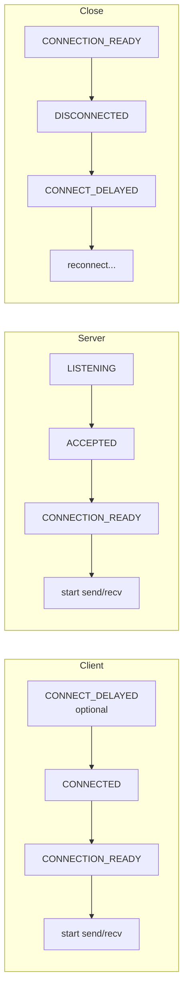
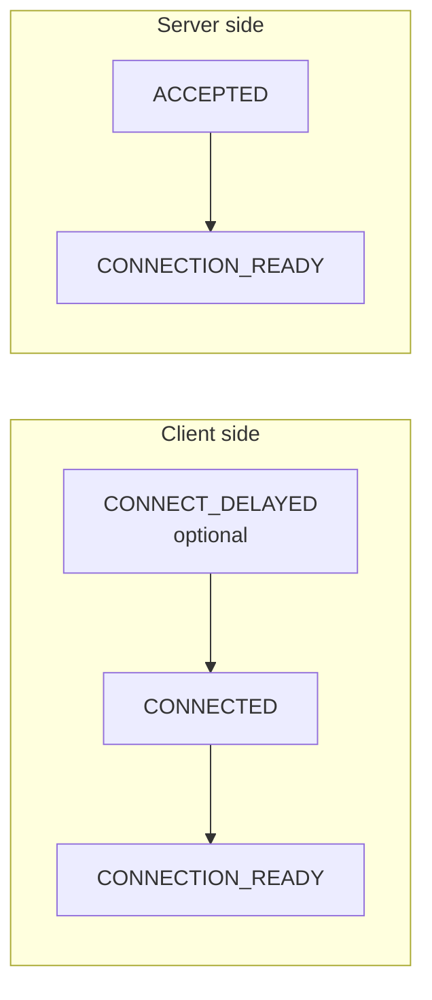
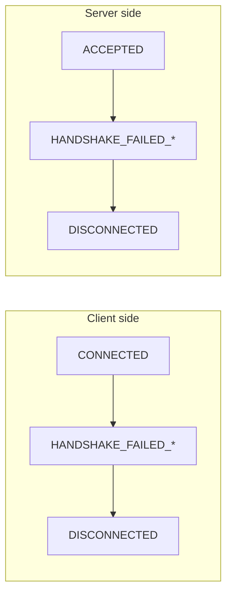
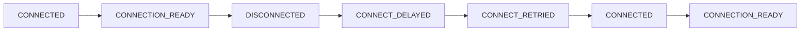

[English](06-monitoring.md) | [한국어](06-monitoring.ko.md)

# Monitoring API Usage

## 1. Overview

Monitoring enables real-time observation of socket connection state — essential for diagnosing connectivity issues, detecting peer failures, and triggering application-level recovery.

The zlink monitoring API allows real-time observation of socket events such as connection, disconnection, and handshake. Like other sockets, monitors support both recv mode (pull) and callback mode.

## 2. Enabling the Monitor

### 2.1 Callback Mode

The handler is invoked on the I/O thread immediately when an event occurs.
Callback mode is suitable for real-time processing without event loss.

```c
/* Define event handler */
void on_monitor_event(const zlink_monitor_event_t *ev, void *userdata)
{
    printf("Event: 0x%llx\n", (unsigned long long)ev->event);
    printf("Local: %s\n", ev->local_addr);
    printf("Remote: %s\n", ev->remote_addr);

    if (ev->routing_id.size > 0) {
        printf("routing_id: ");
        for (uint8_t i = 0; i < ev->routing_id.size; ++i)
            printf("%02x", ev->routing_id.data[i]);
        printf("\n");
    }
}

void *server = zlink_socket(ctx, ZLINK_SOCKET_ROUTER);
zlink_bind(server, "tcp://*:5555");

/* Create monitor with options */
zlink_socket_monitor_open_options_t opts = { .events = ZLINK_EVENT_ALL };
void *mon = zlink_socket_monitor_open(server, &opts);
zlink_socket_monitor_handler(mon, on_monitor_event, NULL);
```

Events are dispatched automatically through the `on_monitor_event` callback.

### Event Structure

```c
typedef struct {
    uint64_t event;               /* Event type */
    uint64_t value;               /* Auxiliary value (fd, errno, reason, etc.) */
    zlink_routing_id_t routing_id; /* Peer routing_id */
    char local_addr[256];         /* Local address */
    char remote_addr[256];        /* Remote address */
} zlink_monitor_event_t;
```

??? example "Full Sample Code"

    | Language | Source |
    |----------|--------|
    | C | [monitor_recv_sample.c](https://github.com/kairos-code-dev/zlink/blob/main/bindings/c/samples/monitor_recv_sample.c) |
    | C++ | [monitor_recv_sample.cpp](https://github.com/kairos-code-dev/zlink/blob/main/bindings/cpp/samples/monitor_recv_sample.cpp) |
    | Java | [MonitorRecvSample.java](https://github.com/kairos-code-dev/zlink/blob/main/bindings/java/samples/Zlink.Samples/src/main/java/dev/kairoscode/zlink/samples/MonitorRecvSample.java) |
    | Python | [monitor_recv.py](https://github.com/kairos-code-dev/zlink/blob/main/bindings/python/examples/monitor_recv.py) |
    | Node | [monitor_recv_sample.ts](https://github.com/kairos-code-dev/zlink/blob/main/bindings/node/examples/monitor_recv_sample.ts) |
    | C# | [Program.cs](https://github.com/kairos-code-dev/zlink/blob/main/bindings/dotnet/samples/MonitorRecv/Program.cs) |
    | Rust | [monitor_recv_sample.rs](https://github.com/kairos-code-dev/zlink/blob/main/bindings/rust/samples/monitor_recv_sample.rs) |
    | Go | [main.go](https://github.com/kairos-code-dev/zlink/blob/main/bindings/go/samples/monitor_recv_sample/main.go) |

## 4. Socket Monitor Events

Events observed via `zlink_socket_monitor_open()`.
These report transport/session state for raw sockets.

### Event table

| Constant | Value | Description | `value` | `routing_id` | Side | After this event |
|---|---|---|---|---|---|---|
| `CONNECTION_READY` | `0x1000` | Ready edge after handshake | reserved | peer id | Both | **start send/recv** |
| `CONNECTED` | `0x0001` | TCP connection established (pre-handshake) | provider-specific | peer id or sentinel | Client | wait for `CONNECTION_READY` |
| `ACCEPTED` | `0x0020` | Incoming connection accepted (pre-handshake) | provider-specific | peer id or sentinel | Server | wait for `CONNECTION_READY` |
| `DISCONNECTED` | `0x0200` | Session terminated | reason code | Possible | Both | trigger reconnection |
| `LISTENING` | `0x0008` | Bind succeeded, listening | fd | — | Server | — |
| `CLOSED` | `0x0080` | Intentional close completed | — | — | Both | — |
| `CONNECT_DELAYED` | `0x0002` | Async connection retry scheduled | errno | — | Client | automatic retry |
| `CONNECT_RETRIED` | `0x0004` | Async reconnection in progress | — | — | Client | automatic retry |
| `BIND_FAILED` | `0x0010` | Bind failed | errno | — | Server | check address/permissions |
| `ACCEPT_FAILED` | `0x0040` | Accept failed | errno | — | Server | check fd limits |
| `CLOSE_FAILED` | `0x0100` | Close failed | errno | — | Both | — |
| `HANDSHAKE_FAILED_NO_DETAIL` | `0x0800` | Handshake failed (generic) | errno | — | Both | check network |
| `HANDSHAKE_FAILED_PROTOCOL` | `0x2000` | Handshake failed (protocol error) | error code | — | Both | check version/config |
| `HANDSHAKE_FAILED_AUTH` | `0x4000` | Handshake failed (auth) | — | — | Both | check TLS/auth config |
| `MONITOR_STOPPED` | `0x0400` | Monitor stopped | — | — | Both | `zlink_monitor_close()` |
| `PEER_WEIGHT_CHANGED` | `0x8000` | Connected peer's weight changed | new `0..100` weight | peer id | Both | re-evaluate dispatch / dashboard |

### Connection flow



### CONNECTION_READY details

Fired after a successful handshake. Once received, messaging can start immediately.
The `value` field of `CONNECTION_READY` is reserved and must not be used
as an aggregate ready-count contract.

- `ev->routing_id` contains the peer identity on all socket types.

### DISCONNECTED reason codes

| Code | Name | Meaning |
|------|------|---------|
| 0 | `UNKNOWN` | Reason unknown |
| 3 | `HANDSHAKE_FAILED` | Handshake failure |
| 4 | `TRANSPORT_ERROR` | Transport-layer error |
| 5 | `CTX_TERM` | Context terminated |

### Protocol error codes

When `HANDSHAKE_FAILED_PROTOCOL` fires, the `value` field contains one of these codes:

| Constant | Value | Description |
|---|---|---|
| `ZLINK_PROTOCOL_ERROR_ZMP_MALFORMED_COMMAND_HELLO` | `0x10000013` | Malformed ZMP HELLO command. |

### Peer weight changes

When a peer connected to a ROUTER or DEALER changes its own weight,
`ZLINK_EVENT_PEER_WEIGHT_CHANGED` is delivered through the raw socket
monitor. The event's `routing_id` identifies the peer that changed;
`value` holds the new `0..100` weight.

```c
void on_weight(const zlink_monitor_event_t *ev, void *userdata)
{
    if (!(ev->event & ZLINK_EVENT_PEER_WEIGHT_CHANGED))
        return;

    printf("orders-exec peer weight -> %" PRIu64 "\n", ev->value);
}

void *dealer = zlink_socket(ctx, ZLINK_SOCKET_DEALER);
zlink_connect(dealer, "tcp://orders-exec-1:7100");

zlink_socket_monitor_open_options_t opts = {
    .events = ZLINK_EVENT_CONNECTION_READY
            | ZLINK_EVENT_DISCONNECTED
            | ZLINK_EVENT_PEER_WEIGHT_CHANGED,
};
void *mon = zlink_socket_monitor_open(dealer, &opts);
zlink_socket_monitor_handler(mon, on_weight, NULL);
```

DEALER automatically excludes weight-`0` peers from its candidate set, so
the application typically only needs this event to update diagnostics or
dashboards. Once every known peer is `0`, new
submits start failing with `ZLINK_SUBMIT_NOT_ADMITTED`.

If you want the service-layer view of the same change, open a service
monitor against the `Discovery` handle that manages those peers. That
monitor can emit `ZLINK_SERVICE_MONITOR_EVENT_PEER_WEIGHT_CHANGED`, and
`zlink_service_monitor_recv()` returns the changed peer endpoint,
routing id, and new weight.

## 5. Event Flow Diagrams

### Successful Connection



### Handshake Failure



### Normal Disconnection


### Reconnection



## 6. DISCONNECTED Reason Codes

The `value` field of the `DISCONNECTED` event contains the reason for disconnection.

| Code | Name | Meaning | Recommended Action |
|------|------|---------|-------------------|
| 0 | UNKNOWN | Unknown cause | Log and observe |
| 3 | HANDSHAKE_FAILED | Handshake failure | Check TLS/protocol configuration |
| 4 | TRANSPORT_ERROR | Transport layer error | Check network status |
| 5 | CTX_TERM | Context terminated | Handle shutdown |

### Reason Code Handling Example

```c
void on_monitor(const zlink_monitor_event_t *ev, void *userdata)
{
    if (ev->event == ZLINK_EVENT_DISCONNECTED) {
        switch (ev->value) {
            case ZLINK_DISCONNECT_REASON_UNKNOWN:
                printf("Unknown disconnection\n");
                break;
            case ZLINK_DISCONNECT_REASON_HANDSHAKE_FAILED:
                printf("Handshake failed -- check TLS configuration\n");
                break;
            case ZLINK_DISCONNECT_REASON_TRANSPORT_ERROR:
                printf("Transport error -- check network\n");
                break;
            case ZLINK_DISCONNECT_REASON_CTX_TERM:
                printf("Context terminated\n");
                break;
            default:
                printf("Unknown reason=%llu\n", (unsigned long long)ev->value);
                break;
        }
    }
}
```

## 7. Event Filtering and Subscription Presets

### Subscribing to Specific Events Only

```c
/* Connection/disconnection events only */
zlink_socket_monitor_open_options_t opts = {
    .events = ZLINK_EVENT_CONNECTION_READY | ZLINK_EVENT_DISCONNECTED,
};
void *mon = zlink_socket_monitor_open(server, &opts);
zlink_socket_monitor_handler(mon, on_monitor_event, NULL);
```

### Recommended Subscription Presets

| Preset | Event Mask | Purpose |
|--------|-----------|---------|
| Basic | `CONNECTION_READY \| DISCONNECTED` | Connection state tracking |
| Debug | Basic + `CONNECTED \| ACCEPTED \| CONNECT_DELAYED \| CONNECT_RETRIED` | Detailed connection process |
| Security | Basic + `HANDSHAKE_FAILED_*` | Authentication failure detection |
| Full | `ZLINK_EVENT_ALL` | All events |

### Preset Implementation Example

```c
/* Basic preset */
#define MONITOR_PRESET_BASIC \
    (ZLINK_EVENT_CONNECTION_READY | ZLINK_EVENT_DISCONNECTED)

/* Debug preset */
#define MONITOR_PRESET_DEBUG \
    (MONITOR_PRESET_BASIC | ZLINK_EVENT_CONNECTED | \
     ZLINK_EVENT_ACCEPTED | ZLINK_EVENT_CONNECT_DELAYED | \
     ZLINK_EVENT_CONNECT_RETRIED)

/* Security preset */
#define MONITOR_PRESET_SECURITY \
    (MONITOR_PRESET_BASIC | ZLINK_EVENT_HANDSHAKE_FAILED_NO_DETAIL | \
     ZLINK_EVENT_HANDSHAKE_FAILED_PROTOCOL | \
     ZLINK_EVENT_HANDSHAKE_FAILED_AUTH)

zlink_socket_monitor_open_options_t sec_opts = { .events = MONITOR_PRESET_SECURITY };
void *mon = zlink_socket_monitor_open(server, &sec_opts);
zlink_socket_monitor_handler(mon, on_monitor_event, NULL);
```

## 8. Socket Monitor Snapshot

Query the current aggregate state from a monitor handle at any time.

| Field | Description |
|-------|-------------|
| `snd_pending_msgs` | Messages pending in send queue (capped by SNDHWM) |
| `rcv_pending_msgs` | Messages pending in receive queue (capped by RCVHWM, approximate) |
| `auto_hwm_applied_sndhwm` / `auto_hwm_applied_rcvhwm` | Automatically applied HWM values on the socket |
| `auto_hwm_requested_sndbuf` / `auto_hwm_requested_rcvbuf` | Transport-buffer values requested by the automatic policy |
| `auto_hwm_auto_buffer_bytes` / `auto_hwm_manual_buffer_bytes` | Planned auto-managed buffer cost and user-managed buffer diagnostic cost |
| `auto_hwm_effective_message_bytes` | Message unit used to convert the queue budget into HWM slots |
| `auto_hwm_scope` / `auto_hwm_scope_count` | Scope used by the HWM calculation, including SPOT shared and per-spot scopes |
| `auto_hwm_total_memory_budget_bytes` and related budget fields | Current context budget split, role allocation, and scope allocation |

`snd_pending_msgs` and `rcv_pending_msgs` are directly related to HWM settings.
When these values approach the HWM, backpressure is occurring.
When automatic HWM is enabled, the same snapshot also tells you why the
current HWM was chosen through the budget fields.

**Note — pending values can exceed the HWM setting:**

1. **inproc transport**: inproc has no session/engine in between, so both
   sides' HWMs are summed. For example, if both sides have SNDHWM=1000
   and RCVHWM=1000, the actual pipe HWM is `1000 + 1000 = 2000`.
   Pending values can appear as twice the configured value.

2. **Slight HWM overshoot**: The write side's view of the read counter
   (`_peers_msgs_read`) is not real-time — it is a snapshot reported by
   the read side only when LWM is reached. Synchronizing on every message
   would eliminate the lock-free pipe's performance advantage, so batch
   notification is used instead. As a result, HWM is an **approximate
   limit**, not a hard limit, and can be slightly exceeded between
   notifications.

| transport | actual pipe HWM | reason |
|-----------|----------------|--------|
| tcp/ipc/tls/ws/wss | `SNDHWM` (as configured) | session manages each side independently |
| inproc | `SNDHWM + peer.RCVHWM` | direct connection without session; buffers summed |

```c
zlink_socket_monitor_open_options_t opts = { .events = ZLINK_EVENT_ALL };
void *monitor = zlink_socket_monitor_open(socket, &opts);
zlink_monitor_snapshot_t snapshot;
zlink_monitor_snapshot(monitor, &snapshot);
printf("sndq=%llu, rcvq=%llu\n",
       (unsigned long long) snapshot.snd_pending_msgs,
       (unsigned long long) snapshot.rcv_pending_msgs);
```

You can also combine snapshot queries inside event callbacks.

```c
void on_monitor(const zlink_monitor_event_t *ev, void *userdata)
{
    if (ev->event == ZLINK_EVENT_CONNECTION_READY) {
        zlink_monitor_snapshot_t snapshot;
        zlink_monitor_snapshot(g_monitor, &snapshot);
        printf("Monitor snapshot updated\n");
    }
}
```

## 8.1 Service Monitor

The service monitor observes state changes on service handles that still
expose a public service-monitor surface, such as Discovery. It is a
separate API from the socket monitor.

- **Event type**: `zlink_service_event_t` (different from socket monitor's `zlink_monitor_event_t`)
- **Callback type**: `zlink_service_monitor_handler_fn`
- **Open**: `zlink_service_monitor_open(target, &options)`
- **Close**: `zlink_monitor_close(&mon)` (same as socket monitor)

### Opening a service monitor

```c
/* Discovery service monitor */
zlink_service_monitor_open_options_t opts = {
    .events = ZLINK_SERVICE_MONITOR_EVENT_ERROR
              | ZLINK_SERVICE_MONITOR_EVENT_CLOSED
              | ZLINK_SERVICE_MONITOR_EVENT_DISCOVERY_PROVIDERS_CHANGED
};
void *mon = zlink_service_monitor_open(discovery, &opts);
```

Pass a service handle that supports public service monitoring.
SPOT and SpotNode do not expose a public service-monitor surface.

### Callback mode

```c
void on_service_event(const zlink_service_event_t *ev, void *userdata)
{
    if (ev->event_type & ZLINK_SERVICE_MONITOR_EVENT_DISCOVERY_PROVIDERS_CHANGED) {
        printf("provider set changed\n");
    }
    if (ev->event_type & ZLINK_SERVICE_MONITOR_EVENT_ERROR) {
        printf("service error: %d\n", ev->error_code);
    }
}

zlink_service_monitor_handler(mon, on_service_event, NULL);
```

### Recv mode

```c
zlink_service_event_t ev;
zlink_recv_result_t rc = zlink_service_monitor_recv(mon, &ev, 0);
if (rc == ZLINK_RECV_OK) {
    printf("event: 0x%x, value: %u\n", ev.event_type, ev.value);
}
```

### Service event table

Events observed via `zlink_service_monitor_open()`.
Different services emit different events.

#### Discovery events

| Constant | Description | `value` | After this event |
|---|---|---|---|
| `ZLINK_SERVICE_MONITOR_EVENT_DISCOVERY_SERVICE_UP` | discovered service came up | — | — |
| `ZLINK_SERVICE_MONITOR_EVENT_DISCOVERY_SERVICE_DOWN` | discovered service went down | — | — |
| `ZLINK_SERVICE_MONITOR_EVENT_DISCOVERY_PROVIDERS_CHANGED` | provider set changed | — | — |

#### Common events (all services)

| Constant | Description |
|---|---|
| `ZLINK_SERVICE_MONITOR_EVENT_ERROR` | error occurred |
| `ZLINK_SERVICE_MONITOR_EVENT_CLOSED` | monitor closed |

See [events.md](../spec/core/events.md) for the full event catalog.

## 9. Multi-Socket Monitoring

Handle events from multiple sockets with individual callback handlers.

```c
void on_event_a(const zlink_monitor_event_t *ev, void *userdata)
{
    printf("Socket A event: 0x%llx\n", (unsigned long long)ev->event);
}

void on_event_b(const zlink_monitor_event_t *ev, void *userdata)
{
    printf("Socket B event: 0x%llx\n", (unsigned long long)ev->event);
}

zlink_socket_monitor_open_options_t opts = { .events = ZLINK_EVENT_ALL };
void *mon_a = zlink_socket_monitor_open(sock_a, &opts);
zlink_socket_monitor_handler(mon_a, on_event_a, NULL);
void *mon_b = zlink_socket_monitor_open(sock_b, &opts);
zlink_socket_monitor_handler(mon_b, on_event_b, NULL);

/* ... application logic ... */

/* Cleanup */
zlink_monitor_close(&mon_a);
zlink_monitor_close(&mon_b);
```

## 10. Important Notes

### Monitor Thread Safety

`zlink_socket_monitor_open()` and monitor-handle close belong to the
low-frequency control-path contract of raw and service handles. That means
they may be called from application threads and remain correct when mixed with
other concurrent operations on the same handle. The monitor callback itself still runs on the
I/O path, so slow callback work should be offloaded to a user queue.

```c
/* Open a monitor from an application thread */
void *socket = zlink_socket(ctx, ZLINK_SOCKET_ROUTER);
zlink_socket_monitor_open_options_t opts = { .events = ZLINK_EVENT_ALL };
void *mon = zlink_socket_monitor_open(socket, &opts);
zlink_socket_monitor_handler(mon, on_monitor_event, NULL);

/* Snapshot reads may happen later from another worker thread */
zlink_monitor_snapshot_t snapshot;
zlink_monitor_snapshot(mon, &snapshot);
```

### Concurrent Monitor Limitation

Multiple monitors cannot be set on the same socket simultaneously.

### Callback Processing Speed

Blocking work in the callback handler can delay other I/O. For slow
processing, enqueue from the callback and handle it on your own thread.

### Monitor Shutdown Procedure

```c
/* Close the monitor handle */
zlink_monitor_close(&mon);
```

## 11. Knowing When Messaging Is Ready

When you need to know the exact moment a socket or service can send and
receive, wait for the right event.

### 11.1 Raw sockets — PAIR, DEALER, ROUTER

Ready to send/recv immediately after `CONNECTION_READY`.

```c
/* DEALER/ROUTER example */
zlink_socket_monitor_open_options_t opts = {
    .events = ZLINK_EVENT_CONNECTION_READY
};
void *mon = zlink_socket_monitor_open(router, &opts);

void on_ready(const zlink_monitor_event_t *ev, void *userdata) {
    if (ev->event & ZLINK_EVENT_CONNECTION_READY) {
        /* ROUTER: ev->routing_id contains the peer identity */
        /* routed send is possible now */
    }
}
zlink_socket_monitor_handler(mon, on_ready, NULL);
```

| Family | Wait for | Then you can |
|---|---|---|
| PAIR | `CONNECTION_READY` on both sides | bidirectional send/recv |
| DEALER | `CONNECTION_READY` | send/recv |
| ROUTER | `CONNECTION_READY` | routed send/recv using `ev->routing_id` |

### 11.2 Raw sockets — STREAM

STREAM works like ROUTER — the routing_id is assigned when the TCP
connection is established, not when the first payload arrives.
`CONNECTION_READY` fires with the routing_id before any payload
is delivered to the application. Sequence:

1. Client connects via raw TCP
2. Server receives `CONNECTION_READY` with `ev->routing_id`
3. Server can now send to the client using the routing_id
4. Client payload (if any) arrives after the ready event

```c
/* STREAM server: CONNECTION_READY → routing_id available → send/recv */
void on_ready(const zlink_monitor_event_t *ev, void *userdata) {
    if (ev->event & ZLINK_EVENT_CONNECTION_READY) {
        /* ev->routing_id contains the peer's routing_id */
        /* send to this peer immediately, or wait for inbound payload */
    }
}

zlink_socket_monitor_open_options_t opts = {
    .events = ZLINK_EVENT_CONNECTION_READY
};
void *mon = zlink_socket_monitor_open(stream_server, &opts);
zlink_socket_monitor_handler(mon, on_ready, NULL);
```

| Family | Wait for | Then you can |
|---|---|---|
| STREAM | `CONNECTION_READY` | send/recv using `ev->routing_id` |

### 11.3 Raw sockets — PUB/SUB

For internal perf on raw PUB/SUB, use `CONNECTION_READY` for each
expected client before messaging. Perf does not use delivery-ready
monitor events.

```c
zlink_set_subscription(sub, "topic");

/* SUB/PUB perf gate: wait for connection-ready */
zlink_socket_monitor_open_options_t sub_opts = {
    .events = ZLINK_EVENT_CONNECTION_READY
};
void *sub_mon = zlink_socket_monitor_open(sub, &sub_opts);

zlink_socket_monitor_open_options_t pub_opts = {
    .events = ZLINK_EVENT_CONNECTION_READY
};
void *pub_mon = zlink_socket_monitor_open(pub, &pub_opts);

/* Start after expected clients are connection-ready */
zlink_publish(pub, NULL, &part, 1, 0);  /* raw PUB: topic_id is NULL */
zlink_subscribe(sub, &source_rid, &parts, &count, topic_buf, &topic_len, 0);

zlink_monitor_close(&pub_mon);
zlink_monitor_close(&sub_mon);
```

| Family | Wait for | Then you can |
|---|---|---|
| PUB | `CONNECTION_READY` + expected client counting | `zlink_publish()` delivery |
| SUB | `CONNECTION_READY` + expected client counting | `zlink_subscribe()` recv |

### 11.4 Services — SPOT

SPOT does not expose a public service-monitor surface. For internal
perf on SPOT, use an explicit benchmark control barrier instead of
monitor events.

```c
/* SPOT perf gate: explicit READY/START barrier */
send_control_ready(client_id);
wait_ready_count(expected_clients);
broadcast_control_start();
```

| Service | Wait for | Then you can |
|---|---|---|
| SPOT sub | explicit `READY/START` barrier | start receiving via `zlink_subscribe()` |
| SPOT pub | explicit `READY/START` barrier | start delivering via `zlink_publish()` |

### 11.5 Snapshots

`zlink_monitor_snapshot()` and `zlink_*_status_snapshot()` return
a point-in-time view of the current state. Use them for dashboards,
health checks, and debugging.

```c
/* Check current registry health */
zlink_registry_status_t status;
zlink_registry_status_snapshot(registry, &status);
printf("state=%d\n", status.state);
```

---
[← TLS Security](05-tls-security.md) | [Services Overview →](07-0-services.md)
