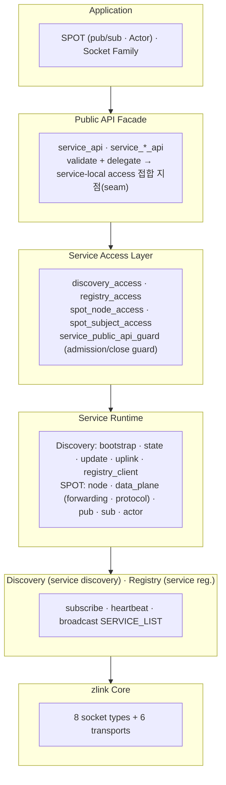
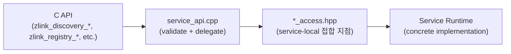
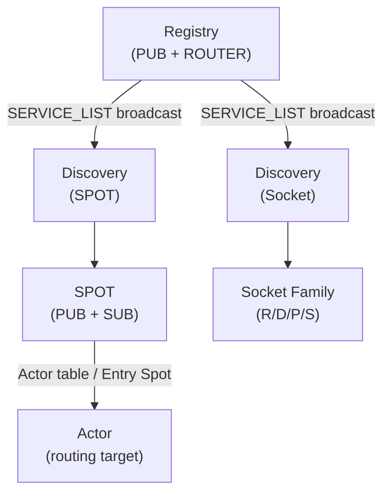

[English](./07-0-services.md) | [한국어](./07-0-services.ko.md)

<!-- zlink-nav:start -->
[← 모니터링](./06-monitoring.ko.md) | [Discovery →](./07-1-discovery.ko.md)
<!-- zlink-nav:end -->

# 서비스 계층 개요

## 1. 서비스 계층이란

서비스 계층이 없으면 애플리케이션이 소켓 연결을 직접 관리하고 피어 주소를 추적하며 서비스 수명주기까지 처리해야 한다. 서비스 계층은 이런 작업을 자동화한다.

zlink의 서비스 계층은 8종 소켓(PAIR, PUB/SUB, XPUB/XSUB, DEALER/ROUTER, STREAM)
위에 구축된 **고수준 분산 서비스 기능**이다.
소켓 수준의 연결과 라우팅을 직접 다루지 않고도
서비스 등록, 발견, 위치투명 통신을 수행한다.

### 1.1 왜 한 라이브러리에 메시징과 서비스 계층이 함께 있나

zlink는 두 가지 흔히 따로 풀던 문제를 **하나의 스택**으로 합친다.

- **서버 간 메시징** — 소켓 패턴(요청/응답, fan-out, 라우팅). 보통 RPC 프레임워크 +
  서비스 메시 + 외부 디스커버리로 푼다.
- **실시간 상태 서버** — 게임 룸·채팅방·존(zone)·심볼 오더북처럼 동적으로 생겼다
  사라지는 상태 단위. 보통 직접 만든 룸 서버 + 세션 위치 저장소 + 이벤트 fan-out
  브로커를 조합해 푼다.

서비스 계층은 두 번째 세계를 라이브러리로 흡수한다. 그래서 raw 소켓(메시징)과
SPOT·Actor(실시간 상태)가 같은 라이브러리 안에 있다.

### 1.2 멘탈 모델 — 어느 층을 언제 쓰나

| 층 | 무엇을 하나 | 해결하는 질문 | 전형적 용도 |
|----|-------------|---------------|-------------|
| **raw 소켓** (PAIR/PUB·SUB/DEALER·ROUTER/STREAM) | 주소를 아는 지점 간 메시징 | "어디로 보낼까" | 마이크로서비스 RPC, 이벤트 버스, 외부 client |
| **Discovery / Registry** | 이름으로 피어를 찾아 자동 연결 | "그게 지금 어디 떠 있나" | 동적·가변 토폴로지 |
| **SPOT** | 동적 상태 단위 + **단일 실행 큐로 lock 없는 직렬 처리** | "상태를 어떻게 안전하게 다루나" | 게임 룸·존, 채팅방, 심볼 오더북 |
| **Actor** | 세션↔처리 단위 binding + **위치 투명·재접속 이전성** | "이 메시지가 누구 것이고, 끊겨도 이어지나" | 플레이어, 세션, 대화(conversation) |

핵심 구분:

- **상태는 여전히 응용이 소유한다.** zlink는 데이터 저장소가 아니다. SPOT이 주는 것은
  상태 저장이 아니라 **그 상태에 닿는 메시지를 한 줄로 직렬 처리**하는 실행 모델이다.
  덕분에 룸 상태를 lock으로 보호하는 대신 동시성 문제 자체가 사라진다.
- **Actor는 raw 소켓의 대안이 아니라 SPOT 위의 한 단계 더 높은 모델이다.** Actor
  메시지도 결국 SPOT routed 평면 위로 흐른다([07-4](./07-4-actor.ko.md)). Actor는
  "그 SPOT에 도착한 메시지를 어느 세션/엔티티에게 줄지" 구분하고, 세션이 어느 서버에
  붙어 있든 같은 엔티티로 이어 주는 역할을 한다.
- **순수 토픽 pub/sub과 SPOT 토픽의 차이**: raw PUB/SUB는 토픽이 정적이고 발행자
  주소를 알아야 한다. SPOT 토픽은 방(room)이 런타임에 생기고 Discovery로 찾아지므로,
  "동적으로 생겼다 사라지는 작은 주제별 pub/sub"(예: 채팅방)에 맞는다.

> 모노리스나 단일 프로세스로 충분하면 서비스 계층을 먼저 넣지 않는다. 여러
> 프로세스/서버로 나뉘어야 하는 이유가 생겼을 때, 그 사이의 연결·라우팅·상태
> 직렬 처리 복잡도를 줄이는 도구다.

## 2. 아키텍처



- **Public API Facade**는 C API 진입점으로, 핸들 유효성을 검사한 뒤 service-local 접합 지점으로 위임한다. 개별 서비스 구현 세부를 직접 알 필요가 없다.
- **Service Access Layer**는 각 서비스가 제공하는 service-local 접합 지점이다. `*_access.hpp`가 API 계층과 service runtime 사이의 계약을 정의한다.
- **Service Runtime**은 각 서비스의 내부 구현이다. SPOT은 node/data_plane(forwarding/protocol)/pub/sub으로 모듈화되어 있다.
- **Registry**는 서비스 엔트리를 관리하고 주기적으로 SERVICE_LIST를 브로드캐스트한다.
- **Discovery**는 Registry를 구독해 서비스 목록을 로컬 캐시로 유지한다.
- **SPOT**은 Discovery로 대상을 자동 발견하고 연결한다.

## 서비스 명칭

| 서비스 | 명칭 의미 | 한줄 설명 |
|--------|-----------|-----------|
| **Registry** | 서비스 등록소 | 서비스 엔트리를 등록·관리하는 중앙 저장소 |
| **Discovery** | 서비스 발견 | Registry를 구독하여 서비스 목록을 로컬 캐시로 유지 |
| **SPOT** | 동적 상태 단위 | 위치투명 토픽 pub/sub + 라우팅. 상태 단위마다 단일 실행 큐로 lock 없이 직렬 처리 |
| **Actor** | 세션↔처리 단위 binding | STREAM 세션 메시지를 Spot 디스패치 컨텍스트로 모으는 SPOT 내부 단위. 세션 위치와 무관하게 같은 엔티티로 이어 줌(재접속 이전성) |

## 3. 서비스 구성 요소

### 3.1 Service Discovery — 기반 인프라

Registry 클러스터 기반의 서비스 등록·발견 시스템이다. 서비스가 Registry에 등록하면 Discovery가 이를 구독해 서비스 목록을 관리한다.

- Registry 클러스터 HA (플러딩(flooding, 전체 브로드캐스트 전파) 동기화)
- Heartbeat 기반 생존 확인
- Client-side 서비스 목록 캐싱
- 내부 모듈:
  - `discovery_access` (API 접합 지점)
  - `discovery_bootstrap` · `discovery_state`
  - `discovery_update` · `discovery_uplink`
  - `discovery_registry_client`

자세한 내용은 [Service Discovery 가이드](./07-1-discovery.ko.md) 및
[Registry 가이드](./07-4-registry.ko.md)를 참고.

### 3.2 SPOT — channel 기반 routed + PUB/SUB 허브

`SpotNode`는 SPOT 토폴로지의 핵심 런타임이다. 하나의 SPOT channel Discovery
view를 연결해 같은 channel의 다른 `SpotNode`와 mesh를 구성하고, 다른
channel을 호출해야 할 때는 `DEALER`를 별도로 등록한다. 그 위에 공개
`Spot` 파사드 하나가 올라가 channel send/request, 피어 라우팅 통신,
publish/subscribe를 함께 수행한다.

- SPOT mesh: `zlink_spot_node_attach_discovery()` — SPOT channel view를
  가진 Discovery 하나를 연결하면 같은 channel의 다른 `SpotNode`와 자동 연결된다
- channel 호출용 DEALER:
  `zlink_spot_node_attach_channel_dealer()` (자동 연결) /
  `zlink_spot_node_attach_channel_dealer_manual()` (수동 연결) —
  다른 channel의 `ROUTER(server)` 집합에 요청을 보내는 `DEALER` 등록
- 외부 publish ingress: `zlink_spot_node_attach_pub_ingress()` —
  일반 `PUB`에서 SPOT topic plane으로 publish를 넣는 전용 입력 경로
- data plane:
  `zlink_spot_send_channel()` / `zlink_spot_request_channel()` /
  `zlink_spot_publish()` / `zlink_spot_subscribe()` /
  `zlink_spot_recv_subscription_event()`
- readable 알림은 한 콜백 surface로 통합:
  `zlink_spot_dispatch_event_handler()`
- 모니터링은 snapshot/query API로 관찰
- **Thread-safe** — 하나의 `spot` / `spot_node` 핸들에서 여러 스레드가
  operational API를 동시에 호출할 수 있다

- **Actor**: STREAM 세션 메시지를 Spot 디스패치 컨텍스트로 모으는 SPOT 내부 라우팅 대상이다.
  `SpotNode`가 Actor 테이블을 소유하고, 새로 생성된 Actor는 `Entry Spot`에서 디스패치된다.
  Actor는 `zlink_spot_node_actor_join_spot()`으로 다른 `Spot`으로 이동하며, 명시적
  `zlink_spot_node_actor_leave_spot()` 호출로만 `Entry Spot`으로 복귀한다. STREAM 세션
  bind/unbind는 독립적이며 Actor가 join한 Spot을 바꾸지 않는다. Actor는 소켓이나
  inproc(프로세스 내부) 엔드포인트를 소유하지 않고 `zlink_actor_ref_t`로 식별한다.

자세한 내용은 [SPOT 가이드](./07-3-spot.ko.md)와 [SPOT Actor 가이드](./07-4-actor.ko.md)를 참고.

### 3.3 소켓 패밀리 — Discovery 관리 raw 소켓

raw ROUTER/DEALER/PUB/SUB 소켓을 Discovery 인스턴스(자동 연결 타입
`ZLINK_AUTO_CONNECT_CLIENT_SERVER`)에 연결하면 자동 피어 발견과 lifecycle
관리를 맡길 수 있다. SPOT 추상화 없이 소켓 수준에서 위치투명 통신을
제공한다.

- Discovery로 자동 엔드포인트 등록 및 heartbeat
- 역할 기반 피어 매칭 (PUB↔SUB, ROUTER↔DEALER)
- Lifecycle 위임 — Discovery가 연결된 소켓을 소유
- 내부 모듈: `socket_discovery_attachment` (소켓 측 통합) · `discovery_owned_service` (등록 편의 API)

자세한 내용은 [Service Discovery 가이드](./07-1-discovery.ko.md)를 참고.

### 3.4 Registry — 중앙 서비스 등록소

서비스 엔트리를 등록하고 관리하는 중앙 저장소다. SPOT 노드와 소켓 패밀리의 등록, 하트비트, 토폴로지 브로드캐스트를 담당한다.

- 내부 모듈: `registry_access` (API 접합 지점) · `registry_query_access` (원격 조회 접합 지점)

자세한 내용은 [Registry 가이드](./07-4-registry.ko.md)를 참고.

## 4. Service Access Layer 패턴

모든 서비스는 공통된 access layer 패턴을 따른다.



| 서비스 | Access 접합 지점 | 역할 |
|--------|-------------|------|
| Discovery | `discovery_access_t` | lifecycle, connect_registry, option, monitor |
| Registry | `registry_access_t` | lifecycle, bind, config, snapshot/query |
| Registry Query | `registry_query_access_t` | 원격 topology query |
| SPOT Node | `spot_node_access_t` | lifecycle, bind, peer connect, discovery attach |
| SPOT Subject | `spot_subject_access_t` | publish, subscribe, option, handler, monitor |

각 access 접합 지점은 `service_public_api_guard_t`와 통합되어 콜백 모드 추적과
수명주기 게이트(destroy 시 `EBUSY`/`ESHUTDOWN` 계약)를 제공한다.

이 구조 덕분에 API 계층은 개별 서비스 구현을 직접 알 필요가 없고,
새 서비스를 추가할 때는 `api/service_*_api.cpp`, 해당 `*_access` 파일,
해당 서비스 구현 파일만 수정하면 된다.

## 4.1 점검을 위한 graceful maintenance (가중치)

운영 환경에서 SPOT Node나 raw ROUTER를 잠시 내려야 할 때는, 연결을 즉시
끊는 대신 graceful drain을 권장한다. raw ROUTER나 worker auto-connect 피어는
소켓 가중치를 `0`으로 바꾸면 "이미 들어온 작업은 마무리하고 새 요청은 받지
않는" 단계를 거친다. 가중치가 `0`인 raw 피어는 피어가 새 outbound 후보에서
자동으로 제외한다. SpotNode와 Spot은 별도의 가중치 설정을 제공하지 않는다.

권장 절차:

1. 핸들 전용 가중치 옵션을 `0`으로 설정한다.
2. 연결된 피어가 자신의 가중치 캐시를 갱신할 시간을 둔다. 이 갱신은
   소켓 모니터의 `ZLINK_EVENT_PEER_WEIGHT_CHANGED`로 확인할 수 있다.
   서비스 계층 관점이 필요하면 같은 피어를 관리하는 `Discovery`
   핸들에서 `ZLINK_SOCKET_MONITOR_EVENT_PEER_WEIGHT_CHANGED`를
   관찰한다.
3. 진행 중인 reply가 완료될 때까지 기다린다. 운영 시 이 시간은 보통 SLA를
   기준으로 설정한다.
4. 노드를 재시작하거나 교체한 뒤 양수 가중치로 다시 서비스에 합류시킨다.

```c
int drain_weight = 0;
zlink_set_router_option(
    orders_exec_router, ZLINK_ROUTER_OPT_WEIGHT,
    &drain_weight, sizeof(drain_weight));

/* 2) Wait for in-flight requests to complete (e.g. SLA + small margin)
      while peers re-route new work to other orders-exec nodes. */
sleep_seconds(60);

/* 3) Restart or replace this node ... */

/* 4) Rejoin the service */
int serve_weight = 100;
zlink_set_router_option(
    orders_exec_router, ZLINK_ROUTER_OPT_WEIGHT,
    &serve_weight, sizeof(serve_weight));
```

가중치가 `0`인 상태에서도 로컬 노드는 평소처럼 recv/send/reply/핸들러를
처리한다. 가중치는 "피어가 나를 새 작업 대상으로 선택하지 않게" 하는
신호이지, 로컬 동작을 강제로 멈추는 신호가 아니다. 피어 쪽의 새
submit이 가중치 `0`을 만나면 `ZLINK_SUBMIT_NOT_ADMITTED`로 거절되며,
연결 자체는 유지되므로 다시 양수 가중치가 되면 자동으로 후보로
돌아간다.

## 5. 서비스 간 관계



- **Discovery가 기반 인프라**: SPOT과 소켓 패밀리 모두 Discovery로 대상을 발견한다.
- **SPOT**은 PUB/SUB 패턴으로 토픽 메시지를 전파하고 routed 통신을 제공한다.
- **Actor**는 SPOT 안에서 동작하는 세션 기반 라우팅 대상이다. STREAM 세션 메시지를 Spot 디스패치 컨텍스트로 모으며, 별도 서비스가 아니라 `SpotNode`가 관리하는 내부 주소 지정 단위다.
- **소켓 패밀리**는 raw ROUTER/DEALER/PUB/SUB 소켓이 Discovery로 피어를 등록하고 발견해 소켓 수준의 위치투명 통신을 제공한다.
- 모든 서비스는 독립적으로 동작하며, 동일한 Registry 클러스터를 공유할 수 있다.

---
<!-- zlink-nav:bottom:start -->
[← 모니터링](./06-monitoring.ko.md) | [Discovery →](./07-1-discovery.ko.md)
<!-- zlink-nav:bottom:end -->
