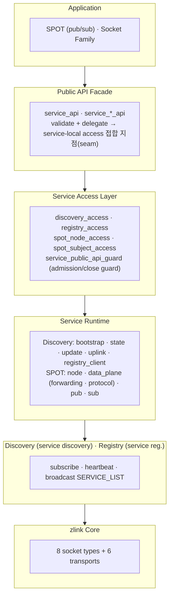
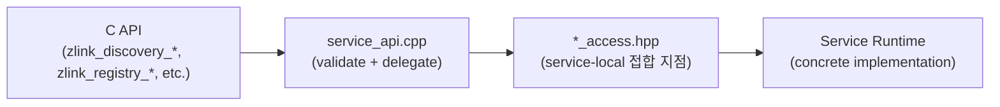
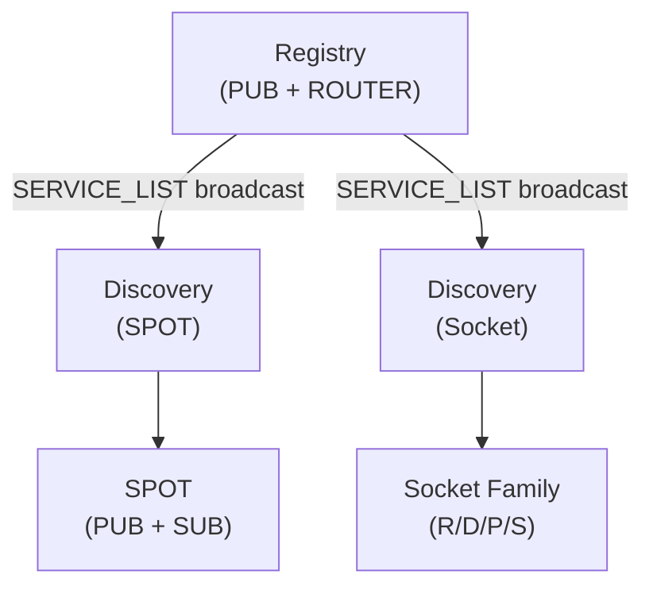

[English](07-0-services.md) | [한국어](07-0-services.ko.md)

# 서비스 계층 개요

## 1. 서비스 계층이란

서비스 계층이 없으면 애플리케이션은 소켓 연결을 직접 관리하고, 피어 주소를 추적하며, 서비스 수명주기를 처리해야 한다. 서비스 계층은 이러한 작업을 자동화한다.

zlink의 서비스 계층은 8종 소켓(PAIR, PUB/SUB, XPUB/XSUB, DEALER/ROUTER, STREAM)
위에 구축된 **고수준 분산 서비스 기능**이다.
소켓 수준의 연결/라우팅을 직접 다루지 않고도
서비스 등록, 발견, 위치투명 통신을 수행할 수 있다.

## 2. 아키텍처



- **Public API Facade**는 C API 진입점으로, handle validation 후 service-local access 접합 지점으로 위임한다. concrete service 세부를 직접 알지 않는다.
- **Service Access Layer**는 각 서비스가 제공하는 service-local 접합 지점이다. `*_access.hpp`가 API 계층과 service runtime 사이의 계약을 정의한다.
- **Service Runtime**은 각 서비스의 내부 구현이다. SPOT은 node/data_plane(forwarding/protocol)/pub/sub으로 모듈화되어 있다.
- **Registry**는 서비스 엔트리를 관리하고, 주기적으로 SERVICE_LIST를 브로드캐스트한다.
- **Discovery**는 Registry를 구독하여 서비스 목록을 로컬 캐시로 유지한다.
- **SPOT**은 Discovery를 통해 대상을 자동 발견하고 연결한다.

## 서비스 명칭

| 서비스 | 명칭 의미 | 한줄 설명 |
|--------|-----------|-----------|
| **Registry** | 서비스 등록소 | 서비스 엔트리를 등록·관리하는 중앙 저장소 |
| **Discovery** | 서비스 발견 | Registry를 구독하여 서비스 목록을 로컬 캐시로 유지 |
| **SPOT** | 위치 투명 pub/sub | 위치투명 토픽 기반 발행/구독 메시 |

## 3. 서비스 구성 요소

### 3.1 Service Discovery — 기반 인프라

Registry 클러스터 기반의 서비스 등록/발견 시스템. 서비스가 Registry에 등록하면 Discovery가 이를 구독하여 서비스 목록을 관리한다.

- Registry 클러스터 HA (플러딩(flooding, 전체 브로드캐스트 전파) 동기화)
- Heartbeat 기반 생존 확인
- Client-side 서비스 목록 캐싱
- 내부 모듈:
  - `discovery_access` (API 접합 지점)
  - `discovery_bootstrap` · `discovery_state`
  - `discovery_update` · `discovery_uplink`
  - `discovery_registry_client`

자세한 내용은 [Service Discovery 가이드](07-1-discovery.ko.md) 및
[Registry 가이드](07-4-registry.ko.md)를 참고.

### 3.2 SPOT — service 중심 routed + PUB/SUB 허브

`SpotNode`는 service attachment table을 소유하는 허브다. 각 엔트리는
`service_name`마다 ROUTER 집합과 선택적 PUB/SUB 쌍을 담는다. 그 위에 공개
`Spot` facade 하나가 올라가 서비스별 routed send/request와 publish/subscribe
를 함께 수행한다.

- 수동 attach: `zlink_spot_node_attach_router()` /
  `zlink_spot_node_attach_pubsub()` (PUB+SUB는 한 쌍으로만 등록 가능)
- 자동 attach: `zlink_spot_node_attach_discovery()` — `service_name`별로
  서로 다른 Discovery를 여러 개 붙일 수 있고, pub/sub 짝 검증을 함께 수행
- service-aware data plane:
  `zlink_spot_send_service()` / `zlink_spot_request_service()` /
  `zlink_spot_publish()` / `zlink_spot_subscribe()` /
  `zlink_spot_subscription_event()`
- readable 알림은 한 콜백 surface로 통합:
  `zlink_spot_dispatch_event_handler()`
- service-aware 모니터링은 `zlink_spot_node_monitor_recv()`로만 drain하며
  Spot dispatch plane에 섞이지 않음
- **Thread-safe** — 하나의 `spot` / `spot_node` handle에서 여러 스레드가
  operational API를 동시에 호출 가능

자세한 내용은 [SPOT 가이드](07-3-spot.ko.md)를 참고.

### 3.3 소켓 패밀리 — Discovery 관리 raw 소켓

raw ROUTER/DEALER/PUB/SUB 소켓을 Discovery 인스턴스(서비스 타입
`ZLINK_SERVICE_TYPE_SOCKET`)에 연결하여 자동 피어 발견과 lifecycle
관리를 할 수 있다. SPOT 추상화 없이 소켓 수준에서 위치투명 통신을
제공한다.

- Discovery를 통한 자동 엔드포인트 등록 및 heartbeat
- 역할 기반 피어 매칭 (PUB↔SUB, ROUTER↔DEALER)
- Lifecycle 위임 — Discovery가 연결된 소켓을 소유
- 내부 모듈: `socket_discovery_attachment` (소켓 측 통합) · `discovery_owned_service` (등록 편의 API)

자세한 내용은 [Service Discovery 가이드](07-1-discovery.ko.md)를 참고.

### 3.4 Registry — 중앙 서비스 등록소

서비스 엔트리를 등록·관리하는 중앙 저장소. SPOT 노드/소켓 패밀리의 등록, 하트비트, 토폴로지 브로드캐스트를 담당한다.

- 내부 모듈: `registry_access` (API 접합 지점) · `registry_query_access` (원격 조회 접합 지점)

자세한 내용은 [Registry 가이드](07-4-registry.ko.md)를 참고.

## 4. Service Access Layer 패턴

모든 서비스는 공통된 access layer 패턴을 따른다.



| 서비스 | Access 접합 지점 | 역할 |
|--------|-------------|------|
| Discovery | `discovery_access_t` | lifecycle, connect_registry, option, monitor |
| Registry | `registry_access_t` | lifecycle, bind, config, snapshot/query |
| Registry Query | `registry_query_access_t` | 원격 topology query |
| SPOT Node | `spot_node_access_t` | lifecycle, bind, peer connect, discovery attach |
| SPOT Subject | `spot_subject_access_t` | publish, subscribe, option, handler, monitor |

각 access 접합 지점은 `service_public_api_guard_t`와 통합되어 콜백(callback) 모드 추적과
lifecycle gate(destroy 시 `EBUSY`/`ESHUTDOWN` 계약)를 제공한다.

이 구조 덕분에 API 계층은 concrete service 구현을 직접 알지 않고,
service 추가 시 `api/service_*_api.cpp`, 해당 `*_access` 파일,
해당 service 구현 파일만 수정하면 된다.

## 4.1 점검을 위한 graceful maintenance (admission state)

운영 환경에서 SPOT Node나 raw ROUTER를 잠시 내려야 할 때, 연결을 즉시
끊는 대신 admission state로 "이미 들어온 작업은 마무리하고, 새 요청은
받지 않는" 단계를 거치는 것을 권장한다. peer가 `DRAINING` 상태의 노드를
새 outbound 후보에서 자동으로 제외해 준다.

권장 절차:

1. `zlink_set_admission_state(handle, ZLINK_ADMISSION_DRAINING)` 호출.
2. 연결된 peer가 자신의 admission cache를 갱신할 시간을 둔다. 이 갱신은
   socket monitor의 `ZLINK_EVENT_PEER_ADMISSION_CHANGED` 또는 service
   monitor의 `ZLINK_SERVICE_MONITOR_EVENT_PEER_ADMISSION_CHANGED`로
   관찰할 수 있다.
3. 진행 중인 reply가 빠질 때까지 기다린다. 운영 시 이 시간은 보통 SLA
   기반으로 설정한다.
4. 노드를 재시작/교체한 뒤,
   `zlink_set_admission_state(handle, ZLINK_ADMISSION_SERVING)`로 다시
   서비스에 합류시킨다.

```c
/* 1) Drain orders-exec-1 before maintenance */
zlink_set_admission_state(orders_exec_node, ZLINK_ADMISSION_DRAINING);

/* 2) Wait for in-flight requests to complete (e.g. SLA + small margin)
      while peers re-route new work to other orders-exec nodes. */
sleep_seconds(60);

/* 3) Restart or replace this node ... */

/* 4) Rejoin the service */
zlink_set_admission_state(orders_exec_node, ZLINK_ADMISSION_SERVING);
```

`DRAINING` 상태에서도 로컬 노드는 평소처럼 recv/send/reply/handler를
처리한다. admission state는 "남이 나를 새 작업 대상으로 고르지 않게"
하는 신호이지, 로컬 동작을 강제로 멈추는 신호가 아니다. peer 쪽의 새
submit이 `DRAINING` 상태를 만나면 `ZLINK_SUBMIT_NOT_ADMITTED`로 거절되며,
연결 자체가 끊긴 것은 아니므로 다시 `SERVING`이 되면 자동으로 후보로
돌아간다.

## 5. 서비스 간 관계



- **Discovery가 기반 인프라**: SPOT, 소켓 패밀리 모두 Discovery를 통해 대상을 발견한다.
- **SPOT**은 PUB/SUB 패턴으로 토픽 메시지를 전파한다.
- **소켓 패밀리**는 raw ROUTER/DEALER/PUB/SUB 소켓이 Discovery를 통해 피어를 등록·발견하여 소켓 수준의 위치투명 통신을 제공한다.
- 모든 서비스는 독립적으로 동작하며, 동일한 Registry 클러스터를 공유할 수 있다.

---
[← 모니터링](06-monitoring.ko.md) | [Discovery →](07-1-discovery.ko.md)
