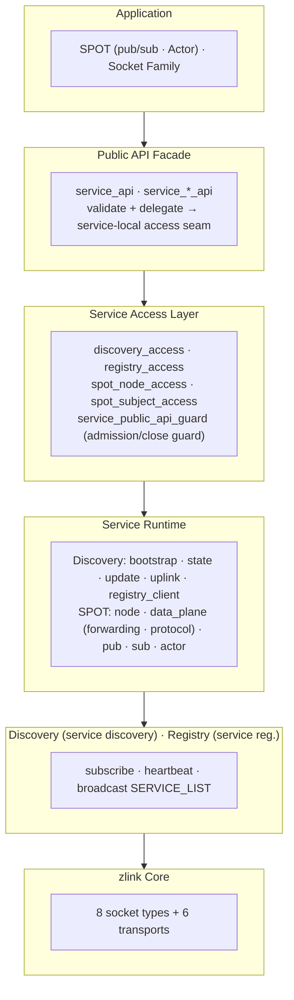
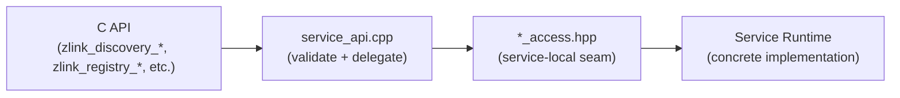
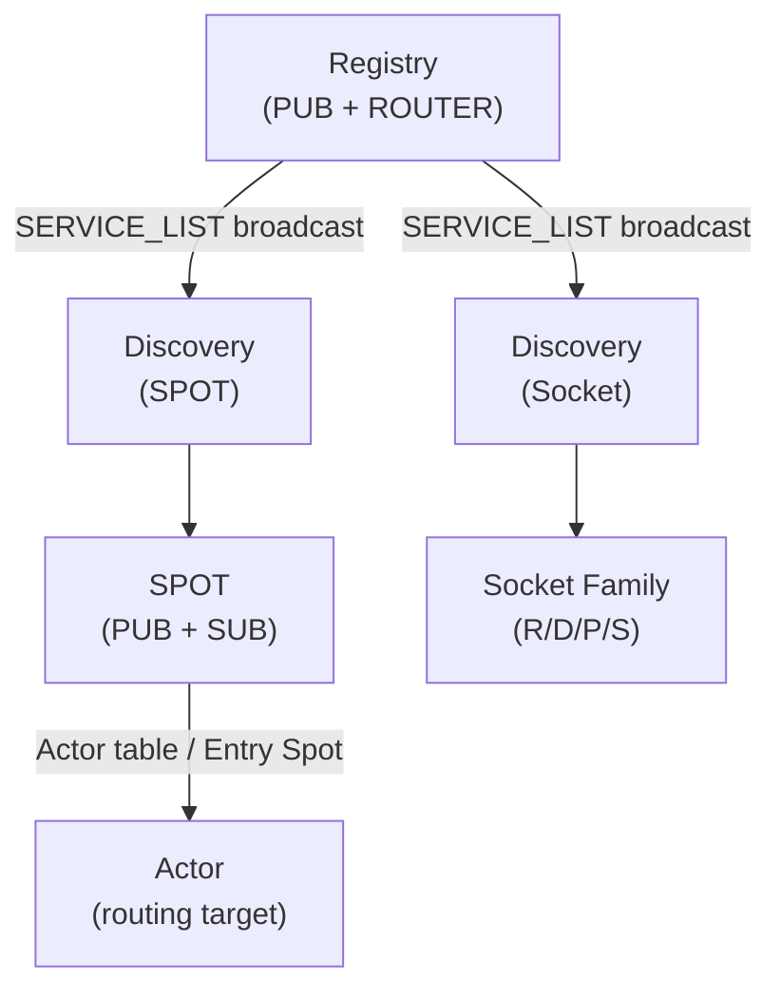

[English](./07-0-services.md) | [한국어](./07-0-services.ko.md)

<!-- zlink-nav:start -->
[← Monitoring](./06-monitoring.md) | [Discovery →](./07-1-discovery.md)
<!-- zlink-nav:end -->

# Service Layer Overview

## 1. What is the Service Layer

Without the service layer, applications would need to manually manage socket connections, track peer addresses, and handle service lifecycle. The service layer automates these tasks.

The zlink service layer is a set of **high-level distributed service features** built on top of the 8 socket types (PAIR, PUB/SUB, XPUB/XSUB, DEALER/ROUTER, STREAM). It enables service registration, discovery, and location-transparent communication without directly managing socket-level connections and routing.

## 2. Architecture



- **Public API Facade** is the C API entry point that validates handles and delegates to service-local access seams. It does not know concrete service details.
- **Service Access Layer** is the service-local seam provided by each service. `*_access.hpp` defines the contract between the API layer and service runtime.
- **Service Runtime** is the concrete implementation of each service. SPOT is modularized into node/data_plane(forwarding/protocol)/pub/sub.
- **Registry** manages service entries and periodically broadcasts the SERVICE_LIST.
- **Discovery** subscribes to the Registry and maintains a local cache of the service list.
- **SPOT** automatically discovers and connects to targets through Discovery.

## Service Terminology

| Service | Name Origin | One-Line Description |
|---------|-------------|---------------------|
| **Registry** | Service registry | Central store that registers and manages service entries |
| **Discovery** | Service discovery | Subscribes to the Registry and maintains a local cache of the service list |
| **SPOT** | Location (spot) transparent pub/sub | Object-level, location-transparent, topic-based publish/subscribe mesh |
| **Actor** | SPOT session routing target | Session-based addressing unit inside SPOT that funnels STREAM session messages into a Spot dispatch context |

## 3. Service Components

### 3.1 Service Discovery -- Foundation Infrastructure

A service registration/discovery system based on a Registry cluster. When a service registers with the Registry, Discovery subscribes to it and manages the service list.

- Registry cluster HA (flooding synchronization)
- Heartbeat-based liveness checking
- Client-side service list caching
- Internal modules: `discovery_access` (API seam) · `discovery_bootstrap` · `discovery_state` · `discovery_update` · `discovery_uplink` · `discovery_registry_client`

See the [Service Discovery Guide](./07-1-discovery.md) and the [Registry Guide](./07-4-registry.md) for details.

### 3.2 SPOT -- Channel-Based Routed + PUB/SUB Hub

A `SpotNode` is the core runtime of the SPOT topology. It attaches one SPOT
channel Discovery view to form a mesh with other `SpotNode` peers in the same
channel, and attaches `DEALER` sockets separately when it needs to call other
channels. A single public `Spot` facade sits on top of the node and drives
channel send/request, peer routed communication, and publish/subscribe.

- SPOT mesh: `zlink_spot_node_attach_discovery()` attaches one Discovery
  with a SPOT channel view; peers in the same channel auto-connect.
- Channel-call dealers:
  `zlink_spot_node_attach_channel_dealer()` (automatic) /
  `zlink_spot_node_attach_channel_dealer_manual()` (manual) register a
  `DEALER` that sends requests to a channel's `ROUTER(server)` set.
- External publish ingress: `zlink_spot_node_attach_pub_ingress()` feeds
  an external `PUB` into the SPOT topic plane.
- Data plane:
  `zlink_spot_send_channel()` / `zlink_spot_request_channel()` /
  `zlink_spot_publish()` / `zlink_spot_subscribe()` /
  `zlink_spot_recv_subscription_event()`.
- Readable notifications share one callback surface:
  `zlink_spot_dispatch_event_handler()`.
- Monitoring uses snapshot/query APIs.
- **Thread-safe** -- a single `spot` / `spot_node` handle admits concurrent
  operational API calls from multiple threads.

- **Actor**: Session-based routing target inside SPOT. Funnels STREAM session
  messages into a `Spot` dispatch context. `SpotNode` owns the Actor table;
  newly created Actors start in the `Entry Spot`. Actors move to user Spots
  via `zlink_spot_node_actor_join_spot()` and return to `Entry Spot` only on an
  explicit `zlink_spot_node_actor_leave_spot()`; STREAM session bind/unbind is
  independent and does not change the joined Spot. Actors own no socket or inproc endpoint; they are
  identified by `zlink_actor_ref_t`.

See the [SPOT Guide](./07-3-spot.md) and [SPOT Actor Guide](./07-4-actor.md) for details.

### 3.3 Socket Family -- Discovery-Managed Raw Sockets

Raw ROUTER/DEALER/PUB/SUB sockets can attach to a Discovery instance
(auto-connect type `ZLINK_AUTO_CONNECT_CLIENT_SERVER`) for automatic peer discovery
and lifecycle management. This provides location-transparent communication
at the socket level without the SPOT abstraction.

- Automatic endpoint registration and heartbeat via Discovery
- Role-based peer matching (PUB↔SUB, ROUTER↔DEALER)
- Lifecycle delegation -- Discovery owns the attached socket
- Internal modules: `socket_discovery_attachment` (socket-side integration) · `discovery_owned_service` (registration convenience API)

See the [Service Discovery Guide](./07-1-discovery.md) for details.

### 3.4 Registry -- Central Service Registry

Central store that registers and manages service entries. Handles SPOT node/socket family registration, heartbeats, and topology broadcasts.

- Internal modules: `registry_access` (API seam) · `registry_query_access` (remote query seam)

See the [Registry Guide](./07-4-registry.md) for details.

## 4. Service Access Layer Pattern

All services follow a common access layer pattern:



| Service | Access Seam | Role |
|---------|-------------|------|
| Discovery | `discovery_access_t` | lifecycle, connect_registry, option, monitor |
| Registry | `registry_access_t` | lifecycle, bind, config, snapshot/query |
| Registry Query | `registry_query_access_t` | remote topology query |
| SPOT Node | `spot_node_access_t` | lifecycle, bind, peer connect, discovery attach |
| SPOT Subject | `spot_subject_access_t` | publish, subscribe, option, handler, monitor |

Each access seam integrates with `service_public_api_guard_t` to provide
callback mode tracking and lifecycle gates (destroy returning `EBUSY`/`ESHUTDOWN`).

This structure ensures the API layer does not know concrete service
implementations, and adding a new service only requires changes to
`api/service_*_api.cpp`, the corresponding `*_access` file, and the
service implementation files.

## 4.1 Graceful Maintenance (weight)

When you need to take a SPOT Node or raw ROUTER offline for maintenance,
prefer a graceful drain over an abrupt disconnect. For raw ROUTER or worker
auto-connect peers, setting the socket weight to `0` lets in-flight work finish
while peers automatically stop selecting that raw peer for new outbound work.
SpotNode and Spot do not provide a separate weight setting.

Recommended sequence:

1. Set the raw ROUTER or DEALER weight option to `0`.
2. Allow connected peers a moment to update their weight caches. You
   can observe this via the socket monitor event
   `ZLINK_EVENT_PEER_WEIGHT_CHANGED`. If you need the service-layer
   view, observe the `Discovery` handle for the same peers through
   `ZLINK_SOCKET_MONITOR_EVENT_PEER_WEIGHT_CHANGED`.
3. Wait long enough for in-flight replies to drain. In production this
   wait is typically driven by your request SLA.
4. Restart or replace the peer, then rejoin the service with a positive
   raw socket weight, usually `100`.

```c
int drain_weight = 0;
zlink_set_router_option(
    orders_exec_router, ZLINK_ROUTER_OPT_WEIGHT,
    &drain_weight, sizeof(drain_weight));

/* 2) Wait for in-flight requests to complete (for example, SLA + small
      margin) while peers re-route new work to other orders-exec nodes. */
sleep_seconds(60);

/* 3) Restart or replace this node ... */

/* 4) Rejoin the service */
int serve_weight = 100;
zlink_set_router_option(
    orders_exec_router, ZLINK_ROUTER_OPT_WEIGHT,
    &serve_weight, sizeof(serve_weight));
```

A node with weight `0` keeps serving recv/send/reply/handler traffic
normally. Weight is a peer-side advisory ("do not pick me for
new work"), not a local halt. Peer submits that see weight `0` are
rejected with `ZLINK_SUBMIT_NOT_ADMITTED`. The connection itself
stays alive, so the node automatically becomes a candidate again once it
returns to a positive weight.

## 5. Relationships Between Services



- **Discovery is the foundation infrastructure**: SPOT and Socket Family discover targets through Discovery.
- **SPOT** propagates topic messages using the PUB/SUB pattern and provides routed communication.
- **Actor** is a session-based routing target inside SPOT. It funnels STREAM session messages into a `Spot` dispatch context. Actor is not a separate service — it is an addressing unit managed by `SpotNode`.
- **Socket Family** enables raw ROUTER/DEALER/PUB/SUB sockets to register and discover peers through Discovery, providing location-transparent communication at the socket level.
- All services operate independently and can share the same Registry cluster.

---
<!-- zlink-nav:bottom:start -->
[← Monitoring](./06-monitoring.md) | [Discovery →](./07-1-discovery.md)
<!-- zlink-nav:bottom:end -->
