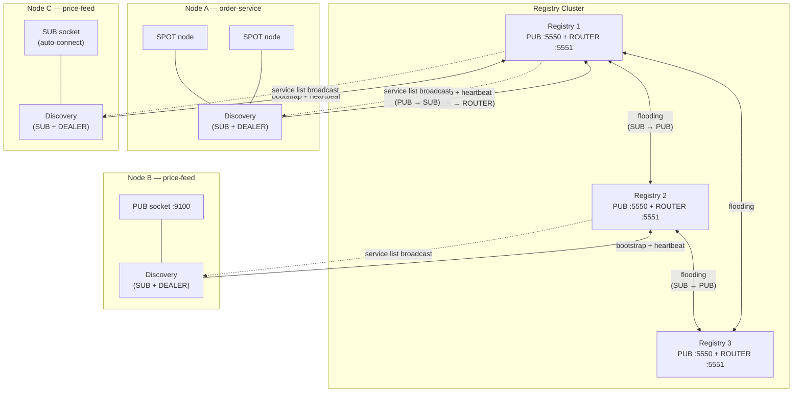
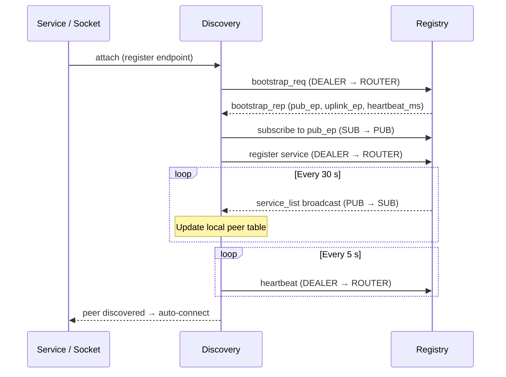
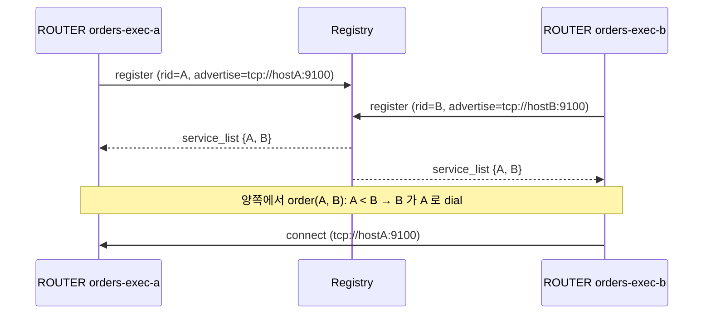
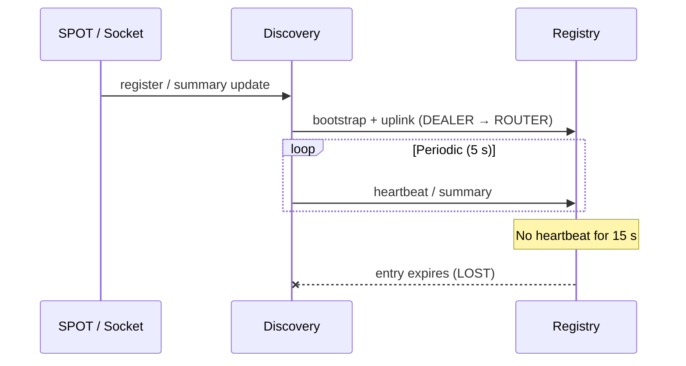

[English](07-1-discovery.md) | [한국어](07-1-discovery.ko.md)

# Service Discovery

> **규범 상태(Normative status): 설명 목적(Illustrative) — 갱신 필요.**
> 이 가이드는 설명 목적의 문서이며, API 명칭/시그니처의 정확한 기준은
> `core/include/zlink.h`와 `bindings/README.md`다.

## 1. 개요

마이크로서비스 환경에서 서비스들은 통신을 위해 상대방의 네트워크
엔드포인트를 알아야 한다. Discovery 없이는 모든 서비스가 피어의 주소를
직접 설정해야 하며, 인스턴스가 확장·이동·재시작될 때마다 수동으로
주소를 갱신해야 한다.

zlink Service Discovery는 **수동 주소 관리를 제거**한다.
서비스는 자신의 엔드포인트를 중앙 **Registry**에 등록하고,
각 **Discovery** 클라이언트가 매칭되는 피어를 자동으로 찾아 연결한다.
애플리케이션 코드는 원격 주소를 직접 다룰 필요가 없다.

**Discovery 없이** -- 배포 시 모든 피어 주소를 직접 알아야 한다:

```c
/* Manually configure each peer endpoint */
zlink_connect(sub, "tcp://10.0.1.5:9100");   /* price-feed-1 */
zlink_connect(sub, "tcp://10.0.1.8:9100");   /* price-feed-2 */
/* price-feed-3 added? price-feed-1 moved? → update config, redeploy */
```

**Discovery 사용** -- 소켓을 attach 하기만 하면 된다:

```c
zlink_socket_attach_discovery(sub, discovery);
/* All price-feed PUB instances are found automatically.
   New instances appear, crashed ones vanish — zero code changes. */
```

### 핵심 개념

| 용어 | 설명 |
|------|------|
| **Registry** | 등록된 서비스를 추적하고 서비스 목록을 브로드캐스트하는 중앙 서버 (PUB + ROUTER 소켓) |
| **Discovery** | Registry에 부트스트랩(bootstrap, 초기 연결)하여 서비스 목록을 수신(SUB)하고, 연결된 서비스의 커넥션을 관리하는 클라이언트 에이전트 |
| **소켓 패밀리** | Discovery를 통해 피어를 등록·발견하는 raw ROUTER/DEALER/PUB/SUB 소켓 |
| **서비스 역할** | 자동 피어 매칭에 사용되는 소켓 수준 역할 (ROUTER/DEALER/PUB/SUB) |
| **Heartbeat** | 주기적 생존 신호 (기본: 5초 주기, 15초 타임아웃) |

## 2. 동작 원리

### 아키텍처



각 **Registry**는 두 개의 소켓을 노출한다:

- **PUB** — 전체 서비스 목록을 주기적으로 브로드캐스트 (기본 30초)
- **ROUTER** — 등록, heartbeat, 부트스트랩, 쿼리 메시지를 수신

각 **Discovery**는 Registry에 다음과 같이 연결한다:

- **DEALER → ROUTER** — 부트스트랩 요청, 서비스 등록, heartbeat 전송
- **SUB → PUB** — 서비스 목록 브로드캐스트 수신

**구체적 시나리오** -- 위 아키텍처 다이어그램의 `price-feed` 예시:

1. **Node B**가 PUB 소켓을 생성하고, `tcp://*:9100`에 bind한 후,
   서비스명 `"price-feed"`로 Discovery에 attach한다.
2. Discovery가 확정된 엔드포인트(예: `tcp://10.0.1.8:9100`)를
   Registry 2에 등록한다.
3. Registry 2가 다음 서비스 목록 브로드캐스트에 이 엔드포인트를 포함한다.
   플러딩(flooding, 전체 브로드캐스트 전파)을 통해 Registry 1, 3도 이 정보를 학습한다.
4. **Node C**는 자신의 `"price-feed"` Discovery에 SUB 소켓을 attach한
   상태다. 브로드캐스트가 도착하면 Discovery가 PUB 프로바이더를 확인하고
   SUB 소켓을 `tcp://10.0.1.8:9100`에 **자동 연결**한다.
5. Node B가 장애 발생 시, heartbeat가 중단 → Registry가 해당 entry 만료 →
   Node C가 업데이트된 목록을 수신 → 자동으로 연결 해제.

Node C의 코드에는 `tcp://10.0.1.8:9100` 주소가 어디에도 없다.

### Bootstrap(부트스트랩) 및 연결 흐름



1. 서비스가 Discovery에 **attach** (또는 SPOT 노드를 등록).
2. Discovery가 Registry의 ROUTER 엔드포인트에 **부트스트랩 요청**을 전송.
3. Registry가 구독할 PUB 엔드포인트와 heartbeat 주기를 응답.
4. Discovery가 PUB 엔드포인트를 **구독**하고 주기적 서비스 목록 수신 시작.
5. Discovery가 자신의 서비스를 **등록**하고 heartbeat 전송 시작.
6. 서비스 목록에 매칭 피어가 나타나면, Discovery가 소켓을 **자동 연결** (소켓 패밀리) 하거나 모니터 이벤트를 전달 (SPOT).

### 자동 역할 매칭

소켓 패밀리 서비스에서 Discovery는 **서비스 역할**로 피어를 매칭한다:

| 로컬 소켓 | 발견 대상 | 예시 |
|-----------|----------|------|
| PUB | SUB 피어 | 퍼블리셔가 모든 구독자를 발견 |
| SUB | PUB 피어 | 구독자가 모든 퍼블리셔를 발견 |
| ROUTER | DEALER 피어 | 서버가 모든 클라이언트를 발견 |
| DEALER | ROUTER 피어 | 클라이언트가 모든 서버를 발견 |

역할은 attach 시 소켓 타입에서 자동으로 파생된다 — 별도 설정 불필요.

ROUTER ↔ ROUTER 자동 연결처럼 양쪽 모두 outbound를 시작할 수 있는 경우,
**자동 연결 방향은 라이브러리가 쌍마다 한쪽만 결정한다.** 즉 두 ROUTER가
서로를 발견해도 `connect`는 한 번만 만들어진다. 사용자는 어느 쪽이 dial할지
따로 설정할 필요가 없으며, 결과적으로 중복 연결 경쟁과 handover churn이
줄어든다. 이 규칙은 Discovery-managed 자동 연결에만 적용되며, raw API로
직접 호출한 `zlink_connect()`는 라이브러리가 중재하지 않는다.

#### 누가 dial 하는가 — pairwise initiator 규칙

Discovery가 같은 서비스의 ROUTER peer 두 개를 pair 로 묶을 때, 라이브러리는
pair 마다 한쪽만 initiator 로 선택한다. 비교 키는 광고된 `routing_id` 의
total order 가 먼저이고, 동점이면 advertise endpoint 가 tie-breaker 가 된다.
두 ROUTER 가 독립적으로 평가해도 같은 결과에 도달하므로, 사용자는 이
결정을 설정할 필요가 없다. 같은 서비스에 속한 ROUTER 들은 Discovery 에
대칭적으로 추가해도 되고, 선택된 한쪽에서만 `connect` 가 발생한다.



서로 다른 host 에서 같은 `routing_id` 가 올라오는 예외 (오설정, zombie
instance, 롤링 재시작 겹침) 는 여전히 duplicate policy 로 다룬다. 기본값인
`ZLINK_OPT_RID_DUPLICATE_POLICY = ZLINK_RID_DUPLICATE_REJECT` 는 기존 pipe 를
유지한다. 나중에 들어온 연결이 기존 pipe 를 인수해야 하면
`ZLINK_RID_DUPLICATE_HANDOVER` 를 명시 설정한다.

## 3. Registry 설정

Registry는 중앙 조정 서버다. 운영 환경에서는 HA를 위해 3노드 클러스터를
배포한다 ([섹션 6](#6-registry-클러스터-ha) 참조). 개발 및 테스트에는
단일 Registry로 충분하다.

```c
void *ctx = zlink_ctx_new();
void *registry = zlink_registry_new(ctx);

/* Add cluster peers (optional, must be called before bind) */
zlink_registry_add_peer(registry, "tcp://registry2:5550");
zlink_registry_add_peer(registry, "tcp://registry3:5550");

/* Heartbeat configuration (optional, must be called before bind) */
zlink_registry_set_heartbeat(registry, 5000, 15000);

/* Broadcast interval (optional, default 30 seconds) */
zlink_registry_set_broadcast_interval(registry, 30000);

/* Bind and start
   First arg:  PUB endpoint — broadcasts service list (Discovery SUB subscribes)
   Second arg: ROUTER endpoint — receives registration/heartbeat/queries (Discovery bootstraps here) */
zlink_registry_bind(registry,
    "tcp://*:5550",    /* PUB (service list broadcast) */
    "tcp://*:5551"     /* ROUTER (registration/heartbeat/queries) */
);

/* ... application logic ... */

/* Shutdown */
zlink_registry_destroy(&registry);
zlink_ctx_term(ctx);
```

## 4. Discovery 사용

Discovery는 애플리케이션에서 사용하는 클라이언트 측 컴포넌트다. 논리적
서비스당 하나의 Discovery를 생성하고, Registry에 연결한 후, SPOT 노드나
raw 소켓을 attach한다. Discovery가 등록, 피어 조회, heartbeat를 대신
처리한다.

```c
/* choose ROUTE_MESH, CLIENT_SERVER, DEALER_MESH, FANOUT, or SPOT_MESH */
void *discovery = zlink_discovery_new(ctx,
    ZLINK_AUTO_CONNECT_SPOT_MESH, "order-service");

/* Connect to Registry bootstrap/control endpoint (multiple allowed) */
zlink_discovery_connect_registry(discovery, "tcp://registry1:5551");
zlink_discovery_connect_registry(discovery, "tcp://registry2:5551");

/* 현재 member 집합을 조회 */
size_t peer_count = 0;
zlink_discovery_member_peers(discovery, NULL, &peer_count);

/* ... 응용에서 이전 조회 결과와 비교한다 ... */

/* Cleanup */
zlink_discovery_destroy(&discovery);
```

새로운 multi-service SpotNode 토폴로지에서는 attach되는 socket마다
`ZLINK_AUTO_CONNECT_CLIENT_SERVER`를 channel DEALER 호출에 사용한다. SPOT 가이드의
[§3.1 Discovery 기반 자동 Mesh](07-3-spot.ko.md#31-discovery-기반-자동-mesh)를
참고한다.

## 4.1 소켓 패밀리 Discovery

raw ROUTER/DEALER/PUB/SUB 소켓은 Discovery를 사용하여 자동 피어 발견과
lifecycle 관리를 할 수 있다. SPOT 추상화 없이 소켓 수준에서 위치투명
통신을 가능하게 한다.

```c
/* Create a FANOUT Discovery for PUB/SUB */
void *discovery = zlink_discovery_new(ctx,
    ZLINK_AUTO_CONNECT_FANOUT, "price-feed");
zlink_discovery_connect_registry(discovery, "tcp://registry1:5551");

/* Create a PUB socket and attach it to Discovery */
void *pub = zlink_socket(ctx, ZLINK_SOCKET_PUB);
zlink_bind(pub, "tcp://*:9100");
zlink_socket_attach_discovery(pub, discovery);
/* Discovery registers the PUB endpoint and manages heartbeats.
   Remote SUB sockets in the same service ("price-feed") will
   automatically discover and connect to this endpoint. */

/* ... publish messages ... */

/* Destroy Discovery to shut down the attached socket */
zlink_discovery_destroy(&discovery);
```

**Lifecycle:** 소켓이 연결되면 `connect`, `disconnect`, `unbind`, `close`
수동 호출이 실패한다. Discovery 인스턴스를 파괴하면 모든 연결된 소켓이
종료된다.

## 4.2 SpotNode에 Channel Dealer 붙이기

`SpotNode`는 자기 mesh 연결에 SPOT Discovery 하나를 사용한다
([SPOT 가이드](07-3-spot.ko.md) 참고). 다른 channel을 호출해야 할 때는
channel별로 `DEALER`를 attach한다.

```c
void *node = zlink_spot_node_new(ctx, NULL);
zlink_spot_node_bind(node, "tcp://*:9000");

/* SPOT mesh — 이 node 자신의 channel */
void *spot_disc = zlink_discovery_new(ctx,
    ZLINK_AUTO_CONNECT_SPOT_MESH, "alpha");
zlink_discovery_connect_registry(spot_disc, "tcp://registry1:5551");
zlink_spot_node_attach_discovery(node, spot_disc);

/* "orders-exec" channel 호출용 자동 dealer */
void *orders_disc = zlink_discovery_new(ctx,
    ZLINK_AUTO_CONNECT_CLIENT_SERVER, "orders-exec");
zlink_discovery_connect_registry(orders_disc, "tcp://registry1:5551");

void *orders_dealer = zlink_socket(ctx, ZLINK_SOCKET_DEALER);
zlink_socket_attach_discovery(orders_dealer, orders_disc);

zlink_spot_node_attach_channel_dealer(node, orders_disc, orders_dealer);
```

attach 시 지켜야 하는 규칙:

- **SPOT Discovery는 node당 하나.** `zlink_spot_node_attach_discovery()`는
  `ZLINK_AUTO_CONNECT_SPOT_MESH`만 받는다. 두 번째 attach는 `EBUSY`로 실패한다.
- **같은 channel에 DEALER 하나.** 자동 attach와 수동 attach가 같은 namespace를
  공유한다. 같은 channel에 `DEALER`를 두 번 attach하면 `EBUSY`로 실패한다.
- **attach된 DEALER는 전용 자원.** 소유권은 호출자가 유지하지만, attach 뒤에는
  다른 용도로 같은 socket을 함께 쓰지 않는다.
- **Discovery destroy는 그 peer set만 내린다.** 특정 Discovery만 파괴하면 그
  Discovery가 공급하던 자동 연결만 제거된다.

## 4.3 Peer Value

각 Discovery 인스턴스는 서비스 등록 시 피어들에게 함께 broadcast되는
`int64_t` 값을 하나 가진다. 원격 관찰자는 `zlink_member_peer_entry_t`의
`value` 필드로 이 값을 읽는다. 가중 부하 분산(weighted load-balancing)이나
우선순위 라우팅에 활용한다.

```c
/* 이 인스턴스의 광고 값 설정 */
zlink_discovery_set_value(discovery, 100);

/* 값 읽기 */
int64_t v = 0;
zlink_discovery_get_value(discovery, &v);
```

값은 다음 heartbeat 주기에 전송된다. 원격 피어는
`zlink_discovery_member_peers()` 또는 `zlink_registry_member_peers()`로
확인할 수 있다.

## 5. Liveness 및 Summary 업데이트



- Registry visibility는 Discovery가 소유하는 heartbeat/topology uplink로
  유지된다.
- SPOT과 소켓 패밀리 서비스는 로컬 registration/summary 변경을 제출하지만,
  주기적 uplink cadence는 Discovery가 담당한다.
- Registry summary는 eventually consistent한 coarse/global view이며,
  strict final readiness gate로 사용하면 안 된다.

## 6. Registry 클러스터 HA

- 3노드 클러스터 권장
- **플러딩 방식 동기화:** 각 Registry가 다른 Registry의 PUB를 구독하여,
  새 서비스 등록 시 변경된 목록이 모든 피어로 전파된다.
- **Eventually Consistent:** 모든 Registry가 동일 상태로 수렴.
  `registry_id` + `list_seq`로 중복/역전 업데이트 무시.

**서비스 가시성:** Registry 클러스터에서 서비스 목록은 플러딩으로 전파된다.
Discovery가 하나의 Registry에만 연결해도 피어 Registry에 등록된 서비스가
브로드캐스트에 포함되어 전체 클러스터의 서비스를 볼 수 있다. 여러 Registry에
`connect_registry()`하는 것은 서비스 가시성이 아닌 **HA(장애 대응)**를 위한
것이다.

### Discovery Failover

- Discovery는 하나 이상의 Registry control endpoint에 부트스트랩 연결한다.
- 부트스트랩 metadata로 내부 broadcast/uplink 경로를 학습한다.
- 한 Registry 노드가 실패해도 다른 부트스트랩 control endpoint를 통해
  계속 동작할 수 있다.

## 7. 다음 단계

- [SPOT PUB/SUB](07-3-spot.ko.md) — Discovery 기반 위치투명 발행/구독
- [Registry 가이드](07-4-registry.ko.md) — 클러스터 구성, 토폴로지 조회, 운영 패턴

---
[← 서비스 개요](07-0-services.ko.md) | [SPOT →](07-3-spot.ko.md)
