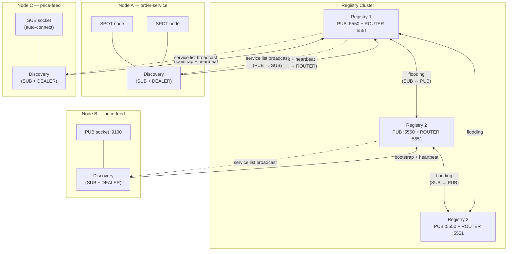
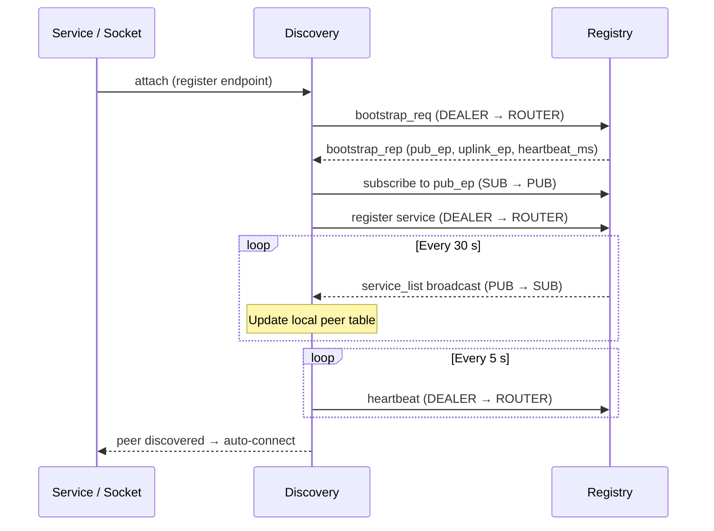
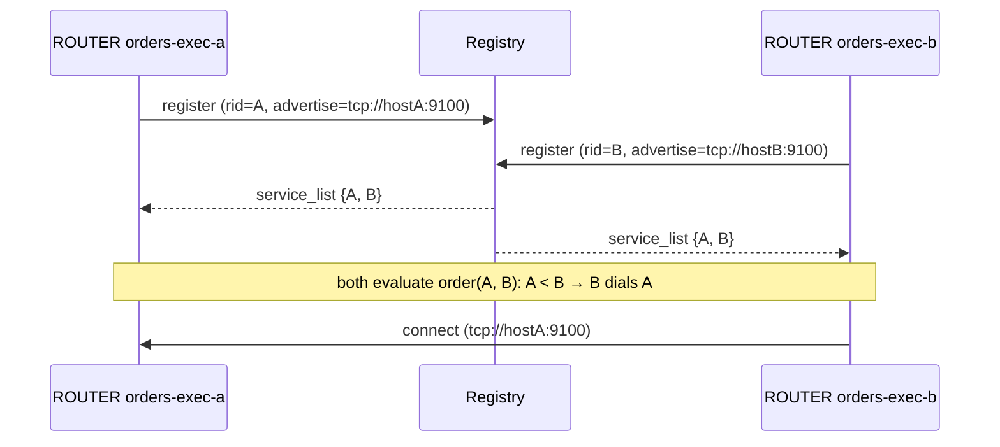
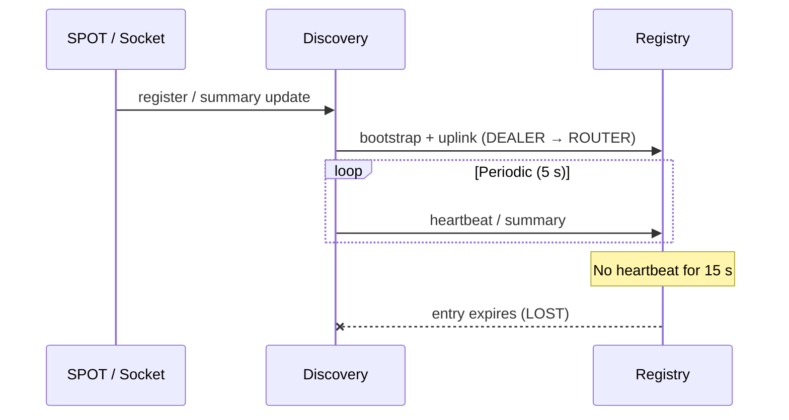

[English](./07-1-discovery.md) | [한국어](./07-1-discovery.ko.md)

# Service Discovery

> **Normative status: Illustrative — Needs refresh.**
> 이 가이드는 설명 목적의 문서이며, API 명칭/시그니처의 정확한 기준은
> `core/include/zlink.h`와 `bindings/README.md`다.

## 1. Overview

In a microservices environment, services need to find each other's
network endpoints to communicate. Without discovery, every service must
be configured with the addresses of its peers -- a manual process that
breaks as instances scale, move, or restart.

zlink Service Discovery **eliminates manual address management**.
Services register their endpoints with a central **Registry**, and
each **Discovery** client automatically finds and connects to matching
peers. Application code never deals with remote addresses directly.

**Without Discovery** -- every service must know peer addresses at deploy time:

```c
/* Manually configure each peer endpoint */
zlink_connect(sub, "tcp://10.0.1.5:9100");   /* price-feed-1 */
zlink_connect(sub, "tcp://10.0.1.8:9100");   /* price-feed-2 */
/* price-feed-3 added? price-feed-1 moved? → update config, redeploy */
```

**With Discovery** -- just attach the socket:

```c
zlink_socket_attach_discovery(sub, discovery);
/* All price-feed PUB instances are found automatically.
   New instances appear, crashed ones vanish — zero code changes. */
```

### Core Concepts

| Term | Description |
|------|-------------|
| **Registry** | Central server that tracks registered services and broadcasts the service list (PUB + ROUTER sockets) |
| **Discovery** | Client-side agent that bootstraps against a Registry, receives service lists (SUB), and manages connections for attached services |
| **Socket Family** | Raw ROUTER/DEALER/PUB/SUB sockets that register and discover peers via Discovery |
| **Service Role** | Socket-level role (ROUTER/DEALER/PUB/SUB) used for automatic peer matching |
| **Heartbeat** | Periodic liveness signal (default: 5 s interval, 15 s timeout) |

## 2. How It Works

### Architecture



Each **Registry** exposes two sockets:

- **PUB** -- periodically broadcasts the full service list (every 30 s by default)
- **ROUTER** -- accepts registration, heartbeat, bootstrap, and query messages

Each **Discovery** connects to a Registry with:

- **DEALER → ROUTER** -- sends bootstrap request, registration, and heartbeats
- **SUB → PUB** -- receives the service list broadcast

**Concrete scenario** -- the `price-feed` example in the diagram above:

1. **Node B** creates a PUB socket, binds to `tcp://*:9100`, and attaches it
   to a Discovery with service name `"price-feed"`.
2. Discovery registers the resolved endpoint (e.g. `tcp://10.0.1.8:9100`)
   with Registry 2.
3. Registry 2 includes this endpoint in its next service list broadcast.
   Via flooding, Registries 1 and 3 also learn about it.
4. **Node C** has a SUB socket attached to its own `"price-feed"` Discovery.
   When the broadcast arrives, Discovery sees the PUB provider and
   **auto-connects** the SUB socket to `tcp://10.0.1.8:9100`.
5. If Node B crashes, its heartbeat stops → Registry expires the entry →
   Node C receives an updated list without that endpoint → auto-disconnects.

Node C never configured `tcp://10.0.1.8:9100` anywhere in its code.

### Bootstrap and Connection Flow



1. The service **attaches** to Discovery (or registers a SPOT node).
2. Discovery sends a **bootstrap request** to the Registry's ROUTER endpoint.
3. The Registry replies with the PUB endpoint to subscribe to and the heartbeat interval.
4. Discovery **subscribes** to the PUB endpoint and starts receiving periodic service lists.
5. Discovery **registers** its service and begins sending heartbeats.
6. When a matching peer appears in the service list, Discovery **auto-connects** the socket (for socket family) or delivers a monitor event (for SPOT).

### Automatic Role Matching

For socket family services, Discovery matches peers by **service role**:

| Local Socket | Discovers | Example |
|--------------|-----------|---------|
| PUB | SUB peers | Publisher finds all subscribers |
| SUB | PUB peers | Subscriber finds all publishers |
| ROUTER | auto-connect peers | Server finds all clients |
| DEALER | ROUTER peers | Client finds all servers |

The role is derived automatically from the socket type at attach time --
no configuration needed.

For ROUTER ↔ ROUTER auto-connect, where both sides could start an
outbound, **the library decides which side dials per pair.** Two ROUTERs
that see each other through Discovery still produce only one `connect`.
You do not need to configure who-dials-whom; the rule is a built-in
internal policy that reduces duplicate-connection races and handover
churn. It applies to Discovery-managed auto-connect only -- manual
`zlink_connect()` calls made through the raw API are not mediated by the
library.

#### Who dials whom -- pairwise initiator rule

When Discovery pairs two ROUTER peers of the same service, the library
picks exactly one side as the initiator per pair. The comparison key is
a total order over the advertised `routing_id` first, then the advertise
endpoint as a tie-breaker, so both ends independently arrive at the same
decision. Users do not configure this -- same-service ROUTERs can be
added to Discovery symmetrically, and only the chosen side produces a
`connect`.



The exceptional case where the same `routing_id` appears from two different
hosts (misconfiguration, zombie instance, rolling restart overlap) still uses
the duplicate policy. Keep the default
`ZLINK_OPT_RID_DUPLICATE_POLICY = ZLINK_RID_DUPLICATE_REJECT` to preserve the
existing pipe, or set `ZLINK_RID_DUPLICATE_HANDOVER` explicitly when the newer
connection should take over.

## 3. Registry Setup

Registry is the central coordination server. In production, deploy a
3-node cluster for HA (see [Section 6](#6-registry-cluster-ha)). A single
Registry is sufficient for development and testing.

```c
void *ctx = zlink_ctx_new();
void *registry = zlink_registry_new(ctx);

/* Add cluster peers (optional, must be called before bind) */
zlink_registry_add_peer(registry, "tcp://registry2:5550");
zlink_registry_add_peer(registry, "tcp://registry3:5550");

/* Heartbeat configuration (optional, must be called before bind) */
zlink_registry_set(registry, ZLINK_REGISTRY_OPT_HEARTBEAT_INTERVAL_MS, 5000);
    zlink_registry_set(registry, ZLINK_REGISTRY_OPT_HEARTBEAT_TIMEOUT_MS, 15000);

/* Broadcast interval (optional, default 30 seconds) */
zlink_registry_set(registry, ZLINK_REGISTRY_OPT_BROADCAST_INTERVAL_MS, 30000);

/* Bind and start
   First arg:  PUB endpoint — broadcasts service list (Discovery SUB subscribes)
   Second arg: ROUTER endpoint — receives registration/heartbeat/queries (Discovery bootstraps here) */
zlink_registry_bind(registry,
    "tcp://*:5550",    /* PUB (service list broadcast) */
    "tcp://*:5551"     /* ROUTER (registration/heartbeat/queries) */
);

/* ... application logic ... */

/* Shutdown */
zlink_registry_destroy(&registry);
zlink_ctx_term(ctx);
```

## 4. Using Discovery

Discovery is the client-side component your application uses. Create one
Discovery per logical service, connect it to a Registry, then attach
SPOT nodes or raw sockets. Discovery handles registration, peer lookup,
and heartbeats on behalf of the attached services.

```c
/* choose ROUTE_MESH, CLIENT_SERVER, DEALER_MESH, FANOUT, or SPOT_MESH */
void *discovery = zlink_discovery_new(ctx,
    ZLINK_AUTO_CONNECT_SPOT_MESH, "order-service");

/* Connect to Registry bootstrap/control endpoint (multiple allowed) */
zlink_discovery_connect_registry(discovery, "tcp://registry1:5551");
zlink_discovery_connect_registry(discovery, "tcp://registry2:5551");

/* Poll the current member set */
size_t peer_count = 0;
zlink_discovery_member_peers(discovery, NULL, &peer_count);

/* ... compare successive snapshots in application code ... */

/* Cleanup */
zlink_discovery_destroy(&discovery);
```

For the new multi-service SpotNode topology, use
`ZLINK_AUTO_CONNECT_CLIENT_SERVER` for channel DEALER calls — see the SPOT guide
[§3.1 Discovery-Based Automatic Mesh](./07-3-spot.md#31-discovery-based-automatic-mesh).

## 4.1 Socket Family Discovery

Raw ROUTER/DEALER/PUB/SUB sockets can use Discovery for automatic peer
discovery and lifecycle management. This enables location-transparent
communication at the socket level without the SPOT abstraction.

```c
/* Create a FANOUT Discovery for PUB/SUB */
void *discovery = zlink_discovery_new(ctx,
    ZLINK_AUTO_CONNECT_FANOUT, "price-feed");
zlink_discovery_connect_registry(discovery, "tcp://registry1:5551");

/* Create a PUB socket and attach it to Discovery */
void *pub = zlink_socket(ctx, ZLINK_SOCKET_PUB);
zlink_bind(pub, "tcp://*:9100");
zlink_socket_attach_discovery(pub, discovery);
/* Discovery registers the PUB endpoint and manages heartbeats.
   Remote SUB sockets in the same service ("price-feed") will
   automatically discover and connect to this endpoint. */

/* ... publish messages ... */

/* Destroy Discovery to shut down the attached socket */
zlink_discovery_destroy(&discovery);
```

**Lifecycle:** Once a socket is attached, manual `connect`, `disconnect`,
`unbind`, and `close` calls fail. Destroying the Discovery instance
terminates all attached sockets.

## 4.2 Attaching Channel Dealers to a SpotNode

A `SpotNode` uses one SPOT Discovery for its own mesh wiring
(see the [SPOT Guide](./07-3-spot.md)). When the node needs to call
**other channels**, it attaches a `DEALER` per channel.

```c
void *node = zlink_spot_node_new(ctx, NULL);
zlink_spot_node_bind(node, "tcp://*:9000");

/* SPOT mesh — this node's own channel */
void *spot_disc = zlink_discovery_new(ctx,
    ZLINK_AUTO_CONNECT_SPOT_MESH, "alpha");
zlink_discovery_connect_registry(spot_disc, "tcp://registry1:5551");
zlink_spot_node_attach_discovery(node, spot_disc);

/* Channel call to "orders-exec" via automatic dealer */
void *orders_disc = zlink_discovery_new(ctx,
    ZLINK_AUTO_CONNECT_CLIENT_SERVER, "orders-exec");
zlink_discovery_connect_registry(orders_disc, "tcp://registry1:5551");

void *orders_dealer = zlink_socket(ctx, ZLINK_SOCKET_DEALER);
zlink_socket_attach_discovery(orders_dealer, orders_disc);

zlink_spot_node_attach_channel_dealer(node, orders_disc, orders_dealer);
```

Rules to keep in mind:

- **One SPOT Discovery per node.** `zlink_spot_node_attach_discovery()`
  accepts only `ZLINK_AUTO_CONNECT_SPOT_MESH`. A second attach is `EBUSY`.
- **One DEALER per channel name.** Automatic and manual attach share the
  same namespace. Attaching a second `DEALER` for the same channel fails
  with `EBUSY`.
- **Attached dealers are dedicated.** The caller keeps socket ownership,
  but must not reuse the socket elsewhere after attach.
- **Discovery destroy removes its peer set.** Destroying a Discovery
  removes only the automatic connections it was supplying.

## 4.3 Peer Value

Each Discovery instance carries a single `int64_t` value that is broadcast
to all peers alongside the service registration. Remote observers read it from
the `value` field of `zlink_member_peer_entry_t`. This is useful for
weighted load-balancing and priority-based routing.

```c
/* Set this instance's advertised numeric value */
zlink_discovery_set_value(discovery, 100);

/* Read it back */
int64_t v = 0;
zlink_discovery_get_value(discovery, &v);
```

The value is transmitted on the next heartbeat cycle. Remote peers see it via
`zlink_discovery_member_peers()` or `zlink_registry_member_peers()`.

## 5. Liveness and Summary Updates



- Registry visibility is maintained through Discovery-owned heartbeat/topology
  uplink.
- SPOT and socket family services submit local registration/summary
  changes, but Discovery owns the periodic uplink cadence.
- Registry summary is eventually consistent and should be treated as a
  coarse/global view, not a strict final readiness gate.

## 6. Registry Cluster HA

- 3-node cluster recommended
- **Flooding-based synchronization:** each Registry subscribes to other
  Registries' PUB endpoints. When one Registry receives a new service
  registration, the updated list propagates to all peers.
- **Eventually Consistent:** all Registries converge to the same state.
  Duplicate/out-of-order updates are ignored via `registry_id` + `list_seq`.

**Service Visibility:** In a Registry cluster, the service list is propagated
via flooding. Even if a Discovery connects to only one Registry, services
registered on peer Registries are included in that Registry's broadcast,
so the full cluster's services are visible. Connecting to multiple Registries
via `connect_registry()` is for **HA (failover)**, not for service visibility.

### Discovery Failover

- Discovery bootstraps against one or more Registry control endpoints
- It learns the internal broadcast/uplink paths from bootstrap metadata
- If one Registry node fails, Discovery can continue using other configured
  bootstrap control endpoints

## 7. Next Steps

- [SPOT PUB/SUB](./07-3-spot.md) -- Discovery-based location-transparent publish/subscribe
- [Registry Guide](./07-4-registry.md) -- Cluster setup, topology introspection, and operational patterns

---
[← Services Overview](./07-0-services.md) | [SPOT →](./07-3-spot.md)
