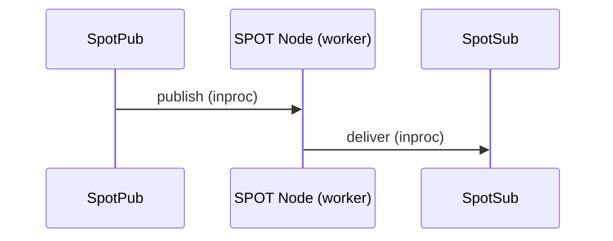
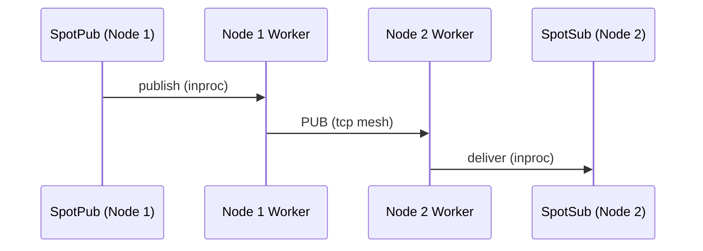
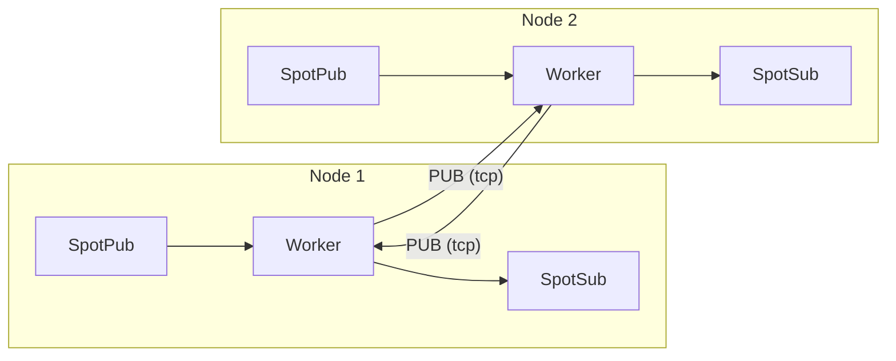
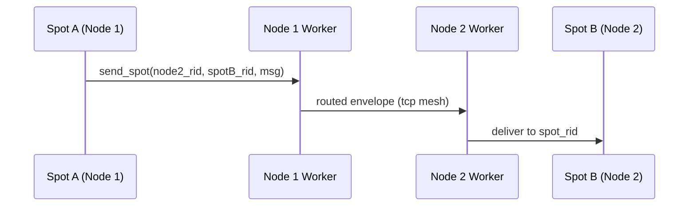
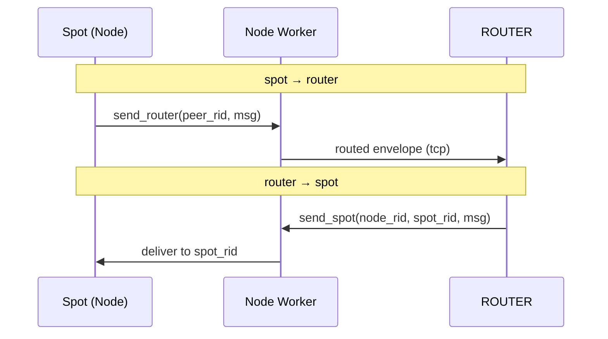
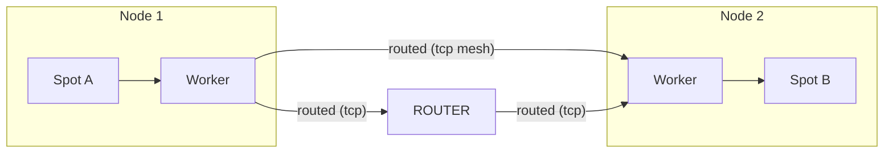
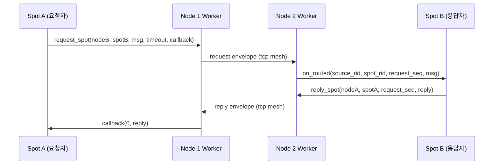
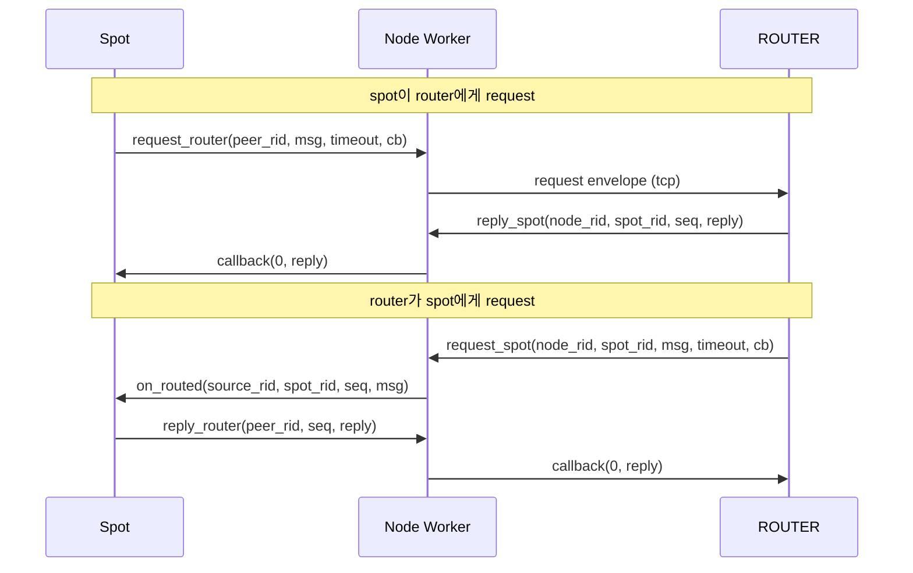

[English](07-3-spot.md) | [한국어](07-3-spot.ko.md)

# SPOT (위치투명 메시징)

> 이 가이드는 recv-first public surface 기준으로 작성되었다.
> `SpotNode`와 unified `Spot`은 recv 모드로 시작하고,
> topic 경로는 `zlink_subscribe_handler()`, routed 경로는
> `zlink_spot_handler()`로 callback 모드로 전환된다.

## 1. 개요

SPOT은 위치 투명한 메시징 시스템으로 두 가지 전달 경로를 제공한다:

1. **토픽 PUB/SUB** -- 토픽 매칭을 통한 클러스터 전체 발행/구독
2. **Routed (직접)** -- 주소 기반으로 특정 SPOT 또는 ROUTER에 직접 전달

두 경로 모두 동일한 SpotNode mesh 인프라를 공유한다. 토픽 메시지와 routed 메시지는
별도 채널이며 독립된 수신 surface를 가진다.

SPOT이 없다면, 여러 노드에 걸친 토픽 기반 메시징을 사용하는 애플리케이션은 어떤 노드에 구독자가 있는지 직접 추적하고, PUB/SUB mesh 연결을 관리하고, 구독 포워딩을 처리해야 한다. SPOT은 이를 자동화한다 -- 어떤 노드에서든 토픽에 publish하면, 클러스터 전체의 모든 구독자가 메시지를 수신한다. Routed 경로는 ROUTER/DEALER 소켓을 수동으로 구성하지 않고도 직접 전달과 request-reply를 추가한다.

> **명칭에 대하여**: SPOT은 "위치(spot)"에서 유래한 이름이다. 각 객체(노드)가 자신의 위치에서 토픽을 발행하고, 다른 위치의 토픽을 구독하는 객체 단위의 위치투명한(location-transparent) pub/sub 메시 시스템이다.

### 핵심 용어

| 용어 | 설명 |
|------|------|
| **SPOT Node** | Mesh 참여 에이전트 (노드별 1개) |
| **SPOT Pub** | 토픽 발행 경로 (`spot` / `spot_node`의 핫 패스(hot path, 고빈도 데이터 경로)) |
| **SPOT Sub** | 토픽 구독/수신 핸들 |
| **Topic** | 문자열 키 기반 메시지 채널 (토픽 경로) |
| **Pattern** | 접두어 + `*` 와일드카드 구독 |
| **Handler** | callback 수신 시 자동 호출되는 콜백 함수 |
| **Routed** | 주소 기반으로 특정 SPOT 또는 ROUTER에 직접 전달하는 경로 |
| **node_rid** | SpotNode 수준 routing_id (mesh 내 노드 식별자) |
| **spot_rid** | SPOT handle별 routing_id (개별 객체 식별자) |
| **request_seq** | request-reply 상관 시퀀스 번호 (`0` = 일반 routed 메시지) |

## 2. 아키텍처

### 로컬 publish — 같은 노드 안에서 전달



SpotPub이 publish하면 SPOT Node 내부 worker가 받아서 같은 노드의 SpotSub에게
바로 전달한다. SpotSub은 callback 또는 recv 두 가지 방식으로 메시지를 수신할 수
있다.

### 원격 전파 — 클러스터 노드 간 전달



로컬 publish는 worker가 두 갈래로 분기한다:
1. 같은 노드의 SpotSub에게 전달 (위의 로컬 경로)
2. mesh PUB 소켓으로 원격 노드에 송출

원격 노드의 worker는 mesh에서 수신한 메시지를 자기 SpotSub에게만 전달하고,
**다시 mesh로 재발행하지 않는다** (루프 방지).

### 전체 구조 요약



- 각 Node의 worker는 **PUB 소켓**으로 송출하고, 다른 노드의 **SUB 소켓**으로 수신한다
- 로컬 publish만 mesh로 나가고, 원격 수신은 재발행하지 않는다 (루프 방지)
- Discovery 연결 시 이 mesh 토폴로지가 자동 구성된다

> 내부 소켓 배선과 데이터 플레인 상세는
> [SPOT 내부 구조](../internals/spot-internals.ko.md)를 참고.

**예시:** 노드 1이 토픽 `price.USD.JPY`를 publish한다. 노드 2에는 `price.*` 구독자가 있다.

1. 노드 1의 SpotPub이 로컬 SPOT worker에게 메시지를 전송한다.
2. Worker가 `price.*`에 매칭되는 로컬 SpotSub에게 전달한다 (로컬 경로).
3. Worker가 PUB 소켓을 통해 tcp로 노드 2에 송출한다.
4. 노드 2의 worker가 SUB로 수신하여, `price.*`에 매칭한 뒤 SpotSub에게 전달한다.
5. 노드 2에서 mesh로 재발행하지 않는다 (루프 방지).

## 3. SPOT Node 설정

### 3.1 Discovery 기반 자동 Mesh

```c
void *ctx = zlink_ctx_new();

/* Discovery setup (peer discovery + registry uplink / heartbeat owner) */
void *discovery = zlink_discovery_new(ctx,
    ZLINK_SERVICE_TYPE_SPOT, "spot-node");
zlink_discovery_connect_registry(discovery, "tcp://registry1:5551");

/* SPOT Node setup */
void *node = zlink_spot_node_new(ctx);
zlink_spot_node_bind(node, "tcp://*:9000");

/* Attach Discovery */
zlink_spot_node_attach_discovery(node, discovery);
```

> `SpotNode`는 mesh 참여를 위한 토폴로지 및 라이프사이클 소유자이다.
> 범용 데이터 플레인(data plane, 실제 메시지가 흐르는 경로) facade(publish/subscribe)를 노출하지 않는다.
> publish/subscribe를 사용하려면 `zlink_spot_new(node)`로 facade를 만든다.

**주의:** `attach_discovery()`는 bind 이후에 호출하는 것을 권장한다.
Discovery가 attach되면 Registry를 통해 자동으로 peer를 발견하고 연결한다.

> Discovery가 mesh를 구성하는 방식은
> [Discovery 내부 구조](../internals/discovery-internals.ko.md)를 참고.

**임시 포트:** `zlink_spot_node_bind()`는 포트 0을 지원하여 OS가 포트를
자동 할당한다. `zlink_spot_node_status_snapshot()`의 `local_endpoint`로
실제 할당된 endpoint를 조회할 수 있다:

```c
zlink_spot_node_bind(node, "tcp://127.0.0.1:0");
zlink_spot_node_status_t status;
zlink_spot_node_status_snapshot(node, &status);
/* status.local_endpoint contains e.g. "tcp://127.0.0.1:43521" */
```

### 3.2 수동 Mesh

```c
void *node = zlink_spot_node_new(ctx);
zlink_spot_node_bind(node, "tcp://*:9000");

/* Directly connect to other nodes' PUB */
zlink_spot_node_connect_peer(node, "tcp://node2:9000");
zlink_spot_node_connect_peer(node, "tcp://node3:9000");
```

**주의:** 수동 Mesh에서는 Discovery가 없으므로 Registry topology visibility도
없다. 이는 의도된 제한이다.

## 4. Unified SPOT 사용

### 4.1 생성

```c
void *spot = zlink_spot_new(node);
```

`zlink_spot_new(node)`는 기존 spot node를 빌리는 unified facade를
생성한다. publish와 subscribe를 함께 제공한다. public standalone
`spot_pub` / `spot_sub` 생성자는 제공하지 않는다.

transport security는 unified `spot`에서 설정하지 않는다. `tls://` 또는
`wss://`를 써야 하면 먼저 backing `SpotNode`에 TLS를 설정해야 한다.
unified `spot` 내부의 `inproc` 연결은 TLS 설정 surface가 아니다.

### 4.2 발행

```c
zlink_msg_t part;
zlink_msg_init_size(&part, 11);
memcpy(zlink_msg_data(&part), "hello world", 11);
zlink_publish(spot, "chat:room1:message", &part, 1, 0);
```

### 4.3 구독 / 해제

```c
zlink_set_subscription(spot, "chat:room1:message");
zlink_set_subscription(spot, "chat:room1:*");

zlink_unset_subscription(spot, "chat:room1:message");
zlink_unset_subscription(spot, "chat:room1:*");
```

### 4.4 메시지 수신

`SpotNode`와 unified `Spot` 모두 **recv 모드**로 시작한다. 메시지를 직접
수신하거나, receive surface를 **callback 모드**로 한 번 전환할 수 있다.
send-ready는 별도 축이다.

#### Recv 모드 (기본)

recv 모드에서는 `zlink_subscribe()`로 메시지를 직접 수신한다.

```c
void *spot = zlink_spot_new(node);
zlink_set_subscription(spot, "chat:room1:message");

/* Pull next message */
zlink_routing_id_t source_rid;
zlink_msg_t *parts = NULL;
size_t part_count = 0;
char topic_buf[256];
size_t topic_len = sizeof(topic_buf);
int rc = zlink_subscribe(spot, &source_rid, &parts, &part_count,
                              topic_buf, &topic_len, 0);
if (rc == 0) {
    printf("Topic: %.*s, Parts: %zu\n",
           (int)topic_len, topic_buf, part_count);
    for (size_t i = 0; i < part_count; i++)
        zlink_msg_close(&parts[i]);
}
```

<details>
<summary>Full Sample Code</summary>

| Language | Source |
|----------|--------|
| C | [spot_recv_sample.c](https://github.com/kairos-code-dev/zlink/blob/main/core/samples/spot_recv_sample.c) |
| C++ | [spot_recv_sample.cpp](https://github.com/kairos-code-dev/zlink/blob/main/bindings/cpp/samples/spot_recv_sample.cpp) |
| Java | [SpotRecvSample.java](https://github.com/kairos-code-dev/zlink/blob/main/bindings/java/samples/Zlink.Samples/src/main/java/dev/kairoscode/zlink/samples/SpotRecvSample.java) |
| Python | [spot_recv.py](https://github.com/kairos-code-dev/zlink/blob/main/bindings/python/examples/spot_recv.py) |
| Node | [spot_recv_sample.ts](https://github.com/kairos-code-dev/zlink/blob/main/bindings/node/examples/spot_recv_sample.ts) |
| C# | [Program.cs](https://github.com/kairos-code-dev/zlink/blob/main/bindings/dotnet/samples/SpotRecv/Program.cs) |
| Rust | [spot_recv_sample.rs](https://github.com/kairos-code-dev/zlink/blob/main/bindings/rust/samples/spot_recv_sample.rs) |
| Go | [main.go](https://github.com/kairos-code-dev/zlink/blob/main/bindings/go/samples/spot_recv_sample/main.go) |

</details>

#### Callback 모드

`zlink_subscribe_handler()`를 호출하면 recv 모드에서 callback 모드로
일방 전환된다. 이후 수신 메시지는 설치된 callback으로 자동 dispatch된다.

```c
/* Define callback function */
void on_message(const zlink_routing_id_t *source_rid,
                const char *topic, size_t topic_len,
                zlink_msg_t *parts, size_t part_count,
                void *userdata)
{
    printf("Topic: %.*s, Parts: %zu\n", (int)topic_len, topic, part_count);
}

/* Register handler at unified spot creation */
void *spot = zlink_spot_new(node);
zlink_subscribe_handler(spot, on_message, NULL);
```

<details>
<summary>Full Sample Code</summary>

| Language | Source |
|----------|--------|
| C | [spot_callback_sample.c](https://github.com/kairos-code-dev/zlink/blob/main/core/samples/spot_callback_sample.c) |
| C++ | [spot_callback_sample.cpp](https://github.com/kairos-code-dev/zlink/blob/main/bindings/cpp/samples/spot_callback_sample.cpp) |
| Java | [SpotCallbackSample.java](https://github.com/kairos-code-dev/zlink/blob/main/bindings/java/samples/Zlink.Samples/src/main/java/dev/kairoscode/zlink/samples/SpotCallbackSample.java) |
| Python | [spot_callback.py](https://github.com/kairos-code-dev/zlink/blob/main/bindings/python/examples/spot_callback.py) |
| Node | [spot_callback_sample.ts](https://github.com/kairos-code-dev/zlink/blob/main/bindings/node/examples/spot_callback_sample.ts) |
| C# | [Program.cs](https://github.com/kairos-code-dev/zlink/blob/main/bindings/dotnet/samples/SpotCallback/Program.cs) |
| Rust | [spot_callback_sample.rs](https://github.com/kairos-code-dev/zlink/blob/main/bindings/rust/samples/spot_callback_sample.rs) |
| Go | [main.go](https://github.com/kairos-code-dev/zlink/blob/main/bindings/go/samples/spot_callback_sample/main.go) |

</details>

**중요:** 하나의 `spot` / `spot_node` handle을 여러 스레드에서 동시에
사용할 수 있다 (thread-safe). `publish`는 핫 패스로서
여러 스레드에서 동시 호출을 허용하고, subscribe/unsubscribe/attach/peer
connect/monitor는 제어 경로(control path)로 호출할 수 있다. 다만
callback은 I/O 경로에서 직접 호출되므로, 느린 처리는 사용자 queue로 넘겨 별도
thread에서 처리하는 편이 안전하다.

## 5. Routed (직접) 메시징

Routed 메시징은 토픽 매칭을 거치지 않고 주소로 특정 SPOT handle 또는 ROUTER
소켓에 직접 메시지를 전달한다. 토픽 pub/sub 경로와 별개다.

> SPOT routed envelope wire 형식은
> [ZMP 프로토콜](../internals/protocol-zmp.ko.md)을 참고.

### 주소 모델

Routed 메시지는 2단계 주소를 사용한다: **node_rid** (어떤 SpotNode)와
**spot_rid** (해당 노드의 어떤 SPOT handle). ROUTER에 보낼 때는
`peer_rid`만 필요하다.

```text
토픽 경로:     publish("price:USD:JPY", ...) → 매칭되는 모든 구독자
Routed 경로:   send_spot(dest_node_rid, dest_spot_rid, ...) → 특정 대상 1개
```

### Routed 전달 흐름

#### spot → spot (같은 노드 / 다른 노드)



Spot A가 Spot B의 주소(node_rid + spot_rid)를 지정하면,
Node 1 worker가 mesh를 통해 Node 2로 전달하고,
Node 2 worker가 spot_rid로 정확한 Spot B에게 배달한다.

#### spot ↔ router (크로스 패턴)



SPOT과 일반 ROUTER 소켓 간에도 직접 메시지를 주고받을 수 있다.
ROUTER로 보낼 때는 `peer_rid`만 있으면 되고,
SPOT으로 보낼 때는 `node_rid + spot_rid` 2단계 주소가 필요하다.

#### 전체 Routed 구조 요약



- 토픽 경로(PUB/SUB)와 Routed 경로는 같은 mesh 인프라를 공유하지만 **독립된 채널**이다
- Routed 메시지는 토픽 매칭을 거치지 않고 주소로 직접 전달된다
- ROUTER 소켓은 SpotNode 없이도 Routed 경로에 참여할 수 있다

### 5.1 직접 송신

#### spot → spot

```c
zlink_msg_t part;
zlink_msg_init_size(&part, 13);
memcpy(zlink_msg_data(&part), "market_update", 13);

zlink_spot_send_spot(spot, &dest_node_rid, &dest_spot_rid, &part, 1, 0);
```

#### spot → router

```c
zlink_msg_t part;
zlink_msg_init_size(&part, 11);
memcpy(zlink_msg_data(&part), "status_ping", 11);

zlink_spot_send_router(spot, &peer_rid, &part, 1, 0);
```

#### router → spot

```c
zlink_msg_t part;
zlink_msg_init_size(&part, 12);
memcpy(zlink_msg_data(&part), "control_sync", 12);

zlink_router_send_spot(router, &dest_node_rid, &dest_spot_rid, &part, 1, 0);
```

### 5.2 Routed 수신

Routed 메시지는 토픽 구독 surface와 별개인 전용 routed 수신 surface로 받는다.

#### Pull 모드

```c
const zlink_routing_id_t *source_rid;
const zlink_routing_id_t *spot_rid;
uint64_t request_seq;
zlink_msg_t *parts;
size_t part_count;

int rc = zlink_spot_recv(spot, &source_rid, &spot_rid,
                         &request_seq, &parts, &part_count, 0);
if (rc == 0) {
    if (request_seq == 0) {
        /* 일반 routed 메시지 */
    } else {
        /* request-reply 메시지 — request_seq로 reply 필요 */
    }
    zlink_multipart_close(parts, part_count);
}
```

#### Callback 모드

```c
void on_routed(const zlink_routing_id_t *source_rid,
               const zlink_routing_id_t *spot_rid,
               uint64_t request_seq,
               zlink_msg_t *parts, size_t part_count,
               void *userdata)
{
    if (request_seq == 0) {
        /* 일반 routed 메시지 */
    } else {
        /* request — reply 필요 */
    }
    zlink_multipart_close(parts, part_count);
}

zlink_spot_handler(spot, on_routed, NULL);
```

**참고:** `zlink_spot_handler()` (routed)와 `zlink_subscribe_handler()`
(topic)는 독립된 surface다. 같은 SPOT handle에서 둘 다 사용할 수 있다.

### 5.3 ROUTER가 SPOT으로부터 수신

ROUTER 소켓은 전용 handler와 recv surface로 SPOT에서 오는 routed 메시지를
수신할 수 있다.

```c
void on_from_spot(const zlink_routing_id_t *source_node_rid,
                  const zlink_routing_id_t *source_spot_rid,
                  uint64_t request_seq,
                  zlink_msg_t *parts, size_t part_count,
                  void *userdata)
{
    zlink_multipart_close(parts, part_count);
}

zlink_router_spot_handler(router, on_from_spot, NULL);
```

Pull 모드: `zlink_router_spot_recv(router, &source_node_rid, &source_spot_rid, &request_seq, &parts, &part_count, 0)`.

## 6. SPOT Request-Reply

SPOT 에서 특정 대상에게 응답을 기대하는 흐름은 topic publish 가 아니라
request-reply 전용 함수를 사용한다. 구현은 topic 본문에 표식을 넣지 않고,
와이어(wire, 프로토콜 전송 레벨) 위에서 `SPOT routed envelope -> request-reply envelope -> payload`
순서로 control part 를 붙인다.

### 6.0 Routed Mesh 경로

Routed 메시지는 **SpotNode mesh** 를 경유한다. `Spot` 은 사용자 대면 facade,
`SpotNode` 는 실제 mesh 참여 노드다. request/reply 는 양측의 SpotNode 를
서로 반대 방향으로 통과한다:

```
requester 측                            replier 측
┌──────┐   ┌───────────┐       ┌───────────┐   ┌──────┐
│ spot │──▶│ spot_node │──────▶│ spot_node │──▶│ spot │  (request)
└──────┘   └───────────┘       └───────────┘   └──────┘
   ▲             ▲                    │              │
   │             │                    │              │
   └─────────────┴────────────────────┴──────────────┘   (reply, 역방향)
```

- requester 의 `Spot` 은 `(dest_node_rid, dest_spot_rid)` 로 replier 를
  지정한다.
- 로컬 `SpotNode` 가 mesh 를 통해 대상 노드로 request 를 라우팅한다.
- 대상 `SpotNode` 가 target `Spot` 으로 전달한다.
- replier 의 reply 는 같은 경로를 역방향으로 되돌아온다.

`spot → router`, `router → spot` routed request-reply 도 동일한 mesh 경로를
사용한다. 엔드포인트 facade 만 다를 뿐 전송 경로는 같다.

### Request-Reply 흐름

#### spot → spot request-reply



1. Spot A가 `request_spot`으로 메시지를 보내고 reply callback을 등록한다.
2. Spot B의 handler에 `request_seq > 0`인 메시지가 도착한다.
3. Spot B가 `reply_spot`으로 같은 `request_seq`를 붙여 응답한다.
4. Spot A의 callback이 reply를 수신한다. timeout 내 reply가 없으면 error callback.

#### spot ↔ router request-reply



SPOT과 ROUTER 사이의 request-reply도 동일한 패턴이다.
요청자는 `request_*`로 보내고, 수신자는 `reply_*`로 같은 `request_seq`를
붙여 응답한다.

### 6.1 spot -> spot request

```c
static void on_spot_reply(zlink_request_result_t result,
                          zlink_msg_t *parts,
                          size_t part_count,
                          void *userdata)
{
    if (result == ZLINK_REQUEST_OK)
        zlink_multipart_close(parts, part_count);
    /* 그 밖의 result 값: ZLINK_REQUEST_TIMED_OUT, NOT_FOUND,
       TERMINATED, PROTOCOL_ERROR */
}

zlink_msg_t req;
zlink_msg_init_size(&req, 4);
memcpy(zlink_msg_data(&req), "ping", 4);

zlink_spot_request_spot(
  spot,
  &dest_node_rid,
  &dest_spot_rid,
  &req,
  1,
  1500,
  on_spot_reply,
  NULL);
```

### 6.2 spot request handler 와 reply

```c
static void on_spot_request(const zlink_routing_id_t *source_node_rid,
                            const zlink_routing_id_t *source_spot_rid,
                            uint64_t request_seq,
                            zlink_msg_t *parts,
                            size_t part_count,
                            void *userdata)
{
    zlink_multipart_close(parts, part_count);

    zlink_msg_t reply;
    zlink_msg_init_size(&reply, 4);
    memcpy(zlink_msg_data(&reply), "pong", 4);

    zlink_spot_reply_spot(
      spot,
      source_node_rid,
      source_spot_rid,
      request_seq,
      &reply,
      1);
}

zlink_spot_handler(spot, on_spot_request, NULL);
```

reply 주소는 handler 인자로 받은 source 주소와 `request_seq` 를 그대로 써야
한다. 다른 값을 넣으면 pending request 와 매칭되지 않는다.

### 6.3 spot <-> router 조합

SPOT request-reply 는 일반 `ROUTER` 와도 직접 연결할 수 있다.

- `spot -> router`: `zlink_spot_request_router()`,
  `zlink_router_spot_handler()`,
  `zlink_router_reply_spot()`
- `router -> spot`: `zlink_router_request_spot()`,
  `zlink_spot_handler()`,
  `zlink_spot_reply_router()`

이 조합에서도 완료 규칙은 같다. request 1건은 첫 reply 1건으로 끝나고,
추가 reply 는 무시된다.

### 6.4 SPOT Timer

SPOT timer는 SpotNode-local shared scheduler를 사용한다. 일반 timer와
동일한 recv/callback/poller 모델을 지원한다.

```c
void *spot_timer = zlink_spot_timer_new(spot);
zlink_timer_start(spot_timer, 100000000ULL, 0);  /* 100ms, 무한 반복 */

/* Pull 모드 */
uint64_t fire_count;
zlink_timer_recv(spot_timer, &fire_count);

/* 또는 callback 모드 */
zlink_timer_handler(spot_timer, on_fire, NULL);
```

### 핵심 규칙

| 규칙 | 설명 |
|------|------|
| `request_seq=0` | 일반 routed 메시지 (request 아님) |
| `request_seq>0` | request-reply 메시지; reply 필요 |
| 첫 reply 우선 | 같은 `request_seq`에 대한 추가 reply는 드롭 |
| Timeout | reply callback에 `reply_errno != 0`으로 전달 |
| 대상 미발견 | `ENOENT` error reply (즉시, timeout 아님) |
| recv vs callback 충돌 | `EBUSY` 반환 |
| 토픽 vs routed | 별도 수신 surface; 둘 다 동시에 활성 가능 |

**제약 사항:**

- recv 모드에서는 `zlink_subscribe()`를 사용한다
- receive callback 전환은 `zlink_subscribe_handler()`로 한 번만 수행한다
- receive callback 모드에서는 `zlink_subscribe()`와 데이터 플레인 `ZLINK_POLLIN`이 `EBUSY`로 실패한다
- `zlink_send_ready_handler()`는 receive callback 선행 조건이 없다
- send-ready attach 이후 데이터 플레인 `ZLINK_POLLOUT`은 `EBUSY`로 실패한다
- 전환 후 callback 교체나 해제는 지원하지 않는다
- 콜백은 소켓 dispatch / I/O 경로에서 직접 호출된다
- 콜백에서 블로킹 작업을 수행하면 다른 I/O 진행에 영향을 줄 수 있다
- 느린 처리가 필요하면 콜백 안에서 사용자 queue로 넘기고 별도 thread에서 처리한다
- `destroy`는 fail-fast lifecycle gate(사용 중이면 `EBUSY`, 종료 후 `ESHUTDOWN`)를 가지므로, 외부 사용을 중단한 뒤
  정리하는 것이 가장 단순하다

> 전체 three-tier 계약과 추가 패턴은 [스레드 안전성 가이드](11-thread-safety.ko.md)를 참고.

## 7. 토픽 규칙

### 명명 규칙

`<domain>:<entity>:<action>` 형식 권장.

예시:
- `chat:room1:message`
- `metrics:zone1:cpu`
- `game:world1:player_move`

### 패턴 구독 규칙

- `*`는 한 개만 허용, 문자열 끝에만
- 대소문자 구분
- 예: `chat:*` → `chat:room1:message`, `chat:room2:join` 모두 매칭

## 8. 토픽 vs Routed 선택 기준

| 기준 | 토픽 (pub/sub) | Routed (직접) |
|------|---------------|--------------|
| **수신 대상** | 매칭되는 모든 구독자 | 특정 대상 1개 |
| **주소 지정** | 토픽 문자열 (접두어 매칭) | node_rid + spot_rid (또는 peer_rid) |
| **전달 방식** | N개 수신자에게 fan-out | 점대점 (point-to-point) |
| **Request-reply** | 지원하지 않음 | 지원 (request_seq) |
| **사용 시점** | 시세 데이터, 이벤트, 알림 | 명령, 조회, RPC |

publisher가 누가 또는 몇 명이 수신하는지 상관없으면 **토픽**을 사용한다.
특정 SPOT handle 또는 ROUTER에 말을 걸고 응답을 기대하면 **routed**를 사용한다.

두 경로는 같은 SPOT handle에서 동시에 사용할 수 있다.

## 9. Peer Publish Batching

SpotNode는 노드 간 토픽 메시지 전달 경로에서 작은 메시지를 topic별로
모아 하나의 batch로 보내는 선택적 최적화를 지원한다.
receiver는 batch를 내부적으로 풀어서 application이 보는
publish/subscribe 계약은 변경되지 않는다.

### 활성화

batching은 기본값 disabled이다. SpotNode의 bind 전에 활성화한다:

```c
int enabled = 1;
zlink_set_spot_node_option(node, ZLINK_SPOT_NODE_OPT_PEER_BATCH_ENABLE,
                 &enabled, sizeof(enabled));
```

**v1 제약:** mesh에 참여하는 모든 SpotNode가 동일 세대 binary여야 한다
(homogeneous deployment). runtime capability negotiation은 없다.

### 설정

| 옵션 | 기본값 | 설명 |
|------|--------|------|
| `PEER_BATCH_ENABLE` | false | peer batching 활성화 (운영자 opt-in) |
| `PEER_BATCH_DELAY_MS` | 20 | flush 최대 지연 (ms) |
| `PEER_BATCH_MAX_MESSAGES` | 32 | bucket당 최대 메시지 수 |
| `PEER_BATCH_MAX_BYTES` | 65536 | bucket당 최대 바이트 |
| `PEER_BATCH_BYPASS_BYTES` | 65536 | 이 크기 이상 메시지는 즉시 전송 |

### 동작

- **로컬 fanout**은 항상 즉시 전달 — batching은 노드 간 전달에만 적용
- **같은 topic 내 순서**는 보존
- **대형 메시지** (>= `BYPASS_BYTES`)는 즉시 전송
- **Flush 조건:** delay timeout, max messages, max bytes, shutdown

> 내부 wire 형식 상세는 [SPOT 내부 구조](../internals/spot-internals.ko.md)를 참고.

## 10. 전달 보장

### 토픽 전달

- 로컬 publish는 로컬 subscriber에게 전달하고 원격 노드로 전파한다
- 원격에서 수신한 메시지는 로컬에서만 전달한다 (재전파하지 않음 — 루프 방지)
- `subscribe()` / `unsubscribe()` 반환은 로컬 필터 적용 의미이며,
  클러스터 전체 전파 완료를 반환 시점에 보장하지 않는다
- 같은 `spot` handle에서 연속 publish된 메시지의 순서는 보존된다
- 서로 다른 `spot` handle 사이의 전역 순서는 보장하지 않는다
- exact topic과 pattern이 둘 다 매칭되더라도 메시지는 1회만 전달된다

### Routed 전달

- 같은 프로세스 내 대상은 최적화된 로컬 경로를 사용한다
- 노드 간 전달은 토픽 메시지와 동일한 mesh transport를 사용한다
- 토픽과 routed 메시지 간 상대적 순서는 보장하지 않는다
- 같은 노드 쌍 간 순서는 보존한다 (best effort)

### SPOT이 보장하지 않는 것

SPOT은 live 메시징 시스템이며, 다음은 제공하지 않는다:
- Durable delivery 또는 메시지 영속화
- Ack/retry 또는 exactly-once
- Late joiner에 대한 과거 메시지 재전송

## 11. 정리

```c
zlink_spot_destroy(&spot);
zlink_spot_node_destroy(&node);
zlink_discovery_destroy(&discovery);
```

**정리 순서:** `spot`을 먼저 destroy하고, 그 다음 `SpotNode`, 마지막으로
`Discovery` 순서로 정리한다. `SpotNode` destroy 전에 관련 `spot`의 외부 사용을
중단해야 한다.

> `zlink_spot_destroy()`는 빌린 facade만 정리한다. backing `SpotNode`가
> lifecycle owner이며, Discovery에 attach된 spot node의 경우
> `zlink_discovery_destroy()`가 attach된 참여자에게 종료를 전파한다.

---
[← Discovery](07-1-discovery.ko.md) | [Registry →](07-4-registry.ko.md) | [Routing ID →](08-routing-id.ko.md)
