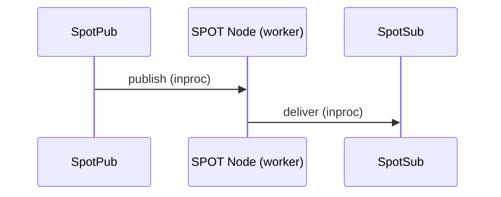
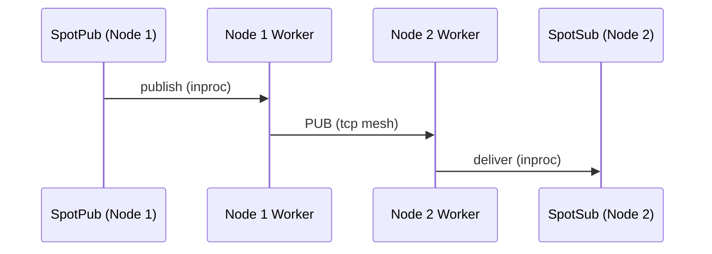
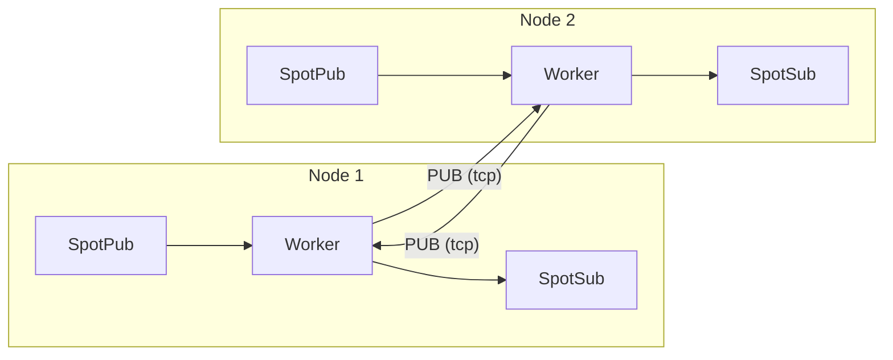
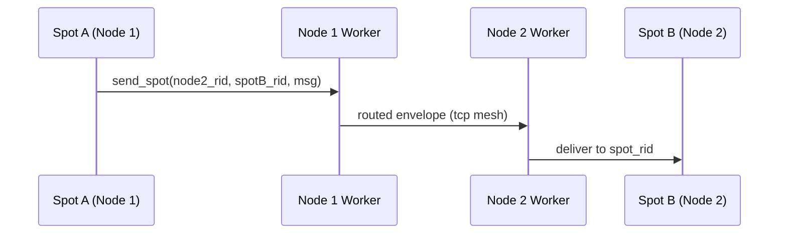
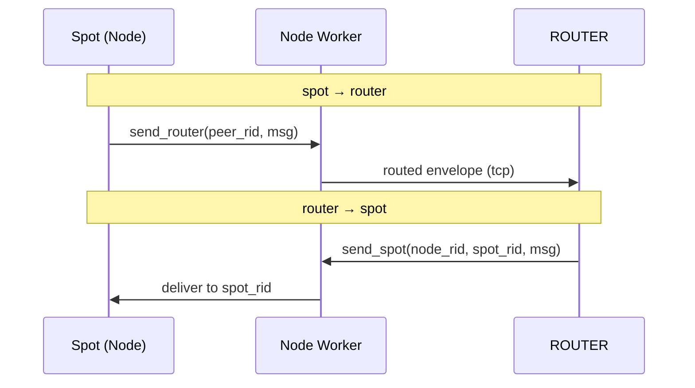
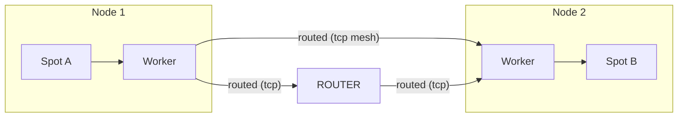
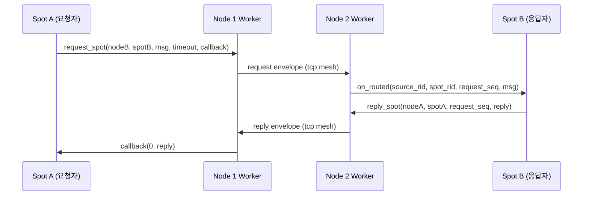
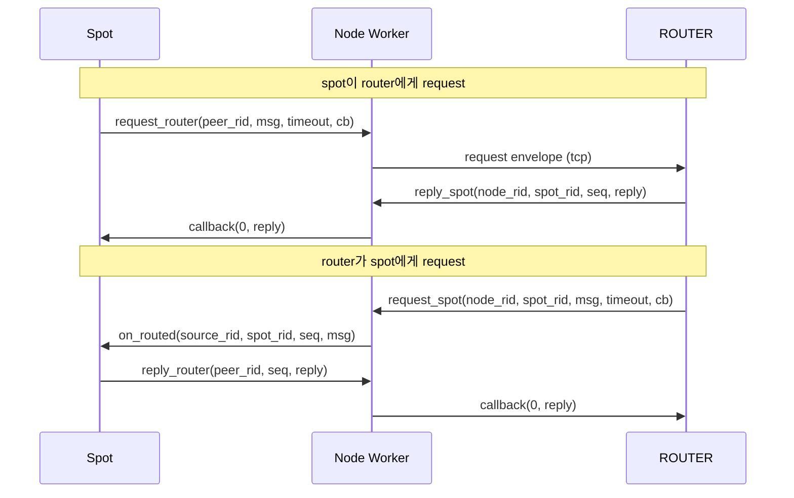

[English](07-3-spot.md) | [한국어](07-3-spot.ko.md)

# SPOT (위치투명 메시징)

> 이 가이드는 recv-first public surface 기준으로 작성되었다.
> `SpotNode`와 unified `Spot`은 recv 모드로 시작한다. topic/routed/timer
> readable 알림은 `zlink_spot_dispatch_event_handler()` 하나로 받고, 실제
> payload는 대응 recv 함수(`zlink_spot_subscribe()` /
> `zlink_spot_recv()` / `zlink_timer_recv()`)로 drain한다. routed 경로에는
> 기존 direct 수신 callback `zlink_spot_handler()`도 여전히 설치할 수
> 있다.

## 1. 개요

SPOT은 위치 투명한 메시징 시스템으로 두 가지 전달 경로를 제공한다:

1. **토픽 PUB/SUB** -- 토픽 매칭을 통한 클러스터 전체 발행/구독
2. **Routed (직접)** -- 주소 기반으로 특정 SPOT 또는 ROUTER에 직접 전달

두 경로 모두 동일한 SpotNode mesh 인프라를 공유한다. 토픽 메시지와 routed 메시지는
별도 채널이며 독립된 수신 surface를 가진다.

SPOT이 없다면, 여러 노드에 걸친 토픽 기반 메시징을 사용하는 애플리케이션은 어떤 노드에 구독자가 있는지 직접 추적하고, PUB/SUB mesh 연결을 관리하고, 구독 포워딩을 처리해야 한다. SPOT은 이를 자동화한다 -- 어떤 노드에서든 토픽에 publish하면, 클러스터 전체의 모든 구독자가 메시지를 수신한다. Routed 경로는 ROUTER/DEALER 소켓을 수동으로 구성하지 않고도 직접 전달과 request-reply를 추가한다.

> **명칭에 대하여**: SPOT은 "위치(spot)"에서 유래한 이름이다. 각 객체(노드)가 자신의 위치에서 토픽을 발행하고, 다른 위치의 토픽을 구독하는 객체 단위의 위치투명한(location-transparent) pub/sub 메시 시스템이다.

### 핵심 용어

| 용어 | 설명 |
|------|------|
| **SPOT Node** | Mesh 참여 에이전트 (노드별 1개) |
| **SPOT Pub** | 토픽 발행 경로 (`spot` / `spot_node`의 핫 패스(hot path, 고빈도 데이터 경로)) |
| **SPOT Sub** | 토픽 구독/수신 핸들 |
| **Topic** | 문자열 키 기반 메시지 채널 (토픽 경로) |
| **Pattern** | 접두어 + `*` 와일드카드 구독 |
| **Handler** | callback 수신 시 자동 호출되는 콜백 함수 |
| **Routed** | 주소 기반으로 특정 SPOT 또는 ROUTER에 직접 전달하는 경로 |
| **node_rid** | SpotNode 수준 routing_id (mesh 내 노드 식별자) |
| **spot_rid** | SPOT handle별 routing_id (개별 객체 식별자) |
| **request_seq** | request-reply 상관 시퀀스 번호 (`0` = 일반 routed 메시지) |

## 2. 아키텍처

### 로컬 publish — 같은 노드 안에서 전달



SpotPub이 publish하면 SPOT Node 내부 worker가 받아서 같은 노드의 SpotSub에게
바로 전달한다. SpotSub은 callback 또는 recv 두 가지 방식으로 메시지를 수신할 수
있다.

### 원격 전파 — 클러스터 노드 간 전달



로컬 publish는 worker가 두 갈래로 분기한다:
1. 같은 노드의 SpotSub에게 전달 (위의 로컬 경로)
2. mesh PUB 소켓으로 원격 노드에 송출

원격 노드의 worker는 mesh에서 수신한 메시지를 자기 SpotSub에게만 전달하고,
**다시 mesh로 재발행하지 않는다** (루프 방지).

### 전체 구조 요약



- 각 Node의 worker는 **PUB 소켓**으로 송출하고, 다른 노드의 **SUB 소켓**으로 수신한다
- 로컬 publish만 mesh로 나가고, 원격 수신은 재발행하지 않는다 (루프 방지)
- Discovery 연결 시 이 mesh 토폴로지가 자동 구성된다

> 내부 소켓 배선과 데이터 플레인 상세는
> [SPOT 내부 구조](../internals/spot-internals.ko.md)를 참고.

**예시:** 노드 1이 토픽 `price.USD.JPY`를 publish한다. 노드 2에는 `price.*` 구독자가 있다.

1. 노드 1의 SpotPub이 로컬 SPOT worker에게 메시지를 전송한다.
2. Worker가 `price.*`에 매칭되는 로컬 SpotSub에게 전달한다 (로컬 경로).
3. Worker가 PUB 소켓을 통해 tcp로 노드 2에 송출한다.
4. 노드 2의 worker가 SUB로 수신하여, `price.*`에 매칭한 뒤 SpotSub에게 전달한다.
5. 노드 2에서 mesh로 재발행하지 않는다 (루프 방지).

## 3. SPOT Node 설정

### 3.0 핵심 멘탈 모델 — SpotNode는 여러 서비스의 허브다

**하나의 `SpotNode`는 여러 개의 외부 서비스와 동시에 연결된다.** 각 서비스는
`service_name`이라는 문자열로 식별되며, 그 아래에 ROUTER, 또는 PUB+SUB 한 쌍,
또는 ROUTER+PUB+SUB 세 가지 중 하나의 attachment 구성을 가진다. `SpotNode`는
이 서비스별 attachment를 `service attachment table`에 모아 관리하고, 그 위에
올라가는 공개 `Spot` facade 하나가 모든 서비스와 통신하는 창구가 된다.

```text
+------------------------------------------------------------------+
|                         SpotNode (hub)                           |
|------------------------------------------------------------------|
|                       service attachment table                   |
|                                                                  |
|  service_name = "orders-exec"   -> { ROUTER }                    |
|  service_name = "market-data"   -> { PUB, SUB }                  |
|  service_name = "billing"       -> { ROUTER, PUB, SUB }          |
|                                                                  |
|                               ^                                  |
|                               | single public facade             |
|                               |                                  |
|                +---------------------------+                     |
|                |       Spot (facade)       |                     |
|                |                           |                     |
|                |  spot_send_service(...)   |                     |
|                |  spot_request_service(...)|                     |
|                |  spot_publish(...)        |                     |
|                |  spot_subscribe(...)      |                     |
|                +---------------------------+                     |
+------------------------------------------------------------------+
```

위 구조의 요점:

- 한 `SpotNode`에 서로 다른 `service_name`을 여러 개 등록할 수 있다. 예를
  들어 `orders-exec`(routed only), `market-data`(pub/sub only),
  `billing`(routed + pub/sub)을 동시에 올려 둘 수 있다.
- 같은 `service_name` 아래에 여러 개의 ROUTER를 attach할 수도 있다. 이 경우
  `zlink_spot_send_service()` / `zlink_spot_request_service()`가 active+
  send-ready ROUTER 중 하나를 round-robin으로 고른다.
- **pub/sub는 반드시 쌍으로 등록**한다. PUB만 있거나 SUB만 있는 서비스는
  허용하지 않는다. 이 제약은 Discovery attach와 수동 attach 모두에 적용된다.
- `Spot` facade는 **node당 하나**만 허용된다. service-aware attachment가 붙은
  node에 두 번째 `zlink_spot_new(node)`를 호출하면 `EBUSY`로 실패한다. 반대로
  이미 facade가 둘 이상 만들어진 node에는 service-aware attach 함수군이
  `EBUSY`로 실패한다.

### 3.0.1 서비스를 등록하는 두 가지 방법

서비스별 router/pub/sub attachment는 두 경로 중 하나로 올라간다. 두 경로를
같은 node에서 섞어 쓰는 것도 허용된다.

| 방법 | 설명 | 사용 함수 |
|------|------|-----------|
| **수동 attach** | 호출자가 외부 소켓(ROUTER / PUB / SUB)을 직접 만들어 `service_name`과 함께 등록한다. 테스트, 고정 토폴로지, 부트스트랩 서비스에 적합하다. | `zlink_spot_node_attach_router()`, `zlink_spot_node_attach_pubsub()` |
| **Discovery attach** | Discovery handle을 서비스별로 만들어 붙이면, Registry가 알려 주는 provider가 자동으로 service attachment table에 ROUTER/PUB/SUB 소스로 들어온다. 운영 토폴로지에 적합하다. | `zlink_spot_node_attach_discovery()` |

자동 attach에서도 같은 규칙이 적용된다. `router`만 있는 서비스는 허용,
`router + pub + sub`도 허용, `pub + sub`만 있는 서비스도 허용, 그러나
`pub` xor `sub` 상태인 서비스(한쪽만 살아 있는 pub/sub)는 attach 시점에서
거부된다.

각 방법의 구체적인 사용은 §3.1 Discovery 기반 자동 Mesh와 §3.1a 수동 service
attach에서 다룬다.

### 3.1 Discovery 기반 자동 Mesh

Discovery 기반 등록은 **서비스마다 아래 4단계를 따로 반복**한다. 각 서비스의
ROUTER 또는 PUB/SUB를 먼저 만들어 그 서비스 전용 Discovery에 붙여 둔 뒤,
마지막에 `SpotNode`에 그 Discovery들을 하나씩 attach하면 된다.

1. 그 서비스에서 쓸 raw socket(ROUTER 또는 PUB/SUB)을 만든다.
2. `ZLINK_SERVICE_TYPE_SOCKET` + 해당 `service_name`으로 Discovery handle을
   만든다. Registry에 연결한다.
3. `zlink_socket_attach_discovery(socket, discovery)`로 socket을 그 Discovery에
   소속시킨다. 이때부터 Discovery가 이 socket의 lifecycle을 소유하고,
   Registry에는 이 서비스의 provider로 등록된다.
4. `SpotNode`를 만들고 bind한 뒤, 위에서 만든 Discovery들을
   `zlink_spot_node_attach_discovery(node, discovery)`로 차례로 붙인다.

아래는 한 node가 `orders-exec`(ROUTER only)와 `market-data`(PUB+SUB)
두 서비스를 동시에 운용하는 예다.

```c
void *ctx = zlink_ctx_new();

/* ---- Service 1: orders-exec (routed only) ---- */

/* 1. Build the ROUTER socket this process provides under "orders-exec" */
void *orders_router = zlink_socket(ctx, ZLINK_SOCKET_ROUTER);
zlink_bind(orders_router, "tcp://*:9001");

/* 2. Open a Discovery view scoped to this service */
void *orders_discovery = zlink_discovery_new(ctx,
    ZLINK_SERVICE_TYPE_SOCKET, "orders-exec");
zlink_discovery_connect_registry(orders_discovery,
    "tcp://registry1:5551");

/* 3. Attach the socket to its Discovery — now Discovery owns the socket
 *    lifecycle and advertises it as an "orders-exec" ROUTER provider. */
zlink_socket_attach_discovery(orders_router, orders_discovery);

/* ---- Service 2: market-data (pub+sub pair) ---- */

void *prices_pub = zlink_socket(ctx, ZLINK_SOCKET_PUB);
void *prices_sub = zlink_socket(ctx, ZLINK_SOCKET_SUB);
zlink_bind(prices_pub, "tcp://*:9002");
/* SUB does not bind; Discovery will connect it to other "market-data"
 * PUB providers as they appear. */

void *prices_pub_discovery = zlink_discovery_new(ctx,
    ZLINK_SERVICE_TYPE_SOCKET, "market-data");
zlink_discovery_connect_registry(prices_pub_discovery,
    "tcp://registry1:5551");

void *prices_sub_discovery = zlink_discovery_new(ctx,
    ZLINK_SERVICE_TYPE_SOCKET, "market-data");
zlink_discovery_connect_registry(prices_sub_discovery,
    "tcp://registry1:5551");

zlink_socket_attach_discovery(prices_pub, prices_pub_discovery);
zlink_socket_attach_discovery(prices_sub, prices_sub_discovery);

/* ---- SpotNode: bind, then attach each service's Discovery ---- */

void *node = zlink_spot_node_new(ctx);
zlink_spot_node_bind(node, "tcp://*:9000");

zlink_spot_node_attach_discovery(node, orders_discovery);
zlink_spot_node_attach_discovery(node, prices_pub_discovery);
zlink_spot_node_attach_discovery(node, prices_sub_discovery);
```

위 예의 포인트:

- `ZLINK_SERVICE_TYPE_SOCKET`을 쓴다. raw socket-as-service를 발견·등록하는
  Discovery 타입이다. (SpotNode 자체의 mesh peer 발견을 쓰던 옛
  `ZLINK_SERVICE_TYPE_SPOT` 경로와 다르다.)
- `zlink_socket_attach_discovery()`가 socket을 Discovery에 **소속시키는**
  필수 중간 단계다. 이걸 건너뛰면 Registry에 provider로 올라가지 않고,
  SpotNode에 attach_discovery해도 그 서비스에는 들어오는 attachment가 없다.
- pub/sub 서비스는 PUB와 SUB가 **둘 다 같은 `service_name`**을 공유하도록
  Discovery를 각각 만든다. 서비스 구성이 pub xor sub(한쪽만 존재) 상태이면
  `attach_discovery`가 `INVALID_ARGUMENT`로 거부된다.
- 같은 node에 서로 다른 `service_name`의 Discovery를 여러 개 attach할 수
  있다. 같은 `service_name` Discovery를 한 node에 두 번 attach하면 `EBUSY`로
  실패한다.
- Discovery가 공급하는 자동 attachment는 `SpotNode`의 service attachment
  table에 ROUTER/PUB/SUB 자동 source로 들어간다. 이 상태에서
  `zlink_spot_new(node)`로 facade를 만들면
  `zlink_spot_send_service(spot, "orders-exec", ...)`이나
  `zlink_spot_publish(spot, "market-data", ...)`로 서비스 이름만으로 송수신할
  수 있다.

> Discovery가 provider 목록과 pairwise initiator를 계산하는 방식은
> [Discovery 내부 구조](../internals/discovery-internals.ko.md)를 참고한다.

### 3.1a 수동 service attach

서비스 socket을 직접 만들어 attach하는 경우:

```c
/* Routed 전용 서비스: ROUTER 하나만 attach */
void *orders_router = zlink_socket(ctx, ZLINK_SOCKET_ROUTER);
zlink_bind(orders_router, "tcp://*:9001");
zlink_spot_node_attach_router(node, "orders-exec", orders_router);

/* pub/sub 서비스: PUB와 SUB를 반드시 한 쌍으로 attach */
void *prices_pub = zlink_socket(ctx, ZLINK_SOCKET_PUB);
void *prices_sub = zlink_socket(ctx, ZLINK_SOCKET_SUB);
zlink_bind(prices_pub, "tcp://*:9002");
zlink_connect(prices_sub, "tcp://peer:9002");
zlink_spot_node_attach_pubsub(node, "market-data",
                              prices_pub, prices_sub);
```

- attach는 소유권을 가져오지 않는다. `SpotNode` destroy가 수동 attach된
  소켓을 함께 destroy하지 않는다. 소켓 lifecycle은 호출자가 직접 관리한다.
- 같은 소켓을 두 서비스에 중복 attach하는 것은 금지한다.
- pub 따로 / sub 따로 attach하는 표면은 없다. pub/sub 경로를 쓰려면 둘을
  한 번에 넘긴다.

> `SpotNode`는 mesh 참여를 위한 토폴로지 및 라이프사이클 소유자이다.
> 범용 데이터 플레인(data plane, 실제 메시지가 흐르는 경로) facade(publish/subscribe)를 노출하지 않는다.
> publish/subscribe를 사용하려면 `zlink_spot_new(node)`로 facade를 만든다.

**주의:** `attach_discovery()`는 bind 이후에 호출하는 것을 권장한다.
Discovery가 attach되면 Registry를 통해 자동으로 peer를 발견하고 연결한다.

> Discovery가 mesh를 구성하는 방식은
> [Discovery 내부 구조](../internals/discovery-internals.ko.md)를 참고.

**임시 포트:** `zlink_spot_node_bind()`는 포트 0을 지원하여 OS가 포트를
자동 할당한다. `zlink_spot_node_status_snapshot()`의 `local_endpoint`로
실제 할당된 endpoint를 조회할 수 있다:

```c
zlink_spot_node_bind(node, "tcp://127.0.0.1:0");
zlink_spot_node_status_t status;
zlink_spot_node_status_snapshot(node, &status);
/* status.local_endpoint contains e.g. "tcp://127.0.0.1:43521" */
```

### 3.2 수동 Mesh

```c
void *node = zlink_spot_node_new(ctx);
zlink_spot_node_bind(node, "tcp://*:9000");

/* Directly connect to other nodes' PUB */
zlink_spot_node_connect_peer(node, "tcp://node2:9000");
zlink_spot_node_connect_peer(node, "tcp://node3:9000");
```

**주의:** 수동 Mesh에서는 Discovery가 없으므로 Registry topology visibility도
없다. 이는 의도된 제한이다.

## 4. Unified SPOT 사용

### 4.1 생성

```c
void *spot = zlink_spot_new(node);
```

`zlink_spot_new(node)`는 기존 spot node를 빌리는 unified facade를
생성한다. publish와 subscribe를 함께 제공한다. public standalone
`spot_pub` / `spot_sub` 생성자는 제공하지 않는다.

transport security는 unified `spot`에서 설정하지 않는다. `tls://` 또는
`wss://`를 써야 하면 먼저 backing `SpotNode`에 TLS를 설정해야 한다.
unified `spot` 내부의 `inproc` 연결은 TLS 설정 surface가 아니다.

### 4.2 발행

```c
zlink_msg_t part;
zlink_msg_init_size(&part, 11);
memcpy(zlink_msg_data(&part), "hello world", 11);
zlink_publish(spot, "chat:room1:message", &part, 1, 0);
```

### 4.3 구독 / 해제

```c
zlink_set_subscription(spot, "chat:room1:message");
zlink_set_subscription(spot, "chat:room1:*");

zlink_unset_subscription(spot, "chat:room1:message");
zlink_unset_subscription(spot, "chat:room1:*");
```

### 4.4 메시지 수신

`SpotNode`와 unified `Spot` 모두 **recv 모드**로 시작한다. 메시지를 직접
수신하거나, receive surface를 **callback 모드**로 한 번 전환할 수 있다.
send-ready는 별도 축이다.

#### Recv 모드 (기본)

recv 모드에서는 `zlink_subscribe()`로 메시지를 직접 수신한다.

```c
void *spot = zlink_spot_new(node);
zlink_set_subscription(spot, "chat:room1:message");

/* Pull next message */
zlink_routing_id_t source_rid;
zlink_msg_t *parts = NULL;
size_t part_count = 0;
char topic_buf[256];
size_t topic_len = sizeof(topic_buf);
zlink_recv_result_t rc = zlink_subscribe(
    spot, &source_rid, &parts, &part_count,
    topic_buf, &topic_len, 0 /* flags */);
if (rc == ZLINK_RECV_OK) {
    printf("Topic: %.*s, Parts: %zu\n",
           (int)topic_len, topic_buf, part_count);
    for (size_t i = 0; i < part_count; i++)
        zlink_msg_close(&parts[i]);
}
```

<details>
<summary>Full Sample Code</summary>

| Language | Source |
|----------|--------|
| C | [spot_recv_sample.c](https://github.com/kairos-code-dev/zlink/blob/main/core/samples/spot_recv_sample.c) |
| C++ | [spot_recv_sample.cpp](https://github.com/kairos-code-dev/zlink/blob/main/bindings/cpp/samples/spot_recv_sample.cpp) |
| Java | [SpotRecvSample.java](https://github.com/kairos-code-dev/zlink/blob/main/bindings/java/samples/Zlink.Samples/src/main/java/dev/kairoscode/zlink/samples/SpotRecvSample.java) |
| Python | [spot_recv.py](https://github.com/kairos-code-dev/zlink/blob/main/bindings/python/examples/spot_recv.py) |
| Node | [spot_recv_sample.ts](https://github.com/kairos-code-dev/zlink/blob/main/bindings/node/examples/spot_recv_sample.ts) |
| C# | [Program.cs](https://github.com/kairos-code-dev/zlink/blob/main/bindings/dotnet/samples/SpotRecv/Program.cs) |
| Rust | [spot_recv_sample.rs](https://github.com/kairos-code-dev/zlink/blob/main/bindings/rust/samples/spot_recv_sample.rs) |
| Go | [main.go](https://github.com/kairos-code-dev/zlink/blob/main/bindings/go/samples/spot_recv_sample/main.go) |

</details>

#### Callback 모드

`zlink_spot_dispatch_event_handler()`를 호출하면 topic/routed/timer readable
알림이 단일 event callback으로 들어온다. callback은 event kind만 알려주고,
실제 topic payload는 callback 안에서 `zlink_spot_subscribe()` /
`zlink_subscribe()`로 drain한다.

```c
static void on_spot_event(void *spot,
                          zlink_spot_dispatch_event_t event,
                          void *userdata)
{
    if (event != ZLINK_SPOT_DISPATCH_EVENT_SUBSCRIBE_READABLE)
        return;
    for (;;) {
        zlink_routing_id_t src;
        zlink_msg_t *parts = NULL;
        size_t part_count  = 0;
        char topic[256];
        size_t topic_len = sizeof(topic);
        zlink_recv_result_t rc = zlink_subscribe(
            spot, &src, &parts, &part_count,
            topic, &topic_len, ZLINK_DONTWAIT);
        if (rc != ZLINK_RECV_OK) break;
        /* topic 메시지 처리 */
        zlink_multipart_close(parts, part_count);
    }
}

void *spot = zlink_spot_new(node);
zlink_set_subscription(spot, "chat:room1:message");
zlink_spot_dispatch_event_handler(spot, on_spot_event, NULL);
```

실전 패턴(알림 + 단일 워커 루프)은 §7.2를 참고한다.

<details>
<summary>Full Sample Code</summary>

| Language | Source |
|----------|--------|
| C | [spot_callback_sample.c](https://github.com/kairos-code-dev/zlink/blob/main/core/samples/spot_callback_sample.c) |
| C++ | [spot_callback_sample.cpp](https://github.com/kairos-code-dev/zlink/blob/main/bindings/cpp/samples/spot_callback_sample.cpp) |
| Java | [SpotCallbackSample.java](https://github.com/kairos-code-dev/zlink/blob/main/bindings/java/samples/Zlink.Samples/src/main/java/dev/kairoscode/zlink/samples/SpotCallbackSample.java) |
| Python | [spot_callback.py](https://github.com/kairos-code-dev/zlink/blob/main/bindings/python/examples/spot_callback.py) |
| Node | [spot_callback_sample.ts](https://github.com/kairos-code-dev/zlink/blob/main/bindings/node/examples/spot_callback_sample.ts) |
| C# | [Program.cs](https://github.com/kairos-code-dev/zlink/blob/main/bindings/dotnet/samples/SpotCallback/Program.cs) |
| Rust | [spot_callback_sample.rs](https://github.com/kairos-code-dev/zlink/blob/main/bindings/rust/samples/spot_callback_sample.rs) |
| Go | [main.go](https://github.com/kairos-code-dev/zlink/blob/main/bindings/go/samples/spot_callback_sample/main.go) |

</details>

**중요:** 하나의 `spot` / `spot_node` handle을 여러 스레드에서 동시에
사용할 수 있다 (thread-safe). `publish`는 핫 패스로서
여러 스레드에서 동시 호출을 허용하고, subscribe/unsubscribe/attach/peer
connect/monitor는 제어 경로(control path)로 호출할 수 있다. 다만
callback은 I/O 경로에서 직접 호출되므로, 느린 처리는 사용자 queue로 넘겨 별도
thread에서 처리하는 편이 안전하다.

## 4a. Service-aware 송수신

service attachment가 붙어 있을 때는 `service_name`으로 바로 송신하고,
수신 시에도 어느 서비스에서 온 메시지인지 함께 돌려받는 표면을 쓴다.

### 4a.1 service 기반 송신 / publish

```c
/* routed 서비스: 같은 서비스의 ROUTER 중 하나가 round-robin으로 선택된다 */
zlink_msg_t cmd;
zlink_msg_init_size(&cmd, 13);
memcpy(zlink_msg_data(&cmd), "place_order:1", 13);
zlink_submit_result_t rc = zlink_spot_send_service(
    spot, "orders-exec", &cmd, 1, 0);

/* request_service: reply는 같은 ingress ROUTER 경로로 pinning된다 */
rc = zlink_spot_request_service(
    spot,
    "orders-exec",
    &cmd, 1,
    on_order_reply,
    NULL,
    0 /* flags */,
    2000 /* timeout_ms */);

/* service 기반 publish */
zlink_msg_t tick;
zlink_msg_init_size(&tick, 20);
memcpy(zlink_msg_data(&tick), "USD/JPY=151.24 09:15", 20);
rc = zlink_spot_publish(
    spot, "market-data", "quotes.fx.usdjpy", &tick, 1, 0);
```

- 지정한 `service_name`에 attachment가 없으면 `NOT_FOUND`.
- attachment는 있으나 지금 쓸 수 있는 active 경로가 없으면
  `NOT_CONNECTED`로 정규화된다. (이는 HWM에 걸린 `BACKPRESSURED`와 다르다.)
- pub/sub는 pair 전체가 active일 때만 publish가 성공한다. Discovery churn
  으로 짝이 깨지면 그 서비스의 publish는 `NOT_CONNECTED`로 실패하고, 짝이
  복구되면 `set_subscription()`으로 등록해 둔 filter가 자동 replay된 뒤
  다시 active가 된다.

### 4a.2 service 기반 수신

```c
zlink_routing_id_t src;
zlink_msg_t *parts = NULL;
size_t part_count  = 0;
char service[128];  size_t service_len = sizeof(service);
char topic[256];    size_t topic_len   = sizeof(topic);

zlink_recv_result_t rc = zlink_spot_subscribe(
    spot,
    &src,
    &parts, &part_count,
    service, &service_len,
    topic, &topic_len,
    ZLINK_DONTWAIT);
if (rc == ZLINK_RECV_OK) {
    /* service 이름으로 디스패치 */
    zlink_multipart_close(parts, part_count);
}
```

- pub/sub 경로의 `source_rid`(`src`)는 비어 있을 수 있다. 응용은
  `service_name`과 `topic`을 기본 식별 메타데이터로 다룬다.
- subscription filter는 `Spot` facade 전체에서 합집합으로 계산된다.
  `zlink_set_subscription(spot, filter)` 하나가 현재 붙어 있는 모든 service
  SUB에 반영된다.
- subscribe 이벤트(subscribe/unsubscribe 통지)는
  `zlink_spot_subscription_event()`로 뽑는다. 이 함수도 `service_name`과
  `topic`을 함께 돌려준다.

### 4a.3 readable 알림과 통합 callback

service-aware subscribe/routed 수신 readable 알림은 기존과 같이
`zlink_spot_dispatch_event_handler()` 하나로 받는다. event kind가
플레인(Plane)을 가리키고, 실제 payload는 해당 recv 함수로 drain한다.

```text
SUBSCRIBE_READABLE -> zlink_spot_subscribe()
                      또는 zlink_spot_subscription_event()
ROUTED_READABLE    -> zlink_spot_recv()
TIMER_READABLE     -> zlink_timer_recv()
```

reply 주소는 request 수신 시 받은 ingress ROUTER 경로에 고정된다.
service 이름만으로 새로 round-robin을 돌리지 않는다.

### 4a.4 service-aware monitor

서비스별 attachment 상태는 아래 두 소스에서 관찰한다.

- `zlink_spot_node_service_attachment_count()` /
  `zlink_spot_node_service_attachment_at()` —
  `zlink_spot_service_attachment_stats_t`로 서비스별 수동/자동 attachment
  수를 반환한다.
- `zlink_spot_node_monitor_recv()` — attachment별 monitor event를
  `service_name` + role(`ROUTER` / `PUB` / `SUB`) 태그와 함께 돌려준다.

service-aware monitor event는 `zlink_spot_dispatch_event_handler()`의
readable plane에 섞이지 않는다. monitor는 `SpotNode`가 소유한다.

## 5. Routed (직접) 메시징

Routed 메시징은 토픽 매칭을 거치지 않고 주소로 특정 SPOT handle 또는 ROUTER
소켓에 직접 메시지를 전달한다. 토픽 pub/sub 경로와 별개다.

> SPOT routed envelope wire 형식은
> [ZMP 프로토콜](../internals/protocol-zmp.ko.md)을 참고.

### 주소 모델

Routed 메시지는 2단계 주소를 사용한다: **node_rid** (어떤 SpotNode)와
**spot_rid** (해당 노드의 어떤 SPOT handle). ROUTER에 보낼 때는
`peer_rid`만 필요하다.

```text
토픽 경로:     publish("price:USD:JPY", ...) → 매칭되는 모든 구독자
Routed 경로:   send_spot(dest_node_rid, dest_spot_rid, ...) → 특정 대상 1개
```

### Routed 전달 흐름

#### spot → spot (같은 노드 / 다른 노드)



Spot A가 Spot B의 주소(node_rid + spot_rid)를 지정하면,
Node 1 worker가 mesh를 통해 Node 2로 전달하고,
Node 2 worker가 spot_rid로 정확한 Spot B에게 배달한다.

#### spot ↔ router (크로스 패턴)



SPOT과 일반 ROUTER 소켓 간에도 직접 메시지를 주고받을 수 있다.
ROUTER로 보낼 때는 `peer_rid`만 있으면 되고,
SPOT으로 보낼 때는 `node_rid + spot_rid` 2단계 주소가 필요하다.

#### 전체 Routed 구조 요약



- 토픽 경로(PUB/SUB)와 Routed 경로는 같은 mesh 인프라를 공유하지만 **독립된 채널**이다
- Routed 메시지는 토픽 매칭을 거치지 않고 주소로 직접 전달된다
- ROUTER 소켓은 SpotNode 없이도 Routed 경로에 참여할 수 있다

### 5.1 직접 송신

#### spot → spot

```c
zlink_msg_t part;
zlink_msg_init_size(&part, 13);
memcpy(zlink_msg_data(&part), "market_update", 13);

zlink_spot_send_spot(spot, &dest_node_rid, &dest_spot_rid, &part, 1, 0);
```

#### spot → router

```c
zlink_msg_t part;
zlink_msg_init_size(&part, 11);
memcpy(zlink_msg_data(&part), "status_ping", 11);

zlink_spot_send_router(spot, &peer_rid, &part, 1, 0);
```

#### router → spot

```c
zlink_msg_t part;
zlink_msg_init_size(&part, 12);
memcpy(zlink_msg_data(&part), "control_sync", 12);

zlink_router_send_spot(router, &dest_node_rid, &dest_spot_rid, &part, 1, 0);
```

### 5.2 Routed 수신

Routed 메시지는 토픽 구독 surface와 별개인 전용 routed 수신 surface로 받는다.

#### Pull 모드

```c
const zlink_routing_id_t *source_rid;
const zlink_routing_id_t *spot_rid;
uint64_t request_seq;
zlink_msg_t *parts;
size_t part_count;

zlink_recv_result_t rc = zlink_spot_recv(
    spot, &source_rid, &spot_rid,
    &request_seq, &parts, &part_count, 0 /* flags */);
if (rc == ZLINK_RECV_OK) {
    if (request_seq == 0) {
        /* 일반 routed 메시지 */
    } else {
        /* request-reply 메시지 — request_seq로 reply 필요 */
    }
    zlink_multipart_close(parts, part_count);
}
```

#### Callback 모드

```c
void on_routed(const zlink_routing_id_t *source_rid,
               const zlink_routing_id_t *spot_rid,
               uint64_t request_seq,
               zlink_msg_t *parts, size_t part_count,
               void *userdata)
{
    if (request_seq == 0) {
        /* 일반 routed 메시지 */
    } else {
        /* request — reply 필요 */
    }
    zlink_multipart_close(parts, part_count);
}

zlink_spot_handler(spot, on_routed, NULL);
```

**참고:** `zlink_spot_handler()` (routed direct)와
`zlink_spot_dispatch_event_handler()` (unified readable 알림)는 routed 축의
같은 slot을 공유하므로 동시에 설치할 수 없다. topic 경로는
`zlink_spot_dispatch_event_handler()`의 `SUBSCRIBE_READABLE` 알림으로 받은
뒤 `zlink_subscribe()`로 drain한다.

### 5.3 ROUTER가 SPOT으로부터 수신

ROUTER 소켓은 일반 ROUTER 트래픽과 동일한 단일 direct 수신 표면으로
SPOT 에서 오는 routed 메시지를 받는다. 별도의
`zlink_router_spot_handler()` / `zlink_router_spot_recv()` 계약은 없다.
`source_spot_rid` 가 비어 있지 않은지 확인해 SPOT 에서 온 트래픽을
구분한다.

```c
/* orders-exec ROUTER 는 poller loop 에서 routed 트래픽을 drain 한다. */
for (;;) {
    const zlink_routing_id_t *source_node_rid = NULL;
    const zlink_routing_id_t *source_spot_rid = NULL;
    uint64_t request_seq = 0;
    zlink_msg_t *parts = NULL;
    size_t part_count = 0;

    zlink_recv_result_t rr = zlink_router_recv(
      router,
      &source_node_rid,
      &source_spot_rid,
      &request_seq,
      &parts,
      &part_count,
      ZLINK_RECV_FLAGS_DONTWAIT);
    if (rr != ZLINK_RECV_OK) break;

    if (source_spot_rid && source_spot_rid->size > 0) {
        /* SPOT 에서 온 routed 트래픽. request_seq != 0 이면 reply 는
           zlink_router_reply_spot(router, source_node_rid,
                                   source_spot_rid, request_seq, ...)
           으로 보낸다. */
    } else {
        /* 일반 ROUTER 트래픽 (source_spot_rid 가 빈 id). */
    }
    zlink_multipart_close(parts, part_count);
}
```

자세한 표면 설명은 [ROUTER 가이드](03-4-router.ko.md)를 참고.

## 6. SPOT Request-Reply

SPOT 에서 특정 대상에게 응답을 기대하는 흐름은 topic publish 가 아니라
request-reply 전용 함수를 사용한다. 구현은 topic 본문에 표식을 넣지 않고,
와이어(wire, 프로토콜 전송 레벨) 위에서 `SPOT routed envelope -> request-reply envelope -> payload`
순서로 control part 를 붙인다.

### 6.0 Routed Mesh 경로

Routed 메시지는 **SpotNode mesh** 를 경유한다. `Spot` 은 사용자 대면 facade,
`SpotNode` 는 실제 mesh 참여 노드다. request/reply 는 양측의 SpotNode 를
서로 반대 방향으로 통과한다:

```
requester 측                            replier 측
┌──────┐   ┌───────────┐       ┌───────────┐   ┌──────┐
│ spot │──▶│ spot_node │──────▶│ spot_node │──▶│ spot │  (request)
└──────┘   └───────────┘       └───────────┘   └──────┘
   ▲             ▲                    │              │
   │             │                    │              │
   └─────────────┴────────────────────┴──────────────┘   (reply, 역방향)
```

- requester 의 `Spot` 은 `(dest_node_rid, dest_spot_rid)` 로 replier 를
  지정한다.
- 로컬 `SpotNode` 가 mesh 를 통해 대상 노드로 request 를 라우팅한다.
- 대상 `SpotNode` 가 target `Spot` 으로 전달한다.
- replier 의 reply 는 같은 경로를 역방향으로 되돌아온다.

위 mesh 경로는 **spot → spot** 전용이다. `spot → router`, `router → spot`
변형은 다른 경로를 거친다: spot 측은 여전히 로컬 `SpotNode` 를 경유하지만,
router 측은 SpotNode 에 ROUTER 피어로 직접 transport 연결한다 (mesh-to-mesh
홉 없음). 각 변형별 라우팅 경로 상세는
`doc/internals/spot-internals.md` 를 참조한다.

### Request-Reply 흐름

#### spot → spot request-reply



1. Spot A가 `request_spot`으로 메시지를 보내고 reply callback을 등록한다.
2. Spot B의 handler에 `request_seq > 0`인 메시지가 도착한다.
3. Spot B가 `reply_spot`으로 같은 `request_seq`를 붙여 응답한다.
4. Spot A의 callback이 reply를 수신한다. timeout 내 reply가 없으면 error callback.

#### spot ↔ router request-reply



SPOT과 ROUTER 사이의 request-reply도 동일한 패턴이다.
요청자는 `request_*`로 보내고, 수신자는 `reply_*`로 같은 `request_seq`를
붙여 응답한다.

### 6.1 spot -> spot request

```c
static void on_spot_reply(zlink_request_result_t result,
                          zlink_msg_t *parts,
                          size_t part_count,
                          void *userdata)
{
    if (result == ZLINK_REQUEST_OK)
        zlink_multipart_close(parts, part_count);
    /* 그 밖의 result 값: ZLINK_REQUEST_TIMED_OUT, NOT_FOUND,
       TERMINATED, PROTOCOL_ERROR */
}

zlink_msg_t req;
zlink_msg_init_size(&req, 4);
memcpy(zlink_msg_data(&req), "ping", 4);

/* 시그니처: (spot, dest_node_rid, dest_spot_rid, parts, count,
   handler, userdata, flags, timeout_ms) */
zlink_submit_result_t rc = zlink_spot_request_spot(
  spot,
  &dest_node_rid,
  &dest_spot_rid,
  &req,
  1 /* count */,
  on_spot_reply,
  NULL /* userdata */,
  0 /* flags */,
  1500 /* timeout_ms */);
if (rc != ZLINK_SUBMIT_OK) { /* submit 실패 처리 */ }
```

### 6.2 spot request handler 와 reply

```c
static void on_spot_request(const zlink_routing_id_t *source_node_rid,
                            const zlink_routing_id_t *source_spot_rid,
                            uint64_t request_seq,
                            zlink_msg_t *parts,
                            size_t part_count,
                            void *userdata)
{
    zlink_multipart_close(parts, part_count);

    zlink_msg_t reply;
    zlink_msg_init_size(&reply, 4);
    memcpy(zlink_msg_data(&reply), "pong", 4);

    zlink_spot_reply_spot(
      spot,
      source_node_rid,
      source_spot_rid,
      request_seq,
      &reply,
      1);
}

zlink_spot_handler(spot, on_spot_request, NULL);
```

reply 주소는 handler 인자로 받은 source 주소와 `request_seq` 를 그대로 써야
한다. 다른 값을 넣으면 pending request 와 매칭되지 않는다.

### 6.3 spot <-> router 조합

SPOT request-reply 는 일반 `ROUTER` 와도 직접 연결할 수 있다. ROUTER
측은 통합된 `zlink_router_recv()` 표면을 사용하며, SPOT 에서 시작된
트래픽은 `source_spot_rid` 가 채워진 것으로 구분한다.

- `spot -> router`: `zlink_spot_request_router()`,
  `zlink_router_recv()` (`source_spot_rid` 채워짐),
  `zlink_router_reply_spot()`
- `router -> spot`: `zlink_router_request_spot()`,
  `zlink_spot_handler()`,
  `zlink_spot_reply_router()`

이 조합에서도 완료 규칙은 같다. request 1건은 첫 reply 1건으로 끝나고,
추가 reply 는 무시된다.

### 6.4 SPOT Timer

SPOT timer는 SpotNode-local shared scheduler를 사용한다. 일반 timer와
동일한 recv/callback/poller 모델을 지원한다.

```c
void *spot_timer = zlink_spot_timer_new(spot);
zlink_timer_start(spot_timer, 100000000ULL, 0);  /* 100ms, 무한 반복 */

/* Pull 모드 */
uint64_t fire_count;
zlink_timer_recv(spot_timer, &fire_count);

/* 또는 callback 모드 */
zlink_timer_handler(spot_timer, on_fire, NULL);
```

### 핵심 규칙

| 규칙 | 설명 |
|------|------|
| `request_seq=0` | 일반 routed 메시지 (request 아님) |
| `request_seq>0` | request-reply 메시지; reply 필요 |
| 첫 reply 우선 | 같은 `request_seq`에 대한 추가 reply는 드롭 |
| Timeout | reply callback 에 `result == ZLINK_REQUEST_TIMED_OUT` 으로 전달 |
| 대상 미발견 | `ZLINK_REQUEST_NOT_FOUND` reply (즉시, timeout 아님) |
| recv vs callback 충돌 | `ZLINK_RECV_BUSY` / `ZLINK_HANDLER_BUSY` 반환 |
| 토픽 vs routed | 별도 수신 surface; 둘 다 동시에 활성 가능 |

**제약 사항:**

- recv 모드에서는 `zlink_subscribe()` / `zlink_spot_subscribe()`를 사용한다
- topic/routed/timer readable 알림은 `zlink_spot_dispatch_event_handler()`로 받는다
- 활성 dispatch callback 문맥 밖에서 callback 모드가 걸린 경우, `zlink_subscribe()`와 데이터 플레인 `ZLINK_POLLIN`은 `ZLINK_RECV_BUSY`를 반환한다
- `zlink_send_ready_handler()`는 receive callback 선행 조건이 없다
- send-ready attach 이후 데이터 플레인 `ZLINK_POLLOUT` 은 `ZLINK_HANDLER_BUSY` 를 반환한다
- 전환 후 callback 교체나 해제는 지원하지 않는다
- 콜백은 소켓 dispatch / I/O 경로에서 직접 호출된다
- 콜백에서 블로킹 작업을 수행하면 다른 I/O 진행에 영향을 줄 수 있다
- 느린 처리가 필요하면 콜백 안에서 사용자 queue로 넘기고 별도 thread에서 처리한다
- `destroy`는 fail-fast lifecycle gate(사용 중이면 `EBUSY`, 종료 후 `ESHUTDOWN`)를 가지므로, 외부 사용을 중단한 뒤
  정리하는 것이 가장 단순하다

> 전체 three-tier 계약과 추가 패턴은 [스레드 안전성 가이드](11-thread-safety.ko.md)를 참고.

## 7. 통합 Dispatch 모델 — `zlink_spot_dispatch_event_handler`

하나의 `Spot` 핸들은 세 개의 독립된 이벤트 흐름을 다룬다.

1. **Topic 구독** — `zlink_subscribe()` 로 매칭되는 메시지
2. **Routed (직접 전달)** — `zlink_spot_recv()` 로 전달되는 메시지
3. **SPOT 범위의 타이머** — `zlink_spot_timer_new(spot)` 로 생성한 타이머

세 경로 각각에 direct callback (subscribe handler, routed handler, 그리고
타이머별 handler) 을 붙이면, 각 콜백이 서로 다른 내부 드라이버 — subscribe
plane 의 I/O 스레드, routed plane 의 dispatch 스레드, SpotNode-local 타이머
스케줄러 스레드 — 에서 호출된다. 결과적으로 애플리케이션 코드가 이
스레드들 사이의 동기화를 직접 책임져야 한다.

`zlink_spot_dispatch_event_handler()` 는 이 대신 단일 **알림 지점** 을
제공한다. 실제 데이터는 **애플리케이션 소유의 단일 스레드** 에서 pull
API 로 읽어간다. 타이머, routed recv, subscribe 를 한 워커에서 함께
처리하면서 사용자 코드에서의 스레드 경합을 없애고 싶을 때 권장되는
방식이다.

### 7.1 Event handler 계약

```c
typedef enum zlink_spot_dispatch_event_t
{
    ZLINK_SPOT_DISPATCH_EVENT_SUBSCRIBE_READABLE = 1,
    ZLINK_SPOT_DISPATCH_EVENT_ROUTED_READABLE    = 2,
    ZLINK_SPOT_DISPATCH_EVENT_TIMER_READABLE     = 3
} zlink_spot_dispatch_event_t;

typedef void (*zlink_spot_dispatch_event_handler_fn) (
    void *spot,
    zlink_spot_dispatch_event_t event,
    void *userdata);

zlink_handler_result_t zlink_spot_dispatch_event_handler (
    void *spot,
    zlink_spot_dispatch_event_handler_fn handler,
    void *userdata);
```

핵심 특성:

- **알림 전용.** 콜백은 메시지, 토픽, fire count 를 전달하지 않고 이벤트
  종류만 알린다. 이후 애플리케이션이 `zlink_subscribe()` /
  `zlink_spot_recv()` / `zlink_timer_recv()` 로 실제 데이터를 pull 한다.
- **`Spot` 당 한 개.** `zlink_spot_dispatch_event_handler()` 와
  `zlink_spot_handler()` (routed direct callback) 은 상호 배타이다. 둘 다
  설치하려 하면 `ZLINK_HANDLER_BUSY` 를 반환한다.
- **내부 스레드에서 발생.** event handler 는 readable 신호를 만든 내부
  스레드에서 호출된다 (subscribe/routed 는 I/O 스레드, 타이머는
  SpotNode-local 스케줄러 스레드). handler 는 짧게 유지한다 — condition
  variable notify, eventfd write, 채널 push 정도가 적절하다. **event
  handler 안에서 `zlink_subscribe()` / `zlink_spot_recv()` /
  `zlink_timer_recv()` 를 호출하지 말고**, 애플리케이션 스레드에서 pull
  한다.
- **Level-triggered 의미.** handler 는 "무언가 readable 이다" 만 알리는
  수준이다. handler 가 도는 사이에 여러 메시지가 쌓였을 수 있으므로,
  애플리케이션 스레드는 해당 큐를 `ZLINK_RECV_NO_DATA` 가 될 때까지
  비워야 한다.
- **전환은 일방향.** dispatch event handler 를 설치하면 dispatch axis
  가 callback 모델로 전환된다. 해제나 교체는 지원하지 않는다.

### 7.2 권장 패턴: 알림 + 단일 워커 루프

```c
#include <zlink.h>
#include <pthread.h>
#include <stdatomic.h>

typedef struct {
    pthread_mutex_t mtx;
    pthread_cond_t  cv;
    atomic_int      pending;   /* 준비된 이벤트 비트마스크 */
    atomic_int      stopping;
} dispatch_wakeup_t;

enum { READY_SUBSCRIBE = 1 << 0,
       READY_ROUTED    = 1 << 1,
       READY_TIMER     = 1 << 2 };

static int event_to_bit (zlink_spot_dispatch_event_t event)
{
    switch (event) {
        case ZLINK_SPOT_DISPATCH_EVENT_SUBSCRIBE_READABLE:
            return READY_SUBSCRIBE;
        case ZLINK_SPOT_DISPATCH_EVENT_ROUTED_READABLE:
            return READY_ROUTED;
        case ZLINK_SPOT_DISPATCH_EVENT_TIMER_READABLE:
            return READY_TIMER;
    }
    return 0;
}

/* 내부 스레드에서 호출되는 알림 핸들러. 최소한의 작업만 한다. */
static void on_spot_event(void *spot,
                          zlink_spot_dispatch_event_t event,
                          void *userdata)
{
    dispatch_wakeup_t *w = userdata;
    atomic_fetch_or(&w->pending, event_to_bit(event));
    pthread_mutex_lock(&w->mtx);
    pthread_cond_signal(&w->cv);
    pthread_mutex_unlock(&w->mtx);
}

/* 애플리케이션이 소유하는 단일 워커 스레드. 모든 데이터 읽기를 담당. */
static void *spot_worker(void *arg)
{
    struct {
        void              *spot;
        void              *timer;
        dispatch_wakeup_t *w;
    } *ctx = arg;

    while (!atomic_load(&ctx->w->stopping)) {
        pthread_mutex_lock(&ctx->w->mtx);
        while (atomic_load(&ctx->w->pending) == 0
               && !atomic_load(&ctx->w->stopping)) {
            pthread_cond_wait(&ctx->w->cv, &ctx->w->mtx);
        }
        int ready = atomic_exchange(&ctx->w->pending, 0);
        pthread_mutex_unlock(&ctx->w->mtx);

        if (ready & READY_TIMER) {
            uint64_t fire_count;
            while (zlink_timer_recv(ctx->timer, &fire_count)
                   == ZLINK_RECV_OK) {
                /* 각 tick 처리 */
            }
        }
        if (ready & READY_ROUTED) {
            for (;;) {
                const zlink_routing_id_t *src_node;
                const zlink_routing_id_t *src_spot;
                uint64_t seq;
                zlink_msg_t *parts;
                size_t count;
                zlink_recv_result_t rc = zlink_spot_recv(
                    ctx->spot, &src_node, &src_spot, &seq,
                    &parts, &count, ZLINK_DONTWAIT);
                if (rc != ZLINK_RECV_OK) break;
                /* routed 메시지 처리, seq != 0 이면 reply */
                zlink_multipart_close(parts, count);
            }
        }
        if (ready & READY_SUBSCRIBE) {
            for (;;) {
                zlink_routing_id_t src;
                zlink_msg_t *parts;
                size_t count;
                char topic[256];
                size_t topic_len = sizeof(topic);
                zlink_recv_result_t rc = zlink_subscribe(
                    ctx->spot, &src, &parts, &count,
                    topic, &topic_len, ZLINK_DONTWAIT);
                if (rc != ZLINK_RECV_OK) break;
                /* 토픽 메시지 처리 */
                zlink_multipart_close(parts, count);
            }
        }
    }
    return NULL;
}

/* 설정 */
dispatch_wakeup_t wakeup = { /* init ... */ };
void *spot  = zlink_spot_new(node);
void *timer = zlink_spot_timer_new(spot);

zlink_set_subscription(spot, "chat:*");
zlink_spot_dispatch_event_handler(spot, on_spot_event, &wakeup);
zlink_timer_start(timer, 100 * 1000 * 1000ULL, 0);  /* 100ms 반복 */

pthread_t worker;
/* ...ctx 에 spot, timer, &wakeup 을 담아 워커 시작... */
pthread_create(&worker, NULL, spot_worker, /* ctx */);
```

### 7.3 스레드 경합이 사라지는 이유

| dispatch event handler 미사용 | dispatch event handler 사용 |
|---|---|
| Subscribe callback 이 I/O 스레드에서 실행 | I/O 스레드가 알림만 → 워커 스레드에서 pull |
| Routed handler 가 routed dispatch 스레드에서 실행 | Routed 스레드가 알림만 → 워커 스레드에서 pull |
| Timer handler 가 스케줄러 스레드에서 실행 | 스케줄러 스레드가 알림만 → 워커 스레드에서 pull |
| 세 개의 producer 스레드 사이 공유 상태를 사용자 코드가 직접 lock 으로 보호 | 모든 데이터 소비/처리가 애플리케이션 소유의 단일 스레드에서 이루어짐 |

세 내부 스레드는 작은 알림 함수 외에는 애플리케이션 로직에 들어오지
않는다. subscribe/recv/timer 데이터는 전부 단일 애플리케이션 스레드에서
읽히므로, 세 스트림 사이의 공유 상태에 대해 사용자 코드가 별도 동기화를
둘 필요가 없다.

### 7.4 병행 사용 규칙

| 조합 | 결과 |
|---|---|
| `zlink_spot_dispatch_event_handler` + `zlink_spot_handler` | 상호 배타 — 두 번째 설치 시 `ZLINK_HANDLER_BUSY` |
| `zlink_spot_dispatch_event_handler` + timer 의 `zlink_timer_handler` | 해당 타이머에는 자신의 handler 가 우선한다. direct timer handler 가 붙은 타이머는 `TIMER_READABLE` 을 발행하지 않는다. 타이머를 통합 dispatch 로 묶으려면 recv 모드로 둔다 |
| `zlink_spot_dispatch_event_handler` + `zlink_send_ready_handler` | 독립된 축. send-ready 는 자신의 handler 를 쓴다 |

> 이 이벤트가 내부에서 어떻게 생성되는지 스레딩 관점 상세는
> [SPOT Internals — Dispatch Event Threading Model](../internals/spot-internals.ko.md)
> 를 참고.

## 8. 토픽 규칙

### 명명 규칙

`<domain>:<entity>:<action>` 형식 권장.

예시:
- `chat:room1:message`
- `metrics:zone1:cpu`
- `game:world1:player_move`

### 패턴 구독 규칙

- `*`는 한 개만 허용, 문자열 끝에만
- 대소문자 구분
- 예: `chat:*` → `chat:room1:message`, `chat:room2:join` 모두 매칭

## 9. 토픽 vs Routed 선택 기준

| 기준 | 토픽 (pub/sub) | Routed (직접) |
|------|---------------|--------------|
| **수신 대상** | 매칭되는 모든 구독자 | 특정 대상 1개 |
| **주소 지정** | 토픽 문자열 (접두어 매칭) | node_rid + spot_rid (또는 peer_rid) |
| **전달 방식** | N개 수신자에게 fan-out | 점대점 (point-to-point) |
| **Request-reply** | 지원하지 않음 | 지원 (request_seq) |
| **사용 시점** | 시세 데이터, 이벤트, 알림 | 명령, 조회, RPC |

publisher가 누가 또는 몇 명이 수신하는지 상관없으면 **토픽**을 사용한다.
특정 SPOT handle 또는 ROUTER에 말을 걸고 응답을 기대하면 **routed**를 사용한다.

두 경로는 같은 SPOT handle에서 동시에 사용할 수 있다.

## 10. Peer Publish Batching

SpotNode는 노드 간 토픽 메시지 전달 경로에서 작은 메시지를 topic별로
모아 하나의 batch로 보내는 선택적 최적화를 지원한다.
receiver는 batch를 내부적으로 풀어서 application이 보는
publish/subscribe 계약은 변경되지 않는다.

### 활성화

## 11. 전달 보장

### 토픽 전달

- 로컬 publish는 로컬 subscriber에게 전달하고 원격 노드로 전파한다
- 원격에서 수신한 메시지는 로컬에서만 전달한다 (재전파하지 않음 — 루프 방지)
- `subscribe()` / `unsubscribe()` 반환은 로컬 필터 적용 의미이며,
  클러스터 전체 전파 완료를 반환 시점에 보장하지 않는다
- 같은 `spot` handle에서 연속 publish된 메시지의 순서는 보존된다
- 서로 다른 `spot` handle 사이의 전역 순서는 보장하지 않는다
- exact topic과 pattern이 둘 다 매칭되더라도 메시지는 1회만 전달된다

### Routed 전달

- 같은 프로세스 내 대상은 최적화된 로컬 경로를 사용한다
- 노드 간 전달은 토픽 메시지와 동일한 mesh transport를 사용한다
- 토픽과 routed 메시지 간 상대적 순서는 보장하지 않는다
- 같은 노드 쌍 간 순서는 보존한다 (best effort)

### SPOT이 보장하지 않는 것

SPOT은 live 메시징 시스템이며, 다음은 제공하지 않는다:
- Durable delivery 또는 메시지 영속화
- Ack/retry 또는 exactly-once
- Late joiner에 대한 과거 메시지 재전송

## 12. 정리

```c
zlink_spot_destroy(&spot);
zlink_spot_node_destroy(&node);
zlink_discovery_destroy(&discovery);
```

**정리 순서:** `spot`을 먼저 destroy하고, 그 다음 `SpotNode`, 마지막으로
`Discovery` 순서로 정리한다. `SpotNode` destroy 전에 관련 `spot`의 외부 사용을
중단해야 한다.

> `zlink_spot_destroy()`는 빌린 facade만 정리한다. backing `SpotNode`가
> lifecycle owner이며, Discovery에 attach된 spot node의 경우
> `zlink_discovery_destroy()`가 attach된 참여자에게 종료를 전파한다.

---
[← Discovery](07-1-discovery.ko.md) | [Registry →](07-4-registry.ko.md) | [Routing ID →](08-routing-id.ko.md)
