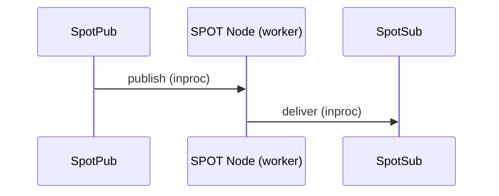
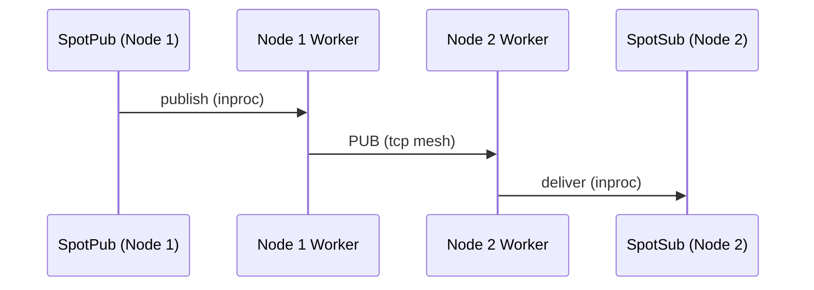
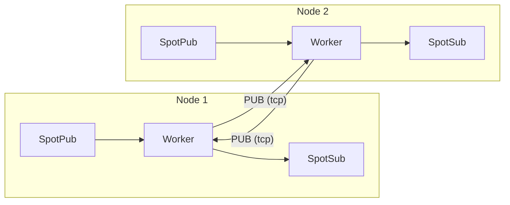

[English](07-3-spot.md) | [한국어](07-3-spot.ko.md)

# SPOT (Location-Transparent Messaging)

> **Normative status: Authoritative.**
> This guide reflects `core/include/zlink.h`.

> `SpotNode` and unified `Spot` start in recv model and use
> `zlink_subscribe_handler()` for the one-way transition to callback model
> (topic path), or `zlink_spot_handler()` for the routed path.

## 1. Overview

SPOT is a location-transparent messaging system that provides two delivery
paths:

1. **Topic PUB/SUB** -- publish/subscribe across the cluster via topic matching
2. **Routed (direct)** -- point-to-point delivery to a specific SPOT or ROUTER by address

Both paths share the same SpotNode mesh infrastructure. Topic and routed
messages are separate channels with independent receive surfaces.

Without SPOT, applications using topic-based messaging across multiple nodes would need to manually track which nodes have subscribers, manage PUB/SUB mesh connections, and handle subscription forwarding. SPOT automates this -- publish to a topic on any node, and all subscribers across the cluster receive the message. The routed path adds direct delivery and request-reply without requiring manual ROUTER/DEALER socket wiring.

> **About the name**: SPOT derives its name from "spot" (location). Each object (node) publishes topics from its own location and subscribes to topics from other locations, forming an object-level, location-transparent pub/sub mesh system.

### Core Terminology

| Term | Description |
|------|-------------|
| **SPOT Node** | Mesh participant agent (one per node) |
| **SPOT Pub** | Topic publishing path (the hot path of `spot` / `spot_node`) |
| **SPOT Sub** | Topic subscription/receive handle |
| **Topic** | String key-based message channel (topic path) |
| **Pattern** | Prefix + `*` wildcard subscription |
| **Handler** | Callback function automatically invoked on message receipt |
| **Routed** | Direct delivery path to a specific SPOT or ROUTER by address |
| **node_rid** | SpotNode-level routing_id (node identity in the mesh) |
| **spot_rid** | Per-SPOT-handle routing_id (individual object identity) |
| **request_seq** | Sequence number for request-reply correlation (`0` = ordinary routed message) |

## 2. Architecture

### Local publish — delivery within the same node



When SpotPub publishes, the SPOT Node's internal worker receives it and
delivers directly to SpotSub on the same node (via recv or callback, depending on the configured mode).

### Remote propagation — delivery across cluster nodes



The worker forks a local publish into two paths:
1. Delivers to SpotSub on the same node (local path above)
2. Sends to remote nodes via mesh PUB socket

The remote node's worker delivers mesh-received messages to its own SpotSub only;
it **never re-publishes to the mesh** (loop prevention).

### Full topology overview



- Each node's worker sends via **PUB socket** and receives from other nodes via **SUB socket**
- Only local publishes enter the mesh; remote receives are never re-published (loop prevention)
- When Discovery is attached, this mesh topology is configured automatically

> For internal socket wiring and data plane details, see
> [SPOT Internals](../internals/spot-internals.md).

**Example:** Node 1 publishes topic `price.USD.JPY`. Node 2 has a subscriber for `price.*`.

1. SpotPub on Node 1 sends the message to the local SPOT worker.
2. The worker delivers to any local SpotSub matching `price.*` (local path).
3. The worker also sends via the PUB socket over tcp to Node 2.
4. Node 2's worker receives via SUB, matches against `price.*`, and delivers to its SpotSub.
5. The message is NOT re-published to the mesh from Node 2 (loop prevention).

## 3. SPOT Node Setup

### 3.1 Discovery-Based Automatic Mesh

```c
void *ctx = zlink_ctx_new();

/* Discovery setup (peer discovery + registry uplink / heartbeat owner) */
void *discovery = zlink_discovery_new(ctx,
    ZLINK_SERVICE_TYPE_SPOT, "spot-node");
zlink_discovery_connect_registry(discovery, "tcp://registry1:5551");

/* SPOT Node setup */
void *node = zlink_spot_node_new(ctx);
zlink_spot_node_bind(node, "tcp://*:9000");

/* Attach Discovery */
zlink_spot_node_attach_discovery(node, discovery);
```

> `SpotNode` is the topology and lifecycle owner for mesh participation.
> It does not expose the generic data-plane facade (publish/subscribe).
> For publish/subscribe, create a facade with `zlink_spot_new(node)`.

**Note:** It is recommended to call `attach_discovery()` after bind.
Once Discovery is attached, peers are automatically discovered and
connected through the Registry.

> For how Discovery constructs the mesh, see
> [Discovery Internals](../internals/discovery-internals.md).

**Ephemeral port:** `zlink_spot_node_bind()` supports port 0 for dynamic
port allocation. Use `zlink_spot_node_status_snapshot()` to retrieve the
actual assigned endpoint from `local_endpoint`:

```c
zlink_spot_node_bind(node, "tcp://127.0.0.1:0");
zlink_spot_node_status_t status;
zlink_spot_node_status_snapshot(node, &status);
/* status.local_endpoint contains e.g. "tcp://127.0.0.1:43521" */
```

### 3.2 Manual Mesh

```c
void *node = zlink_spot_node_new(ctx);
zlink_spot_node_bind(node, "tcp://*:9000");

/* Directly connect to other nodes' PUB */
zlink_spot_node_connect_peer(node, "tcp://node2:9000");
zlink_spot_node_connect_peer(node, "tcp://node3:9000");
```

**Note:** In a manual mesh there is no Discovery, so there is no registry
topology visibility. This is an intended limitation.

## 4. Unified SPOT Usage

### 4.1 Create a unified handle

```c
void *spot = zlink_spot_new(node);
```

`zlink_spot_new(node)` creates a unified facade that borrows an existing
spot node. It provides both publish and subscribe behavior. There are no
public standalone `spot_pub` / `spot_sub` constructors.

Transport security is not configured through unified `spot`. If the service
must use `tls://` or `wss://`, configure TLS on the backing `SpotNode`
first. The internal `inproc` linkage inside unified `spot` is not a TLS
surface.

### 4.2 Publishing

```c
zlink_msg_t part;
zlink_msg_init_size(&part, 11);
memcpy(zlink_msg_data(&part), "hello world", 11);
zlink_publish(spot, "chat:room1:message", &part, 1, 0);
```

### 4.3 Subscribing and unsubscribing

```c
zlink_set_subscription(spot, "chat:room1:message");
zlink_set_subscription(spot, "chat:room1:*");

zlink_unset_subscription(spot, "chat:room1:message");
zlink_unset_subscription(spot, "chat:room1:*");
```

### 4.4 Receiving Messages

Both `SpotNode` and unified `Spot` start in **recv model**. You can either
pull messages directly or switch the receive surface once to **callback mode**.
Send-ready remains a separate axis.

#### Recv model (default)

In recv model, pull messages with `zlink_subscribe()`.

```c
void *spot = zlink_spot_new(node);
zlink_set_subscription(spot, "chat:room1:message");

/* Pull next message */
zlink_routing_id_t source_rid;
zlink_msg_t *parts = NULL;
size_t part_count = 0;
char topic_buf[256];
size_t topic_len = sizeof(topic_buf);
zlink_recv_result_t rc = zlink_subscribe(
    spot, &source_rid, &parts, &part_count,
    topic_buf, &topic_len, 0 /* flags */);
if (rc == ZLINK_RECV_OK) {
    printf("Topic: %.*s, Parts: %zu\n",
           (int)topic_len, topic_buf, part_count);
    for (size_t i = 0; i < part_count; i++)
        zlink_msg_close(&parts[i]);
}
```

??? example "Full Sample Code"

    | Language | Source |
    |----------|--------|
    | C | [spot_recv_sample.c](https://github.com/kairos-code-dev/zlink/blob/main/core/samples/spot_recv_sample.c) |
    | C++ | [spot_recv_sample.cpp](https://github.com/kairos-code-dev/zlink/blob/main/bindings/cpp/samples/spot_recv_sample.cpp) |
    | Java | [SpotRecvSample.java](https://github.com/kairos-code-dev/zlink/blob/main/bindings/java/samples/Zlink.Samples/src/main/java/dev/kairoscode/zlink/samples/SpotRecvSample.java) |
    | Python | [spot_recv.py](https://github.com/kairos-code-dev/zlink/blob/main/bindings/python/examples/spot_recv.py) |
    | Node | [spot_recv_sample.ts](https://github.com/kairos-code-dev/zlink/blob/main/bindings/node/examples/spot_recv_sample.ts) |
    | C# | [Program.cs](https://github.com/kairos-code-dev/zlink/blob/main/bindings/dotnet/samples/SpotRecv/Program.cs) |
    | Rust | [spot_recv_sample.rs](https://github.com/kairos-code-dev/zlink/blob/main/bindings/rust/samples/spot_recv_sample.rs) |
    | Go | [main.go](https://github.com/kairos-code-dev/zlink/blob/main/bindings/go/samples/spot_recv_sample/main.go) |

#### Callback model

Install the callback with `zlink_subscribe_handler()` to make a one-way
transition from recv model to callback model. Incoming messages are then
dispatched automatically through that callback.

```c
/* Define callback function */
void on_message(const zlink_routing_id_t *source_rid,
                const char *topic, size_t topic_len,
                zlink_msg_t *parts, size_t part_count,
                void *userdata)
{
    printf("Topic: %.*s, Parts: %zu\n", (int)topic_len, topic, part_count);
}

/* Register handler at unified spot creation */
void *spot = zlink_spot_new(node);
zlink_subscribe_handler(spot, on_message, NULL);
```

??? example "Full Sample Code"

    | Language | Source |
    |----------|--------|
    | C | [spot_callback_sample.c](https://github.com/kairos-code-dev/zlink/blob/main/core/samples/spot_callback_sample.c) |
    | C++ | [spot_callback_sample.cpp](https://github.com/kairos-code-dev/zlink/blob/main/bindings/cpp/samples/spot_callback_sample.cpp) |
    | Java | [SpotCallbackSample.java](https://github.com/kairos-code-dev/zlink/blob/main/bindings/java/samples/Zlink.Samples/src/main/java/dev/kairoscode/zlink/samples/SpotCallbackSample.java) |
    | Python | [spot_callback.py](https://github.com/kairos-code-dev/zlink/blob/main/bindings/python/examples/spot_callback.py) |
    | Node | [spot_callback_sample.ts](https://github.com/kairos-code-dev/zlink/blob/main/bindings/node/examples/spot_callback_sample.ts) |
    | C# | [Program.cs](https://github.com/kairos-code-dev/zlink/blob/main/bindings/dotnet/samples/SpotCallback/Program.cs) |
    | Rust | [spot_callback_sample.rs](https://github.com/kairos-code-dev/zlink/blob/main/bindings/rust/samples/spot_callback_sample.rs) |
    | Go | [main.go](https://github.com/kairos-code-dev/zlink/blob/main/bindings/go/samples/spot_callback_sample/main.go) |

**Important:** A single `spot` / `spot_node` handle can be used concurrently
from multiple threads (thread-safe). `publish` is the concurrent hot path, while
subscribe/unsubscribe/attach/peer-connect/monitor calls remain valid runtime
control-path operations. Callbacks still run on the I/O path, so slow work
should be offloaded to an application queue or worker thread.

**Constraints:**

- In recv model, use `zlink_subscribe()`
- Call `zlink_subscribe_handler()` to transition the receive surface once to callback mode
- In receive callback mode, `zlink_subscribe()` and data-plane `ZLINK_POLLIN` return `ZLINK_RECV_BUSY`
- `zlink_send_ready_handler()` is independent from receive callback mode
- After send-ready attach, data-plane `ZLINK_POLLOUT` returns `ZLINK_HANDLER_BUSY`
- Replacing or clearing the callback after transition is not supported
- Callbacks are invoked on the socket dispatch / I/O path
- Blocking work in the callback can delay other I/O
- For slow processing, enqueue from the callback and handle it on your own thread
- `destroy` uses a fail-fast lifecycle gate, so the simplest pattern is to
  stop external use first and then tear down the handle

> See [Thread-Safety Guide](11-thread-safety.md) for the full three-tier contract and additional patterns.

## 5. Routed (Direct) Messaging

Routed messaging delivers messages directly to a specific SPOT handle or
ROUTER socket by address, bypassing topic matching. This is separate from
the topic pub/sub path.

> For the SPOT routed envelope wire format, see
> [ZMP Protocol](../internals/protocol-zmp.md).

### Address Model

Routed messages use a two-level address: **node_rid** (which SpotNode)
and **spot_rid** (which SPOT handle on that node). When sending to a
ROUTER, only `peer_rid` is needed.

```text
Topic path:     publish("price:USD:JPY", ...) → all matching subscribers
Routed path:    send_spot(dest_node_rid, dest_spot_rid, ...) → one target
```

### 5.1 Direct Send

#### spot → spot

```c
zlink_msg_t part;
zlink_msg_init_size(&part, 13);
memcpy(zlink_msg_data(&part), "market_update", 13);

zlink_spot_send_spot(spot, &dest_node_rid, &dest_spot_rid, &part, 1, 0);
```

#### spot → router

```c
zlink_msg_t part;
zlink_msg_init_size(&part, 11);
memcpy(zlink_msg_data(&part), "status_ping", 11);

zlink_spot_send_router(spot, &peer_rid, &part, 1, 0);
```

#### router → spot

```c
zlink_msg_t part;
zlink_msg_init_size(&part, 12);
memcpy(zlink_msg_data(&part), "control_sync", 12);

zlink_router_send_spot(router, &dest_node_rid, &dest_spot_rid, &part, 1, 0);
```

### 5.2 Routed Recv

Routed messages are received through the dedicated routed receive surface,
which is separate from the topic subscription surface.

#### Pull Mode

```c
const zlink_routing_id_t *source_rid;
const zlink_routing_id_t *spot_rid;
uint64_t request_seq;
zlink_msg_t *parts;
size_t part_count;

zlink_recv_result_t rc = zlink_spot_recv(
    spot, &source_rid, &spot_rid,
    &request_seq, &parts, &part_count, 0 /* flags */);
if (rc == ZLINK_RECV_OK) {
    if (request_seq == 0) {
        /* Ordinary routed message */
    } else {
        /* Request-reply message -- reply using request_seq */
    }
    zlink_multipart_close(parts, part_count);
}
```

#### Callback Mode

```c
void on_routed(const zlink_routing_id_t *source_rid,
               const zlink_routing_id_t *spot_rid,
               uint64_t request_seq,
               zlink_msg_t *parts, size_t part_count,
               void *userdata)
{
    if (request_seq == 0) {
        /* Ordinary routed message */
    } else {
        /* Request -- reply required */
    }
    zlink_multipart_close(parts, part_count);
}

zlink_spot_handler(spot, on_routed, NULL);
```

**Note:** `zlink_spot_handler()` (routed) and `zlink_subscribe_handler()`
(topic) are independent surfaces. You can use both on the same SPOT handle.

### 5.3 Router Receiving from SPOT

A ROUTER socket receives routed messages from SPOT through the same
single direct receive surface it uses for plain ROUTER traffic. There
is no separate `zlink_router_spot_handler()` / `zlink_router_spot_recv()`
contract. Distinguish SPOT-originated traffic by checking whether
`source_spot_rid` is populated.

```c
void on_router_routed(const zlink_routing_id_t *source_node_rid,
                      const zlink_routing_id_t *source_spot_rid,
                      uint64_t request_seq,
                      zlink_msg_t *parts, size_t part_count,
                      void *userdata)
{
    if (source_spot_rid && source_spot_rid->size > 0) {
        /* SPOT-originated traffic. Reply (if request) uses
           zlink_router_reply_spot(router, source_node_rid,
                                   source_spot_rid, request_seq, ...). */
    } else {
        /* Plain ROUTER traffic (source_spot_rid empty). */
    }
    zlink_multipart_close(parts, part_count);
}

zlink_router_handler(router, on_router_routed, NULL);
```

Pull mode uses the same unified surface:

```c
zlink_router_recv(router, &source_node_rid, &source_spot_rid,
                  &request_seq, &parts, &part_count, 0);
```

See [ROUTER guide](03-4-router.md) for the full surface description.

## 6. SPOT Request-Reply

SPOT request-reply sends a message to a specific target and expects a
single reply. The implementation uses ZMP control parts on the wire
(`SPOT routed envelope → request-reply envelope → payload`), not topic
fields.

### 6.0 Routed Mesh Path

Routed messages traverse the **SpotNode mesh** — `Spot` is the
user-facing facade, `SpotNode` is the underlying mesh participant.
Request and reply travel through the local and remote SpotNodes in
opposite directions:

```
requester side                          replier side
┌──────┐   ┌───────────┐       ┌───────────┐   ┌──────┐
│ spot │──▶│ spot_node │──────▶│ spot_node │──▶│ spot │  (request)
└──────┘   └───────────┘       └───────────┘   └──────┘
   ▲             ▲                    │              │
   │             │                    │              │
   └─────────────┴────────────────────┴──────────────┘   (reply, reversed)
```

- The requester's `Spot` addresses the replier by
  `(dest_node_rid, dest_spot_rid)`.
- The local `SpotNode` routes the request through the mesh to the
  destination node.
- The destination `SpotNode` delivers it to the target `Spot`.
- The replier's reply retraces the path back to the requester.

The mesh path above is **spot → spot** specific. `spot → router` and
`router → spot` variants traverse different infrastructure: the spot side
still goes through its local `SpotNode`, but the router side connects to
the SpotNode directly as a ROUTER peer over transport (not via a mesh-to-
mesh hop). See `doc/internals/spot-internals.md` for the detailed routing
paths per variant.

### 6.1 spot → spot Request

```c
static void on_spot_reply(zlink_request_result_t result,
                          zlink_msg_t *parts,
                          size_t part_count,
                          void *userdata)
{
    if (result == ZLINK_REQUEST_OK)
        zlink_multipart_close(parts, part_count);
    /* other result values: ZLINK_REQUEST_TIMED_OUT, NOT_FOUND,
       TERMINATED, PROTOCOL_ERROR */
}

zlink_msg_t req;
zlink_msg_init_size(&req, 4);
memcpy(zlink_msg_data(&req), "ping", 4);

/* signature: (spot, dest_node_rid, dest_spot_rid, parts, count,
   handler, userdata, flags, timeout_ms) */
zlink_submit_result_t rc = zlink_spot_request_spot(
  spot,
  &dest_node_rid,
  &dest_spot_rid,
  &req,
  1 /* count */,
  on_spot_reply,
  NULL /* userdata */,
  0 /* flags */,
  1500 /* timeout_ms */);
if (rc != ZLINK_SUBMIT_OK) { /* handle submit failure */ }
```

### 6.2 SPOT Request Handler and Reply

The receiving SPOT uses `zlink_spot_handler()` to receive requests. The
handler delivers `source_rid`, `spot_rid`, and `request_seq`.

```c
static void on_spot_request(const zlink_routing_id_t *source_rid,
                            const zlink_routing_id_t *spot_rid,
                            uint64_t request_seq,
                            zlink_msg_t *parts,
                            size_t part_count,
                            void *userdata)
{
    zlink_multipart_close(parts, part_count);

    zlink_msg_t reply;
    zlink_msg_init_size(&reply, 4);
    memcpy(zlink_msg_data(&reply), "pong", 4);

    zlink_spot_reply_spot(
      spot,
      source_rid,  /* dest_node_rid = caller's source */
      spot_rid,    /* dest_spot_rid = caller's spot */
      request_seq,
      &reply,
      1);
}

zlink_spot_handler(spot, on_spot_request, NULL);
```

The reply address must use exactly the source address and `request_seq`
from the handler arguments. Using different values will not match the
pending request.

### 6.3 spot ↔ router Combinations

SPOT request-reply can also cross directly with plain ROUTER sockets.
The ROUTER side uses the unified `zlink_router_handler()` /
`zlink_router_recv()` surface; SPOT-originated traffic is identified by a
populated `source_spot_rid`.

- **spot → router**: `zlink_spot_request_router()` →
  `zlink_router_handler()` (`source_spot_rid` populated) →
  `zlink_router_reply_spot()`
- **router → spot**: `zlink_router_request_spot()` →
  `zlink_spot_handler()` → `zlink_spot_reply_router()`

The completion rules are the same: one request yields one reply;
extra replies are ignored.

### 6.4 SPOT Timer

SPOT timers use the SpotNode-local shared scheduler. They support the
same recv/callback/poller model as general timers.

```c
void *spot_timer = zlink_spot_timer_new(spot);
zlink_timer_start(spot_timer, 100000000ULL, 0);  /* 100ms, infinite */

/* Pull mode */
uint64_t fire_count;
zlink_timer_recv(spot_timer, &fire_count);

/* Or callback mode */
zlink_timer_handler(spot_timer, on_fire, NULL);
```

### Key Rules

| Rule | Description |
|------|-------------|
| `request_seq=0` | Ordinary routed message (not a request) |
| `request_seq>0` | Request-reply message; reply required |
| First reply wins | Extra replies to the same `request_seq` are dropped |
| Timeout | Delivered as `result == ZLINK_REQUEST_TIMED_OUT` in the reply callback |
| Target not found | `ZLINK_REQUEST_NOT_FOUND` reply (immediate, not timeout) |
| recv vs callback conflict | Returns `ZLINK_RECV_BUSY` / `ZLINK_HANDLER_BUSY` |
| Topic vs routed | Separate receive surfaces; both can be active simultaneously |

## 7. Unified Dispatch Model — `zlink_spot_dispatch_event_handler`

A single `Spot` handle carries three independent event streams:

1. **Topic subscribe** — messages matched by `zlink_subscribe()`
2. **Routed (direct)** — messages delivered via `zlink_spot_recv()`
3. **SPOT-scoped timers** — timers created through
   `zlink_spot_timer_new(spot)`

If you attach a direct callback for each of these (subscribe handler,
routed handler, and a per-timer handler), each callback fires from its
own internal driver — the subscribe plane's I/O thread, the routed
plane's dispatch thread, and the SpotNode-local timer scheduler thread.
Your application code then has to synchronize across those threads
yourself.

`zlink_spot_dispatch_event_handler()` gives you a single **notification
point** instead. You then consume the actual data on **your own
application thread** using the pull APIs. This is the recommended way to
drive a `Spot` when you want timer, routed recv, and subscribe to flow
through the same worker without cross-thread contention in user code.

### 7.1 The event handler contract

```c
typedef enum zlink_spot_dispatch_event_t
{
    ZLINK_SPOT_DISPATCH_EVENT_SUBSCRIBE_READABLE = 1,
    ZLINK_SPOT_DISPATCH_EVENT_ROUTED_READABLE    = 2,
    ZLINK_SPOT_DISPATCH_EVENT_TIMER_READABLE     = 3
} zlink_spot_dispatch_event_t;

typedef void (*zlink_spot_dispatch_event_handler_fn) (
    void *spot,
    zlink_spot_dispatch_event_t event,
    void *userdata);

zlink_handler_result_t zlink_spot_dispatch_event_handler (
    void *spot,
    zlink_spot_dispatch_event_handler_fn handler,
    void *userdata);
```

Key properties:

- **Notification only.** The callback carries no message, topic, or
  fire-count — just the event kind. The app then pulls the data with
  `zlink_subscribe()` / `zlink_spot_recv()` / `zlink_timer_recv()`.
- **One handler per `Spot`.** `zlink_spot_dispatch_event_handler()` and
  `zlink_spot_handler()` (routed direct callback) are mutually exclusive:
  attempting to install both returns `ZLINK_HANDLER_BUSY`.
- **Fires from internal threads.** The event handler runs on whichever
  internal thread produced the readable signal (I/O thread for
  subscribe/routed; SpotNode-local scheduler thread for timers). Keep
  the handler short — a condition-variable notify, an eventfd write, or
  a channel push is appropriate. **Do not call `zlink_subscribe()` /
  `zlink_spot_recv()` / `zlink_timer_recv()` from inside the event
  handler** — consume from the application thread instead.
- **Level-triggered semantics.** The handler signals *that* something is
  readable. Your application thread should drain the matching queue
  until it reports `ZLINK_RECV_NO_DATA`, because multiple messages may
  have arrived before the handler ran.
- **Transition is one-way.** Installing the dispatch event handler
  transitions the `Spot` into callback model for the dispatch axis.
  It cannot be uninstalled; replacing it is not supported.

### 7.2 Recommended pattern: notify + single worker loop

```c
#include <zlink.h>
#include <pthread.h>
#include <stdatomic.h>

typedef struct {
    pthread_mutex_t mtx;
    pthread_cond_t  cv;
    atomic_int      pending;   /* bitmask of ready events */
    atomic_int      stopping;
} dispatch_wakeup_t;

enum { READY_SUBSCRIBE = 1 << 0,
       READY_ROUTED    = 1 << 1,
       READY_TIMER     = 1 << 2 };

static int event_to_bit (zlink_spot_dispatch_event_t event)
{
    switch (event) {
        case ZLINK_SPOT_DISPATCH_EVENT_SUBSCRIBE_READABLE:
            return READY_SUBSCRIBE;
        case ZLINK_SPOT_DISPATCH_EVENT_ROUTED_READABLE:
            return READY_ROUTED;
        case ZLINK_SPOT_DISPATCH_EVENT_TIMER_READABLE:
            return READY_TIMER;
    }
    return 0;
}

/* Fires on an internal thread. Keep it minimal. */
static void on_spot_event(void *spot,
                          zlink_spot_dispatch_event_t event,
                          void *userdata)
{
    dispatch_wakeup_t *w = userdata;
    atomic_fetch_or(&w->pending, event_to_bit(event));
    pthread_mutex_lock(&w->mtx);
    pthread_cond_signal(&w->cv);
    pthread_mutex_unlock(&w->mtx);
}

/* Runs on ONE application-owned worker thread. Owns all data reads. */
static void *spot_worker(void *arg)
{
    struct {
        void              *spot;
        void              *timer;
        dispatch_wakeup_t *w;
    } *ctx = arg;

    while (!atomic_load(&ctx->w->stopping)) {
        pthread_mutex_lock(&ctx->w->mtx);
        while (atomic_load(&ctx->w->pending) == 0
               && !atomic_load(&ctx->w->stopping)) {
            pthread_cond_wait(&ctx->w->cv, &ctx->w->mtx);
        }
        int ready = atomic_exchange(&ctx->w->pending, 0);
        pthread_mutex_unlock(&ctx->w->mtx);

        if (ready & READY_TIMER) {
            uint64_t fire_count;
            while (zlink_timer_recv(ctx->timer, &fire_count)
                   == ZLINK_RECV_OK) {
                /* handle each tick */
            }
        }
        if (ready & READY_ROUTED) {
            for (;;) {
                const zlink_routing_id_t *src_node;
                const zlink_routing_id_t *src_spot;
                uint64_t seq;
                zlink_msg_t *parts;
                size_t count;
                zlink_recv_result_t rc = zlink_spot_recv(
                    ctx->spot, &src_node, &src_spot, &seq,
                    &parts, &count, ZLINK_DONTWAIT);
                if (rc != ZLINK_RECV_OK) break;
                /* process routed message, reply if seq != 0 */
                zlink_multipart_close(parts, count);
            }
        }
        if (ready & READY_SUBSCRIBE) {
            for (;;) {
                zlink_routing_id_t src;
                zlink_msg_t *parts;
                size_t count;
                char topic[256];
                size_t topic_len = sizeof(topic);
                zlink_recv_result_t rc = zlink_subscribe(
                    ctx->spot, &src, &parts, &count,
                    topic, &topic_len, ZLINK_DONTWAIT);
                if (rc != ZLINK_RECV_OK) break;
                /* process topic message */
                zlink_multipart_close(parts, count);
            }
        }
    }
    return NULL;
}

/* Setup */
dispatch_wakeup_t wakeup = { /* init ... */ };
void *spot  = zlink_spot_new(node);
void *timer = zlink_spot_timer_new(spot);

zlink_set_subscription(spot, "chat:*");
zlink_spot_dispatch_event_handler(spot, on_spot_event, &wakeup);
zlink_timer_start(timer, 100 * 1000 * 1000ULL, 0);  /* 100 ms repeat */

pthread_t worker;
/* ...pack ctx with spot, timer, &wakeup and start worker... */
pthread_create(&worker, NULL, spot_worker, /* ctx */);
```

### 7.3 Why this avoids thread contention

| Without dispatch event handler | With dispatch event handler |
|---|---|
| Subscribe callback runs on I/O thread | Notification from I/O thread → pull on worker thread |
| Routed handler runs on routed dispatch thread | Notification from routed thread → pull on worker thread |
| Timer handler runs on scheduler thread | Notification from scheduler thread → pull on worker thread |
| User must protect shared state with locks between 3 producer threads | All data consumption and processing runs on 1 application thread |

The three internal threads never invoke application logic beyond the
tiny notifier. Actual subscribe/recv/timer data is read on a single
application thread, so shared state between those three streams needs
no additional synchronization in user code.

### 7.4 Coexistence rules

| Combination | Result |
|---|---|
| `zlink_spot_dispatch_event_handler` + `zlink_spot_handler` | Mutually exclusive — second install returns `ZLINK_HANDLER_BUSY` |
| `zlink_spot_dispatch_event_handler` + `zlink_subscribe_handler` | Allowed; they feed independent subsystems. Mix only when you really want the subscribe data to bypass the unified worker |
| `zlink_spot_dispatch_event_handler` + per-timer `zlink_timer_handler` | The timer's own handler wins for that specific timer; `TIMER_READABLE` is not fired while a direct timer handler is attached to the same timer. Leave timers in recv mode to route them through the dispatch event |
| `zlink_spot_dispatch_event_handler` + `zlink_send_ready_handler` | Independent axis — send-ready has its own handler |

> For the internal threading details of how these events are produced,
> see [SPOT Internals — Dispatch Event Threading Model](../internals/spot-internals.md).

## 8. Topic Rules

### Naming Convention

The recommended format is `<domain>:<entity>:<action>`.

Examples:
- `chat:room1:message`
- `metrics:zone1:cpu`
- `game:world1:player_move`

### Pattern Subscription Rules

- Only one `*` is allowed, and it must be at the end of the string
- Case-sensitive
- Example: `chat:*` matches both `chat:room1:message` and `chat:room2:join`

## 9. Choosing Topic vs Routed

| Criterion | Topic (pub/sub) | Routed (direct) |
|-----------|----------------|-----------------|
| **Audience** | All matching subscribers | One specific target |
| **Addressing** | Topic string (prefix matching) | node_rid + spot_rid (or peer_rid) |
| **Delivery** | Fan-out to N receivers | Point-to-point |
| **Request-reply** | Not supported | Supported (request_seq) |
| **Use case** | Market data, events, notifications | Commands, queries, RPC |

Use **topic** when the publisher does not care who or how many receivers
consume the message. Use **routed** when you need to talk to a specific
SPOT handle or ROUTER and optionally expect a reply.

Both paths can be active simultaneously on the same SPOT handle.

## 10. Peer Publish Batching

SpotNode supports optional batching of small topic messages on the
cross-node path. When enabled, the sender accumulates small messages
per topic into a single batch before sending to peers. The receiver
unpacks batches internally — application-visible publish/subscribe
contracts are unchanged.

### Enabling

## 11. Delivery Guarantees

### Topic delivery

- Local publish delivers to local subscribers and propagates to remote nodes
- Remote-received messages are delivered locally only (never re-propagated — prevents loops)
- `subscribe()` / `unsubscribe()` return means the local filter is applied;
  cluster-wide propagation is not guaranteed at return time
- Message ordering is preserved within a single `spot` handle
- Global ordering across different `spot` handles is not guaranteed
- Duplicate delivery is prevented: if both an exact topic and a pattern match,
  the message is delivered only once

### Routed delivery

- Destination in the same process uses an optimized local path
- Cross-node delivery uses the same mesh transport as topic messages
- Topic and routed message relative order is not guaranteed
- Same node-pair ordering is preserved (best effort)

### What SPOT does not guarantee

SPOT is a live messaging system. It does not provide:
- Durable delivery or message persistence
- Ack/retry or exactly-once semantics
- Past message replay for late joiners

## 12. Cleanup

```c
zlink_spot_destroy(&spot);
zlink_spot_node_destroy(&node);
zlink_discovery_destroy(&discovery);
```

**Destroy order:** Destroy `spot` first, then `SpotNode`, and finally
`Discovery`. All external use of `spot` must stop before calling
`SpotNode` destroy.

> `zlink_spot_destroy()` only releases the borrowed facade. The backing
> `SpotNode` remains the lifecycle owner. For discovery-attached spot
> nodes, `zlink_discovery_destroy()` cascades shutdown to attached
> participants.

---
[← Discovery](07-1-discovery.md) | [Registry →](07-4-registry.md) | [Routing ID →](08-routing-id.md)
