[English](07-3-spot.md) | [한국어](07-3-spot.ko.md)

# SPOT (Location-Transparent Messaging)

> **Normative status: Authoritative.**
> This guide reflects `core/include/zlink.h`.

> `SpotNode` and the unified `Spot` start in recv model. Topic, routed, and
> timer readable notifications are delivered through one callback:
> `zlink_spot_dispatch_event_handler()`. The caller then drains the
> corresponding plane with `zlink_spot_subscribe()`, `zlink_spot_recv()`,
> or `zlink_timer_recv()`. A direct routed callback `zlink_spot_handler()`
> is still available on the routed plane.

## 1. Overview

SPOT is a location-transparent messaging system that provides two delivery
paths:

1. **Topic PUB/SUB** -- publish/subscribe across the cluster via topic matching
2. **Routed (direct)** -- point-to-point delivery to a specific SPOT or ROUTER by address

Both paths share the same SpotNode mesh infrastructure. Topic and routed
messages are separate channels with independent receive surfaces.

Without SPOT, applications using topic-based messaging across multiple nodes would need to manually track which nodes have subscribers, manage PUB/SUB mesh connections, and handle subscription forwarding. SPOT automates this -- publish to a topic on any node, and all subscribers across the cluster receive the message. The routed path adds direct delivery and request-reply without requiring manual ROUTER/DEALER socket wiring.

> **About the name**: SPOT derives its name from "spot" (location). Each object (node) publishes topics from its own location and subscribes to topics from other locations, forming an object-level, location-transparent pub/sub mesh system.

### Core Terminology

| Term | Description |
|------|-------------|
| **SPOT Node** | Mesh participant agent (one per node) |
| **SPOT Pub** | Topic publishing path (the hot path of `spot` / `spot_node`) |
| **SPOT Sub** | Topic subscription/receive handle |
| **Topic** | String key-based message channel (topic path) |
| **Pattern** | Prefix + `*` wildcard subscription |
| **Handler** | Callback function automatically invoked on message receipt |
| **Routed** | Direct delivery path to a specific SPOT or ROUTER by address |
| **node_rid** | SpotNode-level routing_id (node identity in the mesh) |
| **spot_rid** | Per-SPOT-handle routing_id (individual object identity) |
| **request_seq** | Sequence number for request-reply correlation (`0` = ordinary routed message) |

## 2. Architecture

### Local publish — delivery within the same node

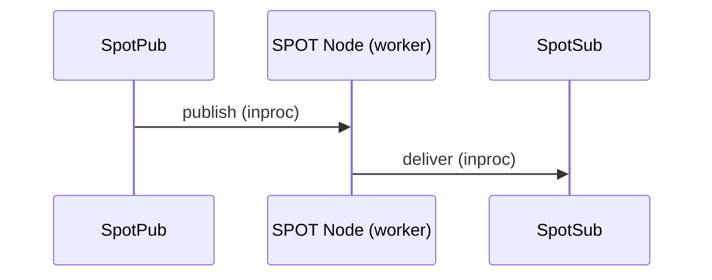

When SpotPub publishes, the SPOT Node's internal worker receives it and
delivers directly to SpotSub on the same node (via recv or callback, depending on the configured mode).

### Remote propagation — delivery across cluster nodes

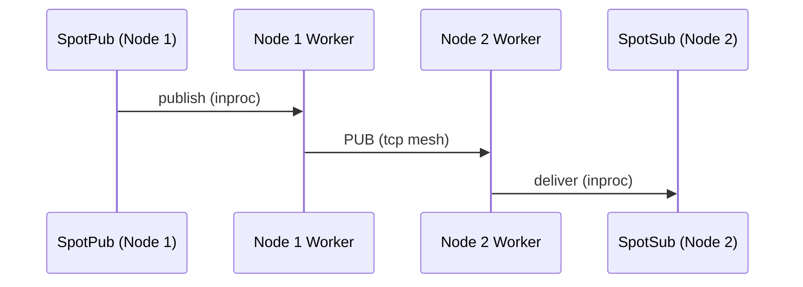

The worker forks a local publish into two paths:
1. Delivers to SpotSub on the same node (local path above)
2. Sends to remote nodes via mesh PUB socket

The remote node's worker delivers mesh-received messages to its own SpotSub only;
it **never re-publishes to the mesh** (loop prevention).

### Full topology overview

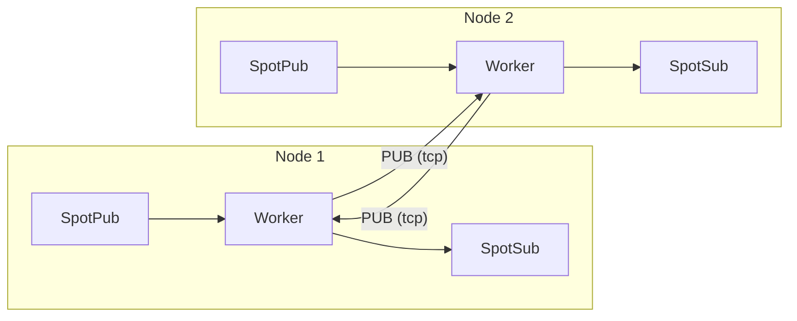

- Each node's worker sends via **PUB socket** and receives from other nodes via **SUB socket**
- Only local publishes enter the mesh; remote receives are never re-published (loop prevention)
- When Discovery is attached, this mesh topology is configured automatically

> For internal socket wiring and data plane details, see
> [SPOT Internals](../internals/spot-internals.md).

**Example:** Node 1 publishes topic `price.USD.JPY`. Node 2 has a subscriber for `price.*`.

1. SpotPub on Node 1 sends the message to the local SPOT worker.
2. The worker delivers to any local SpotSub matching `price.*` (local path).
3. The worker also sends via the PUB socket over tcp to Node 2.
4. Node 2's worker receives via SUB, matches against `price.*`, and delivers to its SpotSub.
5. The message is NOT re-published to the mesh from Node 2 (loop prevention).

## 3. SPOT Node Setup

### 3.0 Core Mental Model — SpotNode is a Multi-Service Hub

**A single `SpotNode` talks to several external services at once.** Each
service is identified by a string `service_name`, and under that name the
node holds either a ROUTER, or a PUB+SUB pair, or ROUTER+PUB+SUB together.
`SpotNode` keeps these per-service attachments in a `service attachment
table`, and a single public `Spot` facade on top becomes the one entry
point for talking to all of them.

```text
+------------------------------------------------------------------+
|                         SpotNode (hub)                           |
|------------------------------------------------------------------|
|                       service attachment table                   |
|                                                                  |
|  service_name = "orders-exec"   -> { ROUTER }                    |
|  service_name = "market-data"   -> { PUB, SUB }                  |
|  service_name = "billing"       -> { ROUTER, PUB, SUB }          |
|                                                                  |
|                               ^                                  |
|                               | single public facade             |
|                               |                                  |
|                +---------------------------+                     |
|                |       Spot (facade)       |                     |
|                |                           |                     |
|                |  spot_send_service(...)   |                     |
|                |  spot_request_service(...)|                     |
|                |  spot_publish(...)        |                     |
|                |  spot_subscribe(...)      |                     |
|                +---------------------------+                     |
+------------------------------------------------------------------+
```

Key points:

- One `SpotNode` can carry many different `service_name`s. A typical
  deployment might host `orders-exec` (routed only), `market-data`
  (pub/sub only), and `billing` (routed + pub/sub) side by side.
- The same `service_name` may own more than one ROUTER attachment. When
  that happens, `zlink_spot_send_service()` /
  `zlink_spot_request_service()` pick one active and send-ready ROUTER
  per call using round-robin.
- **Pub/sub must be attached as a pair.** A service with only a PUB or
  only a SUB is rejected. The rule applies to manual attach and to
  Discovery attach alike.
- Exactly **one `Spot` facade per node**. A second `zlink_spot_new(node)`
  on a service-aware node fails with `EBUSY`. Conversely, a node that
  already has two or more plain facades cannot accept service-aware
  attach calls (they fail with `EBUSY`).

### 3.0.1 Two Ways to Register a Service

Per-service router/pub/sub attachments reach the table via one of two
paths, and the two paths can coexist on the same node.

| Method | When to use | Functions |
|--------|-------------|-----------|
| **Manual attach** | The caller builds external sockets (ROUTER / PUB / SUB) and registers them under an explicit `service_name`. Fits tests, fixed topologies, and bootstrap services. | `zlink_spot_node_attach_router()`, `zlink_spot_node_attach_pubsub()` |
| **Discovery attach** | Attach a per-service Discovery handle; providers learned from Registry flow into the service attachment table as automatic ROUTER/PUB/SUB sources. Fits production topologies. | `zlink_socket_attach_discovery()` (per underlying socket) + `zlink_spot_node_attach_discovery()` |

The same pairing rule applies to the automatic path. `router`-only is
allowed, `router + pub + sub` is allowed, and `pub + sub` is allowed, but
a service whose Discovery view reports a half-pair (`pub` xor `sub`) is
rejected at attach time.

Manual and Discovery attachments can coexist under the same
`service_name`. Each attachment keeps its own source marker
(`ZLINK_SPOT_PEER_SOURCE_MANUAL` or `ZLINK_SPOT_PEER_SOURCE_DISCOVERY`).
The router selector treats them uniformly for round-robin, but
peer-removal events only retract the matching source — manual
attachments survive Discovery provider churn.

Concrete usage of each method follows in §3.1 Discovery-Based Automatic
Mesh and §3.1a Manual service attach.

### 3.1 Discovery-Based Automatic Mesh

Discovery-based registration follows the **same four-step recipe per
service**. For each service you build its ROUTER (or PUB/SUB pair) first,
attach it to a per-service Discovery, and only then attach those
Discovery handles to the `SpotNode`.

1. Create the raw socket (ROUTER or PUB/SUB) the process will provide
   under this service.
2. Open a Discovery handle with `ZLINK_SERVICE_TYPE_SOCKET` and the
   matching `service_name`. Connect it to Registry.
3. Call `zlink_socket_attach_discovery(socket, discovery)` to bind the
   socket to that Discovery. Discovery now owns the socket lifecycle and
   advertises it to Registry as a provider for this service.
4. Create the `SpotNode`, bind it, and attach each per-service Discovery
   with `zlink_spot_node_attach_discovery(node, discovery)`.

The example below runs two services side by side on the same node:
`orders-exec` (ROUTER only) and `market-data` (PUB + SUB pair).

```c
void *ctx = zlink_ctx_new();

/* ---- Service 1: orders-exec (routed only) ---- */

/* 1. Build the ROUTER socket this process provides under "orders-exec" */
void *orders_router = zlink_socket(ctx, ZLINK_SOCKET_ROUTER);
zlink_bind(orders_router, "tcp://*:9001");

/* 2. Open a Discovery view scoped to this service */
void *orders_discovery = zlink_discovery_new(ctx,
    ZLINK_SERVICE_TYPE_SOCKET, "orders-exec");
zlink_discovery_connect_registry(orders_discovery,
    "tcp://registry1:5551");

/* 3. Attach the socket to its Discovery — Discovery now owns the
 *    socket lifecycle and advertises it as an "orders-exec" ROUTER. */
zlink_socket_attach_discovery(orders_router, orders_discovery);

/* ---- Service 2: market-data (pub+sub pair) ---- */

void *prices_pub = zlink_socket(ctx, ZLINK_SOCKET_PUB);
void *prices_sub = zlink_socket(ctx, ZLINK_SOCKET_SUB);
zlink_bind(prices_pub, "tcp://*:9002");
/* SUB does not bind; Discovery will connect it to the other
 * "market-data" PUB providers as they appear. */

void *prices_pub_discovery = zlink_discovery_new(ctx,
    ZLINK_SERVICE_TYPE_SOCKET, "market-data");
zlink_discovery_connect_registry(prices_pub_discovery,
    "tcp://registry1:5551");

void *prices_sub_discovery = zlink_discovery_new(ctx,
    ZLINK_SERVICE_TYPE_SOCKET, "market-data");
zlink_discovery_connect_registry(prices_sub_discovery,
    "tcp://registry1:5551");

zlink_socket_attach_discovery(prices_pub, prices_pub_discovery);
zlink_socket_attach_discovery(prices_sub, prices_sub_discovery);

/* ---- SpotNode: bind, then attach each service's Discovery ---- */

void *node = zlink_spot_node_new(ctx);
zlink_spot_node_bind(node, "tcp://*:9000");

zlink_spot_node_attach_discovery(node, orders_discovery);
zlink_spot_node_attach_discovery(node, prices_pub_discovery);
zlink_spot_node_attach_discovery(node, prices_sub_discovery);
```

Key points:

- Use `ZLINK_SERVICE_TYPE_SOCKET` — this is the Discovery service type
  that advertises raw-socket services. (The legacy `ZLINK_SERVICE_TYPE_SPOT`
  path was used when `SpotNode` itself was a single-service peer; the
  new multi-service model publishes each underlying ROUTER/PUB/SUB as
  its own socket service.)
- `zlink_socket_attach_discovery()` is the **mandatory intermediate
  step** that places the socket under Discovery ownership. If you skip
  it, Registry never sees the socket as a provider, and attaching the
  Discovery to the node will bring no automatic attachments for that
  service. The call does two things that the subsequent SpotNode attach
  depends on: (a) it transfers socket lifecycle ownership to Discovery,
  so destroying the Discovery shuts down the attached socket; and (b) it
  registers the socket as a named provider in Registry so other nodes'
  Discovery views can see it and auto-connect to it.
- Pub/sub services require a Discovery for **both** PUB and SUB under
  the same `service_name`. If the Discovery view reports only a PUB or
  only a SUB for a service, `attach_discovery` rejects it with
  `INVALID_ARGUMENT`.
- The same node may carry Discovery handles for many different
  `service_name`s. Two Discovery handles for the same `service_name` on
  the same node fail with `EBUSY`.
- Providers supplied by Discovery land in the `SpotNode`'s service
  attachment table as automatic sources. Once a `zlink_spot_new(node)`
  facade is on top, callers can drive everything by service name:
  `zlink_spot_send_service(spot, "orders-exec", ...)` or
  `zlink_spot_publish(spot, "market-data", ...)`.

> See [Discovery Internals](../internals/discovery-internals.md) for how
> Discovery builds the provider list and applies the pairwise initiator
> rule.

### 3.1a Manual service attach

When the service sockets are built by the application itself:

```c
/* Routed-only service: attach one ROUTER */
void *orders_router = zlink_socket(ctx, ZLINK_SOCKET_ROUTER);
zlink_bind(orders_router, "tcp://*:9001");
zlink_spot_node_attach_router(node, "orders-exec", orders_router);

/* Pub/Sub service: PUB and SUB must be attached together */
void *prices_pub = zlink_socket(ctx, ZLINK_SOCKET_PUB);
void *prices_sub = zlink_socket(ctx, ZLINK_SOCKET_SUB);
zlink_bind(prices_pub, "tcp://*:9002");
zlink_connect(prices_sub, "tcp://peer:9002");
zlink_spot_node_attach_pubsub(node, "market-data",
                              prices_pub, prices_sub);
```

- Attach does not take ownership of the sockets. Destroying the `SpotNode`
  does not destroy sockets that were manually attached; the caller keeps
  owning them.
- A single external socket must not be attached to more than one service.
- There is no public half-pair attach. To use a pub/sub path, pass both
  sides in one call.

> `SpotNode` is the topology and lifecycle owner for mesh participation.
> It does not expose the generic data-plane facade (publish/subscribe).
> For publish/subscribe, create a facade with `zlink_spot_new(node)`.

**Note:** It is recommended to call `attach_discovery()` after bind.
Once Discovery is attached, peers are automatically discovered and
connected through the Registry.

> For how Discovery constructs the mesh, see
> [Discovery Internals](../internals/discovery-internals.md).

**Ephemeral port:** `zlink_spot_node_bind()` supports port 0 for dynamic
port allocation. Use `zlink_spot_node_status_snapshot()` to retrieve the
actual assigned endpoint from `local_endpoint`:

```c
zlink_spot_node_bind(node, "tcp://127.0.0.1:0");
zlink_spot_node_status_t status;
zlink_spot_node_status_snapshot(node, &status);
/* status.local_endpoint contains e.g. "tcp://127.0.0.1:43521" */
```

### 3.2 Manual Mesh

```c
void *node = zlink_spot_node_new(ctx);
zlink_spot_node_bind(node, "tcp://*:9000");

/* Directly connect to other nodes' PUB */
zlink_spot_node_connect_peer(node, "tcp://node2:9000");
zlink_spot_node_connect_peer(node, "tcp://node3:9000");
```

**Note:** In a manual mesh there is no Discovery, so there is no registry
topology visibility. This is an intended limitation.

## 4. Unified SPOT Usage

### 4.1 Create a unified handle

```c
void *spot = zlink_spot_new(node);
```

`zlink_spot_new(node)` creates a unified facade that borrows an existing
spot node. It provides both publish and subscribe behavior. There are no
public standalone `spot_pub` / `spot_sub` constructors.

Transport security is not configured through unified `spot`. If the service
must use `tls://` or `wss://`, configure TLS on the backing `SpotNode`
first. The internal `inproc` linkage inside unified `spot` is not a TLS
surface.

### 4.2 Publishing

```c
zlink_msg_t part;
zlink_msg_init_size(&part, 11);
memcpy(zlink_msg_data(&part), "hello world", 11);
zlink_publish(spot, "chat:room1:message", &part, 1, 0);
```

### 4.3 Subscribing and unsubscribing

```c
zlink_set_subscription(spot, "chat:room1:message");
zlink_set_subscription(spot, "chat:room1:*");

zlink_unset_subscription(spot, "chat:room1:message");
zlink_unset_subscription(spot, "chat:room1:*");
```

### 4.4 Receiving Messages

Both `SpotNode` and unified `Spot` start in **recv model**. You can either
pull messages directly or switch the receive surface once to **callback mode**.
Send-ready remains a separate axis.

#### Recv model (default)

In recv model, pull messages with `zlink_subscribe()`.

```c
void *spot = zlink_spot_new(node);
zlink_set_subscription(spot, "chat:room1:message");

/* Pull next message */
zlink_routing_id_t source_rid;
zlink_msg_t *parts = NULL;
size_t part_count = 0;
char topic_buf[256];
size_t topic_len = sizeof(topic_buf);
zlink_recv_result_t rc = zlink_subscribe(
    spot, &source_rid, &parts, &part_count,
    topic_buf, &topic_len, 0 /* flags */);
if (rc == ZLINK_RECV_OK) {
    printf("Topic: %.*s, Parts: %zu\n",
           (int)topic_len, topic_buf, part_count);
    for (size_t i = 0; i < part_count; i++)
        zlink_msg_close(&parts[i]);
}
```

??? example "Full Sample Code"

    | Language | Source |
    |----------|--------|
    | C | [spot_recv_sample.c](https://github.com/kairos-code-dev/zlink/blob/main/core/samples/spot_recv_sample.c) |
    | C++ | [spot_recv_sample.cpp](https://github.com/kairos-code-dev/zlink/blob/main/bindings/cpp/samples/spot_recv_sample.cpp) |
    | Java | [SpotRecvSample.java](https://github.com/kairos-code-dev/zlink/blob/main/bindings/java/samples/Zlink.Samples/src/main/java/dev/kairoscode/zlink/samples/SpotRecvSample.java) |
    | Python | [spot_recv.py](https://github.com/kairos-code-dev/zlink/blob/main/bindings/python/examples/spot_recv.py) |
    | Node | [spot_recv_sample.ts](https://github.com/kairos-code-dev/zlink/blob/main/bindings/node/examples/spot_recv_sample.ts) |
    | C# | [Program.cs](https://github.com/kairos-code-dev/zlink/blob/main/bindings/dotnet/samples/SpotRecv/Program.cs) |
    | Rust | [spot_recv_sample.rs](https://github.com/kairos-code-dev/zlink/blob/main/bindings/rust/samples/spot_recv_sample.rs) |
    | Go | [main.go](https://github.com/kairos-code-dev/zlink/blob/main/bindings/go/samples/spot_recv_sample/main.go) |

#### Callback model

Install `zlink_spot_dispatch_event_handler()` to receive a single readable
notification for topic, routed, and timer planes. The callback only signals
which plane became readable; drain the actual payload from the matching
recv function (for topics: `zlink_subscribe()` or `zlink_spot_subscribe()`).

```c
static void on_spot_event(void *spot,
                          zlink_spot_dispatch_event_t event,
                          void *userdata)
{
    if (event != ZLINK_SPOT_DISPATCH_EVENT_SUBSCRIBE_READABLE)
        return;
    for (;;) {
        zlink_routing_id_t src;
        zlink_msg_t *parts = NULL;
        size_t part_count  = 0;
        char topic[256];
        size_t topic_len = sizeof(topic);
        zlink_recv_result_t rc = zlink_subscribe(
            spot, &src, &parts, &part_count,
            topic, &topic_len, ZLINK_DONTWAIT);
        if (rc != ZLINK_RECV_OK) break;
        /* handle topic delivery */
        zlink_multipart_close(parts, part_count);
    }
}

void *spot = zlink_spot_new(node);
zlink_set_subscription(spot, "chat:room1:message");
zlink_spot_dispatch_event_handler(spot, on_spot_event, NULL);
```

For the production-style notify + single worker pattern, see §7.2.

??? example "Full Sample Code"

    | Language | Source |
    |----------|--------|
    | C | [spot_callback_sample.c](https://github.com/kairos-code-dev/zlink/blob/main/core/samples/spot_callback_sample.c) |
    | C++ | [spot_callback_sample.cpp](https://github.com/kairos-code-dev/zlink/blob/main/bindings/cpp/samples/spot_callback_sample.cpp) |
    | Java | [SpotCallbackSample.java](https://github.com/kairos-code-dev/zlink/blob/main/bindings/java/samples/Zlink.Samples/src/main/java/dev/kairoscode/zlink/samples/SpotCallbackSample.java) |
    | Python | [spot_callback.py](https://github.com/kairos-code-dev/zlink/blob/main/bindings/python/examples/spot_callback.py) |
    | Node | [spot_callback_sample.ts](https://github.com/kairos-code-dev/zlink/blob/main/bindings/node/examples/spot_callback_sample.ts) |
    | C# | [Program.cs](https://github.com/kairos-code-dev/zlink/blob/main/bindings/dotnet/samples/SpotCallback/Program.cs) |
    | Rust | [spot_callback_sample.rs](https://github.com/kairos-code-dev/zlink/blob/main/bindings/rust/samples/spot_callback_sample.rs) |
    | Go | [main.go](https://github.com/kairos-code-dev/zlink/blob/main/bindings/go/samples/spot_callback_sample/main.go) |

**Important:** A single `spot` / `spot_node` handle can be used concurrently
from multiple threads (thread-safe). `publish` is the concurrent hot path, while
subscribe/unsubscribe/attach/peer-connect/monitor calls remain valid runtime
control-path operations. `zlink_spot_dispatch_event_handler()` callbacks are
not invoked directly on the I/O thread; they run on a dedicated SPOT worker
runtime. The worker count is controlled by the context option
`ZLINK_SPOT_WORKER_THREADS`.

**Constraints:**

- In recv model, use `zlink_subscribe()` / `zlink_spot_subscribe()`
- Call `zlink_spot_dispatch_event_handler()` to receive readable notifications for the topic, routed, and timer planes
- In dispatch callback mode, `zlink_subscribe()` and data-plane `ZLINK_POLLIN` return `ZLINK_RECV_BUSY` in ordinary call sites, except inside the active dispatch callback for the same `spot_`
- `zlink_send_ready_handler()` is independent from receive callback mode
- After send-ready attach, data-plane `ZLINK_POLLOUT` returns `ZLINK_HANDLER_BUSY`
- Replacing or clearing the callback after transition is not supported
- Callbacks run on the dedicated SPOT worker runtime
- Callback execution is serialized per `Spot`, while different `Spot` handles may run in parallel
- `ZLINK_SPOT_WORKER_THREADS=0` means auto-select `min(visible logical cores, 8)`, with fallback `1`
- Set the option before runtime startup; changes after startup fail with `EINVAL`
- `destroy` uses a fail-fast lifecycle gate, so the simplest pattern is to
  stop external use first and then tear down the handle

> See [Thread-Safety Guide](11-thread-safety.md) for the full three-tier contract and additional patterns.

## 4a. Service-aware send and receive

Once one or more attachments exist, send by `service_name` and receive
with the service identifier alongside the payload.

### 4a.0 Per-service peer groups and message paths

When multiple services are attached, `SpotNode`'s service attachment
table keeps an **independent peer group per `service_name`**. The
service-based `Spot` API takes only the group name; the actual target
inside that group is picked by a rule. On the routed side, it behaves
like raw DEALER round-robin — but **the pool is now the ROUTER group of
one `service_name`** instead of one DEALER's endpoint set. On the pub/sub
side, traffic flows only through that service's PUB/SUB pair.

#### Per-service peer topology

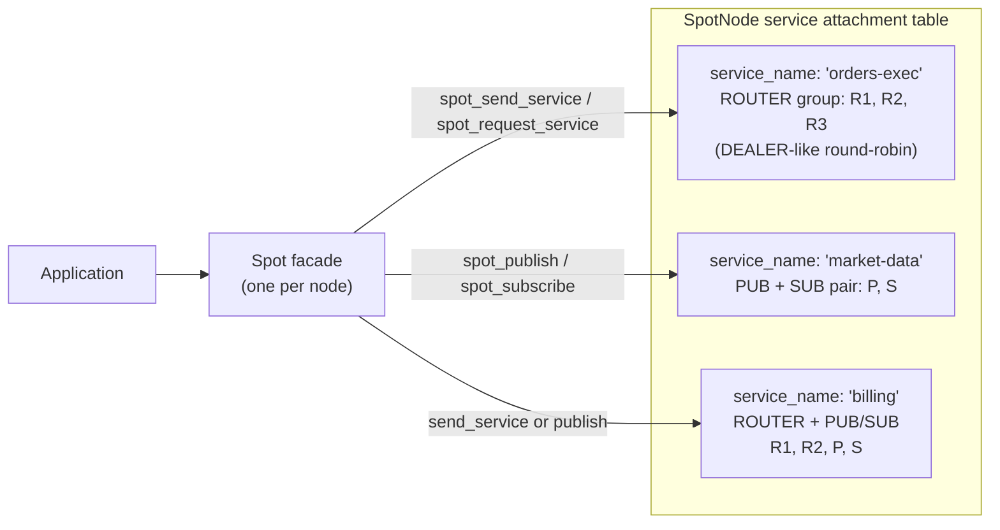

Group boundaries follow `service_name`. A call to `orders-exec` goes to
one of `R1/R2/R3` only; it never crosses into another service's group. A
`market-data` publish goes out only through `P`; it never touches an
`orders-exec` ROUTER.

#### send_service — DEALER-like round-robin distribution

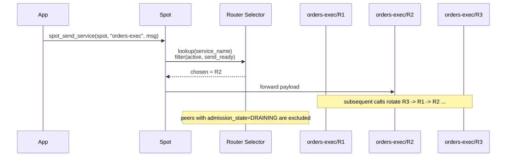

- If no candidate is send-ready, the call is normalized to
  `ZLINK_SUBMIT_NOT_CONNECTED`. If every candidate is `DRAINING`, it is
  `ZLINK_SUBMIT_NOT_ADMITTED`.
- If the picked ROUTER is at HWM, the call returns
  `ZLINK_SUBMIT_BACKPRESSURED` and can be retried when that peer's
  write path recovers.

#### request_service — reply pins to the ingress ROUTER

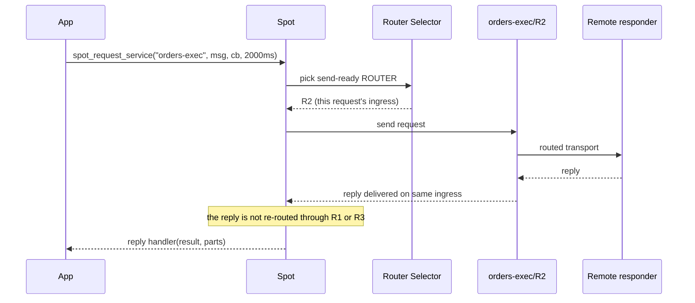

- The send step is round-robin across the group, but the **reply is
  pinned to that original ROUTER**. The library manages the ingress
  ROUTER together with `request_seq` under the covers.
- Automatic retry on timeout is **not** part of the default contract.
  When the timeout fires, the completion callback is invoked with
  `ZLINK_REQUEST_TIMED_OUT`.

#### publish — fixed to the service's PUB

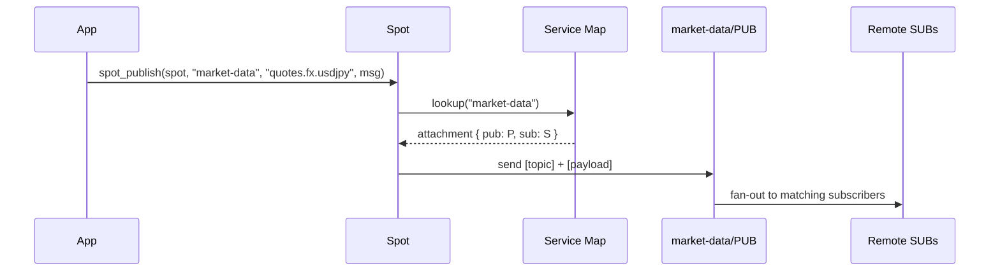

- Publish succeeds only when that service's PUB/SUB pair is active.
  Services broken by Discovery churn (half-pair) return
  `NOT_CONNECTED`.
- When the pair recovers, any `zlink_set_subscription()` filter already
  registered on the facade is replayed onto the new SUB before the
  service rejoins the active set.

#### subscribe — `service_name` is preserved in recv metadata

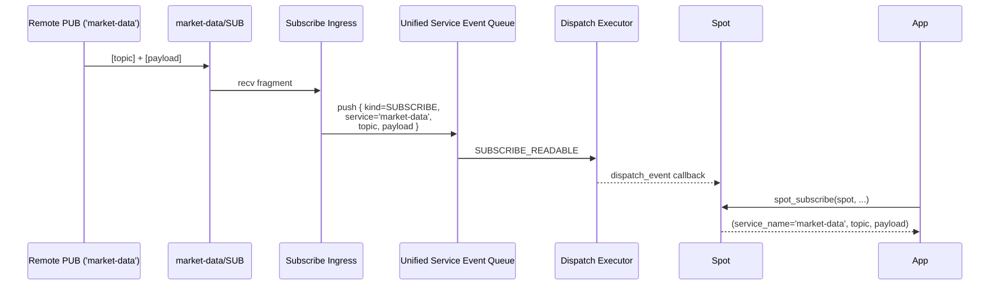

- Messages from SUBs of different services land on the same facade
  recv surface, but the application can distinguish them immediately
  by `service_name` + `topic`.
- The `source_rid` on pub/sub paths may be empty. Treat
  `service_name` + `topic` as the primary identifier and `source_rid`
  as optional metadata.
- `zlink_set_subscription(spot, filter)` is the **union** over the
  whole facade and is projected onto every attached service's SUB. New
  SUBs gain the current filter set via replay automatically.

#### Compared to raw DEALER — what stays and what differs

Service-based routed send generalizes raw DEALER's round-robin by
grouping it under `service_name`.

| Axis | raw DEALER | `zlink_spot_send_service()` / `request_service()` |
|------|-----------|--------------------------------------------------|
| Pool boundary | Endpoints a single DEALER connected to | ROUTER attachments of one `service_name` |
| Pool composition | Caller uses `zlink_connect()` directly | Mix of manual attach and Discovery-driven auto attach |
| Round-robin unit | Connected endpoint | ROUTER attachment |
| Reply correlation | Caller matches send/recv pairs | Library pins ingress ROUTER and `request_seq` |
| Admission awareness | Caller handles it | `DRAINING` peers auto-excluded; `NOT_ADMITTED` surfaced |
| Multiple services | Need separate sockets for each | Same facade, different `service_name` argument |
| Empty candidate set | BACKPRESSURED or silent hold | Normalized to `NOT_CONNECTED` (configured but no path) |

In other words, "pick a ROUTER in `orders-exec` that can send right now
and remember which one replied" is a one-line call:
`zlink_spot_request_service()`. The selection rule is the same
round-robin DEALER uses, but the boundary is `service_name` and the
library never crosses into another service's attachments.

### 4a.1 Service-based send / publish

```c
/* routed service: a send-ready ROUTER from the service is picked
   round-robin */
zlink_msg_t cmd;
zlink_msg_init_size(&cmd, 13);
memcpy(zlink_msg_data(&cmd), "place_order:1", 13);
zlink_submit_result_t rc = zlink_spot_send_service(
    spot, "orders-exec", &cmd, 1, 0);

/* request_service: the reply pins to the ingress ROUTER that carried the
   outbound submit */
rc = zlink_spot_request_service(
    spot,
    "orders-exec",
    &cmd, 1,
    on_order_reply,
    NULL,
    0 /* flags */,
    2000 /* timeout_ms */);

/* service-aware publish */
zlink_msg_t tick;
zlink_msg_init_size(&tick, 20);
memcpy(zlink_msg_data(&tick), "USD/JPY=151.24 09:15", 20);
rc = zlink_spot_publish(
    spot, "market-data", "quotes.fx.usdjpy", &tick, 1, 0);
```

- If no attachment exists for the given `service_name`, the result is
  `NOT_FOUND`.
- If attachments exist but no usable active path is available, the result
  is normalized to `NOT_CONNECTED`. This is distinct from `BACKPRESSURED`,
  which means a chosen path is momentarily full.
- `zlink_spot_publish()` succeeds only while the pub/sub pair is active as
  a pair. Provider churn that breaks the pair takes the pub/sub path out
  of the active set; publishing returns `NOT_CONNECTED` until the pair is
  restored. Once restored, the subscription filter set is replayed
  automatically before the pair returns to the active set.

### 4a.2 Service-based receive

```c
zlink_routing_id_t src;
zlink_msg_t *parts = NULL;
size_t part_count  = 0;
char service[128];  size_t service_len = sizeof(service);
char topic[256];    size_t topic_len   = sizeof(topic);

zlink_recv_result_t rc = zlink_spot_subscribe(
    spot,
    &src,
    &parts, &part_count,
    service, &service_len,
    topic, &topic_len,
    ZLINK_DONTWAIT);
if (rc == ZLINK_RECV_OK) {
    /* dispatch on (service, topic) */
    zlink_multipart_close(parts, part_count);
}
```

- `source_rid` (`src`) on pub/sub paths may be empty. The application
  should treat `service_name` and `topic` as the primary metadata.
- Subscription filters are unioned across the `Spot` facade. A single
  `zlink_set_subscription(spot, filter)` is replayed across every
  currently attached service SUB.
- Subscribe / unsubscribe notifications are drained with
  `zlink_spot_subscription_event()`, which also returns the service name
  and topic.

### 4a.3 Readable notifications and the unified callback

Service-aware subscribe and routed readability notifications still arrive
through `zlink_spot_dispatch_event_handler()`. The event kind identifies
the plane; actual payloads are drained with the matching recv function:

```text
SUBSCRIBE_READABLE -> zlink_spot_subscribe()
                      or zlink_spot_subscription_event()
ROUTED_READABLE    -> zlink_spot_recv()
TIMER_READABLE     -> zlink_timer_recv()
```

Reply addresses pin to the ingress ROUTER the original request was
submitted through. A reply does not re-run round-robin selection by
service name.

### 4a.4 Service-aware monitoring

Per-service attachment state is observed through two surfaces:

- `zlink_spot_node_service_attachment_count()` /
  `zlink_spot_node_service_attachment_at()` return a
  `zlink_spot_service_attachment_stats_t` per service, counting both
  manually attached and Discovery-supplied sources.
- `zlink_spot_node_monitor_recv()` returns per-attachment monitor events
  tagged with `service_name` and the attachment role (`ROUTER`, `PUB`, or
  `SUB`).

Service-aware monitor events are not folded into the
`zlink_spot_dispatch_event_handler()` readable plane. The `SpotNode` owns
monitor traffic.

## 5. Routed (Direct) Messaging

Routed messaging delivers messages directly to a specific SPOT handle or
ROUTER socket by address, bypassing topic matching. This is separate from
the topic pub/sub path.

> For the SPOT routed envelope wire format, see
> [ZMP Protocol](../internals/protocol-zmp.md).

### Address Model

Routed messages use a two-level address: **node_rid** (which SpotNode)
and **spot_rid** (which SPOT handle on that node). When sending to a
ROUTER, only `peer_rid` is needed.

```text
Topic path:     publish("price:USD:JPY", ...) → all matching subscribers
Routed path:    send_spot(dest_node_rid, dest_spot_rid, ...) → one target
```

### Routed Delivery Flow

#### spot → spot (same / different nodes)

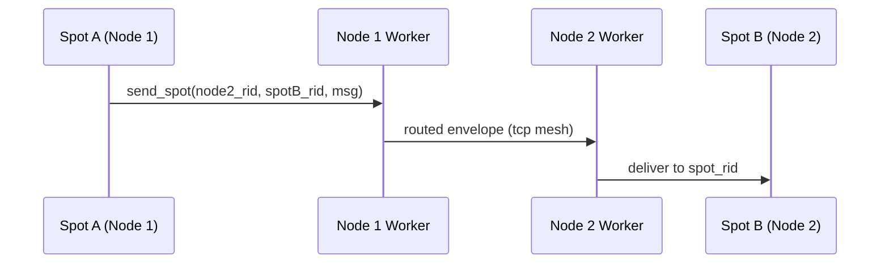

When Spot A addresses Spot B by `(node_rid + spot_rid)`, the Node 1 worker
forwards the routed envelope to Node 2 over the mesh, and the Node 2 worker
delivers it to the exact Spot B identified by `spot_rid`.

#### spot ↔ router (cross pattern)

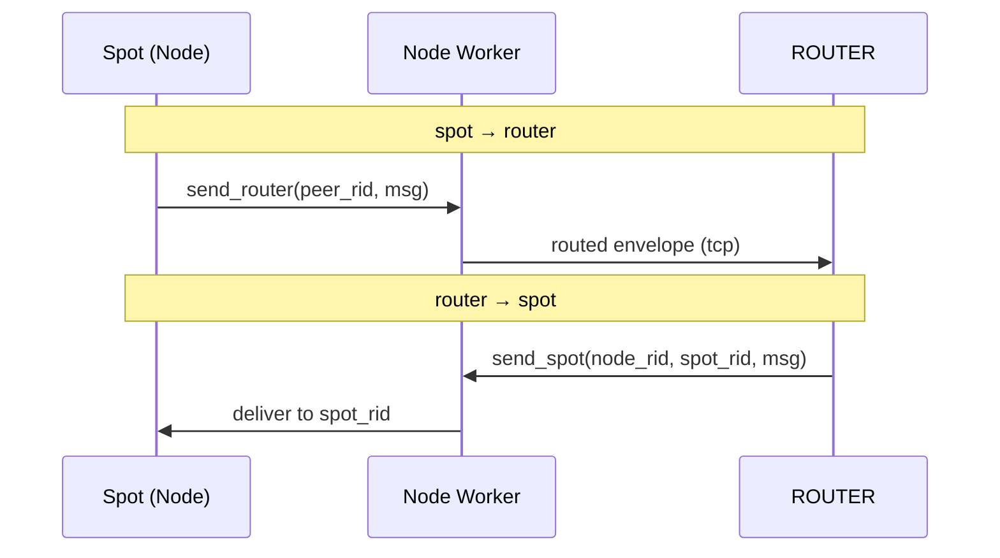

SPOT and a plain ROUTER socket can exchange routed messages directly in
either direction. Sending to a ROUTER needs only `peer_rid`; sending to a
SPOT needs the two-level address `node_rid + spot_rid`.

#### Overall Routed structure summary

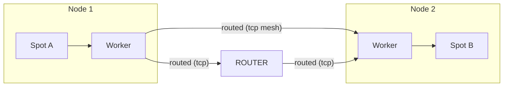

- The topic path (PUB/SUB) and the Routed path share the same mesh
  infrastructure but form **independent channels**.
- Routed messages bypass topic matching and are delivered by address.
- A ROUTER socket can participate in the Routed path without any SpotNode.

### 5.1 Direct Send

#### spot → spot

```c
zlink_msg_t part;
zlink_msg_init_size(&part, 13);
memcpy(zlink_msg_data(&part), "market_update", 13);

zlink_spot_send_spot(spot, &dest_node_rid, &dest_spot_rid, &part, 1, 0);
```

#### spot → router

```c
zlink_msg_t part;
zlink_msg_init_size(&part, 11);
memcpy(zlink_msg_data(&part), "status_ping", 11);

zlink_spot_send_router(spot, &peer_rid, &part, 1, 0);
```

#### router → spot

```c
zlink_msg_t part;
zlink_msg_init_size(&part, 12);
memcpy(zlink_msg_data(&part), "control_sync", 12);

zlink_router_send_spot(router, &dest_node_rid, &dest_spot_rid, &part, 1, 0);
```

### 5.2 Routed Recv

Routed messages are received through the dedicated routed receive surface,
which is separate from the topic subscription surface.

#### Pull Mode

```c
const zlink_routing_id_t *source_rid;
const zlink_routing_id_t *spot_rid;
uint64_t request_seq;
zlink_msg_t *parts;
size_t part_count;

zlink_recv_result_t rc = zlink_spot_recv(
    spot, &source_rid, &spot_rid,
    &request_seq, &parts, &part_count, 0 /* flags */);
if (rc == ZLINK_RECV_OK) {
    if (request_seq == 0) {
        /* Ordinary routed message */
    } else {
        /* Request-reply message -- reply using request_seq */
    }
    zlink_multipart_close(parts, part_count);
}
```

#### Callback Mode

```c
void on_routed(const zlink_routing_id_t *source_rid,
               const zlink_routing_id_t *spot_rid,
               uint64_t request_seq,
               zlink_msg_t *parts, size_t part_count,
               void *userdata)
{
    if (request_seq == 0) {
        /* Ordinary routed message */
    } else {
        /* Request -- reply required */
    }
    zlink_multipart_close(parts, part_count);
}

zlink_spot_handler(spot, on_routed, NULL);
```

**Note:** `zlink_spot_handler()` (direct routed callback) and
`zlink_spot_dispatch_event_handler()` (unified readable notifications) share
the routed axis slot and must not be installed together. To consume topic
messages, use the `SUBSCRIBE_READABLE` notification from
`zlink_spot_dispatch_event_handler()` and drain with `zlink_subscribe()`.

### 5.3 Router Receiving from SPOT

A ROUTER socket receives routed messages from SPOT through the same
single direct receive surface it uses for plain ROUTER traffic. There
is no separate `zlink_router_spot_handler()` / `zlink_router_spot_recv()`
contract. Distinguish SPOT-originated traffic by checking whether
`source_spot_rid` is populated.

```c
/* orders-exec ROUTER drains routed traffic in its poller loop. */
for (;;) {
    const zlink_routing_id_t *source_node_rid = NULL;
    const zlink_routing_id_t *source_spot_rid = NULL;
    uint64_t request_seq = 0;
    zlink_msg_t *parts = NULL;
    size_t part_count = 0;

    zlink_recv_result_t rr = zlink_router_recv(
      router,
      &source_node_rid,
      &source_spot_rid,
      &request_seq,
      &parts,
      &part_count,
      ZLINK_RECV_FLAGS_DONTWAIT);
    if (rr != ZLINK_RECV_OK) break;

    if (source_spot_rid && source_spot_rid->size > 0) {
        /* SPOT-originated traffic. Reply (if request_seq != 0) uses
           zlink_router_reply_spot(router, source_node_rid,
                                   source_spot_rid, request_seq, ...). */
    } else {
        /* Plain ROUTER traffic (source_spot_rid empty). */
    }
    zlink_multipart_close(parts, part_count);
}
```

See [ROUTER guide](03-4-router.md) for the full surface description.

## 6. SPOT Request-Reply

SPOT request-reply sends a message to a specific target and expects a
single reply. The implementation uses ZMP control parts on the wire
(`SPOT routed envelope → request-reply envelope → payload`), not topic
fields.

### 6.0 Routed Mesh Path

Routed messages traverse the **SpotNode mesh** — `Spot` is the
user-facing facade, `SpotNode` is the underlying mesh participant.
Request and reply travel through the local and remote SpotNodes in
opposite directions:

```
requester side                          replier side
┌──────┐   ┌───────────┐       ┌───────────┐   ┌──────┐
│ spot │──▶│ spot_node │──────▶│ spot_node │──▶│ spot │  (request)
└──────┘   └───────────┘       └───────────┘   └──────┘
   ▲             ▲                    │              │
   │             │                    │              │
   └─────────────┴────────────────────┴──────────────┘   (reply, reversed)
```

- The requester's `Spot` addresses the replier by
  `(dest_node_rid, dest_spot_rid)`.
- The local `SpotNode` routes the request through the mesh to the
  destination node.
- The destination `SpotNode` delivers it to the target `Spot`.
- The replier's reply retraces the path back to the requester.

The mesh path above is **spot → spot** specific. `spot → router` and
`router → spot` variants traverse different infrastructure: the spot side
still goes through its local `SpotNode`, but the router side connects to
the SpotNode directly as a ROUTER peer over transport (not via a mesh-to-
mesh hop). See `doc/internals/spot-internals.md` for the detailed routing
paths per variant.

### Request-Reply Flow

#### spot → spot request-reply

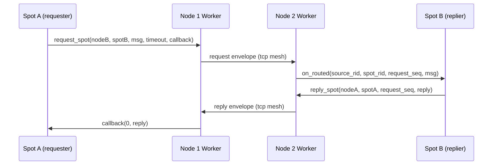

1. Spot A sends a message via `request_spot` and registers a reply callback.
2. Spot B's handler receives a message with `request_seq > 0`.
3. Spot B replies with `reply_spot`, preserving the same `request_seq`.
4. Spot A's callback receives the reply. If no reply arrives within the
   timeout, the callback fires with an error result.

#### spot ↔ router request-reply

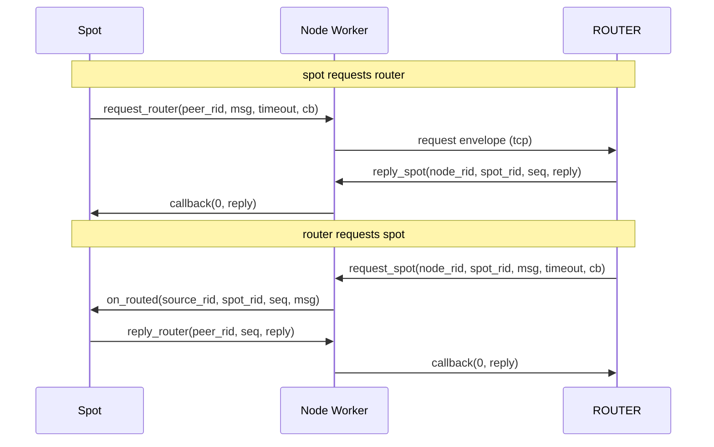

Request-reply between SPOT and ROUTER follows the same pattern: the
requester calls `request_*` and the responder answers with `reply_*`,
copying the same `request_seq`.

### 6.1 spot → spot Request

```c
static void on_spot_reply(zlink_request_result_t result,
                          zlink_msg_t *parts,
                          size_t part_count,
                          void *userdata)
{
    if (result == ZLINK_REQUEST_OK)
        zlink_multipart_close(parts, part_count);
    /* other result values: ZLINK_REQUEST_TIMED_OUT, NOT_FOUND,
       TERMINATED, PROTOCOL_ERROR */
}

zlink_msg_t req;
zlink_msg_init_size(&req, 4);
memcpy(zlink_msg_data(&req), "ping", 4);

/* signature: (spot, dest_node_rid, dest_spot_rid, parts, count,
   handler, userdata, flags, timeout_ms) */
zlink_submit_result_t rc = zlink_spot_request_spot(
  spot,
  &dest_node_rid,
  &dest_spot_rid,
  &req,
  1 /* count */,
  on_spot_reply,
  NULL /* userdata */,
  0 /* flags */,
  1500 /* timeout_ms */);
if (rc != ZLINK_SUBMIT_OK) { /* handle submit failure */ }
```

### 6.2 SPOT Request Handler and Reply

The receiving SPOT uses `zlink_spot_handler()` to receive requests. The
handler delivers `source_rid`, `spot_rid`, and `request_seq`.

```c
static void on_spot_request(const zlink_routing_id_t *source_rid,
                            const zlink_routing_id_t *spot_rid,
                            uint64_t request_seq,
                            zlink_msg_t *parts,
                            size_t part_count,
                            void *userdata)
{
    zlink_multipart_close(parts, part_count);

    zlink_msg_t reply;
    zlink_msg_init_size(&reply, 4);
    memcpy(zlink_msg_data(&reply), "pong", 4);

    zlink_spot_reply_spot(
      spot,
      source_rid,  /* dest_node_rid = caller's source */
      spot_rid,    /* dest_spot_rid = caller's spot */
      request_seq,
      &reply,
      1);
}

zlink_spot_handler(spot, on_spot_request, NULL);
```

The reply address must use exactly the source address and `request_seq`
from the handler arguments. Using different values will not match the
pending request.

### 6.3 spot ↔ router Combinations

SPOT request-reply can also cross directly with plain ROUTER sockets.
The ROUTER side uses the unified `zlink_router_recv()` surface;
SPOT-originated traffic is identified by a populated `source_spot_rid`.

- **spot → router**: `zlink_spot_request_router()` →
  `zlink_router_recv()` (`source_spot_rid` populated) →
  `zlink_router_reply_spot()`
- **router → spot**: `zlink_router_request_spot()` →
  `zlink_spot_handler()` → `zlink_spot_reply_router()`

The completion rules are the same: one request yields one reply;
extra replies are ignored.

### 6.4 SPOT Timer

SPOT timers use the SpotNode-local shared scheduler. They support the
same recv/callback/poller model as general timers.

```c
void *spot_timer = zlink_spot_timer_new(spot);
zlink_timer_start(spot_timer, 100000000ULL, 0);  /* 100ms, infinite */

/* Pull mode */
uint64_t fire_count;
zlink_timer_recv(spot_timer, &fire_count);

/* Or callback mode */
zlink_timer_handler(spot_timer, on_fire, NULL);
```

### Key Rules

| Rule | Description |
|------|-------------|
| `request_seq=0` | Ordinary routed message (not a request) |
| `request_seq>0` | Request-reply message; reply required |
| First reply wins | Extra replies to the same `request_seq` are dropped |
| Timeout | Delivered as `result == ZLINK_REQUEST_TIMED_OUT` in the reply callback |
| Target not found | `ZLINK_REQUEST_NOT_FOUND` reply (immediate, not timeout) |
| recv vs callback conflict | Returns `ZLINK_RECV_BUSY` / `ZLINK_HANDLER_BUSY` |
| Topic vs routed | Separate receive surfaces; both can be active simultaneously |

## 7. Unified Dispatch Model — `zlink_spot_dispatch_event_handler`

A single `Spot` handle carries three independent event streams:

1. **Topic subscribe** — messages matched by `zlink_subscribe()`
2. **Routed (direct)** — messages delivered via `zlink_spot_recv()`
3. **SPOT-scoped timers** — timers created through
   `zlink_spot_timer_new(spot)`

If you attach a direct callback for each of these (subscribe handler,
routed handler, and a per-timer handler), each callback fires from its
own internal driver — the subscribe plane's I/O thread, the routed
plane's dispatch thread, and the SpotNode-local timer scheduler thread.
Your application code then has to synchronize across those threads
yourself.

`zlink_spot_dispatch_event_handler()` gives you a single **notification
point** instead. You then consume the actual data on **your own
application thread** using the pull APIs. This is the recommended way to
drive a `Spot` when you want timer, routed recv, and subscribe to flow
through the same worker without cross-thread contention in user code.

### 7.1 The event handler contract

```c
typedef enum zlink_spot_dispatch_event_t
{
    ZLINK_SPOT_DISPATCH_EVENT_SUBSCRIBE_READABLE = 1,
    ZLINK_SPOT_DISPATCH_EVENT_ROUTED_READABLE    = 2,
    ZLINK_SPOT_DISPATCH_EVENT_TIMER_READABLE     = 3
} zlink_spot_dispatch_event_t;

typedef void (*zlink_spot_dispatch_event_handler_fn) (
    void *spot,
    zlink_spot_dispatch_event_t event,
    void *userdata);

zlink_handler_result_t zlink_spot_dispatch_event_handler (
    void *spot,
    zlink_spot_dispatch_event_handler_fn handler,
    void *userdata);
```

Key properties:

- **Notification only.** The callback carries no message, topic, or
  fire-count — just the event kind. The app then pulls the data with
  `zlink_subscribe()` / `zlink_spot_recv()` / `zlink_timer_recv()`.
- **One handler per `Spot`.** `zlink_spot_dispatch_event_handler()` and
  `zlink_spot_handler()` (routed direct callback) are mutually exclusive:
  attempting to install both returns `ZLINK_HANDLER_BUSY`.
- **Fires from internal threads.** The event handler runs on whichever
  internal thread produced the readable signal (I/O thread for
  subscribe/routed; SpotNode-local scheduler thread for timers). Keep
  the handler short — a condition-variable notify, an eventfd write, or
  a channel push is appropriate. **Do not call `zlink_subscribe()` /
  `zlink_spot_recv()` / `zlink_timer_recv()` from inside the event
  handler** — consume from the application thread instead.
- **Level-triggered semantics.** The handler signals *that* something is
  readable. Your application thread should drain the matching queue
  until it reports `ZLINK_RECV_NO_DATA`, because multiple messages may
  have arrived before the handler ran.
- **Transition is one-way.** Installing the dispatch event handler
  transitions the `Spot` into callback model for the dispatch axis.
  It cannot be uninstalled; replacing it is not supported.

### 7.2 Recommended pattern: notify + single worker loop

```c
#include <zlink.h>
#include <pthread.h>
#include <stdatomic.h>

typedef struct {
    pthread_mutex_t mtx;
    pthread_cond_t  cv;
    atomic_int      pending;   /* bitmask of ready events */
    atomic_int      stopping;
} dispatch_wakeup_t;

enum { READY_SUBSCRIBE = 1 << 0,
       READY_ROUTED    = 1 << 1,
       READY_TIMER     = 1 << 2 };

static int event_to_bit (zlink_spot_dispatch_event_t event)
{
    switch (event) {
        case ZLINK_SPOT_DISPATCH_EVENT_SUBSCRIBE_READABLE:
            return READY_SUBSCRIBE;
        case ZLINK_SPOT_DISPATCH_EVENT_ROUTED_READABLE:
            return READY_ROUTED;
        case ZLINK_SPOT_DISPATCH_EVENT_TIMER_READABLE:
            return READY_TIMER;
    }
    return 0;
}

/* Fires on an internal thread. Keep it minimal. */
static void on_spot_event(void *spot,
                          zlink_spot_dispatch_event_t event,
                          void *userdata)
{
    dispatch_wakeup_t *w = userdata;
    atomic_fetch_or(&w->pending, event_to_bit(event));
    pthread_mutex_lock(&w->mtx);
    pthread_cond_signal(&w->cv);
    pthread_mutex_unlock(&w->mtx);
}

/* Runs on ONE application-owned worker thread. Owns all data reads. */
static void *spot_worker(void *arg)
{
    struct {
        void              *spot;
        void              *timer;
        dispatch_wakeup_t *w;
    } *ctx = arg;

    while (!atomic_load(&ctx->w->stopping)) {
        pthread_mutex_lock(&ctx->w->mtx);
        while (atomic_load(&ctx->w->pending) == 0
               && !atomic_load(&ctx->w->stopping)) {
            pthread_cond_wait(&ctx->w->cv, &ctx->w->mtx);
        }
        int ready = atomic_exchange(&ctx->w->pending, 0);
        pthread_mutex_unlock(&ctx->w->mtx);

        if (ready & READY_TIMER) {
            uint64_t fire_count;
            while (zlink_timer_recv(ctx->timer, &fire_count)
                   == ZLINK_RECV_OK) {
                /* handle each tick */
            }
        }
        if (ready & READY_ROUTED) {
            for (;;) {
                const zlink_routing_id_t *src_node;
                const zlink_routing_id_t *src_spot;
                uint64_t seq;
                zlink_msg_t *parts;
                size_t count;
                zlink_recv_result_t rc = zlink_spot_recv(
                    ctx->spot, &src_node, &src_spot, &seq,
                    &parts, &count, ZLINK_DONTWAIT);
                if (rc != ZLINK_RECV_OK) break;
                /* process routed message, reply if seq != 0 */
                zlink_multipart_close(parts, count);
            }
        }
        if (ready & READY_SUBSCRIBE) {
            for (;;) {
                zlink_routing_id_t src;
                zlink_msg_t *parts;
                size_t count;
                char topic[256];
                size_t topic_len = sizeof(topic);
                zlink_recv_result_t rc = zlink_subscribe(
                    ctx->spot, &src, &parts, &count,
                    topic, &topic_len, ZLINK_DONTWAIT);
                if (rc != ZLINK_RECV_OK) break;
                /* process topic message */
                zlink_multipart_close(parts, count);
            }
        }
    }
    return NULL;
}

/* Setup */
dispatch_wakeup_t wakeup = { /* init ... */ };
void *spot  = zlink_spot_new(node);
void *timer = zlink_spot_timer_new(spot);

zlink_set_subscription(spot, "chat:*");
zlink_spot_dispatch_event_handler(spot, on_spot_event, &wakeup);
zlink_timer_start(timer, 100 * 1000 * 1000ULL, 0);  /* 100 ms repeat */

pthread_t worker;
/* ...pack ctx with spot, timer, &wakeup and start worker... */
pthread_create(&worker, NULL, spot_worker, /* ctx */);
```

### 7.3 Why this avoids thread contention

| Without dispatch event handler | With dispatch event handler |
|---|---|
| Subscribe callback runs on I/O thread | Notification from I/O thread → SPOT worker runtime → pull on worker thread |
| Routed handler runs on routed dispatch thread | Notification from routed thread → SPOT worker runtime → pull on worker thread |
| Timer handler runs on scheduler thread | Notification from scheduler thread → SPOT worker runtime → pull on worker thread |
| User must protect shared state with locks between 3 producer threads | All data consumption and processing runs on 1 application thread |

The three internal threads never invoke application logic beyond the
tiny notifier. Actual subscribe/recv/timer data is read on a single
application thread, so shared state between those three streams needs
no additional synchronization in user code.

The internal worker count for Spot dispatch events can be tuned with the
context option `ZLINK_SPOT_WORKER_THREADS`. A value of `0` means auto-select,
which resolves to `min(visible logical cores, 8)` and falls back to `1` if
the core count cannot be determined. Set this option before runtime startup.

### 7.4 Coexistence rules

| Combination | Result |
|---|---|
| `zlink_spot_dispatch_event_handler` + `zlink_spot_handler` | Mutually exclusive — second install returns `ZLINK_HANDLER_BUSY` |
| `zlink_spot_dispatch_event_handler` + per-timer `zlink_timer_handler` | The timer's own handler wins for that specific timer; `TIMER_READABLE` is not fired while a direct timer handler is attached to the same timer. Leave timers in recv mode to route them through the dispatch event |
| `zlink_spot_dispatch_event_handler` + `zlink_send_ready_handler` | Independent axis — send-ready has its own handler |

> For the internal threading details of how these events are produced,
> see [SPOT Internals — Dispatch Event Threading Model](../internals/spot-internals.md).

## 8. Topic Rules

### Naming Convention

The recommended format is `<domain>:<entity>:<action>`.

Examples:
- `chat:room1:message`
- `metrics:zone1:cpu`
- `game:world1:player_move`

### Pattern Subscription Rules

- Only one `*` is allowed, and it must be at the end of the string
- Case-sensitive
- Example: `chat:*` matches both `chat:room1:message` and `chat:room2:join`

## 9. Choosing Topic vs Routed

| Criterion | Topic (pub/sub) | Routed (direct) |
|-----------|----------------|-----------------|
| **Audience** | All matching subscribers | One specific target |
| **Addressing** | Topic string (prefix matching) | node_rid + spot_rid (or peer_rid) |
| **Delivery** | Fan-out to N receivers | Point-to-point |
| **Request-reply** | Not supported | Supported (request_seq) |
| **Use case** | Market data, events, notifications | Commands, queries, RPC |

Use **topic** when the publisher does not care who or how many receivers
consume the message. Use **routed** when you need to talk to a specific
SPOT handle or ROUTER and optionally expect a reply.

Both paths can be active simultaneously on the same SPOT handle.

## 10. Peer Publish Batching

SpotNode supports optional batching of small topic messages on the
cross-node path. When enabled, the sender accumulates small messages
per topic into a single batch before sending to peers. The receiver
unpacks batches internally — application-visible publish/subscribe
contracts are unchanged.

### Enabling

Batching thresholds are tuned per node through `zlink_set_spot_node_option()`
on the `SpotNode` handle. For a market-data style node that bursts many
small updates, raise the topic HWMs and keep routed HWMs moderate:

```c
uint32_t topic_hwm  = 20000;
uint32_t routed_hwm = 8000;

zlink_set_spot_node_option(node, ZLINK_SPOT_NODE_OPT_TOPIC_SEND_HWM,
                           &topic_hwm, sizeof(topic_hwm));
zlink_set_spot_node_option(node, ZLINK_SPOT_NODE_OPT_TOPIC_RECV_HWM,
                           &topic_hwm, sizeof(topic_hwm));
zlink_set_spot_node_option(node, ZLINK_SPOT_NODE_OPT_ROUTED_SEND_HWM,
                           &routed_hwm, sizeof(routed_hwm));
zlink_set_spot_node_option(node, ZLINK_SPOT_NODE_OPT_ROUTED_RECV_HWM,
                           &routed_hwm, sizeof(routed_hwm));
```

Defaults are fine for most deployments; these options exist so operators
can raise the HWM when bursty producers or slow consumers cause
backpressure on the cross-node path.

## 11. Delivery Guarantees

### Topic delivery

- Local publish delivers to local subscribers and propagates to remote nodes
- Remote-received messages are delivered locally only (never re-propagated — prevents loops)
- `subscribe()` / `unsubscribe()` return means the local filter is applied;
  cluster-wide propagation is not guaranteed at return time
- Message ordering is preserved within a single `spot` handle
- Global ordering across different `spot` handles is not guaranteed
- Duplicate delivery is prevented: if both an exact topic and a pattern match,
  the message is delivered only once

### Routed delivery

- Destination in the same process uses an optimized local path
- Cross-node delivery uses the same mesh transport as topic messages
- Topic and routed message relative order is not guaranteed
- Same node-pair ordering is preserved (best effort)

### What SPOT does not guarantee

SPOT is a live messaging system. It does not provide:
- Durable delivery or message persistence
- Ack/retry or exactly-once semantics
- Past message replay for late joiners

## 12. Cleanup

```c
zlink_spot_destroy(&spot);
zlink_spot_node_destroy(&node);
zlink_discovery_destroy(&discovery);
```

**Destroy order:** Destroy `spot` first, then `SpotNode`, and finally
`Discovery`. All external use of `spot` must stop before calling
`SpotNode` destroy.

> `zlink_spot_destroy()` only releases the borrowed facade. The backing
> `SpotNode` remains the lifecycle owner. For discovery-attached spot
> nodes, `zlink_discovery_destroy()` cascades shutdown to attached
> participants.

---
[← Discovery](07-1-discovery.md) | [Registry →](07-4-registry.md) | [Routing ID →](08-routing-id.md)
