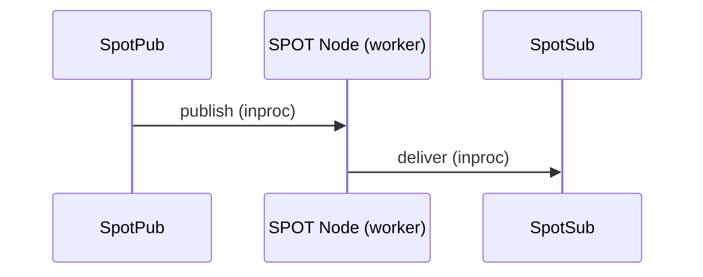
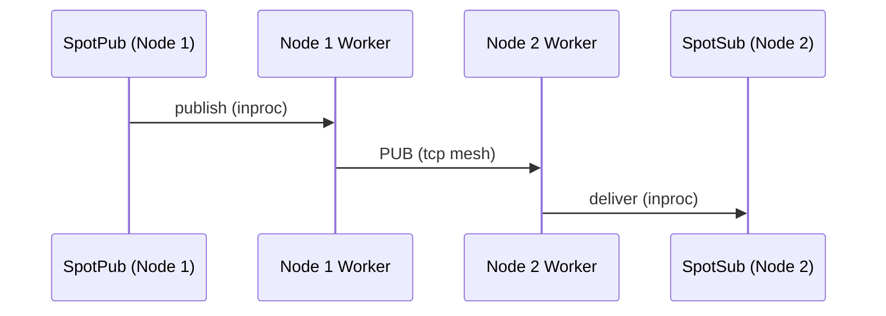
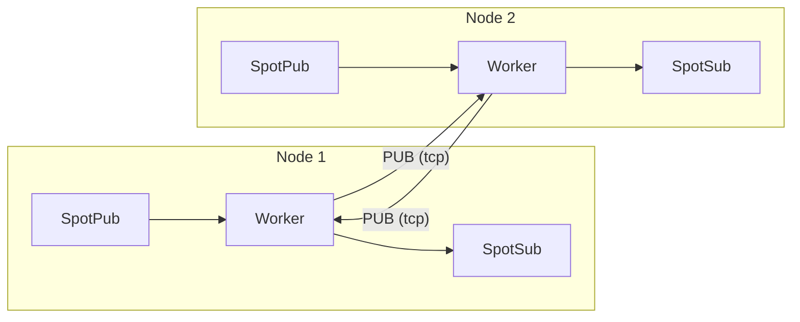

[English](07-3-spot.md) | [한국어](07-3-spot.ko.md)

# SPOT (Location-Transparent Messaging)

> **Normative status: Authoritative.**
> This guide reflects `core/include/zlink.h`.

> `SpotNode` and unified `Spot` start in recv model and use
> `zlink_subscribe_handler()` for the one-way transition to callback model
> (topic path), or `zlink_spot_handler()` for the routed path.

## 1. Overview

SPOT is a location-transparent messaging system that provides two delivery
paths:

1. **Topic PUB/SUB** -- publish/subscribe across the cluster via topic matching
2. **Routed (direct)** -- point-to-point delivery to a specific SPOT or ROUTER by address

Both paths share the same SpotNode mesh infrastructure. Topic and routed
messages are separate channels with independent receive surfaces.

Without SPOT, applications using topic-based messaging across multiple nodes would need to manually track which nodes have subscribers, manage PUB/SUB mesh connections, and handle subscription forwarding. SPOT automates this -- publish to a topic on any node, and all subscribers across the cluster receive the message. The routed path adds direct delivery and request-reply without requiring manual ROUTER/DEALER socket wiring.

> **About the name**: SPOT derives its name from "spot" (location). Each object (node) publishes topics from its own location and subscribes to topics from other locations, forming an object-level, location-transparent pub/sub mesh system.

### Core Terminology

| Term | Description |
|------|-------------|
| **SPOT Node** | Mesh participant agent (one per node) |
| **SPOT Pub** | Topic publishing path (the hot path of `spot` / `spot_node`) |
| **SPOT Sub** | Topic subscription/receive handle |
| **Topic** | String key-based message channel (topic path) |
| **Pattern** | Prefix + `*` wildcard subscription |
| **Handler** | Callback function automatically invoked on message receipt |
| **Routed** | Direct delivery path to a specific SPOT or ROUTER by address |
| **node_rid** | SpotNode-level routing_id (node identity in the mesh) |
| **spot_rid** | Per-SPOT-handle routing_id (individual object identity) |
| **request_seq** | Sequence number for request-reply correlation (`0` = ordinary routed message) |

## 2. Architecture

### Local publish — delivery within the same node



When SpotPub publishes, the SPOT Node's internal worker receives it and
delivers directly to SpotSub on the same node (via recv or callback, depending on the configured mode).

### Remote propagation — delivery across cluster nodes



The worker forks a local publish into two paths:
1. Delivers to SpotSub on the same node (local path above)
2. Sends to remote nodes via mesh PUB socket

The remote node's worker delivers mesh-received messages to its own SpotSub only;
it **never re-publishes to the mesh** (loop prevention).

### Full topology overview



- Each node's worker sends via **PUB socket** and receives from other nodes via **SUB socket**
- Only local publishes enter the mesh; remote receives are never re-published (loop prevention)
- When Discovery is attached, this mesh topology is configured automatically

**Example:** Node 1 publishes topic `price.USD.JPY`. Node 2 has a subscriber for `price.*`.

1. SpotPub on Node 1 sends the message to the local SPOT worker.
2. The worker delivers to any local SpotSub matching `price.*` (local path).
3. The worker also sends via the PUB socket over tcp to Node 2.
4. Node 2's worker receives via SUB, matches against `price.*`, and delivers to its SpotSub.
5. The message is NOT re-published to the mesh from Node 2 (loop prevention).

## 3. SPOT Node Setup

### 3.1 Discovery-Based Automatic Mesh

```c
void *ctx = zlink_ctx_new();

/* Discovery setup (peer discovery + registry uplink / heartbeat owner) */
void *discovery = zlink_discovery_new(ctx,
    ZLINK_SERVICE_TYPE_SPOT, "spot-node");
zlink_discovery_connect_registry(discovery, "tcp://registry1:5551");

/* SPOT Node setup */
void *node = zlink_spot_node_new(ctx);
zlink_spot_node_bind(node, "tcp://*:9000");

/* Attach Discovery */
zlink_spot_node_attach_discovery(node, discovery);
```

> `SpotNode` is the topology and lifecycle owner for mesh participation.
> It does not expose the generic data-plane facade (publish/subscribe).
> For publish/subscribe, create a facade with `zlink_spot_new(node)`.

**Note:** It is recommended to call `attach_discovery()` after bind.
Once Discovery is attached, peers are automatically discovered and
connected through the Registry.

**Ephemeral port:** `zlink_spot_node_bind()` supports port 0 for dynamic
port allocation. Use `zlink_spot_node_status_snapshot()` to retrieve the
actual assigned endpoint from `local_endpoint`:

```c
zlink_spot_node_bind(node, "tcp://127.0.0.1:0");
zlink_spot_node_status_t status;
zlink_spot_node_status_snapshot(node, &status);
/* status.local_endpoint contains e.g. "tcp://127.0.0.1:43521" */
```

### 3.2 Manual Mesh

```c
void *node = zlink_spot_node_new(ctx);
zlink_spot_node_bind(node, "tcp://*:9000");

/* Directly connect to other nodes' PUB */
zlink_spot_node_connect_peer(node, "tcp://node2:9000");
zlink_spot_node_connect_peer(node, "tcp://node3:9000");
```

**Note:** In a manual mesh there is no Discovery, so there is no registry
topology visibility. This is an intended limitation.

## 4. Unified SPOT Usage

### 4.1 Create a unified handle

```c
void *spot = zlink_spot_new(node);
```

`zlink_spot_new(node)` creates a unified facade that borrows an existing
spot node. It provides both publish and subscribe behavior. There are no
public standalone `spot_pub` / `spot_sub` constructors.

Transport security is not configured through unified `spot`. If the service
must use `tls://` or `wss://`, configure TLS on the backing `SpotNode`
first. The internal `inproc` linkage inside unified `spot` is not a TLS
surface.

### 4.2 Publishing

```c
zlink_msg_t part;
zlink_msg_init_size(&part, 11);
memcpy(zlink_msg_data(&part), "hello world", 11);
zlink_publish(spot, "chat:room1:message", &part, 1, 0);
```

### 4.3 Subscribing and unsubscribing

```c
zlink_set_subscription(spot, "chat:room1:message");
zlink_set_subscription(spot, "chat:room1:*");

zlink_unset_subscription(spot, "chat:room1:message");
zlink_unset_subscription(spot, "chat:room1:*");
```

### 4.4 Receiving Messages

Both `SpotNode` and unified `Spot` start in **recv model**. You can either
pull messages directly or switch the receive surface once to **callback mode**.
Send-ready remains a separate axis.

#### Recv model (default)

In recv model, pull messages with `zlink_subscribe()`.

```c
void *spot = zlink_spot_new(node);
zlink_set_subscription(spot, "chat:room1:message");

/* Pull next message */
zlink_routing_id_t source_rid;
zlink_msg_t *parts = NULL;
size_t part_count = 0;
char topic_buf[256];
size_t topic_len = sizeof(topic_buf);
int rc = zlink_subscribe(spot, &source_rid, &parts, &part_count,
                              topic_buf, &topic_len, 0);
if (rc == 0) {
    printf("Topic: %.*s, Parts: %zu\n",
           (int)topic_len, topic_buf, part_count);
    for (size_t i = 0; i < part_count; i++)
        zlink_msg_close(&parts[i]);
}
```

??? example "Full Sample Code"

    | Language | Source |
    |----------|--------|
    | C | [spot_recv_sample.c](https://github.com/kairos-code-dev/zlink/blob/main/core/samples/spot_recv_sample.c) |
    | C++ | [spot_recv_sample.cpp](https://github.com/kairos-code-dev/zlink/blob/main/bindings/cpp/samples/spot_recv_sample.cpp) |
    | Java | [SpotRecvSample.java](https://github.com/kairos-code-dev/zlink/blob/main/bindings/java/samples/Zlink.Samples/src/main/java/dev/kairoscode/zlink/samples/SpotRecvSample.java) |
    | Python | [spot_recv.py](https://github.com/kairos-code-dev/zlink/blob/main/bindings/python/examples/spot_recv.py) |
    | Node | [spot_recv_sample.ts](https://github.com/kairos-code-dev/zlink/blob/main/bindings/node/examples/spot_recv_sample.ts) |
    | C# | [Program.cs](https://github.com/kairos-code-dev/zlink/blob/main/bindings/dotnet/samples/SpotRecv/Program.cs) |
    | Rust | [spot_recv_sample.rs](https://github.com/kairos-code-dev/zlink/blob/main/bindings/rust/samples/spot_recv_sample.rs) |
    | Go | [main.go](https://github.com/kairos-code-dev/zlink/blob/main/bindings/go/samples/spot_recv_sample/main.go) |

#### Callback model

Install the callback with `zlink_subscribe_handler()` to make a one-way
transition from recv model to callback model. Incoming messages are then
dispatched automatically through that callback.

```c
/* Define callback function */
void on_message(const zlink_routing_id_t *source_rid,
                const char *topic, size_t topic_len,
                zlink_msg_t *parts, size_t part_count,
                void *userdata)
{
    printf("Topic: %.*s, Parts: %zu\n", (int)topic_len, topic, part_count);
}

/* Register handler at unified spot creation */
void *spot = zlink_spot_new(node);
zlink_subscribe_handler(spot, on_message, NULL);
```

??? example "Full Sample Code"

    | Language | Source |
    |----------|--------|
    | C | [spot_callback_sample.c](https://github.com/kairos-code-dev/zlink/blob/main/core/samples/spot_callback_sample.c) |
    | C++ | [spot_callback_sample.cpp](https://github.com/kairos-code-dev/zlink/blob/main/bindings/cpp/samples/spot_callback_sample.cpp) |
    | Java | [SpotCallbackSample.java](https://github.com/kairos-code-dev/zlink/blob/main/bindings/java/samples/Zlink.Samples/src/main/java/dev/kairoscode/zlink/samples/SpotCallbackSample.java) |
    | Python | [spot_callback.py](https://github.com/kairos-code-dev/zlink/blob/main/bindings/python/examples/spot_callback.py) |
    | Node | [spot_callback_sample.ts](https://github.com/kairos-code-dev/zlink/blob/main/bindings/node/examples/spot_callback_sample.ts) |
    | C# | [Program.cs](https://github.com/kairos-code-dev/zlink/blob/main/bindings/dotnet/samples/SpotCallback/Program.cs) |
    | Rust | [spot_callback_sample.rs](https://github.com/kairos-code-dev/zlink/blob/main/bindings/rust/samples/spot_callback_sample.rs) |
    | Go | [main.go](https://github.com/kairos-code-dev/zlink/blob/main/bindings/go/samples/spot_callback_sample/main.go) |

**Important:** A single `spot` / `spot_node` handle can be used concurrently
from multiple threads (thread-safe). `publish` is the concurrent hot path, while
subscribe/unsubscribe/attach/peer-connect/monitor calls remain valid runtime
control-path operations. Callbacks still run on the I/O path, so slow work
should be offloaded to an application queue or worker thread.

**Constraints:**

- In recv model, use `zlink_subscribe()`
- Call `zlink_subscribe_handler()` to transition the receive surface once to callback mode
- In receive callback mode, `zlink_subscribe()` and data-plane `ZLINK_POLLIN` fail with `EBUSY`
- `zlink_send_ready_handler()` is independent from receive callback mode
- After send-ready attach, data-plane `ZLINK_POLLOUT` fails with `EBUSY`
- Replacing or clearing the callback after transition is not supported
- Callbacks are invoked on the socket dispatch / I/O path
- Blocking work in the callback can delay other I/O
- For slow processing, enqueue from the callback and handle it on your own thread
- `destroy` uses a fail-fast lifecycle gate, so the simplest pattern is to
  stop external use first and then tear down the handle

> See [Thread-Safety Guide](11-thread-safety.md) for the full three-tier contract and additional patterns.

## 5. Routed (Direct) Messaging

Routed messaging delivers messages directly to a specific SPOT handle or
ROUTER socket by address, bypassing topic matching. This is separate from
the topic pub/sub path.

### Address Model

Routed messages use a two-level address: **node_rid** (which SpotNode)
and **spot_rid** (which SPOT handle on that node). When sending to a
ROUTER, only `peer_rid` is needed.

```text
Topic path:     publish("price:USD:JPY", ...) → all matching subscribers
Routed path:    send_spot(dest_node_rid, dest_spot_rid, ...) → one target
```

### 5.1 Direct Send

#### spot → spot

```c
zlink_msg_t part;
zlink_msg_init_size(&part, 13);
memcpy(zlink_msg_data(&part), "market_update", 13);

zlink_spot_send_spot(spot, &dest_node_rid, &dest_spot_rid, &part, 1, 0);
```

#### spot → router

```c
zlink_msg_t part;
zlink_msg_init_size(&part, 11);
memcpy(zlink_msg_data(&part), "status_ping", 11);

zlink_spot_send_router(spot, &peer_rid, &part, 1, 0);
```

#### router → spot

```c
zlink_msg_t part;
zlink_msg_init_size(&part, 12);
memcpy(zlink_msg_data(&part), "control_sync", 12);

zlink_router_send_spot(router, &dest_node_rid, &dest_spot_rid, &part, 1, 0);
```

### 5.2 Routed Recv

Routed messages are received through the dedicated routed receive surface,
which is separate from the topic subscription surface.

#### Pull Mode

```c
const zlink_routing_id_t *source_rid;
const zlink_routing_id_t *spot_rid;
uint64_t request_seq;
zlink_msg_t *parts;
size_t part_count;

int rc = zlink_spot_recv(spot, &source_rid, &spot_rid,
                         &request_seq, &parts, &part_count, 0);
if (rc == 0) {
    if (request_seq == 0) {
        /* Ordinary routed message */
    } else {
        /* Request-reply message -- reply using request_seq */
    }
    zlink_multipart_close(parts, part_count);
}
```

#### Callback Mode

```c
void on_routed(const zlink_routing_id_t *source_rid,
               const zlink_routing_id_t *spot_rid,
               uint64_t request_seq,
               zlink_msg_t *parts, size_t part_count,
               void *userdata)
{
    if (request_seq == 0) {
        /* Ordinary routed message */
    } else {
        /* Request -- reply required */
    }
    zlink_multipart_close(parts, part_count);
}

zlink_spot_handler(spot, on_routed, NULL);
```

**Note:** `zlink_spot_handler()` (routed) and `zlink_subscribe_handler()`
(topic) are independent surfaces. You can use both on the same SPOT handle.

### 5.3 Router Receiving from SPOT

A ROUTER socket can receive routed messages from SPOT using a dedicated
handler and recv surface.

```c
void on_from_spot(const zlink_routing_id_t *source_node_rid,
                  const zlink_routing_id_t *source_spot_rid,
                  uint64_t request_seq,
                  zlink_msg_t *parts, size_t part_count,
                  void *userdata)
{
    zlink_multipart_close(parts, part_count);
}

zlink_router_spot_handler(router, on_from_spot, NULL);
```

Pull mode: `zlink_router_spot_recv(router, &source_node_rid, &source_spot_rid, &request_seq, &parts, &part_count, 0)`.

## 6. SPOT Request-Reply

SPOT request-reply sends a message to a specific target and expects a
single reply. The implementation uses ZMP control parts on the wire
(`SPOT routed envelope → request-reply envelope → payload`), not topic
fields.

### 6.1 spot → spot Request

```c
static void on_spot_reply(int reply_errno,
                          zlink_msg_t *parts,
                          size_t part_count,
                          void *userdata)
{
    if (reply_errno == 0)
        zlink_multipart_close(parts, part_count);
}

zlink_msg_t req;
zlink_msg_init_size(&req, 4);
memcpy(zlink_msg_data(&req), "ping", 4);

zlink_spot_request_spot(
  spot,
  &dest_node_rid,
  &dest_spot_rid,
  &req,
  1,
  1500,          /* timeout_ms */
  on_spot_reply,
  NULL);
```

### 6.2 SPOT Request Handler and Reply

The receiving SPOT uses `zlink_spot_handler()` to receive requests. The
handler delivers `source_rid`, `spot_rid`, and `request_seq`.

```c
static void on_spot_request(const zlink_routing_id_t *source_rid,
                            const zlink_routing_id_t *spot_rid,
                            uint64_t request_seq,
                            zlink_msg_t *parts,
                            size_t part_count,
                            void *userdata)
{
    zlink_multipart_close(parts, part_count);

    zlink_msg_t reply;
    zlink_msg_init_size(&reply, 4);
    memcpy(zlink_msg_data(&reply), "pong", 4);

    zlink_spot_reply_spot(
      spot,
      source_rid,  /* dest_node_rid = caller's source */
      spot_rid,    /* dest_spot_rid = caller's spot */
      request_seq,
      &reply,
      1);
}

zlink_spot_handler(spot, on_spot_request, NULL);
```

The reply address must use exactly the source address and `request_seq`
from the handler arguments. Using different values will not match the
pending request.

### 6.3 spot ↔ router Combinations

SPOT request-reply can also cross directly with plain ROUTER sockets:

- **spot → router**: `zlink_spot_request_router()` →
  `zlink_router_spot_handler()` → `zlink_router_reply_spot()`
- **router → spot**: `zlink_router_request_spot()` →
  `zlink_spot_handler()` → `zlink_spot_reply_router()`

The completion rules are the same: one request yields one reply;
extra replies are ignored.

### 6.4 SPOT Timer

SPOT timers use the SpotNode-local shared scheduler. They support the
same recv/callback/poller model as general timers.

```c
void *spot_timer = zlink_spot_timer_new(spot);
zlink_timer_start(spot_timer, 100000000ULL, 0);  /* 100ms, infinite */

/* Pull mode */
uint64_t fire_count;
zlink_timer_recv(spot_timer, &fire_count, 0);

/* Or callback mode */
zlink_timer_handler(spot_timer, on_fire, NULL);
```

### Key Rules

| Rule | Description |
|------|-------------|
| `request_seq=0` | Ordinary routed message (not a request) |
| `request_seq>0` | Request-reply message; reply required |
| First reply wins | Extra replies to the same `request_seq` are dropped |
| Timeout | Delivered as `reply_errno != 0` in the reply callback |
| Target not found | `ENOENT` error reply (immediate, not timeout) |
| recv vs callback conflict | Returns `EBUSY` |
| Topic vs routed | Separate receive surfaces; both can be active simultaneously |

## 7. Topic Rules

### Naming Convention

The recommended format is `<domain>:<entity>:<action>`.

Examples:
- `chat:room1:message`
- `metrics:zone1:cpu`
- `game:world1:player_move`

### Pattern Subscription Rules

- Only one `*` is allowed, and it must be at the end of the string
- Case-sensitive
- Example: `chat:*` matches both `chat:room1:message` and `chat:room2:join`

## 8. Internal Module Structure

The SPOT internal implementation has a modular structure with separated
data plane and control plane. The public C API remains unchanged;
internal changes stay within narrow boundaries.

| Module | Role |
|--------|------|
| `spot_node_access` · `spot_subject_access` | API layer seam (service-local access) |
| `spot_handle` | Public handle struct (tag validation, pub/sub refs, pending defaults) |
| `spot_node` | SpotNode orchestration, discovery integration |
| `spot_pub` | Publish path |
| `spot_sub` | Subscribe path (option · recv separated) |
| `spot_data_plane` | Data plane core |
| `spot_data_plane_forwarding` | Ingress/egress message forwarding |
| `spot_data_plane_protocol` | Control messages, subscription updates, bootstrap |
| `spot_runtime` | Runtime lifecycle |

Multipart publish uses the shared `multipart_send_txn` module to provide
whole-message guarantees (all-or-nothing).

## 9. Peer Publish Batching

SpotNode supports optional internal batching of small messages on the peer
publish path (`mesh_pub`). When enabled, the sender accumulates small
messages per topic into a single batch frame before sending to peers.
The receiver unpacks the batch internally and delivers individual logical
messages through the normal callback/recv path.

This is a **transparent internal optimization** -- application-visible
publish/subscribe/callback contracts are unchanged. The receiver sees the
same logical messages in the same order.

### Enabling

Batching is disabled by default. To enable, set the `PEER_BATCH_ENABLE`
option on SpotNode before bind:

```c
int enabled = 1;
zlink_set_spot_node_option(node, ZLINK_SPOT_NODE_OPT_PEER_BATCH_ENABLE,
                 &enabled, sizeof(enabled));
```

**v1 constraint:** All SpotNodes in the mesh must be the same binary
generation (homogeneous deployment). There is no runtime capability
negotiation. Enabling batching in a mixed-version mesh may cause
misinterpretation of batch frames.

### Configuration

| Option | Default | Description |
|--------|---------|-------------|
| `PEER_BATCH_ENABLE` | false | Enable peer batching (operator opt-in) |
| `PEER_BATCH_DELAY_MS` | 20 | Max delay before topic bucket flush (ms) |
| `PEER_BATCH_MAX_MESSAGES` | 32 | Max messages per bucket before flush |
| `PEER_BATCH_MAX_BYTES` | 65536 | Max bytes per bucket before flush |
| `PEER_BATCH_BYPASS_BYTES` | 65536 | Messages at or above this size bypass batching |
| `PEER_UNBATCH_MAX_MESSAGES_PER_TURN` | 32 | Max messages to unbatch per I/O turn |
| `PEER_UNBATCH_MAX_BYTES_PER_TURN` | 65536 | Max bytes to unbatch per I/O turn |

### Behavior

- **Local fanout** is always immediate -- batching applies only to the peer path.
- **Same-topic ordering** is preserved across batch, bypass, and flush paths.
- **Oversized messages** (>= `BYPASS_BYTES`) are sent immediately. If a
  pending bucket exists for the same topic, it is flushed first to maintain order.
- **Flush triggers:** delay timeout, max messages, max bytes, or shutdown/drain.

### Wire Format

Batch frames use the original topic subject (no reserved internal subject).
A batch frame consists of exactly 3 parts:

1. **Header** (12 bytes): magic `0x31544253` ("SBT1"), version, flags, header_size
2. **Metadata** (16 bytes): message_count, total_payload_bytes, encoded_bytes, reserved
3. **Body** (variable): concatenated encoded logical messages

The receiver validates magic, version, and header_size before treating a
frame as a batch. Non-matching frames are processed as regular messages.

## 10. Delivery Policy

- Local publish (`spot`) distributes to local SPOT Subs + sends out via PUB (remote propagation)
- Remote receive (SUB) distributes to local SPOT Subs only (no re-publishing)
- No re-publishing prevents message loops and duplicates
- `subscribe()` / `unsubscribe()` return means the local socket filter has been applied;
  it does not guarantee cluster-wide propagation
- Message ordering is preserved within a single `spot` handle
- Global ordering across different `spot` handles is not guaranteed
- If both an exact topic and a pattern match the same message on the same subscriber,
  the message is delivered only once

SPOT is a live messaging system. It does not guarantee durable delivery,
ack/retry, exactly-once semantics, or past message replay for late joiners.

Routed delivery rules:
- Routed messages follow the same node mesh transport as topic messages
- Local inproc optimization is used when the destination is in the same process
- Direct ROUTER-to-ROUTER transport is used for remote delivery
- Topic and routed message relative order is not guaranteed
- Same node-pair message ordering is preserved (best effort)

## 11. Cleanup

```c
zlink_spot_destroy(&spot);
zlink_spot_node_destroy(&node);
zlink_discovery_destroy(&discovery);
```

**Destroy order:** Destroy `spot` first, then `SpotNode`, and finally
`Discovery`. All external use of `spot` must stop before calling
`SpotNode` destroy.

> `zlink_spot_destroy()` only releases the borrowed facade. The backing
> `SpotNode` remains the lifecycle owner. For discovery-attached spot
> nodes, `zlink_discovery_destroy()` cascades shutdown to attached
> participants.

---
[← Discovery](07-1-discovery.md) | [Registry →](07-4-registry.md) | [Routing ID →](08-routing-id.md)
