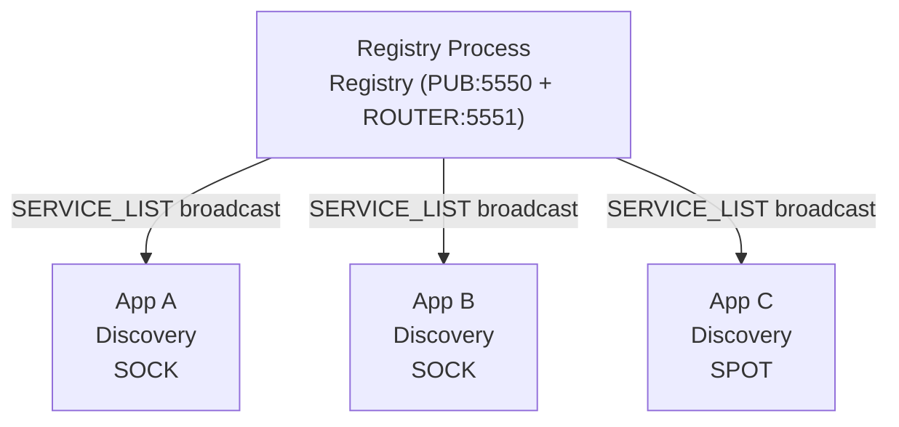
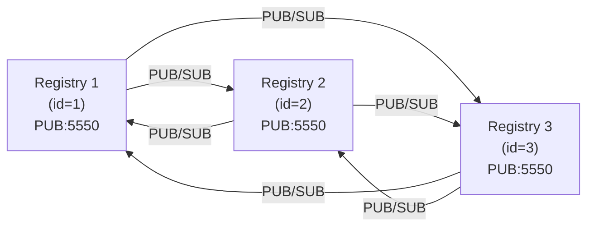
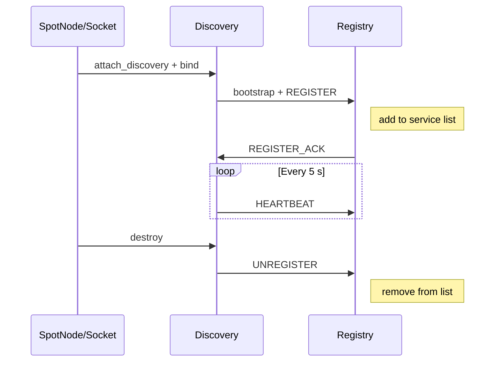

[English](./07-4-registry.md) | [한국어](./07-4-registry.ko.md)

# Registry (중앙 서비스 디렉토리)

> **규범 상태(Normative status): 설명 목적(Illustrative) — 갱신 필요.**
> 이 가이드는 설명 목적의 문서이며, API 명칭/시그니처의 정확한 기준은
> `core/include/zlink.h`와 `bindings/README.md`다.

## 1. 개요

Registry는 zlink 서비스 계층의 중앙 서비스 디렉토리이자 토폴로지 요약 소스다.
SPOT 노드와 소켓 패밀리 서비스의 등록(Discovery를 통해)을 수락하고,
하트비트 기반 생존 확인을 관리하며,
집계된 서비스 목록을 연결된 Discovery에 주기적으로 브로드캐스트한다.

### 두 가지 사용 모드

| 모드 | 설명 |
|------|------|
| **독립 프로세스** | Registry를 전용 서비스로 실행. 여러 애플리케이션이 Discovery를 통해 연결. |
| **임베디드** | 애플리케이션 프로세스 내에 Registry를 Discovery, 서비스(SPOT/Socket)와 함께 직접 생성. |

**Registry는 스레드 안전(thread-safe)하다.**
하나의 Registry 핸들을 여러 스레드에서 동시에 사용할 수 있다.

- **구성 API** (`set_id`, `add_peer`, `set_heartbeat` 등): `bind` 전에 호출한다.
- **조회 API** (`topology`, `topology(filter)` 등): bind 이후 어떤 스레드에서든 호출할 수 있다.

## 2. Quick Start

Registry를 실행하고 Discovery를 통해 ROUTER 소켓을 연결하는 최소 예제.

```c
void *ctx = zlink_ctx_new();

/* === Registry === */
void *registry = zlink_registry_new(ctx);
/* PUB: service list broadcast, ROUTER: registration/heartbeat/queries */
zlink_registry_bind(registry, "tcp://*:5550", "tcp://*:5551");

/* === Discovery === */
void *discovery = zlink_discovery_new(ctx,
    ZLINK_AUTO_CONNECT_CLIENT_SERVER, "my-service");
zlink_discovery_connect_registry(discovery, "tcp://127.0.0.1:5551");

/* === ROUTER socket (server, Discovery-managed) === */
void *server = zlink_socket(ctx, ZLINK_SOCKET_ROUTER);
zlink_bind(server, "tcp://*:5555");
zlink_socket_attach_discovery(server, discovery);

/* ... application logic ... */

/* Cleanup */
zlink_discovery_destroy(&discovery);
zlink_registry_destroy(&registry);
zlink_ctx_term(ctx);
```

## 3. Registry 구성

모든 구성 API는 `zlink_registry_bind()` **전에** 호출해야 한다.

### 3.1 하트비트

```c
/* interval_ms: how often services send heartbeats (default 5000 ms)
   timeout_ms:  when to expire silent services   (default 15000 ms) */
zlink_registry_set(registry, ZLINK_REGISTRY_OPT_HEARTBEAT_INTERVAL_MS, 5000);
    zlink_registry_set(registry, ZLINK_REGISTRY_OPT_HEARTBEAT_TIMEOUT_MS, 15000);
```

### 3.2 브로드캐스트 주기

```c
/* How often the full SERVICE_LIST is published on PUB (default 30000 ms) */
zlink_registry_set(registry, ZLINK_REGISTRY_OPT_BROADCAST_INTERVAL_MS, 30000);
```

### 3.3 클러스터 ID

```c
/* Assign a unique ID for cluster synchronization (must be unique per node) */
zlink_registry_set(registry, ZLINK_REGISTRY_OPT_ID, 1);
```

### 3.4 TLS 설정

TLS는 `zlink_set_tls_server`/`zlink_set_tls_client` API를 통해 Registry
handle에 직접 구성한다:

```c
/* TLS server configuration on Registry */
zlink_set_tls_server(registry, cert_pem, key_pem, 0 /* require_client_cert */);

/* TLS client configuration (for peer registry connections) */
zlink_set_tls_client(registry, ca_pem, NULL /* hostname */, 0 /* trust_system */);
```

## 4. 배포 패턴

### 4.1 독립 프로세스 배포

Registry를 전용 서비스로 실행한다. 여러 애플리케이션이 각자의 Discovery
인스턴스를 통해 연결한다. 애플리케이션 재시작 시에도 Registry가 유지되어야
하거나, 여러 독립 서비스가 하나의 Registry 클러스터를 공유할 때 이 모드를
사용한다.



프로덕션 배포에 권장하는 패턴:

- Registry 수명주기가 애플리케이션 재시작과 독립적이다.
- 여러 서비스가 단일 Registry(또는 클러스터)를 공유한다.
- 인프라와 애플리케이션의 관심사가 명확히 분리된다.

### 4.2 임베디드 배포

Registry, Discovery, 서비스(SPOT/Socket)가 모두 단일 프로세스에 존재한다.
개발, 테스트, 또는 단일 노드 배포에 유용하다. 외부 인프라 의존 없이
자체 완결형 애플리케이션이 필요할 때 임베디드 모드를 선택한다. 아래 코드는
하나의 프로세스 안에서 Registry를 생성하고 ROUTER 서버를 등록하고
DEALER 클라이언트를 연결하는 예제다.

```c
void *ctx = zlink_ctx_new();

/* Registry (embedded) */
void *registry = zlink_registry_new(ctx);
/* PUB: service list broadcast, ROUTER: registration/heartbeat/queries */
zlink_registry_bind(registry, "tcp://*:5550", "tcp://*:5551");

/* Discovery (same process) */
void *discovery = zlink_discovery_new(ctx,
    ZLINK_AUTO_CONNECT_CLIENT_SERVER, "echo-service");
zlink_discovery_connect_registry(discovery, "tcp://127.0.0.1:5551");

/* ROUTER socket (server, Discovery-managed) */
void *server = zlink_socket(ctx, ZLINK_SOCKET_ROUTER);
zlink_bind(server, "tcp://*:5555");
zlink_socket_attach_discovery(server, discovery);

/* DEALER socket (client, same process) */
void *client_disc = zlink_discovery_new(ctx,
    ZLINK_AUTO_CONNECT_CLIENT_SERVER, "echo-service");
zlink_discovery_connect_registry(client_disc, "tcp://127.0.0.1:5551");

void *client = zlink_socket(ctx, ZLINK_SOCKET_DEALER);
zlink_socket_attach_discovery(client, client_disc);

/* Send request */
zlink_msg_t part;
zlink_msg_init_size(&part, 5);
memcpy(zlink_msg_data(&part), "hello", 5);
zlink_send(client, &part, 1, 0);

/* Receive reply */
zlink_routing_id_t source_rid;
zlink_msg_t *reply_parts = NULL;
size_t reply_count = 0;
zlink_recv(client, &source_rid, &reply_parts, &reply_count, 0);

/* Cleanup (reverse order) */
zlink_discovery_destroy(&client_disc);
zlink_discovery_destroy(&discovery);
zlink_registry_destroy(&registry);
zlink_ctx_term(ctx);
```

> **팁**: 모든 컴포넌트가 같은 프로세스에 있을 때 `inproc://`(프로세스 내부) 전송 방식을
> 사용하면 Registry와 Discovery 간 제로카피(zero-copy, 메모리 복사 없이 전달) 통신이 가능하다.

## 5. 클러스터 구성 및 데이터 동기화

### 5.1 클러스터 구성

각 Registry 노드에는 고유 ID와 피어의 PUB 엔드포인트가 필요하다:

```c
/* Node 1 */
void *reg1 = zlink_registry_new(ctx);
zlink_registry_set(reg1, ZLINK_REGISTRY_OPT_ID, 1);
zlink_registry_add_peer(reg1, "tcp://registry2:5550");
zlink_registry_add_peer(reg1, "tcp://registry3:5550");
/* PUB: service list broadcast, ROUTER: registration/heartbeat/queries */
zlink_registry_bind(reg1, "tcp://*:5550", "tcp://*:5551");
```

### 5.2 동기화 메커니즘

Registry는 PUB/SUB 기반 플러딩(flooding, 전체 브로드캐스트 전파) 동기화를 사용한다:



- 각 Registry가 다른 모든 Registry의 PUB 엔드포인트를 구독
- 서비스 목록 변경이 다음 브로드캐스트 주기에 플러딩을 통해 전파
- **Eventually Consistent**: 모든 Registry가 동일한 상태로 수렴
- `registry_id` + `list_seq`를 통해 중복/역전 업데이트를 안전하게 무시

**Discovery 관점:** 서비스 목록이 플러딩으로 전파되므로, Discovery는 클러스터의
**하나의** Registry에만 연결해도 전체 서비스를 발견할 수 있다. 여러 Registry에
연결하는 것은 서비스 가시성이 아닌 장애 시 페일오버를 위해서다.

### 5.3 3노드 클러스터 전체 예제

```c
void *ctx = zlink_ctx_new();

/* === Node 1 === */
void *reg1 = zlink_registry_new(ctx);
zlink_registry_set(reg1, ZLINK_REGISTRY_OPT_ID, 1);
zlink_registry_add_peer(reg1, "tcp://registry2:5550");
zlink_registry_add_peer(reg1, "tcp://registry3:5550");
zlink_registry_set(reg1, ZLINK_REGISTRY_OPT_HEARTBEAT_INTERVAL_MS, 5000);
    zlink_registry_set(reg1, ZLINK_REGISTRY_OPT_HEARTBEAT_TIMEOUT_MS, 15000);
/* PUB: service list broadcast, ROUTER: registration/heartbeat/queries */
zlink_registry_bind(reg1, "tcp://*:5550", "tcp://*:5551");

/* === Node 2 === */
void *reg2 = zlink_registry_new(ctx);
zlink_registry_set(reg2, ZLINK_REGISTRY_OPT_ID, 2);
zlink_registry_add_peer(reg2, "tcp://registry1:5550");
zlink_registry_add_peer(reg2, "tcp://registry3:5550");
zlink_registry_set(reg2, ZLINK_REGISTRY_OPT_HEARTBEAT_INTERVAL_MS, 5000);
    zlink_registry_set(reg2, ZLINK_REGISTRY_OPT_HEARTBEAT_TIMEOUT_MS, 15000);
zlink_registry_bind(reg2, "tcp://*:5550", "tcp://*:5551");

/* === Node 3 === */
void *reg3 = zlink_registry_new(ctx);
zlink_registry_set(reg3, ZLINK_REGISTRY_OPT_ID, 3);
zlink_registry_add_peer(reg3, "tcp://registry1:5550");
zlink_registry_add_peer(reg3, "tcp://registry2:5550");
zlink_registry_set(reg3, ZLINK_REGISTRY_OPT_HEARTBEAT_INTERVAL_MS, 5000);
    zlink_registry_set(reg3, ZLINK_REGISTRY_OPT_HEARTBEAT_TIMEOUT_MS, 15000);
zlink_registry_bind(reg3, "tcp://*:5550", "tcp://*:5551");

/* Discovery connects to multiple Registries (HA — a single one suffices for service visibility) */
void *discovery = zlink_discovery_new(ctx,
    ZLINK_AUTO_CONNECT_CLIENT_SERVER, "my-service");
zlink_discovery_connect_registry(discovery, "tcp://registry1:5551");
zlink_discovery_connect_registry(discovery, "tcp://registry2:5551");
zlink_discovery_connect_registry(discovery, "tcp://registry3:5551");

/* ... */

/* Cleanup */
zlink_discovery_destroy(&discovery);
zlink_registry_destroy(&reg3);
zlink_registry_destroy(&reg2);
zlink_registry_destroy(&reg1);
zlink_ctx_term(ctx);
```

## 6. 토폴로지 조회 (Topology Introspection)

Registry는 글로벌 서비스 토폴로지를 조회하는 API를 제공한다. **로컬**(같은
프로세스)과 **원격**(다른 프로세스, 쿼리 클라이언트 사용) 두 가지 방식이 있다.

### 6.0 Registry 상태 조회

Registry 자체의 운영 상태를 조회한다:

```c
zlink_registry_status_t status;
zlink_registry_status(registry, &status);

printf("registry_id=%u  state=%d  entries=%u  peers=%u/%u\n",
       status.registry_id,
       status.state,
       status.topology_entry_count,
       status.connected_peer_registry_count,
       status.peer_registry_count);
```

`zlink_registry_status_t` 필드:

| 필드 | 설명 |
|------|------|
| `registry_id` | 숫자 Registry ID |
| `bind_endpoint` | 현재 바인드 엔드포인트 |
| `state` | 현재 Registry 상태 |
| `topology_entry_count` | 토폴로지 테이블 전체 엔트리 수 |
| `peer_registry_count` | 설정된 피어 Registry 수 |
| `connected_peer_registry_count` | 현재 연결된 피어 Registry 수 |
| `list_seq` | 마지막 발행된 서비스 목록의 단조 증가 시퀀스 번호 |
| `last_error` | 마지막 오류 코드 (`0` = 없음) |
| `last_changed_ms` | 가장 최근 상태 변경의 epoch ms |

#### 서비스 요약 (Service Summary)

토폴로지 전체의 channel별 집계 통계:

```c
/* 전체 channel 요약 */
size_t count = 0;
zlink_registry_service_summary(registry, NULL, NULL, &count);

zlink_registry_service_summary_entry_t *entries = malloc(
    count * sizeof(zlink_registry_service_summary_entry_t));
zlink_registry_service_summary(registry, NULL, entries, &count);

for (size_t i = 0; i < count; i++) {
    printf("channel=%s  total=%u  ready=%u  err=%u\n",
           entries[i].channel_name,
           entries[i].total_count,
           entries[i].ready_count,
           entries[i].error_count);
}
free(entries);
```

`zlink_registry_service_summary_entry_t` 필드:

| 필드 | 설명 |
|------|------|
| `auto_connect_type` | 자동 연결 channel 타입 |
| `service_role` | 서비스 역할 |
| `channel_name` | 논리적 channel 이름 |
| `total_count` | 전체 등록된 인스턴스 수 |
| `connecting_count` | 현재 연결 중인 인스턴스 수 |
| `ready_count` | 현재 ready 상태 인스턴스 수 |
| `error_count` | 오류 상태 인스턴스 수 |
| `stopped_count` | 중지된 인스턴스 수 |
| `last_reported_ms` | 가장 최근 heartbeat의 epoch ms |

`auto_connect_type`, `service_role`, `channel_name`으로 필터링 가능
(0 값은 와일드카드):

```c
zlink_registry_service_summary_filter_t filter;
memset(&filter, 0, sizeof(filter));
strncpy(filter.channel_name, "payment-service",
        sizeof(filter.channel_name) - 1);

size_t count = 64;
zlink_registry_service_summary_entry_t entries[64];
zlink_registry_service_summary(registry, &filter, entries, &count);
```

### 6.1 로컬 조회 (같은 프로세스)

#### 전체 스냅샷

```c
/* Query required count first */
size_t count = 0;
zlink_registry_topology(registry, NULL, &count);

/* Allocate and fetch */
zlink_registry_topology_entry_t *entries = malloc(
    count * sizeof(zlink_registry_topology_entry_t));
zlink_registry_topology(registry, entries, &count);

for (size_t i = 0; i < count; i++) {
    printf("channel=%s endpoint=%s state=%d\n",
           entries[i].channel_name,
           entries[i].endpoint,
           entries[i].state);
}
free(entries);
```

#### 필터 기반 조회

```c
/* Query only READY SOCKET instances of "payment-service" */
zlink_registry_topology_filter_t filter;
memset(&filter, 0, sizeof(filter));
filter.service_kind = ZLINK_SERVICE_KIND_SOCKET;
strncpy(filter.channel_name, "payment-service",
        sizeof(filter.channel_name) - 1);
filter.state = ZLINK_TOPOLOGY_STATE_READY;

size_t count = 64;
zlink_registry_topology_entry_t entries[64];
zlink_registry_topology(registry, &filter, entries, &count);

printf("READY instances: %zu\n", count);
for (size_t i = 0; i < count; i++) {
    printf("  %s (ready_count=%u)\n",
           entries[i].endpoint, entries[i].ready_count);
}
```

#### 토폴로지 엔트리 필드

| 필드 | 설명 |
|------|------|
| `routing_id` | 서비스 인스턴스의 라우팅 ID |
| `service_kind` | `SPOT_PUB`, `SPOT_SUB`, `SOCKET`, 또는 `DISCOVERY` |
| `channel_name` | 논리적 channel 이름 |
| `endpoint` | 광고된 엔드포인트 |
| `source` | 추가 방식 (`MANUAL`/`DISCOVERY`/`REGISTRY`) |
| `state` | `DISCOVERED`/`CONNECTING`/`READY`/`LOST`/`ERROR`/`STOPPED` |
| `desired_count` | 기대 피어 인스턴스 수 |
| `ready_count` | 현재 ready 상태 인스턴스 수 |
| `error_code` | `ERROR` 상태일 때 오류 코드 |
| `last_reported_ms` | 마지막 업데이트 타임스탬프 (epoch ms) |

#### 필터 필드

필드를 0이 아닌 값으로 설정하면 해당 기준으로 필터링한다. 0 값 필드는
와일드카드(전체 매칭)로 처리된다.

| 필드 | 설명 |
|------|------|
| `service_kind` | 서비스 종류로 필터링 |
| `channel_name` | channel 이름으로 필터링 |
| `routing_id` | 라우팅 ID로 필터링 |
| `state` | 토폴로지 상태로 필터링 |
| `source` | 토폴로지 소스로 필터링 |

### 6.2 원격 조회 (다른 프로세스)

쿼리 클라이언트를 사용하여 별도 프로세스의 Registry를 조회한다.
운영 도구나 CLI 유틸리티에서 주로 사용하는 패턴이다.

```c
void *ctx = zlink_ctx_new();

/* Create query client and connect to Registry ROUTER endpoint */
void *client = zlink_registry_query_client_new(ctx);
zlink_registry_query_client_connect(client, "tcp://registry1:5551");

/* Unfiltered snapshot (pass NULL filter for all entries) */
size_t count = 0;
zlink_registry_query_client_topology(client, NULL, NULL, &count);

zlink_registry_topology_entry_t *entries = malloc(
    count * sizeof(zlink_registry_topology_entry_t));
zlink_registry_query_client_topology(client, NULL, entries, &count);

/* Print topology dump */
for (size_t i = 0; i < count; i++) {
    const char *kind_str = "?";
    if (entries[i].service_kind == ZLINK_SERVICE_KIND_SPOT_PUB
        || entries[i].service_kind == ZLINK_SERVICE_KIND_SPOT_SUB)
        kind_str = "SPOT";
    else if (entries[i].service_kind == ZLINK_SERVICE_KIND_SOCKET)
        kind_str = "SOCK";
    else if (entries[i].service_kind == ZLINK_SERVICE_KIND_DISCOVERY)
        kind_str = "DISC";
    printf("[%s] %s @ %s  state=%d  ready=%u/%u\n",
           kind_str,
           entries[i].channel_name,
           entries[i].endpoint,
           entries[i].state,
           entries[i].ready_count,
           entries[i].desired_count);
}
free(entries);

/* Filtered remote query */
zlink_registry_topology_filter_t filter;
memset(&filter, 0, sizeof(filter));
filter.state = ZLINK_TOPOLOGY_STATE_LOST;

size_t lost_count = 64;
zlink_registry_topology_entry_t lost[64];
zlink_registry_query_client_topology(client, &filter, lost, &lost_count);
printf("LOST entries: %zu\n", lost_count);

/* Cleanup */
zlink_registry_query_client_destroy(&client);
zlink_ctx_term(ctx);
```

### 6.3 Member Peer 조회

Registry와 Discovery는 서비스의 피어별 라우팅 속성(`value`)을 노출하는
멤버 피어 조회를 제공한다. 가중치 기반 라우팅 결정과 운영 모니터링에
유용하다.

#### Registry Member Peer 조회

```c
/* Query member peers of a specific service from the local Registry */
size_t count = 0;
zlink_registry_member_peers(registry,
    "payment-service", NULL, &count);

zlink_member_peer_entry_t *peers = malloc(
    count * sizeof(zlink_member_peer_entry_t));
zlink_registry_member_peers(registry,
    "payment-service", peers, &count);

for (size_t i = 0; i < count; i++) {
    printf("channel=%s endpoint=%s value=%lld\n",
           peers[i].channel_name,
           peers[i].endpoint,
           (long long)peers[i].value);
}
free(peers);
```

#### Member Peer 엔트리 필드

| 필드 | 설명 |
|------|------|
| `auto_connect_type` | 자동 연결 channel 타입 (`ZLINK_AUTO_CONNECT_*`) |
| `service_role` | 서비스 인스턴스의 역할 |
| `channel_name` | null 종료 channel 이름 |
| `endpoint` | null 종료 엔드포인트 |
| `routing_id` | 피어의 라우팅 아이덴티티 |
| `value` | 서비스별 숫자 값 (`int64_t`) |

#### Discovery Member Peer 조회

```c
/* Query member peers from the local Discovery cache */
size_t count = 0;
zlink_discovery_member_peers(discovery, NULL, &count);

zlink_member_peer_entry_t *peers = malloc(
    count * sizeof(zlink_member_peer_entry_t));
zlink_discovery_member_peers(discovery, peers, &count);

for (size_t i = 0; i < count; i++) {
    printf("[%s] endpoint=%s role=%u value=%lld\n",
           peers[i].channel_name,
           peers[i].endpoint,
           peers[i].service_role,
           (long long)peers[i].value);
}
free(peers);
```

#### Actor Active Route 조회

Actor 주소는 애플리케이션 키-값 저장소가 아닌 핵심 Actor 활성 경로(active route)로
조회한다. Actor 소유 Discovery에서 `ZLINK_OPT_DISCOVERY_ACTOR_ROUTE_SYNC`를 켜면
`zlink_discovery_resolve_actor()`가 `actor_id -> node_rid + current_spot_rid +
current_spot_kind`를 반환한다. Actor가 생성 직후 Entry Spot에 있으면 Entry Spot
route가 반환되고, user Spot으로 join하면 user Spot route로 갱신된다. user Spot에서
leave하면 같은 node의 Entry Spot 위치로 다시 갱신된다.

Spot rid의 owner를 찾을 때는 `zlink_discovery_resolve_spot()`를 사용한다. 이 함수는
`spot_rid -> owner_node_rid + spot_kind`를 반환하므로 Entry Spot과 user Spot을
구분할 수 있다. Spot name 같은 도메인 이름은 core route 계약이 아니므로, 필요하면
framework나 애플리케이션의 보조 색인에서 Spot rid로 변환한 뒤 core Spot route 조회를
사용한다.

STREAM 세션 바인딩/해제는 Actor 활성 경로의 필수 조건이 아니다. session attach처럼
concrete Actor instance를 고정해야 하는 경로에서는 별도의 generation 검증을 사용한다.
매치 ID, 사용자 ID 같은 도메인 키는 Redis나 DB 같은 외부 저장소에서 관리한다.

## 7. 운영 패턴

### 7.1 서비스 등록/해제 흐름



### 7.2 하트비트 타임아웃 및 자동 제거

서비스가 `timeout_ms`(기본 15초) 이내에 하트비트를 보내지 않으면, Registry가
자동으로 서비스 목록에서 제거한다. 제거는 다음 SERVICE_LIST 발행 시 모든
Discovery 인스턴스에 브로드캐스트된다.

### 7.3 Discovery 페일오버

- Discovery는 하나 이상의 Registry ROUTER 엔드포인트에 부트스트랩(bootstrap, 초기 연결) 연결한다.
- 부트스트랩 메타데이터로 내부 broadcast/uplink 경로를 학습한다.
- 한 Registry 노드가 실패해도 다른 부트스트랩 엔드포인트를 통해 계속 동작한다.
- Discovery의 페일오버 로직을 통해 서비스가 자동으로 재등록된다.

### 7.4 클러스터 내 Registry 노드 장애

- 생존 Registry 노드가 독립적으로 계속 동작한다.
- 각 노드는 자체 서비스 목록을 유지한다.
- 생존 노드에 연결된 Discovery 클라이언트는 영향을 받지 않는다.
- 장애 노드가 복구되면 플러딩 메커니즘으로 재동기화한다.
- Eventually consistent: 모든 노드가 동일 상태로 수렴한다.

## 8. 역할 분리: Registry vs Monitor

Registry와 로컬 서비스 모니터는 다른 목적을 가진다:

| 측면 | Registry 토폴로지 | 로컬 서비스 모니터 |
|------|-------------------|-------------------|
| **범위** | 글로벌 서비스 요약 | 단일 handle 상세 상태 |
| **세분도** | `READY`/`LOST`/`ERROR` | 개별 연결 이벤트 |
| **최신성** | Eventually consistent | 실시간 (즉시 콜백) |
| **접근** | 로컬 또는 원격 쿼리 | 로컬만 (같은 프로세스) |

### 용도 구분

- **Registry 토폴로지**: "클러스터 전체에서 `payment-service` 인스턴스가 몇
  개 READY인가?" — 1차 운영 판단
- **로컬 모니터**: "이 서비스가 왜 피어 X에 연결하지 못하는가?" — 상세
  원인 분석

권장 워크플로우:

1. Registry 토폴로지 스냅샷으로 글로벌 현황 파악
2. 이상 항목 식별 (`LOST`, `ERROR` 엔트리)
3. 해당 프로세스의 로컬 서비스 모니터로 상세 분석

## 9. 다음 단계

- [Service Discovery](./07-1-discovery.ko.md) -- 기반 인프라
- [SPOT PUB/SUB](./07-3-spot.ko.md) -- 위치투명 발행/구독
- [Registry API 레퍼런스](../api/registry.ko.md) -- 전체 API 문서

---
[← SPOT](./07-3-spot.ko.md) | [Routing ID →](./08-routing-id.ko.md)
