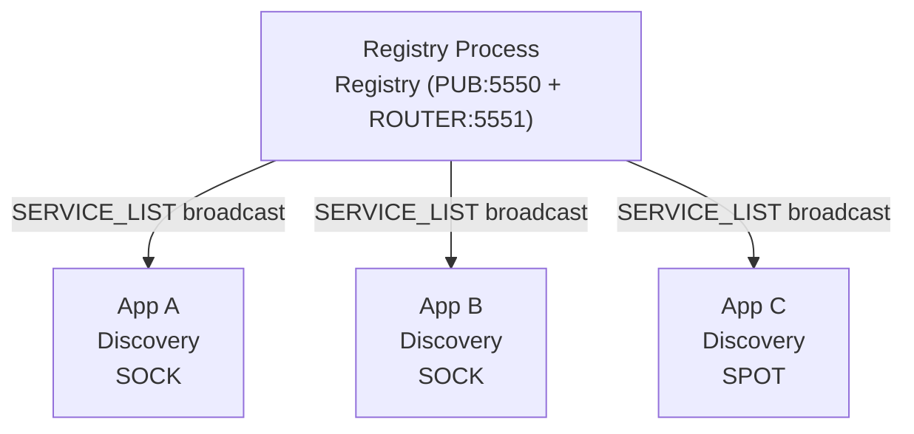
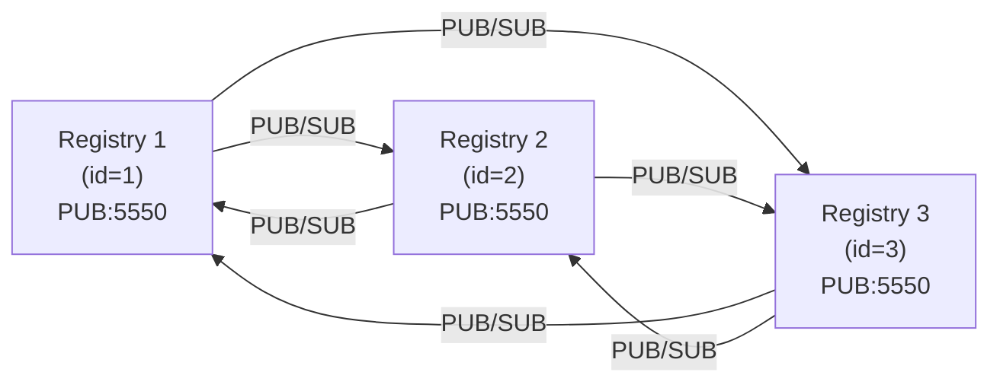
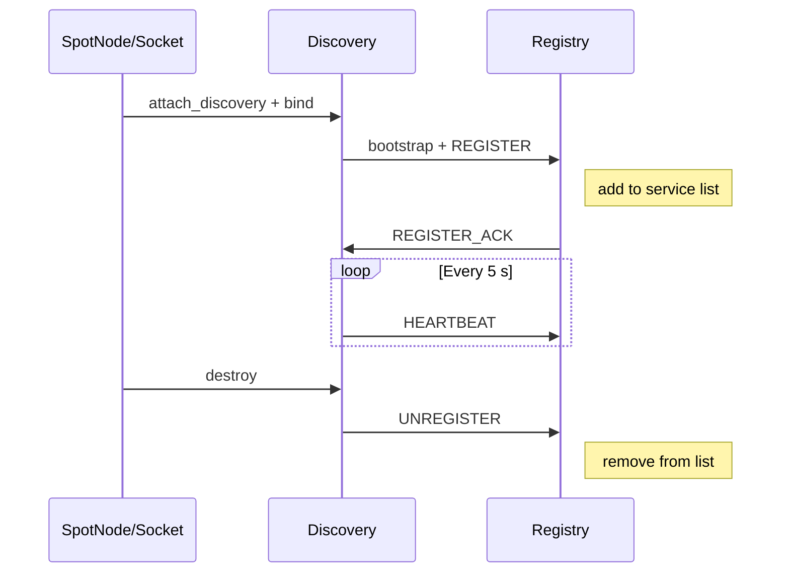

[English](07-4-registry.md) | [한국어](07-4-registry.ko.md)

# Registry (Central Service Directory)

> **Normative status: Illustrative — Needs refresh.**
> 이 가이드는 설명 목적의 문서이며, API 명칭/시그니처의 정확한 기준은
> `core/include/zlink.h`와 `bindings/README.md`다.

## 1. Overview

Registry is the central service directory and topology summary source for
the zlink service layer. It accepts service registrations from SPOT nodes
and socket family services (via Discovery), manages heartbeat-based liveness, and
periodically broadcasts the aggregated service list to all connected
Discovery instances.

### Two Usage Modes

| Mode | Description |
|------|-------------|
| **Standalone process** | Registry runs as a dedicated service. Multiple applications connect through Discovery. |
| **Embedded** | Registry is created inside the application process alongside Discovery and services (SPOT/Socket). |

**Registry is thread-safe.** A single Registry handle can be used
concurrently from multiple threads. Configuration APIs (`set_id`, `add_peer`,
`set_heartbeat`, `set_broadcast_interval`) must be called
before `bind`. Topology query APIs (`topology_snapshot`, `topology_query`,
`member_peers`) are safe to call from any
thread at any time after bind.

## 2. Quick Start

Minimal setup to get a Registry running and a ROUTER socket connected
through Discovery.

```c
void *ctx = zlink_ctx_new();

/* === Registry === */
void *registry = zlink_registry_new(ctx);
/* PUB: service list broadcast, ROUTER: registration/heartbeat/queries */
zlink_registry_bind(registry, "tcp://*:5550", "tcp://*:5551");

/* === Discovery === */
void *discovery = zlink_discovery_new(ctx,
    ZLINK_AUTO_CONNECT_CLIENT_SERVER, "my-service");
zlink_discovery_connect_registry(discovery, "tcp://127.0.0.1:5551");

/* === ROUTER socket (server, Discovery-managed) === */
void *server = zlink_socket(ctx, ZLINK_SOCKET_ROUTER);
zlink_bind(server, "tcp://*:5555");
zlink_socket_attach_discovery(server, discovery);

/* ... application logic ... */

/* Cleanup */
zlink_discovery_destroy(&discovery);
zlink_registry_destroy(&registry);
zlink_ctx_term(ctx);
```

## 3. Registry Configuration

All configuration APIs must be called **before** `zlink_registry_bind()`.

### 3.1 Heartbeat

```c
/* interval_ms: how often services send heartbeats (default 5000 ms)
   timeout_ms:  when to expire silent services   (default 15000 ms) */
zlink_registry_set(registry, ZLINK_REGISTRY_OPT_HEARTBEAT_INTERVAL_MS, 5000);
    zlink_registry_set(registry, ZLINK_REGISTRY_OPT_HEARTBEAT_TIMEOUT_MS, 15000);
```

### 3.2 Broadcast Interval

```c
/* How often the full SERVICE_LIST is published on PUB (default 30000 ms) */
zlink_registry_set(registry, ZLINK_REGISTRY_OPT_BROADCAST_INTERVAL_MS, 30000);
```

### 3.3 Cluster ID

```c
/* Assign a unique ID for cluster synchronization (must be unique per node) */
zlink_registry_set(registry, ZLINK_REGISTRY_OPT_ID, 1);
```

### 3.4 TLS Configuration

TLS is configured through the `zlink_set_tls_server`/`zlink_set_tls_client`
API on the Registry handle:

```c
/* TLS server configuration on Registry */
zlink_set_tls_server(registry, cert_pem, key_pem, 0 /* require_client_cert */);

/* TLS client configuration (for peer registry connections) */
zlink_set_tls_client(registry, ca_pem, NULL /* hostname */, 0 /* trust_system */);
```

## 4. Deployment Patterns

### 4.1 Standalone Process

Registry runs as a dedicated service. Multiple applications connect
through their own Discovery instances. Use this mode when the Registry
must survive application restarts or when multiple independent services
share a single Registry cluster.



This is the recommended pattern for production deployments:

- Registry lifecycle is independent of application restarts
- Multiple services share a single Registry (or cluster)
- Clear separation of infrastructure and application concerns

### 4.2 Embedded Deployment

Registry, Discovery, and services (SPOT/Socket) all live in a single process.
Useful for development, testing, or single-node deployments. Choose embedded
mode when you want a self-contained application with no external infrastructure
dependencies. The code below creates a Registry, registers a ROUTER server,
and connects a DEALER client all within one process.

```c
void *ctx = zlink_ctx_new();

/* Registry (embedded) */
void *registry = zlink_registry_new(ctx);
/* PUB: service list broadcast, ROUTER: registration/heartbeat/queries */
zlink_registry_bind(registry, "tcp://*:5550", "tcp://*:5551");

/* Discovery (same process) */
void *discovery = zlink_discovery_new(ctx,
    ZLINK_AUTO_CONNECT_CLIENT_SERVER, "echo-service");
zlink_discovery_connect_registry(discovery, "tcp://127.0.0.1:5551");

/* ROUTER socket (server, Discovery-managed) */
void *server = zlink_socket(ctx, ZLINK_SOCKET_ROUTER);
zlink_bind(server, "tcp://*:5555");
zlink_socket_attach_discovery(server, discovery);

/* DEALER socket (client, same process) */
void *client_disc = zlink_discovery_new(ctx,
    ZLINK_AUTO_CONNECT_CLIENT_SERVER, "echo-service");
zlink_discovery_connect_registry(client_disc, "tcp://127.0.0.1:5551");

void *client = zlink_socket(ctx, ZLINK_SOCKET_DEALER);
zlink_socket_attach_discovery(client, client_disc);

/* Send request */
zlink_msg_t part;
zlink_msg_init_size(&part, 5);
memcpy(zlink_msg_data(&part), "hello", 5);
zlink_send(client, &part, 1, 0);

/* Receive reply */
zlink_routing_id_t source_rid;
zlink_msg_t *reply_parts = NULL;
size_t reply_count = 0;
zlink_recv(client, &source_rid, &reply_parts, &reply_count, 0);

/* Cleanup (reverse order) */
zlink_discovery_destroy(&client_disc);
zlink_discovery_destroy(&discovery);
zlink_registry_destroy(&registry);
zlink_ctx_term(ctx);
```

> **Tip**: When all components are in the same process, you can use
> `inproc://` transport for zero-copy communication between the Registry
> and Discovery.

## 5. Cluster Setup & Data Synchronization

### 5.1 Cluster Configuration

Each Registry node needs a unique ID and the PUB endpoints of its peers:

```c
/* Node 1 */
void *reg1 = zlink_registry_new(ctx);
zlink_registry_set(reg1, ZLINK_REGISTRY_OPT_ID, 1);
zlink_registry_add_peer(reg1, "tcp://registry2:5550");
zlink_registry_add_peer(reg1, "tcp://registry3:5550");
/* PUB: service list broadcast, ROUTER: registration/heartbeat/queries */
zlink_registry_bind(reg1, "tcp://*:5550", "tcp://*:5551");
```

### 5.2 Synchronization Mechanism

Registry uses flooding-based synchronization via PUB/SUB:



- Each Registry subscribes to every other Registry's PUB endpoint
- Service list changes are propagated via flooding on the next broadcast cycle
- **Eventually Consistent**: all Registries converge to the same state
- Duplicate and out-of-order updates are safely ignored via `registry_id` + `list_seq`

**Discovery perspective:** Since the service list is propagated via flooding,
a Discovery only needs to connect to **one** Registry in the cluster to discover
all services. Connecting to multiple Registries is for failover in case of failure.

### 5.3 Three-Node Cluster Example

```c
void *ctx = zlink_ctx_new();

/* === Node 1 === */
void *reg1 = zlink_registry_new(ctx);
zlink_registry_set(reg1, ZLINK_REGISTRY_OPT_ID, 1);
zlink_registry_add_peer(reg1, "tcp://registry2:5550");
zlink_registry_add_peer(reg1, "tcp://registry3:5550");
zlink_registry_set(reg1, ZLINK_REGISTRY_OPT_HEARTBEAT_INTERVAL_MS, 5000);
    zlink_registry_set(reg1, ZLINK_REGISTRY_OPT_HEARTBEAT_TIMEOUT_MS, 15000);
/* PUB: service list broadcast, ROUTER: registration/heartbeat/queries */
zlink_registry_bind(reg1, "tcp://*:5550", "tcp://*:5551");

/* === Node 2 === */
void *reg2 = zlink_registry_new(ctx);
zlink_registry_set(reg2, ZLINK_REGISTRY_OPT_ID, 2);
zlink_registry_add_peer(reg2, "tcp://registry1:5550");
zlink_registry_add_peer(reg2, "tcp://registry3:5550");
zlink_registry_set(reg2, ZLINK_REGISTRY_OPT_HEARTBEAT_INTERVAL_MS, 5000);
    zlink_registry_set(reg2, ZLINK_REGISTRY_OPT_HEARTBEAT_TIMEOUT_MS, 15000);
zlink_registry_bind(reg2, "tcp://*:5550", "tcp://*:5551");

/* === Node 3 === */
void *reg3 = zlink_registry_new(ctx);
zlink_registry_set(reg3, ZLINK_REGISTRY_OPT_ID, 3);
zlink_registry_add_peer(reg3, "tcp://registry1:5550");
zlink_registry_add_peer(reg3, "tcp://registry2:5550");
zlink_registry_set(reg3, ZLINK_REGISTRY_OPT_HEARTBEAT_INTERVAL_MS, 5000);
    zlink_registry_set(reg3, ZLINK_REGISTRY_OPT_HEARTBEAT_TIMEOUT_MS, 15000);
zlink_registry_bind(reg3, "tcp://*:5550", "tcp://*:5551");

/* Discovery connects to multiple Registries (HA — a single one suffices for service visibility) */
void *discovery = zlink_discovery_new(ctx,
    ZLINK_AUTO_CONNECT_CLIENT_SERVER, "my-service");
zlink_discovery_connect_registry(discovery, "tcp://registry1:5551");
zlink_discovery_connect_registry(discovery, "tcp://registry2:5551");
zlink_discovery_connect_registry(discovery, "tcp://registry3:5551");

/* ... */

/* Cleanup */
zlink_discovery_destroy(&discovery);
zlink_registry_destroy(&reg3);
zlink_registry_destroy(&reg2);
zlink_registry_destroy(&reg1);
zlink_ctx_term(ctx);
```

## 6. Topology Introspection

Registry provides APIs to inspect the global service topology. There are
two access modes: **local** (same process) and **remote** (different
process via query client).

### 6.0 Registry Status

Query the operational state of the Registry itself:

```c
zlink_registry_status_t status;
zlink_registry_status_snapshot(registry, &status);

printf("registry_id=%u  state=%d  entries=%u  peers=%u/%u\n",
       status.registry_id,
       status.state,
       status.topology_entry_count,
       status.connected_peer_registry_count,
       status.peer_registry_count);
```

`zlink_registry_status_t` fields:

| Field | Description |
|-------|-------------|
| `registry_id` | Numeric registry identity |
| `bind_endpoint` | Active bind endpoint |
| `state` | Current registry state |
| `topology_entry_count` | Total entries in topology table |
| `peer_registry_count` | Number of configured peer registries |
| `connected_peer_registry_count` | Number of peer registries currently connected |
| `list_seq` | Monotonic sequence number of the last published service list |
| `last_error` | Last error code (`0` = none) |
| `last_changed_ms` | Epoch ms of the most recent state change |

#### Service Summary

Aggregate per-channel statistics across the topology:

```c
/* Summary of all channels */
size_t count = 0;
zlink_registry_service_summary_snapshot(registry, NULL, NULL, &count);

zlink_registry_service_summary_entry_t *entries = malloc(
    count * sizeof(zlink_registry_service_summary_entry_t));
zlink_registry_service_summary_snapshot(registry, NULL, entries, &count);

for (size_t i = 0; i < count; i++) {
    printf("channel=%s  total=%u  ready=%u  err=%u\n",
           entries[i].channel_name,
           entries[i].total_count,
           entries[i].ready_count,
           entries[i].error_count);
}
free(entries);
```

`zlink_registry_service_summary_entry_t` fields:

| Field | Description |
|-------|-------------|
| `auto_connect_type` | Auto-connect channel type |
| `service_role` | Role of the service |
| `channel_name` | Logical channel name |
| `total_count` | Total registered instances |
| `connecting_count` | Instances currently connecting |
| `ready_count` | Instances currently ready |
| `error_count` | Instances in error state |
| `stopped_count` | Instances stopped |
| `last_reported_ms` | Epoch ms of the most recent heartbeat |

Filter by `auto_connect_type`, `service_role`, or `channel_name`
(zero-values are wildcards):

```c
zlink_registry_service_summary_filter_t filter;
memset(&filter, 0, sizeof(filter));
strncpy(filter.channel_name, "payment-service",
        sizeof(filter.channel_name) - 1);

size_t count = 64;
zlink_registry_service_summary_entry_t entries[64];
zlink_registry_service_summary_snapshot(registry, &filter, entries, &count);
```

### 6.1 Local Query (Same Process)

#### Full Snapshot

```c
/* Query required count first */
size_t count = 0;
zlink_registry_topology_snapshot(registry, NULL, &count);

/* Allocate and fetch */
zlink_registry_topology_entry_t *entries = malloc(
    count * sizeof(zlink_registry_topology_entry_t));
zlink_registry_topology_snapshot(registry, entries, &count);

for (size_t i = 0; i < count; i++) {
    printf("channel=%s endpoint=%s state=%d\n",
           entries[i].channel_name,
           entries[i].endpoint,
           entries[i].state);
}
free(entries);
```

#### Filtered Query

```c
/* Query only READY SOCKET instances of "payment-service" */
zlink_registry_topology_filter_t filter;
memset(&filter, 0, sizeof(filter));
filter.service_kind = ZLINK_SERVICE_KIND_SOCKET;
strncpy(filter.channel_name, "payment-service",
        sizeof(filter.channel_name) - 1);
filter.state = ZLINK_TOPOLOGY_STATE_READY;

size_t count = 64;
zlink_registry_topology_entry_t entries[64];
zlink_registry_topology_query(registry, &filter, entries, &count);

printf("READY instances: %zu\n", count);
for (size_t i = 0; i < count; i++) {
    printf("  %s (ready_count=%u)\n",
           entries[i].endpoint, entries[i].ready_count);
}
```

#### Topology Entry Fields

| Field | Description |
|-------|-------------|
| `routing_id` | Routing identity of the service instance |
| `service_kind` | `SPOT_PUB`, `SPOT_SUB`, `SOCKET`, or `DISCOVERY` |
| `channel_name` | Logical channel name |
| `endpoint` | Advertised endpoint |
| `source` | How the entry was added (`MANUAL`, `DISCOVERY`, `REGISTRY`) |
| `state` | `DISCOVERED`, `CONNECTING`, `READY`, `LOST`, `ERROR`, `STOPPED` |
| `desired_count` | Expected number of peer instances |
| `ready_count` | Number of instances currently ready |
| `error_code` | Error code if state is `ERROR` |
| `last_reported_ms` | Timestamp (epoch ms) of the last heartbeat or update |

#### Filter Fields

Set fields to non-zero values to filter by that criterion. Zero-valued
fields are treated as wildcards (match all).

| Field | Description |
|-------|-------------|
| `service_kind` | Filter by service kind |
| `channel_name` | Filter by channel name |
| `routing_id` | Filter by routing identity |
| `state` | Filter by topology state |
| `source` | Filter by topology source |

### 6.2 Remote Query (Different Process)

Use the query client to inspect a Registry running in a separate process.
This is the pattern for operational tools and CLI utilities.

```c
void *ctx = zlink_ctx_new();

/* Create query client and connect to Registry ROUTER endpoint */
void *client = zlink_registry_query_client_new(ctx);
zlink_registry_query_client_connect(client, "tcp://registry1:5551");

/* Unfiltered snapshot (pass NULL filter for all entries) */
size_t count = 0;
zlink_registry_query_snapshot(client, NULL, NULL, &count);

zlink_registry_topology_entry_t *entries = malloc(
    count * sizeof(zlink_registry_topology_entry_t));
zlink_registry_query_snapshot(client, NULL, entries, &count);

/* Print topology dump */
for (size_t i = 0; i < count; i++) {
    const char *kind_str = "?";
    if (entries[i].service_kind == ZLINK_SERVICE_KIND_SPOT_PUB
        || entries[i].service_kind == ZLINK_SERVICE_KIND_SPOT_SUB)
        kind_str = "SPOT";
    else if (entries[i].service_kind == ZLINK_SERVICE_KIND_SOCKET)
        kind_str = "SOCK";
    else if (entries[i].service_kind == ZLINK_SERVICE_KIND_DISCOVERY)
        kind_str = "DISC";
    printf("[%s] %s @ %s  state=%d  ready=%u/%u\n",
           kind_str,
           entries[i].channel_name,
           entries[i].endpoint,
           entries[i].state,
           entries[i].ready_count,
           entries[i].desired_count);
}
free(entries);

/* Filtered remote query */
zlink_registry_topology_filter_t filter;
memset(&filter, 0, sizeof(filter));
filter.state = ZLINK_TOPOLOGY_STATE_LOST;

size_t lost_count = 64;
zlink_registry_topology_entry_t lost[64];
zlink_registry_query_snapshot(client, &filter, lost, &lost_count);
printf("LOST entries: %zu\n", lost_count);

/* Cleanup */
zlink_registry_query_destroy(&client);
zlink_ctx_term(ctx);
```

### 6.3 Member Peer Introspection

Registry and Discovery provide member peer queries that expose per-peer
routing attributes (`value`). This is useful for weighted routing decisions
and operational inspection.

#### Registry Member Peer Query

```c
/* Query member peers of a specific service from the local Registry */
size_t count = 0;
zlink_registry_member_peers(registry,
    "payment-service", NULL, &count);

zlink_member_peer_entry_t *peers = malloc(
    count * sizeof(zlink_member_peer_entry_t));
zlink_registry_member_peers(registry,
    "payment-service", peers, &count);

for (size_t i = 0; i < count; i++) {
    printf("channel=%s endpoint=%s value=%lld\n",
           peers[i].channel_name,
           peers[i].endpoint,
           (long long)peers[i].value);
}
free(peers);
```

#### Member Peer Entry Fields

| Field | Description |
|-------|-------------|
| `auto_connect_type` | Auto-connect channel type (`ZLINK_AUTO_CONNECT_*`) |
| `service_role` | Role of the service instance |
| `channel_name` | Null-terminated channel name |
| `endpoint` | Null-terminated endpoint |
| `routing_id` | Routing identity of the peer |
| `value` | Service-specific numeric value (`int64_t`) |

#### Discovery Member Peer Query

```c
/* Query member peers from the local Discovery cache */
size_t count = 0;
zlink_discovery_member_peers(discovery, NULL, &count);

zlink_member_peer_entry_t *peers = malloc(
    count * sizeof(zlink_member_peer_entry_t));
zlink_discovery_member_peers(discovery, peers, &count);

for (size_t i = 0; i < count; i++) {
    printf("[%s] endpoint=%s role=%u value=%lld\n",
           peers[i].channel_name,
           peers[i].endpoint,
           peers[i].service_role,
           (long long)peers[i].value);
}
free(peers);
```

#### Actor Active Route Lookup

Actor addresses are resolved through core Actor active routes, not through an
application key-value store. Enable `ZLINK_OPT_DISCOVERY_ACTOR_ROUTE_SYNC` on
the Actor owner Discovery, move the Actor into a user Spot via
`zlink_spot_node_actor_join_spot()`, then use
`zlink_discovery_resolve_actor()` to read the current Actor ref. The active
route is published at user Spot join success and is updated to the Entry Spot
location when an explicit leave succeeds; STREAM session bind/unbind has no
effect on the active route. Domain keys such as match ids and user ids should
live in an external store such as Redis or a database.

## 7. Operational Patterns

### 7.1 Service Registration/Deregistration Flow



### 7.2 Heartbeat Timeout and Auto-Removal

If a service does not send a heartbeat within `timeout_ms` (default 15s),
the Registry automatically removes it from the service list. The removal
is broadcast to all Discovery instances on the next SERVICE_LIST
publication.

### 7.3 Discovery Failover

- Discovery bootstraps against one or more Registry ROUTER endpoints
- It learns internal broadcast/uplink paths from bootstrap metadata
- If one Registry node fails, Discovery continues using other configured
  bootstrap endpoints
- Services re-register automatically through Discovery's failover logic

### 7.4 Registry Node Failure in a Cluster

- Surviving Registry nodes continue operating independently
- Each node maintains its own service list
- Discovery clients connected to surviving nodes are unaffected
- When the failed node recovers, it re-synchronizes through the flooding
  mechanism
- Eventually consistent: all nodes converge to the same state

## 8. Role Separation: Registry vs Local Snapshots

Registry and local snapshot/query APIs serve different purposes:

| Aspect | Registry Topology | Local Snapshot / Query |
|--------|-------------------|------------------------|
| **Scope** | Global summary across all services | Detailed local state for one service handle |
| **Granularity** | Coarse: `READY` / `LOST` / `ERROR` | Fine: peer lists, local state, subject lists |
| **Freshness** | Eventually consistent (heartbeat + broadcast cycle) | Caller-controlled polling interval |
| **Access** | Local or remote via query client | Local only (same process) |

### When to Use Which

- **Registry topology**: "How many `payment-service` instances are READY
  cluster-wide?" — first-pass operational assessment.
- **Local snapshot/query**: "Why is this specific service not connecting to
  peer X?" — detailed root-cause analysis.

Recommended workflow:

1. Query Registry topology snapshot for a global overview
2. Identify anomalies (`LOST`, `ERROR` entries)
3. Drill into the affected process's local snapshot/query results for details

## 9. Next Steps

- [Service Discovery](07-1-discovery.md) -- Foundation infrastructure
- [SPOT PUB/SUB](07-3-spot.md) -- Location-transparent publish/subscribe
- [Registry API Reference](../api/registry.md) -- Complete API documentation

---
[← SPOT](07-3-spot.md) | [Routing ID →](08-routing-id.md)
