[English](architecture.md) | [한국어](architecture.ko.md)

# zlink 시스템 아키텍처 - 내부 개발자 참조 문서

이 문서는 **zlink** 라이브러리의 내부 아키텍처를 상세히 기술합니다.
대상 독자는 zlink 라이브러리 자체를 개발하거나 유지보수하는 **내부 개발자**이며,
시스템의 계층 구조, 핵심 컴포넌트, 데이터 흐름, 소스 트리를 포괄적으로 다룹니다.

---

## 목차

1. [개요 및 설계 철학](#1-개요-및-설계-철학)
2. [Reactor에서 Proactor로 — I/O 모델 마이그레이션](#2-reactor에서-proactor로--io-모델-마이그레이션)
3. [5계층 아키텍처](#3-5계층-아키텍처)
4. [컴포넌트 연결 관계](#4-컴포넌트-연결-관계)
5. [Socket Logic Layer 상세](#5-socket-logic-layer-상세)
6. [Engine Layer 상세](#6-engine-layer-상세)
7. [핵심 컴포넌트](#7-핵심-컴포넌트)
8. [데이터 흐름](#8-데이터-흐름)
9. [소스 트리 구조](#9-소스-트리-구조)
10. [구조 설계 철학](#10-구조-설계-철학)

---

## 1. 개요 및 설계 철학

### 1.1 zlink란?

zlink는 libzmq를 기반으로 한 고성능 메시징 라이브러리입니다.
기존 libzmq의 패턴과 API 호환성을 유지하면서 다음과 같은 현대적 설계를 적용했습니다:

- **Boost.Asio 기반 I/O**: 플랫폼별 폴러(epoll/kqueue/IOCP) 대신 Asio의 통합 비동기 I/O 사용
- **WebSocket/TLS 네이티브 지원**: `ws://`, `wss://`, `tls://` 프로토콜을 라이브러리 수준에서 내장
- **자체 프로토콜 스택**: ZMTP 대신 경량화된 **ZMP v1.0** 프로토콜 사용

### 1.2 설계 원칙

| 원칙 | 설명 |
|---|---|
| Zero-Copy | 메시지 복사 최소화를 통한 메모리 대역폭 절약 |
| Lock-Free | 스레드 간 통신에 Lock-free 자료구조(YPipe) 사용 |
| True Async | Proactor 패턴 기반의 진정한 비동기 I/O |
| Protocol Agnostic | 트랜스포트와 프로토콜의 명확한 분리 |

### 1.3 지원 소켓 및 트랜스포트

**소켓 패턴 (7종)**

| 소켓        | 유형             | 설명                              |
|-------------|------------------|-----------------------------------|
| PAIR        | 1:1 양방향       | 단일 연결, 양방향 통신            |
| PUB / SUB   | 발행-구독        | 토픽 기반 브로드캐스트            |
| XPUB / XSUB | 확장 발행-구독   | 구독 메시지 접근 가능             |
| DEALER      | 비동기 요청      | 라운드로빈 분배                   |
| ROUTER      | ID 기반 라우팅   | 다중 클라이언트 라우팅            |
| STREAM      | RAW TCP          | 외부 클라이언트 연동              |

**트랜스포트 (6종)**

| 스킴       | 설명                                      |
|------------|-------------------------------------------|
| `tcp://`   | 표준 TCP                                  |
| `ipc://`   | Unix 도메인 소켓 (Unix/Linux/macOS)       |
| `inproc://`| 프로세스 내 통신 (Lock-free 파이프)       |
| `ws://`    | WebSocket (Beast 라이브러리)              |
| `wss://`   | WebSocket over TLS                        |
| `tls://`   | 네이티브 TLS (OpenSSL)                    |

---

## 2. Reactor에서 Proactor로 — I/O 모델 마이그레이션

zlink의 가장 근본적인 아키텍처 변경은 I/O 모델의 전환입니다.
libzmq의 **Reactor 패턴**을 Boost.Asio 기반의 **Proactor 패턴**으로 교체했습니다.

### 2.1 Reactor 패턴 (libzmq)

libzmq는 전형적인 **Reactor 패턴**을 사용합니다.
중앙의 폴러(`poller_t`)가 fd의 readiness(읽기/쓰기 가능 상태)를 감시하고,
준비된 fd에 대해 엔진의 핸들러를 호출하는 구조입니다.

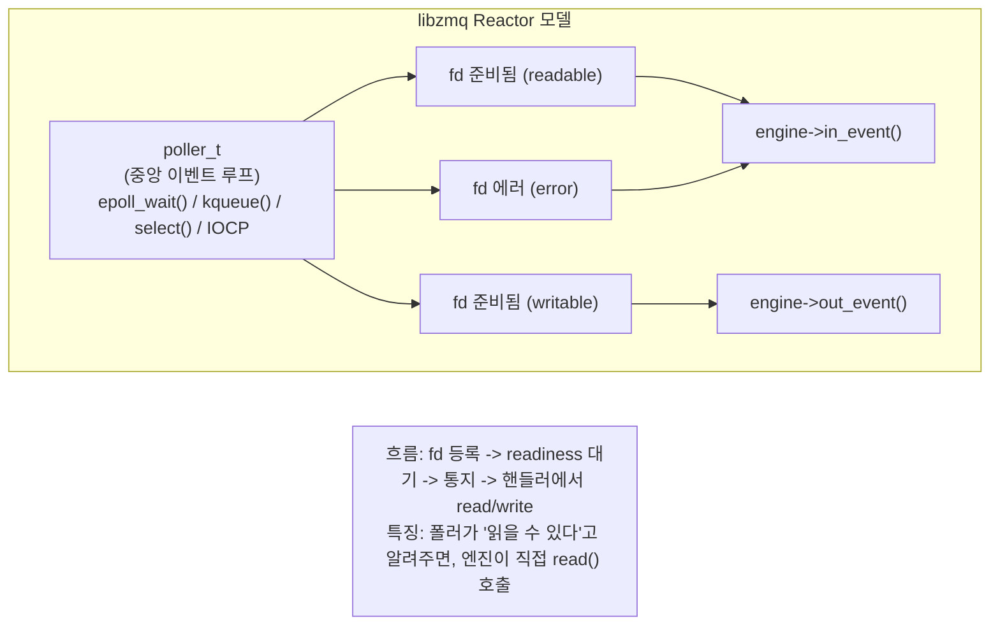
```mermaid
flowchart TB
    subgraph Reactor["libzmq Reactor 모델"]
        poller["poller_t\n(중앙 이벤트 루프)\nepoll_wait() / kqueue() / select() / IOCP"]
        readable["fd 준비됨 (readable)"]
        writable["fd 준비됨 (writable)"]
        fderror["fd 에러 (error)"]
        in_event["engine->in_event()"]
        out_event["engine->out_event()"]

        poller --> readable
        poller --> writable
        poller --> fderror
        readable --> in_event
        writable --> out_event
        fderror --> in_event
    end

    note["흐름: fd 등록 -> readiness 대기 -> 통지 -> 핸들러에서 read/write\n특징: 폴러가 '읽을 수 있다'고 알려주면, 엔진이 직접 read() 호출"]

    Reactor ~~~ note
```

**핵심 특성:**
- 플랫폼별 폴러 구현 필요 (epoll, kqueue, devpoll, pollset, select, IOCP)
- 엔진이 `in_event()`/`out_event()` 콜백에서 동기 `read()`/`write()` 수행
- 각 I/O 스레드가 하나의 `poller_t` 인스턴스를 소유하고 이벤트 루프 실행
- 새로운 트랜스포트 추가 시 fd 기반 인터페이스에 맞춰야 하는 제약

### 2.2 Proactor 패턴 (zlink)

zlink는 Boost.Asio의 **Proactor 패턴**을 사용합니다.
엔진이 OS에 비동기 I/O 연산을 요청하고, OS가 완료 후 콜백을 호출하는 구조입니다.

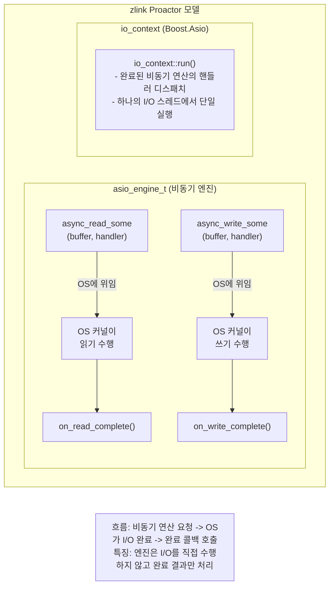
```mermaid
flowchart TB
    subgraph Proactor["zlink Proactor 모델"]
        subgraph Engine["asio_engine_t (비동기 엔진)"]
            async_read["async_read_some\n(buffer, handler)"]
            os_read["OS 커널이\n읽기 수행"]
            on_read["on_read_complete()"]
            async_write["async_write_some\n(buffer, handler)"]
            os_write["OS 커널이\n쓰기 수행"]
            on_write["on_write_complete()"]

            async_read -->|"OS에 위임"| os_read --> on_read
            async_write -->|"OS에 위임"| os_write --> on_write
        end

        subgraph IoCtx["io_context (Boost.Asio)"]
            run["io_context::run()\n- 완료된 비동기 연산의 핸들러 디스패치\n- 하나의 I/O 스레드에서 단일 실행"]
        end
    end

    note["흐름: 비동기 연산 요청 -> OS가 I/O 완료 -> 완료 콜백 호출\n특징: 엔진은 I/O를 직접 수행하지 않고 완료 결과만 처리"]

    Proactor ~~~ note
```

**핵심 특성:**
- Boost.Asio가 플랫폼별 차이를 추상화 (epoll/kqueue/IOCP를 통합)
- 엔진이 `async_read_some()`/`async_write_some()`으로 연산 요청, 완료 콜백에서 결과 처리
- 각 I/O 스레드가 독립된 `io_context`를 소유 — 스레드 간 경합 없음
- 트랜스포트 추상화(`i_asio_transport`)를 통해 TCP/TLS/WS/WSS를 동일한 인터페이스로 처리

### 2.3 Reactor vs. Proactor 비교

| 항목 | libzmq (Reactor) | zlink (Proactor) |
|---|---|---|
| I/O 모델 | Readiness 기반: "읽을 수 있다" -> read() | Completion 기반: "읽기 완료됨" -> 콜백 호출 |
| 메인 루프 | poller_t::loop() (자체 이벤트 루프) | io_context::run() (Boost.Asio 이벤트 루프) |
| I/O 스레드 | 스레드당 poller_t + fd_table 관리 | 스레드당 io_context + 독립 실행 |
| 엔진 콜백 | in_event() / out_event() | on_read_complete() / on_write_complete() |
| 프로토콜 | ZMTP 3.x | ZMP v1.0 (8B 고정 헤더) |
| 트랜스포트 추가 비용 | fd 직접 관리; 폴러에 fd 등록 필요 | i_asio_transport 추상화; 인터페이스 구현만으로 확장 |
| 플랫폼 폴러 | 6종 직접 구현 (epoll, kqueue, IOCP 등) | Boost.Asio에 위임 (단일 코드베이스) |
| 최적화 | Reactor 이벤트 배칭 | Speculative I/O, Gather Write, Backpressure (pending buf) |

### 2.4 마이그레이션 전략

libzmq에서 zlink로의 이식은 "전면 교체"가 아닌 **계층별 선택적 교체**로 진행했습니다.

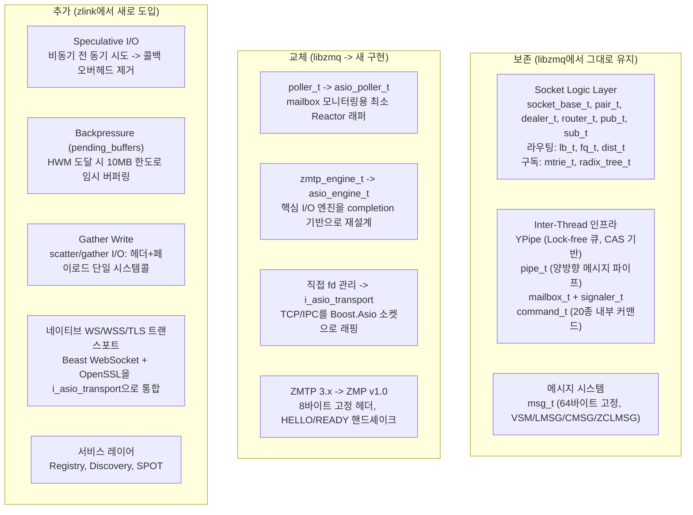
```mermaid
flowchart TB
    subgraph Preserved["보존 (libzmq에서 그대로 유지)"]
        SL["Socket Logic Layer\nsocket_base_t, pair_t, dealer_t, router_t, pub_t, sub_t\n라우팅: lb_t, fq_t, dist_t\n구독: mtrie_t, radix_tree_t"]
        IT["Inter-Thread 인프라\nYPipe (Lock-free 큐, CAS 기반)\npipe_t (양방향 메시지 파이프)\nmailbox_t + signaler_t\ncommand_t (20종 내부 커맨드)"]
        MS["메시지 시스템\nmsg_t (64바이트 고정, VSM/LMSG/CMSG/ZCLMSG)"]
    end

    subgraph Replaced["교체 (libzmq -> 새 구현)"]
        R1["poller_t -> asio_poller_t\nmailbox 모니터링용 최소 Reactor 래퍼"]
        R2["zmtp_engine_t -> asio_engine_t\n핵심 I/O 엔진을 completion 기반으로 재설계"]
        R3["직접 fd 관리 -> i_asio_transport\nTCP/IPC를 Boost.Asio 소켓으로 래핑"]
        R4["ZMTP 3.x -> ZMP v1.0\n8바이트 고정 헤더, HELLO/READY 핸드셰이크"]
    end

    subgraph Added["추가 (zlink에서 새로 도입)"]
        A1["Speculative I/O\n비동기 전 동기 시도 -> 콜백 오버헤드 제거"]
        A2["Backpressure (pending_buffers)\nHWM 도달 시 10MB 한도로 임시 버퍼링"]
        A3["Gather Write\nscatter/gather I/O: 헤더+페이로드 단일 시스템콜"]
        A4["네이티브 WS/WSS/TLS 트랜스포트\nBeast WebSocket + OpenSSL을 i_asio_transport으로 통합"]
        A5["서비스 레이어\nRegistry, Discovery, SPOT"]
    end
```

**왜 Reactor를 완전히 제거하지 않았는가?**

`asio_poller_t`는 mailbox fd를 감시하기 위한 최소한의 Reactor 호환 래퍼로 남아 있습니다.
기존 libzmq의 `io_object_t` 인프라가 mailbox 이벤트를 폴러 콜백으로 수신하는 구조를
사용하므로, 이 경로를 Asio의 `async_wait()`로 래핑하여 호환성을 유지합니다.
실제 데이터 I/O 경로(`asio_engine_t`)는 순수 Proactor 패턴으로 동작합니다.

---

## 3. 5계층 아키텍처

zlink는 5개의 명확히 분리된 계층으로 구성됩니다.
각 계층은 단일 책임을 가지며, 아래로 갈수록 물리적 네트워크에 가까워집니다.

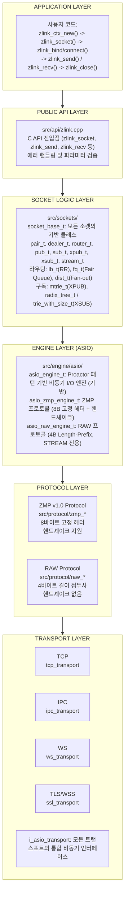
```mermaid
flowchart TB
    subgraph L1["APPLICATION LAYER"]
        App["사용자 코드:\nzlink_ctx_new() -> zlink_socket() -> zlink_bind/connect()\n-> zlink_send() / zlink_recv() -> zlink_close()"]
    end

    subgraph L2["PUBLIC API LAYER"]
        API["src/api/zlink.cpp\nC API 진입점 (zlink_socket, zlink_send, zlink_recv 등)\n에러 핸들링 및 파라미터 검증"]
    end

    subgraph L3["SOCKET LOGIC LAYER"]
        Sockets["src/sockets/\nsocket_base_t: 모든 소켓의 기반 클래스\npair_t, dealer_t, router_t, pub_t, sub_t, xpub_t, xsub_t, stream_t\n라우팅: lb_t(RR), fq_t(Fair Queue), dist_t(Fan-out)\n구독: mtrie_t(XPUB), radix_tree_t / trie_with_size_t(XSUB)"]
    end

    subgraph L4["ENGINE LAYER (ASIO)"]
        Engines["src/engine/asio/\nasio_engine_t: Proactor 패턴 기반 비동기 I/O 엔진 (기반)\nasio_zmp_engine_t: ZMP 프로토콜 (8B 고정 헤더 + 핸드셰이크)\nasio_raw_engine_t: RAW 프로토콜 (4B Length-Prefix, STREAM 전용)"]
    end

    subgraph L5A["PROTOCOL LAYER"]
        ZMP["ZMP v1.0 Protocol\nsrc/protocol/zmp_*\n8바이트 고정 헤더\n핸드셰이크 지원"]
        RAW["RAW Protocol\nsrc/protocol/raw_*\n4바이트 길이 접두사\n핸드셰이크 없음"]
    end

    subgraph L5B["TRANSPORT LAYER"]
        TCP["TCP\ntcp_transport"]
        IPC["IPC\nipc_transport"]
        WS["WS\nws_transport"]
        TLSWSS["TLS/WSS\nssl_transport"]
        iface["i_asio_transport: 모든 트랜스포트의 통합 비동기 인터페이스"]
    end

    L1 --> L2 --> L3 --> L4 --> L5A --> L5B
```

**계층 간 메시지 전달 경로**:
- 하향 (송신): Application -> API -> Socket Logic -> pipe_t -> Engine -> Protocol -> Transport
- 상향 (수신): Transport -> Protocol -> Engine -> pipe_t -> Socket Logic -> API -> Application

---

## 4. 컴포넌트 연결 관계

아래 다이어그램은 zlink 내부 객체들의 소유 관계와 상호작용을 보여줍니다.

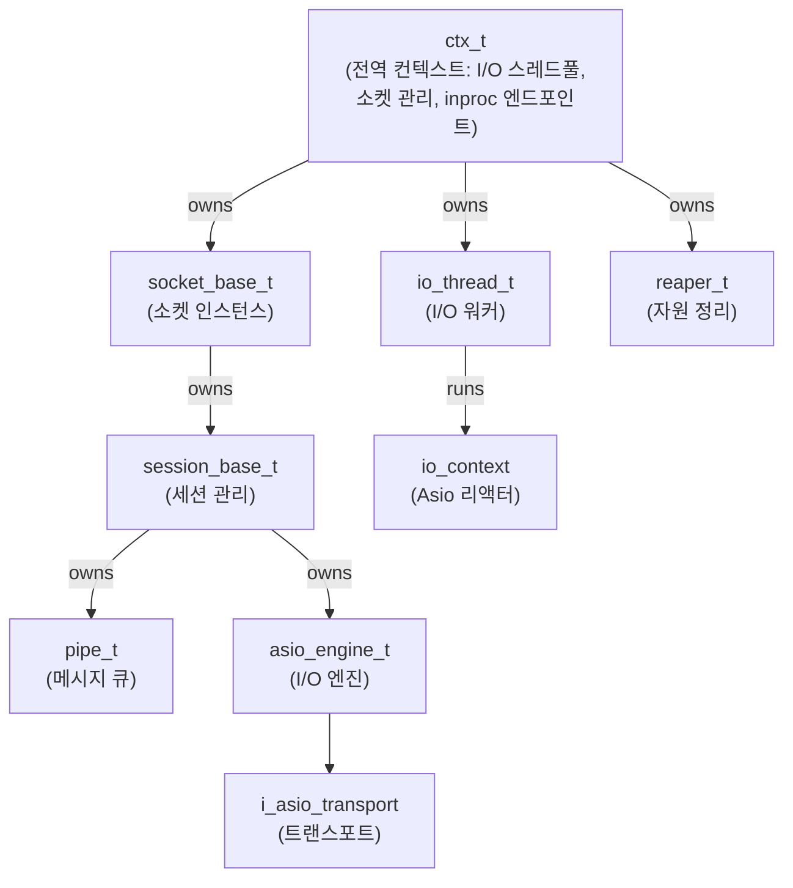
```mermaid
flowchart TB
    ctx["ctx_t\n(전역 컨텍스트: I/O 스레드풀,\n소켓 관리, inproc 엔드포인트)"]

    ctx -->|"owns"| socket["socket_base_t\n(소켓 인스턴스)"]
    ctx -->|"owns"| iothread["io_thread_t\n(I/O 워커)"]
    ctx -->|"owns"| reaper["reaper_t\n(자원 정리)"]

    socket -->|"owns"| session["session_base_t\n(세션 관리)"]
    iothread -->|"runs"| ioctx["io_context\n(Asio 리액터)"]

    session -->|"owns"| pipe["pipe_t\n(메시지 큐)"]
    session -->|"owns"| engine["asio_engine_t\n(I/O 엔진)"]

    engine --> transport["i_asio_transport\n(트랜스포트)"]
```

**주요 소유 관계 설명**:

- `ctx_t`는 모든 `socket_base_t`, `io_thread_t`, `reaper_t`를 소유합니다.
- `socket_base_t`는 `session_base_t`를 소유하며, 세션은 소켓과 엔진 사이의 브리지 역할을 합니다.
- `session_base_t`는 `pipe_t`(Lock-free 메시지 큐)와 `asio_engine_t`(I/O 엔진)를 소유합니다.
- `asio_engine_t`는 `i_asio_transport` 인터페이스를 통해 물리적 전송 계층과 통신합니다.
- `io_thread_t`는 독립적인 `io_context`를 보유하여 비동기 I/O를 처리합니다.
- `reaper_t`는 종료된 소켓/세션의 자원을 안전하게 정리합니다.

---

## 5. Socket Logic Layer 상세

### 5.1 클래스 계층 구조

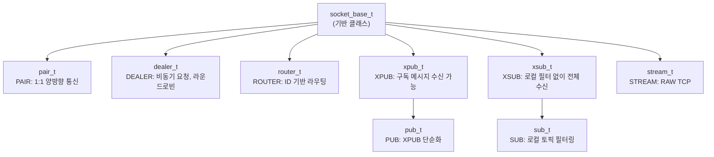
```mermaid
flowchart TB
    base["socket_base_t\n(기반 클래스)"]
    pair["pair_t\nPAIR: 1:1 양방향 통신"]
    dealer["dealer_t\nDEALER: 비동기 요청, 라운드로빈"]
    router["router_t\nROUTER: ID 기반 라우팅"]
    xpub["xpub_t\nXPUB: 구독 메시지 수신 가능"]
    pub["pub_t\nPUB: XPUB 단순화"]
    xsub["xsub_t\nXSUB: 로컬 필터 없이 전체 수신"]
    sub["sub_t\nSUB: 로컬 토픽 필터링"]
    stream["stream_t\nSTREAM: RAW TCP"]

    base --> pair
    base --> dealer
    base --> router
    base --> xpub --> pub
    base --> xsub --> sub
    base --> stream
```

`socket_base_t`는 모든 소켓의 공통 기능을 제공합니다:
- 연결 관리 (`bind`, `connect`, `disconnect`, `unbind`)
- 파이프 관리 (생성, 종료, 활성화)
- 옵션 관리 (`setsockopt`, `getsockopt`)
- 폴링 지원 (`has_in`, `has_out`)

### 5.2 라우팅 전략 클래스

소켓 타입별로 메시지 분배와 수집에 사용되는 전략 클래스가 분리되어 있습니다:

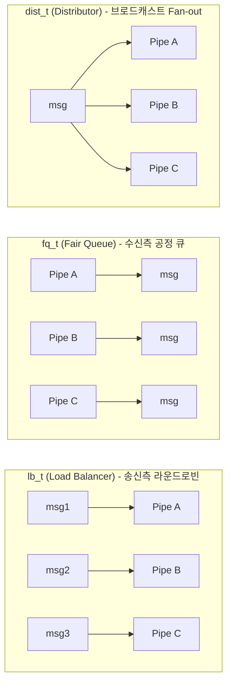
```mermaid
flowchart LR
    subgraph LB["lb_t (Load Balancer) - 송신측 라운드로빈"]
        direction LR
        msg1["msg1"] --> PA1["Pipe A"]
        msg2["msg2"] --> PB1["Pipe B"]
        msg3["msg3"] --> PC1["Pipe C"]
    end

    subgraph FQ["fq_t (Fair Queue) - 수신측 공정 큐"]
        direction LR
        PA2["Pipe A"] --> recv1["msg"]
        PB2["Pipe B"] --> recv2["msg"]
        PC2["Pipe C"] --> recv3["msg"]
    end

    subgraph DIST["dist_t (Distributor) - 브로드캐스트 Fan-out"]
        direction LR
        src["msg"] --> PA3["Pipe A"]
        src --> PB3["Pipe B"]
        src --> PC3["Pipe C"]
    end
```

- **lb_t**: DEALER (송신) 사용 -- 순서대로 돌아가며 분배
- **fq_t**: DEALER (수신), SUB (수신) 사용 -- 각 파이프에서 공정하게 수신
- **dist_t**: PUB, XPUB (송신) 사용 -- 동일 메시지를 모든 파이프에 전송

### 5.3 소켓별 라우팅 전략 매핑

| 소켓    | 송신 (Tx)             | 수신 (Rx)            | 비고                         |
|---------|-----------------------|----------------------|------------------------------|
| PAIR    | 단일 파이프            | 단일 파이프           | 파이프 1개만 허용            |
| DEALER  | `lb_t` (Round-robin)  | `fq_t` (Fair Queue)  | 비동기 요청-응답             |
| ROUTER  | ID 기반 직접 라우팅    | `fq_t` (Fair Queue)  | Routing ID로 대상 파이프 검색|
| PUB     | `dist_t` (Fan-out)    | -                    | 수신 불가                    |
| SUB     | -                     | `fq_t` (Fair Queue)  | 토픽 필터링 적용             |
| XPUB    | `dist_t` (Fan-out)    | 구독 메시지 수신      | mtrie_t로 구독 관리          |
| XSUB    | -                     | `fq_t` (Fair Queue)  | 로컬 필터 없이 전체 수신     |
| STREAM  | ID 기반 직접 라우팅    | `fq_t` (Fair Queue)  | RAW 프로토콜 사용            |

### 5.4 구독 자료구조

PUB/SUB 패턴에서 토픽 매칭에 사용되는 트라이 기반 자료구조:

```
┌─────────────────────────────────────────────────────────────┐
│                    구독 토픽 트라이 구조                      │
│                                                              │
│                       (root)                                 │
│                      /      \                                │
│                  "news"    "stock"                            │
│                   /          /   \                            │
│              "weather"   "AAPL"  "GOOGL"                     │
│                                                              │
│  - XPUB: mtrie_t (멀티 트라이, 파이프별 구독 추적)           │
│  - XSUB: ZLINK_USE_RADIX_TREE 매크로에 따라                  │
│    - radix_tree_t (활성화 시, 메모리 효율적)                 │
│    - trie_with_size_t (기본, 빠른 검색)                      │
│  - 검색 복잡도: O(m), m = 토픽 문자열 길이                   │
│                                                              │
└─────────────────────────────────────────────────────────────┘
```

---

## 6. Engine Layer 상세

### 6.1 엔진 타입 비교

Engine Layer는 Boost.Asio 기반의 비동기 I/O 처리를 담당합니다.

| 엔진                  | 프로토콜  | 트랜스포트              | 특징                            |
|-----------------------|-----------|------------------------|---------------------------------|
| `asio_zmp_engine_t`   | ZMP v1.0  | TCP, TLS, IPC, WS, WSS | 핸드셰이크 + 8바이트 고정 헤더  |
| `asio_raw_engine_t`   | RAW       | TCP, TLS, IPC, WS, WSS | 4바이트 길이 접두사, STREAM 전용|

> WS/WSS도 `asio_zmp_engine_t` 또는 `asio_raw_engine_t`를 사용하며,
> WebSocket 프레이밍은 `ws_transport_t`/`wss_transport_t`가 처리합니다.

### 6.2 Proactor 패턴 구조

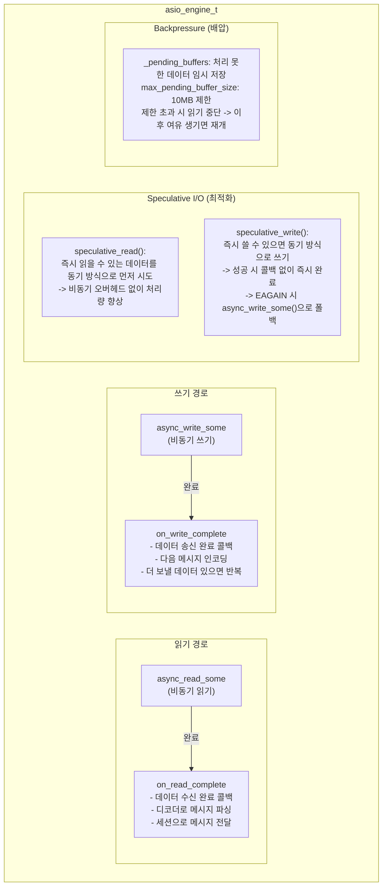
```mermaid
flowchart TB
    subgraph asio_engine["asio_engine_t"]
        subgraph ReadPath["읽기 경로"]
            ar["async_read_some\n(비동기 읽기)"] -->|"완료"| orc["on_read_complete\n- 데이터 수신 완료 콜백\n- 디코더로 메시지 파싱\n- 세션으로 메시지 전달"]
        end

        subgraph WritePath["쓰기 경로"]
            aw["async_write_some\n(비동기 쓰기)"] -->|"완료"| owc["on_write_complete\n- 데이터 송신 완료 콜백\n- 다음 메시지 인코딩\n- 더 보낼 데이터 있으면 반복"]
        end

        subgraph Speculative["Speculative I/O (최적화)"]
            sr["speculative_read():\n즉시 읽을 수 있는 데이터를 동기 방식으로 먼저 시도\n-> 비동기 오버헤드 없이 처리량 향상"]
            sw["speculative_write():\n즉시 쓸 수 있으면 동기 방식으로 쓰기\n-> 성공 시 콜백 없이 즉시 완료\n-> EAGAIN 시 async_write_some()으로 폴백"]
        end

        subgraph BP["Backpressure (배압)"]
            bp["_pending_buffers: 처리 못한 데이터 임시 저장\nmax_pending_buffer_size: 10MB 제한\n제한 초과 시 읽기 중단 -> 이후 여유 생기면 재개"]
        end
    end
```

### 6.3 엔진 상태 머신

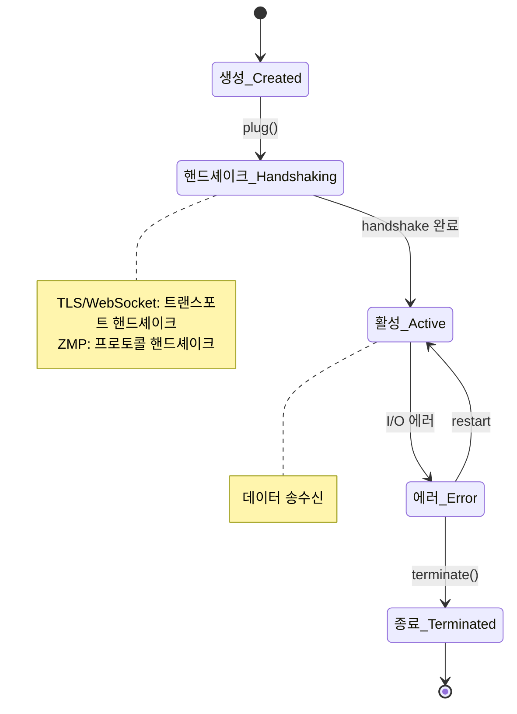
```mermaid
stateDiagram-v2
    [*] --> 생성_Created
    생성_Created --> 핸드셰이크_Handshaking : plug()
    핸드셰이크_Handshaking --> 활성_Active : handshake 완료
    활성_Active --> 에러_Error : I/O 에러
    에러_Error --> 활성_Active : restart
    에러_Error --> 종료_Terminated : terminate()
    종료_Terminated --> [*]

    note right of 핸드셰이크_Handshaking
        TLS/WebSocket: 트랜스포트 핸드셰이크
        ZMP: 프로토콜 핸드셰이크
    end note

    note right of 활성_Active
        데이터 송수신
    end note
```

### 6.4 ZMP v1.0 프레임 구조

```
 Byte:   0         1         2         3         4    5    6    7
      ┌─────────┬─────────┬─────────┬─────────┬─────────────────────┐
      │  MAGIC  │ VERSION │  FLAGS  │RESERVED │   PAYLOAD SIZE      │
      │  (0x5A) │  (0x01) │         │ (0x00)  │   (32-bit BE)       │
      └─────────┴─────────┴─────────┴─────────┴─────────────────────┘
```

| 필드         | 오프셋 | 크기 | 설명                    |
|-------------|--------|------|-------------------------|
| MAGIC       | 0      | 1    | 매직 넘버 `0x5A` ('Z')  |
| VERSION     | 1      | 1    | 프로토콜 버전 `0x01`    |
| FLAGS       | 2      | 1    | 프레임 플래그            |
| RESERVED    | 3      | 1    | 예약 (0x00)              |
| PAYLOAD SIZE| 4-7    | 4    | 페이로드 크기 (Big Endian)|

**FLAGS 비트 정의**:

| 비트 | 이름      | 설명               |
|------|-----------|--------------------|
| 0    | MORE      | 멀티파트 메시지 계속|
| 1    | CONTROL   | 제어 프레임         |
| 2    | IDENTITY  | 라우팅 ID 포함      |
| 3    | SUBSCRIBE | 구독 요청           |
| 4    | CANCEL    | 구독 취소           |

### 6.5 RAW 프로토콜 프레임 구조

STREAM 소켓 및 외부 클라이언트 연동용 단순 프로토콜입니다.

```
┌──────────────────────┬─────────────────────────────┐
│  Length (4 Bytes)    │     Payload (N Bytes)       │
│  (Big Endian)        │                             │
└──────────────────────┴─────────────────────────────┘
```

- 핸드셰이크 없음 (즉시 데이터 송수신)
- 간단한 구현: `read(4)` -> `read(length)`
- 외부 클라이언트 연동 용이

### 6.6 ZMP 핸드셰이크 시퀀스

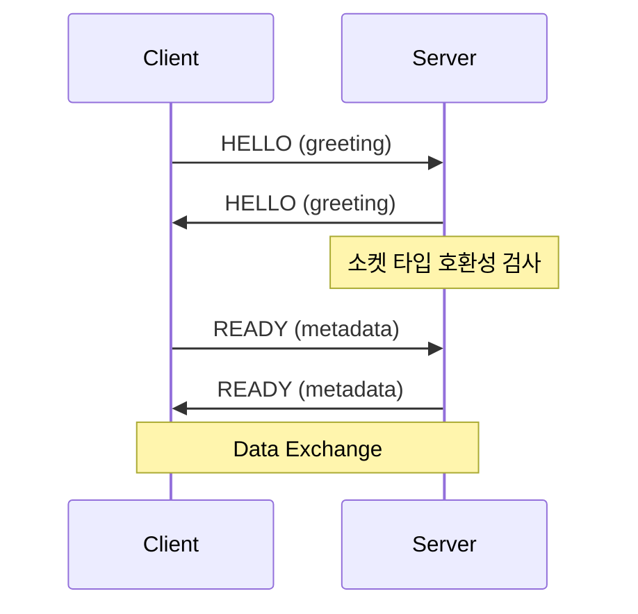
```mermaid
sequenceDiagram
    participant C as Client
    participant S as Server

    C->>S: HELLO (greeting)
    S->>C: HELLO (greeting)
    Note over S: 소켓 타입 호환성 검사
    C->>S: READY (metadata)
    S->>C: READY (metadata)
    Note over C,S: Data Exchange
```

- **HELLO**: 소켓 타입(1B) + Identity 길이(1B) + Identity 값(0-255B)
- **READY**: Socket-Type 속성 (항상), Identity 속성 (DEALER/ROUTER만)

### 6.7 프로토콜-트랜스포트-엔진 매핑

소켓 타입에 따라 엔진이 자동 선택됩니다:

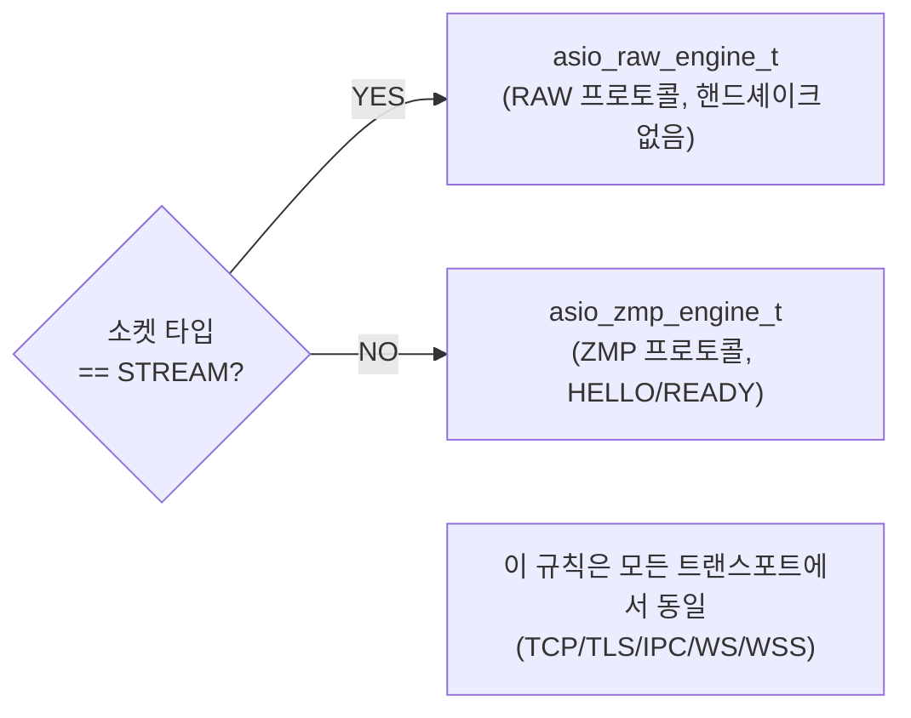
```mermaid
flowchart LR
    Q{"소켓 타입\n== STREAM?"}
    Q -->|YES| RAW["asio_raw_engine_t\n(RAW 프로토콜, 핸드셰이크 없음)"]
    Q -->|NO| ZMP["asio_zmp_engine_t\n(ZMP 프로토콜, HELLO/READY)"]
    Note["이 규칙은 모든 트랜스포트에서 동일\n(TCP/TLS/IPC/WS/WSS)"]
    Q ~~~ Note
```

**전체 매핑 매트릭스**:

| URL 스킴  | Connecter               | Transport          | STREAM 엔진         | 기타 소켓 엔진       | 핸드셰이크        |
|-----------|-------------------------|--------------------|---------------------|---------------------|-------------------|
| `tcp://`  | `asio_tcp_connecter_t`  | `tcp_transport_t`  | `asio_raw_engine_t` | `asio_zmp_engine_t` | (없음) / ZMP      |
| `tls://`  | `asio_tls_connecter_t`  | `ssl_transport_t`  | `asio_raw_engine_t` | `asio_zmp_engine_t` | SSL / SSL+ZMP     |
| `ws://`   | `asio_ws_connecter_t`   | `ws_transport_t`   | `asio_raw_engine_t` | `asio_zmp_engine_t` | WS / WS+ZMP      |
| `wss://`  | `asio_ws_connecter_t`   | `wss_transport_t`  | `asio_raw_engine_t` | `asio_zmp_engine_t` | SSL+WS / SSL+WS+ZMP|
| `ipc://`  | `asio_ipc_connecter_t`  | `ipc_transport_t`  | `asio_raw_engine_t` | `asio_zmp_engine_t` | (없음) / ZMP      |

### 6.8 핸드셰이크 단계 비교

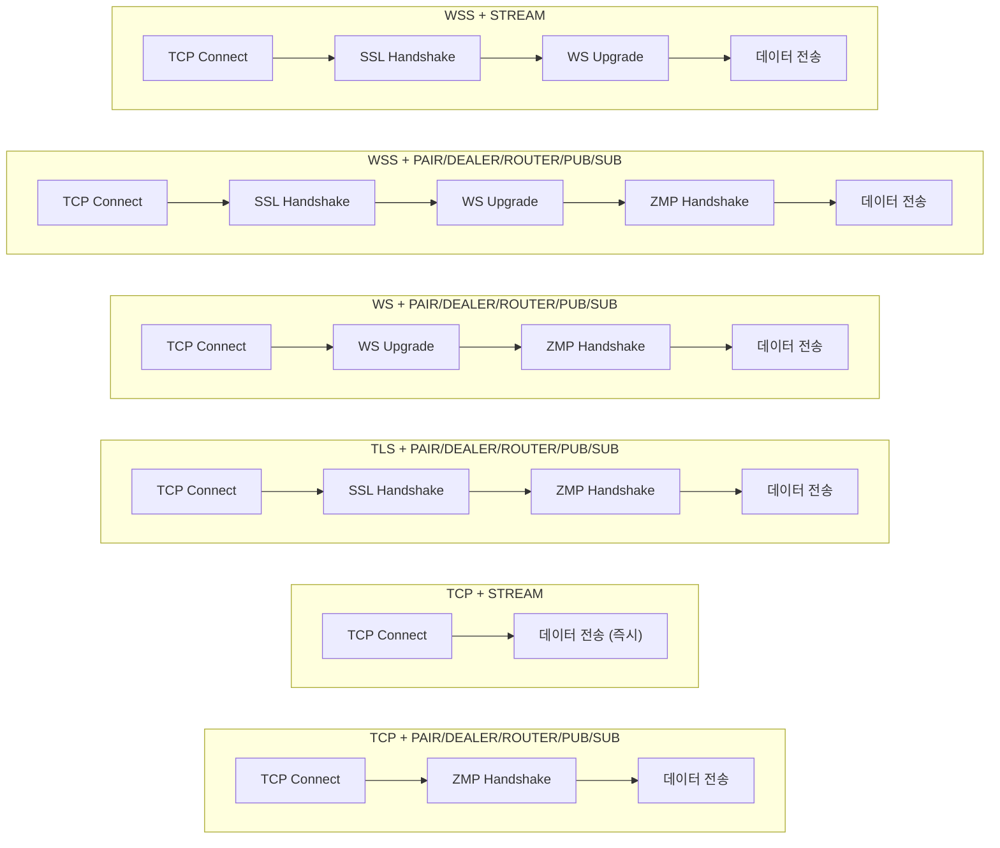
```mermaid
flowchart LR
    subgraph tcp_zmp["TCP + PAIR/DEALER/ROUTER/PUB/SUB"]
        direction LR
        t1["TCP Connect"] --> z1["ZMP Handshake"] --> d1["데이터 전송"]
    end

    subgraph tcp_stream["TCP + STREAM"]
        direction LR
        t2["TCP Connect"] --> d2["데이터 전송 (즉시)"]
    end

    subgraph tls_zmp["TLS + PAIR/DEALER/ROUTER/PUB/SUB"]
        direction LR
        t3["TCP Connect"] --> s3["SSL Handshake"] --> z3["ZMP Handshake"] --> d3["데이터 전송"]
    end

    subgraph ws_zmp["WS + PAIR/DEALER/ROUTER/PUB/SUB"]
        direction LR
        t4["TCP Connect"] --> w4["WS Upgrade"] --> z4["ZMP Handshake"] --> d4["데이터 전송"]
    end

    subgraph wss_zmp["WSS + PAIR/DEALER/ROUTER/PUB/SUB"]
        direction LR
        t5["TCP Connect"] --> s5["SSL Handshake"] --> w5["WS Upgrade"] --> z5["ZMP Handshake"] --> d5["데이터 전송"]
    end

    subgraph wss_stream["WSS + STREAM"]
        direction LR
        t6["TCP Connect"] --> s6["SSL Handshake"] --> w6["WS Upgrade"] --> d6["데이터 전송"]
    end
```

### 6.9 트랜스포트 특성 비교

| 트랜스포트 | 핸드셰이크 | 암호화 | Speculative Write | Gather Write | 용도                    |
|-----------|:----------:|:------:|:-----------------:|:------------:|------------------------|
| TCP       | -          | -      | O                 | O            | 표준 네트워크 통신      |
| IPC       | -          | -      | 옵션              | O            | 로컬 프로세스 간 통신   |
| TLS       | O          | O      | -                 | -            | 암호화된 네트워크 통신  |
| WS        | O          | -      | -                 | O            | 웹 클라이언트 연동      |
| WSS       | O          | O      | -                 | O            | 암호화된 웹 클라이언트  |

---

## 7. 핵심 컴포넌트

### 7.1 msg_t - 메시지 컨테이너

모든 메시지 데이터를 담는 64바이트 고정 크기 구조체입니다.
`malloc` 호출 없이 작은 메시지를 처리할 수 있도록 설계되었습니다.

```
┌─────────────────────────────────────────────────────────────────┐
│                        msg_t (64 bytes)                         │
├─────────────────────────────────────────────────────────────────┤
│                                                                 │
│  ┌───────────────────────────────────────────────────────────┐ │
│  │  공통 필드 (base_t)                                        │ │
│  │  - metadata_t* metadata   (8 bytes)                        │ │
│  │  - uint32_t routing_id    (4 bytes)                        │ │
│  │  - group_t group          (16 bytes)                       │ │
│  │  - uint8_t flags          (1 byte)                         │ │
│  │  - uint8_t type           (1 byte)                         │ │
│  └───────────────────────────────────────────────────────────┘ │
│                                                                 │
│  유형별 데이터 영역 (union):                                    │
│                                                                 │
│  ┌───────────────────────────────────────────────────────────┐ │
│  │  type_vsm (<=33B on 64-bit)                                │ │
│  │  Very Small Message: 데이터를 msg_t 내부 버퍼에 직접 저장   │ │
│  │  - uint8_t data[max_vsm_size]                              │ │
│  │  - uint8_t size                                            │ │
│  │  -> malloc 없이 인라인 저장, 가장 빠른 경로                 │ │
│  └───────────────────────────────────────────────────────────┘ │
│                            OR                                   │
│  ┌───────────────────────────────────────────────────────────┐ │
│  │  type_lmsg (>33B on 64-bit)                                │ │
│  │  Large Message: 별도 할당된 버퍼 포인터                     │ │
│  │  - content_t* content                                      │ │
│  │    ├── void* data          (데이터 포인터)                  │ │
│  │    ├── size_t size         (크기)                           │ │
│  │    ├── msg_free_fn* ffn    (해제 함수)                      │ │
│  │    └── atomic_counter_t refcnt (참조 카운트)                │ │
│  └───────────────────────────────────────────────────────────┘ │
│                            OR                                   │
│  ┌───────────────────────────────────────────────────────────┐ │
│  │  type_cmsg: Constant Message (상수 데이터 참조, 해제 불필요)│ │
│  │  type_zclmsg: Zero-copy Large Message (사용자 버퍼 직접 참조)│ │
│  └───────────────────────────────────────────────────────────┘ │
│                                                                 │
└─────────────────────────────────────────────────────────────────┘
```

**메시지 플래그**:

| 플래그        | 값   | 설명                                |
|--------------|------|-------------------------------------|
| `more`       | 0x01 | 멀티파트 메시지의 중간 프레임        |
| `command`    | 0x02 | 제어 프레임 (핸드셰이크, 하트비트)  |
| `routing_id` | 0x40 | 라우팅 ID 포함                      |
| `shared`     | 0x80 | 공유 버퍼 (참조 카운팅)             |

**메시지 유형**:

| 유형           | 값  | 설명                                           |
|---------------|-----|------------------------------------------------|
| `type_vsm`    | 101 | Very Small Message (<=33B, 복사 없음)          |
| `type_lmsg`   | 102 | Large Message (malloc'd 버퍼)                  |
| `type_cmsg`   | 104 | Constant Message (상수 데이터 참조)            |
| `type_zclmsg` | 105 | Zero-copy Large Message (사용자 버퍼 직접 사용)|

### 7.2 pipe_t - Lock-Free 메시지 큐

스레드 간 메시지 전달을 위한 양방향 파이프입니다.
Application 스레드와 I/O 스레드 사이에서 `msg_t`를 Lock-free로 교환합니다.

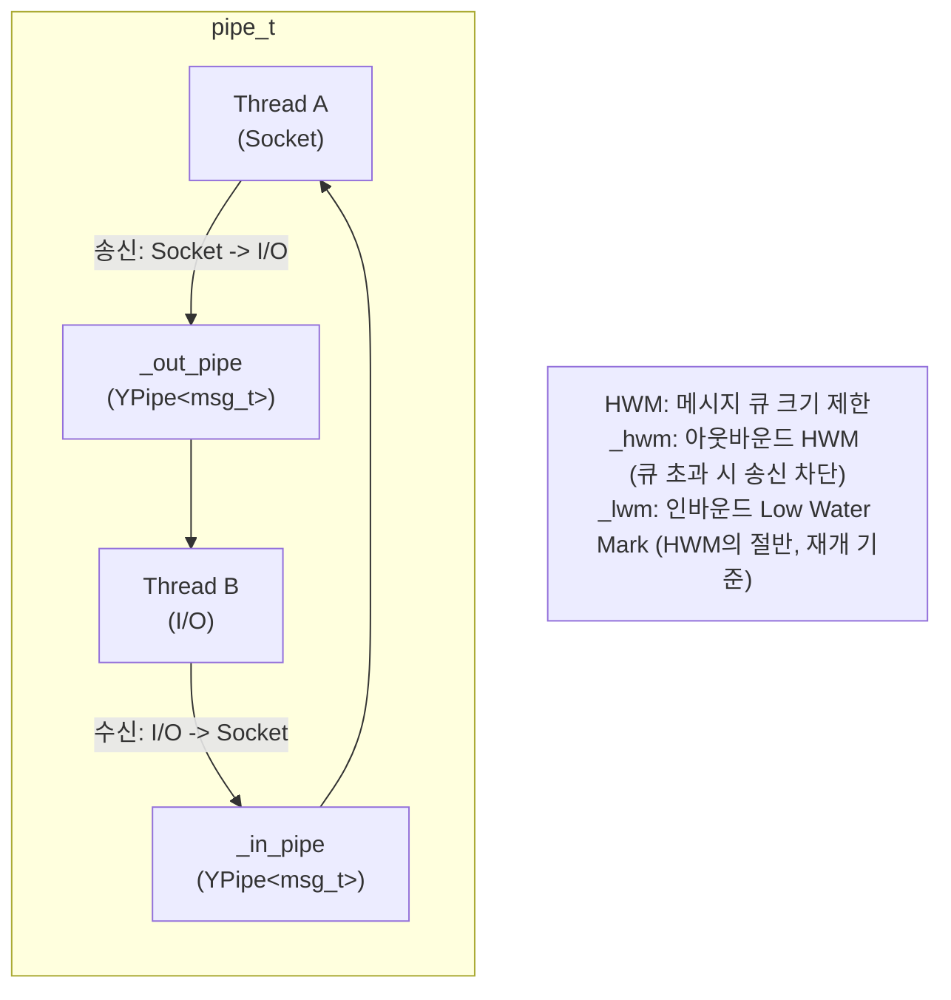
```mermaid
flowchart LR
    subgraph pipe_t
        TA["Thread A\n(Socket)"]
        TB["Thread B\n(I/O)"]
        out["_out_pipe\n(YPipe&lt;msg_t&gt;)"]
        in["_in_pipe\n(YPipe&lt;msg_t&gt;)"]

        TA -->|"송신: Socket -> I/O"| out --> TB
        TB -->|"수신: I/O -> Socket"| in --> TA
    end

    hwm["HWM: 메시지 큐 크기 제한\n_hwm: 아웃바운드 HWM (큐 초과 시 송신 차단)\n_lwm: 인바운드 Low Water Mark (HWM의 절반, 재개 기준)"]
    pipe_t ~~~ hwm
```

**YPipe 특성**:
- Lock-free FIFO 큐 (CAS 연산 기반)
- 캐시 라인 최적화
- 메모리 배리어를 통한 가시성 보장

**파이프 상태 머신**:

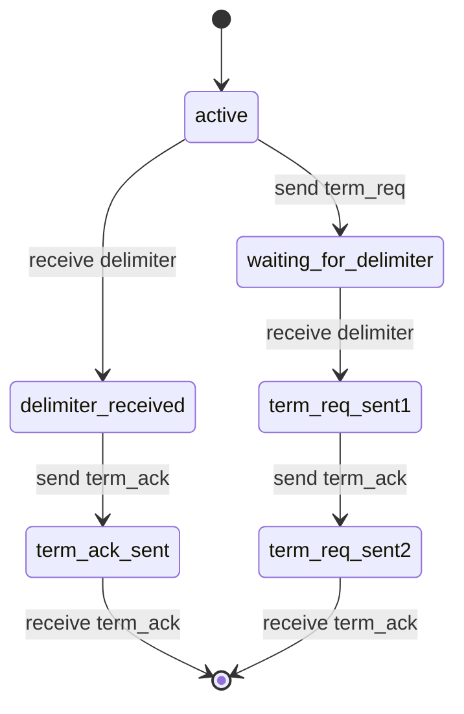
```mermaid
stateDiagram-v2
    [*] --> active
    active --> delimiter_received : receive delimiter
    active --> waiting_for_delimiter : send term_req
    waiting_for_delimiter --> term_req_sent1 : receive delimiter
    delimiter_received --> term_ack_sent : send term_ack
    term_req_sent1 --> term_req_sent2 : send term_ack
    term_ack_sent --> [*] : receive term_ack
    term_req_sent2 --> [*] : receive term_ack
```

### 7.3 ctx_t - 컨텍스트

전역 상태를 관리하는 최상위 객체입니다.

**주요 역할**:

1. **I/O 스레드 풀 관리**
   - `zlink_ctx_set(ctx, ZLINK_IO_THREADS, n)`으로 스레드 수 설정 (기본: 1)
   - 각 I/O 스레드는 독립적인 `io_context` 보유
   - 새 연결 시 부하가 가장 적은 I/O 스레드 선택 (affinity 마스크 지원)

2. **소켓 관리**
   - 소켓 생성/삭제 추적
   - 최대 소켓 수 제한 (기본: 1023)
   - 빈 슬롯 재사용

3. **inproc 엔드포인트 관리**
   - `inproc://name` 형식의 주소를 엔드포인트에 매핑
   - 바인드 전 연결 요청을 pending_connections에 보관

```
ctx_t 내부 구조:
┌──────────────────────────────────────────────────────────┐
│  _sockets: array_t<socket_base_t>     활성 소켓 목록     │
│  _empty_slots: vector<uint32_t>       빈 슬롯 재사용     │
│  _io_threads: vector<io_thread_t*>    I/O 스레드 풀      │
│  _slots: vector<i_mailbox*>           스레드 간 메일박스  │
│  _endpoints: map<string, endpoint_t>  inproc 레지스트리   │
│  _pending_connections: multimap       대기 중인 연결       │
│                                                          │
│  _max_sockets: int     (기본: 1023)                      │
│  _io_thread_count: int (기본: 1)                         │
│  _max_msgsz: int       (최대 메시지 크기)                │
└──────────────────────────────────────────────────────────┘
```

### 7.4 session_base_t - 세션

소켓과 엔진 사이의 브리지 역할을 합니다.

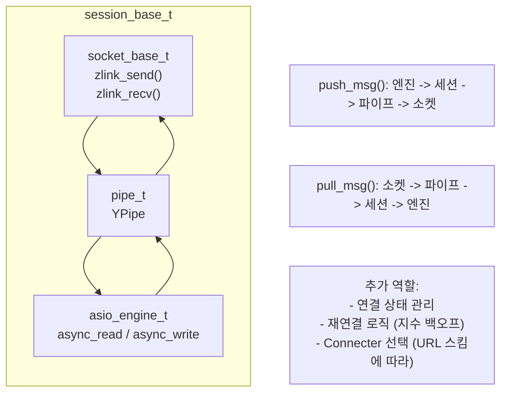
```mermaid
flowchart LR
    subgraph session["session_base_t"]
        socket["socket_base_t\nzlink_send()\nzlink_recv()"]
        pipe["pipe_t\nYPipe"]
        engine["asio_engine_t\nasync_read / async_write"]

        socket --> pipe --> engine
        engine --> pipe --> socket
    end

    push["push_msg(): 엔진 -> 세션 -> 파이프 -> 소켓"]
    pull["pull_msg(): 소켓 -> 파이프 -> 세션 -> 엔진"]
    roles["추가 역할:\n- 연결 상태 관리\n- 재연결 로직 (지수 백오프)\n- Connecter 선택 (URL 스킴에 따라)"]

    session ~~~ push
    session ~~~ pull
    session ~~~ roles
```

### 7.5 스레딩 모델

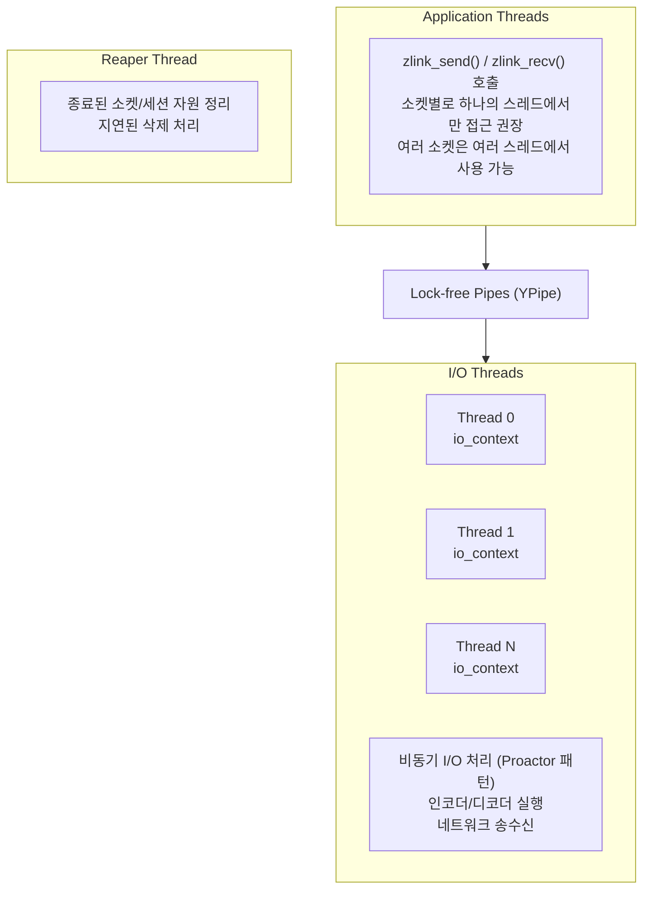
```mermaid
flowchart TB
    subgraph AppThreads["Application Threads"]
        app["zlink_send() / zlink_recv() 호출\n소켓별로 하나의 스레드에서만 접근 권장\n여러 소켓은 여러 스레드에서 사용 가능"]
    end

    pipes["Lock-free Pipes (YPipe)"]

    subgraph IOThreads["I/O Threads"]
        t0["Thread 0\nio_context"]
        t1["Thread 1\nio_context"]
        tN["Thread N\nio_context"]
        io_desc["비동기 I/O 처리 (Proactor 패턴)\n인코더/디코더 실행\n네트워크 송수신"]
    end

    subgraph Reaper["Reaper Thread"]
        reaper["종료된 소켓/세션 자원 정리\n지연된 삭제 처리"]
    end

    AppThreads --> pipes --> IOThreads
```

**스레드 간 통신 (Mailbox 시스템)**:

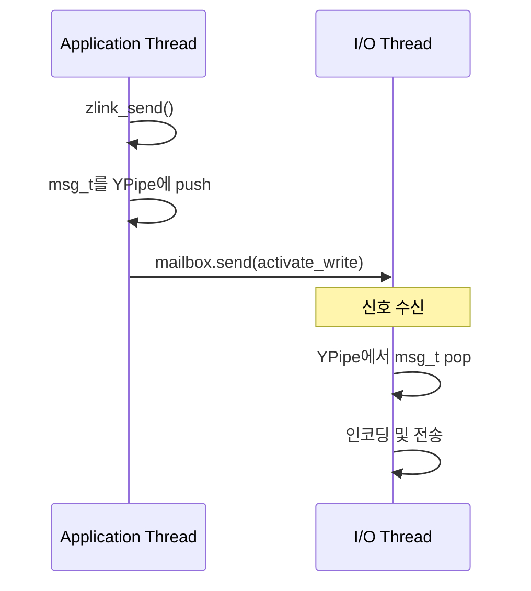
```mermaid
sequenceDiagram
    participant App as Application Thread
    participant IO as I/O Thread

    App->>App: zlink_send()
    App->>App: msg_t를 YPipe에 push
    App->>IO: mailbox.send(activate_write)
    Note over IO: 신호 수신
    IO->>IO: YPipe에서 msg_t pop
    IO->>IO: 인코딩 및 전송
```

- 각 스레드는 자신만의 `mailbox_t`를 보유합니다.
- `mailbox_t`는 내부적으로 `ypipe_t<command_t>`와 `signaler_t`로 구성됩니다.
- 명령 타입: `stop`, `plug`, `attach`, `bind`, `activate_read`, `activate_write` 등

---

## 8. 데이터 흐름

### 8.1 메시지 송신 (Outbound / Tx)

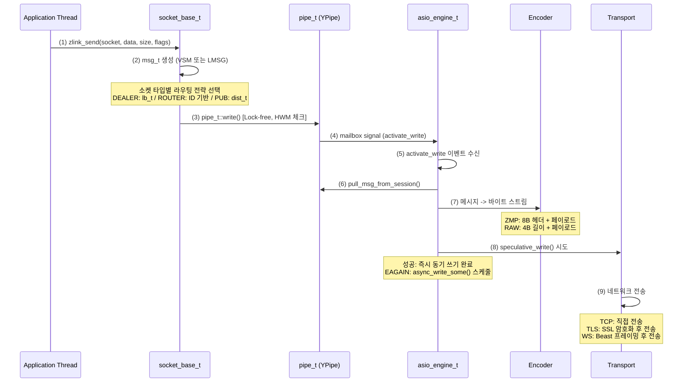
```mermaid
sequenceDiagram
    participant App as Application Thread
    participant Socket as socket_base_t
    participant Pipe as pipe_t (YPipe)
    participant Engine as asio_engine_t
    participant Encoder as Encoder
    participant Transport as Transport

    App->>Socket: (1) zlink_send(socket, data, size, flags)
    Socket->>Socket: (2) msg_t 생성 (VSM 또는 LMSG)
    Note over Socket: 소켓 타입별 라우팅 전략 선택<br/>DEALER: lb_t / ROUTER: ID 기반 / PUB: dist_t
    Socket->>Pipe: (3) pipe_t::write() [Lock-free, HWM 체크]
    Pipe->>Engine: (4) mailbox signal (activate_write)
    Engine->>Engine: (5) activate_write 이벤트 수신
    Engine->>Pipe: (6) pull_msg_from_session()
    Engine->>Encoder: (7) 메시지 -> 바이트 스트림
    Note over Encoder: ZMP: 8B 헤더 + 페이로드<br/>RAW: 4B 길이 + 페이로드
    Engine->>Transport: (8) speculative_write() 시도
    Note over Engine: 성공: 즉시 동기 쓰기 완료<br/>EAGAIN: async_write_some() 스케줄
    Transport->>Transport: (9) 네트워크 전송
    Note over Transport: TCP: 직접 전송<br/>TLS: SSL 암호화 후 전송<br/>WS: Beast 프레이밍 후 전송
```

### 8.2 메시지 수신 (Inbound / Rx)

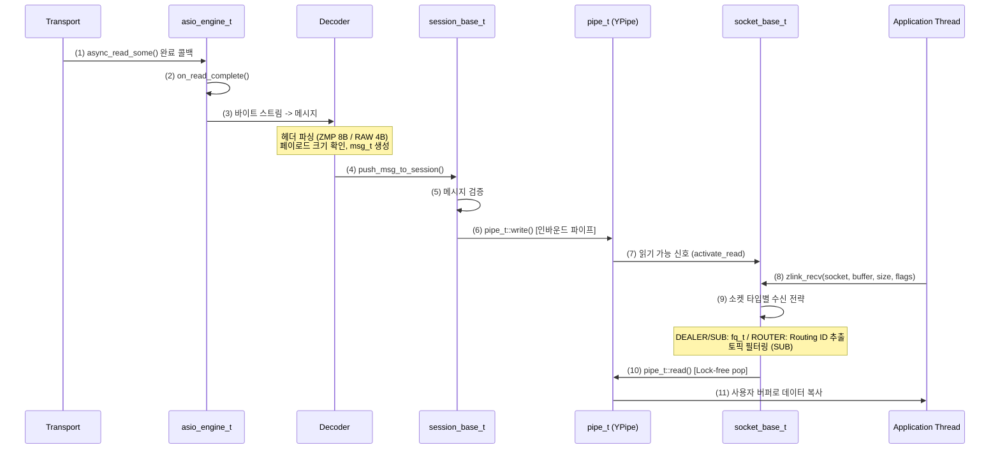
```mermaid
sequenceDiagram
    participant Transport as Transport
    participant Engine as asio_engine_t
    participant Decoder as Decoder
    participant Session as session_base_t
    participant Pipe as pipe_t (YPipe)
    participant Socket as socket_base_t
    participant App as Application Thread

    Transport->>Engine: (1) async_read_some() 완료 콜백
    Engine->>Engine: (2) on_read_complete()
    Engine->>Decoder: (3) 바이트 스트림 -> 메시지
    Note over Decoder: 헤더 파싱 (ZMP 8B / RAW 4B)<br/>페이로드 크기 확인, msg_t 생성
    Decoder->>Session: (4) push_msg_to_session()
    Session->>Session: (5) 메시지 검증
    Session->>Pipe: (6) pipe_t::write() [인바운드 파이프]
    Pipe->>Socket: (7) 읽기 가능 신호 (activate_read)
    App->>Socket: (8) zlink_recv(socket, buffer, size, flags)
    Socket->>Socket: (9) 소켓 타입별 수신 전략
    Note over Socket: DEALER/SUB: fq_t / ROUTER: Routing ID 추출<br/>토픽 필터링 (SUB)
    Socket->>Pipe: (10) pipe_t::read() [Lock-free pop]
    Pipe->>App: (11) 사용자 버퍼로 데이터 복사
```

### 8.3 연결 수립 흐름 (Connection Establishment)

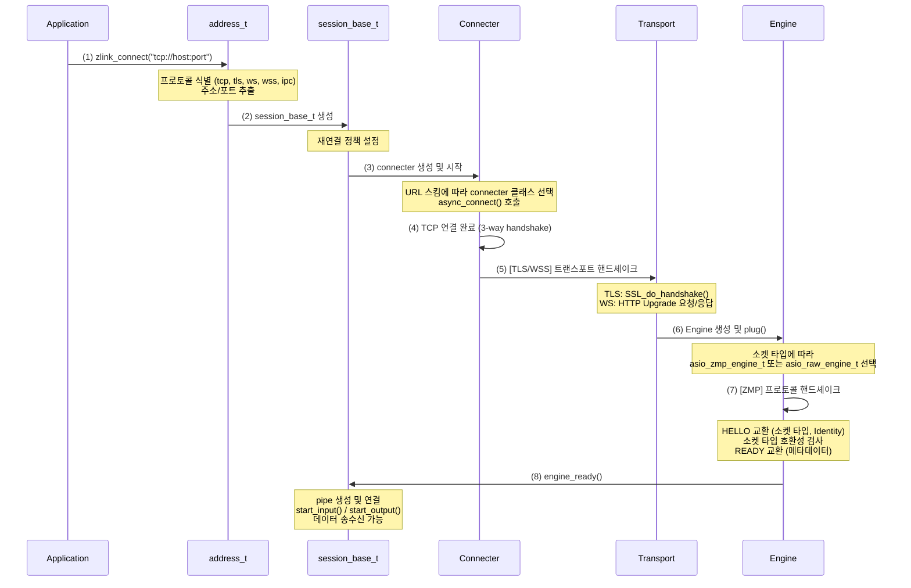
```mermaid
sequenceDiagram
    participant App as Application
    participant Addr as address_t
    participant Session as session_base_t
    participant Conn as Connecter
    participant TP as Transport
    participant Eng as Engine

    App->>Addr: (1) zlink_connect("tcp://host:port")
    Note over Addr: 프로토콜 식별 (tcp, tls, ws, wss, ipc)<br/>주소/포트 추출
    Addr->>Session: (2) session_base_t 생성
    Note over Session: 재연결 정책 설정
    Session->>Conn: (3) connecter 생성 및 시작
    Note over Conn: URL 스킴에 따라 connecter 클래스 선택<br/>async_connect() 호출
    Conn->>Conn: (4) TCP 연결 완료 (3-way handshake)
    Conn->>TP: (5) [TLS/WSS] 트랜스포트 핸드셰이크
    Note over TP: TLS: SSL_do_handshake()<br/>WS: HTTP Upgrade 요청/응답
    TP->>Eng: (6) Engine 생성 및 plug()
    Note over Eng: 소켓 타입에 따라<br/>asio_zmp_engine_t 또는 asio_raw_engine_t 선택
    Eng->>Eng: (7) [ZMP] 프로토콜 핸드셰이크
    Note over Eng: HELLO 교환 (소켓 타입, Identity)<br/>소켓 타입 호환성 검사<br/>READY 교환 (메타데이터)
    Eng->>Session: (8) engine_ready()
    Note over Session: pipe 생성 및 연결<br/>start_input() / start_output()<br/>데이터 송수신 가능
```

---

## 9. 소스 트리 구조

```
core/
├── include/                         # 공용 헤더 (zlink.h)
│
├── src/
│   ├── api/                         # Public C API
│   │   ├── zlink.cpp                # 모든 zlink_* 함수 진입점
│   │   └── zlink_utils.cpp          # 유틸리티 함수
│   │
│   ├── core/                        # 시스템 기반 컴포넌트
│   │   ├── ctx.cpp/hpp              # 컨텍스트 (스레드풀, 소켓 관리)
│   │   ├── msg.cpp/hpp              # 메시지 컨테이너 (64B 고정)
│   │   ├── pipe.cpp/hpp             # Lock-free 양방향 파이프
│   │   ├── session_base.cpp/hpp     # 소켓-엔진 브리지
│   │   ├── io_thread.cpp/hpp        # I/O 워커 스레드
│   │   ├── mailbox.cpp/hpp          # 스레드 간 명령 전달
│   │   ├── object.cpp/hpp           # 기반 객체 (명령 처리)
│   │   ├── own.cpp/hpp              # 소유 관계 관리
│   │   ├── reaper.cpp/hpp           # 종료 자원 정리
│   │   ├── signaler.cpp/hpp         # 스레드 깨우기 신호
│   │   ├── options.cpp/hpp          # 소켓 옵션 저장소
│   │   ├── address.cpp/hpp          # 주소 파싱
│   │   ├── endpoint.cpp/hpp         # 엔드포인트 관리
│   │   ├── command.hpp              # 스레드간 명령 정의
│   │   ├── socket_poller.cpp/hpp    # 소켓 폴러
│   │   └── ...
│   │
│   ├── sockets/                     # 소켓 타입 구현
│   │   ├── socket_base.cpp/hpp      # 모든 소켓의 기반 클래스
│   │   ├── pair.cpp/hpp             # PAIR 소켓
│   │   ├── dealer.cpp/hpp           # DEALER 소켓
│   │   ├── router.cpp/hpp           # ROUTER 소켓
│   │   ├── pub.cpp/hpp              # PUB 소켓
│   │   ├── sub.cpp/hpp              # SUB 소켓
│   │   ├── xpub.cpp/hpp             # XPUB 소켓
│   │   ├── xsub.cpp/hpp             # XSUB 소켓
│   │   ├── stream.cpp/hpp           # STREAM 소켓
│   │   ├── lb.cpp/hpp               # 로드 밸런서 (Round-robin)
│   │   ├── fq.cpp/hpp               # 공정 큐 (Fair Queueing)
│   │   ├── dist.cpp/hpp             # 배포자 (Fan-out)
│   │   └── proxy.cpp/hpp            # 프록시 유틸리티
│   │
│   ├── engine/                      # I/O 엔진
│   │   ├── i_engine.hpp             # 엔진 인터페이스
│   │   └── asio/
│   │       ├── asio_engine.cpp/hpp       # 기반 Proactor 엔진
│   │       ├── asio_zmp_engine.cpp/hpp   # ZMP 프로토콜 엔진
│   │       ├── asio_raw_engine.cpp/hpp   # RAW 프로토콜 엔진
│   │       ├── asio_poller.cpp/hpp       # io_context 래퍼
│   │       ├── i_asio_transport.hpp      # 트랜스포트 인터페이스
│   │       ├── handler_allocator.hpp     # 핸들러 메모리 관리
│   │       └── asio_error_handler.hpp    # 에러 핸들링
│   │
│   ├── protocol/                    # 프로토콜 인코딩/디코딩
│   │   ├── zmp_protocol.hpp         # ZMP v1.0 상수 정의
│   │   ├── zmp_encoder.cpp/hpp      # ZMP 인코더
│   │   ├── zmp_decoder.cpp/hpp      # ZMP 디코더
│   │   ├── zmp_metadata.hpp         # ZMP 메타데이터
│   │   ├── raw_encoder.cpp/hpp      # RAW (Length-Prefix) 인코더
│   │   ├── raw_decoder.cpp/hpp      # RAW 디코더
│   │   ├── encoder.hpp              # 인코더 기반 템플릿
│   │   ├── decoder.hpp              # 디코더 기반 템플릿
│   │   ├── i_encoder.hpp            # 인코더 인터페이스
│   │   ├── i_decoder.hpp            # 디코더 인터페이스
│   │   ├── metadata.cpp/hpp         # 메타데이터 처리
│   │   ├── wire.hpp                 # 바이트 순서 변환
│   │   └── decoder_allocators.cpp/hpp # 디코더 메모리 관리
│   │
│   ├── transports/                  # 트랜스포트 구현
│   │   ├── tcp/                     # TCP 트랜스포트
│   │   │   ├── tcp_transport.cpp/hpp
│   │   │   ├── asio_tcp_connecter.cpp/hpp
│   │   │   ├── asio_tcp_listener.cpp/hpp
│   │   │   ├── tcp_address.cpp/hpp
│   │   │   └── tcp.cpp/hpp
│   │   │
│   │   ├── ipc/                     # IPC 트랜스포트 (Unix 전용)
│   │   │   ├── ipc_transport.cpp/hpp
│   │   │   ├── asio_ipc_connecter.cpp/hpp
│   │   │   ├── asio_ipc_listener.cpp/hpp
│   │   │   └── ipc_address.cpp/hpp
│   │   │
│   │   ├── ws/                      # WebSocket 트랜스포트 (Beast)
│   │   │   ├── ws_transport.cpp/hpp
│   │   │   ├── asio_ws_connecter.cpp/hpp
│   │   │   ├── asio_ws_listener.cpp/hpp
│   │   │   ├── asio_ws_engine.cpp/hpp   # (미사용, asio_zmp/raw_engine 사용)
│   │   │   └── ws_address.cpp/hpp
│   │   │
│   │   └── tls/                     # TLS/SSL 트랜스포트 (OpenSSL)
│   │       ├── ssl_transport.cpp/hpp
│   │       ├── wss_transport.cpp/hpp
│   │       ├── asio_tls_connecter.cpp/hpp
│   │       ├── asio_tls_listener.cpp/hpp
│   │       ├── ssl_context_helper.cpp/hpp
│   │       └── wss_address.cpp/hpp
│   │
│   ├── services/                    # 고수준 서비스
│   │   ├── common/                  # 공통 서비스 유틸리티
│   │   │   ├── advertise_endpoint.hpp   # 서비스 등록용 엔드포인트 해석
│   │   │   ├── monitor_decode.hpp       # 모니터 이벤트 디코딩
│   │   │   ├── service_monitor.cpp/hpp  # 서비스 레벨 모니터 구현
│   │   │   ├── service_runtime_base.hpp # 서비스 라이프사이클 커널
│   │   │   └── socket_monitor_bridge.hpp # PAIR 기반 소켓 모니터 브릿지
│   │   ├── discovery/               # 서비스 디스커버리
│   │   │   ├── discovery.cpp/hpp
│   │   │   ├── discovery_access.cpp/hpp  # API seam
│   │   │   ├── discovery_bootstrap.cpp   # Registry bootstrap
│   │   │   ├── discovery_state.cpp       # 로컬 서비스 디렉터리 상태
│   │   │   ├── discovery_update.cpp      # 서비스 목록 업데이트
│   │   │   ├── discovery_uplink.cpp      # Registry uplink/heartbeat
│   │   │   ├── discovery_registry_client.cpp # Registry 프로토콜 클라이언트
│   │   │   ├── discovery_protocol.hpp
│   │   │   ├── registry_access.cpp/hpp   # Registry API seam
│   │   │   └── registry_query_access.cpp/hpp # 원격 query API seam
│   │   └── spot/                    # SPOT 서비스 (POSD 모듈 분리)
│   │       ├── spot_node.cpp/hpp    # 네트워크 제어 (PUB/SUB mesh)
│   │       ├── spot_node_access.cpp/hpp  # SpotNode API seam
│   │       ├── spot_handle.hpp      # 공개 handle 구조체
│   │       ├── spot_pub.cpp/hpp     # 발행 핸들 (thread-safe)
│   │       ├── spot_sub.cpp/hpp     # 구독/수신 핸들
│   │       ├── spot_sub_option.cpp  # sub 측 option 처리
│   │       ├── spot_sub_recv.cpp    # sub 측 recv 처리
│   │       ├── spot_subject_access.cpp/hpp # subject API seam
│   │       ├── spot_data_plane.cpp/hpp  # 데이터 플레인 코어
│   │       ├── spot_data_plane_forwarding.cpp # ingress/egress 포워딩
│   │       ├── spot_data_plane_protocol.cpp   # 제어 메시지, 구독 업데이트
│   │       ├── spot_data_plane_internal.hpp   # data plane 내부 state
│   │       └── spot_runtime.cpp/hpp # SPOT 런타임 라이프사이클
│   │
│   └── utils/                       # 유틸리티
│       ├── ypipe.hpp                # Lock-free 파이프
│       ├── yqueue.hpp               # Lock-free 큐
│       ├── atomic_counter.hpp       # 원자적 카운터
│       ├── atomic_ptr.hpp           # 원자적 포인터
│       ├── blob.hpp                 # 바이너리 블롭
│       ├── clock.cpp/hpp            # 시간 측정
│       ├── random.cpp/hpp           # 난수 생성
│       ├── ip_resolver.cpp/hpp      # IP 주소 해석
│       ├── mtrie.cpp/hpp            # 멀티 트라이 (XPUB 구독)
│       ├── trie.cpp/hpp             # 트라이
│       ├── radix_tree.cpp/hpp       # 래딕스 트리 (XSUB 구독)
│       ├── generic_mtrie.hpp        # 제네릭 멀티 트라이 템플릿
│       ├── mutex.hpp                # 뮤텍스 래퍼
│       ├── condition_variable.hpp   # 조건 변수 래퍼
│       ├── err.cpp/hpp              # 에러 핸들링
│       ├── ip.cpp/hpp               # IP 유틸리티
│       ├── config.hpp               # 컴파일 설정
│       └── ...
│
├── tests/                           # 기능 테스트
└── unittests/                       # 내부 단위 테스트
```

---

## 10. 구조 설계 철학

앞선 절들은 zlink 아키텍처가 **어떻게** 구성되어 있는지 — 계층 구조, 컴포넌트,
데이터 흐름, 소스 트리를 설명했다. 이 절은 **왜** 시스템을 이렇게 구성하는지를
설명한다: 구조 결정을 안내하고 복잡도의 무질서한 성장을 막는 설계 원칙들이다.

### 10.1 깊은 모듈 — 좁은 인터페이스, 숨겨진 복잡성

좋은 모듈은 좁은 인터페이스 뒤에 많은 복잡성을 숨긴다.
호출자가 모듈을 사용하기 위해 알아야 할 개념이 적을수록 좋다.

zlink에서 이 원칙은 여러 수준에서 적용된다:

- **Socket runtime**은 endpoint registry, peer state 추적, monitor bridge,
  dispatch bridge, lifecycle quiesce를 흡수하여 — `send`/`recv` 기능,
  `bind`/`connect`/`term` 의미, readiness hook만 노출한다.
- **Engine pipeline**은 speculative I/O, gather write, buffer growth 전략,
  handshake 상태 머신, heartbeat를 흡수하여 — ingress frame delivery,
  egress frame submission, connection state transition만 노출한다.
- **Transport adapter**는 URI 파싱, connect/listen 전략,
  TLS/WS/WSS handshake 상세를 흡수하여 — `client_endpoint`,
  `server_endpoint`, `async_transport_channel`만 노출한다.

**안티패턴: 얕은 분해.** 큰 타입을 작은 helper 여러 개로 쪼개는 것만으로는
호출자가 알아야 할 개념 수가 줄지 않는다. 새 타입이 소비자로부터 복잡성을 숨기지
않는다면 추출은 표면적만 늘릴 뿐이다. 새 타입은 호출자가 알아야 할 개념 수를
줄이거나, hot-path 정책을 한곳에 가둘 때만 정당화된다.

### 10.2 정보 은닉과 소유권 명확성

각 모듈은 내부 구현을 숨기고, 상위 계층은 하위 계층의 세부를 몰라야 한다.

**리소스마다 단일 authoritative close owner 원칙.** 모든 리소스는 수명주기를
책임지는 단일 소유자를 가진다:

| 역할 | 책임 |
| --- | --- |
| Service runtime | Lifecycle coordinator — 시작/종료 순서 조율 |
| Socket runtime | Concrete close owner — 소켓 리소스 보유 및 해제 |
| Reaper | Finalization executor — quiesce 후 지연 정리 수행 |

같은 리소스를 여러 주체가 닫을 수 있으면 shutdown 레이스와 double-free
버그가 발생한다. 목표는 권한 없는 close를 문서로 금지하는 것이 아니라
구조적으로 불가능하게 만드는 것이다.

**정보 누출의 원인.** 내부 구현 세부가 외부로 유출되는 경로는 두 가지다:

1. *설계 시점 추상화 오류* — 인터페이스가 처음부터 내부 구조를 반영
2. *점진적 인터페이스 팽창* — 새 요구사항마다 내부 세부를 하나씩 노출하여
   인터페이스가 결국 구현을 그대로 비추게 됨

어떤 원인에 해당하는지 파악해야 대응이 달라진다: (1)이면 인터페이스 재설계가
필요하고, (2)이면 내부 재구성을 하되 이미 내부 개념을 노출한 API 부분도
선택적으로 정리한다.

### 10.3 의미(semantic)와 메커니즘(mechanism) 분리

소켓 계층 안에서 두 관심사는 명확히 분리된다:

- **Socket family** (PAIR, PUB/SUB, DEALER, ROUTER, STREAM)는 메시지
  의미와 라우팅 정책을 소유한다 — 메시지가 무엇을 뜻하고 어디로 가는지.
- **Socket runtime**은 공통 메커니즘을 소유한다 — endpoint registry,
  peer state, monitor bridge, dispatch bridge, lifecycle quiesce — 모든
  소켓이 family와 무관하게 수행하는 기계적 기반 작업.

경계 검증은 양방향이다:

- family 구현이 mechanism 내부에 의존해서는 안 된다.
- mechanism 변경이 family 코드 수정을 요구해서는 안 된다.

이 분리가 유지되면, 새 socket family 추가 시 runtime을 건드리지 않고,
runtime 진화(예: monitor 인코딩 변경) 시 어떤 family 구현도 건드리지 않는다.

### 10.4 계층마다 다른 추상화

각 계층은 단순 위임(pass-through)이 아니라 고유한 추상화를 제공해야 한다.
추상화를 추가하지 않는 위임 전용 계층은 제거 대상이다.

| 계층 | 제공하는 추상화 |
| --- | --- |
| Service facade | 서비스 의미 (create / attach / destroy / monitor) |
| Service runtime | Lifecycle 상태 머신과 readiness — socket open/close 순서와 drain을 숨김 |
| Engine facade | 연결 수명주기 (start / stop / state) — handshake와 timer를 숨김 |
| Engine pipeline | 비동기 I/O 최적화 — speculative I/O와 buffer 정책을 숨김 |
| Transport adapter | Endpoint open — URI/address/scheme 선택과 TLS/WS/WSS layering을 숨김 |
| Protocol codec | Frame 경계 — wire encoding과 version을 숨김 |

계층화의 목적은 계층을 더 늘리는 것이 아니다. 각 계층이 상위로부터 더 많은
복잡성을 숨기게 만드는 것이다. 계층이 추상화를 변환하지 않고 단순히 호출을
전달하기만 한다면 축소해야 한다.

### 10.5 구조로 오류를 제거한다

정책보다 구조적 보장을 우선한다.

오류를 런타임에 잡는 것이 아니라, 타입 시스템이나 API 설계로 특정 부류의
오류 자체가 발생 불가능하게 만든다:

```
정책 기반:  "이 리소스는 A만 닫아야 한다" (문서에 적음, 코드는 위반 가능)
구조 기반:  close 권한이 타입에 묶여서 다른 주체가 호출 자체를 못 함
```

구체적 전략:

- `unique_ptr` + move-only 의미론 — 이중 소유가 컴파일 에러가 된다.
- Close guard(sentinel 패턴) — 이중 close가 no-op이 된다.
- RAII wrapper — 수동 close 호출이 구조적으로 불가능하다.

목표는 비용이 합리적인 곳에서 불변 조건을 문서가 아닌 타입 시스템으로
이동하는 것이다.

### 10.6 점진적 복잡도 축적 방어

복잡도는 한 번에 오지 않는다. 개별적으로는 합리적인 작은 변경이 누적되면서
쌓인다 — 하나하나는 정당하지만 종합하면 구조적 명확성을 무너뜨린다.

아키텍처가 방어해야 할 성장 패턴:

- **새 transport 추가** → engine이나 socket 코드에 새 분기가 늘지 않음
- **새 service 추가** → service runtime base에 특수 경로가 늘지 않음
- **새 socket family 추가** → `socket_base_t`를 수정하지 않음

설계 목표: *같은 종류의 기능 추가가 허브 타입을 건드리지 않는 구조.*

이 속성이 유지되면 transport, service, socket family 수가 늘어도 구조의
복잡도는 제한된다. 유지되지 않으면 각 추가가 허브 타입을 이해하기 어렵고
수정하기 취약하게 만든다.

### 10.7 성능은 구조적 제약이다

성능은 아키텍처 설계 후에 덧붙이는 것이 아니다.
처음부터 구조 결정을 제약한다.

**Hot-path 정책은 깊은 모듈 안에 둔다.** Speculative I/O, gather write,
buffer growth, zero-copy 경로 같은 최적화는 engine pipeline이나
transport adapter 안에 캡슐화한다. 계층 경계를 넘어 흩뿌리지 않는다.

**성능은 gate이지 trade-off가 아니다.** 구조 변경이 steady-state throughput,
tail latency, CPU 사용률을 악화시키면 채택하지 않는다 — 구조가 객관적으로 더
깔끔해도 마찬가지다. 반대로 성능을 위해 public contract를 약하게 만드는
우회 경로도 금지한다.

두 제약은 서로를 강화한다: 좋은 구조는 hot-path 정책을 격리하여 상위 계층에
누출시키지 않고 최적화할 수 있게 하고, 성능 규율은 구조가 현실과 동떨어진
이론적 연습이 되는 것을 방지한다.

---

## 부록

### A. 관련 문서

- [ZMP v1.0 프로토콜 상세](protocol-zmp.ko.md)
- [RAW 프로토콜 상세](protocol-raw.ko.md)
- [STREAM 소켓 WS/WSS 최적화](stream-socket.ko.md)
- [스레딩 및 동시성 모델](threading-model.ko.md)
- [성능 특성 및 튜닝 가이드](../guide/10-performance.ko.md)

### B. 핵심 인터페이스 요약

**i_asio_transport** (모든 트랜스포트의 공통 인터페이스):

```
i_asio_transport
  +-- open(io_context, fd)              연결 열기
  +-- close()                           연결 닫기
  +-- async_read_some(buffer, handler)  비동기 읽기
  +-- async_write_some(buffer, handler) 비동기 쓰기
  +-- read_some(buffer, size)           동기(추측적) 읽기
  +-- write_some(buffer, size)          동기(추측적) 쓰기
  +-- requires_handshake()              핸드셰이크 필요 여부
  +-- async_handshake(type, handler)    비동기 핸드셰이크
  +-- is_encrypted()                    암호화 여부
  +-- supports_speculative_write()      추측적 쓰기 지원 여부
  +-- supports_gather_write()           Gather 쓰기 지원 여부
```

**i_engine** (엔진 인터페이스):

```
i_engine
  +-- plug(session)                     세션에 연결
  +-- terminate()                       종료
  +-- restart_input()                   수신 재시작
  +-- restart_output()                  송신 재시작
```

### C. 성능 최적화 기법 요약

| 기법                | 설명                                                            |
|--------------------|-----------------------------------------------------------------|
| Speculative I/O    | 비동기 호출 전 동기 I/O를 먼저 시도하여 콜백 오버헤드 제거       |
| Gather Write       | writev()로 헤더+바디를 시스템 콜 1회로 전송                     |
| Zero-Copy Message  | msg_t에 사용자 버퍼 포인터만 저장, 복사 없이 전송               |
| VSM (Inline)       | 33바이트 이하 메시지는 msg_t 내부 버퍼에 직접 저장 (malloc 없음)|
| Lock-free YPipe    | CAS 연산 기반 스레드 간 메시지 교환, 뮤텍스 없음               |
| Cache Line 최적화  | YPipe 노드를 캐시 라인 크기에 맞춰 배치                         |
| Backpressure       | 10MB 한도 초과 시 읽기 중단으로 메모리 폭주 방지                |
