[English](architecture.md) | [한국어](architecture.ko.md)

# zlink System Architecture - Internal Developer Reference

This document describes the internal architecture of the **zlink** library in detail.
The intended audience is **internal developers** who develop or maintain the zlink library itself,
and it comprehensively covers the system's layer structure, core components, data flow, and source tree.

---

## Table of Contents

1. [Overview and Design Philosophy](#1-overview-and-design-philosophy)
2. [From Reactor to Proactor — I/O Model Migration](#2-from-reactor-to-proactor--io-model-migration)
3. [5-Layer Architecture](#3-5-layer-architecture)
4. [Component Relationships](#4-component-relationships)
5. [Socket Logic Layer Details](#5-socket-logic-layer-details)
6. [Engine Layer Details](#6-engine-layer-details)
7. [Core Components](#7-core-components)
8. [Data Flow](#8-data-flow)
9. [Source Tree Structure](#9-source-tree-structure)
10. [Structural Design Philosophy](#10-structural-design-philosophy)

---

## 1. Overview and Design Philosophy

### 1.1 What is zlink?

zlink is a high-performance messaging library based on libzmq.
While maintaining compatibility with libzmq's patterns and API, it applies the following modern design principles:

- **Boost.Asio-based I/O**: Uses Asio's unified asynchronous I/O instead of platform-specific pollers (epoll/kqueue/IOCP)
- **Native WebSocket/TLS support**: Built-in support for `ws://`, `wss://`, `tls://` protocols at the library level
- **Custom protocol stack**: Uses the lightweight **ZMP v1.0** protocol instead of ZMTP

### 1.2 Design Principles

| Principle | Description |
|---|---|
| Zero-Copy | Saves memory bandwidth by minimizing message copies |
| Lock-Free | Uses lock-free data structures (YPipe) for ITC |
| True Async | True asynchronous I/O based on the Proactor pattern |
| Protocol Agnostic | Clear separation of transport and protocol |

### 1.3 Supported Sockets and Transports

**Socket Patterns (7 types)**

| Socket      | Type               | Description                        |
|-------------|--------------------|------------------------------------|
| PAIR        | 1:1 Bidirectional  | Single connection, bidirectional   |
| PUB / SUB   | Publish-Subscribe  | Topic-based broadcast              |
| XPUB / XSUB | Extended Pub-Sub  | Access to subscription messages    |
| DEALER      | Async Request      | Round-robin distribution           |
| ROUTER      | ID-based Routing   | Multi-client routing               |
| STREAM      | RAW TCP            | External client integration        |

**Transports (6 types)**

| Scheme     | Description                               |
|------------|-------------------------------------------|
| `tcp://`   | Standard TCP                              |
| `ipc://`   | Unix domain socket (Unix/Linux/macOS)     |
| `inproc://`| In-process communication (Lock-free pipe) |
| `ws://`    | WebSocket (Beast library)                 |
| `wss://`   | WebSocket over TLS                        |
| `tls://`   | Native TLS (OpenSSL)                      |

---

## 2. From Reactor to Proactor — I/O Model Migration

The most fundamental architectural change in zlink is the I/O model transition.
libzmq's **Reactor pattern** has been replaced with a Boost.Asio-based **Proactor pattern**.

### 2.1 Reactor Pattern (libzmq)

libzmq uses a classic **Reactor pattern**.
A central poller (`poller_t`) monitors fd readiness (readable/writable state)
and invokes engine handlers when fds become ready.

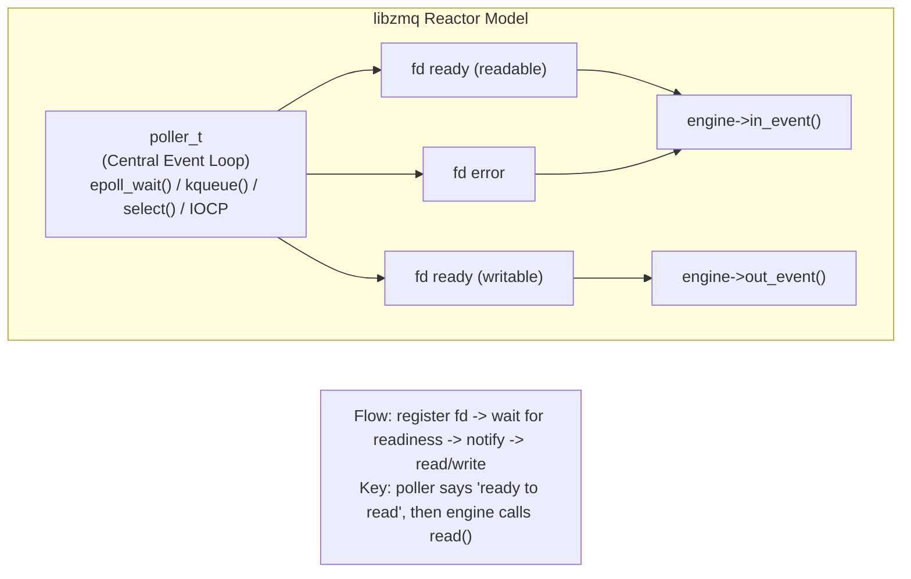
```mermaid
flowchart TB
    subgraph Reactor["libzmq Reactor Model"]
        poller["poller_t\n(Central Event Loop)\nepoll_wait() / kqueue() / select() / IOCP"]
        readable["fd ready (readable)"]
        writable["fd ready (writable)"]
        fderror["fd error"]
        in_event["engine->in_event()"]
        out_event["engine->out_event()"]

        poller --> readable
        poller --> writable
        poller --> fderror
        readable --> in_event
        writable --> out_event
        fderror --> in_event
    end

    note["Flow: register fd -> wait for readiness -> notify -> read/write\nKey: poller says 'ready to read', then engine calls read()"]

    Reactor ~~~ note
```

**Key characteristics:**
- Platform-specific poller implementations required (epoll, kqueue, devpoll, pollset, select, IOCP)
- Engines perform synchronous `read()`/`write()` inside `in_event()`/`out_event()` callbacks
- Each I/O thread owns one `poller_t` instance and runs an event loop
- Adding new transports requires conforming to the fd-based interface

### 2.2 Proactor Pattern (zlink)

zlink uses the Boost.Asio **Proactor pattern**.
Engines request asynchronous I/O operations from the OS, and the OS invokes completion callbacks when done.

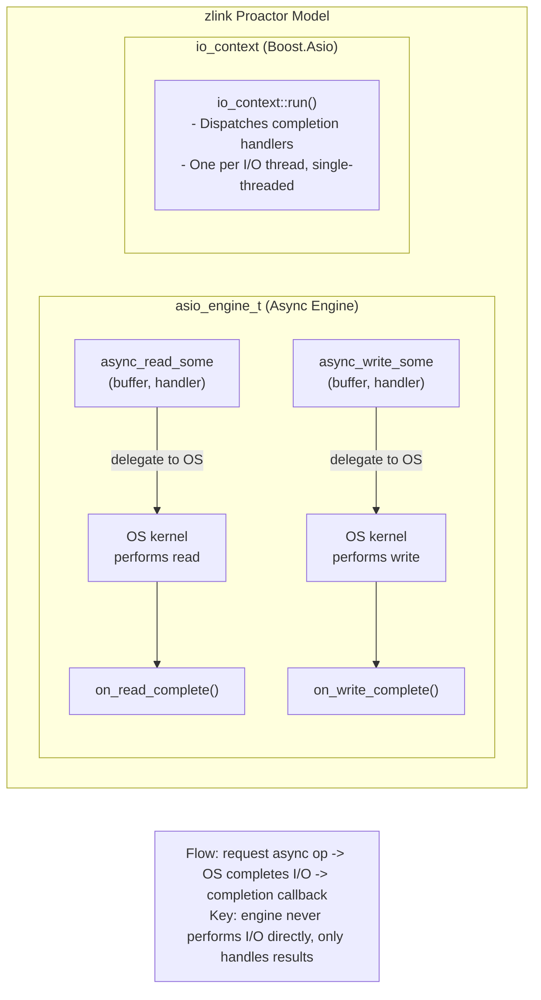
```mermaid
flowchart TB
    subgraph Proactor["zlink Proactor Model"]
        subgraph Engine["asio_engine_t (Async Engine)"]
            async_read["async_read_some\n(buffer, handler)"]
            os_read["OS kernel\nperforms read"]
            on_read["on_read_complete()"]
            async_write["async_write_some\n(buffer, handler)"]
            os_write["OS kernel\nperforms write"]
            on_write["on_write_complete()"]

            async_read -->|"delegate to OS"| os_read --> on_read
            async_write -->|"delegate to OS"| os_write --> on_write
        end

        subgraph IoCtx["io_context (Boost.Asio)"]
            run["io_context::run()\n- Dispatches completion handlers\n- One per I/O thread, single-threaded"]
        end
    end

    note["Flow: request async op -> OS completes I/O -> completion callback\nKey: engine never performs I/O directly, only handles results"]

    Proactor ~~~ note
```

**Key characteristics:**
- Boost.Asio abstracts platform differences (epoll/kqueue/IOCP unified)
- Engines request via `async_read_some()`/`async_write_some()`, handle results in completion callbacks
- Each I/O thread owns an independent `io_context` — no contention between threads
- Transport abstraction (`i_asio_transport`) enables TCP/TLS/WS/WSS through a uniform interface

### 2.3 Reactor vs. Proactor Comparison

| Aspect | libzmq (Reactor) | zlink (Proactor) |
|---|---|---|
| I/O Model | Readiness-based: "ready to read" -> read() | Completion-based: "read done" -> callback |
| Main Loop | poller_t::loop() (custom event loop) | io_context::run() (Boost.Asio event loop) |
| I/O Threads | poller_t per thread + fd_table management | io_context per thread + independent execution |
| Engine Callbacks | in_event() / out_event() | on_read_complete() / on_write_complete() |
| Protocol | ZMTP 3.x | ZMP v1.0 (8B fixed header) |
| Transport Extension Cost | Direct fd management; must fit fd-based API | i_asio_transport abstraction; implement interface only |
| Platform Pollers | 6 implementations (epoll, kqueue, IOCP, etc.) | Delegated to Boost.Asio (single codebase) |
| Optimizations | Reactor event batching | Speculative I/O, Gather Write, Backpressure (pending buf) |

### 2.4 Migration Strategy

The port from libzmq to zlink used **selective per-layer replacement**, not a full rewrite.

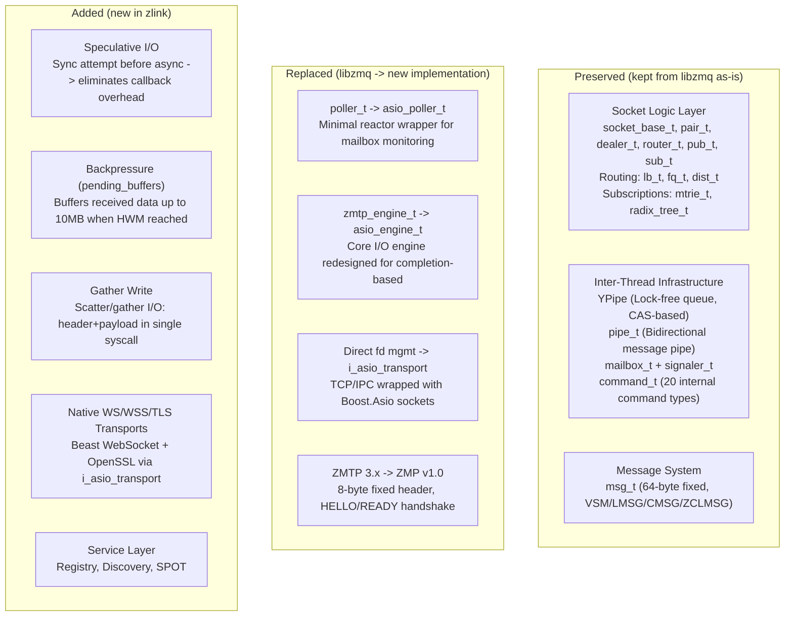
```mermaid
flowchart TB
    subgraph Preserved["Preserved (kept from libzmq as-is)"]
        SL["Socket Logic Layer\nsocket_base_t, pair_t, dealer_t, router_t, pub_t, sub_t\nRouting: lb_t, fq_t, dist_t\nSubscriptions: mtrie_t, radix_tree_t"]
        IT["Inter-Thread Infrastructure\nYPipe (Lock-free queue, CAS-based)\npipe_t (Bidirectional message pipe)\nmailbox_t + signaler_t\ncommand_t (20 internal command types)"]
        MS["Message System\nmsg_t (64-byte fixed, VSM/LMSG/CMSG/ZCLMSG)"]
    end

    subgraph Replaced["Replaced (libzmq -> new implementation)"]
        R1["poller_t -> asio_poller_t\nMinimal reactor wrapper for mailbox monitoring"]
        R2["zmtp_engine_t -> asio_engine_t\nCore I/O engine redesigned for completion-based"]
        R3["Direct fd mgmt -> i_asio_transport\nTCP/IPC wrapped with Boost.Asio sockets"]
        R4["ZMTP 3.x -> ZMP v1.0\n8-byte fixed header, HELLO/READY handshake"]
    end

    subgraph Added["Added (new in zlink)"]
        A1["Speculative I/O\nSync attempt before async -> eliminates callback overhead"]
        A2["Backpressure (pending_buffers)\nBuffers received data up to 10MB when HWM reached"]
        A3["Gather Write\nScatter/gather I/O: header+payload in single syscall"]
        A4["Native WS/WSS/TLS Transports\nBeast WebSocket + OpenSSL via i_asio_transport"]
        A5["Service Layer\nRegistry, Discovery, SPOT"]
    end
```

**Why wasn't the Reactor completely removed?**

`asio_poller_t` remains as a minimal Reactor-compatible wrapper for monitoring mailbox fds.
The existing libzmq `io_object_t` infrastructure receives mailbox events through poller callbacks,
so this path is wrapped with Asio's `async_wait()` to maintain compatibility.
The actual data I/O path (`asio_engine_t`) operates as a pure Proactor pattern.

---

## 3. 5-Layer Architecture

zlink is composed of 5 clearly separated layers.
Each layer has a single responsibility, and layers closer to the bottom are closer to the physical network.


```mermaid
flowchart TB
    subgraph L1["APPLICATION LAYER"]
        App["User code:\nzlink_ctx_new() -> zlink_socket() -> zlink_bind/connect()\n-> zlink_send() / zlink_recv() -> zlink_close()"]
    end

    subgraph L2["PUBLIC API LAYER"]
        API["src/api/zlink.cpp\nC API entry points (zlink_socket, zlink_send, zlink_recv, etc.)\nError handling and parameter validation"]
    end

    subgraph L3["SOCKET LOGIC LAYER"]
        Sockets["src/sockets/\nsocket_base_t: Base class for all sockets\npair_t, dealer_t, router_t, pub_t, sub_t, xpub_t, xsub_t, stream_t\nRouting: lb_t(RR), fq_t(Fair Queue), dist_t(Fan-out)\nSubscriptions: mtrie_t(XPUB), radix_tree_t / trie_with_size_t(XSUB)"]
    end

    subgraph L4["ENGINE LAYER (ASIO)"]
        Engines["src/engine/asio/\nasio_engine_t: Proactor-based async I/O engine (base)\nasio_zmp_engine_t: ZMP protocol (8B fixed header + handshake)\nasio_raw_engine_t: RAW protocol (4B Length-Prefix, STREAM only)"]
    end

    subgraph L5A["PROTOCOL LAYER"]
        ZMP["ZMP v1.0 Protocol\nsrc/protocol/zmp_*\n8-byte fixed header\nHandshake support"]
        RAW["RAW Protocol\nsrc/protocol/raw_*\n4-byte length prefix\nNo handshake"]
    end

    subgraph L5B["TRANSPORT LAYER"]
        TCP["TCP\ntcp_transport"]
        IPC["IPC\nipc_transport"]
        WS["WS\nws_transport"]
        TLSWSS["TLS/WSS\nssl_transport"]
        iface["i_asio_transport: Unified async interface"]
    end

    L1 --> L2 --> L3 --> L4 --> L5A --> L5B
```

**Message passing path between layers**:
- Downward (Tx): Application -> API -> Socket Logic -> pipe_t -> Engine -> Protocol -> Transport
- Upward (Rx): Transport -> Protocol -> Engine -> pipe_t -> Socket Logic -> API -> Application

---

## 4. Component Relationships

The diagram below shows the ownership relationships and interactions between zlink internal objects.

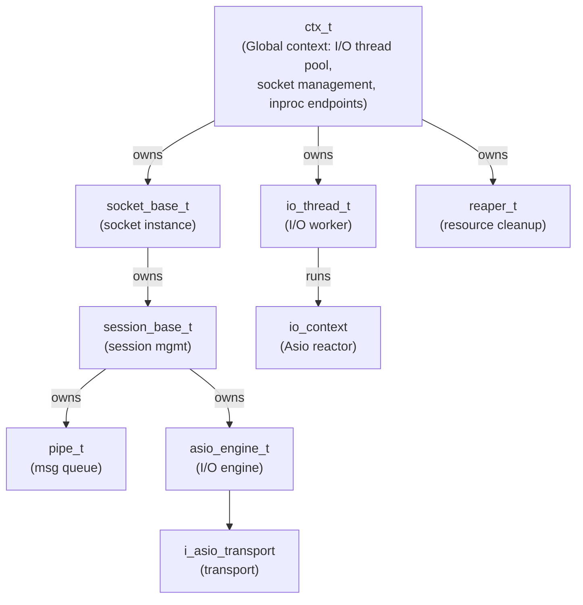
```mermaid
flowchart TB
    ctx["ctx_t\n(Global context: I/O thread pool,\nsocket management, inproc endpoints)"]

    ctx -->|"owns"| socket["socket_base_t\n(socket instance)"]
    ctx -->|"owns"| iothread["io_thread_t\n(I/O worker)"]
    ctx -->|"owns"| reaper["reaper_t\n(resource cleanup)"]

    socket -->|"owns"| session["session_base_t\n(session mgmt)"]
    iothread -->|"runs"| ioctx["io_context\n(Asio reactor)"]

    session -->|"owns"| pipe["pipe_t\n(msg queue)"]
    session -->|"owns"| engine["asio_engine_t\n(I/O engine)"]

    engine --> transport["i_asio_transport\n(transport)"]
```

**Key ownership relationships**:

- `ctx_t` owns all `socket_base_t`, `io_thread_t`, and `reaper_t` instances.
- `socket_base_t` owns `session_base_t`, which acts as a bridge between the socket and the engine.
- `session_base_t` owns `pipe_t` (lock-free message queue) and `asio_engine_t` (I/O engine).
- `asio_engine_t` communicates with the physical transport layer through the `i_asio_transport` interface.
- `io_thread_t` holds an independent `io_context` for processing asynchronous I/O.
- `reaper_t` safely cleans up resources for terminated sockets/sessions.

---

## 5. Socket Logic Layer Details

### 5.1 Class Hierarchy

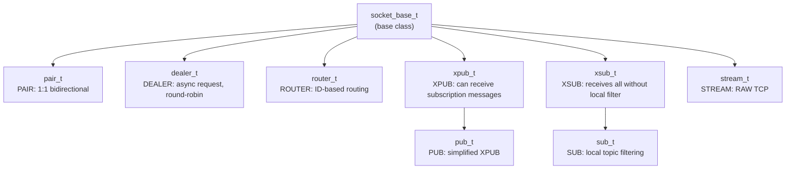
```mermaid
flowchart TB
    base["socket_base_t\n(base class)"]
    pair["pair_t\nPAIR: 1:1 bidirectional"]
    dealer["dealer_t\nDEALER: async request, round-robin"]
    router["router_t\nROUTER: ID-based routing"]
    xpub["xpub_t\nXPUB: can receive subscription messages"]
    pub["pub_t\nPUB: simplified XPUB"]
    xsub["xsub_t\nXSUB: receives all without local filter"]
    sub["sub_t\nSUB: local topic filtering"]
    stream["stream_t\nSTREAM: RAW TCP"]

    base --> pair
    base --> dealer
    base --> router
    base --> xpub --> pub
    base --> xsub --> sub
    base --> stream
```

`socket_base_t` provides common functionality for all sockets:
- Connection management (`bind`, `connect`, `disconnect`, `unbind`)
- Pipe management (creation, termination, activation)
- Option management (`setsockopt`, `getsockopt`)
- Polling support (`has_in`, `has_out`)

### 5.2 Routing Strategy Classes

Strategy classes for message distribution and collection are separated by socket type:

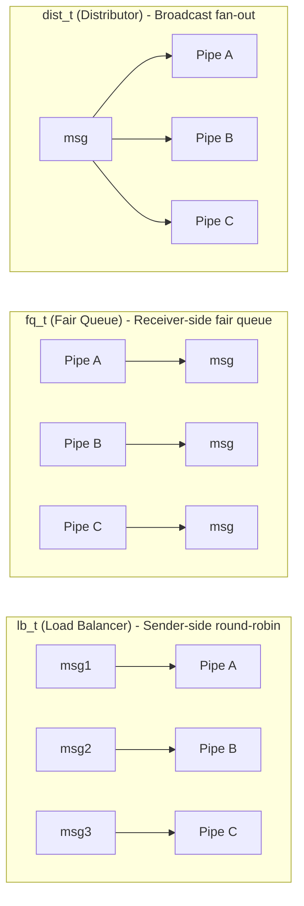
```mermaid
flowchart LR
    subgraph LB["lb_t (Load Balancer) - Sender-side round-robin"]
        direction LR
        msg1["msg1"] --> PA1["Pipe A"]
        msg2["msg2"] --> PB1["Pipe B"]
        msg3["msg3"] --> PC1["Pipe C"]
    end

    subgraph FQ["fq_t (Fair Queue) - Receiver-side fair queue"]
        direction LR
        PA2["Pipe A"] --> recv1["msg"]
        PB2["Pipe B"] --> recv2["msg"]
        PC2["Pipe C"] --> recv3["msg"]
    end

    subgraph DIST["dist_t (Distributor) - Broadcast fan-out"]
        direction LR
        src["msg"] --> PA3["Pipe A"]
        src --> PB3["Pipe B"]
        src --> PC3["Pipe C"]
    end
```

- **lb_t**: Used by DEALER (Tx) -- distributes messages in round-robin order
- **fq_t**: Used by DEALER (Rx), SUB (Rx) -- fairly receives from each pipe
- **dist_t**: Used by PUB, XPUB (Tx) -- sends the same message to all pipes

### 5.3 Routing Strategy Mapping by Socket

| Socket  | Tx                    | Rx                   | Notes                            |
|---------|-----------------------|----------------------|----------------------------------|
| PAIR    | Single pipe           | Single pipe          | Only 1 pipe allowed              |
| DEALER  | `lb_t` (Round-robin)  | `fq_t` (Fair Queue)  | Async request-reply              |
| ROUTER  | ID-based direct route | `fq_t` (Fair Queue)  | Finds target pipe by Routing ID  |
| PUB     | `dist_t` (Fan-out)    | -                    | Cannot receive                   |
| SUB     | -                     | `fq_t` (Fair Queue)  | Topic filtering applied          |
| XPUB    | `dist_t` (Fan-out)    | Receives sub messages| Subscription managed by mtrie_t  |
| XSUB    | -                     | `fq_t` (Fair Queue)  | No local filter; receives all    |
| STREAM  | ID-based direct route | `fq_t` (Fair Queue)  | Uses RAW protocol                |

### 5.4 Subscription Data Structures

Trie-based data structures used for topic matching in PUB/SUB patterns:

```
┌─────────────────────────────────────────────────────────────┐
│                 Subscription Topic Trie Structure             │
│                                                              │
│                       (root)                                 │
│                      /      \                                │
│                  "news"    "stock"                            │
│                   /          /   \                            │
│              "weather"   "AAPL"  "GOOGL"                     │
│                                                              │
│  - XPUB: mtrie_t (multi-trie, per-pipe subscription tracking)│
│  - XSUB: Depends on ZLINK_USE_RADIX_TREE macro              │
│    - radix_tree_t (when enabled, memory-efficient)           │
│    - trie_with_size_t (default, fast lookup)                 │
│  - Lookup complexity: O(m), m = topic string length          │
│                                                              │
└─────────────────────────────────────────────────────────────┘
```

---

## 6. Engine Layer Details

### 6.1 Engine Type Comparison

The Engine Layer handles asynchronous I/O processing based on Boost.Asio.

| Engine                | Protocol  | Transports               | Features                           |
|-----------------------|-----------|--------------------------|-------------------------------------|
| `asio_zmp_engine_t`   | ZMP v1.0  | TCP, TLS, IPC, WS, WSS  | Handshake + 8-byte fixed header    |
| `asio_raw_engine_t`   | RAW       | TCP, TLS, IPC, WS, WSS  | 4-byte length prefix, STREAM only  |

> WS/WSS also use `asio_zmp_engine_t` or `asio_raw_engine_t`;
> WebSocket framing is handled by `ws_transport_t`/`wss_transport_t`.

### 6.2 Proactor Pattern Structure

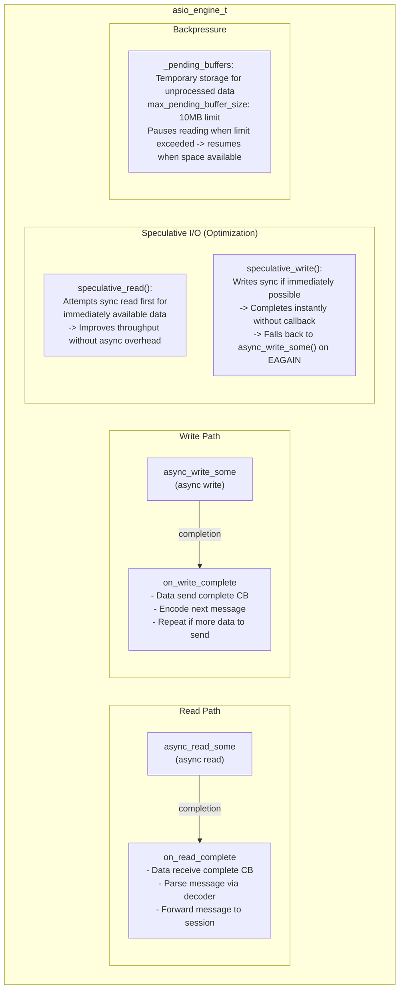
```mermaid
flowchart TB
    subgraph asio_engine["asio_engine_t"]
        subgraph ReadPath["Read Path"]
            ar["async_read_some\n(async read)"] -->|"completion"| orc["on_read_complete\n- Data receive complete CB\n- Parse message via decoder\n- Forward message to session"]
        end

        subgraph WritePath["Write Path"]
            aw["async_write_some\n(async write)"] -->|"completion"| owc["on_write_complete\n- Data send complete CB\n- Encode next message\n- Repeat if more data to send"]
        end

        subgraph Speculative["Speculative I/O (Optimization)"]
            sr["speculative_read():\nAttempts sync read first for\nimmediately available data\n-> Improves throughput without async overhead"]
            sw["speculative_write():\nWrites sync if immediately possible\n-> Completes instantly without callback\n-> Falls back to async_write_some() on EAGAIN"]
        end

        subgraph BP["Backpressure"]
            bp["_pending_buffers: Temporary storage for unprocessed data\nmax_pending_buffer_size: 10MB limit\nPauses reading when limit exceeded -> resumes when space available"]
        end
    end
```

### 6.3 Engine State Machine

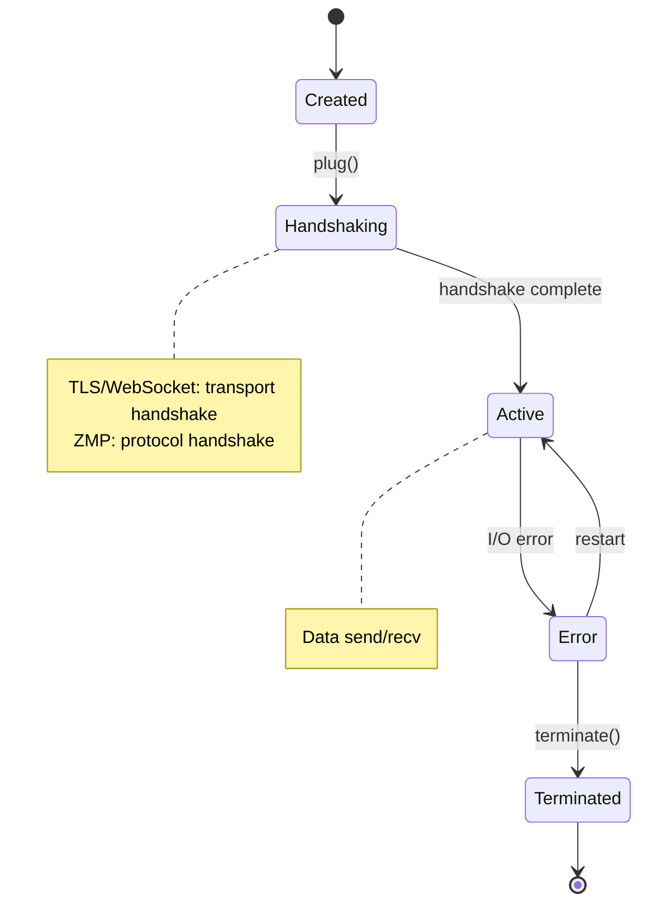
```mermaid
stateDiagram-v2
    [*] --> Created
    Created --> Handshaking : plug()
    Handshaking --> Active : handshake complete
    Active --> Error : I/O error
    Error --> Active : restart
    Error --> Terminated : terminate()
    Terminated --> [*]

    note right of Handshaking
        TLS/WebSocket: transport handshake
        ZMP: protocol handshake
    end note

    note right of Active
        Data send/recv
    end note
```

### 6.4 ZMP v1.0 Frame Structure

```
 Byte:   0         1         2         3         4    5    6    7
      ┌─────────┬─────────┬─────────┬─────────┬─────────────────────┐
      │  MAGIC  │ VERSION │  FLAGS  │RESERVED │   PAYLOAD SIZE      │
      │  (0x5A) │  (0x01) │         │ (0x00)  │   (32-bit BE)       │
      └─────────┴─────────┴─────────┴─────────┴─────────────────────┘
```

| Field        | Offset | Size | Description               |
|-------------|--------|------|---------------------------|
| MAGIC       | 0      | 1    | Magic number `0x5A` ('Z') |
| VERSION     | 1      | 1    | Protocol version `0x01`   |
| FLAGS       | 2      | 1    | Frame flags               |
| RESERVED    | 3      | 1    | Reserved (0x00)           |
| PAYLOAD SIZE| 4-7    | 4    | Payload size (Big Endian) |

**FLAGS bit definitions**:

| Bit  | Name      | Description            |
|------|-----------|------------------------|
| 0    | MORE      | Multipart message cont.|
| 1    | CONTROL   | Control frame          |
| 2    | IDENTITY  | Contains Routing ID    |
| 3    | SUBSCRIBE | Subscription request   |
| 4    | CANCEL    | Subscription cancel    |

### 6.5 RAW Protocol Frame Structure

A simple protocol for STREAM sockets and external client integration.

```
┌──────────────────────┬─────────────────────────────┐
│  Length (4 Bytes)    │     Payload (N Bytes)       │
│  (Big Endian)        │                             │
└──────────────────────┴─────────────────────────────┘
```

- No handshake (immediate data send/receive)
- Simple implementation: `read(4)` -> `read(length)`
- Easy integration with external clients

### 6.6 ZMP Handshake Sequence

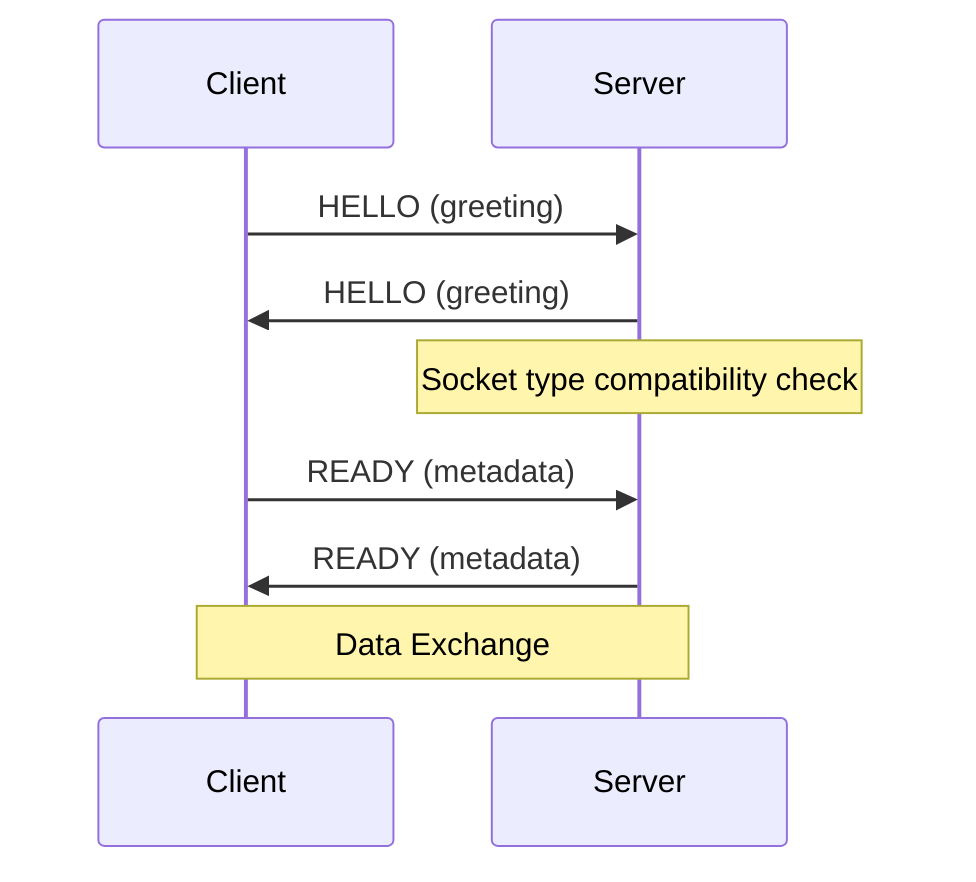
```mermaid
sequenceDiagram
    participant C as Client
    participant S as Server

    C->>S: HELLO (greeting)
    S->>C: HELLO (greeting)
    Note over S: Socket type compatibility check
    C->>S: READY (metadata)
    S->>C: READY (metadata)
    Note over C,S: Data Exchange
```

- **HELLO**: Socket type (1B) + Identity length (1B) + Identity value (0-255B)
- **READY**: Socket-Type property (always), Identity property (DEALER/ROUTER only)

### 6.7 Protocol-Transport-Engine Mapping

The engine is automatically selected based on the socket type:

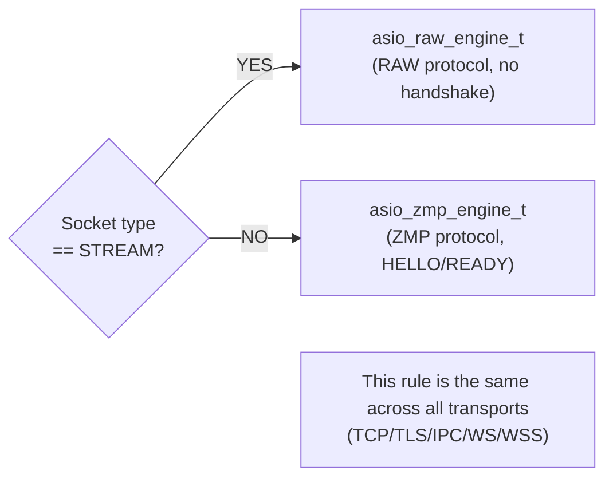
```mermaid
flowchart LR
    Q{"Socket type\n== STREAM?"}
    Q -->|YES| RAW["asio_raw_engine_t\n(RAW protocol, no handshake)"]
    Q -->|NO| ZMP["asio_zmp_engine_t\n(ZMP protocol, HELLO/READY)"]
    Note["This rule is the same across all transports\n(TCP/TLS/IPC/WS/WSS)"]
    Q ~~~ Note
```

**Full Mapping Matrix**:

| URL Scheme | Connecter               | Transport          | STREAM Engine       | Other Socket Engine  | Handshake           |
|-----------|-------------------------|--------------------|---------------------|---------------------|---------------------|
| `tcp://`  | `asio_tcp_connecter_t`  | `tcp_transport_t`  | `asio_raw_engine_t` | `asio_zmp_engine_t` | (none) / ZMP        |
| `tls://`  | `asio_tls_connecter_t`  | `ssl_transport_t`  | `asio_raw_engine_t` | `asio_zmp_engine_t` | SSL / SSL+ZMP       |
| `ws://`   | `asio_ws_connecter_t`   | `ws_transport_t`   | `asio_raw_engine_t` | `asio_zmp_engine_t` | WS / WS+ZMP        |
| `wss://`  | `asio_ws_connecter_t`   | `wss_transport_t`  | `asio_raw_engine_t` | `asio_zmp_engine_t` | SSL+WS / SSL+WS+ZMP|
| `ipc://`  | `asio_ipc_connecter_t`  | `ipc_transport_t`  | `asio_raw_engine_t` | `asio_zmp_engine_t` | (none) / ZMP        |

### 6.8 Handshake Stage Comparison

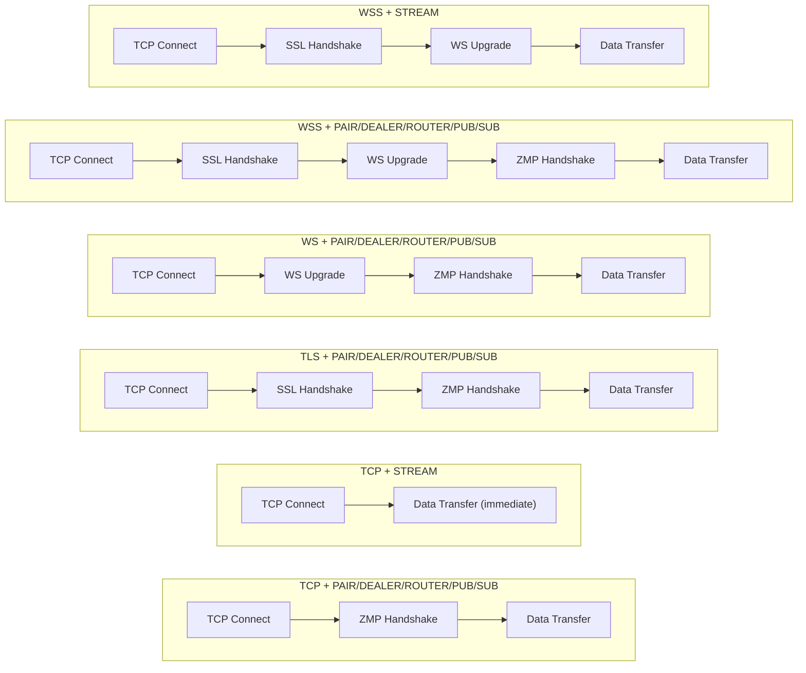
```mermaid
flowchart LR
    subgraph tcp_zmp["TCP + PAIR/DEALER/ROUTER/PUB/SUB"]
        direction LR
        t1["TCP Connect"] --> z1["ZMP Handshake"] --> d1["Data Transfer"]
    end

    subgraph tcp_stream["TCP + STREAM"]
        direction LR
        t2["TCP Connect"] --> d2["Data Transfer (immediate)"]
    end

    subgraph tls_zmp["TLS + PAIR/DEALER/ROUTER/PUB/SUB"]
        direction LR
        t3["TCP Connect"] --> s3["SSL Handshake"] --> z3["ZMP Handshake"] --> d3["Data Transfer"]
    end

    subgraph ws_zmp["WS + PAIR/DEALER/ROUTER/PUB/SUB"]
        direction LR
        t4["TCP Connect"] --> w4["WS Upgrade"] --> z4["ZMP Handshake"] --> d4["Data Transfer"]
    end

    subgraph wss_zmp["WSS + PAIR/DEALER/ROUTER/PUB/SUB"]
        direction LR
        t5["TCP Connect"] --> s5["SSL Handshake"] --> w5["WS Upgrade"] --> z5["ZMP Handshake"] --> d5["Data Transfer"]
    end

    subgraph wss_stream["WSS + STREAM"]
        direction LR
        t6["TCP Connect"] --> s6["SSL Handshake"] --> w6["WS Upgrade"] --> d6["Data Transfer"]
    end
```

### 6.9 Transport Characteristics Comparison

| Transport | Handshake  | Encryption | Speculative Write | Gather Write | Use Case                      |
|-----------|:----------:|:----------:|:-----------------:|:------------:|-------------------------------|
| TCP       | -          | -          | O                 | O            | Standard network communication|
| IPC       | -          | -          | Optional          | O            | Local inter-process comms     |
| TLS       | O          | O          | -                 | -            | Encrypted network communication|
| WS        | O          | -          | -                 | O            | Web client integration        |
| WSS       | O          | O          | -                 | O            | Encrypted web client          |

---

## 7. Core Components

### 7.1 msg_t - Message Container

A 64-byte fixed-size structure that holds all message data.
It is designed to handle small messages without `malloc` calls.

```
┌─────────────────────────────────────────────────────────────────┐
│                        msg_t (64 bytes)                         │
├─────────────────────────────────────────────────────────────────┤
│                                                                 │
│  ┌───────────────────────────────────────────────────────────┐ │
│  │  Common fields (base_t)                                    │ │
│  │  - metadata_t* metadata   (8 bytes)                        │ │
│  │  - uint32_t routing_id    (4 bytes)                        │ │
│  │  - group_t group          (16 bytes)                       │ │
│  │  - uint8_t flags          (1 byte)                         │ │
│  │  - uint8_t type           (1 byte)                         │ │
│  └───────────────────────────────────────────────────────────┘ │
│                                                                 │
│  Type-specific data area (union):                               │
│                                                                 │
│  ┌───────────────────────────────────────────────────────────┐ │
│  │  type_vsm (<=33B on 64-bit)                                │ │
│  │  Very Small Message: data stored directly in msg_t buffer  │ │
│  │  - uint8_t data[max_vsm_size]                              │ │
│  │  - uint8_t size                                            │ │
│  │  -> Inline storage without malloc, fastest path            │ │
│  └───────────────────────────────────────────────────────────┘ │
│                            OR                                   │
│  ┌───────────────────────────────────────────────────────────┐ │
│  │  type_lmsg (>33B on 64-bit)                                │ │
│  │  Large Message: pointer to separately allocated buffer     │ │
│  │  - content_t* content                                      │ │
│  │    ├── void* data          (data pointer)                  │ │
│  │    ├── size_t size         (size)                           │ │
│  │    ├── msg_free_fn* ffn    (free function)                 │ │
│  │    └── atomic_counter_t refcnt (reference count)           │ │
│  └───────────────────────────────────────────────────────────┘ │
│                            OR                                   │
│  ┌───────────────────────────────────────────────────────────┐ │
│  │  type_cmsg: Constant Message (const data ref, no free)     │ │
│  │  type_zclmsg: Zero-copy Large Message (direct user buffer) │ │
│  └───────────────────────────────────────────────────────────┘ │
│                                                                 │
└─────────────────────────────────────────────────────────────────┘
```

**Message flags**:

| Flag         | Value | Description                            |
|-------------|-------|----------------------------------------|
| `more`       | 0x01 | Intermediate frame of multipart message |
| `command`    | 0x02 | Control frame (handshake, heartbeat)   |
| `routing_id` | 0x40 | Contains Routing ID                    |
| `shared`     | 0x80 | Shared buffer (reference counted)      |

**Message types**:

| Type          | Value | Description                                     |
|--------------|-------|-------------------------------------------------|
| `type_vsm`    | 101  | Very Small Message (<=33B, no copy)             |
| `type_lmsg`   | 102  | Large Message (malloc'd buffer)                 |
| `type_cmsg`   | 104  | Constant Message (const data reference)         |
| `type_zclmsg` | 105  | Zero-copy Large Message (direct user buffer)    |

### 7.2 pipe_t - Lock-Free Message Queue

A bidirectional pipe for passing messages between threads.
It exchanges `msg_t` instances lock-free between the Application thread and the I/O thread.

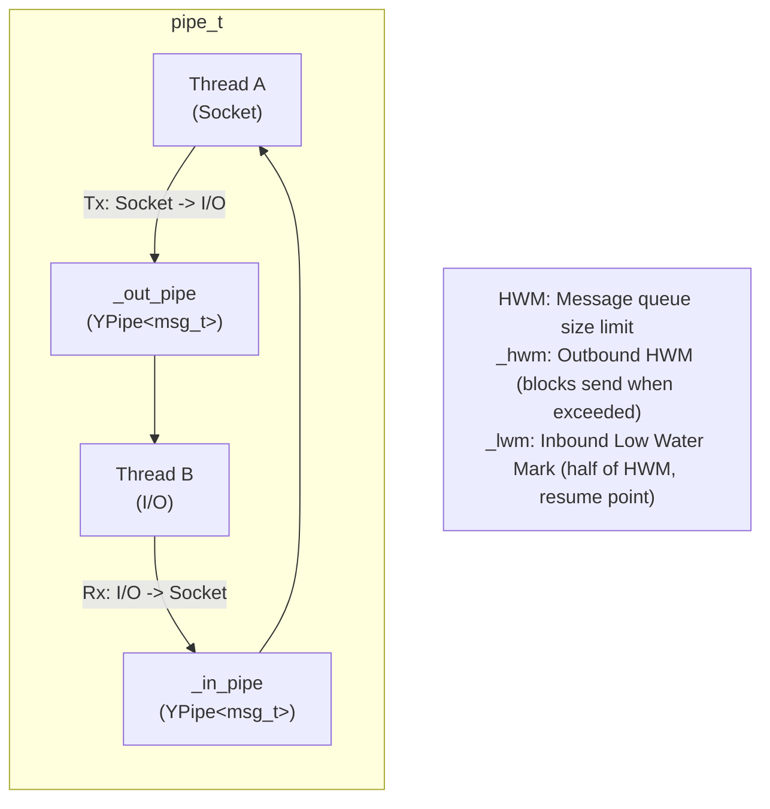
```mermaid
flowchart LR
    subgraph pipe_t
        TA["Thread A\n(Socket)"]
        TB["Thread B\n(I/O)"]
        out["_out_pipe\n(YPipe&lt;msg_t&gt;)"]
        in["_in_pipe\n(YPipe&lt;msg_t&gt;)"]

        TA -->|"Tx: Socket -> I/O"| out --> TB
        TB -->|"Rx: I/O -> Socket"| in --> TA
    end

    hwm["HWM: Message queue size limit\n_hwm: Outbound HWM (blocks send when exceeded)\n_lwm: Inbound Low Water Mark (half of HWM, resume point)"]
    pipe_t ~~~ hwm
```

**YPipe characteristics**:
- Lock-free FIFO queue (CAS operation-based)
- Cache line optimization
- Visibility guaranteed through memory barriers

**Pipe state machine**:

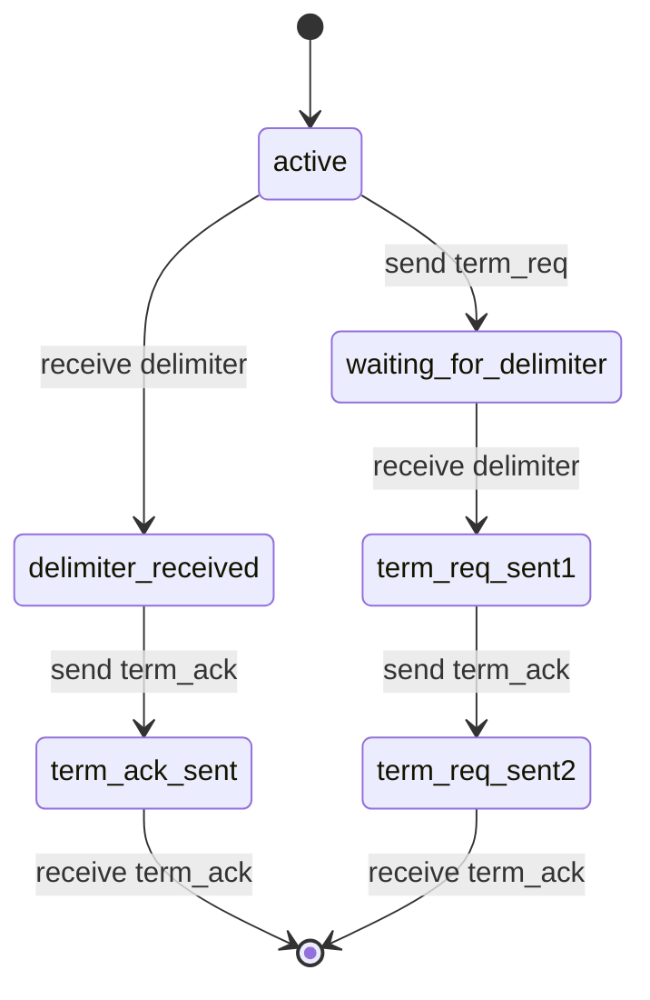
```mermaid
stateDiagram-v2
    [*] --> active
    active --> delimiter_received : receive delimiter
    active --> waiting_for_delimiter : send term_req
    waiting_for_delimiter --> term_req_sent1 : receive delimiter
    delimiter_received --> term_ack_sent : send term_ack
    term_req_sent1 --> term_req_sent2 : send term_ack
    term_ack_sent --> [*] : receive term_ack
    term_req_sent2 --> [*] : receive term_ack
```

### 7.3 ctx_t - Context

The top-level object that manages global state.

**Key roles**:

1. **I/O Thread Pool Management**
   - Set thread count with `zlink_ctx_set(ctx, ZLINK_IO_THREADS, n)` (default: 1)
   - Each I/O thread holds an independent `io_context`
   - Selects the least-loaded I/O thread for new connections (affinity mask support)

2. **Socket Management**
   - Tracks socket creation/deletion
   - Maximum socket limit (default: 1023)
   - Empty slot reuse

3. **inproc Endpoint Management**
   - Maps `inproc://name` format addresses to endpoints
   - Holds connection requests made before bind in pending_connections

```
ctx_t internal structure:
┌──────────────────────────────────────────────────────────┐
│  _sockets: array_t<socket_base_t>     Active socket list  │
│  _empty_slots: vector<uint32_t>       Empty slot reuse    │
│  _io_threads: vector<io_thread_t*>    I/O thread pool     │
│  _slots: vector<i_mailbox*>           Inter-thread mailbox│
│  _endpoints: map<string, endpoint_t>  inproc registry     │
│  _pending_connections: multimap       Pending connections  │
│                                                          │
│  _max_sockets: int     (default: 1023)                   │
│  _io_thread_count: int (default: 1)                      │
│  _max_msgsz: int       (max message size)                │
└──────────────────────────────────────────────────────────┘
```

### 7.4 session_base_t - Session

Acts as a bridge between the socket and the engine.

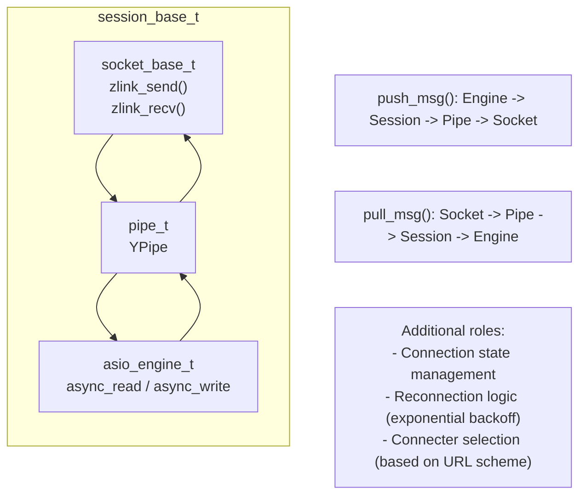
```mermaid
flowchart LR
    subgraph session["session_base_t"]
        socket["socket_base_t\nzlink_send()\nzlink_recv()"]
        pipe["pipe_t\nYPipe"]
        engine["asio_engine_t\nasync_read / async_write"]

        socket --> pipe --> engine
        engine --> pipe --> socket
    end

    push["push_msg(): Engine -> Session -> Pipe -> Socket"]
    pull["pull_msg(): Socket -> Pipe -> Session -> Engine"]
    roles["Additional roles:\n- Connection state management\n- Reconnection logic (exponential backoff)\n- Connecter selection (based on URL scheme)"]

    session ~~~ push
    session ~~~ pull
    session ~~~ roles
```

### 7.5 Threading Model

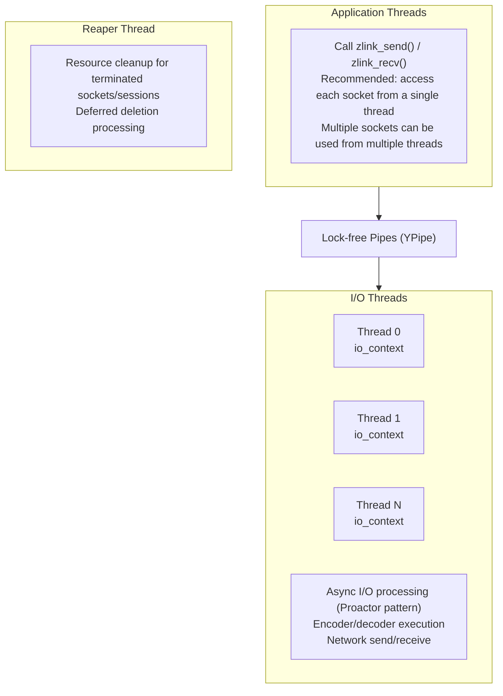
```mermaid
flowchart TB
    subgraph AppThreads["Application Threads"]
        app["Call zlink_send() / zlink_recv()\nRecommended: access each socket from a single thread\nMultiple sockets can be used from multiple threads"]
    end

    pipes["Lock-free Pipes (YPipe)"]

    subgraph IOThreads["I/O Threads"]
        t0["Thread 0\nio_context"]
        t1["Thread 1\nio_context"]
        tN["Thread N\nio_context"]
        io_desc["Async I/O processing (Proactor pattern)\nEncoder/decoder execution\nNetwork send/receive"]
    end

    subgraph Reaper["Reaper Thread"]
        reaper["Resource cleanup for terminated sockets/sessions\nDeferred deletion processing"]
    end

    AppThreads --> pipes --> IOThreads
```

**Inter-thread communication (Mailbox system)**:

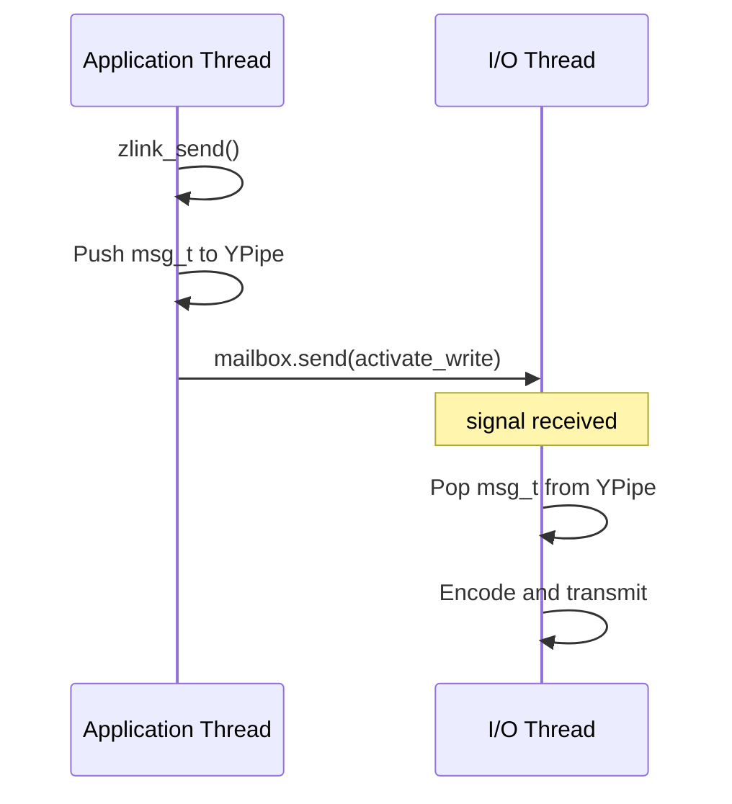
```mermaid
sequenceDiagram
    participant App as Application Thread
    participant IO as I/O Thread

    App->>App: zlink_send()
    App->>App: Push msg_t to YPipe
    App->>IO: mailbox.send(activate_write)
    Note over IO: signal received
    IO->>IO: Pop msg_t from YPipe
    IO->>IO: Encode and transmit
```

- Each thread has its own `mailbox_t`.
- `mailbox_t` internally consists of `ypipe_t<command_t>` and `signaler_t`.
- Command types: `stop`, `plug`, `attach`, `bind`, `activate_read`, `activate_write`, etc.

---

## 8. Data Flow

### 8.1 Message Send (Outbound / Tx)

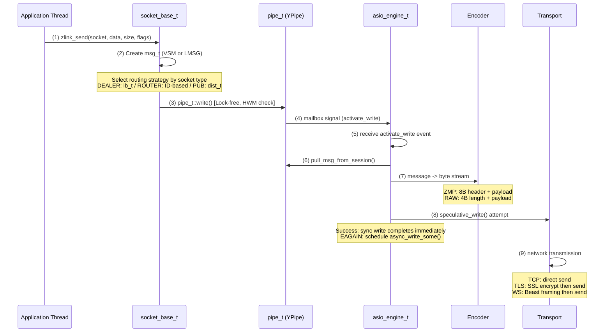
```mermaid
sequenceDiagram
    participant App as Application Thread
    participant Socket as socket_base_t
    participant Pipe as pipe_t (YPipe)
    participant Engine as asio_engine_t
    participant Encoder as Encoder
    participant Transport as Transport

    App->>Socket: (1) zlink_send(socket, data, size, flags)
    Socket->>Socket: (2) Create msg_t (VSM or LMSG)
    Note over Socket: Select routing strategy by socket type<br/>DEALER: lb_t / ROUTER: ID-based / PUB: dist_t
    Socket->>Pipe: (3) pipe_t::write() [Lock-free, HWM check]
    Pipe->>Engine: (4) mailbox signal (activate_write)
    Engine->>Engine: (5) receive activate_write event
    Engine->>Pipe: (6) pull_msg_from_session()
    Engine->>Encoder: (7) message -> byte stream
    Note over Encoder: ZMP: 8B header + payload<br/>RAW: 4B length + payload
    Engine->>Transport: (8) speculative_write() attempt
    Note over Engine: Success: sync write completes immediately<br/>EAGAIN: schedule async_write_some()
    Transport->>Transport: (9) network transmission
    Note over Transport: TCP: direct send<br/>TLS: SSL encrypt then send<br/>WS: Beast framing then send
```

### 8.2 Message Receive (Inbound / Rx)

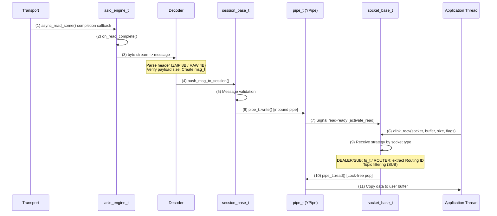
```mermaid
sequenceDiagram
    participant Transport as Transport
    participant Engine as asio_engine_t
    participant Decoder as Decoder
    participant Session as session_base_t
    participant Pipe as pipe_t (YPipe)
    participant Socket as socket_base_t
    participant App as Application Thread

    Transport->>Engine: (1) async_read_some() completion callback
    Engine->>Engine: (2) on_read_complete()
    Engine->>Decoder: (3) byte stream -> message
    Note over Decoder: Parse header (ZMP 8B / RAW 4B)<br/>Verify payload size, Create msg_t
    Decoder->>Session: (4) push_msg_to_session()
    Session->>Session: (5) Message validation
    Session->>Pipe: (6) pipe_t::write() [inbound pipe]
    Pipe->>Socket: (7) Signal read-ready (activate_read)
    App->>Socket: (8) zlink_recv(socket, buffer, size, flags)
    Socket->>Socket: (9) Receive strategy by socket type
    Note over Socket: DEALER/SUB: fq_t / ROUTER: extract Routing ID<br/>Topic filtering (SUB)
    Socket->>Pipe: (10) pipe_t::read() [Lock-free pop]
    Pipe->>App: (11) Copy data to user buffer
```

### 8.3 Connection Establishment Flow

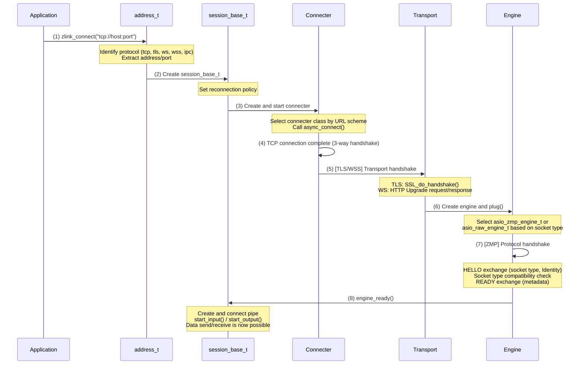
```mermaid
sequenceDiagram
    participant App as Application
    participant Addr as address_t
    participant Session as session_base_t
    participant Conn as Connecter
    participant TP as Transport
    participant Eng as Engine

    App->>Addr: (1) zlink_connect("tcp://host:port")
    Note over Addr: Identify protocol (tcp, tls, ws, wss, ipc)<br/>Extract address/port
    Addr->>Session: (2) Create session_base_t
    Note over Session: Set reconnection policy
    Session->>Conn: (3) Create and start connecter
    Note over Conn: Select connecter class by URL scheme<br/>Call async_connect()
    Conn->>Conn: (4) TCP connection complete (3-way handshake)
    Conn->>TP: (5) [TLS/WSS] Transport handshake
    Note over TP: TLS: SSL_do_handshake()<br/>WS: HTTP Upgrade request/response
    TP->>Eng: (6) Create engine and plug()
    Note over Eng: Select asio_zmp_engine_t or<br/>asio_raw_engine_t based on socket type
    Eng->>Eng: (7) [ZMP] Protocol handshake
    Note over Eng: HELLO exchange (socket type, Identity)<br/>Socket type compatibility check<br/>READY exchange (metadata)
    Eng->>Session: (8) engine_ready()
    Note over Session: Create and connect pipe<br/>start_input() / start_output()<br/>Data send/receive is now possible
```

---

## 9. Source Tree Structure

```
core/
├── include/                         # Public headers (zlink.h)
│
├── src/
│   ├── api/                         # Public C API
│   │   ├── zlink.cpp                # Entry point for all zlink_* functions
│   │   └── zlink_utils.cpp          # Utility functions
│   │
│   ├── core/                        # System base components
│   │   ├── ctx.cpp/hpp              # Context (thread pool, socket management)
│   │   ├── msg.cpp/hpp              # Message container (64B fixed)
│   │   ├── pipe.cpp/hpp             # Lock-free bidirectional pipe
│   │   ├── session_base.cpp/hpp     # Socket-engine bridge
│   │   ├── io_thread.cpp/hpp        # I/O worker thread
│   │   ├── mailbox.cpp/hpp          # Inter-thread command delivery
│   │   ├── object.cpp/hpp           # Base object (command processing)
│   │   ├── own.cpp/hpp              # Ownership management
│   │   ├── reaper.cpp/hpp           # Terminated resource cleanup
│   │   ├── signaler.cpp/hpp         # Thread wake-up signal
│   │   ├── options.cpp/hpp          # Socket option storage
│   │   ├── address.cpp/hpp          # Address parsing
│   │   ├── endpoint.cpp/hpp         # Endpoint management
│   │   ├── command.hpp              # Inter-thread command definitions
│   │   ├── socket_poller.cpp/hpp    # Socket poller
│   │   └── ...
│   │
│   ├── sockets/                     # Socket type implementations
│   │   ├── socket_base.cpp/hpp      # Base class for all sockets
│   │   ├── pair.cpp/hpp             # PAIR socket
│   │   ├── dealer.cpp/hpp           # DEALER socket
│   │   ├── router.cpp/hpp           # ROUTER socket
│   │   ├── pub.cpp/hpp              # PUB socket
│   │   ├── sub.cpp/hpp              # SUB socket
│   │   ├── xpub.cpp/hpp             # XPUB socket
│   │   ├── xsub.cpp/hpp             # XSUB socket
│   │   ├── stream.cpp/hpp           # STREAM socket
│   │   ├── lb.cpp/hpp               # Load balancer (Round-robin)
│   │   ├── fq.cpp/hpp               # Fair queue (Fair Queueing)
│   │   ├── dist.cpp/hpp             # Distributor (Fan-out)
│   │   └── proxy.cpp/hpp            # Proxy utility
│   │
│   ├── engine/                      # I/O engines
│   │   ├── i_engine.hpp             # Engine interface
│   │   └── asio/
│   │       ├── asio_engine.cpp/hpp       # Base Proactor engine
│   │       ├── asio_zmp_engine.cpp/hpp   # ZMP protocol engine
│   │       ├── asio_raw_engine.cpp/hpp   # RAW protocol engine
│   │       ├── asio_poller.cpp/hpp       # io_context wrapper
│   │       ├── i_asio_transport.hpp      # Transport interface
│   │       ├── handler_allocator.hpp     # Handler memory management
│   │       └── asio_error_handler.hpp    # Error handling
│   │
│   ├── protocol/                    # Protocol encoding/decoding
│   │   ├── zmp_protocol.hpp         # ZMP v1.0 constant definitions
│   │   ├── zmp_encoder.cpp/hpp      # ZMP encoder
│   │   ├── zmp_decoder.cpp/hpp      # ZMP decoder
│   │   ├── zmp_metadata.hpp         # ZMP metadata
│   │   ├── raw_encoder.cpp/hpp      # RAW (Length-Prefix) encoder
│   │   ├── raw_decoder.cpp/hpp      # RAW decoder
│   │   ├── encoder.hpp              # Encoder base template
│   │   ├── decoder.hpp              # Decoder base template
│   │   ├── i_encoder.hpp            # Encoder interface
│   │   ├── i_decoder.hpp            # Decoder interface
│   │   ├── metadata.cpp/hpp         # Metadata processing
│   │   ├── wire.hpp                 # Byte order conversion
│   │   └── decoder_allocators.cpp/hpp # Decoder memory management
│   │
│   ├── transports/                  # Transport implementations
│   │   ├── tcp/                     # TCP transport
│   │   │   ├── tcp_transport.cpp/hpp
│   │   │   ├── asio_tcp_connecter.cpp/hpp
│   │   │   ├── asio_tcp_listener.cpp/hpp
│   │   │   ├── tcp_address.cpp/hpp
│   │   │   └── tcp.cpp/hpp
│   │   │
│   │   ├── ipc/                     # IPC transport (Unix only)
│   │   │   ├── ipc_transport.cpp/hpp
│   │   │   ├── asio_ipc_connecter.cpp/hpp
│   │   │   ├── asio_ipc_listener.cpp/hpp
│   │   │   └── ipc_address.cpp/hpp
│   │   │
│   │   ├── ws/                      # WebSocket transport (Beast)
│   │   │   ├── ws_transport.cpp/hpp
│   │   │   ├── asio_ws_connecter.cpp/hpp
│   │   │   ├── asio_ws_listener.cpp/hpp
│   │   │   ├── asio_ws_engine.cpp/hpp   # (unused, uses asio_zmp/raw_engine)
│   │   │   └── ws_address.cpp/hpp
│   │   │
│   │   └── tls/                     # TLS/SSL transport (OpenSSL)
│   │       ├── ssl_transport.cpp/hpp
│   │       ├── wss_transport.cpp/hpp
│   │       ├── asio_tls_connecter.cpp/hpp
│   │       ├── asio_tls_listener.cpp/hpp
│   │       ├── ssl_context_helper.cpp/hpp
│   │       └── wss_address.cpp/hpp
│   │
│   ├── services/                    # High-level services
│   │   ├── common/                  # Common service utilities
│   │   │   ├── advertise_endpoint.hpp   # Endpoint resolution for service registration
│   │   │   ├── monitor_decode.hpp       # Monitor event decoding
│   │   │   ├── service_monitor.cpp/hpp  # Service-level monitor implementation
│   │   │   ├── service_runtime_base.hpp # Service lifecycle kernel
│   │   │   └── socket_monitor_bridge.hpp # PAIR-based socket monitor bridge
│   │   ├── discovery/               # Service discovery
│   │   │   ├── discovery.cpp/hpp
│   │   │   ├── discovery_access.cpp/hpp  # API seam
│   │   │   ├── discovery_bootstrap.cpp   # Registry bootstrap
│   │   │   ├── discovery_state.cpp       # Local service directory state
│   │   │   ├── discovery_update.cpp      # Service list update
│   │   │   ├── discovery_uplink.cpp      # Registry uplink/heartbeat
│   │   │   ├── discovery_registry_client.cpp # Registry protocol client
│   │   │   ├── discovery_protocol.hpp
│   │   │   ├── registry_access.cpp/hpp   # Registry API seam
│   │   │   └── registry_query_access.cpp/hpp # Remote query API seam
│   │   └── spot/                    # SPOT service (POSD modular split)
│   │       ├── spot_node.cpp/hpp    # Network control (PUB/SUB mesh)
│   │       ├── spot_node_access.cpp/hpp  # SpotNode API seam
│   │       ├── spot_handle.hpp      # Public handle struct
│   │       ├── spot_pub.cpp/hpp     # Publish handle (thread-safe)
│   │       ├── spot_sub.cpp/hpp     # Subscribe/receive handle
│   │       ├── spot_sub_option.cpp  # Sub-side option handling
│   │       ├── spot_sub_recv.cpp    # Sub-side recv handling
│   │       ├── spot_subject_access.cpp/hpp # Subject API seam
│   │       ├── spot_data_plane.cpp/hpp  # Data plane core
│   │       ├── spot_data_plane_forwarding.cpp # Ingress/egress forwarding
│   │       ├── spot_data_plane_protocol.cpp   # Control messages, subscription updates
│   │       ├── spot_data_plane_internal.hpp   # Data plane internal state
│   │       └── spot_runtime.cpp/hpp # SPOT runtime lifecycle
│   │
│   └── utils/                       # Utilities
│       ├── ypipe.hpp                # Lock-free pipe
│       ├── yqueue.hpp               # Lock-free queue
│       ├── atomic_counter.hpp       # Atomic counter
│       ├── atomic_ptr.hpp           # Atomic pointer
│       ├── blob.hpp                 # Binary blob
│       ├── clock.cpp/hpp            # Time measurement
│       ├── random.cpp/hpp           # Random number generation
│       ├── ip_resolver.cpp/hpp      # IP address resolution
│       ├── mtrie.cpp/hpp            # Multi-trie (XPUB subscriptions)
│       ├── trie.cpp/hpp             # Trie
│       ├── radix_tree.cpp/hpp       # Radix tree (XSUB subscriptions)
│       ├── generic_mtrie.hpp        # Generic multi-trie template
│       ├── mutex.hpp                # Mutex wrapper
│       ├── condition_variable.hpp   # Condition variable wrapper
│       ├── err.cpp/hpp              # Error handling
│       ├── ip.cpp/hpp               # IP utilities
│       ├── config.hpp               # Compile-time configuration
│       └── ...
│
├── tests/                           # Functional tests
└── unittests/                       # Internal unit tests
```

---

## 10. Structural Design Philosophy

The preceding sections describe **what** zlink's architecture looks like — its layers,
components, data flow, and source tree. This section explains **why** the system is
structured this way: the design principles that guide structural decisions and protect
the codebase from uncontrolled complexity growth.

### 10.1 Deep Modules — Narrow Interfaces, Hidden Complexity

A good module hides a large amount of complexity behind a narrow interface.
The fewer concepts a caller must understand to use a module, the better.

In zlink this principle manifests at several levels:

- **Socket runtime** absorbs endpoint registry, peer state tracking, monitor bridge,
  dispatch bridge, and lifecycle quiesce — exposing only `send`/`recv` capability,
  `bind`/`connect`/`term` semantics, and readiness hooks.
- **Engine pipeline** absorbs speculative I/O, gather write, buffer growth strategy,
  handshake state machine, and heartbeat — exposing only ingress frame delivery,
  egress frame submission, and connection state transitions.
- **Transport adapter** absorbs URI parsing, connect/listen strategy, and
  TLS/WS/WSS handshake details — exposing only `client_endpoint`,
  `server_endpoint`, and `async_transport_channel`.

**Anti-pattern: shallow decomposition.** Splitting a large type into many small
helpers does not reduce the number of concepts the caller must know. Unless a new
type hides complexity from its consumer, extracting it only increases surface area.
A new type is justified only when it reduces the concepts the caller must understand
or when it encapsulates a hot-path policy in one place.

### 10.2 Information Hiding and Ownership Clarity

Each module hides its internal implementation. Higher layers must not depend on
lower-layer details.

**Single authoritative close owner.** Every resource has exactly one owner
responsible for its lifecycle:

| Role | Responsibility |
| --- | --- |
| Service runtime | Lifecycle coordinator — orchestrates startup/shutdown order |
| Socket runtime | Concrete close owner — holds and releases socket resources |
| Reaper | Finalization executor — performs deferred cleanup after quiesce |

When multiple entities can close the same resource, shutdown races and
double-free bugs follow. The goal is to make unauthorized close structurally
impossible, not merely documented as forbidden.

**Causes of information leakage.** Internal implementation details leak outward
through two mechanisms:

1. *Design-time abstraction errors* — the interface reflects internal structure
   from the start.
2. *Incremental interface bloat* — each new requirement exposes one more internal
   detail until the interface mirrors the implementation.

Recognizing which cause applies determines the fix: (1) requires interface
redesign, (2) requires internal reorganization while selectively cleaning up
the parts of the API that already expose internal concepts.

### 10.3 Separating Semantics from Mechanism

Two concerns are cleanly split within the socket layer:

- **Socket family** (PAIR, PUB/SUB, DEALER, ROUTER, STREAM) owns message
  semantics and routing policy — what messages mean and where they go.
- **Socket runtime** owns common mechanism — endpoint registry, peer state,
  monitor bridge, dispatch bridge, and lifecycle quiesce — how every socket
  operates regardless of its family.

The boundary test is bidirectional:

- A family implementation must not depend on mechanism internals.
- A mechanism change must not require modifications to family code.

When this separation holds, adding a new socket family does not touch the
runtime, and evolving the runtime (e.g., changing monitor encoding) does not
touch any family implementation.

### 10.4 Different Layer, Different Abstraction

Each layer must provide its own distinct abstraction, not merely delegate calls
to the layer below. A pass-through layer that adds no abstraction is a candidate
for removal.

| Layer | Abstraction Provided |
| --- | --- |
| Service facade | Service semantics (create / attach / destroy / monitor) |
| Service runtime | Lifecycle state machine and readiness — hides socket open/close order and drain |
| Engine facade | Connection lifecycle (start / stop / state) — hides handshake and timer |
| Engine pipeline | Async I/O optimization — hides speculative I/O and buffer policy |
| Transport adapter | Endpoint open — hides URI/address/scheme selection and TLS/WS/WSS layering |
| Protocol codec | Frame boundary — hides wire encoding and version |

The purpose of layering is not to add more layers. It is to ensure that each
layer hides more complexity from the one above it. If a layer merely forwards
calls without transforming the abstraction, it should be collapsed.

### 10.5 Eliminating Errors Through Structure

Structural guarantees are preferred over policy-based rules.

Rather than catching errors at runtime, the type system and API design should
make certain classes of errors impossible to express:

```
Policy-based:   "Only A should close this resource" (written in docs, code can violate)
Structure-based: Close authority is bound to a type — other actors cannot call close at all
```

Practical strategies include:

- `unique_ptr` with move-only semantics — dual ownership becomes a compile error.
- Close guards (sentinel pattern) — double close becomes a no-op.
- RAII wrappers — manual close calls are structurally impossible.

The goal is to move invariants from documentation into the type system wherever
the cost is reasonable.

### 10.6 Defending Against Incremental Complexity

Complexity rarely arrives all at once. It accumulates through individually
reasonable small changes — each one justified, but collectively eroding
structural clarity.

The architecture must defend against these growth patterns:

- **New transport added** → no new branches in engine or socket code.
- **New service added** → no special-case paths in the service runtime base.
- **New socket family added** → no modifications to `socket_base_t`.

The design goal is: *adding another instance of the same kind of feature does
not touch the hub type.*

When this property holds, the structure's complexity stays bounded regardless
of how many transports, services, or socket families exist. When it does not,
each addition makes the hub type harder to understand and more fragile to
modify.

### 10.7 Performance as a Structural Constraint

Performance is not something bolted on after the architecture is designed.
It constrains structural decisions from the start.

**Hot-path policies stay inside deep modules.** Optimizations such as
speculative I/O, gather write, buffer growth, and zero-copy paths are
encapsulated within the engine pipeline or transport adapter. They are not
spread across layer boundaries.

**Performance is a gate, not a trade-off.** If a structural change degrades
steady-state throughput, tail latency, or CPU utilization, it is not adopted —
even if the structure is objectively cleaner. Conversely, performance-motivated
shortcuts that weaken the public contract are also rejected.

The two constraints reinforce each other: good structure isolates hot-path
policies so they can be optimized without leaking into upper layers, and
performance discipline prevents structure from becoming an academic exercise
divorced from production reality.

---

## Appendix

### A. Related Documents

- [ZMP v1.0 Protocol Details](protocol-zmp.md)
- [RAW Protocol Details](protocol-raw.md)
- [STREAM Socket WS/WSS Optimization](stream-socket.md)
- [Threading and Concurrency Model](threading-model.md)
- [Performance Characteristics and Tuning Guide](../guide/10-performance.md)

### B. Core Interface Summary

**i_asio_transport** (common interface for all transports):

```
i_asio_transport
  +-- open(io_context, fd)              Open connection
  +-- close()                           Close connection
  +-- async_read_some(buffer, handler)  Asynchronous read
  +-- async_write_some(buffer, handler) Asynchronous write
  +-- read_some(buffer, size)           Synchronous (speculative) read
  +-- write_some(buffer, size)          Synchronous (speculative) write
  +-- requires_handshake()              Whether handshake is required
  +-- async_handshake(type, handler)    Asynchronous handshake
  +-- is_encrypted()                    Whether encrypted
  +-- supports_speculative_write()      Whether speculative write is supported
  +-- supports_gather_write()           Whether gather write is supported
```

**i_engine** (engine interface):

```
i_engine
  +-- plug(session)                     Connect to session
  +-- terminate()                       Terminate
  +-- restart_input()                   Restart receive
  +-- restart_output()                  Restart send
```

### C. Performance Optimization Techniques Summary

| Technique           | Description                                                         |
|--------------------|---------------------------------------------------------------------|
| Speculative I/O    | Attempts synchronous I/O before async call to eliminate callback overhead |
| Gather Write       | Sends header+body in a single system call via writev()             |
| Zero-Copy Message  | Stores only user buffer pointer in msg_t, transmits without copy   |
| VSM (Inline)       | Messages <=33 bytes stored directly in msg_t internal buffer (no malloc) |
| Lock-free YPipe    | CAS operation-based inter-thread message exchange, no mutex        |
| Cache Line Opt.    | YPipe nodes aligned to cache line size                             |
| Backpressure       | Pauses reading when 10MB limit exceeded to prevent memory blowup   |
