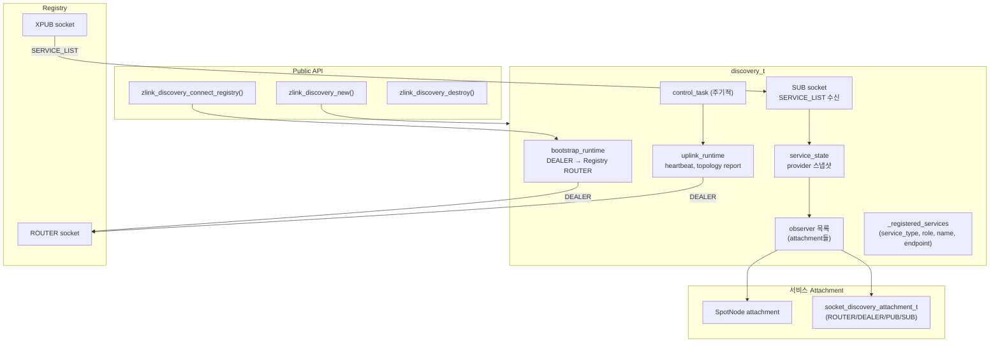
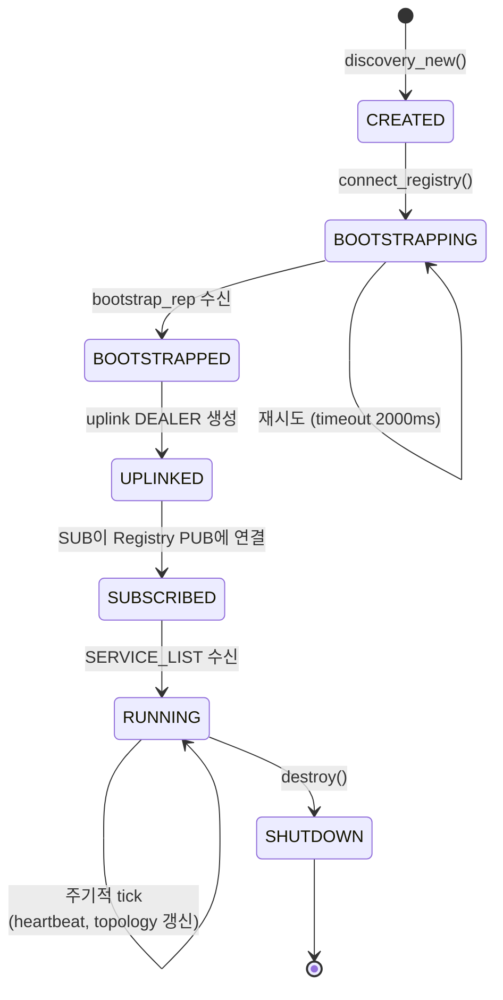
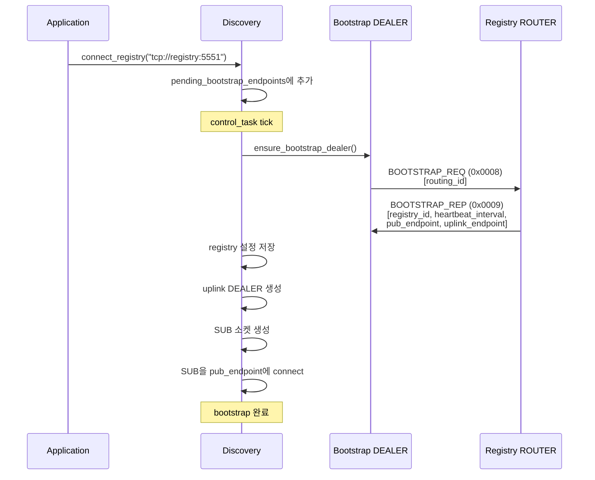
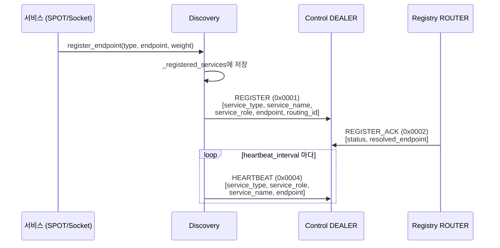
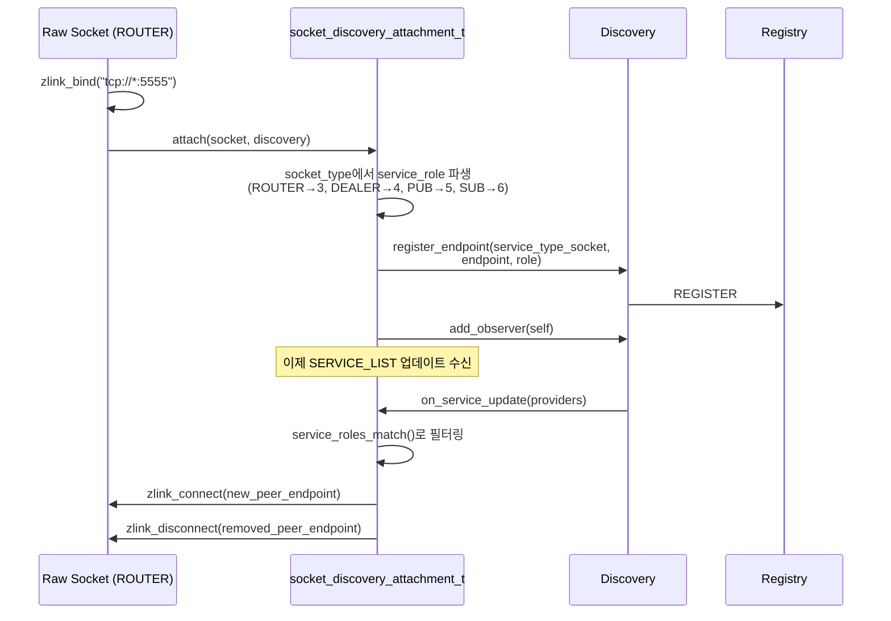
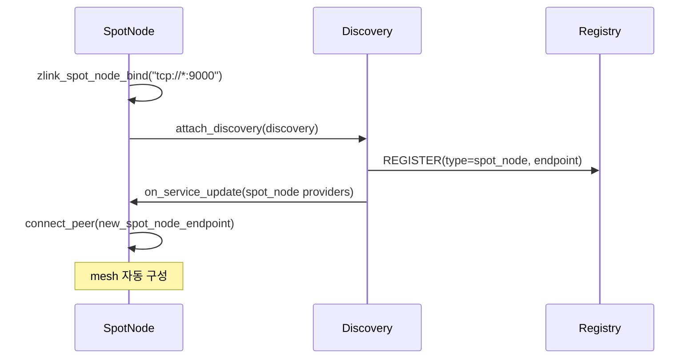
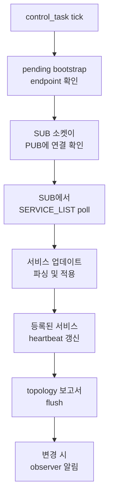

[English](discovery-internals.md) | [한국어](discovery-internals.ko.md)

# Discovery 서비스 내부 아키텍처

## 1. 컴포넌트 개요



## 2. 소켓 종류와 Endpoint

| 소켓 | 타입 | 대상 | 용도 |
|------|------|------|------|
| Bootstrap DEALER | DEALER | Registry ROUTER | 초기 등록, bootstrap 요청 |
| Topology Report DEALER | DEALER | Registry uplink | topology 상태 보고 |
| Control DEALER | DEALER | Registry uplink | heartbeat, 속성 업데이트 |
| SERVICE_LIST SUB | SUB | Registry XPUB | 서비스 목록 브로드캐스트 수신 |

모든 DEALER 소켓은 필요 시 생성되고 shutdown 시 파괴된다.

## 3. Lifecycle 상태 머신



## 4. Bootstrap 흐름



## 5. 서비스 등록 흐름



## 6. SERVICE_LIST 업데이트 흐름


### SERVICE_LIST 프레임 형식

```text
Frame 0: msg_id = 0x0005
Frame 1: registry_id (uint32_t)
Frame 2: list_seq (uint64_t)
Frame 3: service_count (uint32_t)
Frame 4~N: 서비스 항목 (반복):
  - service_type (uint16_t)
  - service_name (string)
  - provider_count (uint32_t)
  - provider별:
      service_role (uint16_t)
      endpoint (string)
      routing_id (가변)
      value (int64_t)
      metadata (가변)
```

## 7. Socket Discovery Attachment

`socket_discovery_attachment_t`는 raw 소켓을 Discovery와 통합하여
자동 peer 관리를 수행한다.



### 역할 매칭 규칙

| 소켓 타입 | Service Role | 매칭 대상 |
|-----------|-------------|----------|
| ROUTER | 3 | ROUTER (3), DEALER (4) |
| DEALER | 4 | ROUTER (3), DEALER (4) |
| PUB | 5 | SUB (6) |
| SUB | 6 | PUB (5) |
| SPOT | 2 | SPOT (2) |

### Attachment 제약

- 소켓당 바인드된 endpoint 1개만 허용
- 수동 `connect`/`disconnect`/`unbind` 차단 (Discovery 독점)
- Peer 연결은 Discovery가 전적으로 관리
- `discovery_destroy()` 시 모든 attachment에 shutdown 전파

## 8. SpotNode Attachment

SpotNode는 동일한 observer 패턴을 사용하지만:
- `service_type = service_type_spot_node (2)`
- `service_role = service_role_spot (2)` (고정)
- Peer 연결 대상은 mesh 내 다른 SpotNode



## 9. Control Task 주기



## 10. 메시지 프로토콜

| msg_id | 이름 | 방향 | 용도 |
|--------|------|------|------|
| 0x0001 | REGISTER | DEALER→ROUTER | 서비스 등록 |
| 0x0002 | REGISTER_ACK | ROUTER→DEALER | 등록 확인 |
| 0x0003 | UNREGISTER | DEALER→ROUTER | 서비스 해제 |
| 0x000D | UNREGISTER_ACK | ROUTER→DEALER | 해제 확인 |
| 0x0004 | HEARTBEAT | DEALER→ROUTER | keep-alive |
| 0x0005 | SERVICE_LIST | PUB→SUB | 서비스 브로드캐스트 |
| 0x0007 | UPDATE_ATTRIBUTES | DEALER→ROUTER | 서비스 메타데이터 업데이트 |
| 0x0008 | BOOTSTRAP_REQ | DEALER→ROUTER | 초기 설정 요청 |
| 0x0009 | BOOTSTRAP_REP | ROUTER→DEALER | 설정 응답 |
| 0x000A | TOPOLOGY_REPORT | DEALER→ROUTER | topology 상태 보고 |
| 0x000B | TOPOLOGY_QUERY | DEALER→ROUTER | 서비스 topology 조회 |
| 0x000C | TOPOLOGY_REPLY | ROUTER→DEALER | topology 조회 응답 |
