[English](./discovery-internals.md) | [한국어](./discovery-internals.ko.md)

# Discovery 서비스 내부 아키텍처

## 1. 컴포넌트 개요

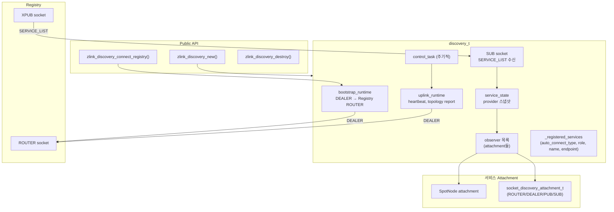

## 2. 소켓 종류와 Endpoint

| 소켓 | 타입 | 대상 | 용도 |
|------|------|------|------|
| Bootstrap DEALER | DEALER | Registry ROUTER | 초기 등록, bootstrap 요청 |
| Topology Report DEALER | DEALER | Registry uplink | topology 상태 보고 |
| Control DEALER | DEALER | Registry uplink | heartbeat, 속성 업데이트 |
| SERVICE_LIST SUB | SUB | Registry XPUB | 서비스 목록 브로드캐스트 수신 |

모든 DEALER 소켓은 필요 시 생성되고 shutdown 시 파괴된다.

## 3. Lifecycle 상태 머신

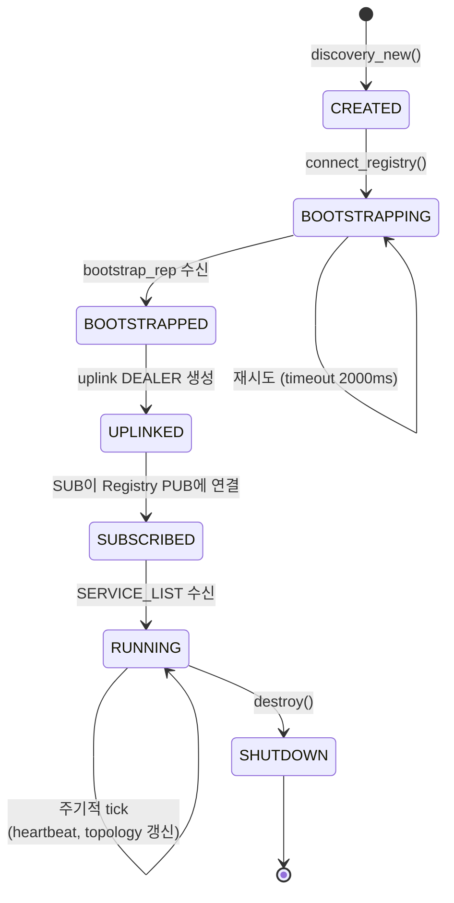

## 4. Bootstrap 흐름

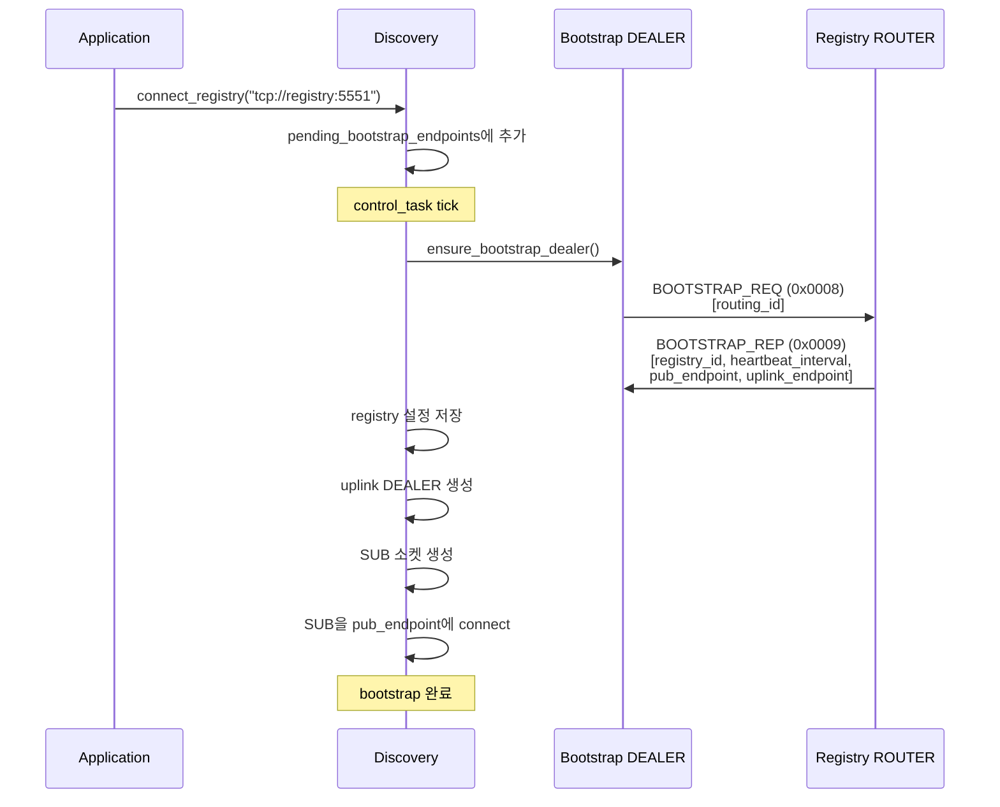

Registry의 주기 값은 option state에 저장된다. 공개 API
`zlink_registry_set()`은 `ZLINK_REGISTRY_OPT_HEARTBEAT_INTERVAL_MS`,
`ZLINK_REGISTRY_OPT_HEARTBEAT_TIMEOUT_MS`,
`ZLINK_REGISTRY_OPT_BROADCAST_INTERVAL_MS` 값을 Registry 내부 설정에 반영한다.
Registry는 bootstrap reply를 만들 때 heartbeat interval 값을 읽어 Discovery에
전달한다. Discovery는 이 값을 저장하고 control task의 heartbeat 송신 주기로
사용한다.

Registry runtime tick은 같은 option state에서 heartbeat timeout과 broadcast
interval을 읽는다. Timeout 값은 provider 만료 판단에 쓰이고, broadcast interval은
SERVICE_LIST publish 주기를 제한한다. 이렇게 공개 설정 API와 runtime 동작 사이의
변환 지점을 Registry 내부에 가두어 Discovery와 attachment가 scalar 설정 세부
형식을 알 필요가 없게 한다.

## 5. 서비스 등록 흐름

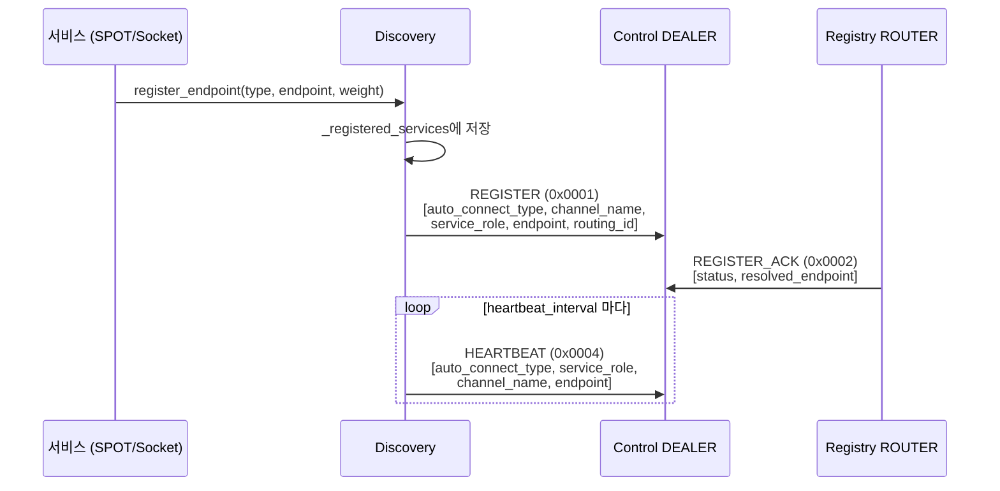

## 6. SERVICE_LIST 업데이트 흐름

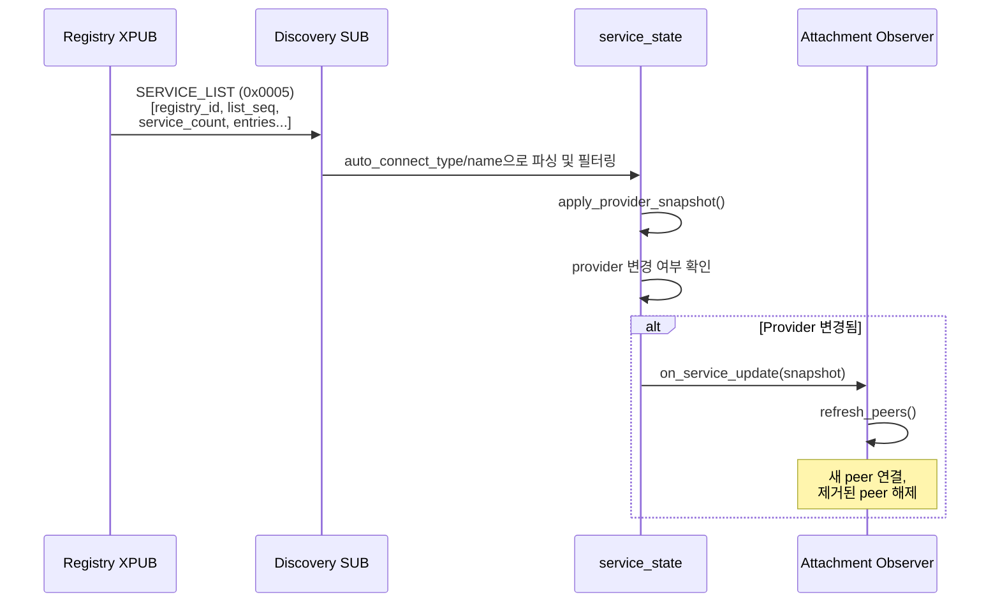

### SERVICE_LIST 프레임 형식

```text
Frame 0: msg_id = 0x0005
Frame 1: registry_id (uint32_t)
Frame 2: list_seq (uint64_t)
Frame 3: service_count (uint32_t)
Frame 4~N: Service entries (repeated):
  - auto_connect_type (uint16_t)
  - channel_name (string)
  - contract_created_at (uint64_t)
  - provider_count (uint32_t)
  - Per provider:
      service_role (uint16_t)
      endpoint (string)
      routing_id (variable)
      source_registry (uint32_t)
      registration_id (uint64_t)
      provider_update_seq (uint64_t)
      weight (uint16_t)
      value (int64_t)
      provider_blob (variable)
```

Registry 피어는 별도 `REGISTRY_SYNC` 멀티파트 메시지로 route binding snapshot을
받는다. Discovery 구독자는 이 메시지를 무시한다. Registry는 route snapshot을
staging view(확정 전 임시 적용 영역)에 먼저 적용한다. 같은 `snapshot_seq`의 청크(chunk)가
순서대로 도착해야 하며, 마지막 청크가 commit되기 전에는 기존 materialized route view
(최종 확정된 경로 테이블)를 바꾸지 않는다.

```text
Frame 0: msg_id = 0x0006
Frame 1: advertising_registry (uint32_t)
Frame 2: snapshot_seq (uint64_t)
Frame 3: chunk_index (uint32_t)
Frame 4: chunk_count (uint32_t)
Frame 5: route_count (uint32_t)
Frame 6~N: Route entries (repeated):
  - channel_name (string)
  - route_kind (uint32_t)
  - route_key (variable)
  - route_value (variable)
  - owner_channel_name (string)
  - owner_service_role (uint16_t)
  - owner_routing_id_key (variable)
  - owner_source_registry (uint32_t)
  - owner_registration_id (uint64_t)
  - updated_at_ms (uint64_t)
  - owner_routing_id (variable)
```

Registry 내부 route row는 두 계층으로 나뉜다. raw observation store는
`route identity + owner identity + advertising registry` 조합을 key로 삼는다.
materialized route table은 `resolve_route()`가 사용할 winner를 route identity마다
하나만 노출한다. owner, route identity, advertising registry별 reverse index를 함께
두기 때문에 owner cleanup, winner 재계산, peer timeout cleanup은 전체 route 수가 아니라
영향을 받는 record 수에 비례한다.

materialized route table은 Redis `dict`에서 검증된 설계를 따른다. bucket 수는 2의
거듭제곱으로 유지하고, 나눗셈 대신 mask로 bucket을 고르며, 충돌은 separate chaining
(별도 연결 리스트로 같은 bucket의 항목을 연결하는 방식)으로 처리한다. table이 커질
때는 기존 table에서 새 table로 bucket을 조금씩 옮긴다. resize 비용을 route 조회와
갱신 경로에 나누어 부담하므로, 큰 route set에서도 한 번에 긴 resize 지연이 생기지
않는다. 각 table entry는 route key를 한 번만 보관하고, value 안에 같은 key를 다시
들고 있지 않는다. Redis `dictEntry`처럼 key와 value의 책임을 분리해 큰 route set에서
중복 문자열 비용을 줄인다. entry node는 fixed scalar만 담고, route key와 value는
packed byte block에 붙여 저장한다. 같은 channel 이름은 table 안에서 intern(중복 없이
단일 복사본으로 관리)해 반복 저장하지 않는다. owner identity도 intern된 id로 공유하고,
bucket과 node link는 32비트 entry id를 사용한다. node 자체는 65,536개 단위 chunk로
할당하므로, 대량 insert 시 단일 vector capacity가 실제 record 수보다 크게 증가하는
비용을 피한다.

route key와 owner identity hash는 Redis `dict`가 쓰는 SipHash 계열 방식으로 계산한다.
snapshot chunk를 만들 때는 Redis `dictScan`처럼 cursor로 materialized table을 나누어
읽고, 순회 중에는 rehash pause guard(재해시 중 순회 보호 잠금)를 잡는다. 그래서
Registry는 route snapshot을 보낼 때 전체 materialized route를 한 번에 별도 vector로
만들지 않고 chunk 크기만큼만 담는다.

provider row도 같은 owner-bound 규칙으로 materialize된다. 서로 다른 source generation이
같은 `channel + role + routing_id`를 claim하거나, 같은 generation이 서로 다른 endpoint를
claim하면 해당 RID는 peer/member projection에서 제외된다. route resolve도 이런 owner를
live owner로 보지 않는다.

## 7. Socket Discovery Attachment

`socket_discovery_attachment_t`는 raw 소켓을 Discovery 와 통합하여
자동 피어 관리를 수행한다.

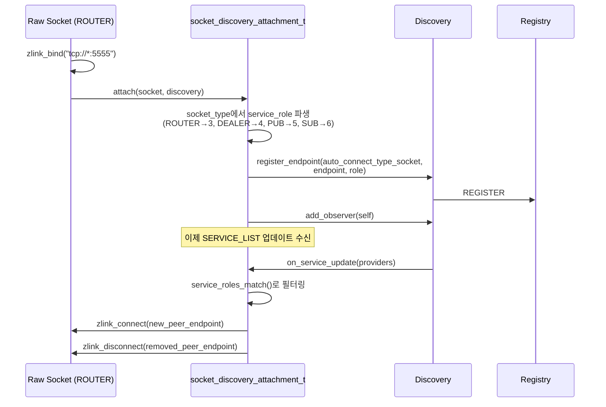

### 역할 매칭 규칙

| 소켓 타입 | Service Role | 매칭 대상 |
|-----------|-------------|----------|
| ROUTER | 3 | ROUTER (3), DEALER (4) |
| DEALER | 4 | ROUTER (3), DEALER (4) |
| PUB | 5 | SUB (6) |
| SUB | 6 | PUB (5) |
| SPOT | 2 | SPOT (2) |

### Attachment 제약

- 소켓당 바인드된 엔드포인트 1개만 허용
- 수동 `connect`/`disconnect`/`unbind` 차단 (Discovery 독점)
- 피어 연결은 Discovery 가 전적으로 관리
- `discovery_destroy()` 시 모든 attachment 에 shutdown 전파

## 8. SpotNode Attachment

SpotNode는 동일한 observer 패턴을 사용하지만 다음 특성이 있다:
- `auto_connect_type = auto_connect_type_spot_node (2)`
- `service_role = service_role_spot (2)` (고정)
- 피어 연결 대상은 mesh 내 다른 SpotNode

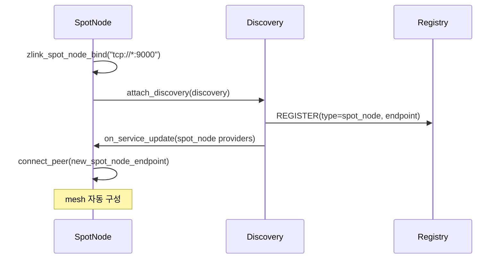

## 9. Control Task 주기

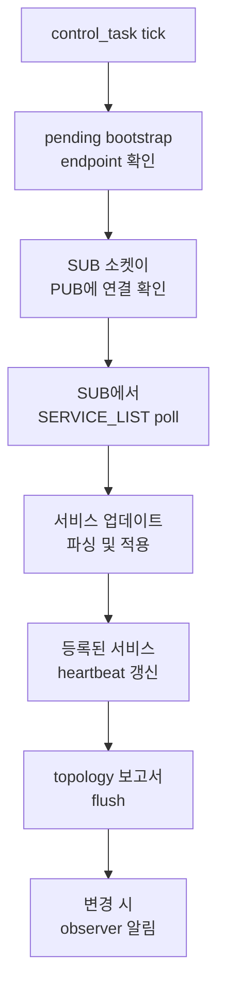

## 10. Spot 소유 노드 조회 (`zlink_discovery_resolve_spot`)

`zlink_discovery_resolve_spot(discovery, spot_rid, &route_out)`는
**논리적 SPOT routing id** 를 **현재 소유 SpotNode 의 routing id** 와 Spot kind로
매핑한다. 호출자가 `(owner_node_rid, spot_rid)` 쌍을 만들어
ROUTER 쪽 직접 전달 함수(`zlink_router_send_spot()` /
`zlink_router_request_spot()`)의 대상으로 사용할 수 있게 해주는
헬퍼다. 이 조회는
해당 Discovery 의 현재 서비스 뷰 범위에서만 유효하다.

SPOT owner topology row를 Registry에 publish하는 동작은
`ZLINK_OPT_DISCOVERY_SPOT_OWNER_SYNC`로 제어한다. 기본값은 `0`이다.
SpotNode를 Discovery에 붙였더라도 이 옵션이 꺼져 있으면 Discovery는 해당
`spot_rid -> owner node` summary를 Registry로 올리지 않는다. 옵션을 `1`로
켠 publish-side Discovery만 owner row를 uplink한다.

이 API 는 **송신/요청 대상 조회 전용**이다. 응답(reply) 경로는
여전히 들어온 request 와 함께 전달된 구체적인 source 주소를 그대로 써야
한다. spot 은 노드 간 이동이 가능하고, 캐시된 소유 노드가 실제 request 를
보낸 그 노드라는 보장이 없기 때문이다.

### 10.1 계약 요약

`from_errno()` 는 `EINVAL`/`EFAULT`/`ENOTSUP`/`EOPNOTSUPP`/`ENOENT` 를
명명된 `zlink_config_result_t` 로 매핑한다. `EAGAIN` 같은 다른 errno 는
`default` 분기로 `ZLINK_CONFIG_INTERNAL_ERROR` 가 되고, 구체 errno 는
`zlink_errno()` 로 조회한다.

| 항목 | 값 |
|---|---|
| 선행 조건 | `discovery->_auto_connect_type == SPOT_NODE`, 아니면 `ENOTSUP` → `ZLINK_CONFIG_NOT_SUPPORTED` |
| 출력 | `route_out` 에 `spot_rid`, owner SpotNode rid, Spot kind 기록 |
| Registry publish 조건 | owner Discovery의 `ZLINK_OPT_DISCOVERY_SPOT_OWNER_SYNC == 1`; 기본값은 `0` |
| 캐시 TTL | `resolve_spot_cache_ttl_ms = 250` ms |
| 캐시 유효 조건 | `validated_service_seq == current_service_seq` 그리고 `now - validated_at_ms <= 250 ms` |
| 미스 동작 | transient DEALER 로 Registry 조회 후 캐시 재시도 |
| 최종 미스 (cache + registry 결과 없음) | `errno = ENOENT`, 결과 = `ZLINK_CONFIG_NOT_FOUND` |
| 잘못된 입력 | `EINVAL` → `ZLINK_CONFIG_INVALID_ARGUMENT` (`discovery` null, `spot_rid` null/size 0, `route_out` null) |
| 잘못된 handle | `EFAULT` → `ZLINK_CONFIG_INVALID_HANDLE` |
| uplink 없음 | Registry 조회 단계에서 `errno = EAGAIN`, 결과 = `ZLINK_CONFIG_INTERNAL_ERROR` |

### 10.2 캐시 hit (fast path)

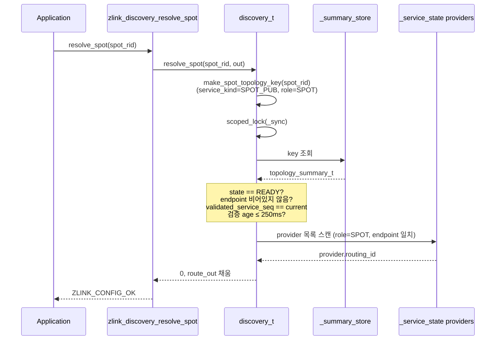

### 10.3 캐시 miss (Registry 갱신)

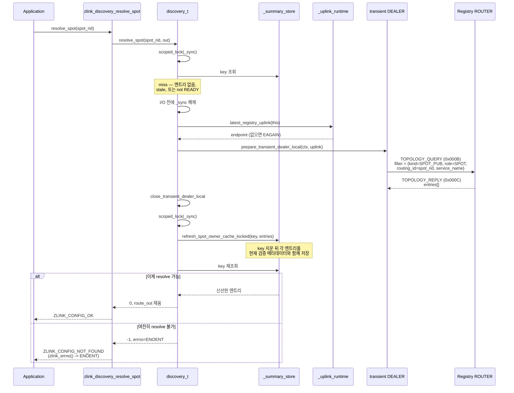

### 10.4 캐시 신선도 규칙

두 가지 조건이 모두 맞으면 캐시 엔트리를 신선한 것으로 본다.

1. **Membership-seq 일치** — `validated_service_seq == _service_state.service_update_seq()`. 이 시퀀스 번호는 Discovery 의 provider 뷰가 바뀔 때마다(새 peer 추가, peer 이탈, role 변경) 증가한다.
2. **검증 TTL** — `validated_at_ms > 0 && now - validated_at_ms <= 250 ms`.

둘 중 하나라도 실패하면 stale(오래된 캐시 값)로 간주하고 Registry 왕복을
강제한다. TTL 이 250 ms 로 짧은 이유는 stale 조회가 옛 소유 노드로 잘못
라우팅될 수 있기 때문이다. TTL 은 topology row 의 원래 `last_reported_ms` 가
아니라 이 Discovery 인스턴스가 현재 provider 뷰와 함께 row 를 검증한 시각을
기준으로 한다. 짧은 시간 창으로 그 위험을 제한하면서, 짧은 시간 안에 집중되는
bursty lookup 은 캐시로 흡수한다.

### 10.5 endpoint → owner rid 역변환

topology summary 에는 `endpoint`(전송 URI) 만 저장되며, owner SpotNode 의 routing id 는 직접 저장되지 않는다. 캐시 hit 후 Discovery 는 `resolve_owner_node_from_endpoint_locked(endpoint, ...)` 를 호출해 다음 순서로 역변환한다.

1. 먼저 이 Discovery 가 직접 등록한 local service 중 `service_role == SPOT` 이고 `endpoint` 가 일치하며 `routing_id.size > 0` 인 항목을 찾는다.
2. local service 에서 찾지 못하면 `_service_state` 의 현재 provider 목록 스냅샷에서 같은 조건의 provider 를 고른다.
3. 찾은 항목의 `routing_id` 를 `route_out->owner_node_rid`에 복사한다.

이 2단계 설계 덕분에 spot 소유 노드가 endpoint 를 변경해도, 메시의 provider 명단이 SERVICE_LIST 브로드캐스트 경로로 갱신되어 있기만 하면 resolve_spot 은 일관된 답을 반환할 수 있다.

## 11. 메시지 프로토콜

| msg_id | 이름 | 방향 | 용도 |
|--------|------|------|------|
| 0x0001 | REGISTER | DEALER→ROUTER | 서비스 등록 |
| 0x0002 | REGISTER_ACK | ROUTER→DEALER | 등록 확인 |
| 0x0003 | UNREGISTER | DEALER→ROUTER | 서비스 해제 |
| 0x000D | UNREGISTER_ACK | ROUTER→DEALER | 해제 확인 |
| 0x0004 | HEARTBEAT | DEALER→ROUTER | keep-alive |
| 0x0005 | SERVICE_LIST | PUB→SUB | 서비스 브로드캐스트 |
| 0x0006 | REGISTRY_SYNC | PUB→SUB | Registry peer route binding snapshot |
| 0x0007 | UPDATE_ATTRIBUTES | DEALER→ROUTER | 서비스 속성 업데이트 |
| 0x0008 | BOOTSTRAP_REQ | DEALER→ROUTER | 초기 설정 요청 |
| 0x0009 | BOOTSTRAP_REP | ROUTER→DEALER | 설정 응답 |
| 0x000A | TOPOLOGY_REPORT | DEALER→ROUTER | topology 상태 보고 |
| 0x000B | TOPOLOGY_QUERY | DEALER→ROUTER | 서비스 topology 조회 (`resolve_spot` 도 사용) |
| 0x000C | TOPOLOGY_REPLY | ROUTER→DEALER | topology 조회 응답 |
| 0x000E | BIND_ROUTE | DEALER→ROUTER | owner-bound route 등록 |
| 0x000F | UNBIND_ROUTE | DEALER→ROUTER | owner-bound route 제거 |
| 0x0010 | RESOLVE_ROUTE | DEALER→ROUTER | owner-bound route 조회 |
| 0x0011 | RESOLVE_ROUTE_REPLY | ROUTER→DEALER | route 조회 결과 |

## 12. ROUTER ↔ ROUTER pairwise initiator

같은 서비스의 두 ROUTER가 SERVICE_LIST를 통해 서로를 보면, Discovery는
한쪽만 outbound `connect`를 만든다. 이 결정은 `socket_discovery_attachment_t`
의 `refresh_peers()` 안에서 새 provider 후보를 처리할 때 수행된다.

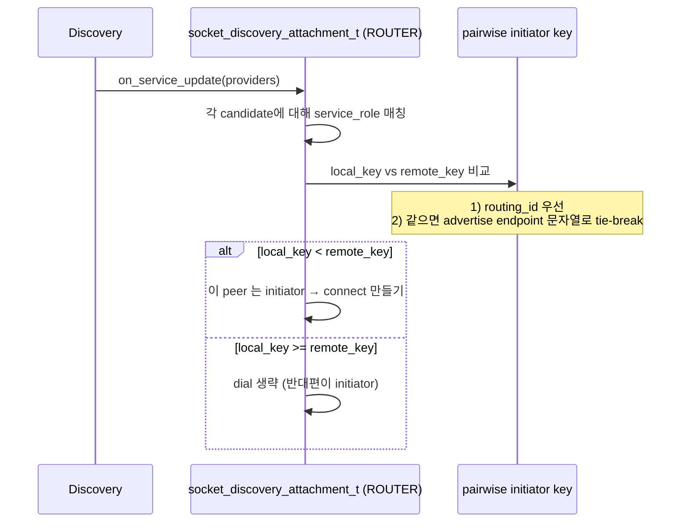

핵심 사항:

- 비교는 새 provider 후보 처리 단계에서 일어난다. 따라서 같은 pair 에 대해
  매번 같은 결론을 낸다. SERVICE_LIST 브로드캐스트로 provider 집합이 다시
  들어와도 initiator 방향이 흔들리지 않는다.
- Discovery 는 자신이 만든 outbound 연결과 상대편이 만든 inbound 연결을 별도
  항목으로 보지 않는다. 한 번의 connect 로 양방향 메시지 경로가 성립한다.
- 이 규칙은 ROUTER↔ROUTER 자동 연결에만 적용한다. PUB/SUB 같은 단방향
  pair 는 기존 역할 매칭 그대로 한쪽이 dial 하고 다른 쪽이 받는다.
- 같은 `routing_id` 를 가진 서로 다른 피어가 동시에 보이는 충돌은 이
  규칙이 해결하지 않는다. 충돌은 ROUTER handover 정책으로 처리한다.
- 사용자 raw API 로 직접 호출한 `zlink_connect()` 는 이 경로를 거치지
  않으므로 라이브러리가 중재하지 않는다.
