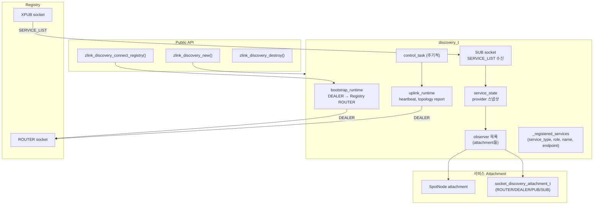
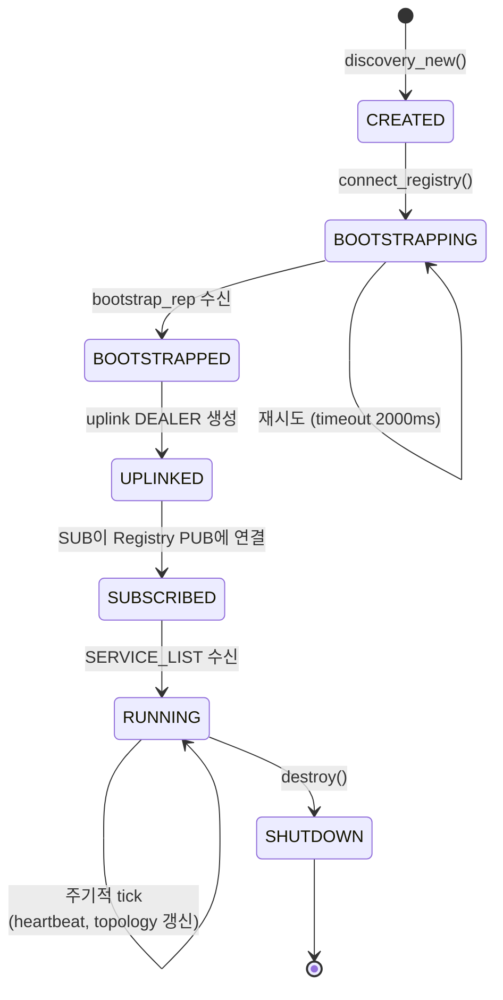
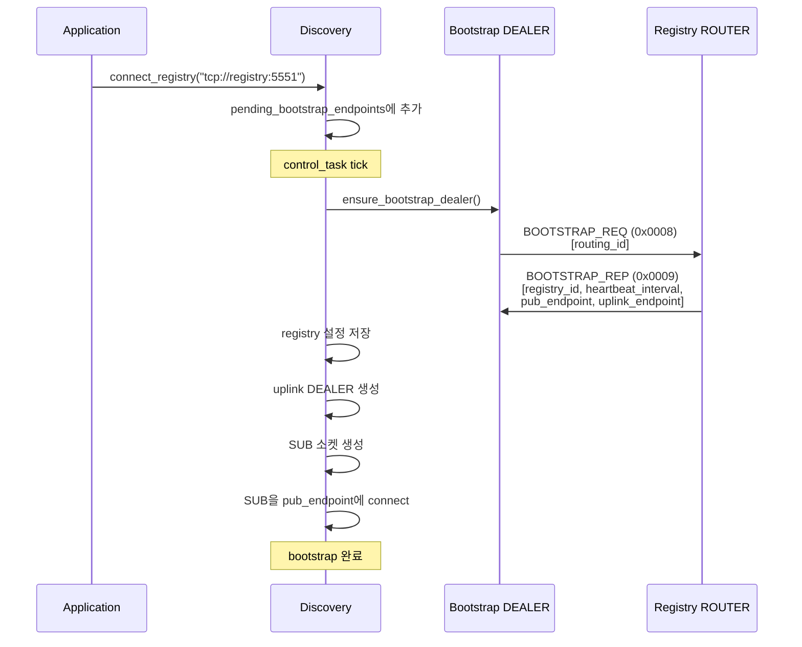
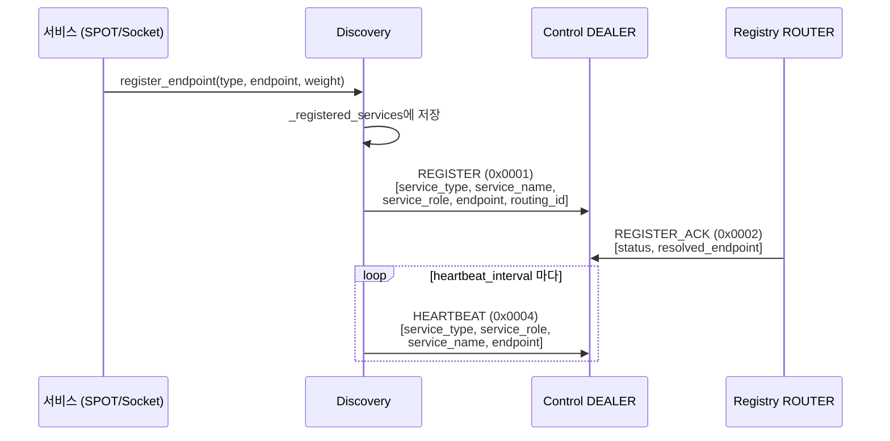
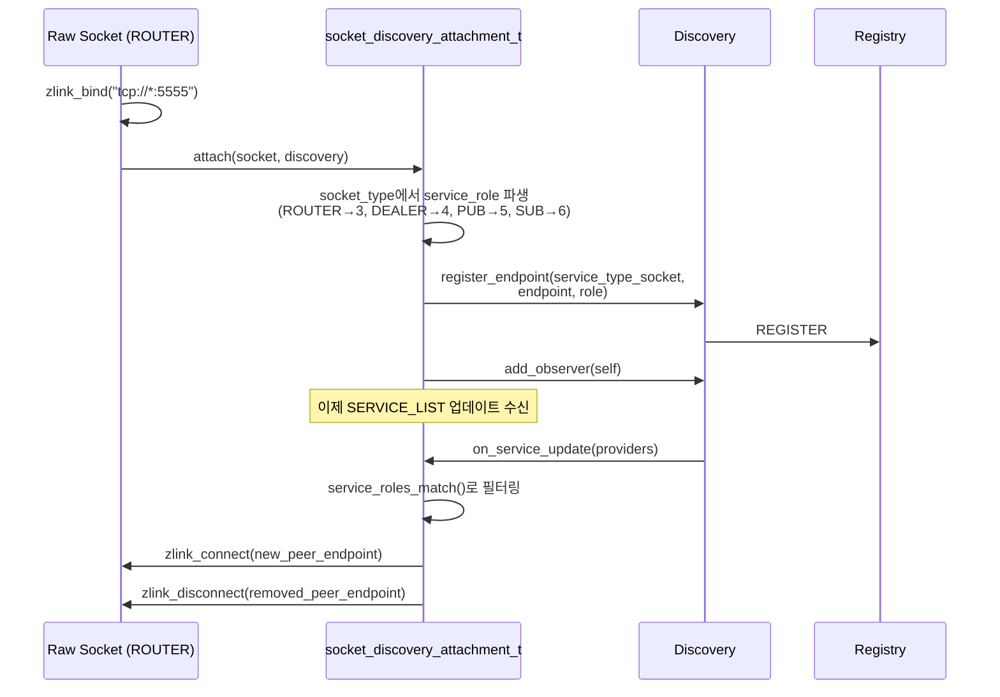
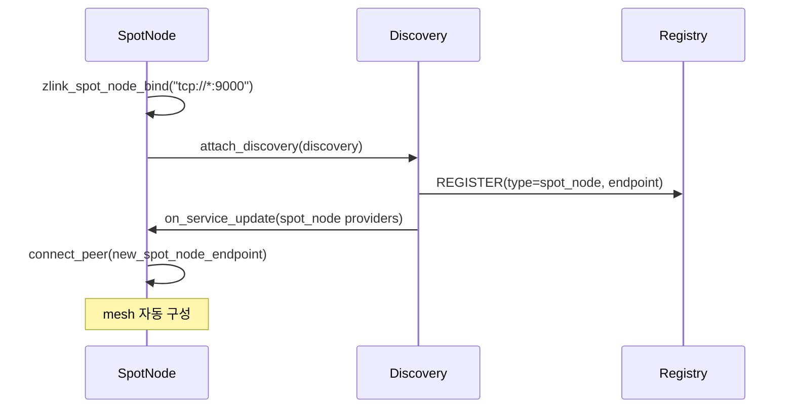
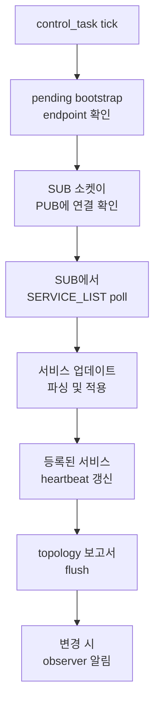
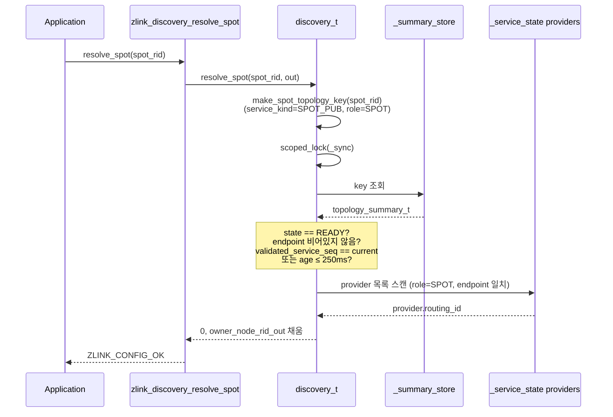
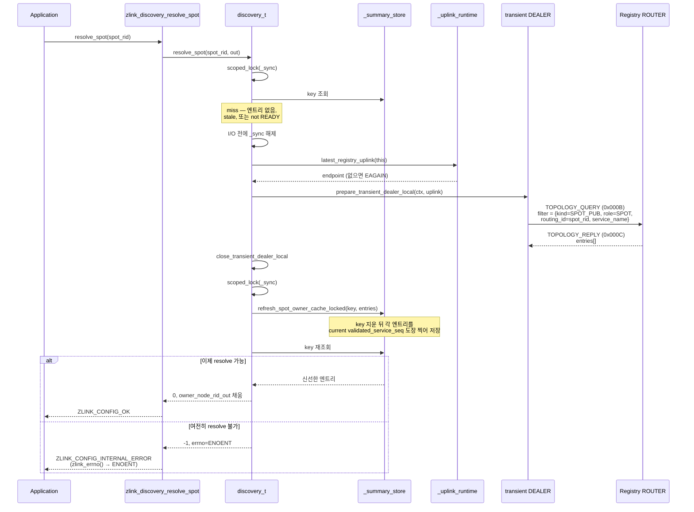
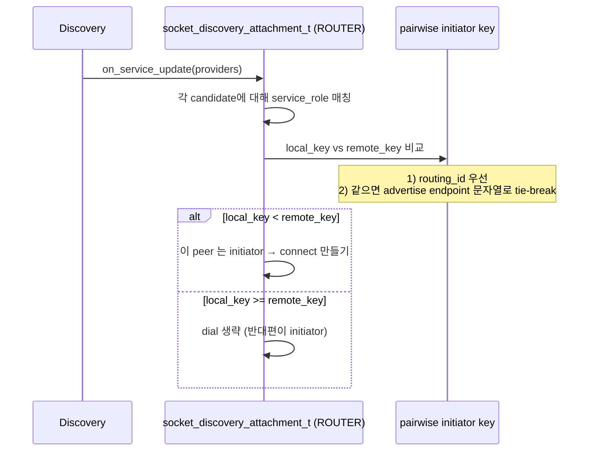

[English](discovery-internals.md) | [한국어](discovery-internals.ko.md)

# Discovery 서비스 내부 아키텍처

## 1. 컴포넌트 개요



## 2. 소켓 종류와 Endpoint

| 소켓 | 타입 | 대상 | 용도 |
|------|------|------|------|
| Bootstrap DEALER | DEALER | Registry ROUTER | 초기 등록, bootstrap 요청 |
| Topology Report DEALER | DEALER | Registry uplink | topology 상태 보고 |
| Control DEALER | DEALER | Registry uplink | heartbeat, 속성 업데이트 |
| SERVICE_LIST SUB | SUB | Registry XPUB | 서비스 목록 브로드캐스트 수신 |

모든 DEALER 소켓은 필요 시 생성되고 shutdown 시 파괴된다.

## 3. Lifecycle 상태 머신



## 4. Bootstrap 흐름



## 5. 서비스 등록 흐름



## 6. SERVICE_LIST 업데이트 흐름


### SERVICE_LIST 프레임 형식

```text
Frame 0: msg_id = 0x0005
Frame 1: registry_id (uint32_t)
Frame 2: list_seq (uint64_t)
Frame 3: service_count (uint32_t)
Frame 4~N: 서비스 항목 (반복):
  - service_type (uint16_t)
  - service_name (string)
  - provider_count (uint32_t)
  - provider별:
      service_role (uint16_t)
      endpoint (string)
      routing_id (가변)
      value (int64_t)
      metadata (가변)
```

## 7. Socket Discovery Attachment

`socket_discovery_attachment_t`는 raw 소켓을 Discovery와 통합하여
자동 peer 관리를 수행한다.



### 역할 매칭 규칙

| 소켓 타입 | Service Role | 매칭 대상 |
|-----------|-------------|----------|
| ROUTER | 3 | ROUTER (3), DEALER (4) |
| DEALER | 4 | ROUTER (3), DEALER (4) |
| PUB | 5 | SUB (6) |
| SUB | 6 | PUB (5) |
| SPOT | 2 | SPOT (2) |

### Attachment 제약

- 소켓당 바인드된 endpoint 1개만 허용
- 수동 `connect`/`disconnect`/`unbind` 차단 (Discovery 독점)
- Peer 연결은 Discovery가 전적으로 관리
- `discovery_destroy()` 시 모든 attachment에 shutdown 전파

## 8. SpotNode Attachment

SpotNode는 동일한 observer 패턴을 사용하지만:
- `service_type = service_type_spot_node (2)`
- `service_role = service_role_spot (2)` (고정)
- Peer 연결 대상은 mesh 내 다른 SpotNode



## 9. Control Task 주기



## 10. Spot 소유 노드 조회 (`zlink_discovery_resolve_spot`)

`zlink_discovery_resolve_spot(discovery, spot_rid, &owner_node_rid_out)`
는 **논리적 SPOT routing id** 를 **현재 소유 SpotNode 의 routing id** 로
매핑한다. 호출자가 `(owner_node_rid, spot_rid)` 쌍을 만들어
`zlink_spot_send_spot()` / `zlink_spot_request_spot()` 또는 router 쪽
동일 계열 API 의 destination 으로 사용할 수 있게 해주는 헬퍼다. 이 조회는
해당 Discovery 의 현재 서비스 뷰 범위에서만 유효하다.

이 API 는 **send/request destination lookup 전용**이다. reply 경로는
여전히 들어온 request 와 함께 전달된 구체적인 source 주소를 그대로 써야
한다. spot 은 노드 간 이동이 가능하고, 캐시된 owner 가 실제 request 를
보낸 그 노드라는 보장이 없기 때문이다.

### 10.1 계약 요약

`from_errno()` 는 `EINVAL`/`EFAULT`/`ENOTSUP`/`EOPNOTSUPP` 만 명명된
`zlink_config_result_t` 로 매핑한다. 그 외 errno (아래의 `ENOENT`,
`EAGAIN` 포함) 는 `default` 분기로 `ZLINK_CONFIG_INTERNAL_ERROR` 가
되고, 구체 errno 는 `zlink_errno()` 로 조회한다.

| 항목 | 값 |
|---|---|
| 선행 조건 | `discovery->_service_type == SPOT_NODE`, 아니면 `ENOTSUP` → `ZLINK_CONFIG_NOT_SUPPORTED` |
| 출력 | `owner_node_rid_out` 에 owner SpotNode rid 기록 |
| 캐시 TTL | `resolve_spot_cache_ttl_ms = 250` ms |
| 캐시 유효 조건 | `validated_service_seq == current_service_seq` 또는 `now − last_reported_ms ≤ 250 ms` |
| 미스 동작 | transient DEALER 로 Registry 조회 후 캐시 재시도 |
| 최종 미스 (cache + registry 결과 없음) | `errno = ENOENT`, 결과 = `ZLINK_CONFIG_INTERNAL_ERROR` (`zlink_errno()` 로 확인) |
| 잘못된 입력 | `EINVAL` → `ZLINK_CONFIG_INVALID_ARGUMENT` (`spot_rid` null/size 0, `owner_node_rid_out` null) |
| null handle | `EFAULT` → `ZLINK_CONFIG_INVALID_HANDLE` |
| uplink 없음 | Registry 조회 단계에서 `errno = EAGAIN`, 결과 = `ZLINK_CONFIG_INTERNAL_ERROR` |

### 10.2 캐시 hit (fast path)



### 10.3 캐시 miss (Registry 갱신)



### 10.4 캐시 신선도 규칙

두 가지 독립 조건 중 하나라도 맞으면 캐시 엔트리를 신선한 것으로 본다.

1. **Membership-seq 일치** — `validated_service_seq == _service_state.service_update_seq()`. 이 seq 는 Discovery 의 provider 뷰가 바뀔 때마다 (새 peer, peer 이탈, role 변경) 증가한다. seq 가 일치하면 이 엔트리가 현재 멤버십에서 생성된 값이므로 벽시계 나이와 관계없이 신뢰한다.
2. **벽시계 TTL** — `last_reported_ms > 0 && now − last_reported_ms ≤ 250 ms`. membership-seq 는 바뀌었지만 엔트리 자체가 아주 최근에 갱신된 경우의 fallback 으로 작동한다.

둘 다 아니면 stale 로 간주하고 Registry 왕복을 강제한다. TTL 이 250 ms 로 짧은 이유는 stale 조회가 옛 소유 노드로 오라우팅될 수 있기 때문이다. 짧은 창으로 그 위험을 제한하면서 bursty lookup 은 캐시로 흡수한다.

### 10.5 endpoint → owner rid 역변환

topology summary 에는 `endpoint` (전송 URI) 만 저장되며 owner SpotNode 의 routing id 가 직접 저장되지 않는다. 캐시 hit 후 Discovery 는 `resolve_owner_node_from_endpoint_locked(endpoint, ...)` 를 호출한다.

1. `_service_state` 에서 현재 provider 목록을 snapshot 한다.
2. `service_role == SPOT` 이고 `endpoint` 가 일치하며 `routing_id.size > 0` 인 provider 를 고른다.
3. 그 provider 의 `routing_id` 를 출력 파라미터에 복사한다.

이 2 단계 설계 덕분에 spot 의 소유 노드가 endpoint 를 바꿔도, 메시의 provider 명단이 SERVICE_LIST 브로드캐스트 경로로 따라잡혀 있기만 하면 resolve_spot 은 일관된 답을 돌려줄 수 있다.

## 11. 메시지 프로토콜

| msg_id | 이름 | 방향 | 용도 |
|--------|------|------|------|
| 0x0001 | REGISTER | DEALER→ROUTER | 서비스 등록 |
| 0x0002 | REGISTER_ACK | ROUTER→DEALER | 등록 확인 |
| 0x0003 | UNREGISTER | DEALER→ROUTER | 서비스 해제 |
| 0x000D | UNREGISTER_ACK | ROUTER→DEALER | 해제 확인 |
| 0x0004 | HEARTBEAT | DEALER→ROUTER | keep-alive |
| 0x0005 | SERVICE_LIST | PUB→SUB | 서비스 브로드캐스트 |
| 0x0007 | UPDATE_ATTRIBUTES | DEALER→ROUTER | 서비스 메타데이터 업데이트 |
| 0x0008 | BOOTSTRAP_REQ | DEALER→ROUTER | 초기 설정 요청 |
| 0x0009 | BOOTSTRAP_REP | ROUTER→DEALER | 설정 응답 |
| 0x000A | TOPOLOGY_REPORT | DEALER→ROUTER | topology 상태 보고 |
| 0x000B | TOPOLOGY_QUERY | DEALER→ROUTER | 서비스 topology 조회 (`resolve_spot` 도 사용) |
| 0x000C | TOPOLOGY_REPLY | ROUTER→DEALER | topology 조회 응답 |

## 12. ROUTER ↔ ROUTER pairwise initiator

같은 서비스의 두 ROUTER가 SERVICE_LIST를 통해 서로를 보면, Discovery는
한쪽만 outbound `connect`를 만든다. 이 결정은 `socket_discovery_attachment_t`
의 `refresh_peers()` 안에서 새 provider 후보를 처리할 때 수행된다.



핵심 포인트:

- 비교는 새 provider 후보 처리 단계에서 일어난다. 따라서 같은 pair에 대해
  매번 같은 결론을 낸다. SERVICE_LIST 브로드캐스트로 provider 집합이 다시
  들어와도 initiator 방향이 흔들리지 않는다.
- Discovery는 자신이 만든 outbound와 상대편이 만든 inbound를 별도의 entry
  로 보지 않는다. 한 번의 connect로 이미 양방향 메시지 경로가 성립한다.
- 이 규칙은 ROUTER↔ROUTER 자동 연결에만 적용한다. PUB/SUB 같은 단방향
  pair는 기존 역할 매칭 그대로 한쪽이 dial하고 다른 쪽이 받는다.
- 같은 `routing_id`를 가진 서로 다른 peer가 동시에 보이는 충돌은 이
  규칙이 해결하지 않는다. 충돌은 ROUTER handover 정책으로 처리한다.
- 사용자 raw API를 통해 직접 호출한 `zlink_connect()`는 이 경로를 거치지
  않으므로 라이브러리가 중재하지 않는다.
