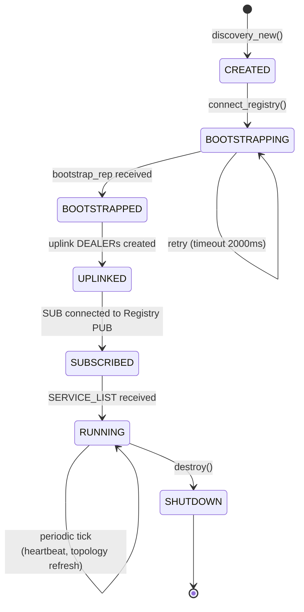
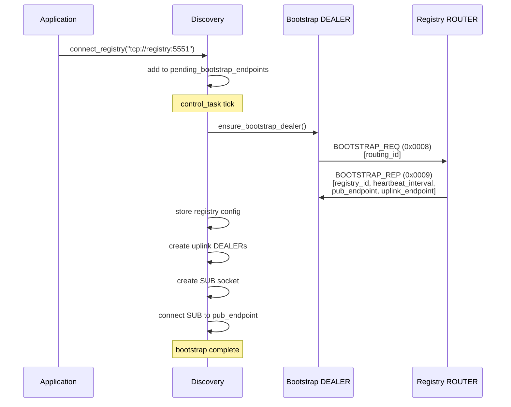
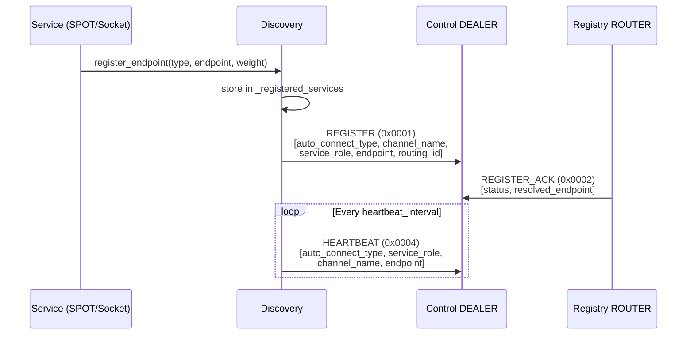
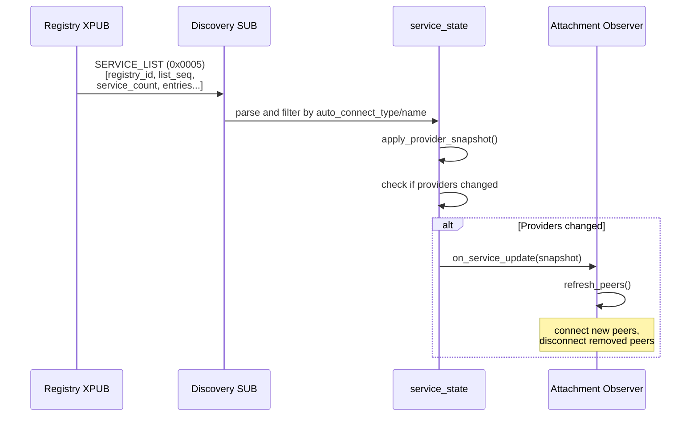
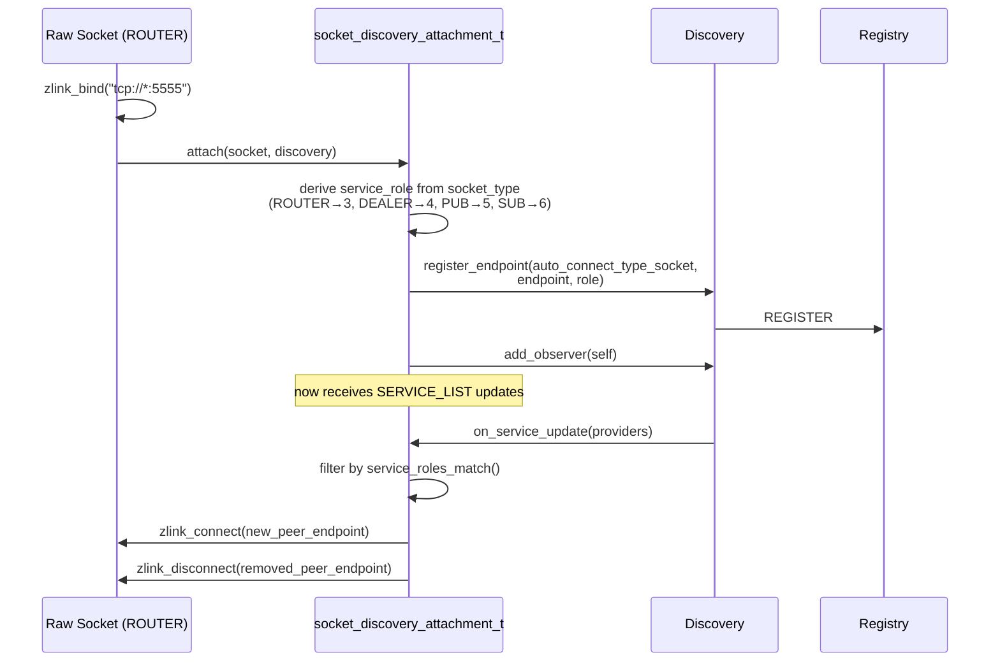
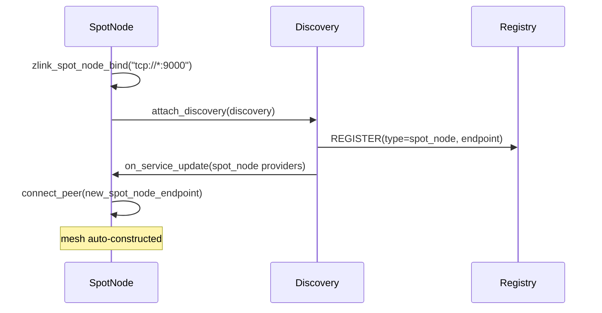
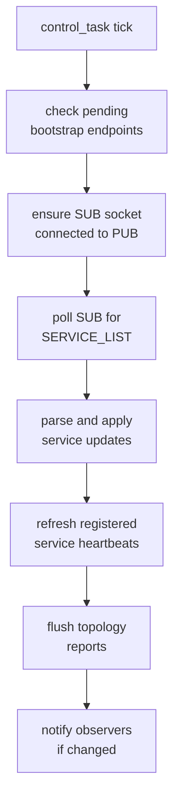
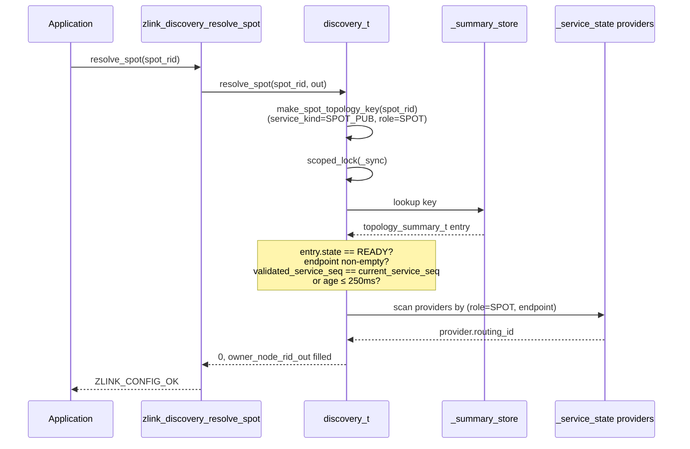
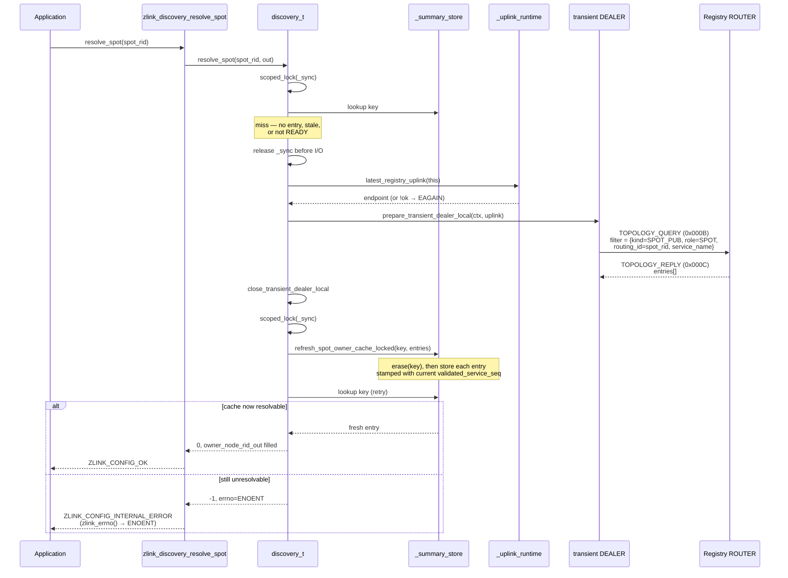
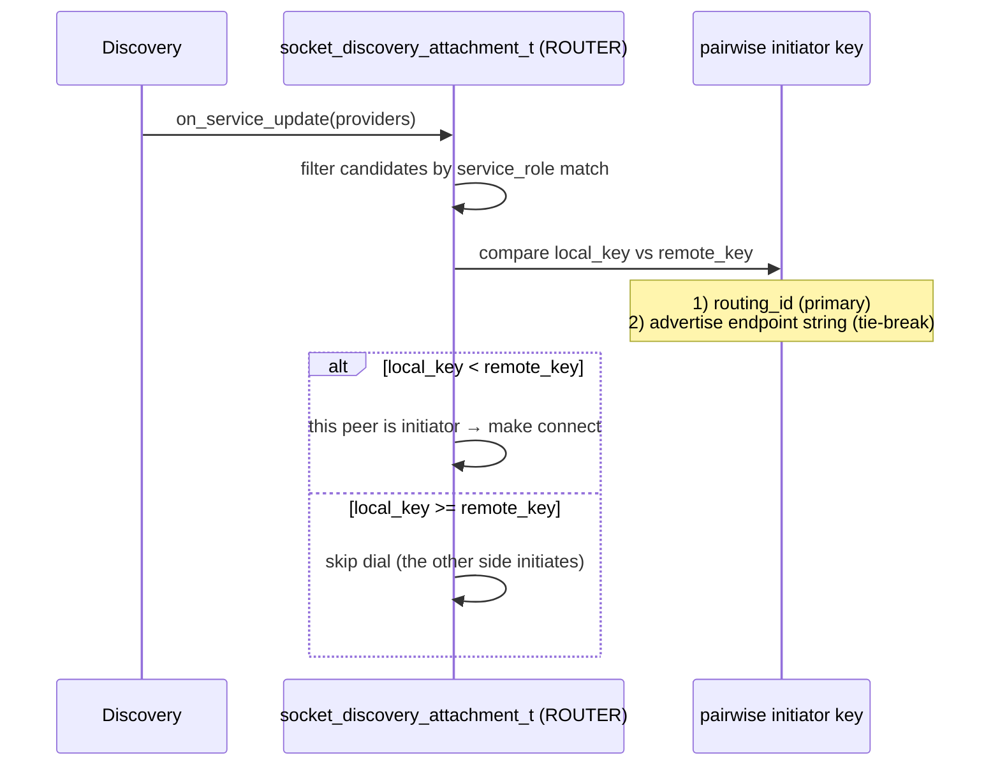

[English](discovery-internals.md) | [한국어](discovery-internals.ko.md)

# Discovery Service Internal Architecture

## 1. Component Overview


## 2. Socket Types and Endpoints

| Socket | Type | Target | Purpose |
|--------|------|--------|---------|
| Bootstrap DEALER | DEALER | Registry ROUTER | Initial registration, bootstrap request |
| Topology Report DEALER | DEALER | Registry uplink | Topology state reports |
| Control DEALER | DEALER | Registry uplink | Heartbeat, attribute updates |
| SERVICE_LIST SUB | SUB | Registry XPUB | Receive service list broadcasts |

All DEALER sockets are created on demand and destroyed on shutdown.

## 3. Lifecycle State Machine



## 4. Bootstrap Flow



## 5. Service Registration Flow



## 6. SERVICE_LIST Update Flow



### SERVICE_LIST Frame Format

```text
Frame 0: msg_id = 0x0005
Frame 1: registry_id (uint32_t)
Frame 2: list_seq (uint64_t)
Frame 3: service_count (uint32_t)
Frame 4~N: Service entries (repeated):
  - auto_connect_type (uint16_t)
  - channel_name (string)
  - contract_created_at (uint64_t)
  - provider_count (uint32_t)
  - Per provider:
      service_role (uint16_t)
      endpoint (string)
      routing_id (variable)
      source_registry (uint32_t)
      registration_id (uint64_t)
      provider_update_seq (uint64_t)
      weight (uint16_t)
      value (int64_t)
      provider_blob (variable)
```

Registry peers also receive route binding snapshots as a separate
`REGISTRY_SYNC` multipart message. Discovery subscribers ignore this message.
The Registry applies these route snapshots through a staging view: chunks must
arrive in order for the same `snapshot_seq`, and the existing materialized route
view is not changed until the last chunk commits.

```text
Frame 0: msg_id = 0x0006
Frame 1: advertising_registry (uint32_t)
Frame 2: snapshot_seq (uint64_t)
Frame 3: chunk_index (uint32_t)
Frame 4: chunk_count (uint32_t)
Frame 5: route_count (uint32_t)
Frame 6~N: Route entries (repeated):
  - channel_name (string)
  - route_kind (uint32_t)
  - route_key (variable)
  - route_value (variable)
  - owner_channel_name (string)
  - owner_service_role (uint16_t)
  - owner_routing_id_key (variable)
  - owner_source_registry (uint32_t)
  - owner_registration_id (uint64_t)
  - updated_at_ms (uint64_t)
  - owner_routing_id (variable)
```

Internally the Registry keeps route rows in two layers. The raw observation
store is keyed by `(route identity, owner identity, advertising registry)`.
The materialized route table exposes one winner per route identity for
`resolve_route()`. Reverse indexes by owner, route identity, and advertising
registry keep owner cleanup, winner recomputation, and peer timeout cleanup
proportional to the affected records instead of the total route count.

The materialized route table follows the same high-level design used by Redis
`dict`: power-of-two hash buckets, bucket masks instead of division, separate
chaining, and incremental migration from the old table to the new table during
growth. It keeps resize work spread across normal route lookups and updates, so
a large route set does not pay a single blocking resize cost. Each table entry
stores the route key once instead of duplicating the same key inside the value.
This mirrors the key/value responsibility split of Redis `dictEntry` and reduces
duplicate string storage in large route sets. Each entry node stores fixed
scalar fields, while route keys and values are appended to packed byte blocks.
Repeated channel names are interned inside the table. Owner identities are also
interned, and buckets plus node links use compact 32-bit entry ids. Entry nodes
are allocated in 65,536-entry chunks, so a large insert run does not pay for a
single vector capacity that is much larger than the live record count.

Route key and owner identity hashes use the same SipHash-family approach used
by Redis `dict`. Route snapshot chunks are read with a cursor like Redis
`dictScan`, and a rehash pause guard is held while each chunk is copied. The
Registry therefore copies only the current chunk instead of materializing the
entire route table into a temporary vector before sending a snapshot.

Provider rows use the same owner-bound rule for materialization. A provider RID
is excluded from peer/member projection when different source generations, or
the same generation with different endpoints, claim the same
`channel + role + routing_id`. Route resolve also treats such an owner as not
live.

## 7. Socket Discovery Attachment

`socket_discovery_attachment_t` integrates raw sockets with Discovery
for automatic peer management.



### Role Matching Rules

| Socket Type | Service Role | Matches With |
|-------------|-------------|-------------|
| ROUTER | 3 | ROUTER (3), DEALER (4) |
| DEALER | 4 | ROUTER (3), DEALER (4) |
| PUB | 5 | SUB (6) |
| SUB | 6 | PUB (5) |
| SPOT | 2 | SPOT (2) |

### Attachment Constraints

- Only one bound endpoint allowed per socket
- Manual `connect`/`disconnect`/`unbind` blocked (Discovery-exclusive)
- Peer connections fully managed by Discovery
- Shutdown cascades from `discovery_destroy()` to all attachments

## 8. SPOT Node Attachment

SpotNode uses the same observer pattern but with:
- `auto_connect_type = auto_connect_type_spot_node (2)`
- `service_role = service_role_spot (2)` (fixed)
- Peer connections target other SpotNodes in the mesh



## 9. Control Task Cycle



## 10. Spot Ownership Resolution (`zlink_discovery_resolve_spot`)

`zlink_discovery_resolve_spot(discovery, spot_rid, &owner_node_rid_out)`
maps a **logical SPOT routing id** to the **current owner SpotNode
routing id**, so that the caller can pair `(owner_node_rid, spot_rid)`
for the ROUTER-side direct functions (`zlink_router_send_spot()` /
`zlink_router_request_spot()`). The lookup is scoped to the Discovery's current
service view.

Publishing SPOT owner topology rows to Registry is controlled by
`ZLINK_OPT_DISCOVERY_SPOT_OWNER_SYNC`. The default is `0`. Attaching a SpotNode
to Discovery does not uplink its `spot_rid -> owner node` summary while this
option is disabled. Only a publishing-side Discovery with the option set to
`1` uplinks owner rows.

The helper is for **send/request destination lookup only**. Reply paths
must continue to use the concrete source addresses delivered with the
incoming request — a spot may move between nodes and the cached owner
may no longer match the sender of the request being replied to.

### 10.1 Contract summary

`from_errno()` maps `EINVAL`/`EFAULT`/`ENOTSUP`/`EOPNOTSUPP` to named
`zlink_config_result_t` values; every other `errno` (including `ENOENT`
and `EAGAIN` below) falls through to `ZLINK_CONFIG_INTERNAL_ERROR` and is
recoverable via `zlink_errno()`.

| Aspect | Value |
|---|---|
| Precondition | `discovery->_auto_connect_type == SPOT_NODE`; otherwise `ENOTSUP` → `ZLINK_CONFIG_NOT_SUPPORTED` |
| Output | `owner_node_rid_out` populated with the owner SpotNode's rid |
| Registry publish condition | Publishing Discovery has `ZLINK_OPT_DISCOVERY_SPOT_OWNER_SYNC == 1`; default is `0` |
| Cache TTL | `resolve_spot_cache_ttl_ms = 250` ms |
| Cache validity rule | `validated_service_seq == current_service_seq` OR `now − last_reported_ms ≤ 250 ms` |
| Miss outcome | Registry query over a transient DEALER, then retry cache |
| Final miss (cache + registry empty) | `errno = ENOENT`, result = `ZLINK_CONFIG_INTERNAL_ERROR` (inspect via `zlink_errno()`) |
| Bad input | `EINVAL` → `ZLINK_CONFIG_INVALID_ARGUMENT` (null or zero-size `spot_rid`, null `owner_node_rid_out`) |
| Null handle | `EFAULT` → `ZLINK_CONFIG_INVALID_HANDLE` |
| No uplink yet | `errno = EAGAIN` from the registry query step, result = `ZLINK_CONFIG_INTERNAL_ERROR` |

### 10.2 Cache-hit path (fast path)



### 10.3 Cache-miss path (registry refresh)



### 10.4 Cache freshness rules

Two independent conditions keep a cache entry usable:

1. **Membership-seq match** — `validated_service_seq == _service_state.service_update_seq()`. This seq bumps whenever Discovery's provider view changes (new peer, peer left, role change). If the seq matches, the cache entry was produced against the current membership and is trusted regardless of wall-clock age.
2. **Wall-clock TTL** — `last_reported_ms > 0 && now − last_reported_ms ≤ 250 ms`. Acts as a fallback when the membership-seq moved but the entry itself was refreshed very recently.

If neither holds, the entry is treated as potentially stale and a registry round-trip is forced. The TTL is deliberately small (250 ms) because a stale lookup can misroute to a former owner node; a short window limits that exposure while still absorbing bursty lookups.

### 10.5 Endpoint → owner rid resolution

The topology summary stores `endpoint` (transport URI), not the owner SpotNode's routing id directly. After a cache hit, Discovery calls `resolve_owner_node_from_endpoint_locked(endpoint, ...)` which:

1. Snapshots the current provider list from `_service_state`.
2. Picks the provider whose `service_role == SPOT` and `endpoint` matches and has a non-empty `routing_id`.
3. Copies that `routing_id` into the output parameter.

This two-step design means resolve_spot can answer consistently even when a spot's owner node changes endpoint, as long as the mesh's provider roster has caught up through the SERVICE_LIST broadcast path.

## 11. Message Protocol

| msg_id | Name | Direction | Purpose |
|--------|------|-----------|---------|
| 0x0001 | REGISTER | DEALER→ROUTER | Register service |
| 0x0002 | REGISTER_ACK | ROUTER→DEALER | Registration confirmation |
| 0x0003 | UNREGISTER | DEALER→ROUTER | Remove service |
| 0x000D | UNREGISTER_ACK | ROUTER→DEALER | Removal confirmation |
| 0x0004 | HEARTBEAT | DEALER→ROUTER | Keep-alive |
| 0x0005 | SERVICE_LIST | PUB→SUB | Service broadcast |
| 0x0006 | REGISTRY_SYNC | PUB→SUB | Registry peer route binding snapshot |
| 0x0007 | UPDATE_ATTRIBUTES | DEALER→ROUTER | Update service attributes |
| 0x0008 | BOOTSTRAP_REQ | DEALER→ROUTER | Initial config request |
| 0x0009 | BOOTSTRAP_REP | ROUTER→DEALER | Config response |
| 0x000A | TOPOLOGY_REPORT | DEALER→ROUTER | Topology state report |
| 0x000B | TOPOLOGY_QUERY | DEALER→ROUTER | Query service topology (also used by `resolve_spot`) |
| 0x000C | TOPOLOGY_REPLY | ROUTER→DEALER | Topology query response |
| 0x000E | BIND_ROUTE | DEALER→ROUTER | Bind owner-bound route |
| 0x000F | UNBIND_ROUTE | DEALER→ROUTER | Remove owner-bound route |
| 0x0010 | RESOLVE_ROUTE | DEALER→ROUTER | Resolve owner-bound route |
| 0x0011 | RESOLVE_ROUTE_REPLY | ROUTER→DEALER | Route resolve result |

## 12. ROUTER ↔ ROUTER pairwise initiator

When two ROUTERs in the same service see each other through SERVICE_LIST,
Discovery generates an outbound `connect` from only one side. The decision
runs inside `socket_discovery_attachment_t::refresh_peers()` while it
processes new provider candidates.



Key points:

- The comparison runs while processing new provider candidates, so it
  produces the same result for any given pair on every refresh. SERVICE_LIST
  broadcasts that re-deliver the provider set do not flap the initiator
  direction.
- Discovery does not bookkeep its own outbound and the peer's inbound as
  separate entries. A single connect already provides the bidirectional
  message path.
- The rule applies to ROUTER↔ROUTER auto-connect only. Asymmetric pairs
  such as PUB/SUB keep the existing role match: one side dials, the other
  receives.
- Distinct peers that happen to share the same `routing_id` are not
  resolved by this rule; that case is handled by the existing ROUTER
  handover policy.
- Manual `zlink_connect()` calls made through the raw API bypass this
  path, so the library does not mediate them.
