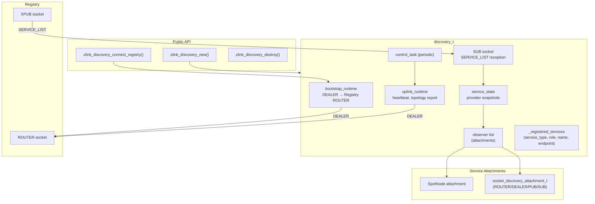
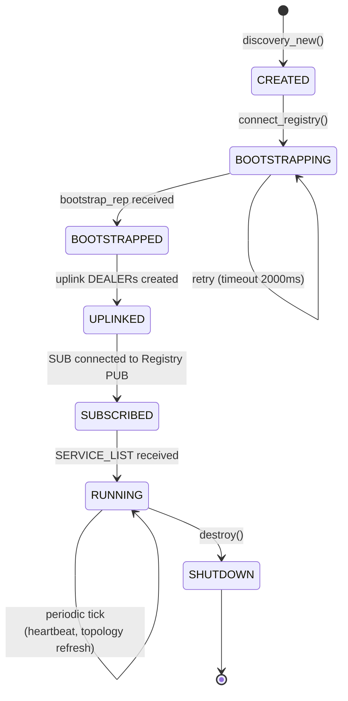
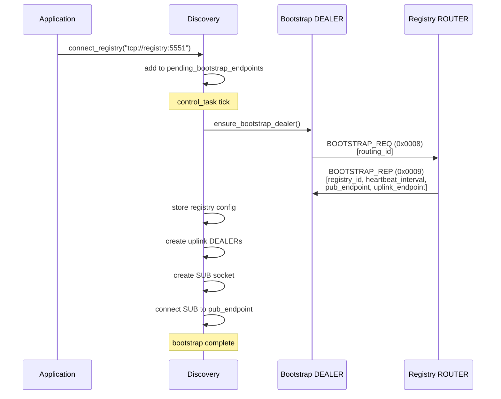
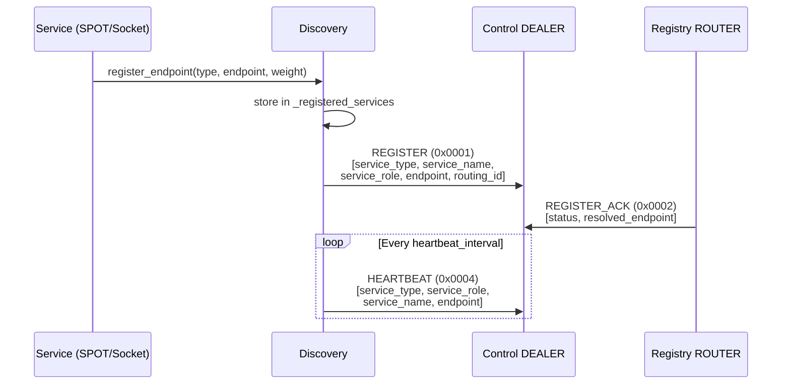
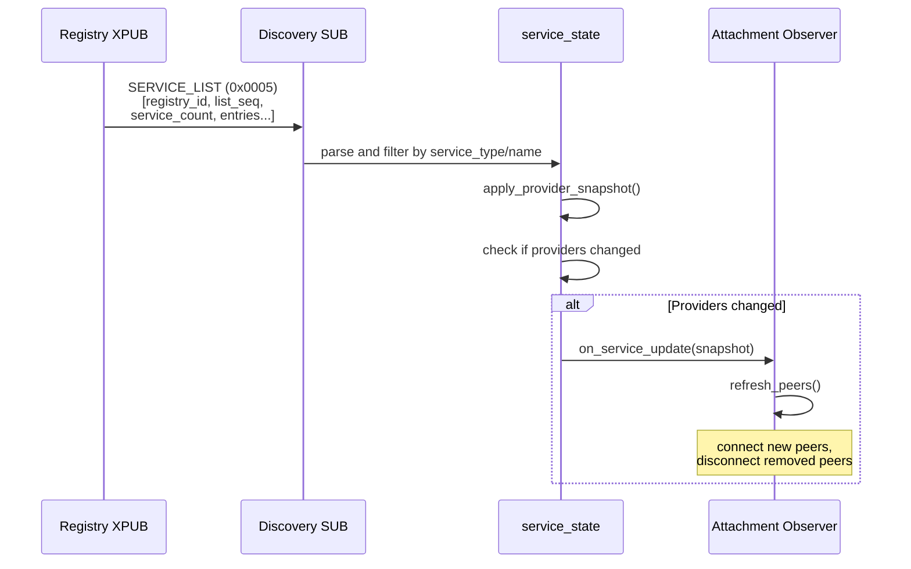
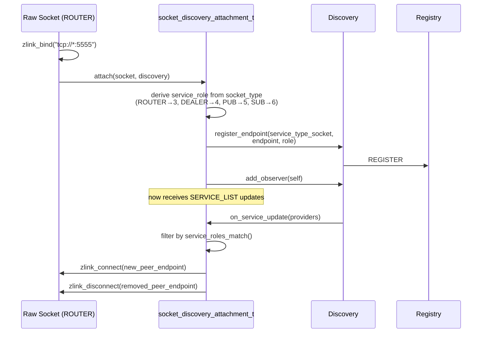
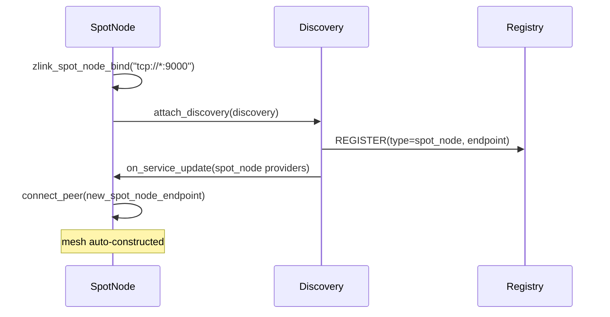
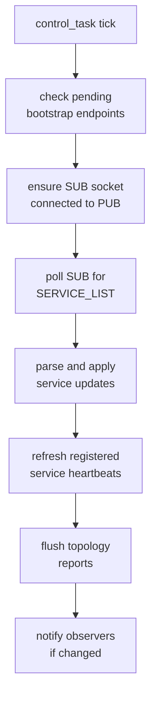

[English](discovery-internals.md) | [한국어](discovery-internals.ko.md)

# Discovery Service Internal Architecture

## 1. Component Overview



## 2. Socket Types and Endpoints

| Socket | Type | Target | Purpose |
|--------|------|--------|---------|
| Bootstrap DEALER | DEALER | Registry ROUTER | Initial registration, bootstrap request |
| Topology Report DEALER | DEALER | Registry uplink | Topology state reports |
| Control DEALER | DEALER | Registry uplink | Heartbeat, attribute updates |
| SERVICE_LIST SUB | SUB | Registry XPUB | Receive service list broadcasts |

All DEALER sockets are created on demand and destroyed on shutdown.

## 3. Lifecycle State Machine



## 4. Bootstrap Flow



## 5. Service Registration Flow



## 6. SERVICE_LIST Update Flow



### SERVICE_LIST Frame Format

```text
Frame 0: msg_id = 0x0005
Frame 1: registry_id (uint32_t)
Frame 2: list_seq (uint64_t)
Frame 3: service_count (uint32_t)
Frame 4~N: Service entries (repeated):
  - service_type (uint16_t)
  - service_name (string)
  - provider_count (uint32_t)
  - Per provider:
      service_role (uint16_t)
      endpoint (string)
      routing_id (variable)
      value (int64_t)
      metadata (variable)
```

## 7. Socket Discovery Attachment

`socket_discovery_attachment_t` integrates raw sockets with Discovery
for automatic peer management.



### Role Matching Rules

| Socket Type | Service Role | Matches With |
|-------------|-------------|-------------|
| ROUTER | 3 | ROUTER (3), DEALER (4) |
| DEALER | 4 | ROUTER (3), DEALER (4) |
| PUB | 5 | SUB (6) |
| SUB | 6 | PUB (5) |
| SPOT | 2 | SPOT (2) |

### Attachment Constraints

- Only one bound endpoint allowed per socket
- Manual `connect`/`disconnect`/`unbind` blocked (Discovery-exclusive)
- Peer connections fully managed by Discovery
- Shutdown cascades from `discovery_destroy()` to all attachments

## 8. SPOT Node Attachment

SpotNode uses the same observer pattern but with:
- `service_type = service_type_spot_node (2)`
- `service_role = service_role_spot (2)` (fixed)
- Peer connections target other SpotNodes in the mesh



## 9. Control Task Cycle



## 10. Message Protocol

| msg_id | Name | Direction | Purpose |
|--------|------|-----------|---------|
| 0x0001 | REGISTER | DEALER→ROUTER | Register service |
| 0x0002 | REGISTER_ACK | ROUTER→DEALER | Registration confirmation |
| 0x0003 | UNREGISTER | DEALER→ROUTER | Remove service |
| 0x000D | UNREGISTER_ACK | ROUTER→DEALER | Removal confirmation |
| 0x0004 | HEARTBEAT | DEALER→ROUTER | Keep-alive |
| 0x0005 | SERVICE_LIST | PUB→SUB | Service broadcast |
| 0x0007 | UPDATE_ATTRIBUTES | DEALER→ROUTER | Update service metadata |
| 0x0008 | BOOTSTRAP_REQ | DEALER→ROUTER | Initial config request |
| 0x0009 | BOOTSTRAP_REP | ROUTER→DEALER | Config response |
| 0x000A | TOPOLOGY_REPORT | DEALER→ROUTER | Topology state report |
| 0x000B | TOPOLOGY_QUERY | DEALER→ROUTER | Query service topology |
| 0x000C | TOPOLOGY_REPLY | ROUTER→DEALER | Topology query response |
