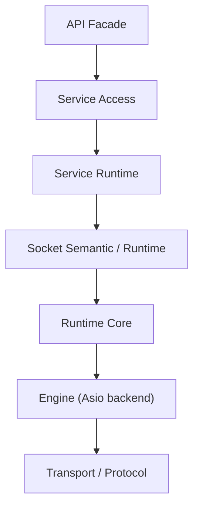

[English](posd-module-structure.md) | [한국어](posd-module-structure.ko.md)

# zlink POSD 모듈 구조

> 이 문서는 `core/` 내부 구조를 설명한다.
> 공개 C API (`core/include/zlink.h`)와 bindings 계약은 유지되며,
> 이 문서가 설명하는 것은 그 뒤의 내부 모듈 경계와 소유권이다.

## 1. 설계 원칙

내부 구조는 POSD(Philosophy of Software Design) 원칙을 따른다.

- **Deep Module**: 각 모듈은 넓은 기능을 좁은 인터페이스 뒤에 숨긴다
- **정보 은닉**: 계층 간 지식 누수를 최소화한다
- **변경 증폭 억제**: 하나의 변경이 넓게 번지지 않는 구조를 유지한다
- **공개 표면 유지**: `core/include/zlink.h`의 C API/ABI 계약은 깨지지 않는다

## 2. 계층 구조

```mermaid
flowchart TB
    subgraph Callers ["Bindings / C Callers"]
        zlink_h["core/include/zlink.h"]
    end

    subgraph API ["API Facade (core/src/api/)"]
        context_api["context_api"]
        socket_api["socket_api · socket_message_api"]
        message_api["message_api"]
        service_api["service_api · service_*_api"]
        monitor_api["monitor_api · monitor_*_api"]
        poller_api["poller_api"]
        zlink_option["zlink_option · zlink_option_*_api"]
    end

    subgraph SAL ["Service Access Layer"]
        discovery_access["discovery_access_t"]
        registry_access["registry_access_t"]
        registry_query_access["registry_query_access_t"]
        spot_node_access["spot_node_access_t"]
        spot_subject_access["spot_subject_access_t"]
    end

    subgraph SvcRT ["Service Runtime"]
        direction LR
        discovery_rt["Discovery: bootstrap · state · update · uplink · registry_client"]
        spot_rt["SPOT: node · pub · sub · data_plane · handle · runtime"]
        common_rt["Common: runtime_base · api_guard · monitor · bridge"]
    end

    subgraph SocketRT ["Socket Semantic / Runtime (core/src/sockets/)"]
        families["Families: pair · pub · sub · xpub · xsub · dealer · router · stream"]
        base["Base: socket_base · api · dispatch · endpoint · lifecycle · monitor · msg · routing"]
        runtime["Runtime: socket_runtime · socket_close_ops"]
    end

    subgraph Core ["Runtime Core (core/src/core/)"]
        core_mods["ctx · own · reaper · mailbox · pipe"]
        multipart["multipart_send_txn"]
        options["options · options_dispatch · core_socket · transport_network · protocol_metadata"]
        send_recv["send_internal · recv_internal"]
        session["session_base · socket_poller"]
    end

    subgraph Engine ["Engine (core/src/engine/)"]
        asio["asio/ — Boost.Asio poller, io_context, mailbox execution"]
    end

    subgraph TP ["Transport / Protocol"]
        protocol["Protocol: raw · zmp · metadata"]
        transport["Transport: tcp · ipc · tls · ws · pgm"]
    end

    Callers --> API
    API --> SAL
    SAL --> SvcRT
    SvcRT --> SocketRT
    SocketRT --> Core
    Core --> Engine
    Engine --> TP
```



## 3. 계층별 역할

### 3.1 API Facade (`core/src/api/`)

| 파일 그룹 | 역할 |
|-----------|------|
| `context_api.cpp` | context lifecycle (new/term/shutdown/set/get) |
| `socket_api.cpp`, `socket_message_api.cpp` | socket 생성, bind/connect, send/recv |
| `message_api.cpp` | message lifecycle |
| `service_api.cpp`, `service_*_api.cpp` | service lifecycle, mode transition, handler registration |
| `monitor_api.cpp`, `monitor_*_api.cpp` | socket/service monitor open, recv, handler |
| `poller_api.cpp` | poller operations |
| `zlink_option.cpp`, `zlink_option_*_api.cpp` | option set/get dispatch |

API facade의 규칙:

**남아도 되는 것:**
- handle validation
- per-handle admission/lifetime guard
- per-handle API 진입/닫힘 조정

**하위로 내려야 하는 것:**
- monitor event wire decode
- protocol parsing
- concrete service/socket branching
- service-wide registry/table

`service_api_internal.hpp`가 API 계층과 service access layer 사이의 내부 계약을 정의한다.

### 3.2 Service Access Layer

각 서비스가 제공하는 service-local seam. API 계층이 concrete service 구현을 직접 알지 않게 한다.

| Access Seam | 위치 | 역할 |
|-------------|------|------|
| `discovery_access_t` | `services/discovery/` | Discovery lifecycle, connect_registry, option, monitor |
| `registry_access_t` | `services/discovery/` | Registry lifecycle, bind, config, snapshot/query |
| `registry_query_access_t` | `services/discovery/` | 원격 Registry topology query |
| `spot_node_access_t` | `services/spot/` | SpotNode lifecycle, bind, discovery attach |
| `spot_subject_access_t` | `services/spot/` | publish, subscribe, option, handler, monitor, type casting |

`service_public_api_guard_t`는 모든 서비스에 공통되는 admission/close guard이다.
callback 모드 추적, destroy 시 `EBUSY`/`ESHUTDOWN` lifecycle gate를 제공한다.

### 3.3 Service Runtime

각 서비스의 concrete 구현. 공통 기반은 `services/common/`에 있다.

**SPOT** (`services/spot/`):

| 모듈 | 역할 |
|------|------|
| `spot_node.cpp/hpp` | SpotNode orchestration, discovery integration |
| `spot_handle.hpp` | 공개 spot handle 구조체 (tag validation, pub/sub 참조) |
| `spot_pub.cpp/hpp` | publish 경로 |
| `spot_sub.cpp/hpp` | subscribe 경로 |
| `spot_sub_option.cpp` | sub 측 option 처리 |
| `spot_sub_recv.cpp` | sub 측 recv 처리 |
| `spot_data_plane.cpp` | data plane 코어 |
| `spot_data_plane_forwarding.cpp` | ingress/egress 메시지 포워딩 |
| `spot_data_plane_protocol.cpp` | 제어 메시지, 구독 업데이트 |
| `spot_data_plane_internal.hpp` | data plane 내부 state/protocol 정의 |
| `spot_subject_access.cpp/hpp` | subject-level API seam |
| `spot_runtime.cpp/hpp` | runtime lifecycle |

**Discovery** (`services/discovery/`):

| 모듈 | 역할 |
|------|------|
| `discovery.cpp/hpp` | 메인 coordinator |
| `discovery_access.cpp/hpp` | API seam |
| `discovery_bootstrap.cpp` | Registry bootstrap 연결 |
| `discovery_state.cpp` | 로컬 서비스 디렉터리 상태 |
| `discovery_update.cpp` | 서비스 목록 업데이트 처리 |
| `discovery_uplink.cpp` | Registry uplink/heartbeat |
| `discovery_registry_client.cpp` | Registry 프로토콜 클라이언트 |
| `discovery_protocol.hpp` | 프로토콜 상수, 메시지 타입, 직렬화 헬퍼 |
| `discovery_owned_service.hpp` | discovery 소유 서비스 등록 편의 inline API |
| `socket_discovery_attachment.cpp/hpp` | 소켓 측 통합: attach, 등록, 피어 갱신, lifecycle |
| `registry_access.cpp/hpp` | Registry 서비스 API seam |
| `registry_query_access.cpp/hpp` | 원격 Registry query API seam |

### 3.4 Socket Semantic/Runtime (`core/src/sockets/`)

`socket_base_t`는 socket family semantic의 entrypoint로 남고,
공통 기계 작업은 별도 runtime component로 분리되어 있다.

| 파일 | 역할 |
|------|------|
| `socket_base.cpp/hpp` | semantic entrypoint, family virtual dispatch |
| `socket_base_api.cpp` | 공개 API 위임 처리 |
| `socket_base_dispatch.cpp` | callback/handler dispatch |
| `socket_base_endpoint.cpp` | endpoint bookkeeping |
| `socket_base_lifecycle.cpp` | lifecycle/close 관리 |
| `socket_base_monitor.cpp` | monitor event emission |
| `socket_base_msg.cpp` | message send/recv 기계 작업 |
| `socket_base_routing.cpp` | routing_id 처리 |
| `socket_runtime.cpp/hpp` | runtime component aggregation |
| `socket_close_ops.cpp/hpp` | close/wait helper contract |

Family 구현 (pair, pub, sub, xpub, xsub, dealer, router, stream)은
routing/subscription/load-balancing 의미에 집중하고,
runtime internal field를 직접 참조하지 않는다.

### 3.5 Runtime Core (`core/src/core/`)

#### Options Dispatch

Option은 세 카테고리로 분류되어 각 도메인 소유자가 validation/apply를 담당한다.

| 카테고리 | 파일 | 대표 옵션 |
|----------|------|-----------|
| Core Socket | `options_core_socket.cpp` | SNDHWM, RCVHWM, LINGER, ROUTING_ID, SNDTIMEO, RCVTIMEO |
| Transport/Network | `options_transport_network.cpp` | RATE, RECOVERY_IVL, SNDBUF, RCVBUF, TOS, PRIORITY |
| Protocol/Metadata | `options_protocol_metadata.cpp` | ZMP 프로토콜 메타데이터 |

`options_dispatch.cpp`가 공개 `setsockopt/getsockopt` 호출을 카테고리별 handler로 라우팅한다.
`options_dispatch_internal.hpp`가 template 유틸리티와 dispatch 함수 선언을 제공한다.

#### Logical Multipart Send

`multipart_send_txn.cpp/hpp`는 `zlink_send`와 `spot publish`가 공통으로
사용하는 logical multipart send 모듈이다.

- nonblocking: one-shot 시도 + partial local state rollback
- blocking: `sndtimeo` deadline까지 whole-message retry
- 재시도 대상: `EAGAIN`, `EINTR`만. 그 외 오류는 즉시 실패
- `libzmq`의 `pipe/router/xpub/dist` lower layer rollback/HWM semantics를 재사용

## 4. 의존 방향



금지 방향:
- API가 service concrete type detail을 직접 많이 아는 것
- service가 socket close/wait mechanics를 재구현하는 것
- transport/protocol detail이 API 계층까지 새는 것

## 5. 소스 트리 요약

```
core/src/
  api/           76 files — C API facade (split by concern)
  core/          76 files — runtime core, options dispatch, multipart send
  engine/asio/   — Boost.Asio execution backbone
  sockets/       47 files — socket families + base runtime components
  protocol/      — raw/zmp/metadata
  services/
    common/      10 files — service_runtime_base, service_public_api_guard
    control/      2 files — service control runtime
    discovery/   31 files — discovery + registry access + socket attachment
    spot/        52 files — node/pub/sub/data_plane/handle/subject_access
  transports/    — tcp/ipc/tls/ws/pgm
  utils/         — domain-agnostic utilities
```
