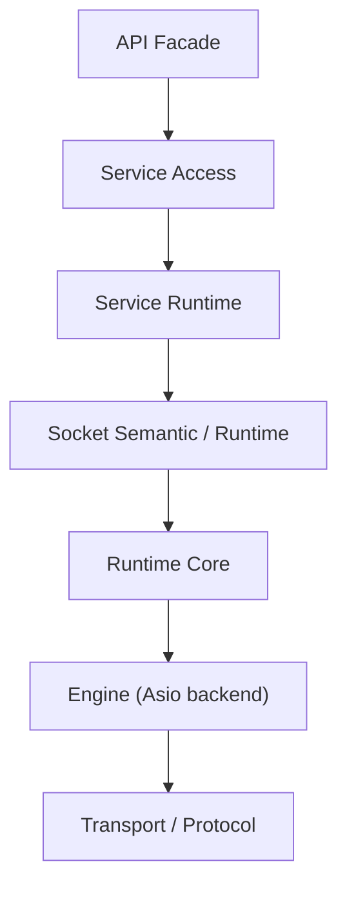

[English](posd-module-structure.md) | [한국어](posd-module-structure.ko.md)

# zlink POSD Module Structure

> This document describes the internal structure of `core/`.
> The public C API (`core/include/zlink.h`) and bindings contract are
> preserved; what this document describes is the internal module
> boundaries and ownership behind them.

## 1. Design Principles

The internal structure follows POSD (Philosophy of Software Design)
principles:

- **Deep Module**: Each module hides broad functionality behind a narrow interface
- **Information hiding**: Minimize knowledge leakage between layers
- **Change amplification suppression**: Maintain a structure where a single change does not spread widely
- **Public surface preservation**: The C API/ABI contract in `core/include/zlink.h` is never broken

## 2. Layer Structure

```mermaid
flowchart TB
    subgraph Callers ["Bindings / C Callers"]
        zlink_h["core/include/zlink.h"]
    end

    subgraph API ["API Facade (core/src/api/)"]
        context_api["context_api"]
        socket_api["socket_api · socket_message_api"]
        message_api["message_api"]
        service_api["service_api · service_*_api"]
        monitor_api["monitor_api · monitor_*_api"]
        poller_api["poller_api"]
        zlink_option["zlink_option · zlink_option_*_api"]
    end

    subgraph SAL ["Service Access Layer"]
        discovery_access["discovery_access_t"]
        registry_access["registry_access_t"]
        registry_query_access["registry_query_access_t"]
        spot_node_access["spot_node_access_t"]
        spot_subject_access["spot_subject_access_t"]
    end

    subgraph SvcRT ["Service Runtime"]
        direction LR
        discovery_rt["Discovery: bootstrap · state · update · uplink · registry_client"]
        spot_rt["SPOT: node · pub · sub · data_plane · handle · runtime"]
        common_rt["Common: runtime_base · api_guard · monitor · bridge"]
    end

    subgraph SocketRT ["Socket Semantic / Runtime (core/src/sockets/)"]
        families["Families: pair · pub · sub · xpub · xsub · dealer · router · stream"]
        base["Base: socket_base · api · dispatch · endpoint · lifecycle · monitor · msg · routing"]
        runtime["Runtime: socket_runtime · socket_close_ops"]
    end

    subgraph Core ["Runtime Core (core/src/core/)"]
        core_mods["ctx · own · reaper · mailbox · pipe"]
        multipart["multipart_send_txn"]
        options["options · options_dispatch · core_socket · transport_network · protocol_metadata"]
        send_recv["send_internal · recv_internal"]
        session["session_base · socket_poller"]
    end

    subgraph Engine ["Engine (core/src/engine/)"]
        asio["asio/ — Boost.Asio poller, io_context, mailbox execution"]
    end

    subgraph TP ["Transport / Protocol"]
        protocol["Protocol: raw · zmp · metadata"]
        transport["Transport: tcp · ipc · tls · ws · pgm"]
    end

    Callers --> API
    API --> SAL
    SAL --> SvcRT
    SvcRT --> SocketRT
    SocketRT --> Core
    Core --> Engine
    Engine --> TP
```



## 3. Layer Roles

### 3.1 API Facade (`core/src/api/`)

| File Group | Role |
|------------|------|
| `context_api.cpp` | Context lifecycle (new/term/shutdown/set/get) |
| `socket_api.cpp` · `socket_message_api.cpp` | Socket creation, bind/connect, send/recv |
| `message_api.cpp` | Message lifecycle |
| `service_api.cpp` · `service_*_api.cpp` | Service lifecycle, mode transition, handler registration |
| `monitor_api.cpp` · `monitor_*_api.cpp` | Socket/service monitor open, recv, handler |
| `poller_api.cpp` | Poller operations |
| `zlink_option.cpp` · `zlink_option_*_api.cpp` | Option set/get dispatch |

API facade rules:
- **Allowed to remain**: handle validation, per-handle admission/lifetime guard, per-handle API entry/close coordination
- **Must move down**: monitor event wire decode, protocol parsing, concrete service/socket branching, service-wide registry/table

`service_api_internal.hpp` defines the internal contract between the API layer and the service access layer.

### 3.2 Service Access Layer

Service-local seam provided by each service. Prevents the API layer from knowing concrete service implementations.

| Access Seam | Location | Role |
|-------------|----------|------|
| `discovery_access_t` | `services/discovery/discovery_access.hpp` | Discovery lifecycle, connect_registry, option, monitor |
| `registry_access_t` | `services/discovery/registry_access.hpp` | Registry lifecycle, bind, config, snapshot/query |
| `registry_query_access_t` | `services/discovery/registry_query_access.hpp` | Remote Registry topology query client |
| `spot_node_access_t` | `services/spot/spot_node_access.hpp` | SpotNode lifecycle, bind, peer connect, discovery attach |
| `spot_subject_access_t` | `services/spot/spot_subject_access.hpp` | Publish, subscribe, option, handler, monitor, type casting |

`service_public_api_guard_t` is the common admission/close guard for all services. It provides callback mode tracking and destroy lifecycle gates (`EBUSY`/`ESHUTDOWN`).

### 3.3 Service Runtime

Concrete implementation of each service. Common infrastructure is in `services/common/`.

**SPOT** (`services/spot/`):

| Module | Role |
|--------|------|
| `spot_node.cpp/hpp` | SpotNode orchestration, discovery integration |
| `spot_handle.hpp` | Public handle struct (tag validation, pub/sub refs, pending defaults) |
| `spot_pub.cpp/hpp` | Publish path |
| `spot_sub.cpp/hpp` | Subscribe path |
| `spot_sub_option.cpp` | Sub-side option handling |
| `spot_sub_recv.cpp` | Sub-side recv handling |
| `spot_data_plane.cpp` | Data plane core |
| `spot_data_plane_forwarding.cpp` | Ingress/egress message forwarding |
| `spot_data_plane_protocol.cpp` | Control messages, subscription updates, bootstrap |
| `spot_data_plane_internal.hpp` | Data plane internal state and protocol definitions |
| `spot_subject_access.cpp/hpp` | Subject-level API seam (publish, recv, option, handler) |
| `spot_runtime.cpp/hpp` | Runtime lifecycle |

**Discovery** (`services/discovery/`):

| Module | Role |
|--------|------|
| `discovery.cpp/hpp` | Main coordinator |
| `discovery_access.cpp/hpp` | API seam |
| `discovery_bootstrap.cpp` | Registry bootstrap connection |
| `discovery_state.cpp` | Local service directory state |
| `discovery_update.cpp` | Service list update handling |
| `discovery_uplink.cpp` | Registry uplink/heartbeat |
| `discovery_registry_client.cpp` | Registry protocol client |
| `discovery_protocol.hpp` | Protocol constants, message types, serialization helpers |
| `discovery_owned_service.hpp` | Inline convenience API for discovery-owned service registration |
| `socket_discovery_attachment.cpp/hpp` | Socket-side integration: attach, register, peer refresh, lifecycle |
| `registry_access.cpp/hpp` | Registry service API seam |
| `registry_query_access.cpp/hpp` | Remote Registry query API seam |

### 3.4 Socket Semantic/Runtime (`core/src/sockets/`)

`socket_base_t` remains as the semantic entrypoint for socket families,
while common mechanism work is separated into runtime components.

| File | Role |
|------|------|
| `socket_base.cpp/hpp` | Semantic entrypoint, family virtual dispatch |
| `socket_base_api.cpp` | Public API delegation |
| `socket_base_dispatch.cpp` | Callback/handler dispatch |
| `socket_base_endpoint.cpp` | Endpoint bookkeeping |
| `socket_base_lifecycle.cpp` | Lifecycle/close management |
| `socket_base_monitor.cpp` | Monitor event emission |
| `socket_base_msg.cpp` | Message send/recv mechanism |
| `socket_base_routing.cpp` | routing_id handling |
| `socket_runtime.cpp/hpp` | Runtime component aggregation |
| `socket_close_ops.cpp/hpp` | Close/wait helper contract |

Family implementations (pair, pub, sub, xpub, xsub, dealer, router, stream)
focus on routing/subscription/load-balancing semantics and do not
directly reference runtime internal fields.

### 3.5 Runtime Core (`core/src/core/`)

#### Options Dispatch

Options are classified into three categories, each with its own domain
owner responsible for validation/apply:

| Category | File | Representative Options |
|----------|------|----------------------|
| Core Socket | `options_core_socket.cpp` | SNDHWM, RCVHWM, LINGER, ROUTING_ID, SNDTIMEO, RCVTIMEO |
| Transport/Network | `options_transport_network.cpp` | RATE, RECOVERY_IVL, SNDBUF, RCVBUF, TOS, PRIORITY |
| Protocol/Metadata | `options_protocol_metadata.cpp` | ZMP protocol metadata |

`options_dispatch.cpp` routes public `setsockopt/getsockopt` calls to
per-category handlers. `options_dispatch_internal.hpp` provides template
utilities and dispatch function declarations.

#### Logical Multipart Send

`multipart_send_txn.cpp/hpp` is the shared logical multipart send module
used by `zlink_send` and `spot publish`.

- nonblocking: one-shot attempt + partial local state rollback
- blocking: whole-message retry until `sndtimeo` deadline
- retry targets: `EAGAIN` and `EINTR` only; other errors fail immediately
- Reuses `libzmq`'s `pipe/router/xpub/dist` lower layer rollback/HWM semantics

## 4. Dependency Direction



Prohibited directions:
- API knowing service concrete type details directly
- Service reimplementing socket close/wait mechanics
- Transport/protocol details leaking up to the API layer

## 5. Source Tree Summary

```
core/src/
  api/           37 files — C API facade (split by concern)
  core/          61 files — runtime core, options dispatch, multipart send
  engine/asio/   — Boost.Asio execution backbone
  sockets/       37 files — socket families + base runtime components
  protocol/      — raw/zmp/metadata
  services/
    common/       9 files — service_runtime_base, service_public_api_guard
    control/      2 files — service control runtime
    discovery/   23 files — discovery + registry access + socket attachment
    spot/        29 files — node/pub/sub/data_plane/handle/subject_access
  transports/    — tcp/ipc/tls/ws/pgm
  utils/         — domain-agnostic utilities
```
