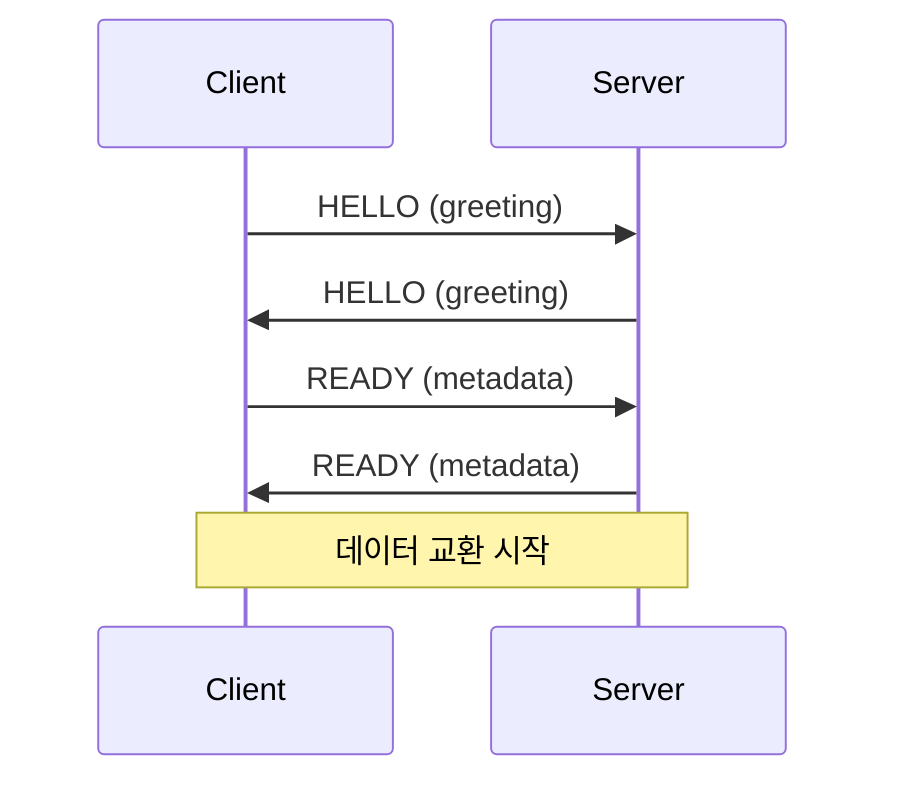
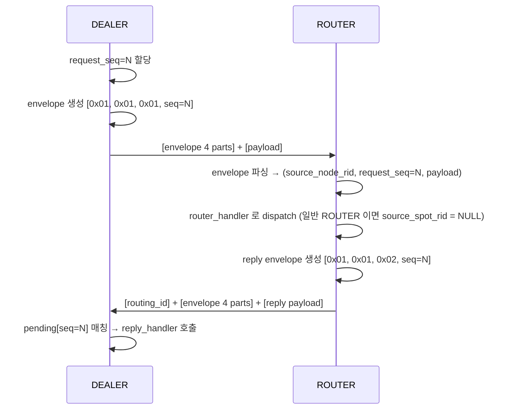
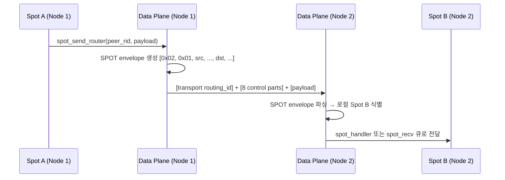
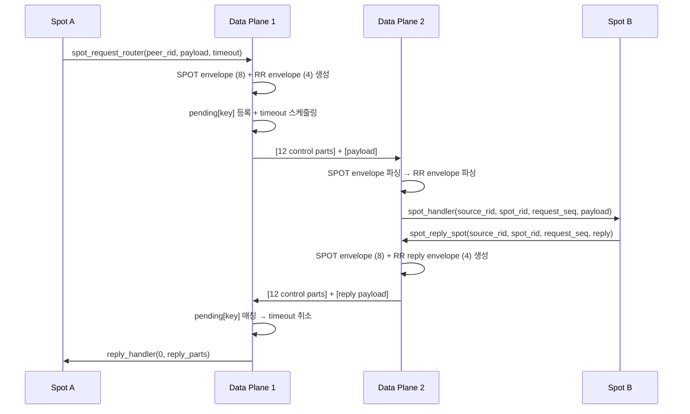
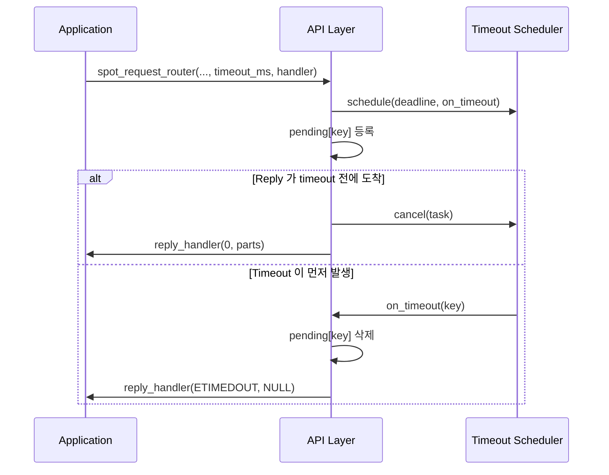

[English](./protocol-zmp.md) | [한국어](./protocol-zmp.ko.md)

# ZMP v1.0 프로토콜 상세

> 주의:
> 현재 개발 라운드의 구현 기준은 `doc/plan/spot-refactor` 아래 문서들이다.
> 이 문서는 내부 배경 설명으로 유지되며, request-reply 와 SPOT 직접 전달의
> 최종 공개 계약은 작업 계획 폴더의 문서를 우선한다.

### 용어

| 용어 | 설명 |
|------|------|
| ZMP | zlink Message Protocol — zlink 전용 와이어 프로토콜 |
| frame | 와이어 위에서 전송되는 하나의 데이터 단위 |
| control part | application payload 앞에 오는 내부 제어 파트 |
| request-reply envelope | request type, `request_seq`(요청 고유 번호)를 담는 control part 묶음 |
| SPOT routed envelope | source/destination SPOT 주소를 담는 control part 묶음 |
| routing_id | transport 피어를 식별하는 바이트 열 |

## 1. 기본 방향

request-reply 와 SPOT 직접 전달은 `zlink_msg_t` 내부 필드가 아니라 ZMP
multipart control part 로 표현한다. 즉 다음 방식은 이 프로토콜의 모델이 아니다.

- message-level request marking
- per-message metadata envelope
- recv 후 내부 필드를 복원하는 방식

ordinary `zlink_send()` / `zlink_recv()` 는 payload part 만 다룬다.
request-reply 와 SPOT routed 는 전용 공개 API 가 control part 를 앞에
붙여 보내고, 전용 decode 경로가 이를 해석한다.

## 2. 공통 프레임 헤더

### 2.1 헤더 레이아웃

```text
 Byte:   0         1         2         3         4    5    6    7
      +---------+---------+---------+---------+---------------------+
      |  MAGIC  | VERSION |  FLAGS  |RESERVED |   PAYLOAD SIZE      |
      |  (0x5A) |  (0x01) |         | (0x00)  |   (32-bit BE)       |
      +---------+---------+---------+---------+---------------------+
```

| 필드 | 오프셋 | 크기 | 설명 |
|------|--------|------|------|
| MAGIC | 0 | 1 | `0x5A` |
| VERSION | 1 | 1 | `0x01` |
| FLAGS | 2 | 1 | 프레임 플래그 |
| RESERVED | 3 | 1 | `0x00` |
| PAYLOAD SIZE | 4-7 | 4 | Big Endian |

### 2.2 FLAGS 비트

| 비트 | 이름 | 값 | 설명 |
|------|------|-----|------|
| 0 | MORE | `0x01` | 멀티파트 계속 |
| 1 | CONTROL | `0x02` | control part |
| 2 | IDENTITY | `0x04` | routing id 관련 프레임 |
| 3 | SUBSCRIBE | `0x08` | 구독 요청 |
| 4 | CANCEL | `0x10` | 구독 취소 |

request-reply 와 SPOT routed envelope 의 첫 part 는 `CONTROL` 비트가 켜진
control part 여야 한다.

## 3. request-reply envelope

### Handshake



request-reply 는 payload 앞에 4개 control part 를 붙인다.

```text
[request-reply protocol id]
[request-reply version]
[message type]
[request seq]
[payload part 0]
[payload part 1]
...
```

필드 값:

- protocol id: `0x01`
- version: `0x01`
- message type:
  - `0x01` = request
  - `0x02` = reply
  - `0x03` = error reply
- request seq: 8바이트 Big Endian `uint64`

핵심 규칙:

- `request_seq = 0` 은 유효하지 않다.
- reply 는 request 에서 받은 `request_seq` 를 그대로 다시 보낸다.
- `error reply` 는 첫 payload part 에 4바이트 Big Endian errno 를 넣는다.
- ordinary payload 는 control part 뒤의 나머지 part 전체다.

### Request-Reply 시퀀스 (DEALER → ROUTER)



## 4. SPOT routed envelope

SPOT 직접 전달은 payload 앞에 8개 control part 를 붙인다.

```text
[spot protocol id]
[spot version]
[source class]
[source node rid]
[source endpoint rid]
[destination class]
[destination node rid]
[destination endpoint rid]
[payload part 0]
...
```

필드 값:

- protocol id: `0x02`
- version: `0x01`
- class:
  - `0x01` = spot
  - `0x02` = router

주소 해석:

- `source class = spot`
  - `source node rid` = 보내는 SpotNode
  - `source endpoint rid` = 보내는 Spot
- `source class = router`
  - `source node rid` = empty
  - `source endpoint rid` = 보내는 ROUTER peer
- `destination class = spot`
  - `destination node rid` = 받는 SpotNode
  - `destination endpoint rid` = 받는 Spot
- `destination class = router`
  - `destination node rid` = empty
  - `destination endpoint rid` = 받는 ROUTER peer

빈 값도 part 를 생략하지 않고 길이 0 part 로 보낸다.

### SPOT Routed 메시지 흐름



## 5. SPOT routed + request-reply 조합

SPOT request-reply 는 envelope 두 겹을 순서대로 붙인다.

```text
[router transport envelope if needed]
[spot routed envelope: 8 parts]
[request-reply envelope: 4 parts]
[payload]
```

이 순서는 구현 코드와 공개 문서에서 모두 같아야 한다.

의미:

- 바깥 8개 part 가 목적지와 source 주소를 정한다.
- 그 다음 4개 part 가 request/reply 종류와 `request_seq` 를 정한다.
- payload 는 마지막부터 시작한다.

### SPOT Request-Reply 시퀀스



### Timeout 시퀀스



## 6. encode / decode 흐름

### 6.1 socket request-reply

송신:

1. request/reply 종류를 결정한다.
2. `request_seq` 를 local counter 에서 잡는다.
3. 4개 control part 를 만든다.
4. 사용자 payload part 를 뒤에 붙여 보낸다.

수신:

1. 첫 4개 part 가 request-reply envelope 인지 검사한다.
2. `message_type`, `request_seq` 를 읽는다.
3. request 면 request handler 로 넘긴다.
4. reply 면 pending map 에서 `request_seq` 또는 `source_node_rid + request_seq` 로 찾는다.

### 6.2 SPOT request-reply

송신:

1. source/destination class 와 rid 를 정한다.
2. SPOT routed 8개 control part 를 만든다.
3. request-reply 4개 control part 를 바로 뒤에 붙인다.
4. payload part 를 뒤에 붙인다.

수신:

1. 먼저 8개 SPOT routed control part 를 읽는다.
2. 남은 part 앞 4개를 request-reply envelope 로 읽는다.
3. destination 이 local `Spot` 인지, local `ROUTER` 인지 정한다.
4. request 면 해당 handler 로 넘기고, reply 면 pending map 에서 완료한다.

## 7. pending 과 완료 규칙

pending(응답 대기 항목) 소유권은 상위 API 계층에 있다. 현재 구현은 다음처럼 동작한다.

- `DEALER` pending key: `request_seq`
- `ROUTER` pending key: `source_node_rid + request_seq` (일반 ROUTER 또는 SPOT 에서 시작된 routed)
- `spot -> spot` pending key:
  `source_class + source address + request_seq`
- `router -> spot` pending key: `request_seq`

완료 규칙:

- 첫 reply 1건으로 high-level request 를 완료한다.
- timeout 이 먼저 오면 pending entry 를 지우고 `ETIMEDOUT` 로 콜백한다.
- 완료 후 같은 key 로 추가 reply 가 와도 다시 callback 하지 않는다.
- `error reply` 는 payload 대신 `errno != 0` completion 으로 바꿔 전달한다.

## 8. transport routing_id 와의 관계

transport `routing_id` 와 request-reply / SPOT 주소는 같은 값이 아니다.

- transport `routing_id`: 현재 연결된 peer 주소
- `request_seq`: request 와 reply 를 묶는 식별자
- SPOT node rid / spot rid: application-level destination

특히 `ROUTER` 와 SPOT 조합에서는 둘을 섞으면 reply 주소를 잘못 계산하게 된다.
문서와 구현 모두 이를 다른 계층으로 설명해야 한다.

## 9. 유효성 검사

decode 쪽은 최소한 아래를 검사한다.

- control part 개수가 충분한지
- protocol id 와 version 이 맞는지
- `request_seq != 0` 인지
- message type 이 알려진 값인지
- SPOT destination class 와 rid 조합이 맞는지

이 검사에 실패한 메시지는 request-reply 또는 SPOT routed 메시지로 취급하지
않는다. pending completion 도 일으키지 않는다.
