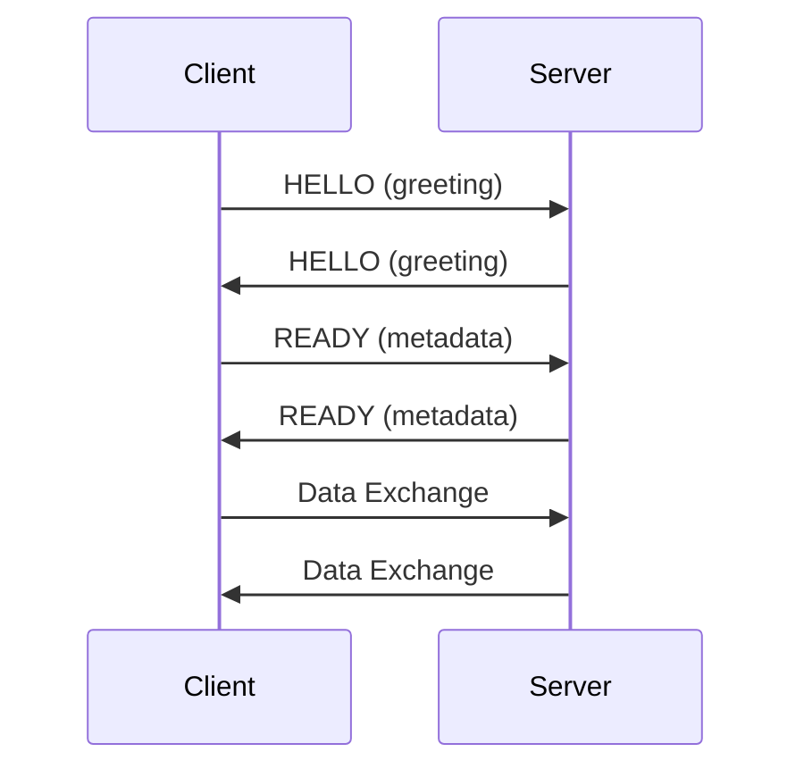

[English](protocol-zmp.md) | [한국어](protocol-zmp.ko.md)

# ZMP v1.0 프로토콜 상세

### 용어

| 용어 | 설명 |
|------|------|
| ZMP | zlink Message Protocol. zlink 전용 와이어 프로토콜 |
| ZMTP | ZeroMQ Message Transport Protocol. ZMP가 대체하는 기존 프로토콜 |
| frame | 와이어 위에서 전송되는 하나의 데이터 단위. 헤더 + payload로 구성된다 |
| handshake | 연결 초기에 두 피어가 소켓 타입과 identity를 교환하는 절차 |
| envelope | 사용자 payload 앞에 자동 추가되는 내부 프레임 (request-reply, metadata 등) |
| routing_id | Router 소켓이 피어를 식별하는 고유 바이트 열 |

## 왜 ZMTP 대신 ZMP인가?

ZMP(zlink Message Protocol)는 ZMTP를 대체하는 전용 와이어 프로토콜이다.
ZMTP의 가변 길이 크기 인코딩, 다단계 greeting/handshake 협상, 하위 호환
기구는 zlink에 불필요한 파싱 복잡도와 프레임당 오버헤드를 추가한다. ZMP는
고정 8바이트 헤더, 버전 협상 없는 2회 왕복 핸드셰이크, zlink의 라우팅/구독/제어
의미에 맞춘 플래그 세트를 사용한다. 그 결과 파싱이 단순하고, 프레임당
오버헤드가 작으며, 핸드셰이크가 더 적은 왕복으로 완료된다.

## 1. 설계 철학
- ZMTP 비호환 (zlink 전용 최적화)
- 8B 고정 헤더 (가변 길이 인코딩 배제)
- 최소 핸드셰이크

## 2. 프레임 구조

### 2.1 헤더 레이아웃 (8 Bytes 고정)
```
 Byte:   0         1         2         3         4    5    6    7
      +---------+---------+---------+---------+---------------------+
      |  MAGIC  | VERSION |  FLAGS  |RESERVED |   PAYLOAD SIZE      |
      |  (0x5A) |  (0x01) |         | (0x00)  |   (32-bit BE)       |
      +---------+---------+---------+---------+---------------------+
```

Fields:
| 필드 | 오프셋 | 크기 | 설명 |
|------|--------|------|------|
| MAGIC | 0 | 1 | 0x5A ('Z') |
| VERSION | 1 | 1 | 0x01 |
| FLAGS | 2 | 1 | 프레임 플래그 |
| RESERVED | 3 | 1 | 0x00 |
| PAYLOAD SIZE | 4-7 | 4 | Big Endian |

### 2.2 FLAGS 비트 정의
| 비트 | 이름 | 값 | 설명 |
|------|------|-----|------|
| 0 | MORE | 0x01 | 멀티파트 계속 |
| 1 | CONTROL | 0x02 | 제어 프레임 |
| 2 | IDENTITY | 0x04 | 라우팅 ID 포함 |
| 3 | SUBSCRIBE | 0x08 | 구독 요청 |
| 4 | CANCEL | 0x10 | 구독 취소 |

### 2.3 Internal Envelope Frame

메시지가 request-reply 필드(`msg_type` / `correlation_id`) 또는 per-message
metadata를 가지고 있으면, send 경로가 사용자 payload frame 앞에 internal
envelope frame을 prepend한다. 이 frame은 `command` 메시지 타입을 사용하며
application에 투명하다.

- request-reply나 metadata가 없는 메시지는 추가 frame이 없다. overhead 0.
- recv 경로(`strip_internal_message_envelopes`)가 envelope frame을 감지하여
  strip하고, `msg_type`, `correlation_id`, metadata를 메시지 내부 상태에
  복원한 후 application에 전달한다.
- `zlink_msg_data()` / `zlink_msg_size()`는 항상 사용자 payload만 반환한다.

prepend될 수 있는 envelope frame:

| Frame | 조건 | 내용 |
|-------|------|------|
| Request-reply envelope | `msg_type != DATA` | type (u8) + correlation_id (u64) = 9바이트 |
| Metadata envelope | metadata count > 0 | 인코딩된 key-value entries |

둘 다 선택적이며 독립적이다. 하나의 메시지에 request-reply와 metadata
envelope이 동시에 존재할 수 있다. 둘 다 있으면 request-reply envelope frame이
먼저, metadata frame이 다음, 사용자 payload frame이 마지막 순서로 전송된다.

## 3. 핸드셰이크

### 3.1 시퀀스



### 3.2 HELLO 프레임
- control_type (1B)
- socket_type (1B)
- routing_id_len (1B)
- routing_id (0~255B)

### 3.3 READY 프레임
- Socket-Type 속성 (항상)
- Identity 속성 (DEALER/ROUTER만)

## 4. WebSocket 프레이밍
- RFC 6455 Binary frame (Opcode=0x02)
- Payload = ZMP Frame
- Beast 라이브러리 기반
