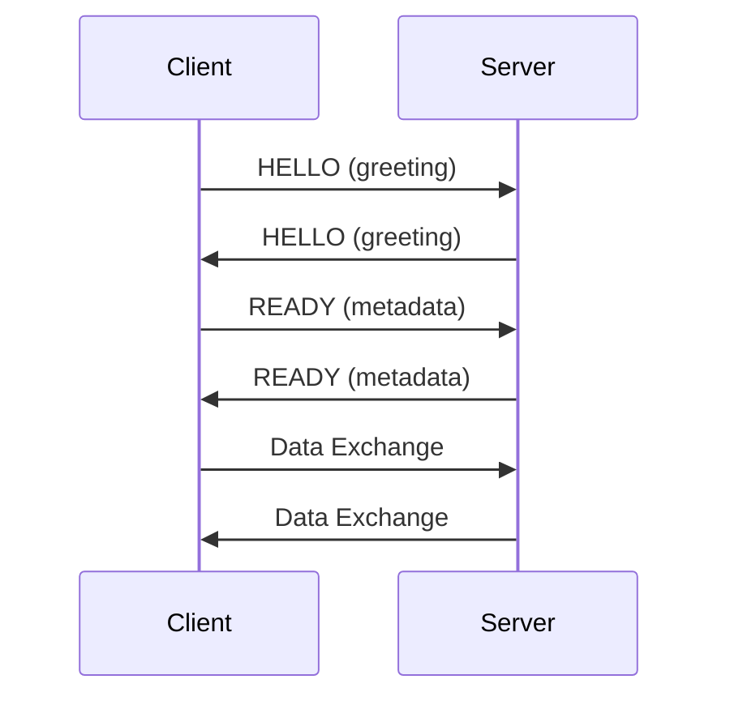

[English](protocol-zmp.md) | [한국어](protocol-zmp.ko.md)

# ZMP v1.0 Protocol Details

> Note:
> The current implementation source of truth for this development round lives
> under `doc/plan/spot-refactor`.
> This document remains as internal background material.
> For request-reply and SPOT direct delivery, prefer the work-in-progress
> protocol documents in that folder.

## Why ZMP instead of ZMTP?

ZMP (zlink Message Protocol) is a purpose-built wire protocol that
replaces ZMTP. ZMTP's variable-length size encoding, multi-step
greeting/handshake negotiation, and backward-compatibility machinery add
parsing complexity and per-frame overhead that zlink does not need.
ZMP uses a fixed 8-byte header, a two-round-trip handshake with no
version negotiation, and a flag set tailored to zlink's routing,
subscription, and control semantics. The result is simpler parsing,
smaller per-frame overhead, and a handshake that completes in fewer
round trips.

## 1. Design Philosophy
- ZMTP-incompatible (optimized exclusively for zlink)
- 8B fixed header (no variable-length encoding)
- Minimal handshake

## 2. Frame Structure

### 2.1 Header Layout (8 Bytes Fixed)
```
 Byte:   0         1         2         3         4    5    6    7
      +---------+---------+---------+---------+---------------------+
      |  MAGIC  | VERSION |  FLAGS  |RESERVED |   PAYLOAD SIZE      |
      |  (0x5A) |  (0x01) |         | (0x00)  |   (32-bit BE)       |
      +---------+---------+---------+---------+---------------------+
```

Fields:
| Field | Offset | Size | Description |
|------|--------|------|------|
| MAGIC | 0 | 1 | 0x5A ('Z') |
| VERSION | 1 | 1 | 0x01 |
| FLAGS | 2 | 1 | Frame flags |
| RESERVED | 3 | 1 | 0x00 |
| PAYLOAD SIZE | 4-7 | 4 | Big Endian |

### 2.2 FLAGS Bit Definitions
| Bit | Name | Value | Description |
|------|------|-----|------|
| 0 | MORE | 0x01 | Multipart continuation |
| 1 | CONTROL | 0x02 | Control frame |
| 2 | IDENTITY | 0x04 | Contains Routing ID |
| 3 | SUBSCRIBE | 0x08 | Subscription request |
| 4 | CANCEL | 0x10 | Subscription cancel |

### 2.3 Control Parts For Higher-Level Protocols

Current request-reply and SPOT direct delivery do not use message-level
markers inside `zlink_msg_t`.

Instead, higher-level protocols use ZMP multipart control parts in front of
the user payload parts.

- request-reply uses fixed control parts defined by
  `doc/plan/spot-refactor/ZMP_REQUEST_REPLY_PROTOCOL.md`
- SPOT direct delivery uses fixed control parts defined by
  `doc/plan/spot-refactor/ZMP_SPOT_ROUTED_PROTOCOL.md`
- ordinary payload messages do not carry these protocol control parts

The `CONTROL` flag in the ZMP frame header marks these protocol control parts.
Applications do not read them through `zlink_msg_data()` or `zlink_msg_size()`.
Typed receive surfaces such as `router_recv`, `router_spot_recv`, and
`spot_recv` interpret them and return decoded routing or `request_seq`
information together with the payload parts.

## 3. Handshake

### 3.1 Sequence



### 3.2 HELLO Frame
- control_type (1B)
- socket_type (1B)
- routing_id_len (1B)
- routing_id (0~255B)

### 3.3 READY Frame
- Socket-Type property (always)
- Identity property (DEALER/ROUTER only)

## 4. WebSocket Framing
- RFC 6455 Binary frame (Opcode=0x02)
- Payload = ZMP Frame
- Based on the Beast library
