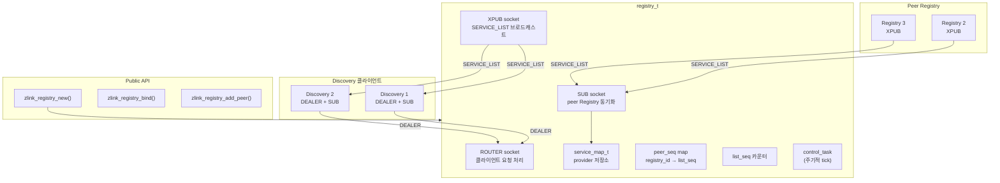
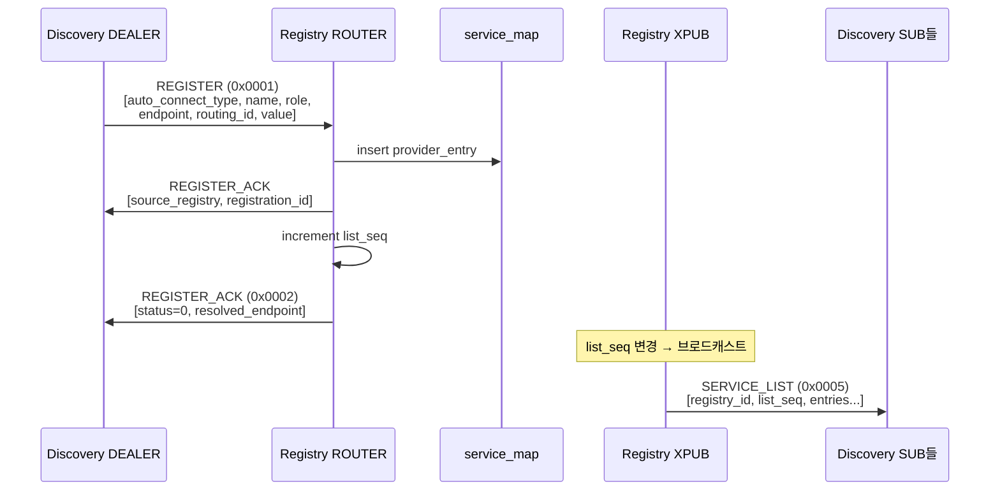
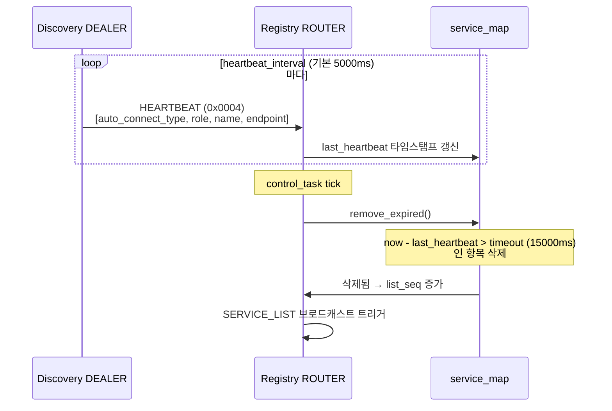
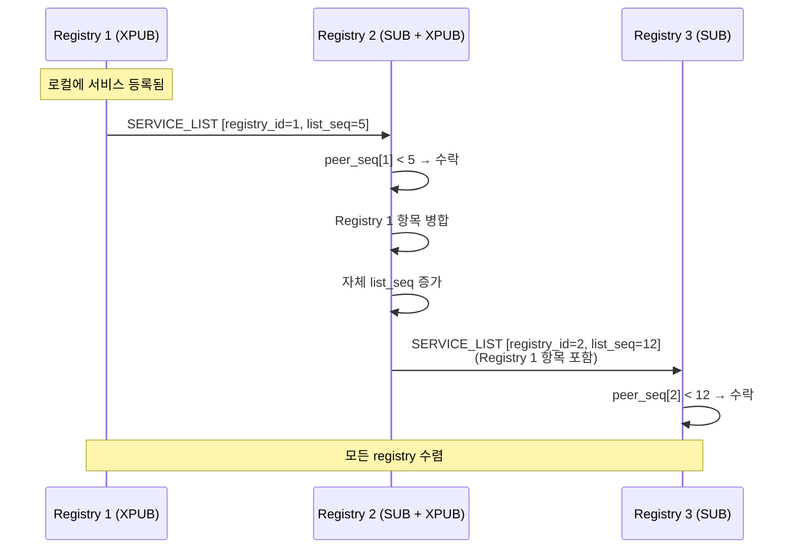
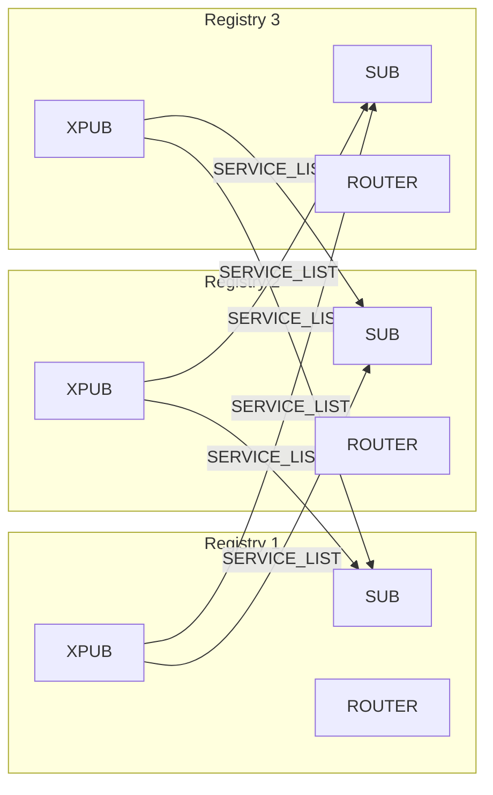
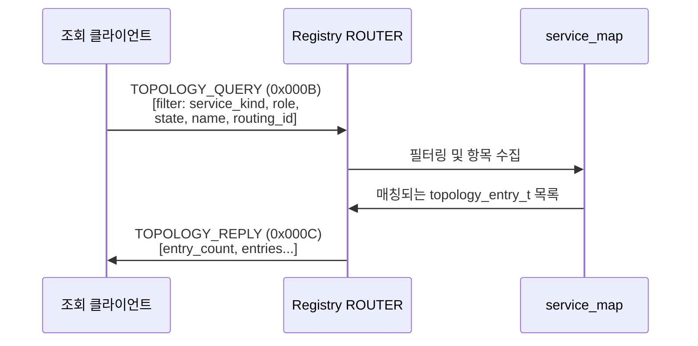
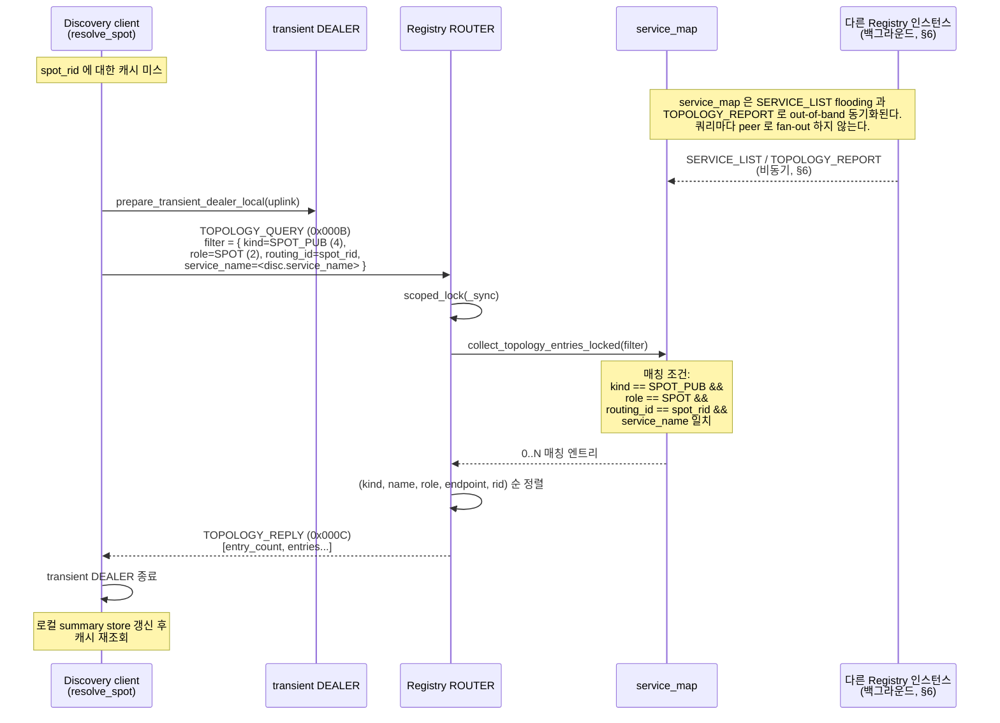
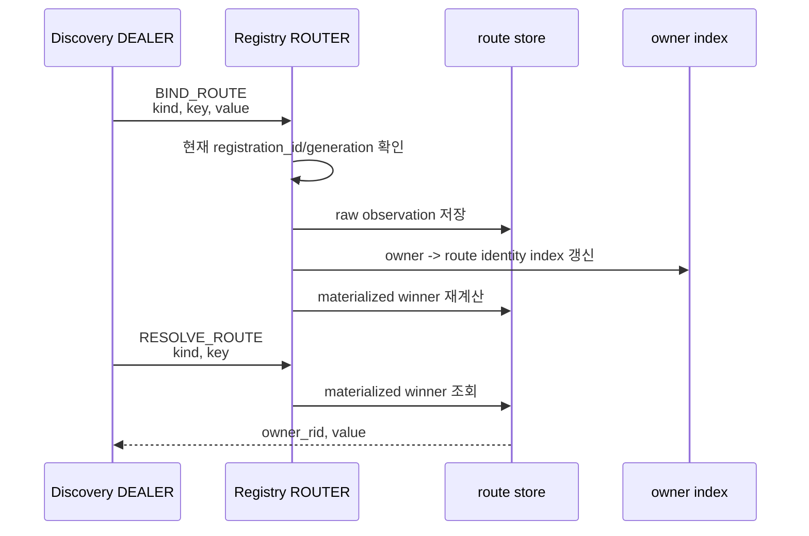
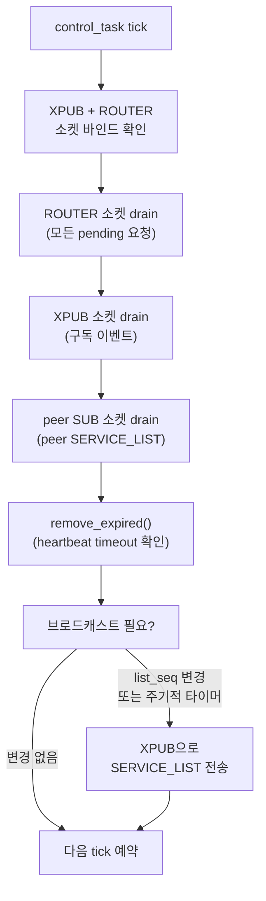
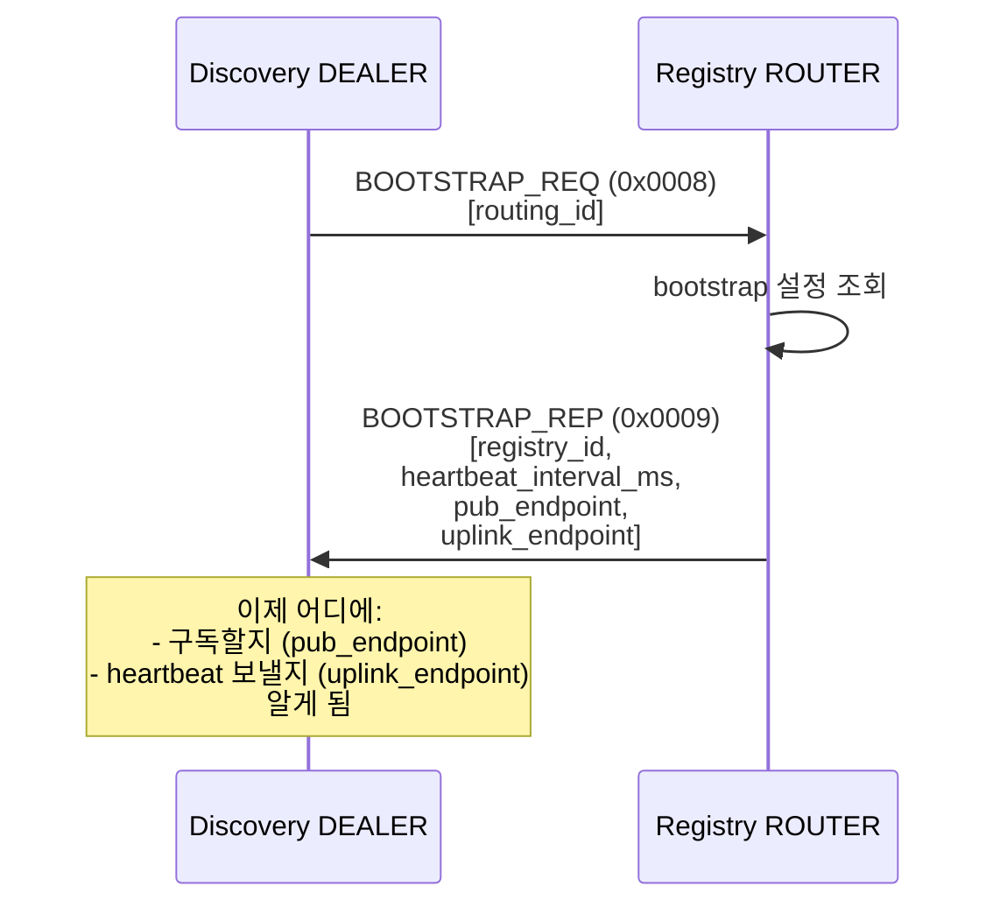

[English](./registry-internals.md) | [한국어](./registry-internals.ko.md)

# Registry 서비스 내부 아키텍처

## 1. 컴포넌트 개요



## 2. 소켓 종류

| 소켓 | 타입 | 엔드포인트 | 용도 |
|------|------|----------|------|
| `_router_socket` | ROUTER | `bind()`으로 설정 | REGISTER, HEARTBEAT, BOOTSTRAP, TOPOLOGY 요청 처리 |
| `_pub_socket` | XPUB | `bind()`으로 설정 | 모든 Discovery SUB에 SERVICE_LIST 브로드캐스트 |
| `_peer_sub_socket` | SUB | 피어 PUB에 connect | 피어 Registry에서 SERVICE_LIST 수신 (클러스터 동기화) |

XPUB을 사용해 구독 이벤트를 감지하고 새 구독자에게 즉시 SERVICE_LIST를 전송한다.

## 3. 데이터 구조

```cpp
struct service_key_t {
    uint16_t auto_connect_type;       // spot_node(2), socket(3)
    std::string service_name;
};

struct provider_entry_t {
    uint16_t service_role;       // spot(2), router(3), dealer(4), pub(5), sub(6)
    std::string endpoint;
    zlink_routing_id_t routing_id;
    int64_t value;
    std::vector<uint8_t> provider_blob;
    uint64_t registration_id;
    uint64_t provider_update_seq;
    uint64_t registered_at;
    uint64_t last_heartbeat;
    uint32_t source_registry;    // original owner registry
};

struct route_entry_t {
    route_key_t key;
    std::vector<uint8_t> value;
    owner_identity_t owner;
    zlink_routing_id_t owner_routing_id;
    uint32_t advertising_registry;
};

// Storage: service_key -> { provider_key -> provider_entry }
// Route lookup: route_key -> route_entry
// Owner cleanup: owner_identity -> route_key set
```

### 3.1 Actor route row 와 gateway 경계

Actor route 는 일반 `route_entry_t` row 로 저장되며 key 는 `ZLINK_ROUTE_KIND_ACTOR` 와
actor id 다. value 는 불투명한 `zlink_actor_route_t` blob 이고, Registry 는 이를 저장하고
flooding 하지만 내용을 해석하지 않는다. owner SpotNode 가 Actor 의 현재 위치에서 이 row 를
게시하고 회수하므로, **owner 가 게시하는 eventually consistent** 상태다. 최신 join 이 owner 의
Actor table 에는 먼저 보이고, 대응하는 route row 가 모든 Registry 로 flooding 되기 전일 수 있다.

그래서 STREAM session relay 는 Registry 를 조회하지 않는다. session binding 이 bound Actor
ref 를 직접 들고 있고, owner SpotNode 의 ActorGateway 가 현재 위치를 local 에서 해석한다
([spot-internals.ko.md](./spot-internals.ko.md) 12절 참고). Registry route row 는
service-to-Actor routing 과 진단 용도이며 relay hot path 가 아니다.

## 4. 서비스 등록 시퀀스



## 5. Heartbeat 추적



### Heartbeat 설정

| 파라미터 | 기본값 | 설명 |
|---------|--------|------|
| `heartbeat_interval_ms` | 5000ms | 서비스 heartbeat 전송 간격 |
| `heartbeat_timeout_ms` | 15000ms | 만료 임계값 (interval의 3배) |
| `broadcast_interval_ms` | 30000ms | 주기적 SERVICE_LIST 브로드캐스트 |

## 6. 클러스터 동기화 (Flooding)



### Flooding 규칙

Flooding은 각 Registry가 받은 SERVICE_LIST를 나머지 Registry로 즉시 전파하는 동작이다.
루프를 방지하고 수렴을 보장하기 위해 아래 규칙을 적용한다.

| 규칙 | 설명 |
|------|------|
| 자기 필터 | `peer_registry_id == local_registry_id` → 무시 (자기 자신이 발원한 메시지) |
| 시퀀스 확인 | `list_seq <= peer_seq[id]` → 무시 (이미 처리된 버전) |
| 병합 | `source_registry`의 기존 항목 삭제 후 새 항목 삽입 |
| 재브로드캐스트 | 자체 `list_seq` 증가, 모든 구독자에게 브로드캐스트 |
| 루프 방지 | 각 항목이 `source_registry`를 보유하여 출처 추적 |

### 클러스터 토폴로지



권장 클러스터 크기: **3노드** (full mesh 상호 연결).

## 7. Topology 조회



### 조회 필터

| 필터 | 타입 | 설명 |
|------|------|------|
| service_kind | uint16_t | SPOT (2) 또는 Socket (3) |
| service_role | uint16_t | router/dealer/pub/sub/spot |
| state | uint8_t | 서비스 상태 필터 |
| service_name | string | 정확한 이름 매칭 |
| routing_id | bytes | 특정 provider 매칭 |

결과 정렬 순서: `service_kind → service_name → service_role → endpoint → routing_id`

### 7.1 Spot 소유 노드 조회 (resolve_spot 전용 쿼리)

`zlink_discovery_resolve_spot()` 은 `TOPOLOGY_QUERY` 의 특수 사용 사례다.
Discovery 클라이언트가 어떤 논리 spot routing id 의 현재 owner SpotNode 를
찾아야 할 때, 필터를 해당 spot identity 로만 좁힌 뒤 transient DEALER 로
단발성 조회를 던진다. Registry 는 이 용도를 위한 전용 message id 를 따로
두지 않는다 — 동일한 `TOPOLOGY_QUERY` 표면을 더 좁은 필터로 사용한다.



Registry 측 주의사항:

- 이 쿼리는 **요청마다 피어 Registry 로 팬아웃(fan-out, 분산 조회)하지 않는다**. Registry 는 §6 의 flooding / heartbeat 주기로 동기화된 로컬 `service_map` 에서 답한다. spot 소유 기록은 SERVICE_LIST 브로드캐스트와 `TOPOLOGY_REPORT` uplink 경로를 통해 로컬 `service_map` 에 반영된다.
- owner SpotNode 가 이동했지만 새 등록이 아직 이 Registry 까지 전파되지 않았다면, 쿼리는 **오래된(stale) 결과이거나 빈 결과**를 반환할 수 있다. Discovery 클라이언트는 이를 `ENOENT` 로 호출자에게 "지금은 확정 불가" 신호로 돌려주며, 애플리케이션은 짧은 backoff 후 재시도하는 것이 일반적이다.
- Registry 는 매칭되는 모든 엔트리를 반환하지, 가장 신선한 한 건만 고르지 않는다. Discovery 클라이언트가 `refresh_spot_owner_cache_locked` 단계에서 각 엔트리에 현재의 `validated_service_seq` 도장을 찍어 저장하므로, 이후 캐시 hit 단계에서 membership 변화를 기준으로 검증할 수 있다.
- 이 응답을 **들어오는 request 에 대한 reply 용 owner 주소로 재사용하면 안 된다**. 이 resolver 는 destination lookup 전용이고, reply 경로는 원래 request 와 함께 전달된 구체적인 source 주소를 그대로 써야 한다. 클라이언트 측 계약은 [Discovery Internals §10](./discovery-internals.ko.md#10-spot-소유-노드-조회-zlink_discovery_resolve_spot) 참고.

## 8. Owner-Bound Route 처리

`BIND_ROUTE`, `UNBIND_ROUTE`, `RESOLVE_ROUTE` 는 service/provider row 와 같은 Registry
control plane 에서 처리된다. route row 는 `kind + key` 만으로 저장되는 값이 아니라,
어떤 owner registration 이 claim 했는지까지 함께 보관한다.



owner 가 timeout 되거나 unregister 되면 Registry 는 owner index 로 그 owner 가 남긴 route
observation 을 찾고 함께 제거한다. 제거 뒤 같은 route identity 의 winner 를 다시 계산한다.
이 과정 때문에 framework adapter 의 Spot name route 나 actor-session binding route 는
Registry 안에서 따로 cleanup job 을 돌리지 않아도 owner lifecycle 을 따른다.

`UNBIND_ROUTE` 는 요청을 보낸 현재 owner generation 이 claim 한 observation 만 제거한다.
오래된 process 나 다른 owner 가 같은 route key 를 알고 있어도 새 owner 의 route 를 지울 수
없다. 같은 process 안에서 더 세밀한 stale unbind 방지가 필요한 경우에는 framework 가 route
value 안에 binding token 같은 payload 를 넣고 unbind 전에 다시 확인한다.

## 9. Control Task 주기



## 10. Bootstrap 메커니즘



Bootstrap 응답은 Discovery 클라이언트에게 지속적 통신에 필요한 모든 정보를 제공한다.
- `registry_id`: 중복 감지용 고유 식별자
- `heartbeat_interval_ms`: heartbeat 전송 주기
- `pub_endpoint`: SERVICE_LIST 구독 대상
- `uplink_endpoint`: REGISTER/HEARTBEAT/TOPOLOGY 전송 대상
