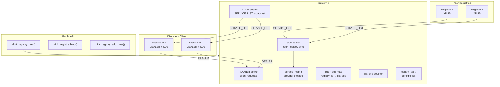
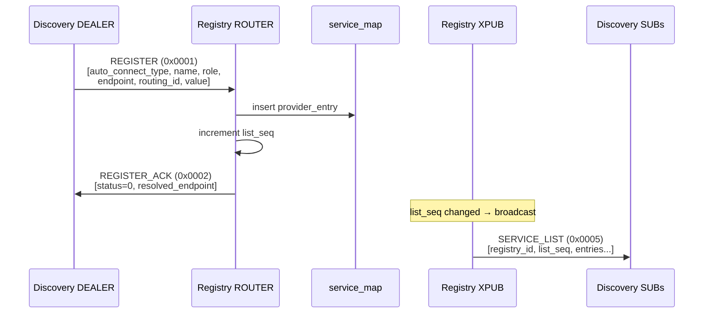
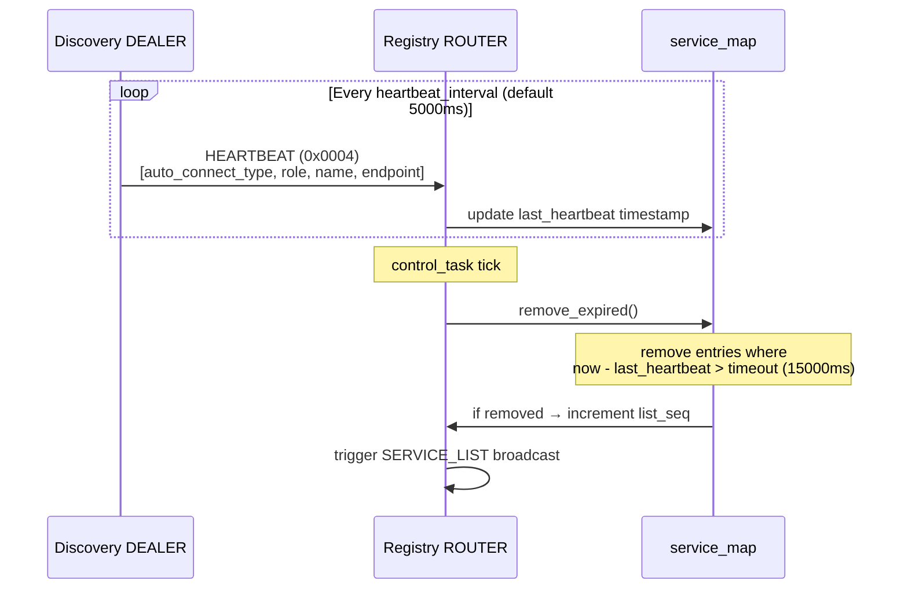
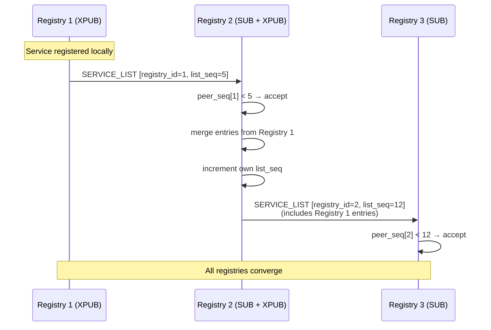
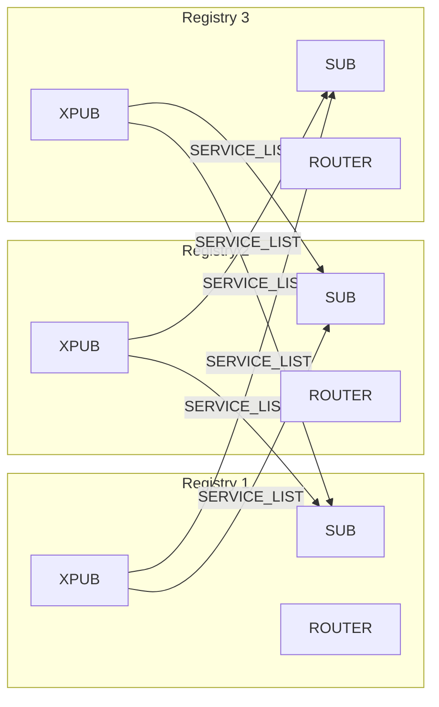
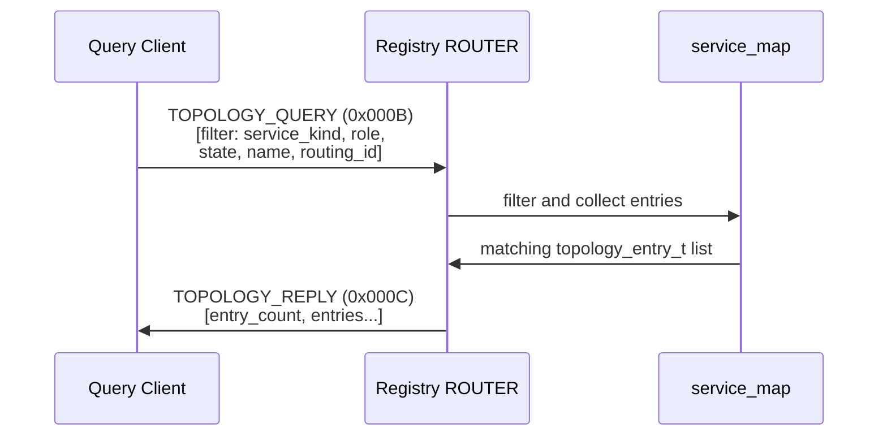
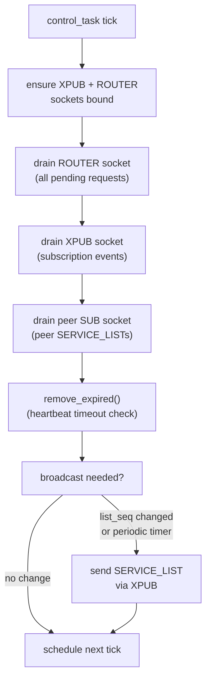
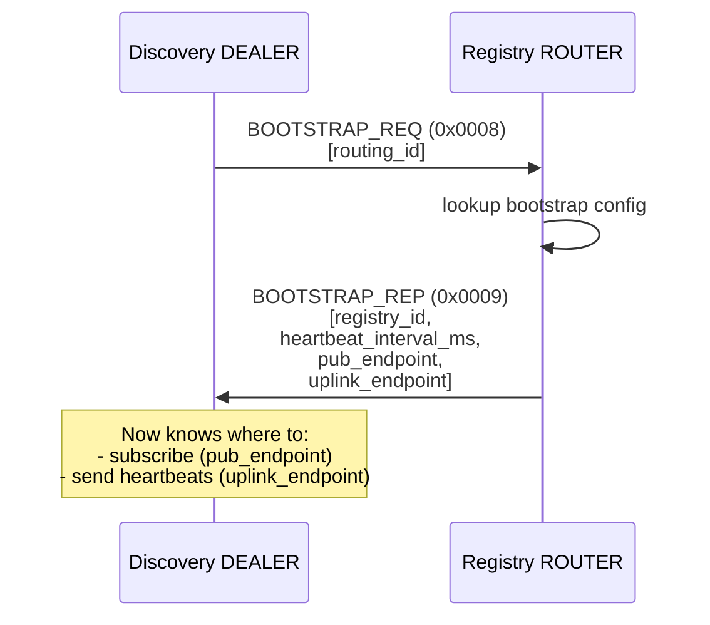

[English](registry-internals.md) | [한국어](registry-internals.ko.md)

# Registry Service Internal Architecture

## 1. Component Overview



## 2. Socket Types

| Socket | Type | Endpoint | Purpose |
|--------|------|----------|---------|
| `_router_socket` | ROUTER | configured via `bind()` | Handle REGISTER, HEARTBEAT, BOOTSTRAP, TOPOLOGY requests |
| `_pub_socket` | XPUB | configured via `bind()` | Broadcast SERVICE_LIST to all Discovery SUBs |
| `_peer_sub_socket` | SUB | connects to peer PUBs | Receive SERVICE_LIST from peer Registries (cluster sync) |

XPUB is used (not PUB) to detect subscription events and trigger
immediate SERVICE_LIST broadcast to new subscribers.

## 3. Data Structures

```cpp
struct service_key_t {
    uint16_t auto_connect_type;       // spot_node(2), socket(3)
    std::string service_name;
};

struct provider_entry_t {
    uint16_t service_role;       // spot(2), router(3), dealer(4), pub(5), sub(6)
    std::string endpoint;
    zlink_routing_id_t routing_id;
    int64_t value;
    std::vector<uint8_t> metadata;
    uint64_t registered_at;
    uint64_t last_heartbeat;
    uint32_t source_registry;    // which registry provided this entry
};

// Storage: service_key → { provider_key → provider_entry }
```

## 4. Service Registration Sequence



## 5. Heartbeat Tracking



### Heartbeat Configuration

| Parameter | Default | Description |
|-----------|---------|-------------|
| `heartbeat_interval_ms` | 5000ms | Service heartbeat send interval |
| `heartbeat_timeout_ms` | 15000ms | Expiry threshold (3x interval) |
| `broadcast_interval_ms` | 30000ms | Periodic SERVICE_LIST broadcast |

## 6. Cluster Synchronization (Flooding)



### Flooding Rules

| Rule | Description |
|------|-------------|
| Self-filter | `peer_registry_id == local_registry_id` → ignore |
| Sequence check | `list_seq <= peer_seq[id]` → ignore (already seen) |
| Merge | Clear old entries from `source_registry`, insert new |
| Rebroadcast | Increment own `list_seq`, broadcast to all subscribers |
| Loop prevention | Each entry carries `source_registry` to track origin |

### Cluster Topology



Recommended cluster size: **3 nodes** (full mesh interconnection).

## 7. Topology Query



### Query Filters

| Filter | Type | Description |
|--------|------|-------------|
| service_kind | uint16_t | SPOT (2) or Socket (3) |
| service_role | uint16_t | router/dealer/pub/sub/spot |
| state | uint8_t | Service state filter |
| service_name | string | Exact name match |
| routing_id | bytes | Specific provider match |

Results are sorted by: `service_kind → service_name → service_role → endpoint → routing_id`

### 7.1 Spot-ownership Resolution Query

`zlink_discovery_resolve_spot()` is a specialized consumer of
`TOPOLOGY_QUERY`. When a Discovery client needs to locate the current
owner SpotNode for a logical spot routing id, it scopes the filter to
just the spot identity and issues a single-shot query over a transient
DEALER socket. Registry has no dedicated message id for this use case —
it is the same TOPOLOGY_QUERY surface with a narrower filter.

```mermaid
sequenceDiagram
    participant Disc as Discovery client<br/>(resolve_spot)
    participant Dealer as transient DEALER
    participant Router as Registry ROUTER
    participant Map as service_map
    participant Peers as peer registries<br/>(background, §6)

    Note over Disc: cache miss for spot_rid
    Note over Map,Peers: service_map is kept in sync out-of-band<br/>via SERVICE_LIST flooding + TOPOLOGY_REPORT;<br/>no per-query fan-out to peers.
    Peers-->>Map: SERVICE_LIST / TOPOLOGY_REPORT<br/>(asynchronous, §6)
    Disc->>Dealer: prepare_transient_dealer_local(uplink)
    Disc->>Router: TOPOLOGY_QUERY (0x000B)<br/>filter = { kind=SPOT_PUB (4),<br/>role=SPOT (2), routing_id=spot_rid,<br/>service_name=<disc.service_name> }
    Router->>Router: scoped_lock(_sync)
    Router->>Map: collect_topology_entries_locked(filter)
    Note over Map: matches only entries where<br/>kind == SPOT_PUB &&<br/>role == SPOT &&<br/>routing_id == spot_rid &&<br/>service_name matches
    Map-->>Router: 0..N matching entries
    Router->>Router: sort by (kind, name, role, endpoint, rid)
    Router-->>Disc: TOPOLOGY_REPLY (0x000C)<br/>[entry_count, entries...]
    Disc->>Disc: close transient DEALER
    Note over Disc: refresh local summary store,<br/>retry cache lookup
```

Notes on the registry side:

- The query is **not** fanned out to peer registries on demand. Registry answers from its local `service_map`, which is kept in sync by the flooding / heartbeat cycle described in §6. A spot ownership record propagates into the local `service_map` through SERVICE_LIST broadcast and `TOPOLOGY_REPORT` uplinks.
- When the owner SpotNode has moved but the new registration has not yet flooded to this registry, the query may return **stale or empty** results. The Discovery client absorbs this by treating `ENOENT` as a caller-visible "not resolvable right now" signal rather than a hard error; applications typically retry after a short backoff.
- The registry returns every matching entry, not just the freshest one. The Discovery client does the final owner-node selection during `refresh_spot_owner_cache_locked`, pairing each entry with its stamped `validated_service_seq` so subsequent cache hits can be validated against the current provider view.
- A **reply must not be used as an owner record for incoming-request reply paths**. The resolver is a destination lookup only; reply paths must continue to use the concrete source addresses that came with the original request. See [Discovery Internals §10](discovery-internals.md#10-spot-ownership-resolution-zlink_discovery_resolve_spot) for the client-side contract.

## 8. Control Task Cycle



## 9. Bootstrap Mechanism



The bootstrap reply provides the Discovery client with all the
information needed to establish ongoing communication:
- `registry_id`: unique identifier for duplicate detection
- `heartbeat_interval_ms`: how often to send heartbeats
- `pub_endpoint`: where to subscribe for SERVICE_LIST
- `uplink_endpoint`: where to send REGISTER/HEARTBEAT/TOPOLOGY
