[English](services-internals.md) | [한국어](services-internals.ko.md)

# 서비스 계층 내부 설계

## 1. 개요

zlink 서비스 계층은 Discovery와 SPOT 두 가지 고수준 서비스를 제공한다.
이 문서는 내부 구현 상세를 다룬다.

SPOT에서 transport security 소유권은 의도적으로 좁게 유지한다.
`SpotNode`가 mesh/control 소켓의 TLS/WSS wiring을 책임지고, unified `Spot`은
빌린 data-plane facade로만 남는다. facade는 node lifecycle을 소유하지
않으며, 그 자체가 TLS 설정 surface는 아니다.

## 2. Registry 내부 구현

### 2.1 데이터 구조

```cpp
struct service_entry_t {
    std::string service_name;
    std::string endpoint;
    zlink_routing_id_t routing_id;
    uint16_t service_role;
    uint64_t registered_at;
    uint64_t last_heartbeat;
    uint32_t weight;
};

struct registry_state_t {
    uint32_t registry_id;
    uint64_t list_seq;
    std::map<std::string, std::vector<service_entry_t>> services;
};
```

### 2.2 Registry 상태 머신

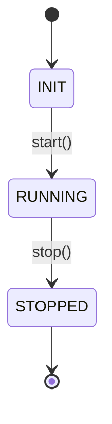

### 2.3 SERVICE_LIST 브로드캐스트 트리거

| 트리거 | 설명 |
|--------|------|
| 등록 | 서비스 REGISTER 성공 후 |
| 해제 | UNREGISTER 또는 Heartbeat 타임아웃 |
| 주기적 | 30초 (기본, 설정 가능) |

### 2.4 클러스터 동기화
- 각 Registry는 다른 Registry의 PUB를 SUB으로 구독
- flooding 방식으로 즉시 전파
- registry_id + list_seq로 중복/역전 무시

## 3. Discovery 내부 구현

### 3.1 상태 머신 (서비스별)

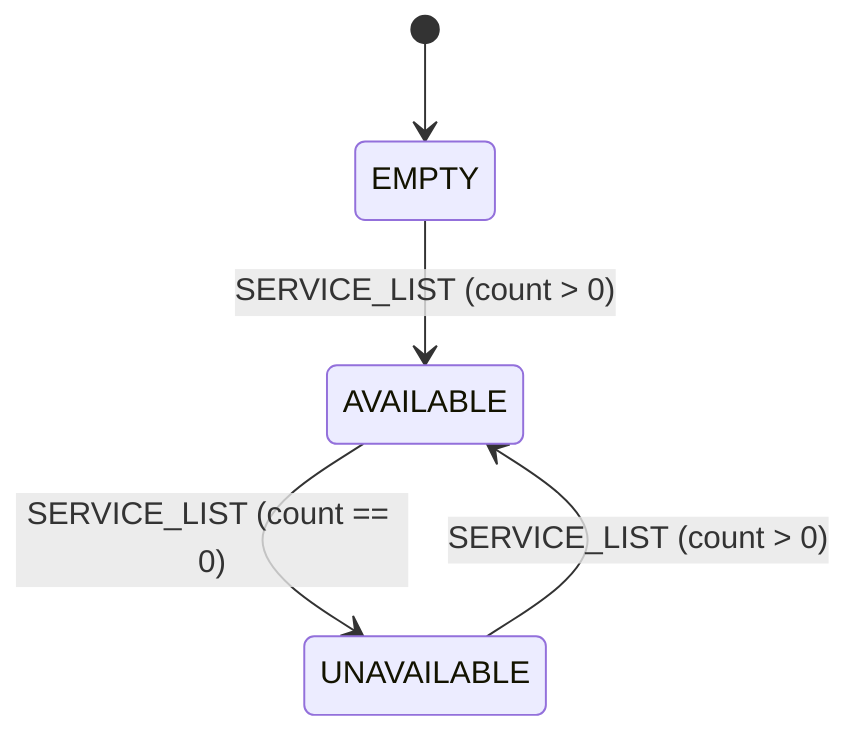

### 3.2 서비스 타입과 역할

Discovery는 프로바이더를 (service_type, service_role) 쌍으로 추적한다:

```cpp
// Service types
static const uint16_t service_type_spot_node = 2;
static const uint16_t service_type_socket = 3;

// Service roles
enum service_role_t {
    service_role_invalid = 0,
    service_role_spot    = 2,  // fixed for spot type
    service_role_router  = 3,  // socket family
    service_role_dealer  = 4,  // socket family
    service_role_pub     = 5,  // socket family
    service_role_sub     = 6   // socket family
};
```

SPOT은 서비스 타입에서 파생되는 고정 역할을 가진다. 소켓 패밀리
서비스는 소켓 타입에 맞는 명시적 역할이 필요하다. 피어 발견을 위한 역할
매칭 규칙:
- PUB ↔ SUB
- ROUTER ↔ ROUTER, ROUTER ↔ DEALER, DEALER ↔ DEALER
- SPOT ↔ SPOT

### 3.3 Discovery 소유 서비스 실행

Discovery는 연결된 서비스의 lifecycle owner 역할을 한다. 각 서비스 타입은
`discovery_owned_service` 편의 API를 통해 엔드포인트를 등록한다:

```cpp
namespace discovery_owned_service {
    int register_endpoint(discovery_t *, uint16_t service_type,
                          const char *endpoint, uint32_t weight,
                          std::string *resolved_endpoint_out,
                          const zlink_routing_id_t *routing_id = NULL,
                          uint16_t service_role = 0);
    int update_weight(discovery_t *, uint16_t service_type,
                      const char *endpoint, uint32_t weight,
                      uint16_t service_role = 0);
    int unregister_endpoint(discovery_t *, uint16_t service_type,
                            const char *endpoint,
                            uint16_t service_role = 0);
}
```

Discovery는 내부적으로 `(service_type, service_role, service_name,
endpoint)` 키의 `_registered_services` 맵을 유지하고,
`refresh_registered_service_heartbeats()`로 등록된 모든 서비스의
heartbeat를 주기적으로 갱신한다.

### 3.4 소켓 Discovery 연결

`socket_discovery_attachment_t`는 raw 소켓 lifecycle을 Discovery와
통합한다. 소켓이 연결되면:

1. 소켓 타입 지원 여부 검증 (ROUTER/DEALER/PUB/SUB)
2. 소켓 타입에서 서비스 역할 파생
3. `discovery_owned_service`를 통해 소켓의 bind 엔드포인트 등록
4. 서비스 목록 업데이트를 관찰하고 피어 연결 갱신
5. 토폴로지 상태 변경을 Discovery에 보고
6. 수동 connect/disconnect/unbind/close 차단

### 3.5 구독 동작
- Registry PUB 전체 구독 (네트워크 필터링 없음)
- subscribe/unsubscribe는 내부 필터로 동작

### 3.6 중복/역전 처리
- (registry_id, list_seq) 기준 최신 스냅샷만 적용
- 동일 registry_id에서 이전 list_seq는 무시

## 4. 메시지 프로토콜

### 4.1 프레임 구조
```
Frame 0: msgId (uint16_t)
Frame 1~N: Payload (variable)
```

### 4.2 메시지 타입

| msgId | 이름 | 방향 |
|-------|------|------|
| 0x0001 | REGISTER | Service → Registry |
| 0x0002 | REGISTER_ACK | Registry → Service |
| 0x0003 | UNREGISTER | Service → Registry |
| 0x0004 | HEARTBEAT | Service → Registry |
| 0x0005 | SERVICE_LIST | Registry → Discovery |
| 0x0006 | REGISTRY_SYNC | Registry → Registry |
| 0x0007 | UPDATE_ATTRIBUTES | Service → Registry |
| 0x0008 | BOOTSTRAP_REQ | Discovery → Registry |
| 0x0009 | BOOTSTRAP_REP | Registry → Discovery |
| 0x000A | TOPOLOGY_REPORT | Discovery → Registry |
| 0x000B | TOPOLOGY_QUERY | Client → Registry |
| 0x000C | TOPOLOGY_REPLY | Registry → Client |
| 0x000D | UNREGISTER_ACK | Registry → Service |

#### 등록 및 하트비트 흐름

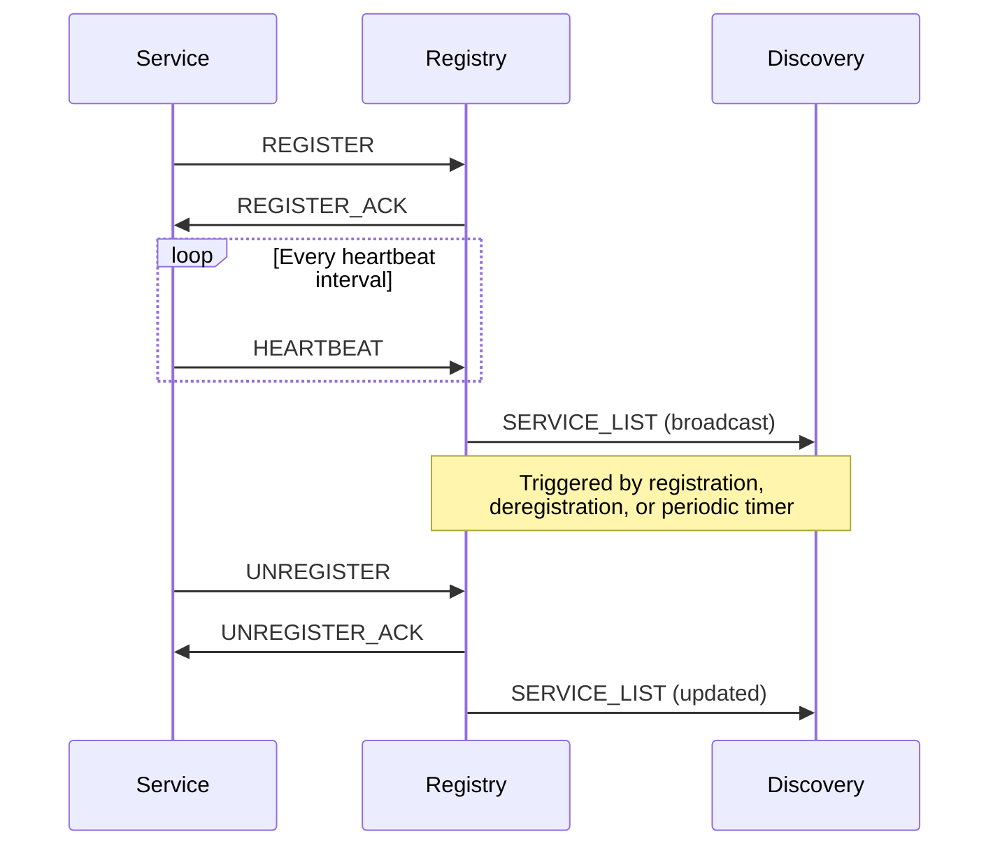

### 4.3 SERVICE_LIST 포맷
```
Frame 0: msgId = 0x0005
Frame 1: registry_id (uint32_t)
Frame 2: list_seq (uint64_t)
Frame 3: service_count (uint32_t)
Frame 4~N: Service entries (repeated service_count times)
  - service_type (uint16_t)
  - service_name (string)
  - provider_count (uint32_t)
  - provider entries (repeated provider_count times):
      service_role (uint16_t), endpoint (string),
      routing_id, weight (uint32_t)
```

## 5. SPOT 내부 구현

### 5.1 구조
- `spot_node_t` -- 네트워크 제어
  - PUB/SUB 소켓 소유, mesh 관리, worker 스레드
- `spot_pub_t` -- 발행 핸들
  - spot_node_t의 publish 위임, tag 기반 유효성 검증
- `spot_sub_t` -- 구독/수신 핸들
  - 내부 큐, 패턴 매칭, 조건변수 기반 blocking recv

### 5.2 동시성 모델
- 발행: 호출자 스레드에서 직접 수행,
  `_publish_sync` mutex로 직렬화 (thread-safe)
- 수신: worker 스레드가 SUB 소켓에서 수신,
  spot_sub_t 내부 큐로 분배
- 잠금 순서: `_sync` → `_publish_sync` (데드락 방지)
- 비동기 큐 없이 직접 발행 (publish path에 메시지 버퍼링 없음)

### 5.3 구독 집계
- refcount 기반 SUB 필터 관리
- 동일 토픽의 중복 구독 시 refcount 증가
- spot_sub_t별 구독 셋 관리 (정확한 토픽 + 패턴 별도)

### 5.4 전달 정책
- 로컬 publish (spot_pub):
  로컬 spot_sub 분배 + PUB 송출 (원격 전파)
- 원격 수신 (SUB):
  로컬 spot_sub 분배만 (재발행 없음, 루프 방지)

### 5.4.1 SpotNode HWM 경계
- unified `Spot` handle HWM 과 SpotNode internal HWM 은 다른 계층이다.
- `Spot` handle HWM 은 public facade pub/sub 소켓을 제어한다.
- `SpotNode` HWM 은 internal data-plane budget 이며 방향별로 적용된다.
  - `SNDHWM` → `fanout`, `mesh_pub`
  - `RCVHWM` → `ingress`, `mesh_xsub`
- SpotNode internal data-plane HWM 기본값은 `1000` 이다.
- `peer_ctrl` 는 control-plane 소켓이므로 SpotNode data-plane HWM 묶음에
  포함하지 않는다.

### 5.5 Raw 소켓 정책
- `spot_pub_t`: raw PUB socket 노출하지 않음
  (thread-safety 우회 방지)
- `spot_sub_t`: raw SUB socket 노출하지 않음;
  callback/recv API로만 소비

### 5.6 Discovery 타입 분리
- service_type 필드로 spot_node/socket_family 분리
  - `service_type_spot_node` (2), `service_type_socket` (3)
- 소켓 패밀리 서비스는 추가로 `service_role` 필드를 가진다
  (ROUTER=3, DEALER=4, PUB=5, SUB=6) — 역할 기반 피어 매칭용
- 역할 매칭은 `service_roles_match()`가 강제한다 — PUB은 SUB과 짝,
  ROUTER/DEALER는 서로 짝을 이룬다

## 6. SPOT 내부 아키텍처

SPOT/SpotNode 내부 아키텍처의 상세 내용 — 컴포넌트 다이어그램, 11개 내부
소켓 (타입/endpoint/HWM), 토픽 및 routed 메시지 흐름 시퀀스, control plane,
data plane polling — 은 별도 문서를 참고: **[SPOT 내부 구조](spot-internals.ko.md)**.

### 6.1 컴포넌트 다이어그램

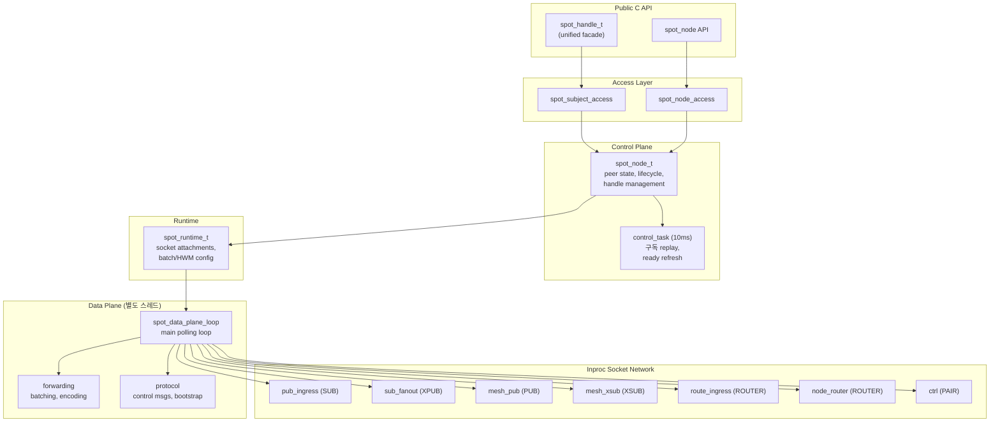

### 6.2 Inproc 소켓 토폴로지

모든 inproc 경로: `inproc://zlink.spot.{node_id}.{purpose}`

| Endpoint | 소켓 타입 | 방향 | 용도 |
|----------|----------|------|------|
| `.pub-in` | SUB | local pub → data plane | 토픽 publish 수신 |
| `.sub-out` | XPUB | data plane → local sub | 토픽 subscribe 배포 |
| `.route-in` | ROUTER | local sender → data plane | Routed 메시지 수신 |
| `.node-router` | ROUTER | data plane → local receiver | Routed 메시지 전달 |
| `.ctrl` | PAIR | control plane ↔ data plane | 내부 명령 |

### 6.3 토픽 메시지 내부 흐름

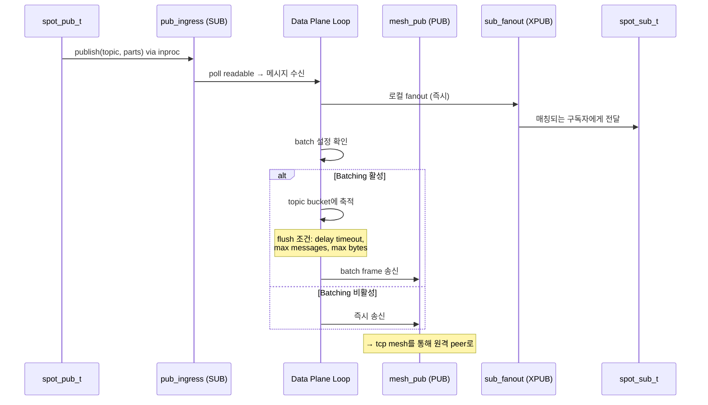

### 6.4 Routed 메시지 내부 흐름

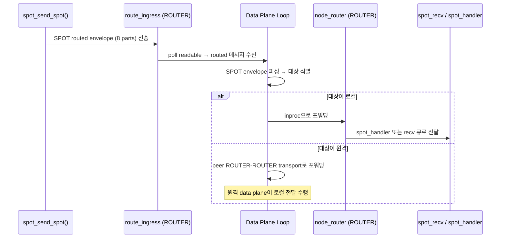

### 6.5 SPOT Request-Reply Dispatch

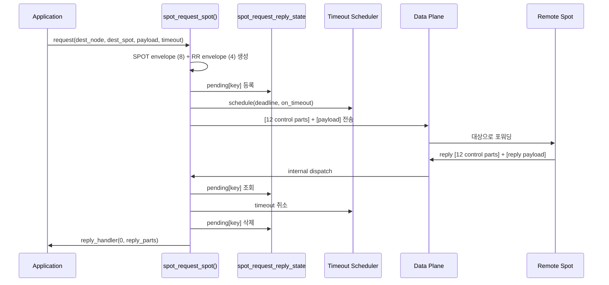

### 6.6 SPOT routed request-reply 조합

SPOT request-reply 는 topic fanout 경로와 별도 상태를 가진다. 구현은 local
runtime 에서 다음 세 단계를 거친다.

1. SPOT routed envelope 8개 part decode
2. 남은 payload 앞의 request-reply envelope 4개 part decode
3. request 면 local handler dispatch, reply 면 pending map completion

의미를 나눠 보면 다음과 같다.

- SPOT routed envelope: source/destination node, spot, router 주소
- request-reply envelope: `message_type`, `request_seq`
- payload: application body

### 6.7 pending 구조

socket request-reply 와 SPOT request-reply 는 각자 다른 pending key 를 쓴다.

```cpp
struct pending_key_t {
    std::string peer_rid;
    uint64_t request_seq;
};

struct pending_spot_key_t {
    uint8_t source_class;
    std::string source_rid;
    std::string source_spot_rid;
    uint64_t request_seq;
};
```

정리:

- `DEALER` 는 `request_seq` 만으로 reply 를 찾는다.
- `ROUTER` 는 `peer_rid + request_seq` 조합으로 reply 를 찾는다.
- `spot -> spot` 은 source class 와 source 주소까지 함께 본다.
- `router -> spot` 은 local router state 에서 `request_seq` 로 관리한다.

이렇게 나누는 이유는 같은 `request_seq` 가 다른 상대 주소에서 동시에 보일 수
있기 때문이다.

### 6.8 timeout 과 완료

각 request 시작 시 pending entry 를 넣고 timeout thread 를 함께 건다.

- per-call timeout 이 있으면 그 값을 사용
- 없으면 socket 기본 timeout 사용
- 둘 다 없으면 `5000ms`

timeout 이 먼저 오면 pending entry 를 지우고 `ETIMEDOUT` 로 callback 한다.
reply 가 먼저 오면 pending entry 를 지우고 timeout thread 는 나중에 깨어나도
아무 일도 하지 않는다.

추가 reply 처리 규칙:

- 첫 reply 로 이미 완료된 key 는 pending map 에서 제거된다.
- 이후 같은 key 로 reply 가 와도 조용히 drop 한다.
- `error reply` 는 payload 첫 part 의 4바이트 errno 를 읽어 실패 completion 으로
  바꾼다.

## 7. Request-Reply Dispatch 아키텍처

### 7.1 소켓 수준 Dispatch 컴포넌트

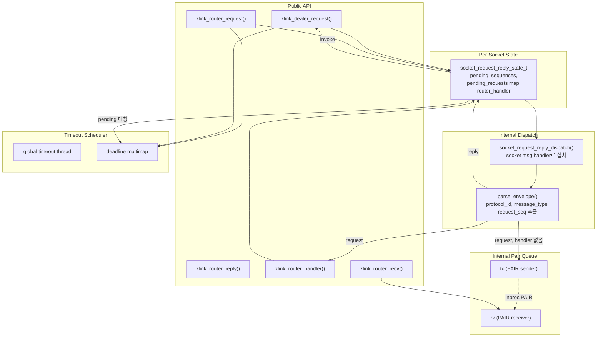

### 7.2 Dispatch 시퀀스 (Handler 모드)

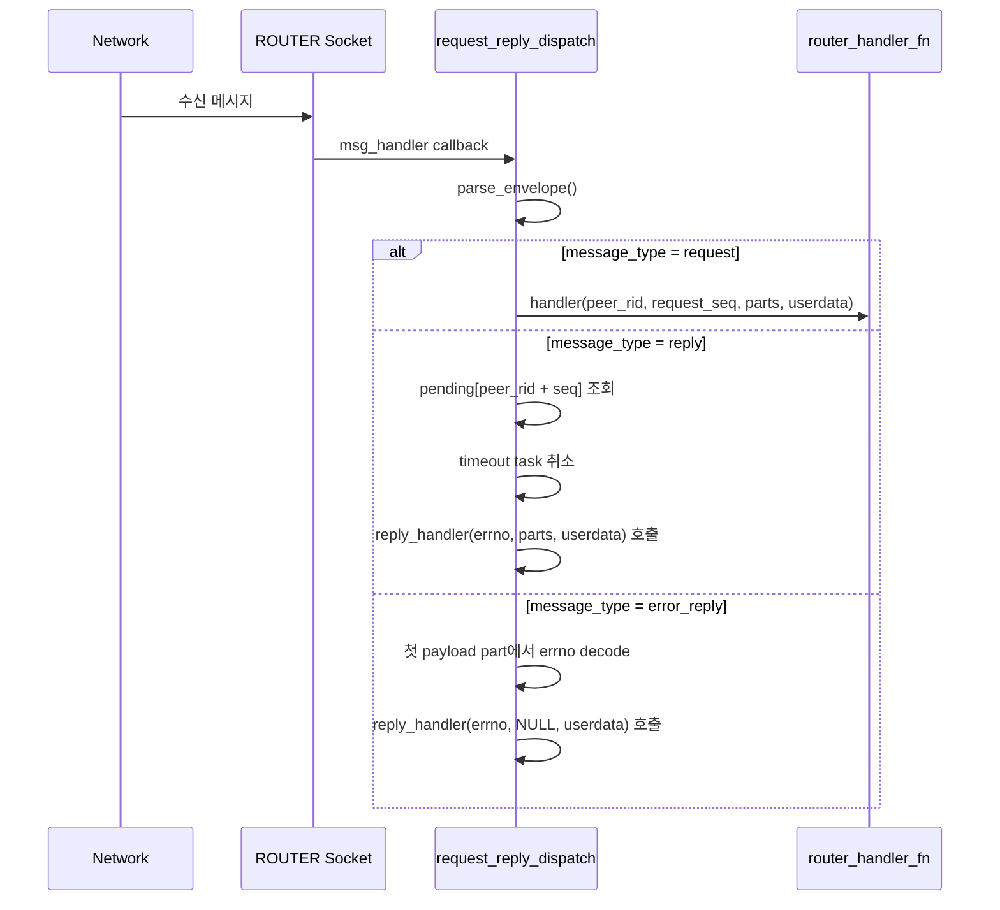

### 7.3 Dispatch 시퀀스 (Recv/Pull 모드)

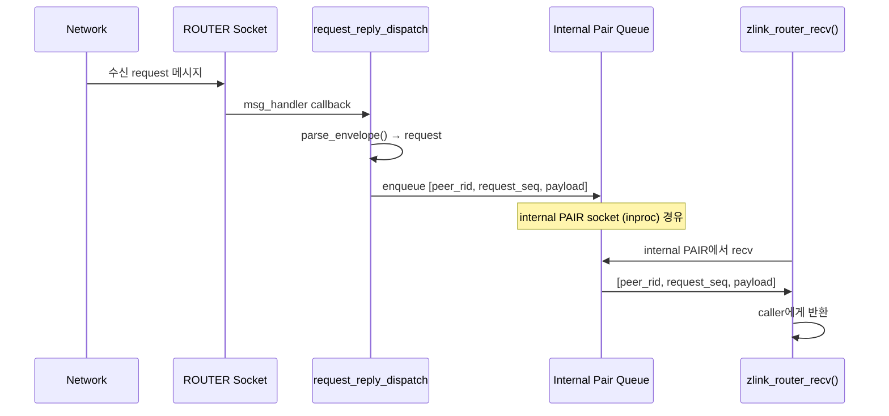

## 8. Timer 및 Scheduler 아키텍처

### 8.1 컴포넌트 다이어그램

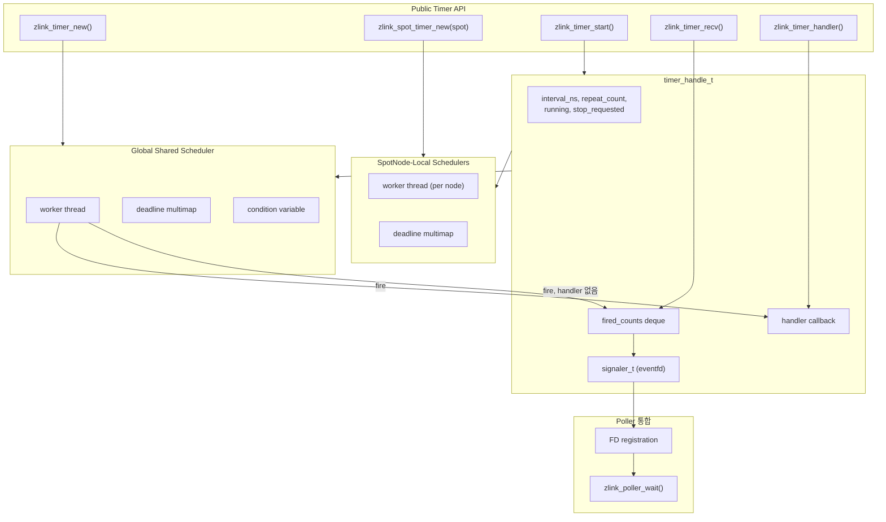

### 8.2 Timer Fire 시퀀스

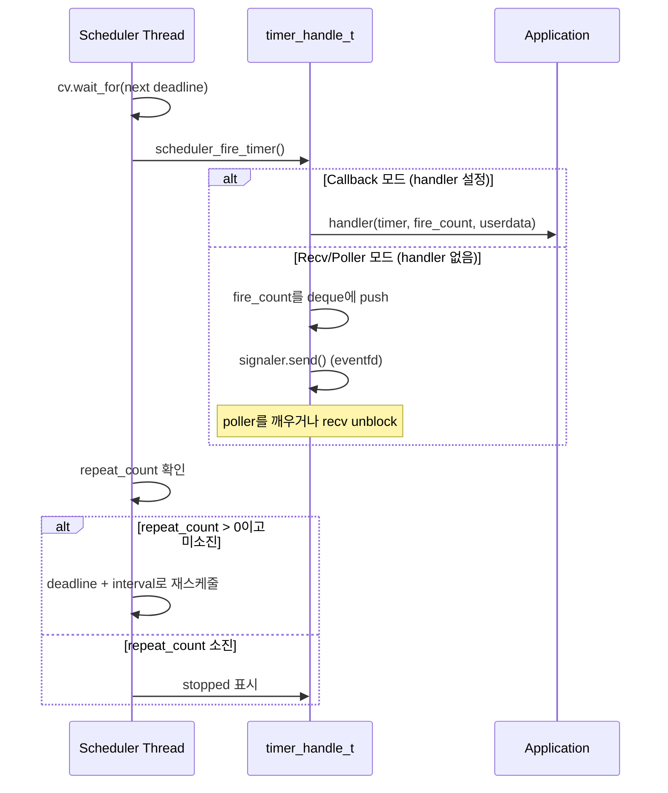

### 8.3 Request Timeout Scheduler

Request timeout scheduler는 timer scheduler와 **별도**이다.
Request-reply timeout 전용 스케줄러이다.

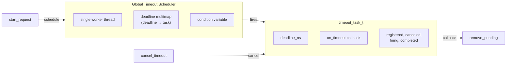

- 모든 request timeout을 위한 단일 global thread
- 다수의 단기 timeout에 효율적
- 취소 지원 및 fire/cancel 경합 해소

## 9. Internal Pair Queue 메커니즘

Internal pair queue는 I/O 스레드의 internal dispatch와 application 스레드의
user recv 호출 사이를 중계한다.

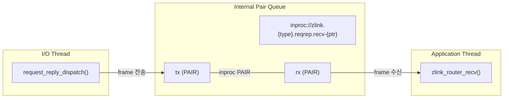

구조:

```cpp
struct internal_pair_queue_t {
    socket_base_t *rx;     // 수신 (application thread)
    socket_base_t *tx;     // 송신 (dispatch thread)
    std::string endpoint;  // 고유 inproc endpoint
};
```

Queue 생성 (`ensure()`):
1. 고유 inproc endpoint 생성
2. PAIR 소켓 2개 생성: rx (bind), tx (connect)
3. 양방향 handshake (0x11 → 0x22 → back)
4. linger = 0 설정 (clean shutdown)

ROUTER recv queue frame 인코딩:
- Frame 1: `peer_rid` 바이트
- Frame 2: `request_seq` (8바이트 Big Endian)
- Frame 3+: Payload parts
