[English](services-internals.md) | [한국어](services-internals.ko.md)

# Service Layer Internal Design

## 1. Overview

The zlink service layer provides two high-level services: Discovery and SPOT. This document covers the internal implementation details.

For SPOT, transport-security ownership is intentionally narrow: the
`SpotNode` owns TLS/WSS wiring for mesh/control sockets, while unified
`Spot` remains a borrowed data-plane facade only. The facade never owns
node lifecycle and is not itself a TLS configuration surface.

## 2. Registry Internal Implementation

### 2.1 Data Structures

```cpp
struct service_entry_t {
    std::string service_name;
    std::string endpoint;
    zlink_routing_id_t routing_id;
    uint16_t service_role;
    uint64_t registered_at;
    uint64_t last_heartbeat;
    uint32_t weight;
};

struct registry_state_t {
    uint32_t registry_id;
    uint64_t list_seq;
    std::map<std::string, std::vector<service_entry_t>> services;
};
```

### 2.2 Registry State Machine

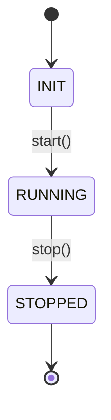

### 2.3 SERVICE_LIST Broadcast Triggers
| Trigger | Description |
|--------|------|
| Registration | After successful service REGISTER |
| Deregistration | UNREGISTER or Heartbeat timeout |
| Periodic | 30 seconds (default, configurable) |

### 2.4 Cluster Synchronization
- Each Registry subscribes to other Registries' PUB via SUB
- Immediate propagation via flooding
- Duplicates/reversals ignored using registry_id + list_seq

## 3. Discovery Internal Implementation

### 3.1 State Machine (Per Service)

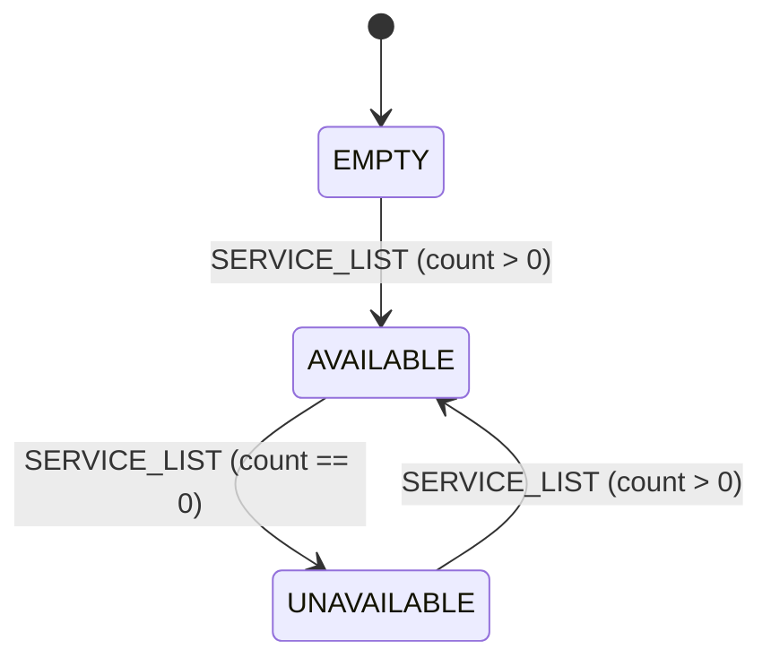

### 3.2 Service Types and Roles

Discovery tracks providers with a (service_type, service_role) pair:

```cpp
// Service types
static const uint16_t service_type_spot_node = 2;
static const uint16_t service_type_socket = 3;

// Service roles
enum service_role_t {
    service_role_invalid = 0,
    service_role_spot    = 2,  // fixed for spot type
    service_role_router  = 3,  // socket family
    service_role_dealer  = 4,  // socket family
    service_role_pub     = 5,  // socket family
    service_role_sub     = 6   // socket family
};
```

SPOT has a fixed role derived from its service type. Socket family
services require an explicit role matching the socket type. Role
matching rules for peer discovery:
- PUB ↔ SUB
- ROUTER ↔ ROUTER, ROUTER ↔ DEALER, DEALER ↔ DEALER
- SPOT ↔ SPOT

### 3.3 Discovery-Owned Service Execution

Discovery acts as the lifecycle owner for attached services. Each service
type registers its endpoint(s) through the `discovery_owned_service`
convenience API:

```cpp
namespace discovery_owned_service {
    int register_endpoint(discovery_t *, uint16_t service_type,
                          const char *endpoint, uint32_t weight,
                          std::string *resolved_endpoint_out,
                          const zlink_routing_id_t *routing_id = NULL,
                          uint16_t service_role = 0);
    int update_weight(discovery_t *, uint16_t service_type,
                      const char *endpoint, uint32_t weight,
                      uint16_t service_role = 0);
    int unregister_endpoint(discovery_t *, uint16_t service_type,
                            const char *endpoint,
                            uint16_t service_role = 0);
}
```

Discovery internally maintains a `_registered_services` map keyed by
`(service_type, service_role, service_name, endpoint)` and periodically
refreshes heartbeats for all registered services via
`refresh_registered_service_heartbeats()`.

### 3.4 Socket Discovery Attachment

`socket_discovery_attachment_t` integrates raw socket lifecycle with
Discovery. When a socket is attached:

1. Validates the socket type is supported (ROUTER/DEALER/PUB/SUB)
2. Derives the service role from the socket type
3. Registers the socket's bound endpoint via `discovery_owned_service`
4. Observes service list updates and refreshes peer connections
5. Reports topology state changes back to Discovery
6. Blocks manual connect/disconnect/unbind/close operations

### 3.5 Subscription Behavior
- Subscribes to all Registry PUB (no network-level filtering)
- subscribe/unsubscribe operate as internal filters

### 3.6 Duplicate/Reversal Handling
- Applies only the latest snapshot based on (registry_id, list_seq)
- Ignores earlier list_seq from the same registry_id

## 4. Message Protocol

### 4.1 Frame Structure
```
Frame 0: msgId (uint16_t)
Frame 1~N: Payload (variable)
```

### 4.2 Message Types
| msgId | Name | Direction |
|-------|------|------|
| 0x0001 | REGISTER | Service → Registry |
| 0x0002 | REGISTER_ACK | Registry → Service |
| 0x0003 | UNREGISTER | Service → Registry |
| 0x0004 | HEARTBEAT | Service → Registry |
| 0x0005 | SERVICE_LIST | Registry → Discovery |
| 0x0006 | REGISTRY_SYNC | Registry → Registry |
| 0x0007 | UPDATE_ATTRIBUTES | Service → Registry |
| 0x0008 | BOOTSTRAP_REQ | Discovery → Registry |
| 0x0009 | BOOTSTRAP_REP | Registry → Discovery |
| 0x000A | TOPOLOGY_REPORT | Discovery → Registry |
| 0x000B | TOPOLOGY_QUERY | Client → Registry |
| 0x000C | TOPOLOGY_REPLY | Registry → Client |
| 0x000D | UNREGISTER_ACK | Registry → Service |

#### Registration and Heartbeat Flow

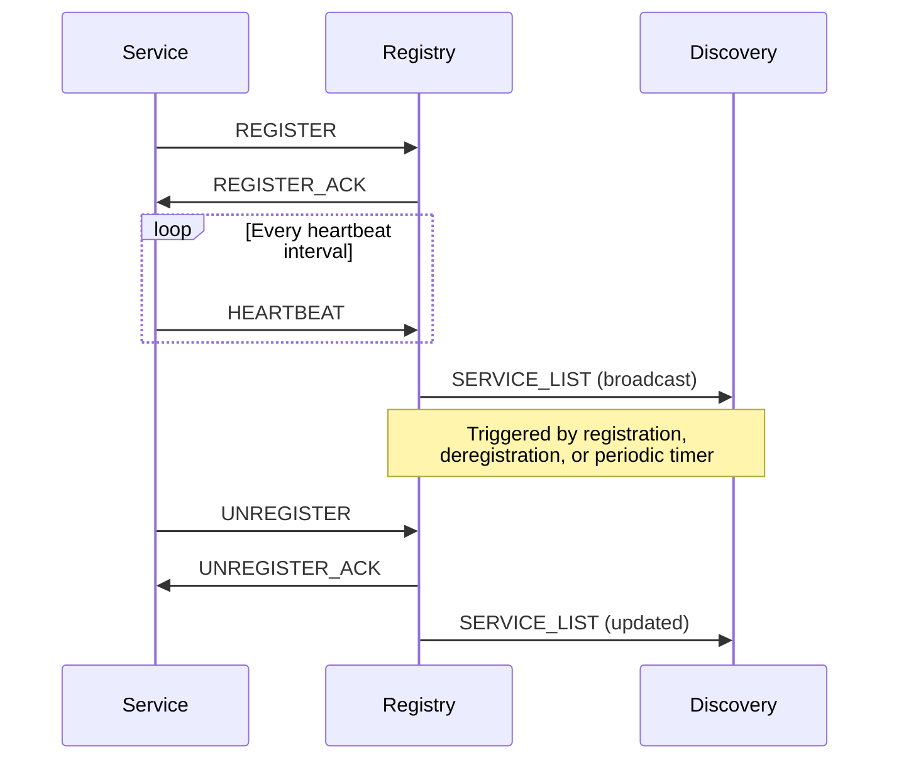

### 4.3 SERVICE_LIST Format
```
Frame 0: msgId = 0x0005
Frame 1: registry_id (uint32_t)
Frame 2: list_seq (uint64_t)
Frame 3: service_count (uint32_t)
Frame 4~N: Service entries (repeated service_count times)
  - service_type (uint16_t)
  - service_name (string)
  - provider_count (uint32_t)
  - provider entries (repeated provider_count times):
      service_role (uint16_t), endpoint (string),
      routing_id, weight (uint32_t)
```

## 5. SPOT Internal Implementation

### 5.1 Structure
- `spot_node_t` -- Network control (owns PUB/SUB sockets, mesh management, worker thread)
- `spot_pub_t` -- Publish handle (delegates to spot_node_t's publish, tag-based validity check)
- `spot_sub_t` -- Subscribe/receive handle (internal queue, pattern matching, condition variable-based blocking recv)

### 5.2 Concurrency Model
- Publishing: Performed directly on the caller's thread, serialized by `_publish_sync` mutex (thread-safe)
- Receiving: Worker thread receives from SUB socket → distributes to spot_sub_t internal queues
- Lock ordering: `_sync` → `_publish_sync` (deadlock prevention)
- Direct publishing without async queue (no message buffering on the publish path)

### 5.3 Subscription Aggregation
- Refcount-based SUB filter management
- Duplicate subscriptions to the same topic increment the refcount
- Per-spot_sub_t subscription set management (separate for exact topics and patterns)

### 5.4 Delivery Policy
- Local publish (spot_pub) → local spot_sub distribution + PUB output (remote propagation)
- Remote receive (SUB) → local spot_sub distribution only (no re-publishing, loop prevention)

### 5.4.1 SpotNode HWM Boundaries
- Unified `Spot` handle HWM and SpotNode internal HWM are different layers.
- `Spot` handle HWM controls the public facade pub/sub sockets.
- `SpotNode` HWM is the internal data-plane budget and is applied by direction:
  - `SNDHWM` → `fanout`, `mesh_pub`
  - `RCVHWM` → `ingress`, `mesh_xsub`
- The default SpotNode internal data-plane HWM is `1000`.
- `peer_ctrl` is a control-plane socket and is not grouped into the SpotNode
  data-plane HWM family.

### 5.5 Raw Socket Policy
- `spot_pub_t`: Does not expose raw PUB socket (prevents thread-safety bypass)
- `spot_sub_t`: Does not expose raw SUB socket; consumption is via callback/recv API only

### 5.6 Discovery Type Segmentation
- Separates spot_node/socket_family via service_type field
  - `service_type_spot_node` (2), `service_type_socket` (3)
- Socket family services additionally carry a `service_role` field
  (ROUTER=3, DEALER=4, PUB=5, SUB=6) for role-based peer matching
- Role matching is enforced by `service_roles_match()` -- PUB pairs with SUB,
  ROUTER/DEALER pair with each other

## 6. SPOT Internal Architecture

For detailed SPOT/SpotNode internal architecture including component
diagrams, all 11 internal sockets with types/endpoints/HWM, topic and
routed message flow sequences, control plane, and data plane polling,
see the dedicated document: **[SPOT Internals](spot-internals.md)**.

### 6.1 Component Diagram

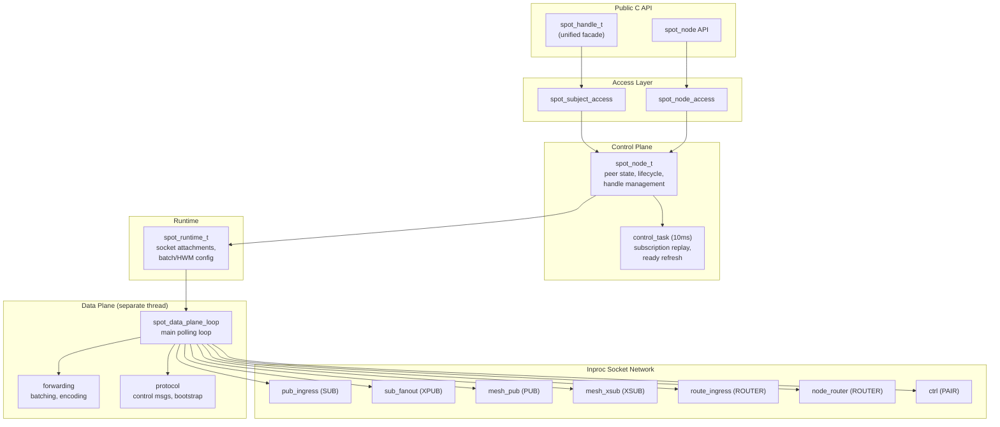

### 6.2 Inproc Socket Topology

All inproc paths: `inproc://zlink.spot.{node_id}.{purpose}`

| Endpoint | Socket Type | Direction | Purpose |
|----------|------------|-----------|---------|
| `.pub-in` | SUB | local pubs → data plane | Topic publish ingress |
| `.sub-out` | XPUB | data plane → local subs | Topic subscribe fanout |
| `.route-in` | ROUTER | local senders → data plane | Routed message ingress |
| `.node-router` | ROUTER | data plane → local receivers | Routed message delivery |
| `.ctrl` | PAIR | control plane ↔ data plane | Internal commands |

### 6.3 Topic Message Internal Flow

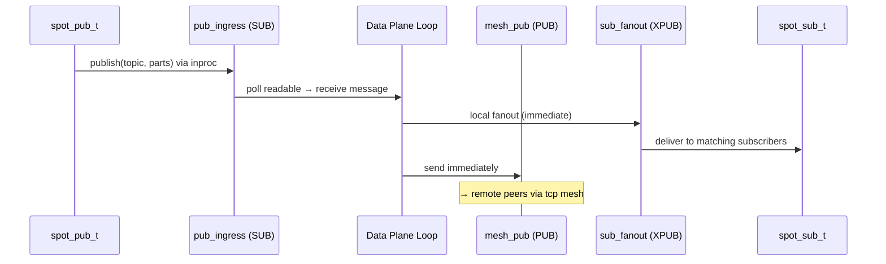

### 6.4 Routed Message Internal Flow

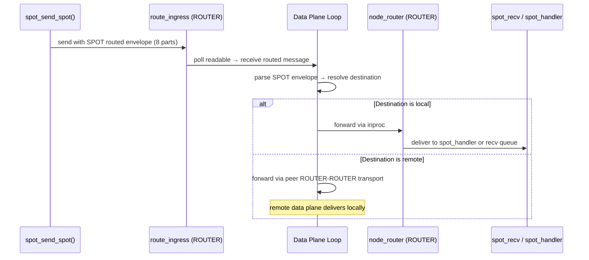

### 6.5 SPOT Request-Reply Dispatch

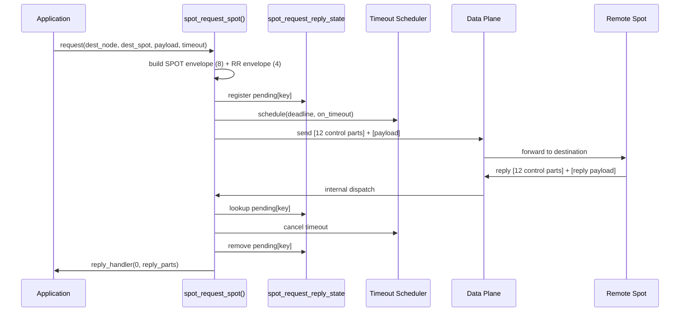

### 6.6 SPOT Routed Request-Reply Combination

SPOT request-reply has separate state from the topic fanout path.
The implementation decodes in three stages:

1. Decode SPOT routed envelope (8 control parts)
2. Decode request-reply envelope (4 control parts) from remaining payload
3. If request → dispatch to local handler; if reply → complete pending map

Structure:

- SPOT routed envelope: source/destination node, spot, router addresses
- request-reply envelope: `message_type`, `request_seq`
- payload: application body

### 6.7 Pending Structures

Socket request-reply and SPOT request-reply use different pending keys:

```cpp
struct pending_key_t {          // Socket level
    std::string peer_rid;
    uint64_t request_seq;
};

struct pending_spot_key_t {     // SPOT level
    uint8_t source_class;
    std::string source_rid;
    std::string source_spot_rid;
    uint64_t request_seq;
};
```

| API | Pending Key | Reason |
|-----|------------|--------|
| DEALER | `request_seq` only | Single peer, seq is unique |
| ROUTER | `source_node_rid + request_seq` | Multiple peers may reuse seq. For SPOT-originated routed traffic, `source_spot_rid` is also carried through the dispatch path so the unified router handler can distinguish plain vs. SPOT-routed callers |
| spot → spot | `source_class + source_address + request_seq` | Multiple sources |
| router → spot | `request_seq` | Local router state |

### 6.8 Timeout and Completion

Each request registers a pending entry with a timeout task:

- Per-call timeout is used if provided
- Otherwise socket/spot default timeout applies
- If both are 0, implementation default `5000ms` applies

Completion rules:

- Timeout fires first → remove pending, callback with `ETIMEDOUT`
- Reply arrives first → remove pending, cancel timeout (no-op if already fired)
- Extra replies to a completed key are silently dropped
- `error_reply` reads 4-byte errno from first payload part → failure completion

## 7. Request-Reply Dispatch Architecture

### 7.1 Socket-Level Dispatch Component Diagram

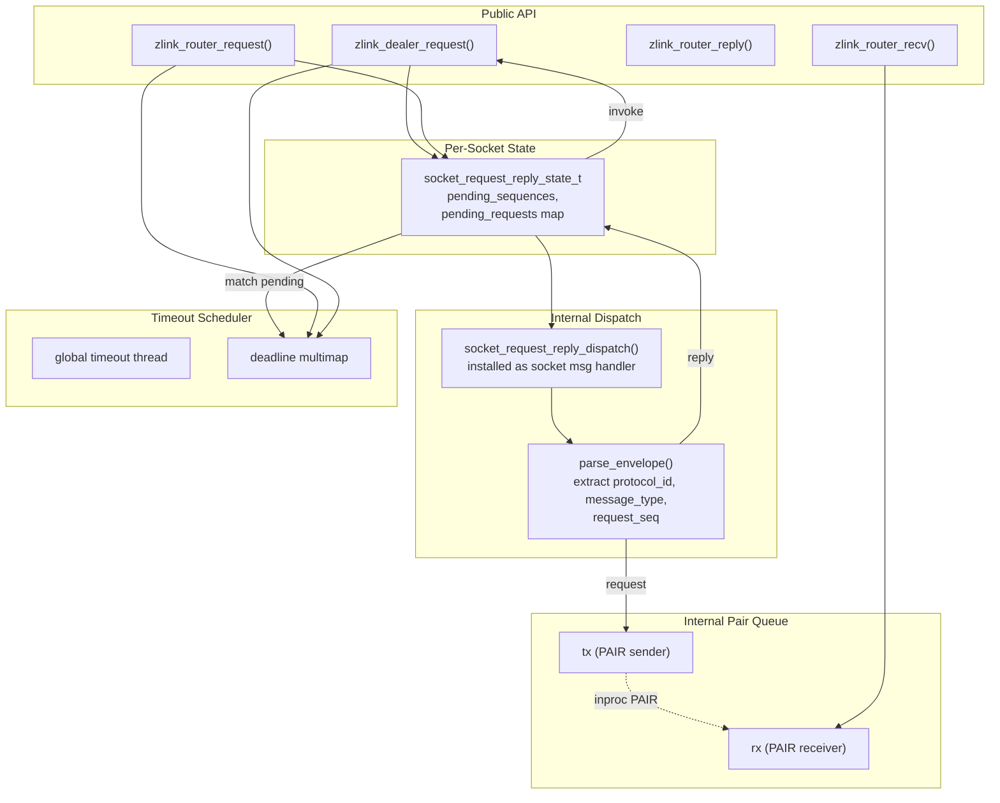

### 7.2 Dispatch Sequence (Reply Completion)

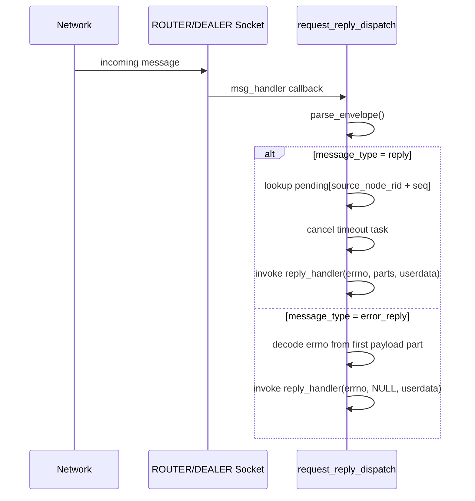

### 7.3 Dispatch Sequence (Router Recv Path)

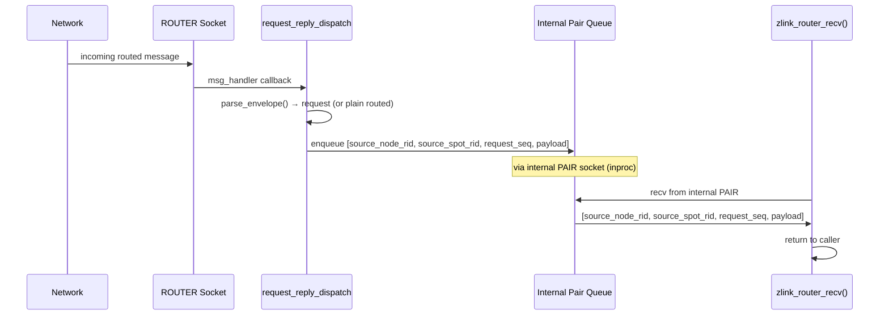

## 8. Timer and Scheduler Architecture

### 8.1 Component Diagram

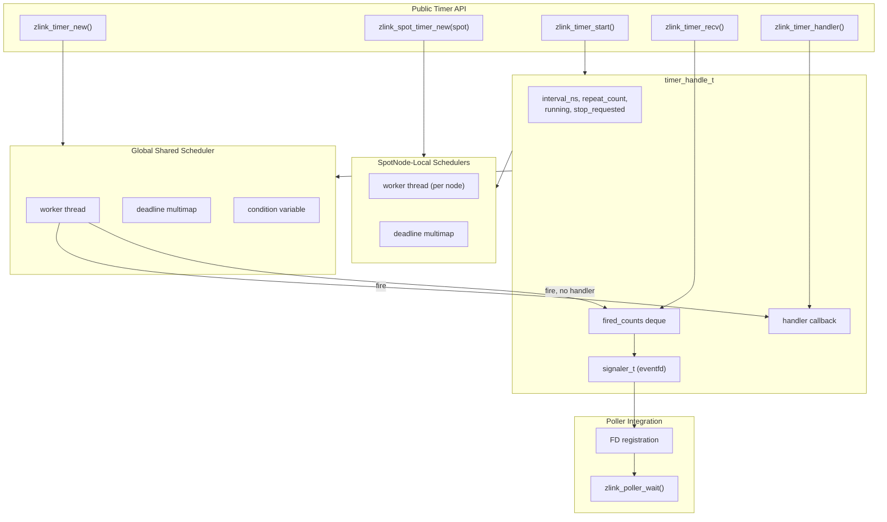

### 8.2 Timer Fire Sequence

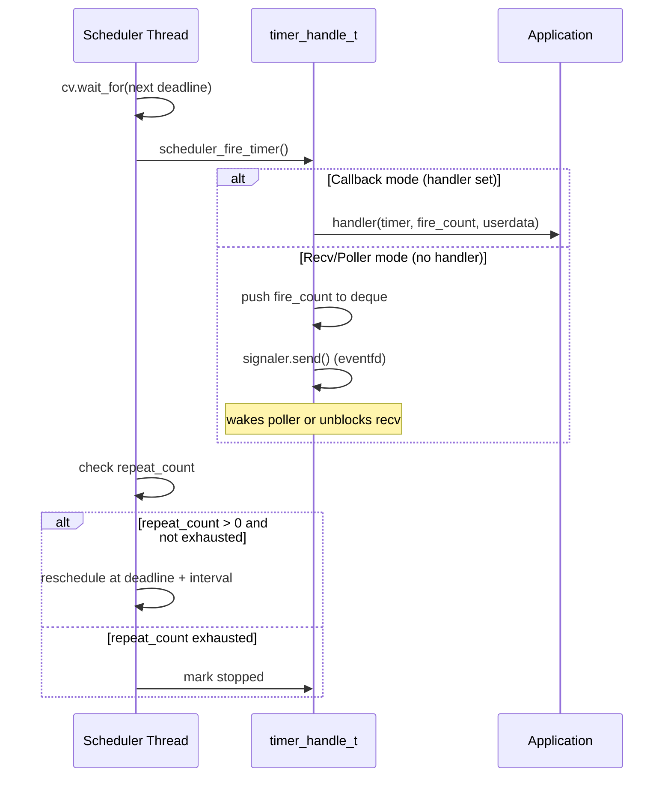

### 8.3 Request Timeout Scheduler

The request timeout scheduler is **separate** from the timer scheduler.
It is dedicated to request-reply timeout management.

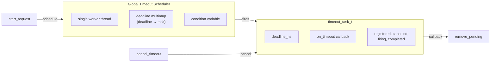

- Single global thread for all request timeouts
- Efficient for many short-lived timeouts
- Task has cancel support with fire/cancel race resolution

## 9. Internal Pair Queue Mechanism

The internal pair queue bridges the gap between internal dispatch
(on the I/O thread) and user recv calls (on the application thread).

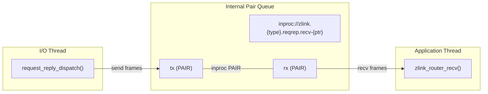

Structure:

```cpp
struct internal_pair_queue_t {
    socket_base_t *rx;     // receive side (application thread)
    socket_base_t *tx;     // send side (dispatch thread)
    std::string endpoint;  // unique inproc endpoint
};
```

Queue creation (`ensure()`):
1. Generate unique inproc endpoint
2. Create two PAIR sockets: rx (bind), tx (connect)
3. Bidirectional handshake (0x11 → 0x22 → back)
4. Set linger = 0 for clean shutdown

Frame encoding for ROUTER recv queue (unified routed surface — the
queue carries both plain ROUTER traffic and SPOT-originated routed
traffic through the same framing):
- Frame 1: `source_node_rid` bytes
- Frame 2: `source_spot_rid` bytes (zero length for plain ROUTER traffic)
- Frame 3: `request_seq` (8 bytes Big Endian; `0` for fire-and-forget)
- Frame 4+: Payload parts

## 10. Admission state propagation

Both raw ROUTER and SpotNode drive their own admission state through
`zlink_set_admission_state()`. Internally each subject advertises the
change to its connected peers as a **best-effort runtime signal**, and
each peer updates its admission cache so outbound candidate selection
reflects the new state.

Baseline behavior:

- A state change is applied to the local cache immediately. Other local
  outbound paths on the same node (e.g. local spot or router send) see the
  new state right away.
- Peer-side propagation flows through the SpotNode peer control path
  (`peer_ctrl_pub` / `peer_ctrl_sub`) and through the dedicated raw socket
  admission signal path. The signal is a best-effort runtime control
  message; no strong synchronous model is provided.
- After reconnect the admission state resyncs. When a new session becomes
  ready the subject re-advertises its current admission state once so a
  stale cache does not cause incorrect candidate selection.
- When a peer's cache shows `DRAINING`, the peer drops that target from
  outbound candidate selection. If every candidate is `DRAINING`, the
  submit path normalizes to `ZLINK_SUBMIT_NOT_ADMITTED`. Under races where
  connection state changes are observed before the admission cache update,
  the same refusal may surface first as `ZLINK_SUBMIT_NOT_CONNECTED` or
  `ZLINK_SUBMIT_NOT_FOUND`.
- Raw socket changes are exposed to the application via the socket monitor
  event `ZLINK_EVENT_PEER_ADMISSION_CHANGED`. SpotNode changes use the
  service monitor event
  `ZLINK_SERVICE_MONITOR_EVENT_PEER_ADMISSION_CHANGED`. The implementation
  carries both the peer identifier (`routing_id`) and the new admission
  state inside the same event payload.

## 11. Pairwise initiator rule (Discovery auto-connect)

When two ROUTERs in the same service discover each other via Discovery,
the library decides internally that exactly one side dials. This is an
internal Discovery auto-connect rule, not a user-facing knob.

Comparison procedure:

1. Verify that local and remote share the same `service_name` and that
   both sides are in ROUTER role.
2. Build a stable comparison key for each side. The primary key is the
   `routing_id`; if `routing_id` is equal, the advertised endpoint string
   is used as the tie-break.
3. If the local key compares less than the remote key, the local side is
   chosen as initiator. Otherwise the local side does not generate the
   connect.
4. Both peers compute the same total order from the same inputs, so each
   pair has exactly one initiator.

Interaction with provider-snapshot refresh:

- Discovery sees a new provider set on every SERVICE_LIST update. Because
  the comparison is deterministic for any pair, snapshot refresh does not
  flap the initiator direction.
- Environments where `routing_id` changes after restart may see the
  initiator direction flip on the next run. This is not an error: the
  contract is "exactly one side dials per pair at any given time," not
  "the same side always dials."

Relationship with manual connect and handover:

- The rule applies only to Discovery-managed auto-connect. Manual
  `zlink_connect()` calls made through the raw API are not mediated by
  the library.
- Distinct peers that happen to share the same `routing_id` are not
  resolved by this rule. Such collisions are handled by the existing
  ROUTER handover policy.
- Pairwise initiator and handover are two separate layers: the initiator
  rule prevents duplicate dials up-front, while handover cleans up
  duplicates that still appear after the fact.
