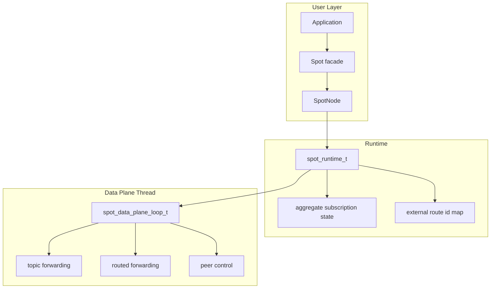
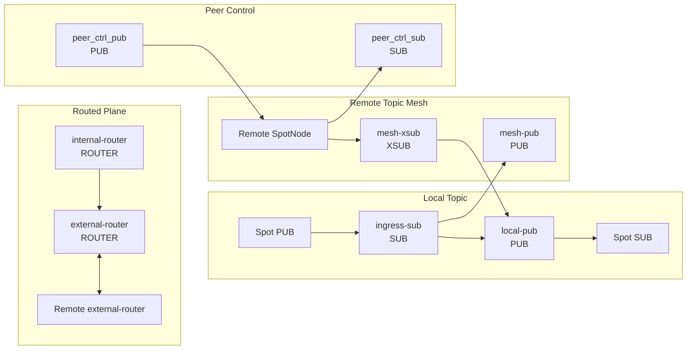
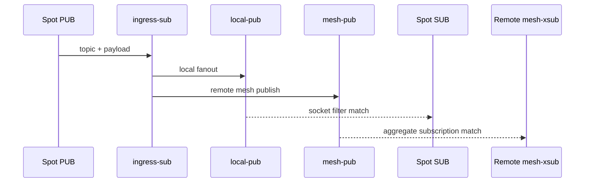
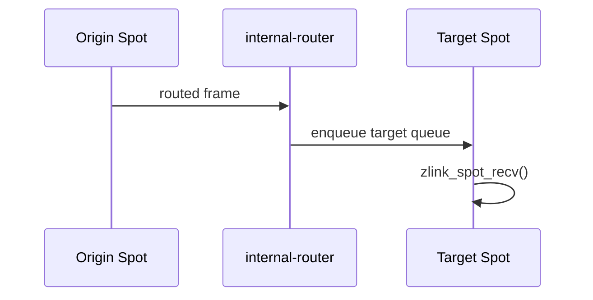
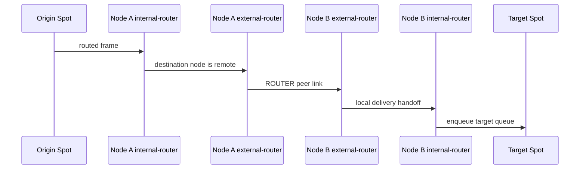
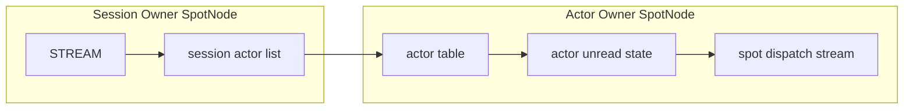

[English](spot-internals.md) | [한국어](spot-internals.ko.md)

# SPOT / SpotNode 내부 아키텍처

이 문서는 core 유지보수자가 SPOT 내부 배선과 데이터 흐름을 빠르게 파악하도록
돕는 내부 문서다. 공개 API 계약은
[`doc/spec/core/service/spot.ko.md`](../spec/core/service/spot.ko.md)를 기준으로
본다.

## 1. 전체 구조



`SpotNode`는 lifecycle owner이고, `Spot`은 그 위에서 빌려 쓰는 데이터 평면
facade다. `Spot`을 닫아도 backing `SpotNode`는 자동으로 닫히지 않는다.

## 2. 내부 소켓 토폴로지

SpotNode는 mode에 필요한 socket 묶음만 만든다.

| mode | 생성되는 주요 plane |
|------|---------------------|
| `PUBSUB` | topic publish/subscribe, peer control |
| `ROUTED` | routed delivery, peer control |
| `ALL` | topic, routed, peer control |

꺼진 plane은 snapshot 호출이나 꺼진 API의 첫 호출로도 생성되지 않는다.

### 2.1 주요 소켓



| 소켓 | 타입 | 역할 | HWM 정책 |
|------|------|------|----------|
| `ingress-sub` | `SUB` | local publish 입력 수신 | pubsub admission RCVHWM |
| `local-pub` | `PUB` | 같은 node 안의 subscriber로 fanout | relay SNDHWM 0 |
| `mesh-pub` | `PUB` | remote node로 topic publish 전파 | relay SNDHWM 0 |
| `mesh-xsub` | `XSUB` | remote node에서 topic publish 수신 | relay RCVHWM 0 |
| `internal-router` | `ROUTER` | 같은 node 안의 target `Spot`으로 routed 전달 | router admission RCVHWM, delivery SNDHWM 0 |
| `external-router` | `ROUTER` | peer node와 routed frame 송수신 | relay HWM 0 |
| `peer_ctrl_pub` | `PUB` | peer control 송신 | control 기본값 |
| `peer_ctrl_sub` | `SUB` | peer control 수신 | control 기본값 |

`zlink_spot_node_internal_sockets_snapshot()`은 실제 존재하는 socket만 반환한다.
perf의 `Auto-HWM spotnode` 표도 이 snapshot 이름을 그대로 사용한다.

## 3. Topic plane

topic plane은 local과 remote 모두 socket의 기본 subscription filter를 사용한다.
runtime은 publish 시점에 target index를 조회하지 않는다.



local subscriber의 실제 topic matching은 각 `Spot SUB`의 `SUBSCRIBE` 상태가 맡는다.
remote 전달의 matching은 peer node의 `mesh-xsub` aggregate subscription 상태가
맡는다.

### 3.1 Aggregate subscription 수명

runtime은 remote mesh에 반영할 node 단위 구독 수명을 따로 관리한다.

| 상태 | 자료구조 | 의미 |
|------|----------|------|
| exact topic | `topic -> refcount` | 같은 exact topic을 원하는 local subscriber 수 |
| prefix | `prefix -> refcount` | 같은 prefix를 원하는 local subscriber 수 |

규칙은 단순하다.

1. refcount가 `0 -> 1`이 될 때만 remote aggregate subscribe를 보낸다.
2. refcount가 `1 -> 0`이 될 때만 remote aggregate unsubscribe를 보낸다.
3. 중간 증가와 감소는 local 상태만 바꾸며 remote mesh에는 중복 명령을 보내지 않는다.

이 규칙 때문에 같은 node 안의 여러 `Spot`이 같은 topic을 구독해도 remote peer에는
하나의 node 대표 구독만 보인다.

## 4. Routed plane

routed plane은 두 router 축으로 고정된다.

| router | 범위 | 역할 |
|--------|------|------|
| `internal-router` | node 내부 | target `Spot`의 routed recv queue로 전달 |
| `external-router` | node 간 | peer node의 `external-router`와 ROUTER 링크로 송수신 |

별도 routed ingress broker나 topic mesh 우회 경로는 없다. local routed delivery는
`internal-router`, remote routed delivery는 `external-router`를 기준으로 추적한다.

### 4.1 Local routed delivery



local routed 전달은 내부 전달 큐가 커졌다는 이유로 target을 disconnected 상태로
만들지 않는다. 역압력은 `internal-router` 수신 쪽 admission HWM에서 먼저
표현되고, 애플리케이션이 큐를 비우면 일반 수신 API가 더 읽을 데이터가 없다고
알린다.

### 4.2 Remote routed delivery



remote routed delivery는 peer별 external route id map을 사용한다. 이 map은
`spot_runtime_t` 내부 메서드를 통해서만 갱신한다. 호출자는 map 구조나 lock 규칙을
알 필요가 없다.

## 5. Admission HWM

SpotNode는 admission HWM 설정만 공개한다. 이 설정은 데이터 평면이 소유하기
전의 local 입력량을 제한한다.

| 옵션 | admission 경로 | 기본 profile 값 |
|------|----------------|-----------------|
| `ZLINK_SPOT_NODE_OPT_PUBSUB_HWM_PROFILE` | topic publish admission | balanced = 16 |
| `ZLINK_SPOT_NODE_OPT_PUBSUB_HWM` | topic publish admission 숫자 override | 양수 값, `0`은 reset |
| `ZLINK_SPOT_NODE_OPT_ROUTER_HWM_PROFILE` | routed admission | balanced = 16 |
| `ZLINK_SPOT_NODE_OPT_ROUTER_HWM` | routed admission 숫자 override | 양수 값, `0`은 reset |

공유 relay와 delivery socket은 HWM `0`을 사용한다. 이렇게 해야 SPOT 내부의 숨은
peer별 또는 target별 큐 제한이 메시지 손실이나 연결 종료를 결정하지 않는다.
큐 증가는 명시적인 admission 경계와 애플리케이션의 drain 속도에서 제어한다.

`Spot` facade는 만들어질 때의 admission 값을 캡처한다. 이후 `SpotNode` 옵션을
바꾸면 나중에 만드는 `Spot`에만 적용되고, 이미 존재하는 handle에는 적용되지
않는다.

SPOT publish 큐 계획은 fanout이 커져도 per-connection admission HWM을 낮추지
않는다. fanout은 진단용 count로는 의미가 있지만 HWM 감소 입력으로 쓰지 않는다.

```text
effective_publish_fanout =
  max(local_sub_spot_count, active_peer_count, observed_scope_count)
```

전체 spot 수는 metadata 부담이지 fanout queue count가 아니다. 제거된 방향별
SpotNode HWM 옵션과 queue hard-limit 옵션은 공개 계약에 포함되지 않는다. 끊긴
delivery target 수를 보고하던 상태 필드는 ABI 호환을 위해 남아 있지만 항상 `0`을
보고한다.

perf runner는 `core/build` runtime을 사용하고, 실행 전에 해석된 `libzlink` 경로를
출력해야 한다. `Auto-HWM spotnode` 상세 표에서는 topic ingress와 routed ingress
socket에만 admission HWM이 보이고, relay와 delivery socket은 HWM `0`이어야 한다.

## 6. Control plane

peer control plane은 data plane과 분리된 작은 메시지 흐름이다. 주요 목적은 아래와
같다.

- peer bootstrap 정보 전달
- ready 상태 refresh
- aggregate subscription replay
- peer 연결 상태 반영

control socket은 데이터 payload HWM 계산과 별도 메시지 단위를 사용할 수 있다. perf
표에서 같은 payload 크기 블록 안에 다른 `MsgUnit(B)` 값이 보이면 control plane과
data plane 기준이 다르기 때문이다.

## 7. Actor dispatch 내부 모델

Actor는 SpotNode가 관리하는 routing target이다. Actor handle 자체는 socket,
inproc endpoint, transport endpoint를 소유하지 않는다. STREAM session에서 Actor로
relay되는 part는 target SpotNode의 Actor table을 거쳐 Actor unread state에 들어간다.



session actor list는 session routing id마다 별도로 존재한다. 각 entry는 Actor id와
concrete Actor ref를 저장한다. unchecked ref로 bind하더라도 attach가 성공하면
session entry에는 실제 generation이 들어간다. session owner는 joined Spot 상태를
저장하지 않는다. joined 상태는 Actor owner table과 snapshot에서만 관리한다.

local Actor relay와 remote Actor relay는 같은 Actor table 의미를 사용한다. 차이는
target SpotNode가 같은 프로세스 안에 있는지, peer SpotNode로 routed control을 거쳐야
하는지뿐이다. target Actor가 사라진 뒤 remote relay가 도착하면 target node에서 part를
버릴 수 있다. 이미 sender 쪽에서 성공한 submit 결과는 그 뒤에 바뀌지 않는다.

### 7.1 Actor table 상태

Actor table row는 아래 상태를 함께 가진다.

| 상태 | 의미 |
|------|------|
| Actor ref | node rid, Actor id, generation |
| joined Spot rid | Actor가 현재 join된 Spot |
| bound session ref | Actor가 attach된 STREAM session |
| unread state | 아직 `zlink_actor_recv_part()`로 읽지 않은 part |
| pending join | Spot이 아직 reply하지 않은 join request |
| route synced | active route가 현재 Actor ref를 가리키는지 여부 |

Actor destroy는 joined 상태, bound session detach, 진행 중인 multipart relay를 먼저
확인한다. detach를 완료할 수 없거나 timeout이 발생하면 Actor slot과 unread state를
호출 전 상태로 유지한다.

### 7.2 Dispatch event

Actor unread state에 읽을 part가 생기고 Actor가 Spot에 join되어 있으면 Spot dispatch
stream에 `ACTOR_READABLE` readiness가 올라간다. event subject는 drain 대상 Actor
handle이다. pending join request가 생기면 Spot dispatch stream에
`ACTOR_JOIN_READABLE` readiness가 올라간다.

readiness는 메시지 개수와 1:1로 대응하지 않는다. dispatch callback은 각 drain API가
`NO_DATA`를 반환할 때까지 비우는 방식으로 동작해야 하며, 내부는 같은 Actor에 대해
part 순서를 유지한다.

### 7.3 Active route publish

Actor active route는 Actor 생성 시점이나 Spot join 시점에 publish하지 않는다.
Actor owner SpotNode의 Discovery에서 Actor route sync가 켜져 있고 STREAM bind가
성공한 시점에 publish한다. unbind와 session disconnect cleanup은 active route를
제거하지 않는다. active route가 가리키는 Actor가 destroy되면 route cleanup을 수행한다.
