[English](spot-internals.md) | [한국어](spot-internals.ko.md)

# SPOT / SpotNode 내부 아키텍처

## 1. 컴포넌트 개요

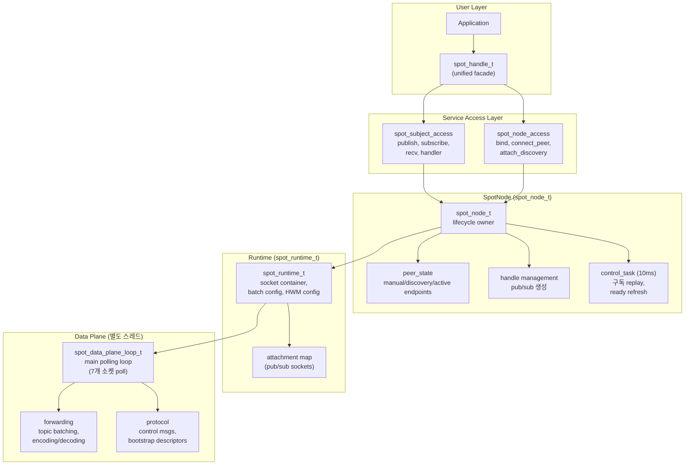

## 2. 내부 소켓 토폴로지

SpotNode는 10개의 내부 소켓을 inproc endpoint로 연결하고,
연결 상태 추적용 monitor 소켓 1개를 추가로 생성한다 (총 11개).

### 2.1 소켓 목록

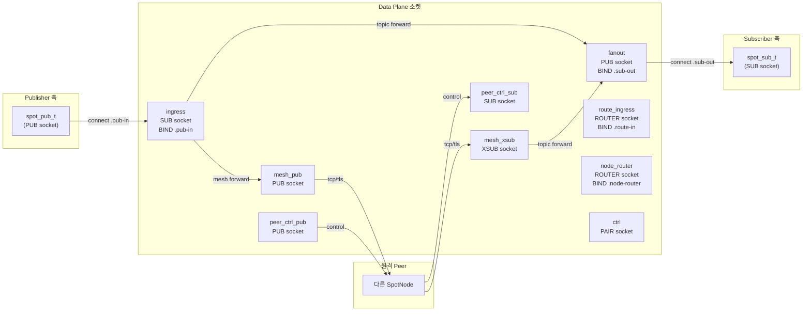

### 2.2 소켓 상세

| 소켓 | 타입 | Endpoint | Bind/Connect | HWM | 역할 |
|------|------|----------|-------------|-----|------|
| `ingress` | SUB | `.pub-in` | BIND | `node_sub_rcvhwm` | 모든 로컬 publish 수신 |
| `fanout` | PUB | `.sub-out` | BIND | `node_pub_sndhwm` | 로컬 subscriber에게 분배 |
| `mesh_pub` | PUB | (bound endpoint) | BIND | `node_pub_sndhwm` | 원격 peer에 토픽 송신 |
| `mesh_xsub` | XSUB | — | CONNECT to peers | `node_sub_rcvhwm` | 원격 peer에서 토픽 수신 |
| `route_ingress` | ROUTER | `.route-in` | BIND | `routed_recv_hwm` | app에서 routed 메시지 수신 |
| `node_router` | ROUTER | `.node-router` | BIND | `routed_send/recv_hwm` | app에 routed 메시지 전달 |
| `ctrl` | PAIR | `.ctrl` | CONNECT | — | control plane ↔ data plane 명령 |
| `peer_ctrl_pub` | PUB | (derived from bound) | BIND | 1024 | peer에 제어 메시지 송신 |
| `peer_ctrl_sub` | SUB | — | CONNECT to peers | 1024 | peer에서 제어 메시지 수신 |
| `mesh_xsub_monitor` | Monitor | — | — | — | CONNECTION_READY/DISCONNECTED 추적 |

모든 inproc endpoint 패턴: `inproc://zlink.spot.{node_id}.{suffix}`

### 2.3 공통 소켓 설정

모든 data plane 소켓 공통:
- `LINGER = 0`
- `SNDTIMEO = -1` (blocking)
- `ingress`: `SUBSCRIBE = ""` (모든 토픽 수신)
- `fanout`: `XPUB_NODROP = 1` (slow subscriber에 드롭하지 않음; 내부 PUB 소켓에 적용)
- `peer_ctrl_sub`: `SUBSCRIBE = "__zlink.spot.ctrl."` (제어 접두어만)

## 3. Pub/Sub Attachment

사용자 facing `spot_pub_t`와 `spot_sub_t`는 별도 attachment 소켓으로 data plane에 연결한다.

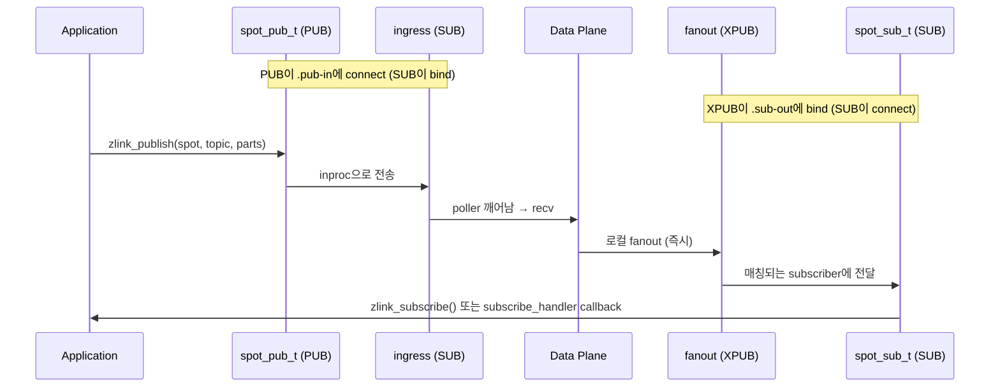

### Attachment 생성

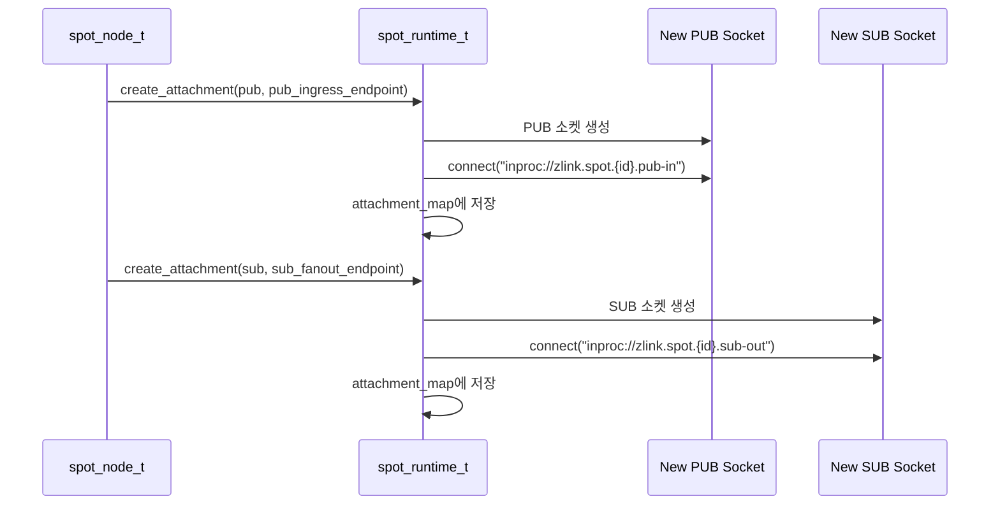

## 4. 토픽 메시지 흐름 (상세)

### 4.1 로컬 Publish → 로컬 Subscribe

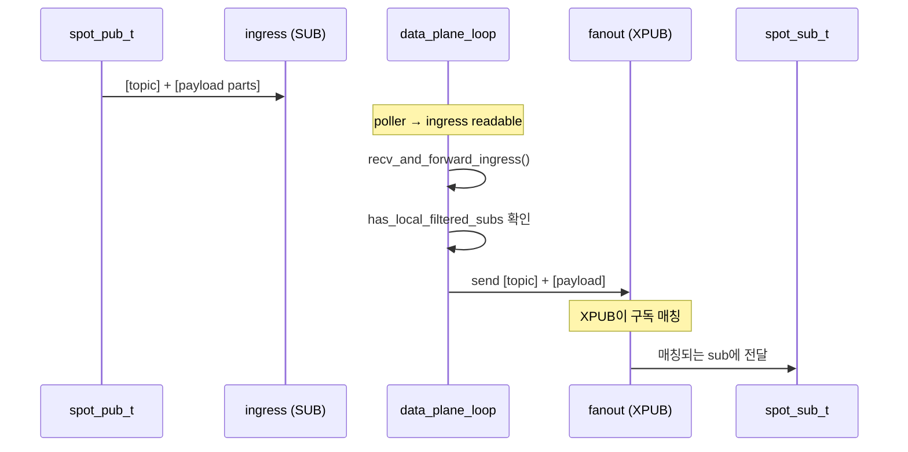

### 4.2 로컬 Publish → 원격 Peer

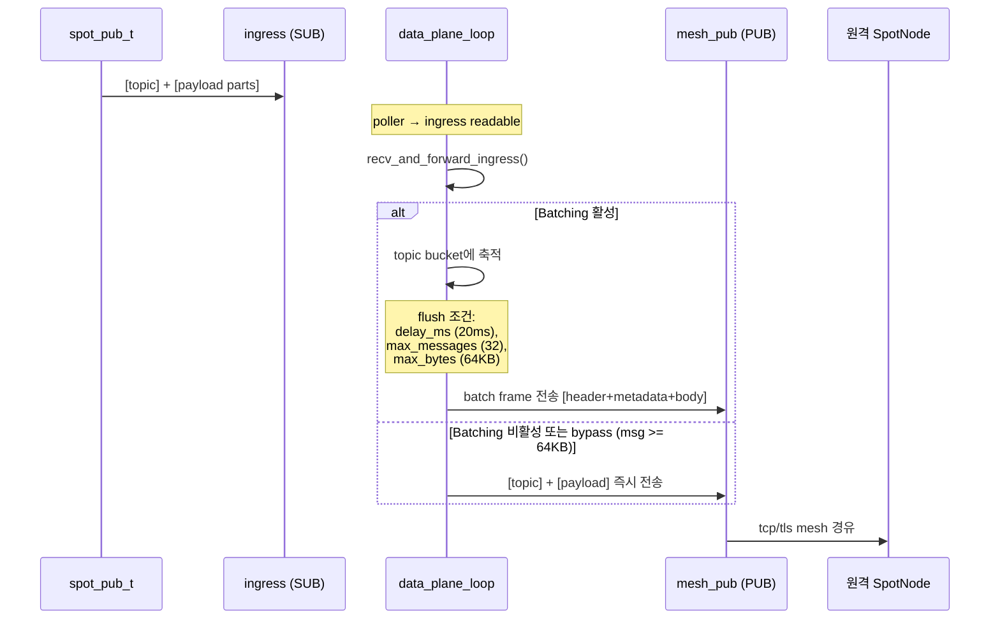

### 4.3 원격 수신 → 로컬 Subscribe

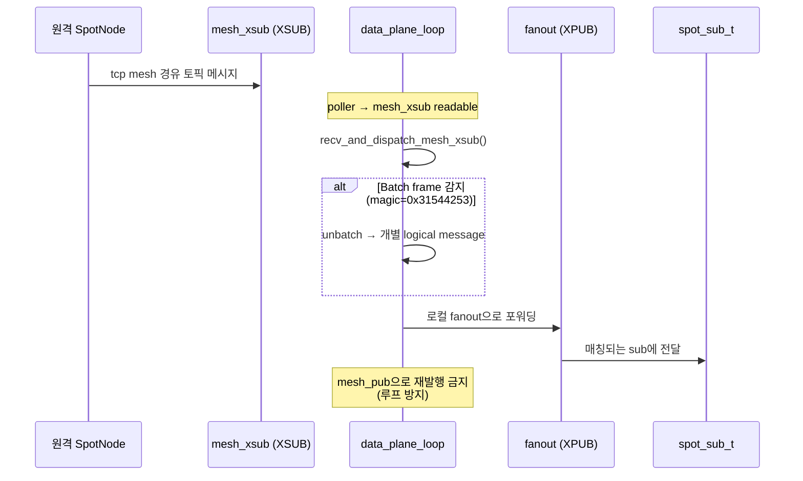

## 5. Routed 메시지 흐름 (상세)

### 5.1 로컬 spot → 로컬 spot (같은 노드)

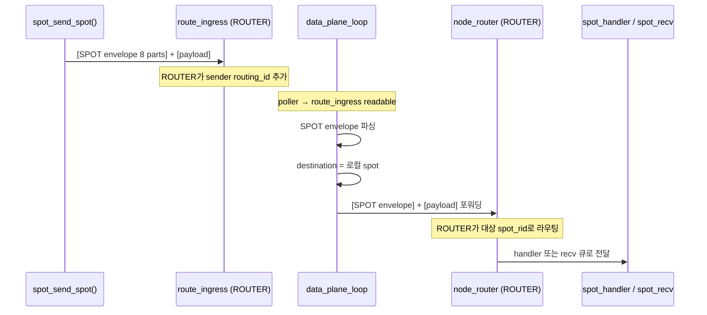

### 5.2 로컬 spot → 원격 spot (노드 간)

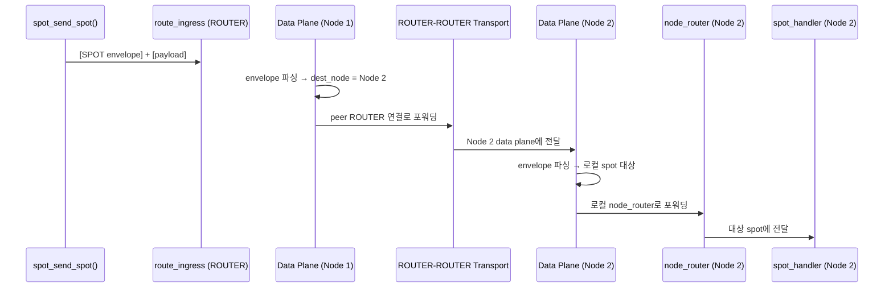

### 5.3 spot → router / router → spot

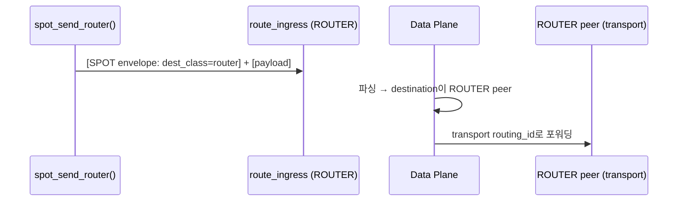

## 6. Control Plane

### 6.1 Control Task 주기 (10ms)

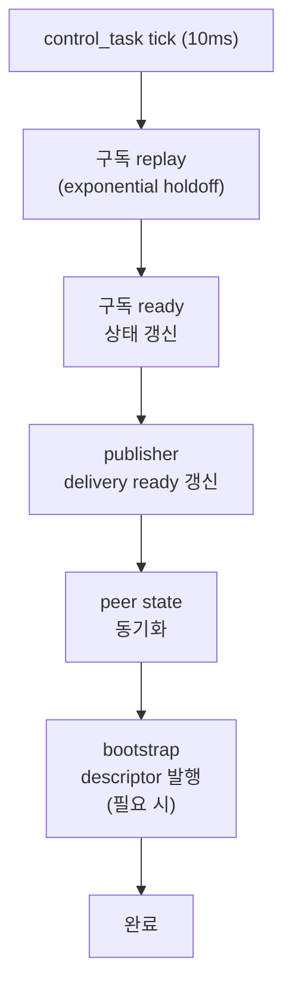

### 6.2 Peer 제어 메시지

Peer 제어 endpoint는 바인드된 데이터 endpoint에서 파생된다:

| Transport | Data Endpoint | Control Endpoint |
|-----------|--------------|-----------------|
| tcp | `tcp://host:9000` | `tcp://host:10000` (port+1000) |
| tls | `tls://host:9000` | `tls://host:10000` |
| ipc | `ipc:///path` | `ipc:///path.zlink-spot-ctrl.{id}` |
| inproc | `inproc://name` | `inproc://zlink.spot.peer-ctrl.{id}` |

제어 메시지 접두어:
- `__zlink.spot.ctrl.snapshot` — 상태 스냅샷
- `__zlink.spot.ctrl.ready_ack` — 구독 준비 확인
- `__zlink.spot.bootstrap.ctrl_descriptor` — bootstrap 정보

## 7. Data Plane Polling Loop

Data plane은 별도 스레드에서 실행되며 7개 소켓을 poll한다:

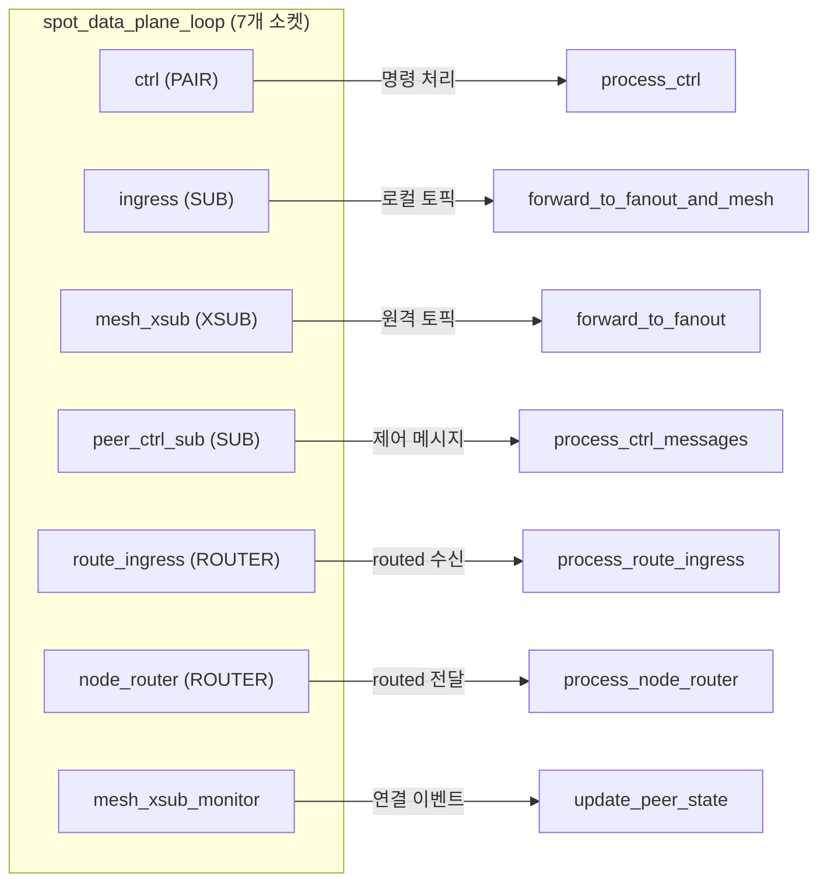

## 8. Unified Handle (spot_handle_t)

```cpp
struct spot_handle_t {
    uint32_t tag;                                // 검증 태그
    spot_node_t *node;                           // 부모 SpotNode
    spot_pub_t *pub;                             // Publisher (inproc PUB → ingress)
    spot_sub_t *sub;                             // Subscriber (inproc SUB ← fanout)
    zlink_subscribe_handler_fn handler;          // 토픽 callback
    void *handler_userdata;
    spot_node_t::pub_defaults_t pending_pub_defaults;
    spot_node_t::sub_defaults_t pending_sub_defaults;
    service_mode_state_t mode_state;             // recv/callback 모드 추적
    std::shared_ptr<void> request_reply_state;   // handle별 RR state
};
```

Unified handle은 SpotNode를 빌린다. 여러 handle이 하나의 node를 공유할 수 있다.
각 handle은 자신만의 pub/sub 쌍, mode state, request-reply state를 갖는다.

## 9. HWM 경계

```text
+------------------------------------------------------------------+
|  Spot Handle HWM                                                  |
|  (public facade pub/sub 소켓)                                      |
|  ┌──────────────────────────────────────────────────────────────┐ |
|  │  SpotNode Data-Plane HWM                                     │ |
|  │  ┌─────────────────────────┬────────────────────────────┐    │ |
|  │  │  SNDHWM 적용 대상:       │  RCVHWM 적용 대상:          │    │ |
|  │  │  - fanout (PUB)         │  - ingress (SUB)            │    │ |
|  │  │  - mesh_pub (PUB)       │  - mesh_xsub (XSUB)        │    │ |
|  │  │  - node_router (SND)    │  - route_ingress (ROUTER)   │    │ |
|  │  │                         │  - node_router (RCV)        │    │ |
|  │  └─────────────────────────┴────────────────────────────┘    │ |
|  │                                                               �� |
|  │  peer_ctrl은 CONTROL PLANE → 별도 HWM (1024)                 │ |
|  └──────────────────────────────────────────────────────────────┘ |
+------------------------------------------------------------------+
```

기본 내부 data-plane HWM: `1000`

Topic과 routed HWM은 `zlink_set_spot_node_option()`으로 독립 설정 가능:
- `ZLINK_SPOT_NODE_OPT_TOPIC_SNDHWM` / `ZLINK_SPOT_NODE_OPT_TOPIC_RCVHWM`
- `ZLINK_SPOT_NODE_OPT_ROUTED_SNDHWM` / `ZLINK_SPOT_NODE_OPT_ROUTED_RCVHWM`
