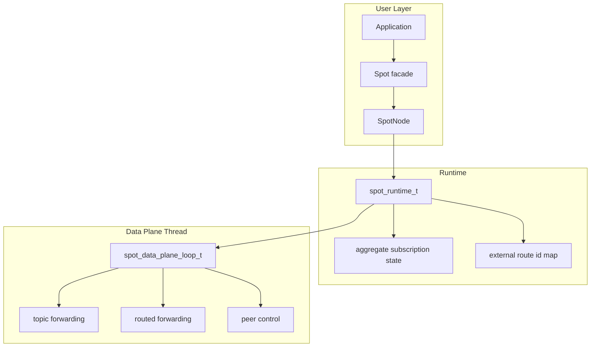
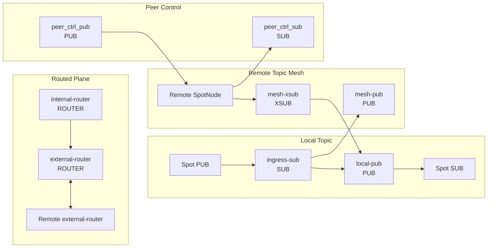
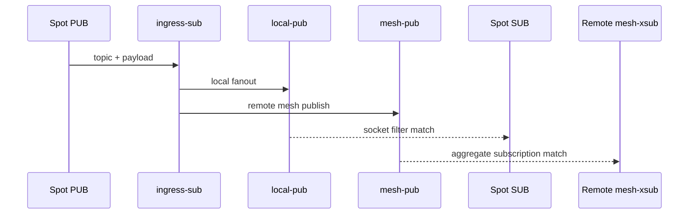
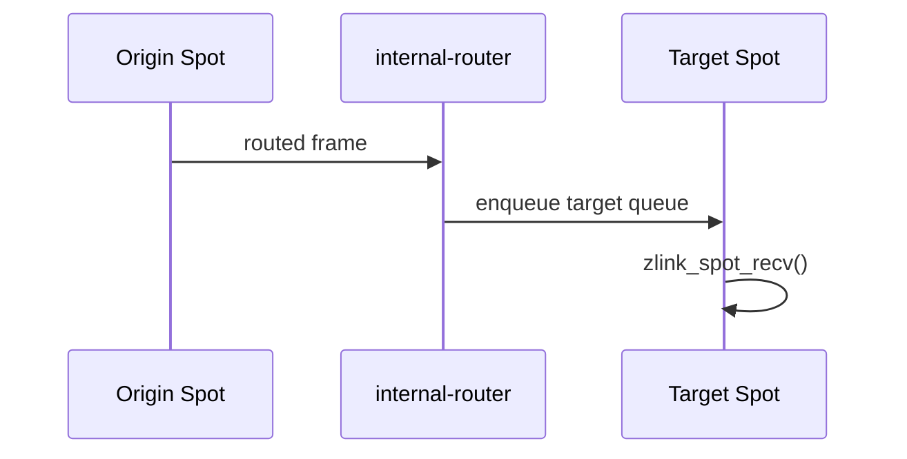
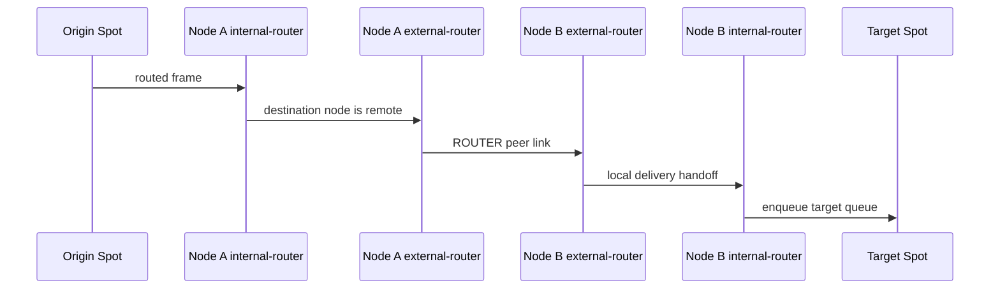

[English](spot-internals.md) | [한국어](spot-internals.ko.md)

# SPOT / SpotNode 내부 아키텍처

이 문서는 core 유지보수자가 SPOT 내부 배선과 데이터 흐름을 빠르게 파악하도록
돕는 내부 문서다. 공개 API 계약은
[`doc/spec/core/service/spot.ko.md`](../spec/core/service/spot.ko.md)를 기준으로
본다.

## 1. 전체 구조



`SpotNode`는 lifecycle owner이고, `Spot`은 그 위에서 빌려 쓰는 데이터 평면
facade다. `Spot`을 닫아도 backing `SpotNode`는 자동으로 닫히지 않는다.

## 2. 내부 소켓 토폴로지

SpotNode는 mode에 필요한 socket 묶음만 만든다.

| mode | 생성되는 주요 plane |
|------|---------------------|
| `PUBSUB` | topic publish/subscribe, peer control |
| `ROUTED` | routed delivery, peer control |
| `ALL` | topic, routed, peer control |

꺼진 plane은 snapshot 호출이나 꺼진 API의 첫 호출로도 생성되지 않는다.

### 2.1 주요 소켓



| 소켓 | 타입 | 역할 | HWM 옵션 축 |
|------|------|------|-------------|
| `ingress-sub` | `SUB` | local publish 입력 수신 | `ZLINK_SPOT_NODE_OPT_SUB_HWM` |
| `local-pub` | `PUB` | 같은 node 안의 subscriber로 fanout | `ZLINK_SPOT_NODE_OPT_PUB_HWM` |
| `mesh-pub` | `PUB` | remote node로 topic publish 전파 | `ZLINK_SPOT_NODE_OPT_PUB_HWM` |
| `mesh-xsub` | `XSUB` | remote node에서 topic publish 수신 | `ZLINK_SPOT_NODE_OPT_SUB_HWM` |
| `internal-router` | `ROUTER` | 같은 node 안의 target `Spot`으로 routed 전달 | routed send/recv HWM |
| `external-router` | `ROUTER` | peer node와 routed frame 송수신 | routed send/recv HWM |
| `peer_ctrl_pub` | `PUB` | peer control 송신 | control 기본값 |
| `peer_ctrl_sub` | `SUB` | peer control 수신 | control 기본값 |

`zlink_spot_node_internal_sockets_snapshot()`은 실제 존재하는 socket만 반환한다.
perf의 `Auto-HWM spotnode` 표도 이 snapshot 이름을 그대로 사용한다.

## 3. Topic plane

topic plane은 local과 remote 모두 socket의 기본 subscription filter를 사용한다.
runtime은 publish 시점에 target index를 조회하지 않는다.



local subscriber의 실제 topic matching은 각 `Spot SUB`의 `SUBSCRIBE` 상태가 맡는다.
remote 전달의 matching은 peer node의 `mesh-xsub` aggregate subscription 상태가
맡는다.

### 3.1 Aggregate subscription 수명

runtime은 remote mesh에 반영할 node 단위 구독 수명을 따로 관리한다.

| 상태 | 자료구조 | 의미 |
|------|----------|------|
| exact topic | `topic -> refcount` | 같은 exact topic을 원하는 local subscriber 수 |
| prefix | `prefix -> refcount` | 같은 prefix를 원하는 local subscriber 수 |

규칙은 단순하다.

1. refcount가 `0 -> 1`이 될 때만 remote aggregate subscribe를 보낸다.
2. refcount가 `1 -> 0`이 될 때만 remote aggregate unsubscribe를 보낸다.
3. 중간 증가와 감소는 local 상태만 바꾸며 remote mesh에는 중복 명령을 보내지 않는다.

이 규칙 때문에 같은 node 안의 여러 `Spot`이 같은 topic을 구독해도 remote peer에는
하나의 node 대표 구독만 보인다.

## 4. Routed plane

routed plane은 두 router 축으로 고정된다.

| router | 범위 | 역할 |
|--------|------|------|
| `internal-router` | node 내부 | target `Spot`의 routed recv queue로 전달 |
| `external-router` | node 간 | peer node의 `external-router`와 ROUTER 링크로 송수신 |

별도 routed ingress broker나 topic mesh 우회 경로는 없다. local routed delivery는
`internal-router`, remote routed delivery는 `external-router`를 기준으로 추적한다.

### 4.1 Local routed delivery



target `Spot` queue가 hard limit을 넘으면 해당 routed target만 disconnected 상태가
된다. node 전체를 닫거나 peer 연결을 끊지 않는다.

### 4.2 Remote routed delivery



remote routed delivery는 peer별 external route id map을 사용한다. 이 map은
`spot_runtime_t` 내부 메서드를 통해서만 갱신한다. 호출자는 map 구조나 lock 규칙을
알 필요가 없다.

## 5. Queue hard limit

SPOT은 느린 소비자 때문에 node 전체가 막히지 않도록 delivery target 단위 hard
limit을 둔다.

| 옵션 | 기본값 | 적용 대상 |
|------|--------|-----------|
| `ZLINK_SPOT_NODE_OPT_SUB_QUEUE_HARD_LIMIT` | `100` | local subscribe delivery target |
| `ZLINK_SPOT_NODE_OPT_ROUTED_QUEUE_HARD_LIMIT` | `500` | routed delivery target |

limit 초과 시 해당 target만 disconnected로 표시한다. 상태 집계는
`zlink_spot_node_status_t`의 아래 필드에 반영된다.

- `disconnected_sub_target_count`
- `disconnected_routed_target_count`

## 6. Auto-HWM 적용

SpotNode의 topic socket은 pub/sub 역할에 따라 HWM 축이 갈린다.

| 옵션 | 적용 socket |
|------|-------------|
| `ZLINK_SPOT_NODE_OPT_PUB_HWM` | `local-pub`, `mesh-pub` |
| `ZLINK_SPOT_NODE_OPT_SUB_HWM` | `ingress-sub`, `mesh-xsub` |
| `ZLINK_SPOT_NODE_OPT_ROUTED_SEND_HWM` | `internal-router`, `external-router` send 축 |
| `ZLINK_SPOT_NODE_OPT_ROUTED_RECV_HWM` | `internal-router`, `external-router` recv 축 |

수동 옵션이 없으면 context auto HWM 정책이 현재 socket policy class, 연결 수,
메시지 단위, profile을 기준으로 값을 계산한다. `local-pub`과 `mesh-pub`은
`spot_data`, `ingress-sub`과 `mesh-xsub`는 `recv_ingress`,
`internal-router`와 `external-router`는 `routed`, `peer_ctrl_pub/sub`는
`control`로 계산한다.

SPOT publish 큐 계획은 effective publish fanout을 쓴다.

```text
publish_fanout_limit = max(1, ZLINK_CTX_OPT_AUTO_HWM_SPOT_BOOTSTRAP)
candidate_publish_targets =
  max(local_sub_spot_count, active_peer_count, observed_scope_count)
effective_publish_fanout =
  max(1, min(candidate_publish_targets, publish_fanout_limit))
```

전체 spot 수는 metadata 부담이지 fanout queue count가 아니다. perf runner는
`core/build` runtime을 사용하고, 실행 전에 해석된 `libzlink` 경로를 출력해야 한다.

## 7. Control plane

peer control plane은 data plane과 분리된 작은 메시지 흐름이다. 주요 목적은 아래와
같다.

- peer bootstrap 정보 전달
- ready 상태 refresh
- aggregate subscription replay
- peer 연결 상태 반영

control socket은 데이터 payload HWM 계산과 별도 메시지 단위를 사용할 수 있다. perf
표에서 같은 payload 크기 블록 안에 다른 `MsgUnit(B)` 값이 보이면 control plane과
data plane 기준이 다르기 때문이다.
